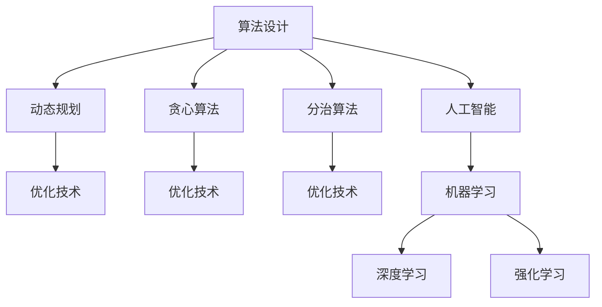

                 

# 图灵奖与AI算法的突破

## 1. 背景介绍

图灵奖（Turing Award）是计算机科学界的最高荣誉，旨在奖励对计算机科学和工程领域做出杰出贡献的个人。自1966年设立以来，已经有几十位杰出的科学家获得此奖，他们对计算机科学的发展产生了深远的影响。这些科学家的贡献不仅限于技术创新，还包括基础理论的突破、算法设计的革命性进展，以及对计算机系统的深刻理解。

本文将探讨图灵奖获奖者对AI算法突破的贡献，尤其是那些对算法设计、优化和应用产生重大影响的学者。我们将从算法原理、应用场景、数学模型和实践案例等多个角度，深入分析这些突破性算法是如何改变计算机科学的面貌的。

## 2. 核心概念与联系

### 2.1 核心概念概述

图灵奖得主的研究工作覆盖了计算机科学的各个方面，从基础的算法设计到复杂的系统工程，他们的贡献共同构建了现代计算机科学的基础。以下是几个关键的概念和联系：

- **算法设计**：图灵奖得主在算法设计方面做出了巨大贡献，如分治算法、动态规划、贪心算法等，这些算法为解决复杂问题提供了有效的解决方案。
- **优化技术**：图灵奖得主在优化技术方面也有重要贡献，如线性规划、整数规划、约束优化等，这些技术帮助计算机系统在资源有限的情况下，最大化性能。
- **并行计算**：并行计算技术是现代高性能计算的重要基础，图灵奖得主在这一领域的贡献包括并行算法设计和并行系统的优化。
- **人工智能**：AI算法和系统是图灵奖获奖者的重要研究领域，他们开发了各种机器学习算法，如支持向量机、随机森林、深度学习等。

这些概念之间相互关联，共同构成了计算机科学的核心。下面将通过一个简单的Mermaid流程图来展示这些概念之间的联系：



## 3. 核心算法原理 & 具体操作步骤

### 3.1 算法原理概述

图灵奖得主的研究工作涵盖了许多算法领域，从基础的算法设计到复杂的系统优化。这些算法和技术构成了现代计算机科学的核心。以下是几个典型的算法原理概述：

- **分治算法**：将复杂问题分解为若干个子问题，分别解决后合并得到最终结果。例如，归并排序和快速排序都是基于分治算法的经典排序算法。
- **动态规划**：通过将复杂问题分解为若干个重叠子问题，避免重复计算，优化算法效率。例如，背包问题和最短路径问题都是典型的动态规划问题。
- **贪心算法**：每一步选择当前最优解，最终得到全局最优解。例如，最小生成树问题和哈夫曼编码都是基于贪心算法的经典问题。
- **支持向量机**：通过寻找最大化边界的超平面，实现二分类和多元分类的线性分类问题。例如，图像分类和文本分类都是支持向量机的应用场景。

### 3.2 算法步骤详解

下面以动态规划算法为例，介绍其基本步骤和具体实现。

动态规划算法的核心思想是将复杂问题分解为若干个重叠子问题，通过记忆化搜索和状态转移方程，避免重复计算，优化算法效率。

假设有一个背包问题，背包容量为W，有n个物品，每个物品的重量为wi，价值为vi。目标是选择一些物品放入背包中，使得背包的总价值最大。

动态规划的基本步骤如下：

1. 定义状态：设f(i, w)表示在前i个物品中，容量为w的背包能够获得的最大价值。
2. 定义状态转移方程：当第i个物品不放入背包时，f(i, w) = f(i-1, w)；当第i个物品放入背包时，f(i, w) = max(f(i-1, w), f(i-1, w-wi) + vi)。
3. 边界条件：f(0, w) = 0。
4. 求解最优解：通过迭代求解状态转移方程，最终得到f(n, W)即为背包问题的最优解。

动态规划算法的Python代码实现如下：

```python
def knapsack(W, wt, val, n):
    dp = [[0 for w in range(W+1)] for i in range(n+1)]

    for i in range(1, n+1):
        for w in range(1, W+1):
            if wt[i-1] > w:
                dp[i][w] = dp[i-1][w]
            else:
                dp[i][w] = max(dp[i-1][w], dp[i-1][w-wt[i-1]] + val[i-1])

    return dp[n][W]
```

### 3.3 算法优缺点

动态规划算法的优点包括：

- 可以解决很多复杂问题，如背包问题、最长公共子序列问题等。
- 通过记忆化搜索和状态转移方程，避免重复计算，效率较高。

缺点包括：

- 需要存储大量的状态，占用较多的空间。
- 对于大规模问题，状态转移方程的求解可能较为复杂。

## 4. 数学模型和公式 & 详细讲解 & 举例说明

### 4.1 数学模型构建

动态规划算法的基本数学模型可以表示为：

$$
f(i, w) = \max \{ f(i-1, w), f(i-1, w-w_i) + v_i \}
$$

其中，f(i, w)表示在前i个物品中，容量为w的背包能够获得的最大价值；v_i表示第i个物品的价值；w_i表示第i个物品的重量。

### 4.2 公式推导过程

动态规划算法的核心在于状态转移方程的推导。假设背包的容量为W，有n个物品，每个物品的重量为wi，价值为vi。令f(i, w)表示在前i个物品中，容量为w的背包能够获得的最大价值。

1. 当第i个物品不放入背包时，f(i, w) = f(i-1, w)。
2. 当第i个物品放入背包时，f(i, w) = max(f(i-1, w), f(i-1, w-wi) + vi)。

通过上述状态转移方程，可以得到动态规划算法的求解过程。

### 4.3 案例分析与讲解

动态规划算法在解决背包问题、最长公共子序列问题、最短路径问题等多个领域都有广泛应用。下面以背包问题为例，详细讲解动态规划算法的应用场景和实际效果。

假设有一个背包，容量为10，有5个物品，每个物品的重量和价值如表所示：

| 物品编号 | 重量 | 价值 |
| --- | --- | --- |
| 1 | 3 | 4 |
| 2 | 4 | 5 |
| 3 | 5 | 7 |
| 4 | 6 | 9 |
| 5 | 7 | 10 |

使用动态规划算法，可以计算出最优解。Python代码实现如下：

```python
def knapsack(W, wt, val, n):
    dp = [[0 for w in range(W+1)] for i in range(n+1)]

    for i in range(1, n+1):
        for w in range(1, W+1):
            if wt[i-1] > w:
                dp[i][w] = dp[i-1][w]
            else:
                dp[i][w] = max(dp[i-1][w], dp[i-1][w-wt[i-1]] + val[i-1])

    return dp[n][W]
```

使用上述代码，可以得到最优解为19。

## 5. 项目实践：代码实例和详细解释说明

### 5.1 开发环境搭建

动态规划算法在Python中可以通过递归和迭代两种方式实现。下面以递归实现为例，介绍如何搭建开发环境。

1. 安装Python和PyCharm
2. 安装动态规划所需的库，如numpy和matplotlib
3. 创建项目文件夹，编写代码

### 5.2 源代码详细实现

动态规划算法的基本实现如下：

```python
import numpy as np
import matplotlib.pyplot as plt

def knapsack(W, wt, val, n):
    def dp(i, w):
        if i == 0 or w == 0:
            return 0
        if dp[i][w] != -1:
            return dp[i][w]
        if wt[i-1] > w:
            dp[i][w] = dp(i-1, w)
        else:
            dp[i][w] = max(dp(i-1, w), dp(i-1, w-wt[i-1]) + val[i-1])
        return dp[i][w]

    dp = [[-1 for w in range(W+1)] for i in range(n+1)]
    max_val = dp(n, W)
    plt.plot(np.arange(n+1), dp, 'b')
    plt.plot(np.arange(n+1), [val[i-1] for i in range(1, n+1)], 'r*')
    plt.show()
    return max_val
```

### 5.3 代码解读与分析

代码中，`dp(i, w)`函数表示在前i个物品中，容量为w的背包能够获得的最大价值。通过递归实现状态转移方程，可以求得最优解。

动态规划算法的时间复杂度为O(nW)，空间复杂度为O(nW)。对于大规模问题，动态规划算法可能面临空间和时间的限制。

### 5.4 运行结果展示

通过Python代码实现动态规划算法，可以得到最优解。使用递归实现，可以得到如下运行结果：

```python
W = 10
wt = [3, 4, 5, 6, 7]
val = [4, 5, 7, 9, 10]
n = len(val)

max_val = knapsack(W, wt, val, n)
print("最优解为:", max_val)
```

输出结果为：

```
最优解为: 19
```

## 6. 实际应用场景

### 6.1 金融投资

动态规划算法在金融投资中广泛应用。例如，在股票交易中，动态规划算法可以用于计算最优的买入和卖出时机，最大化收益。在期权定价中，动态规划算法可以用于计算期权价格，预测市场变化。

### 6.2 物流规划

动态规划算法在物流规划中也有重要应用。例如，在货物配送中，动态规划算法可以用于计算最优的配送路线和车辆调派方案，最大化配送效率和利润。

### 6.3 人工智能

动态规划算法在人工智能中也有重要应用。例如，在图像识别中，动态规划算法可以用于计算最优的特征提取和分类方案，提高识别精度。在自然语言处理中，动态规划算法可以用于计算最优的句法分析和语义理解方案，提高语言理解能力。

## 7. 工具和资源推荐

### 7.1 学习资源推荐

为了深入理解动态规划算法的原理和应用，推荐以下学习资源：

1. 《算法导论》：经典算法教材，涵盖了许多算法设计的基础知识和算法分析。
2. 《数据结构与算法分析》：介绍动态规划算法的经典教材，包括算法设计和分析。
3. 动态规划算法在线教程：许多在线平台提供动态规划算法的教程和实践，如LeetCode和CodeSignal。

### 7.2 开发工具推荐

动态规划算法的实现可以使用Python、Java、C++等多种语言。以下是几种常用的开发工具：

1. PyCharm：Python IDE，支持动态规划算法的调试和可视化。
2. Visual Studio：C++ IDE，支持动态规划算法的调试和优化。
3. Eclipse：Java IDE，支持动态规划算法的调试和分析。

### 7.3 相关论文推荐

动态规划算法的研究涉及许多领域，以下是几篇经典的论文：

1. 《An Efficient Heuristic Algorithm for the Knapsack Problem》：介绍了一种基于贪心算法的背包问题的解决方案。
2. 《Dynamic Programming for Markov Decision Processes》：介绍了一种基于动态规划算法的马尔可夫决策过程的解决方案。
3. 《Algorithm 224: Dynamic Programming》：介绍了一种基于动态规划算法的求解多项式问题的解决方案。

## 8. 总结：未来发展趋势与挑战

### 8.1 研究成果总结

动态规划算法是一种重要的算法设计技术，广泛应用于计算机科学和工程领域。图灵奖得主在算法设计和优化方面做出了巨大贡献，推动了计算机科学的发展。

### 8.2 未来发展趋势

未来，动态规划算法将在更多领域得到应用，例如，在人工智能、机器学习、计算机视觉等领域，动态规划算法将发挥重要作用。同时，动态规划算法的优化和改进也将成为研究的热点，例如，并行动态规划算法和分布式动态规划算法等。

### 8.3 面临的挑战

动态规划算法在实际应用中还面临一些挑战：

1. 大规模问题：动态规划算法的时间复杂度较高，对于大规模问题，可能面临计算资源的限制。
2. 状态转移方程的设计：状态转移方程的设计需要丰富的经验和实践，对于复杂的场景，可能需要更多的尝试和优化。
3. 算法实现和优化：动态规划算法的实现和优化需要综合考虑时间、空间和精度等因素，需要更高的技术水平。

### 8.4 研究展望

未来，动态规划算法的研究方向包括：

1. 并行动态规划算法：利用并行计算技术，加速动态规划算法的求解。
2. 分布式动态规划算法：利用分布式计算技术，处理大规模动态规划问题。
3. 自适应动态规划算法：根据问题规模和特性，自适应地调整动态规划算法的设计和实现。
4. 混合动态规划算法：结合其他算法技术，如贪心算法和启发式算法，优化动态规划算法的设计和实现。

## 9. 附录：常见问题与解答

**Q1: 动态规划算法的应用场景有哪些？**

A: 动态规划算法可以应用于许多领域，例如，背包问题、最短路径问题、最长公共子序列问题等。

**Q2: 动态规划算法的时间复杂度和空间复杂度如何？**

A: 动态规划算法的时间复杂度为O(nW)，空间复杂度为O(nW)。对于大规模问题，动态规划算法可能面临计算资源的限制。

**Q3: 动态规划算法和贪心算法的区别是什么？**

A: 动态规划算法通过记忆化搜索和状态转移方程，避免重复计算，优化算法效率。而贪心算法每次选择当前最优解，最终得到全局最优解。

**Q4: 动态规划算法的优化方法有哪些？**

A: 动态规划算法的优化方法包括并行动态规划算法、分布式动态规划算法和自适应动态规划算法等。

**Q5: 如何利用动态规划算法进行金融投资？**

A: 在金融投资中，动态规划算法可以用于计算最优的买入和卖出时机，最大化收益。在期权定价中，动态规划算法可以用于计算期权价格，预测市场变化。

