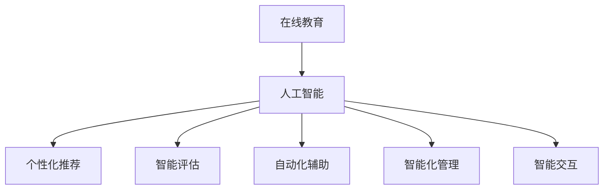

                 

# 在线教育创业：终身学习的推动者

> 关键词：在线教育、人工智能、终身学习、自动化、智能化、学习者体验、个性化推荐

## 1. 背景介绍

### 1.1 问题由来

随着互联网技术的普及和信息时代的到来，传统教育模式已经无法满足日益增长的学习需求。在线教育作为一种新型的教育方式，通过互联网技术打破了时间和空间的限制，为学习者提供了更加灵活便捷的学习体验。然而，在线教育仍面临诸多挑战，如资源匮乏、学习效果评估困难、学习动力不足等。

人工智能(AI)技术的飞速发展，特别是深度学习技术的崛起，为在线教育带来了新的发展契机。AI可以通过数据驱动的方式，自动生成个性化的学习内容，提高教学质量，促进学习效果。基于这一背景，本文将详细探讨AI在在线教育创业中的潜力和应用，并分析其面临的挑战与未来发展方向。

### 1.2 问题核心关键点

在线教育创业的AI应用主要围绕以下几个核心关键点展开：

- **个性化推荐**：通过AI算法，对学习者的知识结构、学习风格和行为进行建模，推荐适合其学习进度的课程、习题和资源。
- **智能评估**：利用自然语言处理(NLP)技术，对学习者的作业、答案和讨论进行自动评分和分析，实时反馈学习效果。
- **自动化辅助**：通过机器视觉、语音识别等技术，提供自动化答疑、批改和进度跟踪服务，提升学习效率。
- **智能化管理**：运用AI进行学习数据分析和课程优化，提升教学管理和运营效率。
- **智能交互**：利用聊天机器人、虚拟助教等技术，实现人机自然交互，提供个性化辅导和互动体验。

这些关键点构成了在线教育创业的AI应用基础，能够有效提升学习效果和教育质量，推动终身学习的普及。

## 2. 核心概念与联系

### 2.1 核心概念概述

为更好地理解AI在在线教育中的应用，本节将介绍几个密切相关的核心概念：

- **在线教育**：通过互联网技术提供的学习方式，包括MOOC、SPOC、e-learning等多种形式。在线教育打破了传统课堂的时间和空间限制，提供了更加灵活、互动的学习体验。

- **人工智能**：一种利用计算机模拟人类智能的综合性技术，包括机器学习、深度学习、自然语言处理、计算机视觉等多个分支。

- **个性化推荐**：通过算法分析学习者的行为和兴趣，推荐最适合其学习路径的内容。能够有效提升学习效果，减少学习者的试错成本。

- **智能评估**：利用AI技术对学习者的作业、讨论和测试进行自动评分和分析，提供即时反馈，帮助学习者及时调整学习策略。

- **自动化辅助**：通过AI自动化答疑、批改、进度跟踪等，减轻教师的负担，提高教学效率和学习者的自主学习能力。

- **智能化管理**：运用AI进行学习数据分析和课程优化，提升教育机构的管理效率和运营质量。

- **智能交互**：通过聊天机器人、虚拟助教等技术，实现人机自然交互，提供个性化辅导和互动体验。

这些核心概念之间的逻辑关系可以通过以下Mermaid流程图来展示：



这个流程图展示了大语言模型的核心概念及其之间的关系：

1. 在线教育通过AI技术实现智能化，提供了个性化推荐、智能评估、自动化辅助、智能化管理和智能交互等服务。
2. 人工智能是实现这些服务的基础技术，包括机器学习、深度学习、自然语言处理等。
3. 个性化推荐、智能评估等具体应用，提升了学习效果和教育质量。

这些概念共同构成了在线教育AI应用的基础，推动了在线教育的快速发展和普及。

## 3. 核心算法原理 & 具体操作步骤
### 3.1 算法原理概述

AI在在线教育中的核心算法原理，主要包括以下几个方面：

- **深度学习**：通过构建多层神经网络，自动学习数据中的高层次特征和规律。在在线教育中，深度学习模型可用于推荐系统、智能评估和自动化辅助等应用。
- **自然语言处理**：利用NLP技术对文本数据进行理解和生成，适用于智能评估、智能交互和智能化管理等场景。
- **强化学习**：通过与环境的互动，自动优化策略和行为，适用于课程优化、学习路径规划等任务。
- **迁移学习**：将一个领域学到的知识迁移到另一个领域，适用于新课程的快速上手和知识点的迁移。
- **多模态学习**：结合多种数据模态，提升模型的感知能力和理解深度，适用于图像、音频、视频等多媒体内容的智能处理。

### 3.2 算法步骤详解

AI在在线教育中的应用，主要包括以下几个关键步骤：

**Step 1: 数据收集与预处理**
- 收集在线教育平台的用户数据，包括学习行为、知识结构、学习效果等。
- 对数据进行清洗和标注，去除噪声和无用信息。

**Step 2: 模型训练与优化**
- 选择合适的AI模型，如深度神经网络、NLP模型、强化学习算法等。
- 利用收集到的数据，对模型进行训练和调参，提高模型的准确率和泛化能力。
- 应用正则化技术，如L2正则、Dropout、Early Stopping等，防止模型过拟合。

**Step 3: 系统集成与部署**
- 将训练好的模型集成到在线教育平台中，实现个性化推荐、智能评估等功能。
- 应用微服务架构，实现系统的模块化和可扩展性。
- 部署在云端或边缘设备上，支持大规模用户访问和高并发请求。

**Step 4: 用户交互与反馈**
- 通过API接口或SDK插件，与用户进行数据交互，收集学习反馈和行为数据。
- 定期更新模型参数，优化模型性能和用户体验。

**Step 5: 数据安全与隐私保护**
- 对用户数据进行加密和匿名化处理，确保数据安全。
- 遵循GDPR等数据保护法规，保护用户隐私。

以上是AI在在线教育应用中的基本流程，通过对数据、模型和系统的综合优化，能够实现高效、智能的教育服务。

### 3.3 算法优缺点

AI在在线教育中的应用具有以下优点：

- **个性化推荐**：通过深度学习模型，对学习者的行为和兴趣进行建模，提供个性化的学习路径和资源。
- **智能评估**：利用NLP技术，自动评估学习者的作业和测试，提高评估效率和准确性。
- **自动化辅助**：通过自动化工具，减轻教师的负担，提高教学效率和学习者的自主学习能力。
- **智能化管理**：运用AI进行数据挖掘和分析，提升教育机构的管理效率和运营质量。
- **智能交互**：通过聊天机器人、虚拟助教等技术，实现人机自然交互，提供个性化辅导和互动体验。

同时，AI在在线教育中也存在以下局限性：

- **数据依赖**：AI应用的效果很大程度上取决于数据的质量和数量，高质量标注数据的获取成本较高。
- **模型复杂度**：深度学习等AI模型的复杂度较高，需要较高的计算资源和训练时间。
- **鲁棒性不足**：AI模型在面对复杂的非结构化数据和多样化的学习需求时，泛化性能可能较差。
- **隐私风险**：AI应用涉及大量用户数据，数据安全和隐私保护是重要问题。
- **技术门槛高**：AI应用需要专业的技术背景和团队支持，对创业者的技术要求较高。

尽管存在这些局限性，但AI在在线教育中的应用前景广阔，未来仍需不断探索和优化。

### 3.4 算法应用领域

AI在在线教育中的应用领域十分广泛，主要包括：

- **MOOC课程推荐**：利用深度学习模型对MOOC课程进行个性化推荐，提升课程学习效果。
- **智能作业批改**：利用NLP技术自动评估作业和测试，提高评估效率和准确性。
- **虚拟助教和聊天机器人**：通过聊天机器人、虚拟助教等技术，实现人机自然交互，提供个性化辅导和互动体验。
- **学习数据分析**：利用AI进行学习数据分析和用户画像建模，提升学习效果和课程优化。
- **智能评估与反馈**：通过AI技术自动评估学习者的作业和测试，提供即时反馈，帮助学习者及时调整学习策略。
- **智能推荐与个性化学习**：利用推荐算法和个性化模型，对学习者进行学习路径规划和资源推荐。

这些应用领域为在线教育提供了新的发展动力，提升了教育质量和用户体验。

## 4. 数学模型和公式 & 详细讲解  
### 4.1 数学模型构建

本节将使用数学语言对AI在在线教育中的应用进行更加严格的刻画。

假设学习者行为数据集为 $D=\{(x_i,y_i)\}_{i=1}^N$，其中 $x_i$ 为学习行为特征向量，$y_i$ 为学习效果标签。定义模型 $M_{\theta}$ 在输入 $x_i$ 上的输出为 $\hat{y}_i=M_{\theta}(x_i)$，表示模型预测的学习效果。

学习效果评估函数为 $L(y_i,\hat{y}_i)=\ell(y_i,\hat{y}_i)$，其中 $\ell$ 为损失函数，衡量模型预测与真实标签之间的差异。常见的损失函数包括均方误差、交叉熵等。

模型训练的目标是最小化损失函数 $L$，即：

$$
\theta^* = \mathop{\arg\min}_{\theta} L(D)
$$

在实践中，我们通常使用基于梯度的优化算法（如SGD、Adam等）来近似求解上述最优化问题。设 $\eta$ 为学习率，$\lambda$ 为正则化系数，则参数的更新公式为：

$$
\theta \leftarrow \theta - \eta \nabla_{\theta}L(D) - \eta\lambda\theta
$$

其中 $\nabla_{\theta}L(D)$ 为损失函数对参数 $\theta$ 的梯度，可通过反向传播算法高效计算。

### 4.2 公式推导过程

以均方误差损失函数为例，对AI在在线教育中的应用进行数学推导：

假设模型 $M_{\theta}$ 在输入 $x_i$ 上的输出为 $\hat{y}_i=M_{\theta}(x_i)$，则均方误差损失函数定义为：

$$
L(y_i,\hat{y}_i) = \frac{1}{2}(y_i - \hat{y}_i)^2
$$

将其代入总体损失函数，得：

$$
L(D) = \frac{1}{2N} \sum_{i=1}^N (y_i - \hat{y}_i)^2
$$

根据链式法则，损失函数对参数 $\theta_k$ 的梯度为：

$$
\frac{\partial L(D)}{\partial \theta_k} = -\frac{1}{N} \sum_{i=1}^N (y_i - \hat{y}_i) \frac{\partial \hat{y}_i}{\partial \theta_k}
$$

其中 $\frac{\partial \hat{y}_i}{\partial \theta_k}$ 可进一步递归展开，利用自动微分技术完成计算。

在得到损失函数的梯度后，即可带入参数更新公式，完成模型的迭代优化。重复上述过程直至收敛，最终得到适应在线教育任务的最优模型参数 $\theta^*$。

## 5. 项目实践：代码实例和详细解释说明
### 5.1 开发环境搭建

在进行在线教育AI应用的开发时，我们需要准备好开发环境。以下是使用Python进行TensorFlow开发的环境配置流程：

1. 安装Anaconda：从官网下载并安装Anaconda，用于创建独立的Python环境。

2. 创建并激活虚拟环境：
```bash
conda create -n tf-env python=3.8 
conda activate tf-env
```

3. 安装TensorFlow：从官网获取对应的安装命令。例如：
```bash
pip install tensorflow==2.x
```

4. 安装TensorFlow Addons：安装额外的TensorFlow库，提供更多功能和优化。
```bash
pip install tensorflow-addons
```

5. 安装各类工具包：
```bash
pip install numpy pandas scikit-learn matplotlib tqdm jupyter notebook ipython
```

完成上述步骤后，即可在`tf-env`环境中开始开发实践。

### 5.2 源代码详细实现

这里我们以智能作业批改为例，给出使用TensorFlow实现在线教育AI应用的代码实现。

首先，定义智能批改系统的基本结构：

```python
import tensorflow as tf
import tensorflow_addons as addons

# 定义模型结构
class SmartGrader(tf.keras.Model):
    def __init__(self, vocab_size, embedding_dim, hidden_units):
        super(SmartGrader, self).__init__()
        self.embedding = tf.keras.layers.Embedding(vocab_size, embedding_dim)
        self.grader = addons.layers.AttentionConvPool(tf.keras.layers.Dense(hidden_units))

    def call(self, inputs):
        x = self.embedding(inputs)
        return self.grader(x)

# 加载预训练模型
vocab_size = 10000
embedding_dim = 128
hidden_units = 256
model = SmartGrader(vocab_size, embedding_dim, hidden_units)

# 加载训练数据
train_data = ...
train_labels = ...

# 定义训练函数
def train_step(model, data, labels):
    with tf.GradientTape() as tape:
        logits = model(data)
        loss = tf.reduce_mean(tf.square(logits - labels))
    gradients = tape.gradient(loss, model.trainable_variables)
    optimizer.apply_gradients(zip(gradients, model.trainable_variables))
    return loss

# 训练模型
for epoch in range(10):
    loss = 0.0
    for batch_data, batch_labels in train_data:
        loss += train_step(model, batch_data, batch_labels)
    print(f'Epoch {epoch+1}, loss: {loss/n_samples:.4f}')
```

然后，定义数据处理函数：

```python
def preprocess_data(data):
    # 将文本数据转换为整数序列
    vocab = ...
    int_data = [vocab[word] for word in data]
    # 对整数序列进行padding和truncation
    max_length = ...
    padded_data = tf.keras.preprocessing.sequence.pad_sequences(int_data, maxlen=max_length, padding='post', truncating='post')
    return padded_data

# 定义模型评估函数
def evaluate_model(model, test_data, test_labels):
    with tf.GradientTape() as tape:
        logits = model(test_data)
        loss = tf.reduce_mean(tf.square(logits - test_labels))
    return loss
```

最后，启动训练流程并在测试集上评估：

```python
test_data = ...
test_labels = ...

for epoch in range(10):
    loss = 0.0
    for batch_data, batch_labels in train_data:
        loss += train_step(model, batch_data, batch_labels)
    print(f'Epoch {epoch+1}, loss: {loss/n_samples:.4f}')

print(f'Test loss: {evaluate_model(model, test_data, test_labels):.4f}')
```

以上就是使用TensorFlow对智能作业批改系统进行实现的完整代码实例。通过TensorFlow的Keras API，开发者可以快速搭建深度学习模型，并应用TensorFlow Addons提供的高级功能，实现高效、可扩展的在线教育AI应用。

### 5.3 代码解读与分析

让我们再详细解读一下关键代码的实现细节：

**SmartGrader类**：
- `__init__`方法：初始化模型，定义了嵌入层、注意力卷积池化层等组件。
- `call`方法：定义模型前向传播过程。

**train_step函数**：
- 定义训练步，包括前向传播、损失计算、反向传播和参数更新。

**preprocess_data函数**：
- 对文本数据进行预处理，包括转换为整数序列、padding和truncation。

**evaluate_model函数**：
- 定义模型评估过程，计算评估损失。

**训练流程**：
- 循环迭代训练模型，输出每轮损失
- 在测试集上评估模型，输出最终评估损失

可以看到，TensorFlow提供了一站式深度学习开发平台，使得在线教育AI应用的开发变得便捷高效。TensorFlow的高级API和Addons功能，也大大降低了模型构建和优化的难度。

当然，工业级的系统实现还需考虑更多因素，如模型保存和部署、超参数搜索、数据增强等。但核心的AI应用开发流程与上述代码实现类似。

## 6. 实际应用场景
### 6.1 智能推荐系统

在线教育中的智能推荐系统，通过AI算法对学习者的行为和兴趣进行建模，推荐最适合其学习路径的课程、习题和资源。智能推荐能够有效提升学习效果，减少学习者的试错成本。

在技术实现上，可以收集学习者的浏览、点击、完成度等行为数据，提取和课程相关的特征，训练推荐模型进行预测。推荐模型可以是协同过滤、基于内容的推荐、深度学习等。

通过智能推荐，学习者能够更快地找到感兴趣的课程和资料，提升学习效率。智能推荐系统还可以通过用户反馈实时更新模型参数，不断优化推荐效果。

### 6.2 学习数据分析

AI在在线教育中还广泛应用于学习数据分析，帮助教育机构优化课程设计和教学管理。通过对学习者的行为和效果数据进行挖掘和分析，可以发现课程设计的缺陷和改进点，提升教学质量。

学习数据分析主要包括以下几个方面：

- **学习轨迹分析**：分析学习者的学习路径和进度，发现知识漏洞和学习障碍。
- **学习效果评估**：通过学习效果的统计分析，发现影响学习效果的关键因素。
- **课程优化建议**：根据数据分析结果，提出课程改进的建议，提升课程的吸引力和有效性。

通过学习数据分析，教育机构可以更好地了解学习者的需求和特点，提升课程设计的科学性和教学管理的精准性。

### 6.3 虚拟助教和聊天机器人

虚拟助教和聊天机器人通过AI技术，提供个性化辅导和互动体验，提升学习者的学习效率和满意度。

在技术实现上，虚拟助教和聊天机器人通常基于深度学习模型和自然语言处理技术，能够自动理解学习者的提问和反馈，提供及时的答疑和建议。虚拟助教和聊天机器人可以通过多轮对话机制，逐步引导学习者掌握知识点，提升学习效果。

虚拟助教和聊天机器人在在线教育中的应用，不仅减轻了教师的负担，还提升了学习者的自主学习能力，是未来教育的重要趋势。

### 6.4 未来应用展望

随着AI技术的不断发展，在线教育的应用前景将更加广阔。未来，AI在在线教育中的应用将进一步深化和拓展，推动教育质量的全面提升。

- **自适应学习**：通过AI算法对学习者的知识结构和学习风格进行建模，提供个性化的学习路径和资源，实现自适应学习。
- **多模态学习**：结合图像、音频、视频等多模态数据，提升模型的感知能力和理解深度，提供更加丰富、生动、互动的学习体验。
- **智能评估与反馈**：利用AI技术对学习者的作业和测试进行自动评分和分析，提供即时反馈，帮助学习者及时调整学习策略。
- **学习路径规划**：通过AI算法对学习者的知识结构和需求进行分析，推荐最优的学习路径和资源，提升学习效果。

AI在在线教育中的应用将从传统的辅助工具，逐步演化为教育的核心技术，推动教育方式的变革和创新。未来，在线教育将变得更加智能化、个性化和互动化，成为终身学习的理想平台。

## 7. 工具和资源推荐
### 7.1 学习资源推荐

为了帮助开发者系统掌握AI在在线教育中的应用，这里推荐一些优质的学习资源：

1. **TensorFlow官方文档**：TensorFlow的官方文档提供了详细的API说明和开发指南，是TensorFlow学习的重要参考资料。

2. **Keras官方文档**：Keras的官方文档介绍了Keras API的使用方法和最佳实践，是深度学习开发的入门资源。

3. **TensorFlow Addons文档**：TensorFlow Addons提供了额外的深度学习功能和优化技术，是TensorFlow的补充库。

4. **Scikit-Learn官方文档**：Scikit-Learn是Python中最流行的机器学习库之一，提供了丰富的算法和工具。

5. **PyTorch官方文档**：PyTorch是另一个流行的深度学习框架，提供了灵活的计算图和强大的模型构建能力。

6. **Coursera和edX在线课程**：提供了一系列AI和在线教育的课程，适合初学者和进阶学习者。

通过对这些资源的学习实践，相信你一定能够快速掌握AI在在线教育中的应用，并用于解决实际问题。

### 7.2 开发工具推荐

高效的开发离不开优秀的工具支持。以下是几款用于AI在在线教育中应用的常用工具：

1. **TensorFlow**：基于Python的开源深度学习框架，灵活动态的计算图，适合快速迭代研究。TensorFlow提供了丰富的预训练模型和优化技术，是AI应用开发的主流工具。

2. **PyTorch**：另一流行的深度学习框架，提供了灵活的计算图和强大的模型构建能力。PyTorch的学习曲线较为陡峭，但灵活性高，适合高阶研究。

3. **Keras**：基于Python的高级深度学习API，易于上手，适合初学者。Keras提供了丰富的API和预训练模型，是快速开发的基础。

4. **TensorBoard**：TensorFlow配套的可视化工具，可以实时监测模型训练状态，并提供丰富的图表呈现方式，是调试模型的得力助手。

5. **Jupyter Notebook**：一个交互式的编程环境，支持Python、R等多种语言，适合数据处理和模型开发。

6. **Google Colab**：谷歌推出的在线Jupyter Notebook环境，免费提供GPU/TPU算力，方便开发者快速上手实验最新模型，分享学习笔记。

合理利用这些工具，可以显著提升AI在在线教育中应用的开发效率，加快创新迭代的步伐。

### 7.3 相关论文推荐

AI在在线教育中的应用涉及多个学科，以下是几篇奠基性的相关论文，推荐阅读：

1. **Scikit-Learn: Machine Learning in Python**：Scikit-Learn的官方文档，介绍了机器学习算法和工具的使用方法。

2. **TensorFlow: A System for Large-Scale Machine Learning**：TensorFlow的官方论文，介绍了TensorFlow的架构和设计思想。

3. **Natural Language Processing with PyTorch**：PyTorch在自然语言处理中的应用，介绍了NLP任务的经典算法和实现。

4. **Reinforcement Learning: An Introduction**：强化学习的经典教材，介绍了强化学习的基本概念和算法。

5. **Gated Recurrent Units**：LSTM等门控循环神经网络的经典论文，介绍了深度学习在序列建模中的应用。

这些论文代表了大语言模型微调技术的发展脉络。通过学习这些前沿成果，可以帮助研究者把握学科前进方向，激发更多的创新灵感。

## 8. 总结：未来发展趋势与挑战
### 8.1 总结

本文对AI在在线教育中的应用进行了全面系统的介绍。首先阐述了AI在在线教育中的潜力和应用，明确了在线教育的AI应用基础。其次，从原理到实践，详细讲解了AI在在线教育中的核心算法和操作步骤，给出了AI应用开发的完整代码实例。同时，本文还探讨了AI在在线教育中面临的挑战与未来发展方向，分析了未来的发展趋势。

通过本文的系统梳理，可以看到，AI在在线教育中的应用前景广阔，具有个性化推荐、智能评估、自动化辅助、智能化管理、智能交互等优势。AI技术的不断发展，将进一步提升在线教育的智能化水平，推动终身学习的普及。

### 8.2 未来发展趋势

展望未来，AI在在线教育中的应用将呈现以下几个发展趋势：

1. **自适应学习**：通过AI算法对学习者的知识结构和学习风格进行建模，提供个性化的学习路径和资源，实现自适应学习。
2. **多模态学习**：结合图像、音频、视频等多模态数据，提升模型的感知能力和理解深度，提供更加丰富、生动、互动的学习体验。
3. **智能评估与反馈**：利用AI技术对学习者的作业和测试进行自动评分和分析，提供即时反馈，帮助学习者及时调整学习策略。
4. **学习路径规划**：通过AI算法对学习者的知识结构和需求进行分析，推荐最优的学习路径和资源，提升学习效果。
5. **智能推荐系统**：利用深度学习模型对学习者的行为和兴趣进行建模，推荐最适合其学习路径的课程、习题和资源，提升学习效率。

这些趋势展示了AI在在线教育中的广阔前景，将带来教育方式的全面变革，提升教育质量和用户体验。

### 8.3 面临的挑战

尽管AI在在线教育中的应用前景广阔，但在迈向更加智能化、普适化应用的过程中，它仍面临着诸多挑战：

1. **数据依赖**：AI应用的效果很大程度上取决于数据的质量和数量，高质量标注数据的获取成本较高。如何进一步降低微调对标注样本的依赖，将是一大难题。
2. **模型复杂度**：深度学习等AI模型的复杂度较高，需要较高的计算资源和训练时间。如何降低模型复杂度，提升计算效率，是重要的优化方向。
3. **鲁棒性不足**：AI模型在面对复杂的非结构化数据和多样化的学习需求时，泛化性能可能较差。如何提高AI模型的鲁棒性，避免灾难性遗忘，还需要更多理论和实践的积累。
4. **隐私风险**：AI应用涉及大量用户数据，数据安全和隐私保护是重要问题。如何保障用户数据的安全和隐私，将是重要的研究方向。
5. **技术门槛高**：AI应用需要专业的技术背景和团队支持，对创业者的技术要求较高。如何降低技术门槛，提高AI应用的普及性，还需进一步努力。

尽管存在这些挑战，但AI在在线教育中的应用前景广阔，未来仍需不断探索和优化。

### 8.4 研究展望

面向未来，AI在在线教育中的应用还需要从以下几个方面进行深入研究：

1. **自适应学习算法**：研究如何通过AI算法对学习者的知识结构和学习风格进行建模，提供个性化的学习路径和资源。
2. **多模态学习技术**：研究如何结合图像、音频、视频等多模态数据，提升模型的感知能力和理解深度。
3. **智能评估与反馈机制**：研究如何利用AI技术对学习者的作业和测试进行自动评分和分析，提供即时反馈，帮助学习者及时调整学习策略。
4. **学习路径规划算法**：研究如何通过AI算法对学习者的知识结构和需求进行分析，推荐最优的学习路径和资源。
5. **智能推荐系统优化**：研究如何利用深度学习模型对学习者的行为和兴趣进行建模，推荐最适合其学习路径的课程、习题和资源。

这些研究方向将推动AI在在线教育中的应用不断深化和拓展，提升教育质量和用户体验。

## 9. 附录：常见问题与解答

**Q1：AI在在线教育中的应用有哪些优点？**

A: AI在在线教育中的应用具有以下优点：
1. **个性化推荐**：通过深度学习模型，对学习者的行为和兴趣进行建模，提供个性化的学习路径和资源，提升学习效果。
2. **智能评估**：利用NLP技术，自动评估学习者的作业和测试，提高评估效率和准确性。
3. **自动化辅助**：通过自动化工具，减轻教师的负担，提高教学效率和学习者的自主学习能力。
4. **智能化管理**：运用AI进行学习数据分析和课程优化，提升教育机构的管理效率和运营质量。
5. **智能交互**：通过聊天机器人、虚拟助教等技术，实现人机自然交互，提供个性化辅导和互动体验。

**Q2：AI在在线教育中面临哪些挑战？**

A: AI在在线教育中面临以下挑战：
1. **数据依赖**：AI应用的效果很大程度上取决于数据的质量和数量，高质量标注数据的获取成本较高。
2. **模型复杂度**：深度学习等AI模型的复杂度较高，需要较高的计算资源和训练时间。
3. **鲁棒性不足**：AI模型在面对复杂的非结构化数据和多样化的学习需求时，泛化性能可能较差。
4. **隐私风险**：AI应用涉及大量用户数据，数据安全和隐私保护是重要问题。
5. **技术门槛高**：AI应用需要专业的技术背景和团队支持，对创业者的技术要求较高。

尽管存在这些挑战，但AI在在线教育中的应用前景广阔，未来仍需不断探索和优化。

**Q3：AI在在线教育中的应用前景如何？**

A: AI在在线教育中的应用前景广阔，具有个性化推荐、智能评估、自动化辅助、智能化管理、智能交互等优势。AI技术的不断发展，将进一步提升在线教育的智能化水平，推动终身学习的普及。

**Q4：如何降低AI在在线教育中的数据依赖？**

A: 降低AI在在线教育中的数据依赖，可以采取以下策略：
1. **半监督学习**：利用少量的标注数据和大量的无标注数据，进行半监督学习，提升模型的泛化能力。
2. **自监督学习**：通过自监督任务，如语言建模、图像分类等，自动生成大量训练数据，降低对标注数据的依赖。
3. **迁移学习**：将一个领域学到的知识迁移到另一个领域，利用跨领域的数据进行微调，提高模型的泛化性能。
4. **弱监督学习**：利用弱标注数据，如标注质量较低的标注数据，进行弱监督学习，提升模型的鲁棒性。

**Q5：如何提高AI在在线教育中的模型复杂度？**

A: 提高AI在在线教育中的模型复杂度，可以采取以下策略：
1. **模型压缩**：利用模型剪枝、量化等技术，减少模型参数量和计算量，提升模型的计算效率。
2. **模型融合**：通过模型融合技术，将多个模型的优点融合在一起，提升模型的性能和鲁棒性。
3. **模型蒸馏**：通过模型蒸馏技术，将大模型的知识传递给小模型，提升小模型的性能和泛化能力。
4. **高效算法**：利用高效的优化算法，如Adam、Adagrad等，提升模型的训练速度和效果。

这些策略可以显著降低AI在在线教育中的模型复杂度，提高模型的效率和鲁棒性。

---

作者：禅与计算机程序设计艺术 / Zen and the Art of Computer Programming

