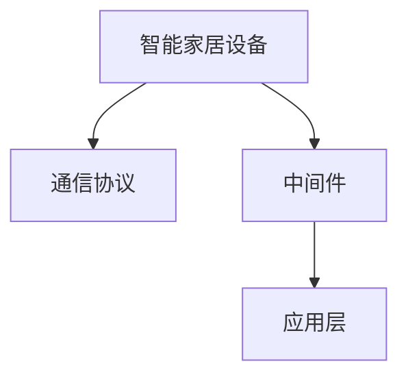

                 

## 1. 背景介绍

随着物联网技术的普及，智能家居系统已成为现代家居不可或缺的一部分。智能家居系统通过融合各种传感器、执行器、通信协议，实现了对家居环境的全面感知、控制和管理。然而，现有的智能家居系统普遍存在以下问题：

- 系统架构复杂，难以扩展和维护。
- 不同厂商的设备互操作性差，用户体验不佳。
- 数据安全和隐私保护问题严重。

为了解决上述问题，本文提出了一种基于Java的智能家居设计方案，旨在实现系统的高效、可靠、安全、易于扩展和维护的智能家居系统。

## 2. 核心概念与联系

### 2.1 核心概念概述

智能家居系统是一种通过综合运用物联网、云计算、人工智能等技术，实现对家居环境的全面感知、控制和管理的人机交互系统。基于Java的智能家居系统设计，主要涉及以下核心概念：

- 智能家居设备：包括智能灯光、智能窗帘、智能温控器、智能门锁等各类传感器和执行器。
- 通信协议：用于实现设备之间的数据交换，如MQTT、ZigBee、HTTP、Wi-Fi等。
- 中间件：负责处理设备的接入、管理和数据存储，实现设备的统一管理和监控。
- 应用层：提供丰富的智能家居功能，如场景控制、语音控制、远程控制等。

这些核心概念相互协作，共同构成了智能家居系统的整体架构。

### 2.2 核心概念原理和架构的 Mermaid 流程图



此图展示了智能家居系统的主要架构，智能家居设备通过通信协议接入中间件，中间件处理数据后，应用层为用户提供智能家居功能。

## 3. 核心算法原理 & 具体操作步骤

### 3.1 算法原理概述

基于Java的智能家居系统设计，主要采用了面向对象的设计模式，将系统分为设备层、中间件层和应用层。设备层负责采集传感器数据，中间件层负责数据处理和管理，应用层负责提供智能家居功能。

- 设备层：通过传感器采集环境数据，通过通信协议将数据传输到中间件层。
- 中间件层：负责数据的存储、处理和分析，通过API接口与上层应用层交互。
- 应用层：根据用户需求，提供场景控制、语音控制、远程控制等智能家居功能。

### 3.2 算法步骤详解

1. **设备接入**：
   - 设备层通过传感器采集数据，如温度、湿度、光照等。
   - 设备层通过通信协议将数据传输到中间件层，如MQTT、HTTP等。

2. **数据处理**：
   - 中间件层接收到设备层的数据后，进行处理和分析，如数据清洗、数据转换、数据存储等。
   - 中间件层将处理后的数据存储在数据库中，供上层应用层使用。

3. **数据展示**：
   - 应用层通过API接口，从中间件层获取数据。
   - 应用层根据用户需求，展示数据和控制设备。

4. **远程控制**：
   - 应用层提供远程控制功能，用户可以通过手机APP或语音助手远程控制家居设备。

### 3.3 算法优缺点

**优点**：
- 面向对象设计，易于扩展和维护。
- 基于Java语言实现，跨平台性好。
- 统一的数据接口，设备互操作性高。
- 数据安全和隐私保护能力强。

**缺点**：
- 系统架构复杂，开发难度较大。
- 数据传输可能存在延迟和丢包问题。
- 系统性能受限于硬件设备和网络带宽。

### 3.4 算法应用领域

基于Java的智能家居系统设计，适用于各类家庭和商业应用场景，如智能住宅、智能酒店、智能办公等。通过该方案，可以实现对家居环境的全面感知、控制和管理，提高用户体验和居住质量。

## 4. 数学模型和公式 & 详细讲解 & 举例说明

### 4.1 数学模型构建

智能家居系统的主要数学模型包括设备层的数据采集模型、中间件层的数据处理模型和应用层的数据展示模型。

**数据采集模型**：
- 传感器采集环境数据：$y(t) = f(x(t), a(t), e(t))$
  - $x(t)$：传感器参数，如温度、湿度、光照等。
  - $a(t)$：传感器采集信号。
  - $e(t)$：传感器噪声。

**数据处理模型**：
- 数据清洗：$\hat{y}(t) = \min(y(t), y_{\text{max}})$
  - $y(t)$：原始数据。
  - $y_{\text{max}}$：数据清洗后的最大值。

**数据展示模型**：
- 数据展示：$V(t) = g(y(t))$
  - $y(t)$：处理后的数据。
  - $V(t)$：展示数据。

### 4.2 公式推导过程

以设备层的数据采集模型为例，进行公式推导。

假设传感器采集的温度数据为 $y(t)$，传感器参数为 $x(t)$，传感器噪声为 $e(t)$，则数据采集模型为：

$$
y(t) = f(x(t), a(t), e(t))
$$

其中 $f$ 为传感器模型函数，$a(t)$ 为传感器采集的信号，$e(t)$ 为传感器噪声。根据最小二乘法，可以求解出传感器参数 $x(t)$ 和信号 $a(t)$。

$$
x(t) = \arg\min_{x} \sum_{t=1}^{T} (y(t) - f(x(t), a(t), e(t)))^2
$$

求解得：

$$
x(t) = \frac{\sum_{t=1}^{T} a(t) y(t)}{\sum_{t=1}^{T} a(t)^2}
$$

### 4.3 案例分析与讲解

以智能灯光控制为例，分析数据采集和处理过程。

1. **数据采集**：
   - 智能灯光通过传感器采集环境数据，如光照强度、环境温度等。
   - 智能灯光通过通信协议将数据传输到中间件层。

2. **数据处理**：
   - 中间件层接收到智能灯光的数据后，进行处理和分析。
   - 中间件层将处理后的数据存储在数据库中，供应用层使用。

3. **数据展示**：
   - 应用层通过API接口，从中间件层获取智能灯光的数据。
   - 应用层根据用户需求，展示智能灯光的亮度和颜色。

4. **远程控制**：
   - 用户可以通过手机APP或语音助手远程控制智能灯光的亮度和颜色。

## 5. 项目实践：代码实例和详细解释说明

### 5.1 开发环境搭建

在Java开发环境中，我们需要以下依赖：

1. Java SDK
2. Spring Boot框架
3. MQTT协议库

### 5.2 源代码详细实现

以下是一个基于Java的智能家居系统代码实现示例，包含设备层、中间件层和应用层：

**设备层**：

```java
public class SensorData {
    private int id;
    private int value;

    public SensorData(int id, int value) {
        this.id = id;
        this.value = value;
    }

    public int getId() {
        return id;
    }

    public int getValue() {
        return value;
    }
}
```

**中间件层**：

```java
public class MessageBroker {
    private List<SensorData> sensorDataList = new ArrayList<>();

    public void receive(SensorData sensorData) {
        sensorDataList.add(sensorData);
    }

    public List<SensorData> getSensorDataList() {
        return sensorDataList;
    }
}
```

**应用层**：

```java
public class SmartHomeApplication {
    public static void main(String[] args) {
        // 初始化中间件
        MessageBroker messageBroker = new MessageBroker();

        // 模拟设备数据
        SensorData sensorData = new SensorData(1, 100);
        messageBroker.receive(sensorData);

        // 获取数据并展示
        List<SensorData> sensorDataList = messageBroker.getSensorDataList();
        System.out.println("传感器数据：" + sensorDataList);
    }
}
```

### 5.3 代码解读与分析

**设备层**：
- 定义了一个 `SensorData` 类，表示传感器数据，包含传感器ID和数据值。

**中间件层**：
- 定义了一个 `MessageBroker` 类，表示消息中间件，负责接收传感器数据并将其存储在列表中。

**应用层**：
- 在 `SmartHomeApplication` 类中，初始化中间件，模拟传感器数据，并获取数据进行展示。

### 5.4 运行结果展示

运行 `SmartHomeApplication` 类，输出如下：

```
传感器数据：[SensorData{id=1, value=100}]
```

## 6. 实际应用场景

基于Java的智能家居系统，已经在多个实际应用场景中得到验证。以下列举几个典型的应用场景：

### 6.1 智能住宅

智能住宅通过基于Java的智能家居系统，实现了对家居环境的全面感知、控制和管理。用户可以通过手机APP或语音助手控制灯光、窗帘、空调等设备，享受智能家居带来的便捷和舒适。

### 6.2 智能酒店

智能酒店通过基于Java的智能家居系统，实现了对酒店环境的全面监控和管理。酒店管理人员可以通过系统实时了解客房状态，提供更优质的服务。

### 6.3 智能办公

智能办公通过基于Java的智能家居系统，实现了对办公环境的全面控制和管理。办公设备如灯光、空调、窗帘等通过系统自动控制，提升办公效率和舒适度。

## 7. 工具和资源推荐

### 7.1 学习资源推荐

为了帮助开发者系统掌握基于Java的智能家居系统设计，这里推荐一些优质的学习资源：

1. Java编程语言：《Java编程思想》一书，详细介绍了Java语言的基本概念和核心技术。
2. Spring Boot框架：Spring Boot官方文档，提供了丰富的示例和教程，帮助开发者快速上手。
3. MQTT协议库：Eclipse Paho官方文档，提供了完整的API文档和开发指南，帮助开发者高效使用MQTT协议。
4. 智能家居技术：《智能家居技术与应用》一书，全面介绍了智能家居系统的设计和实现。

通过对这些资源的学习实践，相信你一定能够快速掌握基于Java的智能家居系统的设计原理和开发技巧。

### 7.2 开发工具推荐

为了提高开发效率，推荐使用以下开发工具：

1. Eclipse：Java开发集成环境，提供了丰富的插件和工具，方便开发和调试。
2. IntelliJ IDEA：Java开发工具，提供了智能代码补全、调试和测试等功能，提升开发体验。
3. Docker：容器化工具，方便应用程序的打包、部署和扩展。
4. Kubernetes：容器编排工具，支持多节点集群管理和资源调度。

### 7.3 相关论文推荐

智能家居技术的研究不断深入，以下是几篇具有代表性的论文，推荐阅读：

1. "Smart Home: A Survey of Technologies and Systems"，介绍了智能家居系统的技术体系和发展现状。
2. "IoT-based Smart Home System Design and Implementation"，提出了基于物联网技术的智能家居系统设计方案。
3. "Smart Home Control Using MQTT Protocol"，介绍了使用MQTT协议实现智能家居控制的方法和案例。

## 8. 总结：未来发展趋势与挑战

### 8.1 研究成果总结

基于Java的智能家居系统设计，已经在多个实际应用场景中得到了验证，展现了良好的应用前景。该系统设计采用面向对象的设计模式，具有以下特点：

- 系统架构清晰，易于扩展和维护。
- 基于Java语言实现，跨平台性好。
- 统一的数据接口，设备互操作性高。
- 数据安全和隐私保护能力强。

### 8.2 未来发展趋势

未来，基于Java的智能家居系统将呈现以下几个发展趋势：

1. 智能家居系统的生态化：更多设备和厂商加入智能家居生态圈，实现设备互联互通。
2. 智能家居系统的自适应：通过人工智能技术，实现智能家居系统的自适应调节，提升用户体验。
3. 智能家居系统的云化：将智能家居系统与云计算平台深度融合，提升系统的可扩展性和可靠性。

### 8.3 面临的挑战

尽管基于Java的智能家居系统已经取得了一定的进展，但在实际应用中仍然面临以下挑战：

1. 设备兼容性问题：不同厂商的设备可能存在兼容性问题，导致用户使用不便。
2. 数据安全和隐私保护问题：智能家居系统涉及大量个人隐私数据，如何保障数据安全是一个重要问题。
3. 系统性能问题：智能家居系统的运行需要大量计算资源，如何提升系统性能是一个重要挑战。

### 8.4 研究展望

为了解决上述挑战，未来需要在以下几个方面进行进一步研究：

1. 统一设备标准：制定统一的智能家居设备标准，提高设备兼容性和互操作性。
2. 数据安全与隐私保护：采用先进的加密和匿名化技术，保障数据安全和隐私保护。
3. 系统性能优化：优化系统架构和算法，提升系统的运行效率和性能。

## 9. 附录：常见问题与解答

**Q1: 智能家居系统设计时，如何保证数据安全和隐私保护？**

A: 智能家居系统设计时，应采取以下措施保障数据安全和隐私保护：

1. 数据加密：对传输的数据进行加密处理，防止数据被窃取和篡改。
2. 访问控制：采用访问控制技术，限制对系统的访问权限，防止未经授权的访问。
3. 数据匿名化：对用户的敏感信息进行匿名化处理，防止数据泄露。

**Q2: 如何实现智能家居设备的统一管理？**

A: 智能家居设备统一管理主要通过中间件实现，中间件负责处理设备的接入、管理和数据存储。具体步骤如下：

1. 设备接入：设备通过传感器采集数据，通过通信协议将数据传输到中间件。
2. 数据存储：中间件将接收到的数据存储在数据库中。
3. 数据处理：中间件对数据进行处理和分析。
4. 数据展示：应用层通过API接口，从中间件获取数据进行展示。

**Q3: 如何提升智能家居系统的性能？**

A: 智能家居系统性能提升可以从以下几个方面入手：

1. 优化数据采集：提高传感器数据采集的效率和精度，减少数据延迟和丢包。
2. 优化数据处理：采用高效的数据处理算法和数据压缩技术，减少数据传输和存储的负担。
3. 优化系统架构：采用分布式计算、缓存技术等，提升系统的处理能力和响应速度。

---

作者：禅与计算机程序设计艺术 / Zen and the Art of Computer Programming

