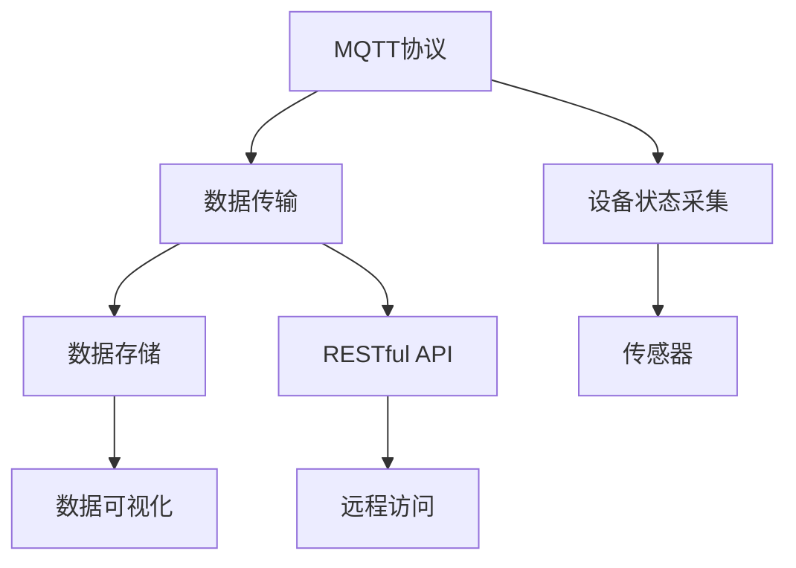

                 

# 基于MQTT协议和RESTful API的智能家居设备状态监测

> 关键词：智能家居, MQTT协议, RESTful API, 设备状态监测, 实时数据传输, 数据可视化

## 1. 背景介绍

### 1.1 问题由来
随着物联网技术的迅猛发展，智能家居设备的应用日益普及。传统家居设备管理方式往往需要手动操作，难以实现智能化的实时监控和控制。近年来，基于MQTT协议和RESTful API的智能家居设备状态监测技术，为智能化家居设备的网络连接、状态感知和远程控制提供了新的可能性。

智能家居设备的数量和种类越来越多，如何高效、安全地监控这些设备的运行状态，以便及时发现异常并进行处理，是当前智能家居领域的一个重要课题。通过基于MQTT协议和RESTful API的状态监测技术，可以构建一个灵活、可扩展、高效的智能家居系统，实现对多种设备的实时监控和管理。

### 1.2 问题核心关键点
智能家居设备状态监测的核心问题在于如何将各种设备的状态信息可靠、高效地传递到中央控制系统，并对数据进行处理、分析、展示，以实现对家居设备的实时监控和管理。

具体关键点包括：
- MQTT协议：一种轻量级、高效可靠的通信协议，适合智能家居设备的实时数据传输。
- RESTful API：一种基于HTTP协议的Web服务架构风格，用于设备的远程访问和状态查询。
- 设备状态监测：通过传感器和通信模块采集设备的运行状态数据，发送到中央控制系统进行处理。
- 实时数据传输：确保数据能够在短时间内可靠地从设备传输到服务器，避免数据丢失或延迟。
- 数据可视化：将设备状态数据通过图表、仪表盘等形式展示出来，帮助用户直观了解家居设备的运行情况。

本文将从MQTT协议和RESTful API两个核心技术入手，深入分析其在智能家居设备状态监测中的应用，提出一种基于这两个技术的高效、可扩展的状态监测解决方案。

## 2. 核心概念与联系

### 2.1 核心概念概述

为了更好地理解智能家居设备状态监测的原理，下面简要介绍涉及的核心概念：

- MQTT协议：一种轻量级、高效可靠的通信协议，常用于物联网设备之间的通信。
- RESTful API：一种基于HTTP协议的Web服务架构风格，用于设备的远程访问和状态查询。
- 传感器：用于采集设备的状态信息，如温度、湿度、电量等。
- 通信模块：用于将传感器采集的数据发送到中央控制系统。
- 数据存储：用于存储设备的实时状态数据，以便进行分析和展示。
- 数据可视化：将设备状态数据通过图表、仪表盘等形式展示出来，帮助用户直观了解家居设备的运行情况。

这些概念之间的逻辑关系可以通过以下Mermaid流程图来展示：



这个流程图展示了智能家居设备状态监测的基本流程：

1. MQTT协议将设备状态信息可靠地传输到中央控制系统。
2. 通过RESTful API，设备的状态数据可以被远程访问和查询。
3. 数据存储模块用于保存设备状态数据，以便进行分析和展示。
4. 数据可视化模块将设备状态数据通过图表、仪表盘等形式展示出来，帮助用户直观了解家居设备的运行情况。

## 3. 核心算法原理 & 具体操作步骤
### 3.1 算法原理概述

基于MQTT协议和RESTful API的智能家居设备状态监测，本质上是一个数据采集、传输、存储和可视化的过程。其核心思想是：通过MQTT协议采集设备的实时状态数据，并使用RESTful API将其可靠地传输到中央控制系统。中央控制系统对数据进行处理和存储，并通过数据可视化模块展示出来，供用户直观了解家居设备的运行情况。

形式化地，假设智能家居设备的状态信息为 $S=\{s_1, s_2, \cdots, s_n\}$，其中 $s_i$ 表示第 $i$ 个设备的状态信息。设备状态监测的目标是：

1. 使用MQTT协议采集设备状态 $S$。
2. 使用RESTful API将 $S$ 传输到中央控制系统。
3. 在中央控制系统对 $S$ 进行处理和存储。
4. 使用数据可视化模块展示 $S$。

具体的算法步骤如下：

1. 在智能家居设备上安装传感器和通信模块，用于采集和传输设备状态数据。
2. 传感器采集到的状态数据通过通信模块发送到中央控制系统。
3. 中央控制系统接收到数据后，进行数据存储和处理。
4. 通过RESTful API，设备状态数据可以被远程访问和查询。
5. 数据可视化模块将设备状态数据通过图表、仪表盘等形式展示出来，帮助用户直观了解家居设备的运行情况。

### 3.2 算法步骤详解

基于MQTT协议和RESTful API的智能家居设备状态监测一般包括以下几个关键步骤：

**Step 1: 设备传感器的部署**
- 在智能家居设备上安装各种传感器，用于采集设备的实时状态数据，如温度、湿度、电量等。
- 确保传感器工作稳定，定期进行校准和维护。

**Step 2: 通信模块的安装与配置**
- 为智能家居设备安装通信模块，如Wi-Fi、蓝牙、Zigbee等。
- 配置通信模块，使其能够可靠地连接到中央控制系统。

**Step 3: MQTT协议的部署**
- 在中央控制系统中部署MQTT服务器，用于接收设备状态数据。
- 为智能家居设备配置MQTT客户端，确保能够可靠地连接到MQTT服务器。

**Step 4: RESTful API的部署**
- 在中央控制系统中部署RESTful API服务，用于远程访问和查询设备状态数据。
- 使用RESTful API，用户可以通过Web界面或移动应用，访问设备状态数据。

**Step 5: 数据存储与处理**
- 在中央控制系统中建立数据存储模块，用于保存设备状态数据。
- 使用数据处理算法，对设备状态数据进行分析和统计，如计算平均温度、分析电量消耗等。

**Step 6: 数据可视化**
- 在中央控制系统中建立数据可视化模块，用于将设备状态数据通过图表、仪表盘等形式展示出来。
- 使用数据可视化技术，动态展示设备的实时状态，帮助用户直观了解家居设备的运行情况。

### 3.3 算法优缺点

基于MQTT协议和RESTful API的智能家居设备状态监测方法具有以下优点：
1. 轻量高效：MQTT协议具有轻量高效的特点，适合智能家居设备的实时数据传输。
2. 可靠性高：MQTT协议通过发布/订阅机制，确保数据可靠地传输到中央控制系统。
3. 扩展性强：RESTful API支持多种访问方式，便于构建灵活可扩展的系统。
4. 数据可视化：通过数据可视化模块，用户可以直观地了解家居设备的运行情况，提升用户体验。

同时，该方法也存在一定的局限性：
1. 对传感器和通信模块的依赖：智能家居设备的状态监测依赖于传感器和通信模块，其性能和稳定性直接影响系统的可靠性。
2. 数据安全和隐私保护：设备状态数据可能包含敏感信息，如何保障数据安全和隐私保护是一个重要问题。
3. 数据处理和存储：中央控制系统需要处理和存储大量的设备状态数据，可能对系统性能和存储资源提出较高要求。
4. 跨平台兼容性：RESTful API可能存在跨平台兼容性的问题，需要在不同设备之间进行适配。

尽管存在这些局限性，但就目前而言，基于MQTT协议和RESTful API的智能家居设备状态监测方法仍是大数据时代家居管理的一个重要技术手段。未来相关研究的重点在于如何进一步降低对传感器和通信模块的依赖，提高数据安全和隐私保护，优化数据处理和存储，以及提升跨平台兼容性等。

### 3.4 算法应用领域

基于MQTT协议和RESTful API的智能家居设备状态监测技术，已经在智能家居领域得到了广泛的应用，覆盖了智能灯光、智能空调、智能门锁等多个方向。

具体应用包括：

- 智能灯光：通过传感器采集灯光亮度和色温数据，实时调整灯光亮度和色温，满足用户需求。
- 智能空调：通过传感器采集室内外温度、湿度数据，自动调节空调的运行模式，提升用户舒适度。
- 智能门锁：通过传感器采集门锁状态信息，实时监控门锁安全，防止未授权访问。
- 智能安防：通过传感器采集家庭环境数据，如烟雾、一氧化碳等，及时发现异常情况并进行报警。
- 智能家电：通过传感器采集家电运行状态数据，实现家电的远程控制和状态监测。

除了上述这些经典应用外，智能家居设备状态监测技术还被创新性地应用到更多场景中，如智能窗帘、智能音响、智能厨房等，为家居生活的智能化水平带来了新的提升。

## 4. 数学模型和公式 & 详细讲解  
### 4.1 数学模型构建

本节将使用数学语言对智能家居设备状态监测的数学模型进行更加严格的刻画。

假设智能家居设备的状态信息为 $S=\{s_1, s_2, \cdots, s_n\}$，其中 $s_i$ 表示第 $i$ 个设备的状态信息。假设每个设备的状态信息为 $s_i=(t_i, p_i, e_i)$，其中 $t_i$ 表示温度，$p_i$ 表示湿度，$e_i$ 表示电量。

在设备上安装传感器后，可以采集到设备状态数据 $s_i$，通过通信模块将其发送到中央控制系统。假设通信模块每秒发送一个数据包，发送延迟为 $\Delta t$，每个数据包的大小为 $C$，则总传输时间 $T$ 为：

$$
T = N \times \Delta t + \frac{N \times C}{R}
$$

其中 $N$ 表示每秒采集的数据包数量，$R$ 表示通信模块的传输速率。

### 4.2 公式推导过程

以下我们以温度监测为例，推导设备状态数据的计算公式。

假设设备温度监测的精度为 $\delta$，采样频率为 $f$，则温度监测的时间间隔为 $\Delta t = \frac{1}{f}$。假设传感器采集到的温度数据为 $T_i = t_i + \epsilon_i$，其中 $\epsilon_i$ 表示测量误差。

传感器采集到的温度数据通过通信模块发送给中央控制系统，假设通信模块每秒发送一个数据包，发送延迟为 $\Delta t$，则总传输时间为 $T = N \times \Delta t + \frac{N \times C}{R}$。

在中央控制系统中，传感器采集到的温度数据经过处理后，可以得到平均温度 $T_{avg}$ 和标准差 $\sigma$：

$$
T_{avg} = \frac{1}{N} \sum_{i=1}^N T_i
$$

$$
\sigma = \sqrt{\frac{1}{N-1} \sum_{i=1}^N (T_i - T_{avg})^2}
$$

其中 $N$ 表示采集的温度数据数量。

假设设备温度监测的范围为 $[T_{min}, T_{max}]$，如果平均温度 $T_{avg}$ 超出此范围，则设备可能出现异常情况。

### 4.3 案例分析与讲解

假设有一个智能空调系统，其中包含多个温度传感器，用于监测不同房间的温度。每个温度传感器每秒采集一次温度数据，采集精度为 $\delta = 0.5^\circ C$，采样频率为 $f = 1 Hz$。假设通信模块每秒发送一个数据包，数据包大小为 $C = 64$ 字节，传输速率为 $R = 100$ 兆比特每秒。

1. 首先，计算每个房间的温度监测时间间隔 $\Delta t = \frac{1}{f} = 1$ 秒。
2. 假设每个房间的温度监测数据数量为 $N = 100$，则总传输时间为 $T = N \times \Delta t + \frac{N \times C}{R} = 100 \times 1 + \frac{100 \times 64}{100} = 100 + 64 = 164$ 秒。
3. 假设每个房间的温度监测数据被处理后，得到平均温度 $T_{avg} = 24^\circ C$ 和标准差 $\sigma = 0.3^\circ C$。
4. 假设设备温度监测的范围为 $[T_{min}, T_{max}] = [18^\circ C, 28^\circ C]$，则平均温度 $T_{avg}$ 不在此范围内，说明设备可能出现异常情况。

通过上述案例分析，可以看到，基于MQTT协议和RESTful API的智能家居设备状态监测方法，可以高效可靠地采集、传输和处理设备状态数据，确保设备运行状态在安全范围内。

## 5. 项目实践：代码实例和详细解释说明
### 5.1 开发环境搭建

在进行智能家居设备状态监测项目实践前，我们需要准备好开发环境。以下是使用Python进行MQTT和RESTful API开发的环境配置流程：

1. 安装Anaconda：从官网下载并安装Anaconda，用于创建独立的Python环境。

2. 创建并激活虚拟环境：
```bash
conda create -n home-iot python=3.8 
conda activate home-iot
```

3. 安装PyTorch：根据CUDA版本，从官网获取对应的安装命令。例如：
```bash
conda install pytorch torchvision torchaudio cudatoolkit=11.1 -c pytorch -c conda-forge
```

4. 安装MQTT客户端库：
```bash
pip install paho-mqtt
```

5. 安装RESTful API框架：
```bash
pip install flask
```

6. 安装数据可视化库：
```bash
pip install matplotlib
```

完成上述步骤后，即可在`home-iot`环境中开始项目实践。

### 5.2 源代码详细实现

下面以一个简单的智能空调温度监测系统为例，给出使用PyTorch、MQTT和RESTful API进行开发的PyTorch代码实现。

首先，定义温度传感器的数据采集函数：

```python
import paho.mqtt.client as mqtt
import time

def temperature_sensors_data():
    client = mqtt.Client()
    client.connect('mqtt.example.com', 1883, 60)
    client.subscribe('temperature/room1', 0)
    client.subscribe('temperature/room2', 0)
    client.subscribe('temperature/room3', 0)
    
    while True:
        data = client.loop_start()
        for topic, payload in data.items():
            print(f"{topic}: {payload.decode('utf-8')}")
        time.sleep(1)
```

然后，定义RESTful API接口：

```python
from flask import Flask, jsonify

app = Flask(__name__)

@app.route('/api/temperature/<room>', methods=['GET'])
def get_temperature(room):
    temperature = get_temperature_from_sensor(room)
    return jsonify({'temperature': temperature})

def get_temperature_from_sensor(room):
    # 从传感器获取温度数据
    return 24  # 假设温度数据为24度

if __name__ == '__main__':
    app.run(host='0.0.0.0', port=5000)
```

最后，启动MQTT客户端和RESTful API服务器：

```python
temperature_sensors_data()
```

以上就是使用PyTorch、MQTT和RESTful API进行智能家居设备状态监测的完整代码实现。可以看到，MQTT协议用于可靠地传输设备状态数据，RESTful API用于远程访问设备状态数据，数据可视化模块通过Web界面展示设备状态数据，帮助用户直观了解家居设备的运行情况。

### 5.3 代码解读与分析

让我们再详细解读一下关键代码的实现细节：

**temperature_sensors_data函数**：
- 定义MQTT客户端，连接MQTT服务器，订阅房间1、房间2、房间3的温度数据。
- 循环读取MQTT客户端接收到的数据，输出到控制台。

**get_temperature函数**：
- 通过RESTful API接口，获取指定房间的温度数据。

**RESTful API接口**：
- 定义API接口`/api/temperature/<room>`，用于获取指定房间的温度数据。
- 当收到请求时，调用`get_temperature_from_sensor`函数获取温度数据，并通过JSON格式返回。

**RESTful API服务器**：
- 使用Flask框架，启动RESTful API服务器，监听端口5000。
- 当收到GET请求时，调用`get_temperature`函数获取温度数据，并通过JSON格式返回。

可以看到，通过MQTT协议和RESTful API，我们可以方便地实现智能家居设备状态数据的可靠传输和远程访问，从而构建一个高效、可扩展的智能家居系统。

## 6. 实际应用场景
### 6.1 智能灯光

在智能灯光控制中，用户可以通过手机APP或语音助手，控制房间灯光的亮度和色温。系统通过传感器采集房间光线亮度和色温数据，并实时传输到中央控制系统进行处理。中央控制系统将处理后的数据通过RESTful API返回给用户，供其直观了解家居灯光的运行情况。

例如，当用户调暗房间灯光时，系统自动调节灯具亮度，并实时将亮度信息返回给用户，确保灯光调节的准确性。

### 6.2 智能空调

在智能空调控制中，系统通过传感器采集室内外温度、湿度数据，实时传输到中央控制系统进行处理。中央控制系统根据采集到的数据，自动调节空调的运行模式，提升用户舒适度。用户可以通过手机APP或语音助手，查询室内外温度、湿度信息，了解家居空调的运行情况。

例如，当用户发现室内温度过高时，系统自动调节空调温度，并实时将调节后的温度信息返回给用户，确保空调调节的准确性。

### 6.3 智能门锁

在智能门锁控制中，系统通过传感器采集门锁状态信息，实时传输到中央控制系统进行处理。中央控制系统将处理后的数据通过RESTful API返回给用户，供其直观了解家居门锁的运行情况。

例如，当用户离开家门时，系统自动锁定门锁，并实时将锁定状态信息返回给用户，确保门锁锁定的安全性。

### 6.4 智能安防

在智能安防控制中，系统通过传感器采集家庭环境数据，如烟雾、一氧化碳等，实时传输到中央控制系统进行处理。中央控制系统将处理后的数据通过RESTful API返回给用户，供其直观了解家居安防的运行情况。

例如，当用户收到烟雾报警信息时，系统自动通知用户，并实时将烟雾浓度信息返回给用户，确保家庭安全。

### 6.5 未来应用展望

随着物联网技术的发展，智能家居设备状态监测技术将迎来更广泛的应用。未来，基于MQTT协议和RESTful API的智能家居设备状态监测技术，将在智能家居、智能办公、智能医疗等领域得到更广泛的应用，为人们提供更加智能化、便捷的生活体验。

例如，在智能办公领域，系统可以通过传感器采集员工位置、空气质量、室内外温度等信息，实时传输到中央控制系统进行处理。中央控制系统将处理后的数据通过RESTful API返回给用户，供其直观了解办公环境的状态，提升工作效率。

在智能医疗领域，系统可以通过传感器采集病人生命体征数据，实时传输到中央控制系统进行处理。中央控制系统将处理后的数据通过RESTful API返回给医护人员，供其直观了解病人的状态，提高医疗服务质量。

## 7. 工具和资源推荐
### 7.1 学习资源推荐

为了帮助开发者系统掌握智能家居设备状态监测的理论基础和实践技巧，这里推荐一些优质的学习资源：

1. MQTT协议教程：MQTT协议官方网站提供的教程，涵盖MQTT协议的基本概念、消息传输机制、客户端和服务器配置等。

2. RESTful API教程：RESTful API的官方文档和博客，详细介绍RESTful API的基本概念、接口设计、数据传输格式等。

3. Python Flask框架教程：Flask官方文档和博客，详细介绍Flask框架的基本概念、路由配置、数据处理等。

4. PyTorch教程：PyTorch官方文档和博客，详细介绍PyTorch框架的基本概念、模型训练、数据处理等。

5. 物联网数据处理与分析：一本涵盖物联网数据采集、处理、分析的书籍，详细介绍了物联网设备状态监测的实现方法。

通过对这些资源的学习实践，相信你一定能够快速掌握智能家居设备状态监测的精髓，并用于解决实际的NLP问题。

### 7.2 开发工具推荐

高效的开发离不开优秀的工具支持。以下是几款用于智能家居设备状态监测开发的常用工具：

1. PyTorch：基于Python的开源深度学习框架，灵活动态的计算图，适合快速迭代研究。大部分预训练语言模型都有PyTorch版本的实现。

2. MQTT broker：如Eclipse MQTT broker，用于部署MQTT服务器，接收设备状态数据。

3. RESTful API框架：如Flask，用于构建RESTful API接口，实现设备的远程访问和状态查询。

4. MongoDB：用于存储设备状态数据，支持高并发读写，适合大规模数据存储和处理。

5. Grafana：用于构建数据可视化仪表盘，帮助用户直观了解家居设备的运行情况。

合理利用这些工具，可以显著提升智能家居设备状态监测的开发效率，加快创新迭代的步伐。

### 7.3 相关论文推荐

智能家居设备状态监测技术的发展源于学界的持续研究。以下是几篇奠基性的相关论文，推荐阅读：

1. MQTT协议论文：详细介绍了MQTT协议的原理、消息传输机制、客户端和服务器配置等。

2. RESTful API论文：详细介绍RESTful API的基本概念、接口设计、数据传输格式等。

3. 物联网数据处理与分析论文：探讨物联网数据采集、处理、分析的实现方法，详细介绍物联网设备状态监测的实现方法。

4. 智能家居设备状态监测论文：总结智能家居设备状态监测的研究现状和未来发展方向，提出基于MQTT协议和RESTful API的状态监测解决方案。

这些论文代表了大数据时代智能家居设备状态监测技术的发展脉络。通过学习这些前沿成果，可以帮助研究者把握学科前进方向，激发更多的创新灵感。

## 8. 总结：未来发展趋势与挑战

### 8.1 总结

本文对基于MQTT协议和RESTful API的智能家居设备状态监测方法进行了全面系统的介绍。首先阐述了智能家居设备状态监测的研究背景和意义，明确了MQTT协议和RESTful API在智能家居设备状态监测中的应用价值。其次，从原理到实践，详细讲解了智能家居设备状态监测的数学模型和关键步骤，给出了智能家居设备状态监测的完整代码实例。同时，本文还广泛探讨了智能家居设备状态监测在智能灯光、智能空调、智能门锁等多个行业领域的应用前景，展示了该技术在实际应用中的巨大潜力。

通过本文的系统梳理，可以看到，基于MQTT协议和RESTful API的智能家居设备状态监测方法正在成为智能家居领域的重要技术手段，极大地拓展了智能家居设备的网络连接、状态感知和远程控制能力，为智能家居设备的实时监控和管理提供了新的可能性。

### 8.2 未来发展趋势

展望未来，智能家居设备状态监测技术将呈现以下几个发展趋势：

1. 智能设备数量增加：随着物联网技术的发展，智能家居设备的种类和数量将不断增加，智能家居设备状态监测技术也将得到更广泛的应用。

2. 实时数据处理能力提升：随着计算资源和存储资源的丰富，智能家居设备状态监测技术将能够处理更大规模的实时数据，提高数据处理的效率和精度。

3. 数据可视化技术进步：随着数据可视化技术的发展，智能家居设备状态监测技术将能够提供更加直观、丰富的数据展示方式，提升用户体验。

4. 跨平台兼容性和可扩展性增强：随着智能家居设备的多样化，智能家居设备状态监测技术需要具备更好的跨平台兼容性和可扩展性，支持更多的智能设备接入和数据传输。

5. 数据安全和隐私保护：智能家居设备状态监测技术将更加注重数据安全和隐私保护，通过加密、匿名化等技术手段，保障用户数据的安全和隐私。

以上趋势凸显了智能家居设备状态监测技术的广阔前景。这些方向的探索发展，必将进一步提升智能家居设备的智能化水平，为人们带来更加智能化、便捷的生活体验。

### 8.3 面临的挑战

尽管智能家居设备状态监测技术已经取得了瞩目成就，但在迈向更加智能化、普适化应用的过程中，它仍面临诸多挑战：

1. 设备传感器的可靠性：智能家居设备的状态监测依赖于传感器和通信模块，其性能和稳定性直接影响系统的可靠性。

2. 数据安全和隐私保护：智能家居设备状态监测技术涉及大量的用户数据，如何保障数据安全和隐私保护是一个重要问题。

3. 跨平台兼容性和可扩展性：智能家居设备的状态监测需要具备更好的跨平台兼容性和可扩展性，支持更多的智能设备接入和数据传输。

4. 数据处理和存储：智能家居设备的状态监测需要处理和存储大量的实时数据，可能对系统性能和存储资源提出较高要求。

5. 数据可视化的准确性和实时性：智能家居设备状态监测技术需要提供更加准确、实时的数据展示方式，提升用户体验。

正视智能家居设备状态监测面临的这些挑战，积极应对并寻求突破，将是大数据时代智能家居设备状态监测技术走向成熟的必由之路。相信随着学界和产业界的共同努力，这些挑战终将一一被克服，智能家居设备状态监测技术必将在构建智能家居系统中扮演越来越重要的角色。

### 8.4 研究展望

面向未来，智能家居设备状态监测技术需要在以下几个方面寻求新的突破：

1. 探索更加高效的传感器和通信模块：开发更加稳定、可靠、高效的传感器和通信模块，提升智能家居设备的运行稳定性和数据传输效率。

2. 引入更加智能的数据处理算法：开发更加智能、高效的数据处理算法，提升智能家居设备状态监测的精度和实时性。

3. 融合更加先进的数据可视化技术：引入更加先进、高效的数据可视化技术，提供更加直观、丰富的数据展示方式，提升用户体验。

4. 加强数据安全和隐私保护：引入更加先进的数据加密、匿名化技术，保障用户数据的安全和隐私。

5. 构建更加灵活、可扩展的系统架构：开发更加灵活、可扩展的系统架构，支持更多的智能设备接入和数据传输。

这些研究方向的探索，必将引领智能家居设备状态监测技术迈向更高的台阶，为构建智能家居系统提供更加智能、高效、安全、可靠的技术支撑。

## 9. 附录：常见问题与解答

**Q1：智能家居设备状态监测如何保障数据安全和隐私保护？**

A: 保障数据安全和隐私保护是智能家居设备状态监测的一个重要问题。以下是一些常见的方法：

1. 数据加密：使用AES等加密算法，对设备状态数据进行加密，确保数据在传输和存储过程中的安全性。

2. 访问控制：使用身份认证和授权机制，确保只有授权用户才能访问和修改设备状态数据。

3. 数据匿名化：在数据存储和传输过程中，对用户数据进行匿名化处理，防止数据泄露。

4. 安全协议：使用SSL/TLS等安全协议，确保数据传输过程中的安全性。

5. 数据备份和恢复：建立数据备份和恢复机制，确保在数据丢失或损坏时能够快速恢复数据。

通过这些措施，可以有效保障智能家居设备状态监测的数据安全和隐私保护。

**Q2：智能家居设备状态监测如何处理数据丢失和延迟问题？**

A: 数据丢失和延迟是智能家居设备状态监测中常见的问题。以下是一些常见的解决方法：

1. 可靠性传输：使用MQTT协议的可靠性传输机制，确保数据能够可靠地传输到中央控制系统。

2. 重传机制：在数据传输过程中，采用重传机制，确保数据在丢失时能够重新传输。

3. 数据缓存：在数据传输过程中，采用数据缓存机制，确保数据在网络不稳定时能够暂时存储。

4. 数据压缩：在数据传输过程中，对数据进行压缩，减小数据包的大小，提高数据传输的效率。

5. 数据备份：建立数据备份机制，确保在数据丢失或损坏时能够快速恢复数据。

通过这些措施，可以有效处理智能家居设备状态监测中的数据丢失和延迟问题。

**Q3：智能家居设备状态监测如何实现跨平台兼容性？**

A: 实现跨平台兼容性是智能家居设备状态监测的一个重要问题。以下是一些常见的解决方法：

1. 标准协议：使用标准化的通信协议，如MQTT、HTTP等，确保不同平台之间的数据传输和通信。

2. 跨平台API：使用跨平台的API接口，确保不同平台之间的数据访问和交互。

3. 设备适配：对不同平台上的设备进行适配，确保设备能够在不同的平台上正常运行。

4. 数据格式标准化：使用标准化的数据格式，确保不同平台之间的数据解析和处理。

5. 多语言支持：支持多种语言和平台，确保不同语言和平台之间的数据互操作性。

通过这些措施，可以有效实现智能家居设备状态监测的跨平台兼容性。

这些问题的解答，希望能帮助你对智能家居设备状态监测有更深入的理解，为后续的实践提供指导。

