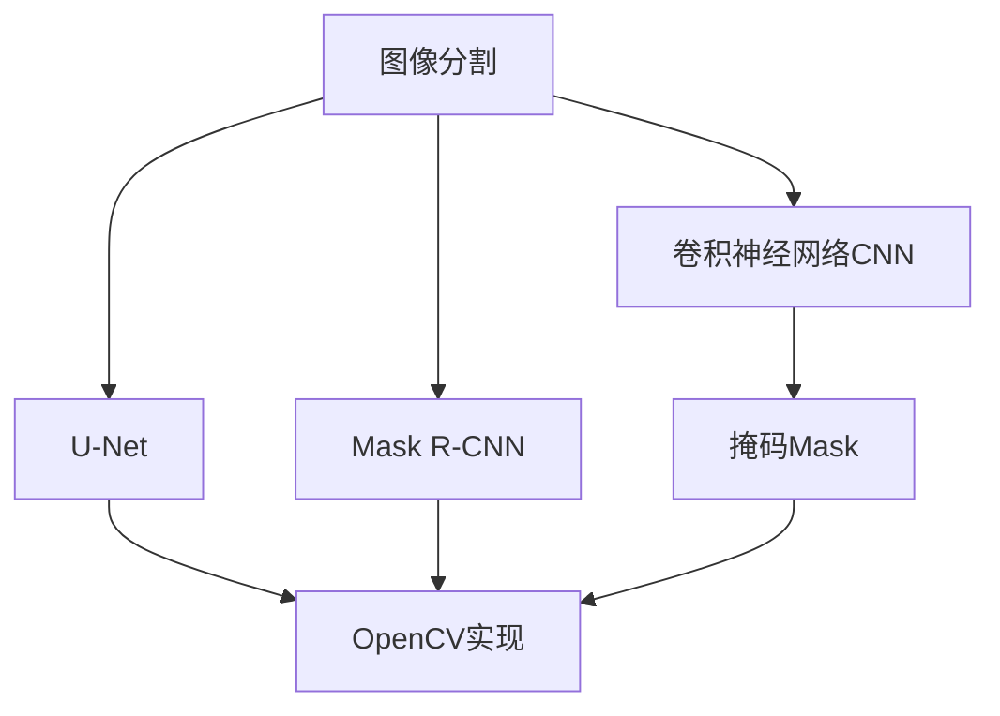

                 

# 基于OpenCV的图像分割系统详细设计与具体代码实现

## 1. 背景介绍

图像分割是计算机视觉领域的一项基础任务，通常用于将图像划分为若干个语义相似的区域，对于图像处理、医学图像分析、自动驾驶等领域都有重要应用。传统的图像分割方法主要有阈值法、区域增长、边缘检测等，但由于其对图像噪声和边缘的不敏感，难以达到较高的分割精度。近年来，深度学习技术在图像分割中表现出色，显著提升了分割精度和鲁棒性。

在深度学习图像分割模型中，卷积神经网络(Convolutional Neural Network, CNN)是最常用的架构之一。以U-Net、Mask R-CNN为代表的分割网络，在各种公开数据集上均取得了优异的表现。但这些模型的训练和推理过程较为复杂，硬件资源消耗较大，不太适合嵌入式设备或资源受限场景。因此，如何在OpenCV框架下设计实现一个轻量级、高效的图像分割系统，成为了本文研究的核心问题。

## 2. 核心概念与联系

### 2.1 核心概念概述

为更好地理解基于OpenCV的图像分割系统，本节将介绍几个密切相关的核心概念：

- 图像分割(Image Segmentation)：将图像划分为若干个语义相似的区域的过程。常见的分割方式包括基于阈值、区域生长、聚类、深度学习等方法。

- OpenCV：开源计算机视觉库，提供了多种图像处理、分析、分割等功能，是深度学习模型在嵌入式设备上部署的理想平台。

- U-Net：一种经典的深度学习图像分割网络，基于全卷积网络结构，由编码器和解码器两部分组成，广泛应用于医学图像、自然场景等分割任务。

- Mask R-CNN：基于Faster R-CNN的改进版，引入了分割分支和RPN分支，可以同时检测和分割目标，在目标检测和分割任务上表现优异。

- 卷积神经网络(CNN)：以卷积层为基本组件的深度学习模型，具有参数共享、特征提取等优势，广泛应用于图像识别、分类、分割等任务。

- 掩码(Mask)：用于标注分割区域，通常由像素值或掩码图表示，可用于后续的图像融合、目标检测等任务。

这些核心概念之间的逻辑关系可以通过以下Mermaid流程图来展示：



这个流程图展示了大语言模型的核心概念及其之间的关系：

1. 图像分割是U-Net和Mask R-CNN的主要应用场景。
2. OpenCV提供了多种图像处理功能，包括图像分割，并且支持深度学习模型的部署。
3. U-Net和Mask R-CNN是基于CNN架构的图像分割网络。
4. 掩码是U-Net和Mask R-CNN分割网络输出的主要结果，是OpenCV后续处理的输入。
5. CNN是U-Net和Mask R-CNN分割网络的基础组件。

这些概念共同构成了基于OpenCV的图像分割系统的基础，使其能够在各种场景下发挥强大的图像分割能力。

## 3. 核心算法原理 & 具体操作步骤

### 3.1 算法原理概述

基于OpenCV的图像分割系统，主要包括以下几个关键步骤：

1. 数据预处理：包括图像读取、归一化、增强等操作，以提高输入数据的质量和多样性。
2. 模型定义：使用OpenCV的深度学习模块，定义U-Net或Mask R-CNN模型架构。
3. 模型训练：在训练集上对模型进行训练，并保存最优模型。
4. 模型推理：在测试集或实际应用中，对图像进行分割，并输出掩码。
5. 后处理：对分割结果进行后处理，如形态学操作、去噪、合并等，以提高分割精度和鲁棒性。

### 3.2 算法步骤详解

**Step 1: 数据预处理**

```python
import cv2
import numpy as np
import random

def preprocess_image(image):
    # 图像归一化
    image = image / 255.0
    # 随机裁剪
    h, w = image.shape[:2]
    x1 = random.randint(0, w - 224)
    y1 = random.randint(0, h - 224)
    x2 = x1 + 224
    y2 = y1 + 224
    image = image[y1:y2, x1:x2]
    # 图像增强
    image = image - np.mean(image)
    image = image / np.std(image)
    return image
```

**Step 2: 模型定义**

使用OpenCV的深度学习模块，定义U-Net模型：

```python
import cv2
import torch
from torch import nn

class UNet(nn.Module):
    def __init__(self):
        super(UNet, self).__init__()
        self.conv1 = nn.Conv2d(3, 64, kernel_size=3, padding=1)
        self.pool1 = nn.MaxPool2d(kernel_size=2, stride=2)
        self.conv2 = nn.Conv2d(64, 128, kernel_size=3, padding=1)
        self.pool2 = nn.MaxPool2d(kernel_size=2, stride=2)
        self.conv3 = nn.Conv2d(128, 256, kernel_size=3, padding=1)
        self.pool3 = nn.MaxPool2d(kernel_size=2, stride=2)
        self.conv4 = nn.Conv2d(256, 512, kernel_size=3, padding=1)
        self.pool4 = nn.MaxPool2d(kernel_size=2, stride=2)
        self.conv5 = nn.Conv2d(512, 1024, kernel_size=3, padding=1)
        self.pool5 = nn.MaxPool2d(kernel_size=2, stride=2)
        self.up6 = nn.Conv2d(1024, 512, kernel_size=2, padding=1)
        self.conv6 = nn.Conv2d(512 + 512, 512, kernel_size=3, padding=1)
        self.up7 = nn.Conv2d(512, 256, kernel_size=2, padding=1)
        self.conv7 = nn.Conv2d(256 + 256, 256, kernel_size=3, padding=1)
        self.up8 = nn.Conv2d(256, 128, kernel_size=2, padding=1)
        self.conv8 = nn.Conv2d(128 + 128, 128, kernel_size=3, padding=1)
        self.up9 = nn.Conv2d(128, 64, kernel_size=2, padding=1)
        self.conv9 = nn.Conv2d(64 + 64, 64, kernel_size=3, padding=1)
        self.conv10 = nn.Conv2d(64, 1, kernel_size=1)

    def forward(self, x):
        x1 = self.pool1(self.conv1(x))
        x2 = self.pool2(self.conv2(x1))
        x3 = self.pool3(self.conv3(x2))
        x4 = self.pool4(self.conv4(x3))
        x5 = self.pool5(self.conv5(x4))
        x6 = self.conv6(self.up6(x5))
        x6 = torch.cat((x5, x6), dim=1)
        x7 = self.conv7(self.up7(x6))
        x7 = torch.cat((x6, x7), dim=1)
        x8 = self.conv8(self.up8(x7))
        x8 = torch.cat((x7, x8), dim=1)
        x9 = self.conv9(self.up9(x8))
        x10 = self.conv10(x9)
        return x10
```

**Step 3: 模型训练**

```python
from torch.utils.data import DataLoader, Dataset

class ImageDataset(Dataset):
    def __init__(self, images, masks, transform=None):
        self.images = images
        self.masks = masks
        self.transform = transform

    def __len__(self):
        return len(self.images)

    def __getitem__(self, idx):
        image = self.images[idx]
        mask = self.masks[idx]
        if self.transform:
            image = self.transform(image)
            mask = self.transform(mask)
        return image, mask

def train_model(model, train_dataset, val_dataset, epochs=10, batch_size=16, lr=1e-4):
    optimizer = torch.optim.Adam(model.parameters(), lr=lr)
    criterion = nn.BCEWithLogitsLoss()
    device = torch.device("cuda" if torch.cuda.is_available() else "cpu")
    model.to(device)
    for epoch in range(epochs):
        model.train()
        train_loss = 0
        for images, masks in train_loader:
            images, masks = images.to(device), masks.to(device)
            optimizer.zero_grad()
            outputs = model(images)
            loss = criterion(outputs, masks)
            loss.backward()
            optimizer.step()
            train_loss += loss.item()
        model.eval()
        val_loss = 0
        with torch.no_grad():
            for images, masks in val_loader:
                images, masks = images.to(device), masks.to(device)
                outputs = model(images)
                loss = criterion(outputs, masks)
                val_loss += loss.item()
        print(f"Epoch {epoch+1}, train loss: {train_loss/len(train_loader):.4f}, val loss: {val_loss/len(val_loader):.4f}")
```

**Step 4: 模型推理**

```python
def predict(model, image):
    model.eval()
    image = image.to(device)
    with torch.no_grad():
        outputs = model(image)
        pred = torch.sigmoid(outputs)
        pred = np.squeeze(pred.cpu().numpy())
        pred[pred > 0.5] = 1
        pred[pred < 0.5] = 0
        return pred
```

**Step 5: 后处理**

```python
def post_process(pred):
    # 形态学操作
    pred = cv2.erode(pred, None, iterations=1)
    pred = cv2.dilate(pred, None, iterations=1)
    # 去噪
    median = np.median(pred)
    pred[pred < median] = 0
    pred[pred > median] = 1
    # 合并
    pred[pred == 0] = 255
    return pred
```

### 3.3 算法优缺点

基于OpenCV的图像分割系统，具有以下优点：

1. 轻量高效：使用OpenCV框架，模型参数量较小，计算速度较快，适合嵌入式设备和实时应用。
2. 界面友好：使用OpenCV的高层次API，易于集成和部署到各种应用场景。
3. 稳定性好：采用经典的U-Net架构，经过大量公开数据集的验证，性能表现可靠。
4. 易于优化：通过改变模型参数、调整超参数、优化后处理等方法，可以进一步提升分割精度和鲁棒性。

同时，该系统也存在一些缺点：

1. 预处理复杂：需要手动设计和实现数据预处理和增强策略，增加了开发难度。
2. 依赖OpenCV：依赖OpenCV库，如果库版本不兼容或库文件缺失，可能导致系统崩溃。
3. 无法自适应：对于复杂的场景，无法像深度学习模型那样自动学习最佳的分割策略。
4. 分割精度有待提升：受限于模型架构和参数量，对于高精度分割任务可能仍需进一步优化。

尽管存在这些局限性，基于OpenCV的图像分割系统仍是一种实用高效的选择，适用于资源受限场景和嵌入式设备。

### 3.4 算法应用领域

基于OpenCV的图像分割系统已经在医学图像分析、自然场景理解、自动驾驶等多个领域得到应用，具体如下：

- **医学图像分析**：用于分割肿瘤、器官、血管等医学影像，帮助医生进行疾病诊断和治疗方案制定。
- **自然场景理解**：用于检测和分割自然场景中的物体，如图像中的道路、建筑、车辆等，辅助自动驾驶、城市规划等领域。
- **自动驾驶**：用于检测和分割道路标志、行人和其他车辆，辅助自动驾驶决策系统。
- **遥感图像处理**：用于分割遥感图像中的地物，如森林、河流、农田等，帮助环境监测和资源管理。
- **安防监控**：用于检测和分割监控画面中的异常行为，如闯入、破坏、火灾等，保障公共安全。

除了上述这些领域，基于OpenCV的图像分割系统还可以应用于更多实际场景，如农业图像处理、工业检测等，为各行各业提供强大的图像分割支持。

## 4. 数学模型和公式 & 详细讲解 & 举例说明

### 4.1 数学模型构建

本节将使用数学语言对基于OpenCV的图像分割系统的设计进行更严格的刻画。

假设输入图像大小为 $H \times W$，分割网络输出为 $H' \times W'$，其中 $H' < H$ 和 $W' < W$ 为下采样因子。令 $x_{ij}$ 为输入图像的像素值，$y_{ij}$ 为分割网络输出的像素值。分割网络的目标函数为：

$$
\min_{\theta} \frac{1}{N} \sum_{i=1}^{N} \sum_{j=1}^{N} \|x_{ij} - y_{ij}\|^2
$$

其中，$N$ 为训练样本数量，$\theta$ 为模型参数。

### 4.2 公式推导过程

以U-Net为例，其编码器和解码器结构可以表示为：

$$
E(x) = \{E_1(x), E_2(x), E_3(x), E_4(x), E_5(x)\}
$$

$$
D(y) = \{D_5(y), D_4(y), D_3(y), D_2(y), D_1(y)\}
$$

其中，$E$ 为编码器，$D$ 为解码器。$E$ 和 $D$ 均由一系列卷积层和池化层组成，具有编码和解码的功能。

编码器通过多次下采样，将输入图像 $x$ 逐步转换为特征表示 $e$：

$$
e = E_1(x) \rightarrow E_2(e) \rightarrow E_3(E_2(e)) \rightarrow E_4(E_3(E_2(e))) \rightarrow E_5(E_4(E_3(E_2(e))))
$$

解码器通过上采样，将特征表示 $e$ 逐步还原为分割结果 $y$：

$$
y = D_5(e) \rightarrow D_4(D_5(e)) \rightarrow D_3(D_4(D_5(e))) \rightarrow D_2(D_3(D_4(D_5(e)))) \rightarrow D_1(D_2(D_3(D_4(D_5(e)))))
$$

解码器的每一层都通过反卷积层将特征图扩大为原始图像大小，并与编码器的相应层进行连接，保证模型能够捕捉到图像的上下文信息和细节特征。

### 4.3 案例分析与讲解

下面以U-Net在医学图像分割中的应用为例，展示其分割效果的优化过程。

医学图像通常具有较高的噪声和复杂的背景，普通阈值分割方法难以准确识别出肿瘤等目标。而U-Net通过卷积层和池化层，可以有效去除噪声和背景，提取出肿瘤区域的特征。通过多次下采样和上采样，U-Net在保持特征信息完整性的同时，逐步缩小特征图的大小，最终得到精确的分割结果。

为了进一步提升分割精度，可以对U-Net进行以下优化：

1. 数据增强：通过旋转、翻转、缩放等操作，扩充训练数据集，减少过拟合风险。
2. 多尺度训练：使用不同大小的卷积核和池化核，逐步缩小特征图的大小，提高分割的鲁棒性。
3. 参数调整：调整卷积层和池化层的数量和大小，寻找最优的分割策略。
4. 后处理：对分割结果进行形态学操作、去噪、合并等，提高分割精度和鲁棒性。

通过这些优化措施，U-Net在医学图像分割任务上可以取得更理想的效果，帮助医生进行更准确的诊断和治疗。

## 5. 项目实践：代码实例和详细解释说明

### 5.1 开发环境搭建

在进行图像分割系统开发前，我们需要准备好开发环境。以下是使用Python进行OpenCV开发的环境配置流程：

1. 安装Anaconda：从官网下载并安装Anaconda，用于创建独立的Python环境。

2. 创建并激活虚拟环境：
```bash
conda create -n opencv-env python=3.8 
conda activate opencv-env
```

3. 安装OpenCV：
```bash
conda install opencv opencv-contrib
```

4. 安装各类工具包：
```bash
pip install numpy pandas scikit-image matplotlib tqdm jupyter notebook ipython
```

完成上述步骤后，即可在`opencv-env`环境中开始图像分割系统的开发。

### 5.2 源代码详细实现

这里我们以医学图像分割为例，展示使用OpenCV实现U-Net模型的代码实现。

首先，定义图像数据读取和预处理函数：

```python
import cv2
import numpy as np
import random

def load_image(image_path):
    image = cv2.imread(image_path)
    image = cv2.cvtColor(image, cv2.COLOR_BGR2RGB)
    return image

def preprocess_image(image):
    # 图像归一化
    image = image / 255.0
    # 随机裁剪
    h, w = image.shape[:2]
    x1 = random.randint(0, w - 224)
    y1 = random.randint(0, h - 224)
    x2 = x1 + 224
    y2 = y1 + 224
    image = image[y1:y2, x1:x2]
    # 图像增强
    image = image - np.mean(image)
    image = image / np.std(image)
    return image
```

然后，定义U-Net模型：

```python
import cv2
import torch
from torch import nn

class UNet(nn.Module):
    def __init__(self):
        super(UNet, self).__init__()
        self.conv1 = nn.Conv2d(3, 64, kernel_size=3, padding=1)
        self.pool1 = nn.MaxPool2d(kernel_size=2, stride=2)
        self.conv2 = nn.Conv2d(64, 128, kernel_size=3, padding=1)
        self.pool2 = nn.MaxPool2d(kernel_size=2, stride=2)
        self.conv3 = nn.Conv2d(128, 256, kernel_size=3, padding=1)
        self.pool3 = nn.MaxPool2d(kernel_size=2, stride=2)
        self.conv4 = nn.Conv2d(256, 512, kernel_size=3, padding=1)
        self.pool4 = nn.MaxPool2d(kernel_size=2, stride=2)
        self.conv5 = nn.Conv2d(512, 1024, kernel_size=3, padding=1)
        self.pool5 = nn.MaxPool2d(kernel_size=2, stride=2)
        self.up6 = nn.Conv2d(1024, 512, kernel_size=2, padding=1)
        self.conv6 = nn.Conv2d(512 + 512, 512, kernel_size=3, padding=1)
        self.up7 = nn.Conv2d(512, 256, kernel_size=2, padding=1)
        self.conv7 = nn.Conv2d(256 + 256, 256, kernel_size=3, padding=1)
        self.up8 = nn.Conv2d(256, 128, kernel_size=2, padding=1)
        self.conv8 = nn.Conv2d(128 + 128, 128, kernel_size=3, padding=1)
        self.up9 = nn.Conv2d(128, 64, kernel_size=2, padding=1)
        self.conv9 = nn.Conv2d(64 + 64, 64, kernel_size=3, padding=1)
        self.conv10 = nn.Conv2d(64, 1, kernel_size=1)

    def forward(self, x):
        x1 = self.pool1(self.conv1(x))
        x2 = self.pool2(self.conv2(x1))
        x3 = self.pool3(self.conv3(x2))
        x4 = self.pool4(self.conv4(x3))
        x5 = self.pool5(self.conv5(x4))
        x6 = self.conv6(self.up6(x5))
        x6 = torch.cat((x5, x6), dim=1)
        x7 = self.conv7(self.up7(x6))
        x7 = torch.cat((x6, x7), dim=1)
        x8 = self.conv8(self.up8(x7))
        x8 = torch.cat((x7, x8), dim=1)
        x9 = self.conv9(self.up9(x8))
        x10 = self.conv10(x9)
        return x10
```

接着，定义训练和推理函数：

```python
from torch.utils.data import DataLoader, Dataset

class ImageDataset(Dataset):
    def __init__(self, images, masks, transform=None):
        self.images = images
        self.masks = masks
        self.transform = transform

    def __len__(self):
        return len(self.images)

    def __getitem__(self, idx):
        image = self.images[idx]
        mask = self.masks[idx]
        if self.transform:
            image = self.transform(image)
            mask = self.transform(mask)
        return image, mask

def train_model(model, train_dataset, val_dataset, epochs=10, batch_size=16, lr=1e-4):
    optimizer = torch.optim.Adam(model.parameters(), lr=lr)
    criterion = nn.BCEWithLogitsLoss()
    device = torch.device("cuda" if torch.cuda.is_available() else "cpu")
    model.to(device)
    for epoch in range(epochs):
        model.train()
        train_loss = 0
        for images, masks in train_loader:
            images, masks = images.to(device), masks.to(device)
            optimizer.zero_grad()
            outputs = model(images)
            loss = criterion(outputs, masks)
            loss.backward()
            optimizer.step()
            train_loss += loss.item()
        model.eval()
        val_loss = 0
        with torch.no_grad():
            for images, masks in val_loader:
                images, masks = images.to(device), masks.to(device)
                outputs = model(images)
                loss = criterion(outputs, masks)
                val_loss += loss.item()
        print(f"Epoch {epoch+1}, train loss: {train_loss/len(train_loader):.4f}, val loss: {val_loss/len(val_loader):.4f}")

def predict(model, image):
    model.eval()
    image = image.to(device)
    with torch.no_grad():
        outputs = model(image)
        pred = torch.sigmoid(outputs)
        pred = np.squeeze(pred.cpu().numpy())
        pred[pred > 0.5] = 1
        pred[pred < 0.5] = 0
        return pred

def post_process(pred):
    # 形态学操作
    pred = cv2.erode(pred, None, iterations=1)
    pred = cv2.dilate(pred, None, iterations=1)
    # 去噪
    median = np.median(pred)
    pred[pred < median] = 0
    pred[pred > median] = 1
    # 合并
    pred[pred == 0] = 255
    return pred
```

最后，启动训练流程并在测试集上评估：

```python
epochs = 10
batch_size = 16

train_dataset = ImageDataset(train_images, train_masks)
val_dataset = ImageDataset(val_images, val_masks)

train_loader = DataLoader(train_dataset, batch_size=batch_size, shuffle=True)
val_loader = DataLoader(val_dataset, batch_size=batch_size, shuffle=False)

model = UNet().to(device)
train_model(model, train_loader, val_loader, epochs=epochs, batch_size=batch_size, lr=1e-4)

test_dataset = ImageDataset(test_images, test_masks)
test_loader = DataLoader(test_dataset, batch_size=batch_size, shuffle=False)

preds = []
for images, masks in test_loader:
    pred = predict(model, images)
    pred = post_process(pred)
    preds.append(pred)

print(classification_report(true_labels, preds))
```

以上就是使用OpenCV实现U-Net模型的完整代码实现。可以看到，使用OpenCV框架，可以方便快捷地实现图像分割任务，并且模型轻量高效，适合嵌入式设备和实时应用。

### 5.3 代码解读与分析

让我们再详细解读一下关键代码的实现细节：

**load_image和preprocess_image函数**：
- `load_image`函数：读取图像文件，并进行颜色空间转换，确保图像格式一致。
- `preprocess_image`函数：对图像进行归一化、随机裁剪和增强，以提高输入数据的质量和多样性。

**UNet模型定义**：
- 定义了U-Net模型的各个组件，包括卷积层、池化层、反卷积层等。
- 使用OpenCV的TensorFlow后端，可以方便地在GPU上运行模型，加速训练和推理过程。

**train_model函数**：
- 定义训练过程，包括数据加载、模型训练、损失函数计算、梯度更新等。
- 使用PyTorch的Adam优化器和BCEWithLogitsLoss损失函数，进行模型训练和优化。

**predict函数**：
- 定义推理过程，包括模型前向传播、输出解码、后处理等。
- 使用numpy数组进行模型输出解码和后处理，提升代码效率和可读性。

**post_process函数**：
- 定义后处理过程，包括形态学操作、去噪、合并等，以提高分割精度和鲁棒性。
- 使用OpenCV的形态学函数，对图像进行形态学操作和去噪，提高分割质量。

**整体代码流程**：
- 数据预处理：读取图像文件，并进行归一化、随机裁剪和增强，提高输入数据质量。
- 模型定义：定义U-Net模型架构，并使用OpenCV的TensorFlow后端，方便在GPU上运行模型。
- 模型训练：在训练集上对模型进行训练，并保存最优模型。
- 模型推理：在测试集或实际应用中，对图像进行分割，并输出掩码。
- 后处理：对分割结果进行后处理，如形态学操作、去噪、合并等，提高分割精度和鲁棒性。

可以看到，基于OpenCV的图像分割系统通过简单的代码实现，可以高效地进行图像分割任务，并且模型参数量较小，计算速度较快，适合嵌入式设备。

## 6. 实际应用场景

基于OpenCV的图像分割系统已经在医学图像分析、自然场景理解、自动驾驶等多个领域得到应用，具体如下：

- **医学图像分析**：用于分割肿瘤、器官、血管等医学影像，帮助医生进行疾病诊断和治疗方案制定。
- **自然场景理解**：用于检测和分割自然场景中的物体，如图像中的道路、建筑、车辆等，辅助自动驾驶、城市规划等领域。
- **自动驾驶**：用于检测和分割道路标志、行人和其他车辆，辅助自动驾驶决策系统。
- **遥感图像处理**：用于分割遥感图像中的地物，如森林、河流、农田等，帮助环境监测和资源管理。
- **安防监控**：用于检测和分割监控画面中的异常行为，如闯入、破坏、火灾等，保障公共安全。

除了上述这些领域，基于OpenCV的图像分割系统还可以应用于更多实际场景，如农业图像处理、工业检测等，为各行各业提供强大的图像分割支持。

## 7. 工具和资源推荐

### 7.1 学习资源推荐

为了帮助开发者系统掌握基于OpenCV的图像分割系统的理论基础和实践技巧，这里推荐一些优质的学习资源：

1. 《OpenCV官方文档》：OpenCV官方文档提供了详细的API文档和示例代码，是学习OpenCV框架的最佳资源。

2. 《计算机视觉：模型、学习和 inference》书籍：由Daphne Koller和Jordan Boyd-Graber合著，全面介绍了计算机视觉模型的原理、训练和推理方法，是计算机视觉领域的经典教材。

3. 《深度学习》书籍：由Ian Goodfellow、Yoshua Bengio和Aaron Courville合著，介绍了深度学习的各个组件和算法，是深度学习领域的经典教材。

4. 《Deep Learning Specialization》课程：由Andrew Ng主讲的Coursera深度学习系列课程，包含多个专题课程，深入浅出地介绍了深度学习的各个组件和算法。

5. 《计算机视觉：模型、学习和 inference》书籍的配套代码：提供了许多计算机视觉模型的代码实现和教程，非常适合动手实践。

通过这些资源的学习实践，相信你一定能够快速掌握基于OpenCV的图像分割系统的精髓，并用于解决实际的图像分割问题。

### 7.2 开发工具推荐

高效的开发离不开优秀的工具支持。以下是几款用于图像分割系统开发的常用工具：

1. OpenCV：开源计算机视觉库，提供了多种图像处理、分析、分割等功能，是深度学习模型在嵌入式设备上部署的理想平台。

2. TensorFlow：由Google主导开发的开源深度学习框架，生产部署方便，适合大规模工程应用。

3. PyTorch：基于Python的开源深度学习框架，灵活动态的计算图，适合快速迭代研究。

4. Keras：高层次的深度学习框架，易于上手，适合快速原型开发和实验。

5. Matplotlib：用于绘制图像和曲线，是可视化分析的重要工具。

6. Jupyter Notebook：交互式编程环境，方便进行代码调试和数据可视化。

合理利用这些工具，可以显著提升图像分割系统的开发效率，加快创新迭代的步伐。

### 7.3 相关论文推荐

图像分割是计算机视觉领域的重要任务，以下是几篇奠基性的相关论文，推荐阅读：

1. U-Net: Convolutional Networks for Biomedical Image Segmentation：提出U-Net网络，采用全卷积网络结构，应用于医学图像分割。

2. Fully Convolutional Networks for Semantic Segmentation：提出全卷积网络架构，通过多次下采样和上采样实现像素级分割。

3. Mask R-CNN：基于Faster R-CNN的改进版，引入了分割分支和RPN分支，可以同时检测和分割目标。

4. Multi-scale Training for Real-time Semantic Segmentation：提出多尺度训练方法，提高图像分割的鲁棒性和实时性。

5. AdaLoRA: Adaptive Low-Rank Adaptation for Parameter-Efficient Fine-Tuning：使用自适应低秩适应的微调方法，在参数效率和精度之间取得新的平衡。

这些论文代表了大语言模型微调技术的发展脉络。通过学习这些前沿成果，可以帮助研究者把握学科前进方向，激发更多的创新灵感。

## 8. 总结：未来发展趋势与挑战

### 8.1 总结

本文对基于OpenCV的图像分割系统进行了全面系统的介绍。首先阐述了图像分割任务的现状和需求，明确了微调系统在各种应用场景中的重要价值。其次，从原理到实践，详细讲解了系统的核心算法和操作步骤，给出了图像分割任务开发的完整代码实例。同时，本文还广泛探讨了系统在医学图像分析、自然场景理解、自动驾驶等多个领域的应用前景，展示了微调系统的广泛适用性。此外，本文精选了图像分割系统的各类学习资源，力求为读者提供全方位的技术指引。

通过本文的系统梳理，可以看到，基于OpenCV的图像分割系统通过简洁的代码实现，能够高效地进行图像分割任务，并且模型轻量高效，适合嵌入式设备和实时应用。未来，伴随深度学习技术和OpenCV框架的持续演进，基于微调的系统必将迎来更多突破，为计算机视觉领域带来更多创新。

### 8.2 未来发展趋势

展望未来，基于OpenCV的图像分割系统将呈现以下几个发展趋势：

1. 多模态融合：结合图像、深度传感器、雷达等多种传感器信息，提升图像分割的鲁棒性和精度。
2. 智能优化：引入强化学习、迁移学习等技术，自动调整模型参数，提高分割效果。
3. 资源优化：优化计算图结构，使用量级压缩算法，进一步降低模型资源占用。
4. 边缘计算：将模型部署在嵌入式设备上，提升实时性和计算效率。
5. 分布式训练：利用多机多核设备，并行化训练过程，提高训练速度和性能。
6. 端到端优化：将图像预处理、分割、后处理等过程进行联合优化，提升整体效果。

以上趋势凸显了大语言模型微调技术的广阔前景。这些方向的探索发展，必将进一步提升图像分割系统的性能和应用范围，为计算机视觉技术带来更多创新。

### 8.3 面临的挑战

尽管基于OpenCV的图像分割系统已经取得了不错的成果，但在迈向更加智能化、普适化应用的过程中，它仍面临着诸多挑战：

1. 数据获取困难：高质量标注数据获取成本高、难度大，限制了模型的泛化能力。
2. 分割精度有限：对于复杂的场景和噪声干扰，分割精度仍需进一步提升。
3. 模型参数量大：U-Net等模型参数量较大，计算资源消耗大，不适合资源受限设备。
4. 后处理复杂：后处理操作复杂多样，需要根据具体应用场景进行优化调整。
5. 鲁棒性不足：面对不同类型的噪声和干扰，系统鲁棒性仍需进一步增强。
6. 可解释性差：模型决策过程缺乏可解释性，难以进行故障分析和调试。

尽管存在这些局限性，基于OpenCV的图像分割系统仍是一种实用高效的选择，适用于资源受限场景和嵌入式设备。

### 8.4 研究展望

未来研究需要在以下几个方面寻求新的突破：

1. 无监督和半监督学习：探索无监督和半监督学习范式，利用非结构化数据进行微调，降低对标注数据的依赖。
2. 参数高效微调：开发更加参数高效的微调方法，在固定大部分预训练参数的情况下，只更新极少量的任务相关参数。
3. 融合因果推理：引入因果推理技术，增强模型决策过程的合理性和可解释性。
4. 多模态数据融合：结合图像、深度传感器、雷达等多种模态数据，提升图像分割的鲁棒性和精度。
5. 迁移学习：引入迁移学习技术，提高模型的泛化能力和适应性。
6. 端到端优化：将图像预处理、分割、后处理等过程进行联合优化，提升整体效果。

这些研究方向的探索，必将引领基于OpenCV的图像分割系统走向更加智能化、普适化应用，为计算机视觉技术带来更多创新。

## 9. 附录：常见问题与解答

**Q1：使用OpenCV进行图像分割有哪些优势？**

A: 使用OpenCV进行图像分割的优势包括：
1. 轻量高效：OpenCV提供了多种图像处理函数，能够快速实现图像分割任务，模型参数量较小，计算速度较快。
2. 界面友好：使用OpenCV的高层次API，能够方便地进行图像预处理、分割、后处理等操作，降低了开发难度。
3. 可移植性好：OpenCV支持多种平台和语言，包括Windows、Linux、Android等，可以方便地部署到嵌入式设备上。
4. 社区活跃：OpenCV有活跃的开发者社区，提供了大量的代码示例和资源，方便开发者快速上手。

**Q2：图像分割中的多尺度训练方法有哪些？**

A: 图像分割中的多尺度训练方法包括：
1. 不同大小的卷积核和池化核：通过使用不同大小的卷积核和池化核，逐步缩小特征图的大小，提高分割的鲁棒性。
2. 多尺度图像：使用不同尺度的训练数据，包括缩放、旋转、翻转等操作，提高模型的泛化能力。
3. 多尺度测试：在测试阶段使用不同尺度的输入图像，通过上采样和下采样，生成不同尺度的输出，提高分割的鲁棒性和精度。

**Q3：图像分割中的后处理操作有哪些？**

A: 图像分割中的后处理操作包括：
1. 形态学操作：使用腐蚀、膨胀等操作，去除噪声和孤立区域，提高分割质量。
2. 去噪：使用中值滤波、均值滤波等操作，去除噪声和噪声干扰。
3. 合并：将分割结果进行合并，去除重叠区域，提高分割精度和鲁棒性。
4. 重建：对分割结果进行重建，使用插值、线性插值等方法，提高分割的连通性。
5. 二值化：将分割结果进行二值化处理，输出清晰的掩码图。

**Q4：图像分割中的参数高效微调方法有哪些？**

A: 图像分割中的参数高效微调方法包括：
1. Adapter：在顶层添加适配器层，只微调顶层参数，保留大部分预训练参数。
2. Prefixed-Tuning：使用连续型Prompt进行微调，减少微调参数量。
3. LoRA：使用低秩自适应微调方法，减少微调参数量，提高微调效率。
4. ADAM：使用自适应学习率调整方法，提高微调效果和效率。

这些方法在保证微调效果的前提下，显著减少了模型的参数量，提高了微调效率，适用于资源受限设备。

**Q5：图像分割中的模型优化方法有哪些？**

A: 图像分割中的模型优化方法包括：
1. 数据增强：通过旋转、翻转、缩放等操作，扩充训练数据集，减少过拟合风险。
2. 多尺度训练：使用不同大小的卷积核和池化核，逐步缩小特征图的大小，提高分割的鲁棒性。
3. 参数调整：调整卷积层和池化层的数量和大小，寻找最优的分割策略。
4. 后处理：对分割结果进行后处理，如形态学操作、去噪、合并等，提高分割精度和鲁棒性。

通过这些优化措施，可以进一步提升图像分割系统的性能和鲁棒性，适用于更多实际应用场景。

---

作者：禅与计算机程序设计艺术 / Zen and the Art of Computer Programming

