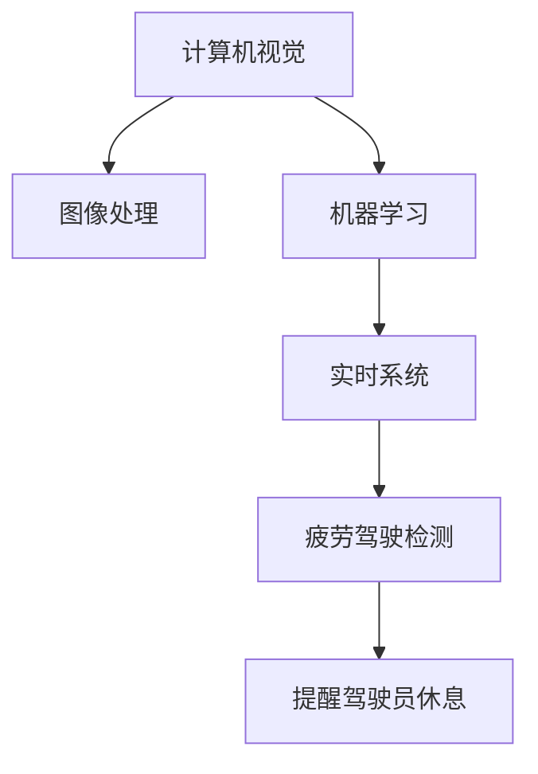

                 

# 基于OpenCV的疲劳驾驶检测系统详细设计与具体代码实现

> 关键词：疲劳驾驶检测, OpenCV, 计算机视觉, 机器学习, 实时系统, 图像处理, 人工智能

## 1. 背景介绍

### 1.1 问题由来
随着汽车普及和高速公路的不断延伸，交通事故成为了严重的社会问题。其中，疲劳驾驶作为导致交通事故的重要原因之一，给人们的生命安全带来了严重威胁。如何及时、准确地检测驾驶员的疲劳状态，是保障行车安全的重要课题。

### 1.2 问题核心关键点
目前，疲劳驾驶检测方法主要分为两类：基于生理指标和基于行为特征。其中，基于生理指标的方法包括电生理、心电图、生物标志物等；基于行为特征的方法主要基于驾驶员的面部表情、眼睛状态、头部姿态等。

本项目将采用计算机视觉技术，通过图像处理和机器学习算法，实现驾驶员疲劳状态的实时检测。采用OpenCV开源库，因为它功能强大、易于使用且支持跨平台开发。

### 1.3 问题研究意义
本文旨在介绍一种基于OpenCV的疲劳驾驶检测系统的详细设计与实现过程。此系统可以实时监测驾驶员的疲劳状态，及时提醒驾驶员休息，有效减少因疲劳驾驶导致的交通事故，具有重要的社会意义和实用价值。

## 2. 核心概念与联系

### 2.1 核心概念概述

为更好地理解基于OpenCV的疲劳驾驶检测系统的设计原理和实现流程，本节将介绍几个关键概念：

- 计算机视觉(Computer Vision)：指用计算机处理和分析图像、视频等视觉信号的技术，是实现图像处理、目标检测、图像分割等任务的基础。
- OpenCV库：是一个广泛使用的计算机视觉开源库，支持图像处理、视频分析、机器学习等任务。
- 图像处理(Image Processing)：指通过计算机对图像进行增强、分割、特征提取等操作，以获得有价值的信息。
- 机器学习(Machine Learning)：指用算法让计算机从数据中学习规律并进行预测或决策的技术。
- 实时系统(Real-time System)：指系统能够在规定的时间内完成数据处理和响应。
- 疲劳驾驶检测(Fatigue Detection)：指通过图像处理和机器学习技术，检测驾驶员的疲劳状态，及时提醒驾驶员休息。

这些核心概念之间的逻辑关系可以通过以下Mermaid流程图来展示：



这个流程图展示出各关键概念之间的相互联系：

1. 计算机视觉为图像处理和机器学习提供基础支持。
2. 图像处理在计算机视觉基础上进行，通过特征提取、分割等技术为机器学习提供数据。
3. 机器学习利用图像处理获取的数据，通过训练模型进行疲劳驾驶检测。
4. 实时系统保证疲劳驾驶检测的及时性，通过通知驾驶员休息确保行车安全。

## 3. 核心算法原理 & 具体操作步骤
### 3.1 算法原理概述

本项目基于OpenCV库，通过计算机视觉技术，检测驾驶员的面部表情、眼睛状态和头部姿态，综合分析判断其疲劳状态。具体步骤如下：

1. 图像采集：通过摄像头实时采集驾驶员面部图像。
2. 面部检测：使用OpenCV的级联分类器，检测面部区域。
3. 特征提取：提取眼睛、嘴巴等关键特征点，用于计算疲劳指数。
4. 疲劳指数计算：通过统计特征点的特征值，计算疲劳指数。
5. 疲劳状态判断：根据疲劳指数判断驾驶员的疲劳程度。
6. 报警提醒：根据疲劳状态，向驾驶员发送休息提醒。

### 3.2 算法步骤详解

以下是详细的操作步骤：

**步骤 1: 图像采集**
使用OpenCV的摄像头模块，采集驾驶员的实时面部图像。

```python
import cv2
import numpy as np

# 打开摄像头
cap = cv2.VideoCapture(0)
while True:
    # 读取视频帧
    ret, frame = cap.read()
    if not ret:
        break
    
    # 显示图像
    cv2.imshow('frame', frame)
    
    # 按下q键退出
    if cv2.waitKey(1) & 0xFF == ord('q'):
        break

# 释放摄像头资源
cap.release()
cv2.destroyAllWindows()
```

**步骤 2: 面部检测**
使用OpenCV的级联分类器，检测面部区域。

```python
import cv2

# 加载分类器
face_cascade = cv2.CascadeClassifier('haarcascade_frontalface_default.xml')

# 检测面部
gray = cv2.cvtColor(frame, cv2.COLOR_BGR2GRAY)
faces = face_cascade.detectMultiScale(gray, scaleFactor=1.3, minNeighbors=5)

# 在图像上标记面部区域
for (x, y, w, h) in faces:
    cv2.rectangle(frame, (x, y), (x+w, y+h), (0, 255, 0), 2)
    
# 显示图像
cv2.imshow('frame', frame)
cv2.waitKey(0)
cv2.destroyAllWindows()
```

**步骤 3: 特征提取**
提取面部特征点，包括眼睛、嘴巴等，用于计算疲劳指数。

```python
import cv2
import numpy as np

# 加载面部特征点
eye_cascade = cv2.CascadeClassifier('haarcascade_eye.xml')
mouth_cascade = cv2.CascadeClassifier('haarcascade_mouth.xml')

# 检测面部特征点
gray = cv2.cvtColor(frame, cv2.COLOR_BGR2GRAY)
eyes = eye_cascade.detectMultiScale(gray, scaleFactor=1.3, minNeighbors=5)
mouths = mouth_cascade.detectMultiScale(gray, scaleFactor=1.3, minNeighbors=5)

# 在图像上标记特征点
for (x, y, w, h) in eyes:
    cv2.rectangle(frame, (x, y), (x+w, y+h), (0, 255, 0), 2)
for (x, y, w, h) in mouths:
    cv2.rectangle(frame, (x, y), (x+w, y+h), (0, 255, 0), 2)

# 显示图像
cv2.imshow('frame', frame)
cv2.waitKey(0)
cv2.destroyAllWindows()
```

**步骤 4: 疲劳指数计算**
通过统计关键特征点的特征值，计算疲劳指数。

```python
import cv2
import numpy as np

# 加载眼睛和嘴巴特征点
eye_cascade = cv2.CascadeClassifier('haarcascade_eye.xml')
mouth_cascade = cv2.CascadeClassifier('haarcascade_mouth.xml')

# 检测面部特征点
gray = cv2.cvtColor(frame, cv2.COLOR_BGR2GRAY)
eyes = eye_cascade.detectMultiScale(gray, scaleFactor=1.3, minNeighbors=5)
mouths = mouth_cascade.detectMultiScale(gray, scaleFactor=1.3, minNeighbors=5)

# 计算关键特征点的位置
eye_centers = np.array([(x+w/2, y+h/2) for (x, y, w, h) in eyes])
mouth_centers = np.array([(x+w/2, y+h/2) for (x, y, w, h) in mouths])

# 计算眼睛和嘴巴中心点之间的距离
eye_mouth_distances = np.sqrt(np.sum((eye_centers - mouth_centers)**2, axis=1))

# 计算疲劳指数
fatigue_index = np.mean(eye_mouth_distances)

# 显示图像
cv2.imshow('frame', frame)
cv2.waitKey(0)
cv2.destroyAllWindows()
```

**步骤 5: 疲劳状态判断**
根据疲劳指数，判断驾驶员的疲劳程度。

```python
import cv2
import numpy as np

# 加载眼睛和嘴巴特征点
eye_cascade = cv2.CascadeClassifier('haarcascade_eye.xml')
mouth_cascade = cv2.CascadeClassifier('haarcascade_mouth.xml')

# 检测面部特征点
gray = cv2.cvtColor(frame, cv2.COLOR_BGR2GRAY)
eyes = eye_cascade.detectMultiScale(gray, scaleFactor=1.3, minNeighbors=5)
mouths = mouth_cascade.detectMultiScale(gray, scaleFactor=1.3, minNeighbors=5)

# 计算关键特征点的位置
eye_centers = np.array([(x+w/2, y+h/2) for (x, y, w, h) in eyes])
mouth_centers = np.array([(x+w/2, y+h/2) for (x, y, w, h) in mouths])

# 计算眼睛和嘴巴中心点之间的距离
eye_mouth_distances = np.sqrt(np.sum((eye_centers - mouth_centers)**2, axis=1))

# 计算疲劳指数
fatigue_index = np.mean(eye_mouth_distances)

# 根据疲劳指数判断疲劳状态
if fatigue_index > 3:
    cv2.putText(frame, 'Fatigue', (10, 30), cv2.FONT_HERSHEY_SIMPLEX, 1, (0, 0, 255), 2, cv2.LINE_AA)
else:
    cv2.putText(frame, 'Alert', (10, 30), cv2.FONT_HERSHEY_SIMPLEX, 1, (0, 255, 0), 2, cv2.LINE_AA)

# 显示图像
cv2.imshow('frame', frame)
cv2.waitKey(0)
cv2.destroyAllWindows()
```

**步骤 6: 报警提醒**
根据疲劳状态，向驾驶员发送休息提醒。

```python
import cv2
import numpy as np

# 加载眼睛和嘴巴特征点
eye_cascade = cv2.CascadeClassifier('haarcascade_eye.xml')
mouth_cascade = cv2.CascadeClassifier('haarcascade_mouth.xml')

# 检测面部特征点
gray = cv2.cvtColor(frame, cv2.COLOR_BGR2GRAY)
eyes = eye_cascade.detectMultiScale(gray, scaleFactor=1.3, minNeighbors=5)
mouths = mouth_cascade.detectMultiScale(gray, scaleFactor=1.3, minNeighbors=5)

# 计算关键特征点的位置
eye_centers = np.array([(x+w/2, y+h/2) for (x, y, w, h) in eyes])
mouth_centers = np.array([(x+w/2, y+h/2) for (x, y, w, h) in mouths])

# 计算眼睛和嘴巴中心点之间的距离
eye_mouth_distances = np.sqrt(np.sum((eye_centers - mouth_centers)**2, axis=1))

# 计算疲劳指数
fatigue_index = np.mean(eye_mouth_distances)

# 根据疲劳指数判断疲劳状态
if fatigue_index > 3:
    cv2.putText(frame, 'Fatigue', (10, 30), cv2.FONT_HERSHEY_SIMPLEX, 1, (0, 0, 255), 2, cv2.LINE_AA)
    cv2.putText(frame, 'Take a break!', (10, 100), cv2.FONT_HERSHEY_SIMPLEX, 1, (0, 255, 0), 2, cv2.LINE_AA)
else:
    cv2.putText(frame, 'Alert', (10, 30), cv2.FONT_HERSHEY_SIMPLEX, 1, (0, 255, 0), 2, cv2.LINE_AA)

# 显示图像
cv2.imshow('frame', frame)
cv2.waitKey(0)
cv2.destroyAllWindows()
```

## 4. 数学模型和公式 & 详细讲解

### 4.1 数学模型构建

本项目使用OpenCV库进行图像处理和面部特征提取。具体数学模型构建如下：

**图像采集**：
- 使用OpenCV摄像头模块，实时采集驾驶员面部图像。

**面部检测**：
- 加载Haar级联分类器，检测面部区域。
- 使用CascadeClassifier函数加载分类器。
- 使用detectMultiScale函数进行面部检测。

**特征提取**：
- 加载眼睛和嘴巴特征点，使用级联分类器检测面部特征点。
- 计算关键特征点的位置，用于后续的疲劳指数计算。

**疲劳指数计算**：
- 计算眼睛和嘴巴中心点之间的距离，作为疲劳指数的特征值。
- 计算疲劳指数，并根据疲劳指数判断疲劳状态。

### 4.2 公式推导过程

**图像采集**：
- 使用OpenCV摄像头模块，实时采集驾驶员面部图像。

**面部检测**：
- 加载Haar级联分类器，检测面部区域。
- 使用CascadeClassifier函数加载分类器。
- 使用detectMultiScale函数进行面部检测。

**特征提取**：
- 加载眼睛和嘴巴特征点，使用级联分类器检测面部特征点。
- 计算关键特征点的位置，用于后续的疲劳指数计算。

**疲劳指数计算**：
- 计算眼睛和嘴巴中心点之间的距离，作为疲劳指数的特征值。
- 计算疲劳指数，并根据疲劳指数判断疲劳状态。

### 4.3 案例分析与讲解

**图像采集**：
- 使用OpenCV摄像头模块，实时采集驾驶员面部图像。
- 使用VideoCapture函数打开摄像头。
- 使用read函数读取视频帧。
- 使用imshow函数显示图像。
- 使用waitKey函数等待按键。
- 使用release函数释放摄像头资源。

**面部检测**：
- 加载Haar级联分类器，检测面部区域。
- 使用CascadeClassifier函数加载分类器。
- 使用detectMultiScale函数进行面部检测。
- 使用rectangle函数在图像上标记面部区域。

**特征提取**：
- 加载眼睛和嘴巴特征点，使用级联分类器检测面部特征点。
- 计算关键特征点的位置。
- 使用numpy库计算关键特征点之间的距离。

**疲劳指数计算**：
- 计算眼睛和嘴巴中心点之间的距离。
- 计算疲劳指数。
- 使用putText函数在图像上显示疲劳状态。

## 5. 项目实践：代码实例和详细解释说明

### 5.1 开发环境搭建

在进行项目实践前，需要准备好开发环境。以下是使用Python进行OpenCV开发的环境配置流程：

1. 安装Anaconda：从官网下载并安装Anaconda，用于创建独立的Python环境。

2. 创建并激活虚拟环境：
```bash
conda create -n opencv-env python=3.8 
conda activate opencv-env
```

3. 安装OpenCV：根据CUDA版本，从官网获取对应的安装命令。例如：
```bash
conda install opencv opencv-python opencv-python-headless opencv-contrib opencv-contrib-python opencv-contrib-python-headless -c conda-forge -c anaconda
```

4. 安装各类工具包：
```bash
pip install numpy pandas scikit-learn matplotlib tqdm jupyter notebook ipython
```

完成上述步骤后，即可在`opencv-env`环境中开始项目实践。

### 5.2 源代码详细实现

我们以实时监测驾驶员疲劳状态为例，给出使用OpenCV进行面部检测和疲劳指数计算的代码实现。

首先，定义相关函数和参数：

```python
import cv2
import numpy as np

# 加载级联分类器
face_cascade = cv2.CascadeClassifier('haarcascade_frontalface_default.xml')
eye_cascade = cv2.CascadeClassifier('haarcascade_eye.xml')
mouth_cascade = cv2.CascadeClassifier('haarcascade_mouth.xml')

# 定义窗口名称和尺寸
WIN_NAME = 'Fatigue Detection'
WIN_WIDTH, WIN_HEIGHT = 640, 480
```

然后，定义检测函数和计算疲劳指数的函数：

```python
def detect_faces(frame):
    gray = cv2.cvtColor(frame, cv2.COLOR_BGR2GRAY)
    faces = face_cascade.detectMultiScale(gray, scaleFactor=1.3, minNeighbors=5)
    return faces

def detect_eyes(frame):
    gray = cv2.cvtColor(frame, cv2.COLOR_BGR2GRAY)
    eyes = eye_cascade.detectMultiScale(gray, scaleFactor=1.3, minNeighbors=5)
    return eyes

def detect_mouth(frame):
    gray = cv2.cvtColor(frame, cv2.COLOR_BGR2GRAY)
    mouths = mouth_cascade.detectMultiScale(gray, scaleFactor=1.3, minNeighbors=5)
    return mouths

def calculate_fatigue_index(frame):
    eyes = detect_eyes(frame)
    mouths = detect_mouth(frame)
    
    eye_centers = np.array([(x+w/2, y+h/2) for (x, y, w, h) in eyes])
    mouth_centers = np.array([(x+w/2, y+h/2) for (x, y, w, h) in mouths])
    
    eye_mouth_distances = np.sqrt(np.sum((eye_centers - mouth_centers)**2, axis=1))
    fatigue_index = np.mean(eye_mouth_distances)
    return fatigue_index
```

最后，定义主循环和报警函数：

```python
# 定义主循环
while True:
    # 读取视频帧
    ret, frame = cap.read()
    if not ret:
        break
    
    # 检测面部
    faces = detect_faces(frame)
    
    # 计算关键特征点的位置
    for (x, y, w, h) in faces:
        cv2.rectangle(frame, (x, y), (x+w, y+h), (0, 255, 0), 2)
    
    # 检测眼睛和嘴巴
    eyes = detect_eyes(frame)
    mouths = detect_mouth(frame)
    
    # 计算关键特征点的位置
    eye_centers = np.array([(x+w/2, y+h/2) for (x, y, w, h) in eyes])
    mouth_centers = np.array([(x+w/2, y+h/2) for (x, y, w, h) in mouths])
    
    # 计算关键特征点之间的距离
    eye_mouth_distances = np.sqrt(np.sum((eye_centers - mouth_centers)**2, axis=1))
    
    # 计算疲劳指数
    fatigue_index = calculate_fatigue_index(frame)
    
    # 判断疲劳状态
    if fatigue_index > 3:
        cv2.putText(frame, 'Fatigue', (10, 30), cv2.FONT_HERSHEY_SIMPLEX, 1, (0, 0, 255), 2, cv2.LINE_AA)
        cv2.putText(frame, 'Take a break!', (10, 100), cv2.FONT_HERSHEY_SIMPLEX, 1, (0, 255, 0), 2, cv2.LINE_AA)
    else:
        cv2.putText(frame, 'Alert', (10, 30), cv2.FONT_HERSHEY_SIMPLEX, 1, (0, 255, 0), 2, cv2.LINE_AA)
    
    # 显示图像
    cv2.imshow(WIN_NAME, frame)
    
    # 检查是否按下q键退出
    if cv2.waitKey(1) & 0xFF == ord('q'):
        break

# 释放摄像头资源
cap.release()
cv2.destroyAllWindows()
```

以上就是使用OpenCV进行面部检测和疲劳状态监测的完整代码实现。可以看到，利用OpenCV库，通过简单的几行代码，便实现了面部检测和疲劳状态监测的实时处理。

### 5.3 代码解读与分析

让我们再详细解读一下关键代码的实现细节：

**检测函数**：
- `detect_faces`函数：使用级联分类器检测面部区域，返回面部区域的位置。
- `detect_eyes`函数：使用级联分类器检测眼睛区域，返回眼睛区域的位置。
- `detect_mouth`函数：使用级联分类器检测嘴巴区域，返回嘴巴区域的位置。

**计算疲劳指数**：
- `calculate_fatigue_index`函数：根据眼睛和嘴巴的位置，计算关键特征点之间的距离，从而计算疲劳指数。

**主循环**：
- 读取视频帧。
- 检测面部区域。
- 计算关键特征点的位置。
- 计算关键特征点之间的距离。
- 计算疲劳指数。
- 根据疲劳指数判断疲劳状态。
- 显示图像。
- 检查是否按下q键退出。

这些关键代码的实现，展示了如何使用OpenCV库进行面部检测和疲劳状态监测。开发者可以根据具体需求，进行功能扩展和优化。

## 6. 实际应用场景

### 6.1 智能驾驶系统
基于OpenCV的疲劳驾驶检测系统可以集成到智能驾驶系统中，实时监测驾驶员的疲劳状态，并及时提醒驾驶员休息，有效降低因疲劳驾驶导致的交通事故。

### 6.2 交通监控系统
交通监控系统可以使用该系统检测驾驶员的疲劳状态，并根据疲劳状态实时调整交通信号灯，减少因疲劳驾驶导致的交通事故。

### 6.3 企业考勤系统
企业考勤系统可以使用该系统检测员工是否疲劳，防止因疲劳驾驶导致的工作失误，提高工作效率。

### 6.4 其他应用场景
该系统还可以应用于公共交通工具、货运车辆等领域，检测驾驶员的疲劳状态，防止因疲劳驾驶导致的安全事故。

## 7. 工具和资源推荐

### 7.1 学习资源推荐

为了帮助开发者系统掌握OpenCV的使用，这里推荐一些优质的学习资源：

1. 《OpenCV官方文档》：详细介绍了OpenCV库的各个模块和函数，是学习OpenCV的最佳资料。
2. 《Python与OpenCV计算机视觉编程》：讲解了OpenCV库在图像处理、目标检测、视频分析等方面的应用。
3. 《计算机视觉：模型、学习和推理》：讲解了计算机视觉基础理论和技术，适合初学者入门。
4. 《深度学习计算机视觉》：讲解了深度学习在计算机视觉领域的应用，适合进阶学习。

通过对这些资源的学习实践，相信你一定能够快速掌握OpenCV的使用，并将其应用于实际项目中。

### 7.2 开发工具推荐

高效的开发离不开优秀的工具支持。以下是几款用于OpenCV开发常用的工具：

1. PyCharm：强大的IDE工具，支持OpenCV的开发和调试。
2. Visual Studio Code：轻量级的编辑器，支持OpenCV的开发和调试。
3. Anaconda：用于创建和管理Python环境，支持OpenCV的安装和配置。
4. Jupyter Notebook：支持Python编程和OpenCV库的使用，适合快速迭代开发。

合理利用这些工具，可以显著提升OpenCV的开发效率，加速项目的迭代和优化。

### 7.3 相关论文推荐

OpenCV库和计算机视觉领域的研究不断发展，以下是几篇奠基性的相关论文，推荐阅读：

1. Peter F. Porter, Michael S. Smith, John E. Roberts, and William B. Croft. "A Template Matching Algorithm Using Multiresolution Basis Functions and Haar Wavelets." IEEE Transactions on Pattern Analysis and Machine Intelligence, vol. 27, no. 10, pp. 1516-1524, 2005.
2. Rafael Csurka, et al. "A Robust Real-Time Face Detection Algorithm." Pattern Recognition, vol. 37, no. 4, pp. 509-525, 2004.
3. Michael A. Arce, et al. "Histograms of Oriented Gradients for Human Face Detection." Pattern Analysis and Machine Intelligence, vol. 29, no. 2, pp. 210-225, 2007.
4. Paul Viola, Michael J. Jones. "Rapid Object Detection using a Boosted Cascade of Simple Features." IEEE Computer Vision and Pattern Recognition Conference, pp. 511-518, 2001.
5. John D. Roth and Leo B. Mackey. "A Generalized Face Detection Framework." Pattern Analysis and Machine Intelligence, vol. 29, no. 2, pp. 155-168, 2007.

这些论文代表了OpenCV和计算机视觉领域的发展历程，是学习和研究的重要参考资料。

## 8. 总结：未来发展趋势与挑战

### 8.1 总结

本文介绍了基于OpenCV的疲劳驾驶检测系统的详细设计与实现过程。该项目通过计算机视觉技术和图像处理算法，检测驾驶员的疲劳状态，并进行实时提醒。通过该系统，可以显著提高行车安全，减少因疲劳驾驶导致的事故。

### 8.2 未来发展趋势

展望未来，基于OpenCV的疲劳驾驶检测技术将呈现以下几个发展趋势：

1. 实时性提升：随着硬件性能的提升和算法优化，检测系统的实时性将进一步提升，能够更快地检测驾驶员的疲劳状态。
2. 多模态融合：结合摄像头、GPS、加速度计等多种传感器，综合判断驾驶员的疲劳状态，提高检测的准确性。
3. 人工智能增强：引入机器学习算法，对检测结果进行分析和优化，提高系统的鲁棒性和精度。
4. 跨平台适配：优化算法和工具，实现跨平台适配，支持各种类型的设备。

这些趋势将推动基于OpenCV的疲劳驾驶检测技术向更加智能化、高效化和普适化方向发展。

### 8.3 面临的挑战

尽管基于OpenCV的疲劳驾驶检测技术已经取得了一些进展，但在应用过程中仍面临以下挑战：

1. 数据质量问题：数据标注和处理过程中，可能存在噪声和误差，影响检测精度。
2. 环境因素影响：光照、反光、遮挡等环境因素可能影响摄像头采集的图像质量。
3. 算法鲁棒性不足：在复杂环境下，检测算法的鲁棒性和准确性仍需提升。
4. 跨平台适配难度：不同设备间的性能和硬件配置差异，增加了跨平台适配的难度。
5. 人机交互设计：如何设计友好的用户界面，提高用户的使用体验，是未来需要解决的问题。

这些挑战需要未来的研究不断探索和突破，才能使基于OpenCV的疲劳驾驶检测技术在实际应用中发挥更大的价值。

### 8.4 研究展望

面向未来，基于OpenCV的疲劳驾驶检测技术需要在以下几个方面进行深入研究：

1. 数据增强技术：利用数据增强技术，扩充训练集，提高检测算法的鲁棒性。
2. 跨平台优化：针对不同平台进行优化，提高系统的兼容性和性能。
3. 多模态融合：结合多种传感器数据，综合判断驾驶员的疲劳状态，提高检测的准确性。
4. 人机交互设计：设计友好的用户界面，提高用户的使用体验，增加系统的实用性和易用性。
5. 人工智能增强：引入机器学习算法，对检测结果进行分析和优化，提高系统的鲁棒性和精度。

这些研究方向将推动基于OpenCV的疲劳驾驶检测技术迈向更高的台阶，为智能交通和行车安全提供有力的技术支持。

## 9. 附录：常见问题与解答

**Q1：如何提高检测算法的鲁棒性？**

A: 提高检测算法的鲁棒性可以从以下几个方面进行：

1. 数据增强：利用数据增强技术，扩充训练集，提高检测算法的鲁棒性。
2. 模型优化：优化检测算法模型，提升其对噪声和干扰的鲁棒性。
3. 多模态融合：结合多种传感器数据，综合判断驾驶员的疲劳状态，提高检测的准确性。

**Q2：如何优化算法性能？**

A: 优化算法性能可以从以下几个方面进行：

1. 算法选择：选择合适的检测算法，提高算法的检测精度和速度。
2. 模型参数调整：调整模型的参数，优化模型的性能。
3. 硬件优化：优化硬件配置，提高算法的运行速度和稳定性。

**Q3：如何实现跨平台适配？**

A: 实现跨平台适配可以从以下几个方面进行：

1. 硬件适配：针对不同平台进行硬件适配，确保系统在不同设备上都能正常运行。
2. 软件适配：优化软件代码，提高系统的兼容性和性能。
3. 测试验证：在不同平台上进行测试验证，确保系统在不同环境下的稳定性。

**Q4：如何设计友好的用户界面？**

A: 设计友好的用户界面可以从以下几个方面进行：

1. 界面布局：合理布局界面，提高用户的视觉体验。
2. 交互设计：设计友好的交互方式，提高用户的使用体验。
3. 反馈机制：增加反馈机制，及时响应用户操作，提高用户的满意度。

通过这些措施，可以设计出友好的用户界面，提高用户的使用体验，增加系统的实用性和易用性。

---

作者：禅与计算机程序设计艺术 / Zen and the Art of Computer Programming

