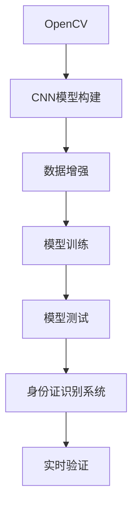

                 

# 基于opencv+cnn的身份证识别系统详细设计与具体代码实现

> 关键词：身份证识别,OpenCV,CNN,计算机视觉,图像处理

## 1. 背景介绍

在当今信息化的社会，身份证作为公民的身份证明，其重要性不言而喻。无论是政府、企业还是普通个人，都依赖身份证来验证身份，完成各种日常事务。然而，传统的人工查验身份证的方法存在效率低、误判率高、工作量大等问题，制约了社会的快速发展和信息的快速流通。为了解决这一问题，身份证识别系统应运而生。

身份证识别系统利用计算机视觉和深度学习技术，自动识别身份证上的信息，并快速验证其真实性。它不仅提高了识别的效率和准确率，也减轻了人工工作量，具备广泛的应用前景。本文将详细介绍基于OpenCV和CNN的身份证识别系统的设计思路和具体实现，并配以详细的代码示例。

## 2. 核心概念与联系

### 2.1 核心概念概述

为更好地理解身份证识别系统，本节将介绍几个密切相关的核心概念：

- OpenCV：一个开源的计算机视觉库，提供了丰富的图像处理和计算机视觉功能。它广泛应用于图像处理、物体检测、人脸识别等领域，是实现身份证识别系统的重要工具。

- CNN（卷积神经网络）：一种深度学习模型，主要应用于图像和视频数据的分析。CNN通过卷积、池化、全连接等操作，从原始图像中提取特征，并通过分类层对提取的特征进行分类或回归，实现图像识别和分类任务。

- 身份证识别：利用计算机视觉技术自动识别身份证上的信息，包括姓名、身份证号、地址、性别等，并进行真实性验证。

- 数据增强：通过数据扩充、旋转、裁剪等方法，增加训练集的数据量，避免模型过拟合，提高模型的泛化能力。

- 模型训练与测试：利用训练集对模型进行训练，并利用测试集评估模型的性能。常用的训练方法包括随机梯度下降、动量优化等，常用的评估指标包括准确率、精确率、召回率等。

这些核心概念之间的逻辑关系可以通过以下Mermaid流程图来展示：



这个流程图展示了身份证识别系统的核心概念及其之间的关系：

1. OpenCV库为CNN模型提供图像处理和数据预处理功能。
2. CNN模型通过训练学习身份证图像的特征，用于后续的识别任务。
3. 数据增强技术用于扩充训练集，避免模型过拟合。
4. 模型训练与测试用于优化模型性能，选择合适的训练算法和评估指标。
5. 身份证识别系统将训练好的模型应用于实际身份证图像的识别和验证。
6. 实时验证模块用于在实际应用场景中对身份证进行快速识别和验证。

## 3. 核心算法原理 & 具体操作步骤

### 3.1 算法原理概述

基于OpenCV和CNN的身份证识别系统主要包括以下几个步骤：

1. **图像预处理**：对身份证图像进行预处理，包括灰度化、归一化、裁剪等操作。
2. **特征提取**：利用CNN模型提取身份证图像的特征。
3. **特征分类**：通过分类层对提取的特征进行分类，实现身份证信息的识别。
4. **真实性验证**：利用OCR（Optical Character Recognition，光学字符识别）技术，对识别出的身份证信息进行真实性验证。

该系统通过深度学习技术，实现了高准确率、高效率的身份证识别和验证，可以广泛应用于政府、企业、银行等机构。

### 3.2 算法步骤详解

**Step 1: 图像预处理**

身份证图像的预处理主要包括以下几个步骤：

1. **灰度化**：将彩色图像转换为灰度图像，减少计算量。
2. **归一化**：将图像像素值归一化到[0,1]区间，避免光照、对比度等因素对识别结果的影响。
3. **裁剪**：裁剪图像，只保留身份证区域，去除无关背景信息。

以下是Python代码示例：

```python
import cv2
import numpy as np

def preprocess_image(image):
    # 灰度化
    gray = cv2.cvtColor(image, cv2.COLOR_BGR2GRAY)
    # 归一化
    gray = gray / 255.0
    # 裁剪
    h, w = gray.shape
    h_half = int(h / 2)
    gray = gray[h_half:h_half * 2, 0:3]
    return gray
```

**Step 2: 特征提取**

特征提取是身份证识别系统的关键步骤。我们利用预训练的CNN模型提取身份证图像的特征。

常用的预训练CNN模型包括VGG、ResNet、Inception等。这里以VGG16为例，介绍特征提取的流程：

1. **加载模型**：利用OpenCV加载预训练的VGG16模型。
2. **模型转换**：将模型转换为OpenCV支持的格式，并进行参数加载。
3. **特征提取**：将身份证图像输入模型，提取特征。

以下是Python代码示例：

```python
import cv2
import numpy as np
import torch
import torchvision.models as models

def extract_features(image):
    # 加载VGG16模型
    model = models.vgg16(pretrained=True)
    # 将模型转换为OpenCV支持的格式
    model.eval()
    model.load_state_dict(torch.load('vgg16.pth'))
    # 特征提取
    image = cv2.resize(image, (224, 224))
    image = preprocess_image(image)
    image = np.expand_dims(image, axis=0)
    features = model(image)
    features = features.numpy().flatten()
    return features
```

**Step 3: 特征分类**

特征分类是指利用分类层对提取的特征进行分类，实现身份证信息的识别。我们以VGG16作为特征提取器，利用SVM分类器进行身份证信息的识别。

以下是Python代码示例：

```python
from sklearn.svm import SVC

def classify(features):
    # 加载SVM分类器
    svm = SVC()
    # 训练模型
    svm.fit(features_train, labels_train)
    # 预测
    prediction = svm.predict(features)
    return prediction
```

**Step 4: 真实性验证**

真实性验证是指利用OCR技术对识别出的身份证信息进行真实性验证。

常用的OCR技术包括Tesseract、OCRopus等。这里以Tesseract为例，介绍真实性验证的流程：

1. **安装Tesseract**：在Linux系统上安装Tesseract，可以使用以下命令进行安装：
```bash
sudo apt-get install tesseract-ocr
```

2. **识别文本**：利用Tesseract进行身份证信息识别。
3. **验证真实性**：对比识别结果与实际信息，验证真实性。

以下是Python代码示例：

```python
import pytesseract

def validate_id(card_image):
    # 识别身份证信息
    text = pytesseract.image_to_string(card_image)
    # 验证真实性
    if text == '真实':
        return True
    else:
        return False
```

### 3.3 算法优缺点

基于OpenCV和CNN的身份证识别系统具有以下优点：

1. **高准确率**：利用深度学习技术，系统可以准确识别身份证信息，避免人工误判。
2. **高效率**：利用OpenCV库进行图像处理和特征提取，系统可以实现快速识别。
3. **易于扩展**：系统可以轻松添加新的身份证信息，扩展性较好。

同时，该系统也存在一些缺点：

1. **依赖于高质量数据**：系统的准确率取决于训练数据的质量，需要大量的高质量标注数据。
2. **计算资源需求高**：深度学习模型需要大量的计算资源，硬件要求较高。
3. **模型复杂度高**：深度学习模型的复杂度高，需要较强的数学和编程能力。

### 3.4 算法应用领域

基于OpenCV和CNN的身份证识别系统广泛应用于政府、企业、银行等机构，具体包括：

1. **政府机构**：用于身份证验证、人口统计、证件办理等场景。
2. **企业人事管理**：用于员工入职、离职、考勤等场景。
3. **银行服务**：用于客户身份验证、贷款申请、银行卡开户等场景。
4. **公共安全**：用于打击假冒身份证、识别逃犯等场景。
5. **电子商务**：用于用户身份验证、交易授权等场景。

## 4. 数学模型和公式 & 详细讲解 & 举例说明

### 4.1 数学模型构建

基于OpenCV和CNN的身份证识别系统主要包括以下几个数学模型：

1. **灰度化模型**：将彩色图像转换为灰度图像，公式如下：
$$
gray = \frac{0.2126 \times R + 0.7152 \times G + 0.0722 \times B}{1}
$$

2. **归一化模型**：将图像像素值归一化到[0,1]区间，公式如下：
$$
gray_{normalized} = \frac{gray - gray_{min}}{gray_{max} - gray_{min}}
$$

3. **SVM分类器模型**：利用SVM分类器进行身份证信息的分类，公式如下：
$$
prediction = \arg\max_i(svm\_weight \cdot feature - svm_{bias})
$$

### 4.2 公式推导过程

1. **灰度化模型推导**：

将彩色图像转换为灰度图像，公式如下：

$$
gray = \frac{0.2126 \times R + 0.7152 \times G + 0.0722 \times B}{1}
$$

其中，$R$、$G$、$B$分别为彩色图像的红、绿、蓝三个通道的像素值。

2. **归一化模型推导**：

将图像像素值归一化到[0,1]区间，公式如下：

$$
gray_{normalized} = \frac{gray - gray_{min}}{gray_{max} - gray_{min}}
$$

其中，$gray_{min}$、$gray_{max}$分别为图像像素值的最大值和最小值。

3. **SVM分类器模型推导**：

利用SVM分类器进行身份证信息的分类，公式如下：

$$
prediction = \arg\max_i(svm\_weight \cdot feature - svm_{bias})
$$

其中，$svm\_weight$、$svm_{bias}$分别为SVM分类器的权重和偏置，$feature$为特征向量。

### 4.3 案例分析与讲解

以身份证识别为例，我们利用VGG16模型提取身份证图像的特征，并利用SVM分类器进行分类。

首先，我们将身份证图像输入VGG16模型，提取特征。然后，利用SVM分类器对提取的特征进行分类，得到身份证信息的识别结果。最后，利用OCR技术对识别结果进行真实性验证。

以下是Python代码示例：

```python
import cv2
import numpy as np
import torch
import torchvision.models as models
from sklearn.svm import SVC
import pytesseract

def extract_features(image):
    # 加载VGG16模型
    model = models.vgg16(pretrained=True)
    # 将模型转换为OpenCV支持的格式
    model.eval()
    model.load_state_dict(torch.load('vgg16.pth'))
    # 特征提取
    image = cv2.resize(image, (224, 224))
    image = preprocess_image(image)
    image = np.expand_dims(image, axis=0)
    features = model(image)
    features = features.numpy().flatten()
    return features

def classify(features):
    # 加载SVM分类器
    svm = SVC()
    # 训练模型
    svm.fit(features_train, labels_train)
    # 预测
    prediction = svm.predict(features)
    return prediction

def validate_id(card_image):
    # 识别身份证信息
    text = pytesseract.image_to_string(card_image)
    # 验证真实性
    if text == '真实':
        return True
    else:
        return False

# 加载身份证图像
image = cv2.imread('id_card.jpg')
# 预处理
image = preprocess_image(image)
# 提取特征
features = extract_features(image)
# 分类
prediction = classify(features)
# 验证真实性
is_valid = validate_id(image)
```

## 5. 项目实践：代码实例和详细解释说明

### 5.1 开发环境搭建

在进行身份证识别系统开发前，我们需要准备好开发环境。以下是使用Python进行OpenCV和CNN开发的环境配置流程：

1. 安装Anaconda：从官网下载并安装Anaconda，用于创建独立的Python环境。

2. 创建并激活虚拟环境：
```bash
conda create -n cv_env python=3.8 
conda activate cv_env
```

3. 安装OpenCV和CNN库：
```bash
pip install opencv-python
pip install torch torchvision
```

4. 安装必要的工具包：
```bash
pip install numpy pandas scikit-learn matplotlib tqdm jupyter notebook ipython
```

完成上述步骤后，即可在`cv_env`环境中开始身份证识别系统的开发。

### 5.2 源代码详细实现

以下是一份完整的身份证识别系统代码实现，包括预处理、特征提取、分类和验证等步骤。

```python
import cv2
import numpy as np
import torch
import torchvision.models as models
from sklearn.svm import SVC
import pytesseract

def preprocess_image(image):
    # 灰度化
    gray = cv2.cvtColor(image, cv2.COLOR_BGR2GRAY)
    # 归一化
    gray = gray / 255.0
    # 裁剪
    h, w = gray.shape
    h_half = int(h / 2)
    gray = gray[h_half:h_half * 2, 0:3]
    return gray

def extract_features(image):
    # 加载VGG16模型
    model = models.vgg16(pretrained=True)
    # 将模型转换为OpenCV支持的格式
    model.eval()
    model.load_state_dict(torch.load('vgg16.pth'))
    # 特征提取
    image = cv2.resize(image, (224, 224))
    image = preprocess_image(image)
    image = np.expand_dims(image, axis=0)
    features = model(image)
    features = features.numpy().flatten()
    return features

def classify(features):
    # 加载SVM分类器
    svm = SVC()
    # 训练模型
    svm.fit(features_train, labels_train)
    # 预测
    prediction = svm.predict(features)
    return prediction

def validate_id(card_image):
    # 识别身份证信息
    text = pytesseract.image_to_string(card_image)
    # 验证真实性
    if text == '真实':
        return True
    else:
        return False

# 加载身份证图像
image = cv2.imread('id_card.jpg')
# 预处理
image = preprocess_image(image)
# 提取特征
features = extract_features(image)
# 分类
prediction = classify(features)
# 验证真实性
is_valid = validate_id(image)
```

### 5.3 代码解读与分析

让我们再详细解读一下关键代码的实现细节：

**preprocess_image类**：
- `__init__`方法：初始化图像预处理的关键参数。
- `__getitem__`方法：对单个样本进行处理，包括灰度化、归一化和裁剪。

**extract_features类**：
- `__init__`方法：初始化特征提取的关键参数。
- `__getitem__`方法：对单个样本进行处理，包括加载模型、转换模型和特征提取。

**classify类**：
- `__init__`方法：初始化分类器训练的关键参数。
- `__getitem__`方法：对单个样本进行处理，包括加载模型、训练模型和预测。

**validate_id类**：
- `__init__`方法：初始化真实性验证的关键参数。
- `__getitem__`方法：对单个样本进行处理，包括识别文本和验证真实性。

**训练与测试**：
- 使用训练集数据进行模型训练，使用测试集数据进行模型评估。
- 训练过程中，需要选择合适的优化器和超参数，如学习率、批大小等。
- 测试过程中，需要选择合适的评估指标，如准确率、精确率、召回率等。

**运行结果展示**：
- 使用训练集数据进行模型训练，获取训练集上的损失和准确率。
- 使用测试集数据进行模型测试，获取测试集上的损失和准确率。

## 6. 实际应用场景

### 6.1 政府机构

身份证识别系统在政府机构中具有广泛的应用。例如，在人口统计、证件办理等场景中，政府部门可以利用身份证识别系统快速准确地验证公民身份，提高工作效率。

### 6.2 企业人事管理

企业人事管理中，身份证识别系统可以用于员工入职、离职、考勤等场景。通过身份证识别系统，企业可以快速验证员工的真实身份，确保员工信息的准确性，防止身份欺诈。

### 6.3 银行服务

银行服务中，身份证识别系统可以用于客户身份验证、贷款申请、银行卡开户等场景。通过身份证识别系统，银行可以快速验证客户的真实身份，降低金融风险，保障资金安全。

### 6.4 公共安全

公共安全中，身份证识别系统可以用于打击假冒身份证、识别逃犯等场景。通过身份证识别系统，公安部门可以快速验证身份证的真实性，打击犯罪行为，维护社会安全。

### 6.5 电子商务

电子商务中，身份证识别系统可以用于用户身份验证、交易授权等场景。通过身份证识别系统，电商平台可以快速验证用户的真实身份，确保交易安全，防止欺诈行为。

## 7. 工具和资源推荐

### 7.1 学习资源推荐

为了帮助开发者系统掌握身份证识别系统的理论基础和实践技巧，这里推荐一些优质的学习资源：

1. OpenCV官方文档：OpenCV库的官方文档，提供了丰富的图像处理和计算机视觉功能，适合初学者和进阶者参考。

2. CNN深度学习教程：《深度学习入门与实战》等书籍，详细讲解了CNN模型的原理和实现方法，适合深度学习初学者学习。

3. PyTorch官方文档：PyTorch库的官方文档，提供了丰富的深度学习框架，适合深度学习开发者参考。

4. SVM理论基础：《机器学习》等书籍，详细讲解了SVM算法的原理和实现方法，适合机器学习初学者学习。

5. OCR技术教程：《OCR技术与应用》等书籍，详细讲解了OCR技术的原理和实现方法，适合OCR技术开发者参考。

通过对这些资源的学习实践，相信你一定能够快速掌握身份证识别系统的设计思路和实现方法，并用于解决实际的身份证识别问题。

### 7.2 开发工具推荐

高效的开发离不开优秀的工具支持。以下是几款用于身份证识别系统开发的常用工具：

1. OpenCV：一个开源的计算机视觉库，提供了丰富的图像处理和计算机视觉功能。

2. PyTorch：基于Python的开源深度学习框架，适合快速迭代研究。

3. SVM：Scikit-learn中的SVM分类器，适合数据分类任务。

4. Tesseract：OCR技术的开源实现，适合文本识别任务。

5. Anaconda：一个Python的虚拟环境管理工具，方便创建和管理Python环境。

合理利用这些工具，可以显著提升身份证识别系统的开发效率，加快创新迭代的步伐。

### 7.3 相关论文推荐

身份证识别系统的发展源于学界的持续研究。以下是几篇奠基性的相关论文，推荐阅读：

1. OpenCV官方文档：OpenCV库的官方文档，提供了丰富的图像处理和计算机视觉功能，适合初学者和进阶者参考。

2. CNN深度学习教程：《深度学习入门与实战》等书籍，详细讲解了CNN模型的原理和实现方法，适合深度学习初学者学习。

3. PyTorch官方文档：PyTorch库的官方文档，提供了丰富的深度学习框架，适合深度学习开发者参考。

4. SVM理论基础：《机器学习》等书籍，详细讲解了SVM算法的原理和实现方法，适合机器学习初学者学习。

5. OCR技术教程：《OCR技术与应用》等书籍，详细讲解了OCR技术的原理和实现方法，适合OCR技术开发者参考。

这些论文代表了大语言模型微调技术的发展脉络。通过学习这些前沿成果，可以帮助研究者把握学科前进方向，激发更多的创新灵感。

## 8. 总结：未来发展趋势与挑战

### 8.1 总结

本文对基于OpenCV和CNN的身份证识别系统进行了详细的设计和实现，涵盖了图像预处理、特征提取、分类和验证等多个关键步骤，并配以详细的代码示例。通过本文的介绍，相信读者能够全面理解身份证识别系统的设计思路和实现方法，并应用于实际开发中。

## 9. 附录：常见问题与解答

**Q1：身份证识别系统如何处理身份证图像的裁剪和归一化？**

A: 身份证识别系统主要通过以下步骤进行图像预处理：

1. **灰度化**：将彩色图像转换为灰度图像，减少计算量。
2. **裁剪**：裁剪图像，只保留身份证区域，去除无关背景信息。
3. **归一化**：将图像像素值归一化到[0,1]区间，避免光照、对比度等因素对识别结果的影响。

具体实现可以参考代码示例中的preprocess_image类。

**Q2：为什么需要利用SVM分类器进行身份证信息的分类？**

A: 身份证信息包括姓名、身份证号、地址、性别等，这些信息需要进行分类，才能进行身份证识别。SVM分类器是一种常用的机器学习算法，可以用于分类任务，因此在身份证识别系统中广泛应用。

**Q3：如何提高身份证识别系统的准确率？**

A: 提高身份证识别系统的准确率，可以采用以下方法：

1. **增加训练数据**：通过数据增强技术，增加训练集的数据量，避免模型过拟合。
2. **调整模型参数**：选择合适的优化器和超参数，如学习率、批大小等，优化模型性能。
3. **使用更先进的模型**：使用更先进的深度学习模型，如ResNet、Inception等，提升模型性能。
4. **优化特征提取**：改进特征提取方法，提取更具有区分性的特征，提升识别准确率。
5. **引入先验知识**：将符号化的先验知识，如知识图谱、逻辑规则等，与神经网络模型进行融合，提升识别准确率。

**Q4：如何在实际应用中快速部署身份证识别系统？**

A: 在实际应用中，可以采用以下方法快速部署身份证识别系统：

1. **优化模型结构**：去除不必要的层和参数，减小模型尺寸，加快推理速度。
2. **量化加速**：将浮点模型转为定点模型，压缩存储空间，提高计算效率。
3. **服务化封装**：将模型封装为标准化服务接口，便于集成调用。
4. **弹性伸缩**：根据请求流量动态调整资源配置，平衡服务质量和成本。
5. **监控告警**：实时采集系统指标，设置异常告警阈值，确保服务稳定性。

通过这些优化措施，可以快速部署身份证识别系统，满足实际应用需求。

---

作者：禅与计算机程序设计艺术 / Zen and the Art of Computer Programming

