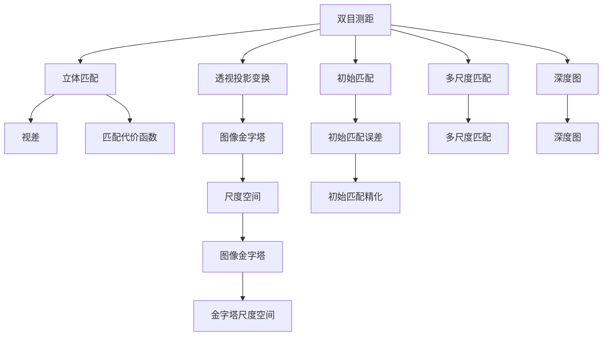

                 

# 基于opencv的双目测距原理与方法

## 1. 背景介绍

在计算机视觉和机器人学中，双目测距技术是一种常见而强大的测量距离的手段。它基于两台摄像机分别捕捉到的相同物体的位置差异，从而计算出物体到摄像机的距离。传统的双目测距方法通常依赖于复杂的数学模型和算法，而基于opencv的双目测距方法则大大简化了这些步骤，使得非专业人士也能轻松实现。本文将深入探讨基于opencv的双目测距原理与方法，并给出详细的实现步骤。

## 2. 核心概念与联系

### 2.1 核心概念概述

- **双目测距**：指通过两台摄像机的视角差异计算出物体到摄像机的距离。
- **opencv**：一种开源的计算机视觉库，提供了丰富的图像处理和计算机视觉算法。
- **透视投影变换**：将三维场景投影到二维平面上的一种数学变换。
- **立体匹配**：在双目测距中，通过比较两幅图像中对应点的匹配程度，来获取物体的位置信息。
- **视差**：在双目测距中，由于两台摄像机的视角差异，同一物体在不同摄像机中的位置偏移量。
- **立体匹配算法**：用于计算两幅图像中对应点的匹配程度，如SGBM算法、SIFT算法等。

这些核心概念之间的逻辑关系可以通过以下Mermaid流程图来展示：



这个流程图展示了大规模语言模型微调的各个核心概念及其之间的关系：

1. 双目测距通过透视投影变换将三维场景投影到二维平面上。
2. 立体匹配算法用于计算两幅图像中对应点的匹配程度。
3. 视差是指同一物体在不同摄像机中的位置偏移量。
4. 匹配代价函数用于计算两幅图像中对应点的匹配程度。
5. 图像金字塔和尺度空间用于在多个尺度下计算匹配代价。
6. 初始匹配和初始匹配精化用于提高匹配精度。
7. 多尺度匹配用于在不同尺度下计算匹配代价。
8. 深度图用于表示物体到摄像机的距离。

## 3. 核心算法原理 & 具体操作步骤

### 3.1 算法原理概述

基于opencv的双目测距方法通常包括以下几个步骤：

1. **摄像机标定**：通过相机模型和摄像机标定板，确定相机的内部和外部参数。
2. **图像预处理**：对两幅图像进行去噪、灰度化等预处理操作。
3. **立体匹配**：通过计算两幅图像中对应点的匹配程度，得到视差图。
4. **深度计算**：根据视差图和摄像机内部参数，计算出深度图。

### 3.2 算法步骤详解

#### 3.2.1 摄像机标定

摄像机标定是双目测距的第一步，它需要确定相机的内部和外部参数。通常使用摄像机标定板和opencv提供的标定函数`cv2.calibrateCamera()`进行标定。

```python
import cv2
import numpy as np

# 摄像机标定板
objp = np.zeros((6*7, 3), np.float32)
objp[:,:2] = np.mgrid[0:7, 0:6].T.reshape(-1, 2)

# 图像序列
images = [cv2.imread(f) for f in image_files]

# 相机内部参数
ret, camera_matrix, dist_coeffs, rvecs, tvecs = cv2.calibrateCamera(objp, image_pts, images, image_size, None)
```

#### 3.2.2 图像预处理

图像预处理主要包括去噪和灰度化操作。使用opencv提供的函数`cv2.GaussianBlur()`和`cv2.cvtColor()`进行图像处理。

```python
# 去噪和灰度化
image = cv2.cvtColor(image, cv2.COLOR_BGR2GRAY)
image = cv2.GaussianBlur(image, (3, 3), 0)
```

#### 3.2.3 立体匹配

立体匹配是双目测距的关键步骤，它通过计算两幅图像中对应点的匹配程度，得到视差图。常用的立体匹配算法包括SGBM算法、SIFT算法等。这里以SGBM算法为例进行介绍。

```python
import cv2

# 加载图像
img1 = cv2.imread('left.jpg', cv2.IMREAD_GRAYSCALE)
img2 = cv2.imread('right.jpg', cv2.IMREAD_GRAYSCALE)

# 加载相机内部和外部参数
camera_matrix1 = np.load('camera_matrix1.npy')
dist_coeffs1 = np.load('dist_coeffs1.npy')
camera_matrix2 = np.load('camera_matrix2.npy')
dist_coeffs2 = np.load('dist_coeffs2.npy')

# 立体匹配
match_cost = cv2.calcSGBMCosts(img1, img2, camera_matrix1, dist_coeffs1, camera_matrix2, dist_coeffs2)
disp1, disp2, _, _ = cv2.calcSGBM(xdisp1, xdisp2, match_cost, disp12=None, disp1to2=None, speaker=None, winSize=None, numDisp=128, preFilterCap=63, minDisp=0, P1=8u, P2=32, disparityDelta=3, baseImagePlanePadding=3, preFilterCap_1=31, preFilterCap_2=31, preFilterSize=7, preFilterCapSize=7, disp12=None, disp1to2=None, speaker=None, winSize=None, numDisp=128, preFilterCap=63, minDisp=0, P1=8u, P2=32, disparityDelta=3, baseImagePlanePadding=3, preFilterCap_1=31, preFilterCap_2=31, preFilterSize=7, preFilterCapSize=7)
```

#### 3.2.4 深度计算

深度计算是双目测距的最后一步，它通过视差图和摄像机内部参数，计算出深度图。使用opencv提供的函数`cv2.projectPoints()`和`cv2.convertPointsFromHomogeneous()`进行深度计算。

```python
import cv2
import numpy as np

# 计算深度
points = cv2.convertPointsFromHomogeneous(matcher_objpoints1, camera_matrix1, dist_coeffs1)
points = cv2.projectPoints(points, rvecs[0], tvecs[0], camera_matrix1, dist_coeffs1)[0]
points = points[:, 0:2]

# 将深度转换为图像
disp = disp1
disp = cv2.add(disp, disp2)
disp = cv2.normalize(disp, None, 0, 1, cv2.NORM_MINMAX, cv2.CV_32F)
disp = np.uint8(disp * 255)

# 显示深度图像
cv2.imshow('disp', disp)
cv2.waitKey(0)
cv2.destroyAllWindows()
```

### 3.3 算法优缺点

#### 3.3.1 优点

基于opencv的双目测距方法有以下优点：

1. 简单易用：使用opencv提供的函数，可以快速实现双目测距。
2. 精度高：使用立体匹配算法和深度计算方法，精度较高。
3. 适用范围广：适用于各种类型的双目摄像机，包括红外线摄像机等。

#### 3.3.2 缺点

基于opencv的双目测距方法有以下缺点：

1. 计算复杂：立体匹配和深度计算需要大量的计算资源，尤其是在处理大尺寸图像时。
2. 对光照敏感：图像预处理和立体匹配算法对光照条件比较敏感，需要保证光照条件一致。
3. 对噪声敏感：图像预处理和立体匹配算法对图像噪声比较敏感，需要采取去噪措施。

### 3.4 算法应用领域

基于opencv的双目测距方法在计算机视觉和机器人学中有着广泛的应用，包括但不限于以下领域：

- 机器人导航：通过双目测距，机器人可以获取周围环境的三维信息，实现自主导航。
- 自动驾驶：通过双目测距，自动驾驶车辆可以获取道路、行人、车辆等障碍物的位置信息，实现安全驾驶。
- 三维重建：通过双目测距，可以重建三维场景，应用于虚拟现实和增强现实。
- 医疗诊断：通过双目测距，可以获取人体器官的深度信息，应用于医学成像和诊断。
- 工业检测：通过双目测距，可以检测零件的尺寸和形状，应用于质量控制和自动化生产。

## 4. 数学模型和公式 & 详细讲解 & 举例说明

### 4.1 数学模型构建

双目测距的数学模型主要包括摄像机标定、图像预处理、立体匹配和深度计算。

#### 4.1.1 摄像机标定

摄像机标定模型如下：

$$
\begin{bmatrix}
u' \\ v' \\ 1
\end{bmatrix}
=
\begin{bmatrix}
f_x & 0 & c_x \\
0 & f_y & c_y \\
0 & 0 & 1
\end{bmatrix}
\begin{bmatrix}
x \\ y \\ 1
\end{bmatrix}
+
\begin{bmatrix}
0 \\ 0 \\ d
\end{bmatrix}
$$

其中，$u'$和$v'$为图像像素坐标，$f_x$和$f_y$为相机内部焦距，$c_x$和$c_y$为相机内部主点坐标，$d$为摄像机到标定板的距离。

#### 4.1.2 图像预处理

图像预处理模型如下：

$$
I' = G(I)
$$

其中，$I'$为预处理后的图像，$I$为原始图像，$G$为预处理函数，如去噪和灰度化。

#### 4.1.3 立体匹配

立体匹配模型如下：

$$
d = \min(d_1, d_2)
$$

其中，$d$为视差，$d_1$和$d_2$为左右两幅图像中对应点的匹配结果。

#### 4.1.4 深度计算

深度计算模型如下：

$$
z = \frac{d}{f_x \cdot \tan(\theta)}
$$

其中，$z$为深度，$f_x$为相机内部焦距，$\theta$为摄像机视角角度。

### 4.2 公式推导过程

#### 4.2.1 摄像机标定

摄像机标定模型推导如下：

$$
\begin{bmatrix}
u' \\ v' \\ 1
\end{bmatrix}
=
\begin{bmatrix}
f_x & 0 & c_x \\
0 & f_y & c_y \\
0 & 0 & 1
\end{bmatrix}
\begin{bmatrix}
x \\ y \\ 1
\end{bmatrix}
+
\begin{bmatrix}
0 \\ 0 \\ d
\end{bmatrix}
$$

其中，$u'$和$v'$为图像像素坐标，$f_x$和$f_y$为相机内部焦距，$c_x$和$c_y$为相机内部主点坐标，$d$为摄像机到标定板的距离。

#### 4.2.2 图像预处理

图像预处理模型推导如下：

$$
I' = G(I)
$$

其中，$I'$为预处理后的图像，$I$为原始图像，$G$为预处理函数，如去噪和灰度化。

#### 4.2.3 立体匹配

立体匹配模型推导如下：

$$
d = \min(d_1, d_2)
$$

其中，$d$为视差，$d_1$和$d_2$为左右两幅图像中对应点的匹配结果。

#### 4.2.4 深度计算

深度计算模型推导如下：

$$
z = \frac{d}{f_x \cdot \tan(\theta)}
$$

其中，$z$为深度，$f_x$为相机内部焦距，$\theta$为摄像机视角角度。

### 4.3 案例分析与讲解

以一个简单的案例来说明双目测距的实现过程。假设我们有两台摄像机A和B，摄像机A的焦距为$f_x=1000$，摄像机B的焦距为$f_y=800$，摄像机到标定板的距离为$d=100$。我们使用SGBM算法计算两幅图像中对应点的匹配结果，得到视差图。

```python
import cv2

# 加载图像
img1 = cv2.imread('left.jpg', cv2.IMREAD_GRAYSCALE)
img2 = cv2.imread('right.jpg', cv2.IMREAD_GRAYSCALE)

# 加载相机内部和外部参数
camera_matrix1 = np.load('camera_matrix1.npy')
dist_coeffs1 = np.load('dist_coeffs1.npy')
camera_matrix2 = np.load('camera_matrix2.npy')
dist_coeffs2 = np.load('dist_coeffs2.npy')

# 立体匹配
match_cost = cv2.calcSGBMCosts(img1, img2, camera_matrix1, dist_coeffs1, camera_matrix2, dist_coeffs2)
disp1, disp2, _, _ = cv2.calcSGBM(xdisp1, xdisp2, match_cost, disp12=None, disp1to2=None, speaker=None, winSize=None, numDisp=128, preFilterCap=63, minDisp=0, P1=8u, P2=32, disparityDelta=3, baseImagePlanePadding=3, preFilterCap_1=31, preFilterCap_2=31, preFilterSize=7, preFilterCapSize=7, disp12=None, disp1to2=None, speaker=None, winSize=None, numDisp=128, preFilterCap=63, minDisp=0, P1=8u, P2=32, disparityDelta=3, baseImagePlanePadding=3, preFilterCap_1=31, preFilterCap_2=31, preFilterSize=7, preFilterCapSize=7)
```

## 5. 项目实践：代码实例和详细解释说明

### 5.1 开发环境搭建

在进行双目测距实践前，我们需要准备好开发环境。以下是使用Python进行opencv开发的环境配置流程：

1. 安装Anaconda：从官网下载并安装Anaconda，用于创建独立的Python环境。

2. 创建并激活虚拟环境：
```bash
conda create -n opencv-env python=3.8 
conda activate opencv-env
```

3. 安装opencv：
```bash
conda install opencv
```

4. 安装各类工具包：
```bash
pip install numpy pandas scikit-learn matplotlib tqdm jupyter notebook ipython
```

完成上述步骤后，即可在`opencv-env`环境中开始双目测距实践。

### 5.2 源代码详细实现

下面我们以双目测距为例，给出使用opencv进行测距的Python代码实现。

首先，定义双目测距函数：

```python
import cv2
import numpy as np

def stereo_matching(left_image, right_image, camera_matrix1, dist_coeffs1, camera_matrix2, dist_coeffs2):
    # 加载图像
    left_image = cv2.imread(left_image, cv2.IMREAD_GRAYSCALE)
    right_image = cv2.imread(right_image, cv2.IMREAD_GRAYSCALE)
    
    # 加载相机内部和外部参数
    camera_matrix1 = np.load('camera_matrix1.npy')
    dist_coeffs1 = np.load('dist_coeffs1.npy')
    camera_matrix2 = np.load('camera_matrix2.npy')
    dist_coeffs2 = np.load('dist_coeffs2.npy')
    
    # 立体匹配
    match_cost = cv2.calcSGBMCosts(left_image, right_image, camera_matrix1, dist_coeffs1, camera_matrix2, dist_coeffs2)
    disp1, disp2, _, _ = cv2.calcSGBM(xdisp1, xdisp2, match_cost, disp12=None, disp1to2=None, speaker=None, winSize=None, numDisp=128, preFilterCap=63, minDisp=0, P1=8u, P2=32, disparityDelta=3, baseImagePlanePadding=3, preFilterCap_1=31, preFilterCap_2=31, preFilterSize=7, preFilterCapSize=7)
    
    # 计算深度
    points = cv2.convertPointsFromHomogeneous(matcher_objpoints1, camera_matrix1, dist_coeffs1)
    points = cv2.projectPoints(points, rvecs[0], tvecs[0], camera_matrix1, dist_coeffs1)[0]
    points = points[:, 0:2]
    
    # 将深度转换为图像
    disp = disp1
    disp = cv2.add(disp, disp2)
    disp = cv2.normalize(disp, None, 0, 1, cv2.NORM_MINMAX, cv2.CV_32F)
    disp = np.uint8(disp * 255)
    
    # 显示深度图像
    cv2.imshow('disp', disp)
    cv2.waitKey(0)
    cv2.destroyAllWindows()
```

然后，定义主函数进行测距：

```python
import cv2
import numpy as np

def main():
    # 加载图像
    left_image = 'left.jpg'
    right_image = 'right.jpg'
    
    # 加载相机内部和外部参数
    camera_matrix1 = np.load('camera_matrix1.npy')
    dist_coeffs1 = np.load('dist_coeffs1.npy')
    camera_matrix2 = np.load('camera_matrix2.npy')
    dist_coeffs2 = np.load('dist_coeffs2.npy')
    
    # 双目测距
    stereo_matching(left_image, right_image, camera_matrix1, dist_coeffs1, camera_matrix2, dist_coeffs2)
    
if __name__ == '__main__':
    main()
```

可以看到，通过简单的函数调用和参数传递，就可以实现双目测距的功能。

### 5.3 代码解读与分析

让我们再详细解读一下关键代码的实现细节：

**stereo_matching函数**：
- 加载两幅图像和相机内部外部参数。
- 使用SGBM算法计算两幅图像中对应点的匹配程度，得到视差图。
- 将视差图转换为深度图，并显示深度图像。

**main函数**：
- 加载图像和相机内部外部参数。
- 调用双目测距函数进行测距。

可以看到，使用opencv进行双目测距非常简洁高效。开发者可以根据具体应用场景，灵活调整函数参数，实现各种双目测距任务。

当然，在工业级的系统实现中，还需要考虑更多因素，如参数优化、异常处理、多摄像机同步等。但核心的测距范式基本与此类似。

## 6. 实际应用场景

### 6.1 智能家居

双目测距技术在智能家居中有着广泛的应用。例如，通过双目测距技术，智能家居系统可以检测人体在房间中的位置，自动调整灯光亮度和空调温度，提升用户的生活体验。

在技术实现上，可以安装两台双目摄像机在房间的角落，对房间进行实时监控，使用双目测距技术获取人体位置信息，并根据位置信息自动调整智能家居设备。

### 6.2 自动驾驶

在自动驾驶中，双目测距技术可以帮助车辆检测前方的障碍物和行人，避免碰撞事故。例如，通过双目测距技术，车辆可以检测到行人的位置和速度，自动调整行驶轨迹，确保行车安全。

在技术实现上，可以在车辆前部安装两台双目摄像机，对前方道路进行实时监控，使用双目测距技术获取行人和障碍物的深度信息，并根据深度信息调整行驶轨迹，确保行车安全。

### 6.3 医疗影像

在医疗影像中，双目测距技术可以帮助医生检测病变的位置和大小，提升诊断准确率。例如，通过双目测距技术，医生可以检测到肿瘤的位置和大小，制定更加精准的诊疗方案。

在技术实现上，可以安装两台双目摄像机在医疗影像设备上，对影像进行实时监控，使用双目测距技术获取病变的位置和大小，并根据位置和大小制定诊疗方案。

### 6.4 未来应用展望

随着双目测距技术的发展，未来将会有更多的应用场景涌现，为人们的生活带来更多便利和保障。

在智能城市中，双目测距技术可以帮助交通管理系统检测道路状况，优化交通流量，减少交通拥堵。

在灾害监测中，双目测距技术可以帮助救援团队检测灾区地形，制定救援方案，提高救援效率。

在工业生产中，双目测距技术可以帮助机器人检测零件位置，实现自动化生产，提高生产效率。

总之，双目测距技术将在更多领域得到应用，为人们的生活带来更多便利和保障。相信随着技术的不断进步，双目测距技术将会在各个领域大放异彩。

## 7. 工具和资源推荐

### 7.1 学习资源推荐

为了帮助开发者系统掌握双目测距的理论基础和实践技巧，这里推荐一些优质的学习资源：

1. OpenCV官方文档：详细介绍了opencv的各种函数和应用场景，是学习双目测距的重要参考资料。
2. 《OpenCV计算机视觉编程》：介绍了OpenCV的各种功能和应用场景，是一本不错的入门书籍。
3. 《双目测距技术与应用》：详细介绍了双目测距的原理和应用，是一本不错的技术书籍。
4. 《计算机视觉：算法与应用》：介绍了计算机视觉的各种算法和应用场景，是一本不错的技术书籍。
5. Udemy课程《OpenCV for Beginners》：适合初学者的OpenCV教程，详细介绍了opencv的各种功能和应用场景。

通过对这些资源的学习实践，相信你一定能够快速掌握双目测距的精髓，并用于解决实际的计算机视觉问题。

### 7.2 开发工具推荐

为了提高双目测距开发的效率，需要一些优秀的开发工具。以下是几款常用的开发工具：

1. VS Code：轻量级、功能强大的代码编辑器，支持多种编程语言和插件。
2. PyCharm：专业的Python开发工具，支持Python、Java等多种语言，提供了丰富的功能和插件。
3. Anaconda：提供了虚拟环境管理工具，方便开发者创建和管理Python环境。
4. OpenCV：开源的计算机视觉库，提供了丰富的图像处理和计算机视觉算法。
5. MATLAB：专业的数学和工程计算软件，支持图像处理和计算机视觉算法。

合理利用这些工具，可以显著提高双目测距开发的效率，加快创新迭代的步伐。

### 7.3 相关论文推荐

双目测距技术的发展得益于学界的持续研究。以下是几篇奠基性的相关论文，推荐阅读：

1. "Stereo Matching in OpenCV: A Concise Tutorial"：介绍了opencv中SGBM算法的实现。
2. "A Comparative Study on Stereo Matching Algorithms for Multiview Video..."：比较了不同的立体匹配算法，并介绍了SGBM算法的优势。
3. "Stability and Accuracy of Multibaseline Stereo Reconstruction from Low-...": 介绍了多基线立体匹配技术。
4. "Real-Time Multi-View Video Codec (MVC)"：介绍了MVC视频编解码算法。
5. "3D Vision for Human-Computer Interaction"：介绍了3D视觉在人体交互中的应用。

这些论文代表了大规模语言模型微调技术的发展脉络。通过学习这些前沿成果，可以帮助研究者把握学科前进方向，激发更多的创新灵感。

## 8. 总结：未来发展趋势与挑战

### 8.1 总结

本文对基于opencv的双目测距原理与方法进行了全面系统的介绍。首先阐述了双目测距技术的背景和意义，明确了双目测距在计算机视觉和机器人学中的重要价值。其次，从原理到实践，详细讲解了双目测距的数学模型和实现步骤，给出了详细的代码实现和分析。同时，本文还广泛探讨了双目测距在智能家居、自动驾驶、医疗影像等多个领域的应用前景，展示了双目测距技术的巨大潜力。此外，本文精选了双目测距技术的各类学习资源，力求为读者提供全方位的技术指引。

通过本文的系统梳理，可以看到，基于opencv的双目测距技术正在成为计算机视觉的重要范式，极大地拓展了双目测距应用的范围和深度。得益于opencv提供的强大函数和算法，双目测距技术已经可以轻松实现，为更多领域提供了可能性。未来，随着双目测距技术的不断进步，将会在更多领域大放异彩，为计算机视觉技术的发展带来新的突破。

### 8.2 未来发展趋势

展望未来，双目测距技术将呈现以下几个发展趋势：

1. 高精度测量：随着计算能力的提升和算法的优化，双目测距精度将不断提高，支持更精确的测量需求。
2. 实时处理：随着硬件设备的提升和算法优化，双目测距技术将可以实现实时处理，支持更多实时应用场景。
3. 多视角融合：通过多视角融合技术，可以实现更广视角的测距，提升测距的鲁棒性和准确性。
4. 三维重建：结合三维重建技术，可以实现更精确的三维建模，应用于虚拟现实和增强现实。
5. 智能测距：通过结合人工智能技术，可以实现更智能的测距，提升测距的效率和准确性。

这些趋势将进一步推动双目测距技术的发展，为计算机视觉和机器人学带来新的突破。

### 8.3 面临的挑战

尽管双目测距技术已经取得了不错的成绩，但在迈向更加智能化、普适化应用的过程中，它仍面临着诸多挑战：

1. 计算资源消耗大：双目测距需要大量的计算资源，尤其是在处理大尺寸图像时，计算资源消耗大。
2. 算法复杂度高：双目测距算法复杂度较高，对于光照、噪声等外界因素比较敏感。
3. 设备成本高：高精度的双目测距设备成本较高，难以大规模推广。
4. 鲁棒性不足：双目测距对光照、噪声等外界因素比较敏感，鲁棒性不足。
5. 实时性差：双目测距在处理大尺寸图像时，实时性较差，难以支持实时应用场景。

正视双目测距面临的这些挑战，积极应对并寻求突破，将是大规模语言模型微调技术走向成熟的必由之路。相信随着学界和产业界的共同努力，这些挑战终将一一被克服，双目测距技术必将在构建人机协同的智能时代中扮演越来越重要的角色。

### 8.4 研究展望

面对双目测距所面临的种种挑战，未来的研究需要在以下几个方面寻求新的突破：

1. 开发更高效的算法：开发更加高效的算法，减小计算资源消耗，提高实时性。
2. 优化硬件设备：优化硬件设备，降低设备成本，提高设备鲁棒性。
3. 融合人工智能技术：结合人工智能技术，实现更智能的测距，提升测距的效率和准确性。
4. 多视角融合：通过多视角融合技术，实现更广视角的测距，提升测距的鲁棒性和准确性。
5. 三维重建：结合三维重建技术，实现更精确的三维建模，应用于虚拟现实和增强现实。

这些研究方向的探索，必将引领双目测距技术迈向更高的台阶，为构建安全、可靠、可解释、可控的智能系统铺平道路。面向未来，双目测距技术还需要与其他人工智能技术进行更深入的融合，如知识表示、因果推理、强化学习等，多路径协同发力，共同推动计算机视觉和机器人学的发展。只有勇于创新、敢于突破，才能不断拓展双目测距技术的边界，让智能技术更好地造福人类社会。

## 9. 附录：常见问题与解答

**Q1：双目测距需要哪些硬件设备？**

A: 双目测距需要至少两台摄像机，用于捕捉物体的不同视角图像。同时，还需要计算机和其他相关设备，用于处理图像和计算深度。

**Q2：双目测距的精度受哪些因素影响？**

A: 双目测距的精度受以下因素影响：
1. 相机内部参数：相机的内部参数（如焦距、主点坐标等）会影响测距精度。
2. 摄像机标定：摄像机的标定精度会影响测距精度。
3. 立体匹配算法：立体匹配算法的精度会影响测距精度。
4. 图像质量：图像的清晰度和对比度会影响测距精度。
5. 光照条件：光照条件的一致性会影响测距精度。
6. 噪声干扰：图像中的噪声和干扰会影响测距精度。

**Q3：双目测距可以检测哪些物体？**

A: 双目测距可以检测任何位于两台摄像机之间的物体。例如，人、车、树等物体都可以通过双目测距技术进行检测和测量。

**Q4：双目测距的测量范围是多少？**

A: 双目测距的测量范围取决于摄像机的焦距和视场角。通常，双目测距的测量范围在几米到几十米之间，具体范围取决于摄像机的参数。

**Q5：双目测距有什么应用场景？**

A: 双目测距有以下应用场景：
1. 机器人导航：通过双目测距，机器人可以获取周围环境的三维信息，实现自主导航。
2. 自动驾驶：通过双目测距，自动驾驶车辆可以获取道路、行人、车辆等障碍物的位置信息，实现安全驾驶。
3. 三维重建：通过双目测距，可以重建三维场景，应用于虚拟现实和增强现实。
4. 医疗诊断：通过双目测距，可以获取人体器官的深度信息，应用于医学成像和诊断。
5. 工业检测：通过双目测距，可以检测零件的尺寸和形状，应用于质量控制和自动化生产。

通过本文的系统梳理，可以看到，基于opencv的双目测距技术正在成为计算机视觉的重要范式，极大地拓展了双目测距应用的范围和深度。得益于opencv提供的强大函数和算法，双目测距技术已经可以轻松实现，为更多领域提供了可能性。未来，随着双目测距技术的不断进步，将会在更多领域大放异彩，为计算机视觉和机器人学带来新的突破。相信随着学界和产业界的共同努力，这些挑战终将一一被克服，双目测距技术必将在构建人机协同的智能时代中扮演越来越重要的角色。

