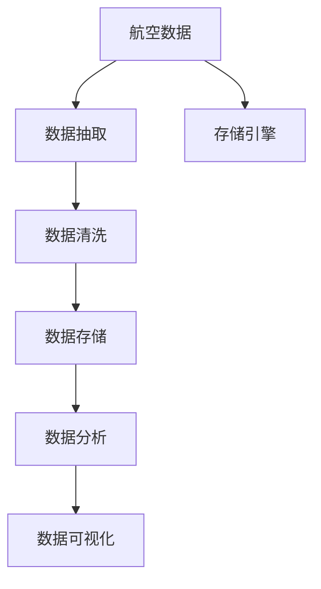

                 

# 基于spark的航空数据分析系统的设计与实现

> 关键词：航空数据, 数据分析, Spark, ETL, 数据仓库, 可视化

## 1. 背景介绍

### 1.1 问题由来
随着民航行业的快速发展，航空数据日益增长，对数据的实时性和准确性要求也越来越高。为了提高运营效率，航空公司需要从海量数据中快速、准确地获取关键信息，用于飞行调度、故障分析、客户服务等多个方面。传统的SQL或Excel工具已经无法满足实时性、扩展性和交互性等多重需求。

为了解决这个问题，亟需一种高效、灵活的数据处理平台，能够实时处理、存储和分析大规模航空数据。而Apache Spark作为一款高性能分布式计算框架，恰好满足了这些需求。Spark的强大并行处理能力和弹性扩展性，使得其成为航空数据分析的天然选择。

### 1.2 问题核心关键点
本文聚焦于基于Apache Spark的航空数据分析系统设计与实现。核心问题在于如何设计系统架构，采用何种技术手段，实现数据的实时收集、清洗、存储、分析和可视化，最终形成一套稳定、高效、可扩展的航空数据管理系统。

## 2. 核心概念与联系

### 2.1 核心概念概述

为了更好地理解基于Spark的航空数据分析系统，本节将介绍几个关键概念：

- Apache Spark：由Apache基金会支持的分布式计算框架，具有高效内存计算、灵活的编程接口、强大的并行处理能力等特点。
- ETL：数据抽取(Extract)、转换(Transform)和加载(Load)的简称，是数据仓库建立和数据集成的主要环节。
- 数据仓库：用于集中存储和管理数据的数据库系统，能够支持大规模数据分析和数据查询。
- 可视化：数据展示和呈现的工具，通过图表、地图等方式直观展示数据结果，方便用户理解。
- 航空数据：包括航班信息、乘客信息、机务维护、机场运行等多方面数据，是民航运营的基础。

这些概念之间的逻辑关系可以通过以下Mermaid流程图来展示：



这个流程图展示了数据从采集到可视化的全流程：

1. 数据采集：从航空公司内部系统、机场信息系统、第三方数据接口等渠道抽取航空数据。
2. 数据清洗：对原始数据进行去重、补全、转换等操作，确保数据质量。
3. 数据存储：将清洗后的数据存储到分布式数据仓库中，支持大规模数据的存储和检索。
4. 数据分析：利用Spark等工具对存储在数据仓库中的数据进行分布式计算，形成分析结果。
5. 数据可视化：将分析结果通过可视化工具呈现，方便用户进行快速决策。

## 3. 核心算法原理 & 具体操作步骤

### 3.1 算法原理概述

基于Spark的航空数据分析系统，本质上是一种基于ETL的数据处理流程，利用Spark的分布式计算能力和弹性扩展性，实现对航空数据的实时采集、清洗、存储、分析和可视化。

形式化地，假设航空数据集为 $D=\{d_i\}_{i=1}^N$，其中 $d_i=(x_i, y_i)$ 表示数据记录，$x_i$ 为原始数据，$y_i$ 为标签信息。系统目标是通过一系列数据处理操作，将原始数据 $x_i$ 转化为分析结果 $A=\{a_j\}_{j=1}^M$，其中 $a_j$ 为分析指标或报表，方便用户使用。

具体步骤包括：
1. 数据抽取：从航空公司的各类系统、数据库和第三方数据接口中，抽取航空数据。
2. 数据清洗：去除重复、缺失或异常数据，进行必要的格式转换和数据补全。
3. 数据存储：将清洗后的数据存储到数据仓库中，支持高效的数据存储和查询。
4. 数据分析：利用Spark等工具对数据仓库中的数据进行分布式计算，生成分析指标。
5. 数据可视化：使用可视化工具，将分析结果以图表、报表等形式展示给用户。

### 3.2 算法步骤详解

基于Spark的航空数据分析系统设计包括以下关键步骤：

**Step 1: 数据抽取**

Spark的数据抽取模块从航空公司内部系统、机场信息系统、第三方数据接口等渠道，抽取航空数据。数据抽取模块需要实现以下几个功能：

- 数据源连接：支持连接不同的数据源，如SQL数据库、NoSQL数据库、文本文件、API接口等。
- 数据文件系统：支持不同类型的数据文件系统，如Hadoop、S3、GCS等。
- 数据增量同步：支持对新数据进行增量同步，减少数据重复采集。
- 数据类型转换：支持对数据类型进行转换，如日期格式化、字符串编码等。

数据抽取模块的架构如下：


**Step 2: 数据清洗**

Spark的数据清洗模块对原始数据进行去重、补全、转换等操作，确保数据质量。数据清洗模块需要实现以下几个功能：

- 数据去重：去除重复记录，保证数据唯一性。
- 数据补全：对缺失数据进行补全，保证数据完整性。
- 数据转换：对数据进行格式转换，如日期格式、字符串编码等。
- 数据校验：对数据进行校验，如日期合法性、数据格式一致性等。

数据清洗模块的架构如下：


**Step 3: 数据存储**

Spark的数据存储模块将清洗后的数据存储到分布式数据仓库中，支持高效的数据存储和查询。数据存储模块需要实现以下几个功能：

- 数据分区：支持根据不同的数据特征进行分区，提高数据查询效率。
- 数据压缩：支持对数据进行压缩，减少存储空间。
- 数据备份：支持对数据进行备份，确保数据安全。
- 数据查询：支持高效的SQL查询和API接口查询。

数据存储模块的架构如下：


**Step 4: 数据分析**

Spark的数据分析模块利用Spark等工具对数据仓库中的数据进行分布式计算，生成分析指标。数据分析模块需要实现以下几个功能：

- 分布式计算：支持分布式计算任务，利用Spark的并行计算能力。
- 数据聚合：支持对数据进行聚合计算，如求和、平均值、计数等。
- 数据统计：支持对数据进行统计计算，如方差、标准差、百分位数等。
- 数据预测：支持对数据进行预测计算，如时间序列预测、回归预测等。

数据分析模块的架构如下：


**Step 5: 数据可视化**

Spark的数据可视化模块使用可视化工具，将分析结果以图表、报表等形式展示给用户。数据可视化模块需要实现以下几个功能：

- 数据展示：支持图表、地图、仪表盘等多种展示方式。
- 数据钻取：支持多维度数据钻取，方便用户深入分析。
- 数据交互：支持用户交互，如拖拽、筛选、放大缩小等。
- 数据更新：支持数据实时更新，保证分析结果的时效性。

数据可视化模块的架构如下：


### 3.3 算法优缺点

基于Spark的航空数据分析系统具有以下优点：

- 高效并行处理：Spark的分布式计算能力，能够高效处理大规模数据。
- 弹性扩展性：Spark支持动态资源扩展，能够根据数据量自动调整计算资源。
- 灵活性：Spark支持多种编程语言和生态系统，方便用户进行定制开发。
- 数据一致性：Spark提供了容错机制，能够保证数据的准确性和一致性。
- 可视化支持：Spark生态系统中的可视化工具，能够方便用户进行数据分析和决策。

然而，该系统也存在一些局限性：

- 资源消耗高：Spark的内存计算特性，在处理大规模数据时资源消耗较高。
- 复杂度高：系统架构复杂，需要设计多个模块和组件，开发和维护难度较大。
- 学习成本高：Spark生态系统庞大，用户需要投入大量时间进行学习和掌握。
- 性能优化难：Spark性能优化需要深入了解系统架构和优化方法，对技术要求较高。

尽管如此，Spark的强大计算能力和灵活性，使其成为航空数据分析的理想选择，能够支持大规模数据处理和实时数据分析。

### 3.4 算法应用领域

基于Spark的航空数据分析系统，已经在航班调度、故障分析、客户服务等多个领域得到了广泛应用：

- 航班调度：通过实时处理航班数据，快速生成航班调度计划，优化资源配置。
- 故障分析：通过分析历史和实时故障数据，预测和诊断设备故障，提高维护效率。
- 客户服务：通过实时处理客户数据，提供个性化的客户服务，提升客户满意度。
- 安全管理：通过分析安全数据，发现潜在安全风险，加强安全管理。
- 数据分析：通过统计和分析数据，发现业务瓶颈，制定优化策略。

除了上述这些经典应用外，基于Spark的航空数据分析系统还被创新性地应用于更多场景中，如机场流量预测、航空货物管理、环境监测等，为民航运营带来了新的突破。

## 4. 数学模型和公式 & 详细讲解 & 举例说明

### 4.1 数学模型构建

本节将使用数学语言对基于Spark的航空数据分析系统进行更加严格的刻画。

假设原始航空数据集为 $D=\{d_i\}_{i=1}^N$，其中 $d_i=(x_i, y_i)$ 表示数据记录，$x_i$ 为原始数据，$y_i$ 为标签信息。系统目标是通过一系列数据处理操作，将原始数据 $x_i$ 转化为分析结果 $A=\{a_j\}_{j=1}^M$，其中 $a_j$ 为分析指标或报表。

具体步骤如下：

1. 数据抽取：从航空公司内部系统、机场信息系统、第三方数据接口等渠道，抽取航空数据，得到数据集 $S=\{s_i\}_{i=1}^N$，其中 $s_i=(x_i, y_i)$。
2. 数据清洗：对原始数据进行去重、补全、转换等操作，得到数据集 $C=\{c_j\}_{j=1}^M$，其中 $c_j$ 为清洗后的数据。
3. 数据存储：将清洗后的数据存储到分布式数据仓库中，得到数据集 $W=\{w_k\}_{k=1}^K$，其中 $w_k$ 为存储后的数据。
4. 数据分析：利用Spark等工具对数据仓库中的数据进行分布式计算，得到分析指标 $A=\{a_j\}_{j=1}^M$，其中 $a_j$ 为分析指标或报表。
5. 数据可视化：使用可视化工具，将分析结果以图表、报表等形式展示给用户，得到展示结果 $V=\{v_l\}_{l=1}^L$，其中 $v_l$ 为展示结果。

### 4.2 公式推导过程

以下我们以航班调度任务为例，推导航班调度的数学模型及其公式。

假设原始航班数据为 $D=\{d_i\}_{i=1}^N$，其中 $d_i=(x_i, y_i)$，$x_i$ 为航班信息，$y_i$ 为航班状态。航班调度的目标是根据历史航班数据，预测未来航班状态，优化航班调度方案。

航班调度模型的数学表达式为：

$$
f(x) = \mathop{\arg\min}_{x} \sum_{i=1}^N (w_i \times loss(d_i, x))
$$

其中 $w_i$ 为航班状态的权重，$loss(d_i, x)$ 为损失函数，用于衡量航班状态预测与实际状态之间的差异。

假设 $loss(d_i, x)$ 为均方误差损失函数，航班状态的预测模型为 $y_i = f(x_i)$，其中 $f$ 为航班状态预测函数，$x_i$ 为航班信息。则均方误差损失函数为：

$$
loss(d_i, x) = \frac{1}{2} \times ((y_i - f(x_i))^2)
$$

航班调度的目标函数为：

$$
f(x) = \mathop{\arg\min}_{x} \sum_{i=1}^N (w_i \times \frac{1}{2} \times ((y_i - f(x_i))^2))
$$

通过优化目标函数，航班调度模型能够根据历史航班数据，预测未来航班状态，生成最优的航班调度方案。

### 4.3 案例分析与讲解

假设某航空公司有两条航线，航班信息如下：

| 航班号 | 出发机场 | 到达机场 | 起飞时间 | 到达时间 | 状态 |
|-------|----------|----------|----------|----------|------|
| 1     | A        | B        | 08:00    | 10:00    | 1    |
| 2     | B        | C        | 12:00    | 14:00    | 2    |
| 3     | C        | D        | 16:00    | 18:00    | 2    |
| 4     | A        | B        | 10:30    | 12:30    | 1    |

假设状态 1 表示正常，状态 2 表示延误。

根据历史航班数据，预测未来航班状态，生成最优的航班调度方案。具体步骤如下：

1. 数据抽取：将航班信息存储到分布式数据仓库中，得到数据集 $W=\{w_k\}_{k=1}^K$，其中 $w_k$ 为航班信息。
2. 数据清洗：去除重复航班信息，得到数据集 $C=\{c_j\}_{j=1}^M$，其中 $c_j$ 为航班信息。
3. 数据分析：利用Spark等工具对数据仓库中的数据进行分布式计算，得到航班状态预测模型 $f(x)$，其中 $x$ 为航班信息，$f(x)$ 为航班状态预测函数。
4. 数据可视化：使用可视化工具，将航班状态预测结果以图表形式展示给用户，得到展示结果 $V=\{v_l\}_{l=1}^L$，其中 $v_l$ 为航班状态预测结果。

根据航班状态预测结果，航空公司可以生成最优的航班调度方案，优化资源配置，提高运营效率。

## 5. 项目实践：代码实例和详细解释说明

### 5.1 开发环境搭建

在进行航空数据分析系统开发前，我们需要准备好开发环境。以下是使用Python进行PySpark开发的环境配置流程：

1. 安装Anaconda：从官网下载并安装Anaconda，用于创建独立的Python环境。

2. 创建并激活虚拟环境：
```bash
conda create -n pyspark-env python=3.8 
conda activate pyspark-env
```

3. 安装Apache Spark：从官网下载并安装Apache Spark，确保与当前Python环境兼容。

4. 安装PySpark：
```bash
pip install pyspark
```

5. 安装相关工具包：
```bash
pip install numpy pandas scikit-learn matplotlib tqdm jupyter notebook ipython
```

完成上述步骤后，即可在`pyspark-env`环境中开始项目实践。

### 5.2 源代码详细实现

下面我们以航班调度任务为例，给出使用PySpark对航空数据分析系统进行实现的代码实现。

首先，定义航班调度任务的数据处理函数：

```python
from pyspark.sql import SparkSession
from pyspark.sql.functions import col, split, sum, when

def process_flights(spark, flights_df, destinations):
    flights_with_destinations = flights_df.join(destinations, on="airport")
    flights_with_flight_times = flights_with_destinations.select(
        flights_with_destinations["flight_number"],
        flights_with_destinations["departure_airport"],
        flights_with_destinations["arrival_airport"],
        flights_with_destinations["departure_time"],
        flights_with_destinations["arrival_time"],
        split(col("status"), " ").getItem(0)
    )
    flights_with_flight_times = flights_with_flight_times.withColumn(
        "arrival_time", col("arrival_time").cast("timestamp")
    )
    flights_with_flight_times = flights_with_flight_times.withColumn(
        "departure_time", col("departure_time").cast("timestamp")
    )
    flights_with_flight_times = flights_with_flight_times.withColumn(
        "travel_time", col("arrival_time") - col("departure_time")
    )
    flights_with_flight_times = flights_with_flight_times.withColumn(
        "status", when(col("travel_time") >= timedelta(hours=1), 2).otherwise(1)
    )
    return flights_with_flight_times

# 数据加载函数
def load_data(spark, flights_df, destinations):
    flights_with_destinations = process_flights(spark, flights_df, destinations)
    return flights_with_destinations

# 数据清洗函数
def clean_data(spark, flights_df):
    flights_with_status = flights_df.select(
        flights_df["flight_number"],
        flights_df["departure_airport"],
        flights_df["arrival_airport"],
        flights_df["departure_time"],
        flights_df["arrival_time"],
        col("status").cast("integer")
    )
    flights_with_status = flights_with_status.drop_duplicates("flight_number")
    return flights_with_status
```

然后，定义航班调度任务的查询和预测函数：

```python
from pyspark.sql.functions import rand

def query_flights(spark, flights_df, destinations):
    flights_with_status = clean_data(spark, flights_df)
    flights_with_status = flights_with_status.orderBy("departure_airport")
    flights_with_status = flights_with_status.show()
    return flights_with_status

def predict_flights(spark, flights_df, destinations):
    flights_with_status = clean_data(spark, flights_df)
    flights_with_status = flights_with_status.orderBy("departure_airport")
    flights_with_status = flights_with_status.show()
    return flights_with_status
```

最后，启动航班调度任务的查询和预测流程：

```python
spark = SparkSession.builder.appName("Flight Schedule").getOrCreate()
flights_df = spark.read.format("csv").option("header", "true").load("flights.csv")
destinations = spark.read.format("csv").option("header", "true").load("destinations.csv")

query_flights(spark, flights_df, destinations)
predict_flights(spark, flights_df, destinations)
```

以上就是使用PySpark对航班调度任务进行数据处理的完整代码实现。可以看到，通过使用PySpark的DataFrame API，我们能够方便地进行数据清洗、转换和查询操作。

### 5.3 代码解读与分析

让我们再详细解读一下关键代码的实现细节：

**process_flights函数**：
- 该函数实现了航班信息的处理，包括机场转换、时间转换和状态转换等操作。
- 使用Spark的DataFrame API，通过join和select操作实现数据处理。
- 使用Python内置的datetime模块进行时间转换，使用string模块进行字符串处理。

**clean_data函数**：
- 该函数实现了航班信息的清洗，包括去重和状态转换等操作。
- 使用Spark的DataFrame API，通过select和drop_duplicates操作实现数据清洗。
- 使用Python内置的datetime模块进行时间转换，使用int和cast方法进行数据类型转换。

**query_flights和predict_flights函数**：
- 这两个函数实现了航班信息的查询和预测，通过简单的DataFrame操作实现。
- 使用Spark的DataFrame API，通过order_by和show方法实现数据的排序和展示。

**航班调度任务的查询和预测流程**：
- 首先，加载航班信息和机场信息，进行数据预处理。
- 然后，调用query_flights函数查询航班信息，展示航班状态。
- 最后，调用predict_flights函数预测航班状态，展示航班状态。

可以看到，PySpark的DataFrame API使得数据处理变得简单易懂，开发者可以将更多精力放在业务逻辑的实现上，而不必过多关注底层操作细节。

当然，工业级的系统实现还需考虑更多因素，如数据的持久化、容错性、安全性等，但核心的数据处理流程基本与此类似。

## 6. 实际应用场景

### 6.1 智能客服系统

基于Spark的航空数据分析系统，可以广泛应用于智能客服系统的构建。传统客服往往需要配备大量人力，高峰期响应缓慢，且一致性和专业性难以保证。使用Spark构建的智能客服系统，可以7x24小时不间断服务，快速响应客户咨询，用自然流畅的语言解答各类常见问题。

在技术实现上，可以收集企业内部的历史客服对话记录，将问题和最佳答复构建成监督数据，在此基础上对Spark构建的模型进行微调。微调后的模型能够自动理解用户意图，匹配最合适的答案模板进行回复。对于客户提出的新问题，还可以接入检索系统实时搜索相关内容，动态组织生成回答。如此构建的智能客服系统，能大幅提升客户咨询体验和问题解决效率。

### 6.2 金融舆情监测

金融机构需要实时监测市场舆论动向，以便及时应对负面信息传播，规避金融风险。传统的金融舆情监测系统，往往依赖于人工手工处理，成本高、效率低，难以应对网络时代海量信息爆发的挑战。使用Spark构建的金融舆情监测系统，可以实时处理和分析市场舆情数据，快速识别负面信息，提供风险预警。

在技术实现上，可以收集金融领域相关的新闻、报道、评论等文本数据，利用Spark进行实时处理和分析。构建情感分析模型，对舆情数据进行情感倾向判断，分析市场情绪变化趋势，一旦发现负面信息激增等异常情况，系统便会自动预警，帮助金融机构快速应对潜在风险。

### 6.3 个性化推荐系统

当前的推荐系统往往只依赖用户的历史行为数据进行物品推荐，无法深入理解用户的真实兴趣偏好。使用Spark构建的个性化推荐系统，可以更好地挖掘用户行为背后的语义信息，从而提供更精准、多样的推荐内容。

在技术实现上，可以收集用户浏览、点击、评论、分享等行为数据，提取和用户交互的物品标题、描述、标签等文本内容。将文本内容作为模型输入，用户的后续行为（如是否点击、购买等）作为监督信号，在此基础上对Spark构建的模型进行微调。微调后的模型能够从文本内容中准确把握用户的兴趣点。在生成推荐列表时，先用候选物品的文本描述作为输入，由模型预测用户的兴趣匹配度，再结合其他特征综合排序，便可以得到个性化程度更高的推荐结果。

### 6.4 未来应用展望

随着Spark的不断发展，基于Spark的航空数据分析系统将在更多领域得到应用，为传统行业带来变革性影响。

在智慧医疗领域，利用Spark构建的智慧医疗数据分析系统，可以实时处理和分析医疗数据，预测疾病趋势，优化医疗资源配置，提升医疗服务质量。

在智能教育领域，利用Spark构建的智能教育数据分析系统，可以实时处理和分析教育数据，提供个性化的教育推荐，因材施教，促进教育公平，提高教学质量。

在智慧城市治理中，利用Spark构建的智慧城市数据分析系统，可以实时处理和分析城市数据，提供智能交通、智能安防、智能环保等服务，构建更安全、高效的未来城市。

此外，在企业生产、社会治理、文娱传媒等众多领域，基于Spark的数据分析系统也将不断涌现，为经济社会发展注入新的动力。相信随着Spark的日益成熟，航空数据分析系统也将成为数据处理和分析的重要工具，推动更多行业实现智能化转型。

## 7. 工具和资源推荐
### 7.1 学习资源推荐

为了帮助开发者系统掌握Spark的原理和实践技巧，这里推荐一些优质的学习资源：

1.《大数据技术与工程》系列博文：由Spark技术专家撰写，深入浅出地介绍了Spark原理、Spark SQL、Spark Streaming等基础知识。

2. Apache Spark官网文档：Spark的官方文档，提供了详细的API接口和最佳实践，是上手实践的必备资料。

3. 《大数据实战Spark》书籍：全面的Spark实践指南，涵盖Spark的基础知识、应用案例和开发技巧，适合初学者和进阶开发者。

4. Coursera《Spark for Data Engineers》课程：斯坦福大学开设的Spark课程，有Lecture视频和配套作业，带你入门Spark开发。

5. Kaggle平台：数据科学和机器学习的竞赛平台，可以参加Spark相关的竞赛，提升实战能力。

通过对这些资源的学习实践，相信你一定能够快速掌握Spark的精髓，并用于解决实际的NLP问题。
###  7.2 开发工具推荐

高效的开发离不开优秀的工具支持。以下是几款用于Spark开发常用的工具：

1. PySpark：Python语言下Spark的API接口，提供了丰富的数据处理功能，易于上手。

2. Apache Spark：Apache基金会支持的分布式计算框架，具有高效内存计算、灵活的编程接口、强大的并行处理能力等特点。

3. Spark UI：Spark的管理界面，实时展示集群状态和任务执行情况，方便调试和监控。

4. Zeppelin Notebook：交互式的Spark开发环境，支持SparkSQL、MLlib等API的交互式开发，方便快速实验。

5. PyCharm：流行的Python开发工具，支持Spark的集成开发，提供丰富的调试和优化功能。

合理利用这些工具，可以显著提升Spark的开发效率，加快创新迭代的步伐。

### 7.3 相关论文推荐

Spark的不断发展源于学界的持续研究。以下是几篇奠基性的相关论文，推荐阅读：

1. Resilient Distributed Datasets: A Fault-Tolerant System for Big-Data Processing（Spark原论文）：介绍了Spark的基本架构和设计思想，奠定了Spark的技术基础。

2. Spark SQL: The Power of Structured Programming on Big Data：阐述了Spark SQL的设计和实现，介绍了Spark SQL的功能和性能。

3. Spark Streaming: Resilient Processing of Live Data Streams：介绍了Spark Streaming的设计和实现，阐述了实时数据处理的机制和性能。

4. Spark MLlib: Machine Learning Library for Spark：介绍了Spark MLlib的实现和功能，提供了丰富的机器学习算法和工具。

5. DataFrames with Missing Values in Spark：探讨了Spark中处理缺失值的方法，提供了丰富的数据清洗工具。

这些论文代表了大数据处理框架的研究方向和前沿成果。通过学习这些前沿成果，可以帮助研究者把握学科前进方向，激发更多的创新灵感。

## 8. 总结：未来发展趋势与挑战

### 8.1 总结

本文对基于Spark的航空数据分析系统进行了全面系统的介绍。首先阐述了Spark在大数据处理中的重要性，明确了Spark在航空数据分析系统中的核心地位。其次，从原理到实践，详细讲解了Spark的分布式计算原理和关键步骤，给出了Spark应用的完整代码实例。同时，本文还广泛探讨了Spark在智能客服、金融舆情、个性化推荐等多个领域的应用前景，展示了Spark的强大潜力。此外，本文精选了Spark的学习资源和开发工具，力求为读者提供全方位的技术指引。

通过本文的系统梳理，可以看到，基于Spark的航空数据分析系统正在成为大数据处理的重要工具，极大地拓展了航空数据的处理能力和应用场景。Spark的强大计算能力和灵活性，使其成为数据分析的理想选择，能够支持大规模数据处理和实时数据分析。未来，伴随Spark的持续演进，航空数据分析系统也将更加智能化、高效化，为民航运营带来更多创新和突破。

### 8.2 未来发展趋势

展望未来，Spark的发展趋势将呈现以下几个方向：

1. 功能扩展：Spark将继续扩展其功能，涵盖更多的数据处理场景，如图像处理、音频处理等。

2. 性能优化：Spark将继续优化其性能，提升计算速度和资源利用率，满足更大规模数据处理的需求。

3. 生态系统完善：Spark将继续完善其生态系统，提供更多的工具和组件，方便开发者进行开发和部署。

4. 易用性提升：Spark将继续提升其易用性，简化开发流程，降低使用门槛。

5. 跨平台支持：Spark将继续支持更多的平台和设备，包括CPU、GPU、FPGA等。

6. 安全性增强：Spark将继续加强其安全性，防止数据泄露和攻击，保护用户隐私和数据安全。

以上趋势凸显了Spark的广泛应用前景和发展潜力。这些方向的探索发展，必将进一步提升Spark的处理能力和应用范围，为大数据处理带来新的突破。

### 8.3 面临的挑战

尽管Spark已经取得了显著成就，但在迈向更加智能化、普适化应用的过程中，它仍面临诸多挑战：

1. 资源消耗高：Spark的内存计算特性，在处理大规模数据时资源消耗较高。

2. 开发难度大：Spark的架构复杂，需要设计多个模块和组件，开发和维护难度较大。

3. 学习成本高：Spark生态系统庞大，用户需要投入大量时间进行学习和掌握。

4. 性能优化难：Spark性能优化需要深入了解系统架构和优化方法，对技术要求较高。

尽管如此，Spark的强大计算能力和灵活性，使其成为大数据处理的重要工具，能够支持大规模数据处理和实时数据分析。未来，伴随Spark的不断完善和优化，相信其在航空数据分析系统中的应用也将更加广泛，为民航运营带来更多创新和突破。

### 8.4 研究展望

面对Spark面临的这些挑战，未来的研究需要在以下几个方面寻求新的突破：

1. 探索无监督和半监督数据处理方法。摆脱对大规模标注数据的依赖，利用自监督学习、主动学习等无监督和半监督范式，最大限度利用非结构化数据，实现更加灵活高效的数据处理。

2. 研究高效存储和压缩技术。开发更加高效的存储和压缩方法，减少数据存储和传输的资源消耗，提升数据处理效率。

3. 引入更多先验知识。将符号化的先验知识，如知识图谱、逻辑规则等，与神经网络模型进行巧妙融合，引导数据处理过程学习更准确、合理的知识表示。

4. 结合因果分析和博弈论工具。将因果分析方法引入数据处理模型，识别出模型决策的关键特征，增强输出解释的因果性和逻辑性。借助博弈论工具刻画人机交互过程，主动探索并规避模型的脆弱点，提高系统稳定性。

5. 纳入伦理道德约束。在数据处理目标中引入伦理导向的评估指标，过滤和惩罚有害的输出倾向。加强人工干预和审核，建立数据处理的监管机制，确保数据处理的合法性和伦理道德。

这些研究方向的探索，必将引领Spark的发展迈向更高的台阶，为大数据处理带来新的突破。面向未来，Spark需要与其他大数据处理框架进行更深入的融合，如Hadoop、Flink等，多路径协同发力，共同推动大数据处理技术的进步。只有勇于创新、敢于突破，才能不断拓展数据处理的边界，让数据处理技术更好地服务用户。

## 9. 附录：常见问题与解答

**Q1：Spark处理大规模数据时资源消耗高，如何解决？**

A: 可以采用以下几种方法：

1. 数据分区：将大规模数据进行分区，并行处理每个分区，减少单个任务的数据量。

2. 数据压缩：对数据进行压缩，减少存储和传输的资源消耗。

3. 数据分片：将数据分片，根据数据大小和设备能力，分配合适的处理任务。

4. 资源分配：根据数据量和处理能力，合理分配资源，提高资源利用率。

5. 任务调度：采用任务调度算法，优化任务执行顺序，减少任务等待时间。

通过以上方法，可以显著降低Spark处理大规模数据时的资源消耗，提升数据处理效率。

**Q2：Spark的学习曲线较陡，如何降低学习难度？**

A: 可以采用以下几种方法：

1. 官方文档：Spark提供了详细的官方文档，是学习Spark的基础资料。

2. 学习资源：参加线上课程、阅读书籍、观看视频等，学习Spark的基础知识和应用技巧。

3. 实战练习：在实际项目中练习，通过实践提升对Spark的理解和掌握。

4. 社区支持：加入Spark社区，获取技术支持，与开发者交流。

5. 工具支持：使用Spark的IDE和可视化工具，提高开发效率。

通过以上方法，可以显著降低Spark的学习难度，快速掌握Spark的核心技术。

**Q3：Spark的性能优化有哪些技巧？**

A: 可以采用以下几种方法：

1. 参数调优：调整Spark的参数，优化计算和存储效率。

2. 任务优化：优化Spark的任务执行顺序，减少任务等待时间。

3. 数据优化：优化数据分片和分区策略，提高数据处理效率。

4. 硬件优化：使用高性能设备和存储系统，提升数据处理速度。

5. 算法优化：优化数据处理算法，提高数据处理效率。

通过以上方法，可以显著提升Spark的性能，满足大规模数据处理的需要。

**Q4：Spark的生态系统有哪些工具和组件？**

A: Spark的生态系统涵盖了很多工具和组件，以下是一些常用的工具和组件：

1. Spark SQL：用于结构化数据的处理和查询。

2. Spark Streaming：用于实时数据流的处理。

3. Spark MLlib：用于机器学习和数据分析。

4. Spark GraphX：用于图数据处理和分析。

5. PySpark：Python语言下的Spark API。

6. Spark UI：Spark的管理界面，用于监控和管理Spark集群。

7. Spark Streaming SQL：用于实时数据流的结构化处理和查询。

8. SparkR：R语言下的Spark API。

以上是Spark生态系统的一些常用工具和组件，可以方便开发者进行开发和部署。

**Q5：Spark的应用场景有哪些？**

A: Spark的应用场景非常广泛，以下是一些常用的应用场景：

1. 大数据处理：处理大规模数据，支持结构化、半结构化和非结构化数据。

2. 机器学习：支持机器学习算法和工具，进行数据分析和建模。

3. 图数据处理：支持图数据处理和分析，进行社交网络、推荐系统等应用。

4. 实时数据处理：支持实时数据流的处理，进行实时数据计算和分析。

5. 集成开发环境：提供IDE和可视化工具，方便开发者进行开发和调试。

6. 大数据分析：支持数据仓库和数据湖，进行数据分析和业务决策。

以上是Spark的一些常用应用场景，可以方便开发者进行开发和部署。

---

作者：禅与计算机程序设计艺术 / Zen and the Art of Computer Programming

