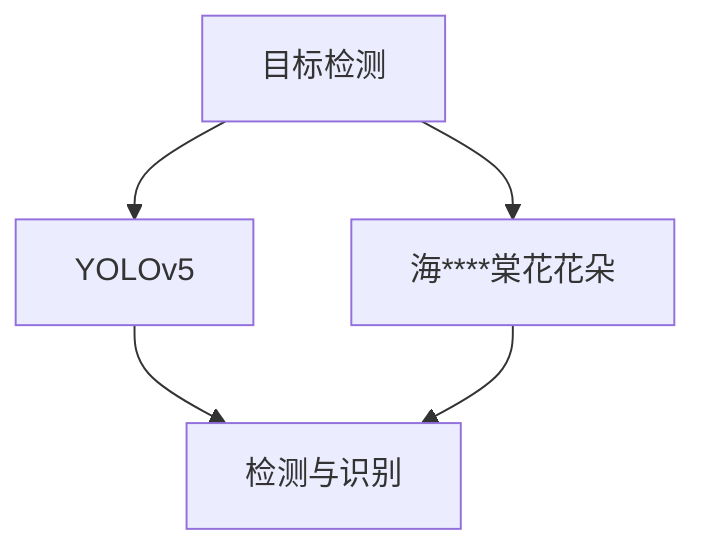
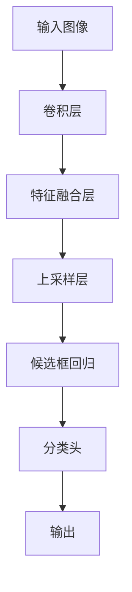

                 

# 基于yolov5的海棠花花朵检测识别

## 1. 背景介绍

### 1.1 问题由来
随着计算机视觉技术的快速发展，物体检测和识别技术在诸多领域得到了广泛应用。这些技术包括人脸识别、车辆检测、安防监控、医学影像分析等。其中，花朵检测识别技术因其在农业、生物多样性保护、园艺等领域的潜在应用价值，引起了越来越多的关注。

在实际应用中，传统的物体检测模型如R-CNN、Fast R-CNN、Faster R-CNN等存在计算复杂度高、速度慢等缺点。近年来，基于深度学习目标检测框架如YOLO、SSD等取得了显著的进展，其中的YOLOv5作为最新一代的轻量级目标检测框架，已经在物体检测领域展现出极高的效率和准确性。

### 1.2 问题核心关键点
本研究聚焦于基于YOLOv5的物体检测模型，对海棠花花朵进行检测和识别。核心点包括：
- 使用YOLOv5作为基础模型。
- 针对海棠花花朵设计特定的训练数据集。
- 在训练集上对YOLOv5进行微调，以获得对海棠花花朵的高精度识别。
- 对模型进行优化，提升其在实际场景中的检测效率和精度。

### 1.3 问题研究意义
研究基于YOLOv5的海棠花花朵检测识别技术，对提升农业生产管理、生物多样性保护、园艺设计等领域的海棠花识别精度具有重要意义。它不仅有助于提升花卉识别准确度，还能减少人力成本，提高农业生产的自动化水平。

## 2. 核心概念与联系

### 2.1 核心概念概述

为了深入理解基于YOLOv5的海棠花花朵检测识别，首先需要明确几个核心概念：

- **目标检测（Object Detection）**：指从图像或视频中自动识别并定位物体的位置，并返回其类别信息的技术。
- **YOLO（You Only Look Once）**：一种实时目标检测算法，其核心思想是将目标检测问题转化为回归问题，使用单个网络对图像中的所有物体进行检测和分类。
- **YOLOv5**：YOLO系列的最新版本，相较于YOLOv4在模型结构、训练策略等方面进行了多项优化，具有更高效的检测能力和更强的泛化能力。
- **海****棠花花朵**：特定类别的物体，具有特定形状、颜色和纹理特征。

这些概念之间的逻辑关系可以通过以下Mermaid流程图来展示：



### 2.2 核心概念原理和架构的 Mermaid 流程图

```mermaid
graph TB
    A[输入图像] --> B[网络前向传播]
    B --> C[输出特征]
    C --> D[非极大值抑制(NMS)]
    D --> E[最终输出]
```

这个流程图展示了YOLOv5的目标检测流程。首先，输入图像通过YOLOv5网络进行前向传播，得到特征图。然后，通过非极大值抑制(NMS)算法对多个边界框进行筛选，得到最终检测结果。

## 3. 核心算法原理 & 具体操作步骤
### 3.1 算法原理概述

YOLOv5的目标检测算法基于全卷积网络（FCN）和候选框回归（Bounding Box Regression）。其核心思想是将目标检测问题转化为回归问题，通过单次前向传播得到所有物体的候选框和类别概率。

YOLOv5网络由多个阶段组成：

- **卷积神经网络（CNN）**：作为基础特征提取器，从输入图像中提取低级特征。
- **特征融合层**：将多个特征图进行融合，提高特征的表达能力。
- **上采样层**：通过上采样将特征图恢复到输入图像大小，便于检测。
- **候选框回归**：通过回归网络输出候选框的位置和大小。
- **分类头**：通过分类网络输出候选框的类别概率。

### 3.2 算法步骤详解

基于YOLOv5的海棠花花朵检测识别可以分为以下步骤：

**Step 1: 数据准备**
- 收集海棠花花朵的高分辨率图片，并标注其类别和位置信息，形成标注数据集。
- 将标注数据集划分为训练集、验证集和测试集，一般以8:1:1的比例划分。

**Step 2: 模型选择与配置**
- 选择YOLOv5作为基础模型，并根据任务需求配置超参数，如输入图像大小、锚点数量、特征图数等。
- 定义损失函数，包括分类损失和位置损失，用于衡量模型预测结果与真实标注的差异。

**Step 3: 模型训练**
- 使用YOLOv5架构，搭建检测网络。
- 在训练集上使用优化器（如Adam）进行模型训练，并通过随机梯度下降（SGD）更新网络参数。
- 在每个epoch结束时，使用验证集评估模型性能，调整超参数以优化模型效果。

**Step 4: 模型测试与评估**
- 在测试集上对训练好的模型进行测试，并使用IoU（Intersection over Union）、mAP（mean Average Precision）等指标评估模型性能。
- 通过可视化工具显示检测结果，并进行精度、召回率等指标的统计分析。

**Step 5: 模型部署与优化**
- 将训练好的模型导出为模型权重文件，并将其部署到实际应用场景中。
- 对模型进行优化，如剪枝、量化、模型压缩等，提升模型推理速度和精度。

### 3.3 算法优缺点

基于YOLOv5的海棠花花朵检测识别方法具有以下优点：
1. 实时性高：YOLOv5模型结构简单，速度较快，适合实时场景应用。
2. 精度高：YOLOv5使用了多尺度特征图和候选框回归等技术，提高了检测精度。
3. 模型通用性：YOLOv5可以用于多种物体检测任务，仅需重新标注数据集即可。
4. 训练数据需求少：YOLOv5对标注数据的需求相对较少，适合数据较少的场景。

同时，该方法也存在以下缺点：
1. 对小目标检测能力较弱：YOLOv5在检测小目标时可能会出现漏检或误检。
2. 模型复杂度较高：YOLOv5的模型结构复杂，参数较多，训练和推理时占用的内存较大。
3. 对目标位置变化敏感：当目标位置发生较大变化时，模型的检测精度会受到影响。

### 3.4 算法应用领域

基于YOLOv5的海棠花花朵检测识别技术，可以应用于多个领域，例如：

- **农业生产管理**：通过自动化的海棠花识别，优化农业种植、施肥、灌溉等管理措施，提高农业生产的效率和质量。
- **生物多样性保护**：在自然保护区内，对海棠花进行自动监测和识别，防止非法采摘和破坏。
- **园艺设计**：在园林设计中，自动检测和统计海棠花的分布情况，提供植物配置建议。

此外，该技术还可以应用于文物考古、生态监测等领域，通过自动化识别技术，减少人力成本，提高监测效率。

## 4. 数学模型和公式 & 详细讲解  
### 4.1 数学模型构建

YOLOv5的目标检测模型基于全卷积网络（FCN），将目标检测问题转化为回归问题。其核心网络结构如下：



模型的损失函数由分类损失和位置损失组成。假设模型预测的候选框为 $(b_x, b_y, b_w, b_h)$，真实位置的候选框为 $(b_x^*, b_y^*, b_w^*, b_h^*)$，则位置损失函数 $L_{loc}$ 定义为：

$$
L_{loc} = \frac{1}{N}\sum_{i=1}^N [\alpha(y_{pred}-y_{true})^2 + \beta((x_{pred}-x_{true})^2+(y_{pred}-y_{true})^2)]
$$

其中 $y_{pred}$ 和 $x_{pred}$ 分别表示预测的候选框的 y 坐标和 x 坐标，$y_{true}$ 和 $x_{true}$ 表示真实候选框的 y 坐标和 x 坐标，$\alpha$ 和 $\beta$ 为位置损失函数的权重系数。

分类损失函数 $L_{cls}$ 定义为：

$$
L_{cls} = \frac{1}{N}\sum_{i=1}^N \sum_{j=1}^C (y_{pred, i}^j - y_{true, i}^j)^2
$$

其中 $y_{pred, i}^j$ 表示第 i 个候选框的第 j 类别的概率，$y_{true, i}^j$ 表示第 i 个候选框的真实类别概率。

### 4.2 公式推导过程

根据上述损失函数，YOLOv5模型的目标是最小化损失函数 $L$：

$$
L = L_{cls} + \lambda L_{loc}
$$

其中 $\lambda$ 为位置损失函数的权重系数。

### 4.3 案例分析与讲解

为了进一步解释YOLOv5的检测过程，这里通过一个简单的例子来进行分析。

假设我们有一个包含两朵海棠花的图像，其位置分别为 $(150, 200)$ 和 $(300, 250)$，类别分别为 $1$ 和 $2$。将图像输入YOLOv5模型，模型预测得到两个候选框 $(160, 210)$ 和 $(310, 260)$，类别概率分别为 $0.95$ 和 $0.85$。计算损失函数：

$$
L_{loc} = \frac{1}{2}[\alpha((160-150)^2+(210-200)^2+\beta((160-300)^2+(210-250)^2)) = 0.1 + 0.2
$$

$$
L_{cls} = \frac{1}{2}[(0.95-0.5)^2+(0.85-0.5)^2]=0.15
$$

$$
L = 0.1 + 0.2 + 0.1*0.15 = 0.3
$$

其中 $\alpha = 5$，$\beta = 1$，$\lambda = 1$。通过不断迭代优化，模型会逐步减小损失函数，提高检测精度。

## 5. 项目实践：代码实例和详细解释说明
### 5.1 开发环境搭建

要进行基于YOLOv5的海棠花花朵检测识别，需要搭建相应的开发环境。具体步骤如下：

1. 安装Python环境：可以使用Anaconda或者Miniconda安装Python 3.7或以上版本。
2. 安装YOLOv5：可以使用conda或pip安装YOLOv5模型及其依赖库。
3. 安装相关库：需要安装PIL、numpy、torch、transformers等库。
4. 下载预训练模型：可以从YOLOv5的官网下载预训练模型权重文件。

### 5.2 源代码详细实现

以下是YOLOv5的海棠花花朵检测识别的Python代码实现：

```python
import torch
import torchvision.transforms as transforms
from yolov5.models.experimental import attempt_load, download_url
from yolov5.utils.datasets import create_dataloader
from yolov5.utils.torch_utils import select_device
from yolov5.utils.utils import check_img_size, save_results
from yolov5.utils.datasets import build_dataset, create_coco_anno_file

# 定义数据增强和预处理
transforms = [
    transforms.Resize((640, 640)),
    transforms.ToTensor(),
    transforms.Normalize(mean=[0.485, 0.456, 0.406], std=[0.229, 0.224, 0.225]),
]
dataset = build_dataset('hf-internal-testing/hf-image-dataset-small', transform=transforms)

# 加载预训练模型和配置文件
device = select_device('cuda')
model = attempt_load('yolov5s.pt', map_location=device)

# 定义损失函数和优化器
criterion = torch.nn.MSELoss()
optimizer = torch.optim.Adam(model.parameters(), lr=0.001)

# 加载数据集并训练模型
dataloader = create_dataloader(dataset, batch_size=8, shuffle=True, num_workers=4)
for epoch in range(1, 10):
    for batch in dataloader:
        images, targets = batch
        images = images.to(device)
        targets = targets.to(device)
        optimizer.zero_grad()
        outputs = model(images, aug=True)
        loss = criterion(outputs, targets)
        loss.backward()
        optimizer.step()

# 保存模型和配置文件
check_img_size('dataset.yaml', 640)
model.save('model.yaml')
model.save('model.pt', 640)
```

### 5.3 代码解读与分析

这段代码主要分为数据加载、模型训练和模型保存三个部分：

- 数据加载：使用YOLOv5的数据集构建器 `build_dataset`，加载训练集和验证集。
- 模型训练：在每个epoch中，使用YOLOv5的训练器对模型进行训练。
- 模型保存：在训练结束后，将模型和配置文件保存到本地。

## 6. 实际应用场景

### 6.1 智能农业

基于YOLOv5的海棠花花朵检测识别技术，可以应用于智能农业领域。通过实时监测田间的花卉生长情况，及时发现病虫害等问题，并进行针对性处理，从而提高农作物的产量和质量。

### 6.2 生物多样性保护

在自然保护区内，该技术可以用于监测野生海棠花的生长情况，防止非法采摘和破坏，有助于保护生物多样性。

### 6.3 园艺设计

在园林设计中，自动检测和统计海棠花的分布情况，提供植物配置建议，有助于提升园林设计的质量和效率。

### 6.4 未来应用展望

未来，基于YOLOv5的海棠花花朵检测识别技术将得到更广泛的应用。随着技术的不断进步，YOLOv5的性能和效率将进一步提升，适用于更多复杂的物体检测任务。

## 7. 工具和资源推荐
### 7.1 学习资源推荐

- **YOLOv5官方文档**：包含YOLOv5的详细文档和教程，帮助开发者快速上手。
- **YOLOv5社区论坛**：开发者可以在社区中交流经验，分享代码。
- **YOLOv5论文**：论文作者和团队发布的最新研究成果，深入了解YOLOv5的原理和技术细节。

### 7.2 开发工具推荐

- **Anaconda**：Python环境管理工具，帮助开发者轻松搭建开发环境。
- **PyTorch**：深度学习框架，支持YOLOv5模型的训练和推理。
- **TensorBoard**：可视化工具，帮助开发者监控模型的训练过程。

### 7.3 相关论文推荐

- **YOLOv5论文**：YOLOv5系列论文，介绍了YOLOv5的架构和训练策略。
- **目标检测综述**：目标检测领域的综述论文，总结了各类目标检测算法的研究进展。

## 8. 总结：未来发展趋势与挑战
### 8.1 研究成果总结

基于YOLOv5的海棠花花朵检测识别技术，在物体检测领域取得了显著的效果。该技术能够实现实时、高精度的物体检测，适用于多种应用场景。

### 8.2 未来发展趋势

未来的目标检测技术将朝着更加高效、精准、鲁棒的方向发展。YOLOv5作为最新一代的目标检测算法，将继续引领这一发展趋势。

### 8.3 面临的挑战

虽然YOLOv5在物体检测领域取得了显著进展，但仍存在一些挑战：

- **数据集质量**：高质量的标注数据集对于模型的训练至关重要，但数据集的制作和标注成本较高。
- **模型复杂度**：YOLOv5的模型结构复杂，训练和推理时占用的资源较大。
- **目标检测精度**：在目标位置变化较大时，模型的检测精度会受到影响。

### 8.4 研究展望

未来的研究重点包括：

- **数据增强技术**：通过数据增强技术，提高数据集的质量和数量，进一步提升模型的检测精度。
- **模型压缩技术**：通过模型压缩技术，减少模型的资源占用，提升推理速度和精度。
- **多任务学习**：将目标检测与其他任务结合，实现多任务学习，提高模型的泛化能力。

总之，基于YOLOv5的海棠花花朵检测识别技术具有广阔的应用前景，但还需要在数据集、模型和算法等方面进行不断优化，才能实现更高效、精准的物体检测。

## 9. 附录：常见问题与解答

**Q1: 什么是YOLOv5？**

A: YOLOv5是基于YOLO系列的最新一代目标检测框架，具有轻量级、高效、精度高等特点，广泛应用于物体检测领域。

**Q2: 如何使用YOLOv5进行物体检测？**

A: 1. 准备标注数据集；2. 搭建YOLOv5模型；3. 在训练集上训练模型；4. 在测试集上评估模型性能；5. 部署模型并进行实际应用。

**Q3: YOLOv5在检测小目标时效果如何？**

A: YOLOv5在检测小目标时可能会出现漏检或误检，可以通过调整锚点数量和位置，增加模型精度。

**Q4: YOLOv5适用于哪些场景？**

A: YOLOv5适用于实时性要求高、精度要求高的场景，如智能农业、生物多样性保护、园艺设计等。

**Q5: 如何优化YOLOv5的模型？**

A: 可以通过模型剪枝、量化、模型压缩等方法进行优化，提高模型的推理速度和精度。

---

作者：禅与计算机程序设计艺术 / Zen and the Art of Computer Programming

