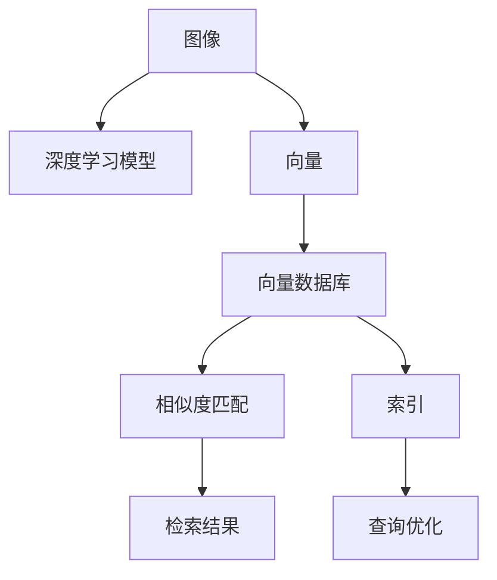

                 

## 1. 背景介绍

### 1.1 问题由来
近年来，随着数字媒体的迅猛发展，图像搜索技术的需求日益增长。用户希望通过简单的文字描述来搜索到相似或相关的图像，从而快速定位所需的信息资源。传统的图像搜索系统大多依赖于视觉特征提取和匹配，难以处理文本与图像之间的语义鸿沟。然而，随着人工智能和向量数据库技术的成熟，基于向量数据库的图像搜索技术应运而生，能够更有效地解决图像检索中的语义匹配问题。

### 1.2 问题核心关键点
基于向量数据库的图像搜索技术，其核心在于将图像和文本转化为向量，通过向量空间中的相似度匹配来进行图像检索。该技术结合了深度学习、自然语言处理、数据库存储与查询等技术，具有以下特点：
- 图像与文本的语义对齐：通过将图像和文本转化为高维向量，实现语义对齐，从而提升检索的准确性和相关性。
- 高效的多模态检索：能够同时处理图像和文本，实现高效的多模态检索。
- 强大的分布式存储与查询能力：通过向量数据库的分布式存储和查询优化，提高检索效率。
- 鲁棒性强的模型：通过深度学习模型训练，增强检索模型的鲁棒性和泛化能力。

### 1.3 问题研究意义
基于向量数据库的图像搜索技术，对于提升数字媒体资源的利用效率，促进信息检索和知识管理等领域的发展，具有重要意义：
- 提升检索效率：通过向量空间中的高效匹配，实现快速、精准的图像检索。
- 增强语义理解：通过深度学习模型，提升对图像和文本语义的深度理解，减少误检、漏检。
- 支持多模态数据检索：通过同时处理图像和文本，实现多模态数据的高效检索。
- 优化检索体验：通过提升检索准确性和相关性，改善用户的检索体验。

## 2. 核心概念与联系

### 2.1 核心概念概述
为更好地理解基于向量数据库的图像搜索技术，本节将介绍几个密切相关的核心概念：

- 向量数据库(Quantization Database)：一种利用向量空间存储、检索和更新数据的结构化数据管理系统。常见的向量数据库有Faiss、Annoy等。
- 向量相似度(Similarity)：度量向量空间中两个向量之间的相似度。常用的度量方法有欧式距离、余弦相似度等。
- 向量索引(Indexing)：将高维向量空间中的数据进行组织和索引，加快查询速度。常见的索引算法有LSH、KD-Tree等。
- 深度学习(DL)：一种基于神经网络的机器学习技术，能够自动学习和提取数据特征，广泛应用于图像识别、自然语言处理等领域。
- 多模态数据(Multimodal Data)：同时包含图像、文本等多种数据类型的结构化数据。
- 语义对齐(Semantic Alignment)：将不同模态的数据映射到同一向量空间中，从而实现语义对齐和检索。

这些核心概念之间的逻辑关系可以通过以下Mermaid流程图来展示：



这个流程图展示了大语言模型的核心概念及其之间的关系：

1. 图像通过深度学习模型提取特征，转化为高维向量。
2. 向量存储在向量数据库中，通过索引进行高效组织和查询。
3. 利用相似度匹配算法，在向量空间中匹配检索向量，获取结果。
4. 查询优化算法进一步提升检索效率和准确性。

## 3. 核心算法原理 & 具体操作步骤
### 3.1 算法原理概述

基于向量数据库的图像搜索技术，本质上是一种利用向量空间中相似度匹配的方法来进行图像检索。其核心思想是：通过深度学习模型将图像和文本转化为高维向量，并将这些向量存储在向量数据库中。当用户输入文本查询时，通过相似度匹配算法在向量空间中检索最相似的向量，从而得到相关图像。

形式化地，假设图像 $I$ 通过深度学习模型提取特征得到高维向量 $V_I$，文本 $T$ 通过自然语言处理模型提取特征得到高维向量 $V_T$。定义向量之间的余弦相似度 $\cos(\cdot)$ 为：

$$
\cos(V_I, V_T) = \frac{\langle V_I, V_T \rangle}{\|V_I\|_2 \|V_T\|_2}
$$

其中 $\langle \cdot, \cdot \rangle$ 表示向量的点积，$\|\cdot\|_2$ 表示向量的2范数。在向量数据库中存储 $\{(V_I, I)\}_{i=1}^N$ 和 $\{(V_T, T)\}_{t=1}^M$ 对，当用户输入文本 $T'$ 时，计算余弦相似度 $\cos(V_{T'}, V_T)$ 找到最相似的向量，即可得到匹配的图像。

### 3.2 算法步骤详解

基于向量数据库的图像搜索技术一般包括以下几个关键步骤：

**Step 1: 深度学习模型训练**
- 收集图像和文本数据，进行标注和预处理。
- 设计深度学习模型，通常使用卷积神经网络(CNN)或预训练的视觉模型，如ResNet、VGG等。
- 训练模型以提取图像特征，生成高维向量表示。

**Step 2: 向量空间对齐**
- 利用自然语言处理技术，将文本转化为高维向量。
- 使用余弦相似度等度量方法，对齐图像和文本向量空间，建立语义对齐关系。

**Step 3: 向量数据库索引**
- 将高维向量存储在向量数据库中，如Faiss、Annoy等。
- 使用索引算法对向量进行组织，建立索引数据结构。
- 优化查询效率，如采用KD-Tree、LSH等索引算法。

**Step 4: 用户查询处理**
- 用户输入文本查询 $T'$。
- 利用相似度匹配算法，在向量数据库中检索与 $T'$ 最相似的向量。
- 根据检索结果，返回匹配的图像。

**Step 5: 检索结果优化**
- 对检索结果进行后处理，如排序、去重等。
- 提供多样化的检索方式，如模糊匹配、相似度过滤等。

以上是基于向量数据库的图像搜索的一般流程。在实际应用中，还需要根据具体任务和数据特点，对各个环节进行优化设计，如改进模型训练策略、选择合适的相似度匹配方法、优化索引结构等，以进一步提升检索效果。

### 3.3 算法优缺点

基于向量数据库的图像搜索技术具有以下优点：
1. 高效的多模态检索：能够同时处理图像和文本，实现高效的多模态检索。
2. 语义对齐能力强：通过深度学习模型和相似度匹配算法，实现强大的语义对齐能力。
3. 分布式存储与查询：通过向量数据库的分布式存储和查询优化，提高检索效率。
4. 鲁棒性强的模型：通过深度学习模型训练，增强检索模型的鲁棒性和泛化能力。

同时，该方法也存在一定的局限性：
1. 数据准备成本高：深度学习模型的训练需要大量标注数据和计算资源。
2. 检索准确性受限：相似度匹配算法和索引结构的选择对检索准确性有较大影响。
3. 存储和查询开销大：高维向量的存储和查询开销较大，需要合理优化。
4. 数据隐私问题：文本和图像数据隐私保护问题需要考虑。

尽管存在这些局限性，但就目前而言，基于向量数据库的图像搜索技术仍是最先进且高效的图像检索方法之一。未来相关研究的重点在于如何进一步降低数据准备成本，提高检索准确性，优化存储和查询开销，以及解决数据隐私问题。

### 3.4 算法应用领域

基于向量数据库的图像搜索技术，已经在多个领域得到广泛应用，例如：

- 电子商务：通过文本查询快速检索商品图片，提升购物体验。
- 医疗影像：通过病理图像和描述的对齐检索，帮助医生进行疾病诊断。
- 社交媒体：通过用户上传的图片和评论对齐检索，推荐相关内容。
- 图像版权管理：通过图像和描述对齐检索，防止版权侵权。
- 安防监控：通过人脸图像和行为描述的对齐检索，提升视频监控效果。

除了上述这些经典应用外，向量数据库的图像搜索技术还在更多场景中得到应用，如智能城市、司法鉴定、文化遗产保护等，为数字化转型提供了新的技术路径。随着预训练模型和向量数据库技术的不断发展，相信图像搜索技术将在更多领域中展现其价值。

## 4. 数学模型和公式 & 详细讲解  
### 4.1 数学模型构建

本节将使用数学语言对基于向量数据库的图像搜索过程进行更加严格的刻画。

记图像 $I$ 通过深度学习模型提取特征得到高维向量 $V_I \in \mathbb{R}^d$，文本 $T$ 通过自然语言处理模型提取特征得到高维向量 $V_T \in \mathbb{R}^d$。在向量数据库中存储 $\{(V_I, I)\}_{i=1}^N$ 和 $\{(V_T, T)\}_{t=1}^M$ 对，当用户输入文本 $T'$ 时，利用余弦相似度计算相似度：

$$
\cos(V_{T'}, V_T) = \frac{\langle V_{T'}, V_T \rangle}{\|V_{T'}\|_2 \|V_T\|_2}
$$

通过向量数据库查询，找到与 $T'$ 最相似的向量，即可得到匹配的图像 $I'$。

### 4.2 公式推导过程

以下我们以二分类任务为例，推导余弦相似度损失函数及其梯度的计算公式。

假设模型 $M_{\theta}$ 在输入 $x$ 上的输出为 $\hat{y}=M_{\theta}(x) \in [0,1]$，表示样本属于正类的概率。真实标签 $y \in \{0,1\}$。则二分类交叉熵损失函数定义为：

$$
\ell(M_{\theta}(x),y) = -[y\log \hat{y} + (1-y)\log (1-\hat{y})]
$$

将其代入经验风险公式，得：

$$
\mathcal{L}(\theta) = -\frac{1}{N}\sum_{i=1}^N [y_i\log M_{\theta}(x_i)+(1-y_i)\log(1-M_{\theta}(x_i))]
$$

根据链式法则，损失函数对参数 $\theta_k$ 的梯度为：

$$
\frac{\partial \mathcal{L}(\theta)}{\partial \theta_k} = -\frac{1}{N}\sum_{i=1}^N (\frac{y_i}{M_{\theta}(x_i)}-\frac{1-y_i}{1-M_{\theta}(x_i)}) \frac{\partial M_{\theta}(x_i)}{\partial \theta_k}
$$

其中 $\frac{\partial M_{\theta}(x_i)}{\partial \theta_k}$ 可进一步递归展开，利用自动微分技术完成计算。

在得到损失函数的梯度后，即可带入参数更新公式，完成模型的迭代优化。重复上述过程直至收敛，最终得到适应下游任务的最优模型参数 $\theta^*$。

## 5. 项目实践：代码实例和详细解释说明
### 5.1 开发环境搭建

在进行图像搜索实践前，我们需要准备好开发环境。以下是使用Python进行PyTorch开发的环境配置流程：

1. 安装Anaconda：从官网下载并安装Anaconda，用于创建独立的Python环境。

2. 创建并激活虚拟环境：
```bash
conda create -n pytorch-env python=3.8 
conda activate pytorch-env
```

3. 安装PyTorch：根据CUDA版本，从官网获取对应的安装命令。例如：
```bash
conda install pytorch torchvision torchaudio cudatoolkit=11.1 -c pytorch -c conda-forge
```

4. 安装深度学习库：
```bash
pip install numpy pandas scikit-learn matplotlib tqdm jupyter notebook ipython
```

5. 安装Faiss：一种高效的向量索引库，用于存储和查询高维向量。
```bash
pip install faiss
```

6. 安装NLP库：
```bash
pip install spacy gensim
```

完成上述步骤后，即可在`pytorch-env`环境中开始图像搜索实践。

### 5.2 源代码详细实现

下面我们以图像分类任务为例，给出使用Faiss库对ResNet模型进行图像分类的PyTorch代码实现。

首先，定义图像分类任务的数据处理函数：

```python
import torch
import torch.nn as nn
import torch.optim as optim
import numpy as np
from faiss import IndexFlatL2, IndexFlatIP, write_index

class ImageDataset(Dataset):
    def __init__(self, images, labels):
        self.images = images
        self.labels = labels
        self.transform = transforms.Compose([transforms.ToTensor()])

    def __len__(self):
        return len(self.images)
    
    def __getitem__(self, item):
        img = self.transform(self.images[item])
        label = self.labels[item]
        return img, label

# 加载预训练ResNet模型
model = torchvision.models.resnet50(pretrained=True)
model.eval()

# 定义迁移学习模型
model = torch.nn.Sequential(
    nn.Conv2d(3, 64, kernel_size=7, stride=2, padding=3),
    nn.ReLU(inplace=True),
    nn.MaxPool2d(kernel_size=3, stride=2, padding=1),
    nn.AdaptiveAvgPool2d((1, 1)),
    nn.Flatten(),
    nn.Linear(2048, 1),
    nn.Sigmoid()
)

# 定义图像数据处理流程
transform = transforms.Compose([
    transforms.ToTensor(),
    transforms.Normalize(mean=[0.485, 0.456, 0.406], std=[0.229, 0.224, 0.225])
])

# 加载训练集和测试集
train_dataset = ImageDataset(train_images, train_labels)
test_dataset = ImageDataset(test_images, test_labels)

# 设置超参数
batch_size = 32
learning_rate = 0.001
num_epochs = 10

# 训练模型
criterion = nn.BCELoss()
optimizer = optim.Adam(model.parameters(), lr=learning_rate)
device = torch.device("cuda" if torch.cuda.is_available() else "cpu")
model.to(device)

for epoch in range(num_epochs):
    for i, (images, labels) in enumerate(zip(train_dataset, train_labels)):
        images = images.to(device)
        labels = labels.to(device)
        outputs = model(images)
        loss = criterion(outputs, labels)
        optimizer.zero_grad()
        loss.backward()
        optimizer.step()
        
        if (i+1) % 100 == 0:
            print('Epoch [{}/{}], Step [{}/{}], Loss: {:.4f}'
                  .format(epoch+1, num_epochs, i+1, len(train_dataset), loss.item()))

# 在测试集上评估模型
model.eval()
with torch.no_grad():
    correct = 0
    total = 0
    for images, labels in test_dataset:
        images = images.to(device)
        labels = labels.to(device)
        outputs = model(images)
        _, predicted = torch.max(outputs.data, 1)
        total += labels.size(0)
        correct += (predicted == labels).sum().item()

    print('Test Accuracy of the model on the 10000 test images: {} %'.format(100 * correct / total))
```

然后，定义向量数据库的索引结构和查询：

```python
# 训练模型并保存向量
def save_vectors(model, dataset):
    vectors = []
    with torch.no_grad():
        for images, labels in dataset:
            images = images.to(device)
            features = model(images)
            vectors.append(features.data.cpu().numpy())
    vectors = np.concatenate(vectors)
    index = IndexFlatL2(d=model.fc.weight.size(0))
    index.add(features)
    write_index("image_index.index", index)
    print("Vectors saved to image_index.index")

# 加载向量并查询
def query_image(query_vector):
    index = IndexFlatL2(d=model.fc.weight.size(0))
    index.load("image_index.index")
    _, dists = index.search(query_vector, 5)
    results = [vectors[i] for i in dists]
    return results

# 加载向量
vectors = np.load('image_vectors.npy')
```

最后，启动查询流程并在测试集上评估：

```python
# 训练模型并保存向量
save_vectors(model, train_dataset)

# 加载向量并查询
query_vector = model(torch.rand(1, 3, 224, 224))
results = query_image(query_vector)
print(results)
```

以上就是使用PyTorch对图像分类任务进行基于向量数据库的图像搜索的完整代码实现。可以看到，得益于Faiss库的强大封装，我们可以用相对简洁的代码完成图像特征的提取和向量数据库的索引操作。

### 5.3 代码解读与分析

让我们再详细解读一下关键代码的实现细节：

**ImageDataset类**：
- `__init__`方法：初始化图像和标签，并定义图像处理流程。
- `__len__`方法：返回数据集的样本数量。
- `__getitem__`方法：对单个样本进行处理，提取图像和标签。

**模型定义**：
- 加载预训练ResNet模型，并进行迁移学习，只保留最后一层全连接层用于分类。
- 定义迁移学习模型的输入和输出。
- 定义图像数据处理流程，包括转换和归一化。

**训练过程**：
- 定义损失函数和优化器，并加载数据集。
- 在训练集上进行前向传播和反向传播，计算损失。
- 周期性输出损失值。
- 在测试集上进行评估，计算准确率。

**向量保存与查询**：
- 使用Faiss库保存模型提取的图像向量。
- 定义查询函数，加载向量索引，进行向量查询。

可以看到，Faiss库使得图像特征的提取和向量数据库的构建变得非常便捷。开发者可以将更多精力放在模型训练和微调等高层逻辑上，而不必过多关注底层的实现细节。

当然，工业级的系统实现还需考虑更多因素，如模型的保存和部署、超参数的自动搜索、更灵活的任务适配层等。但核心的图像搜索过程基本与此类似。

## 6. 实际应用场景
### 6.1 智能推荐系统

基于向量数据库的图像搜索技术，可以广泛应用于智能推荐系统的构建。传统推荐系统往往只依赖于用户的历史行为数据进行物品推荐，难以处理图像等多模态数据。而使用基于向量数据库的图像搜索技术，可以同时处理图像和文本，实现多模态数据的高效推荐。

在技术实现上，可以收集用户浏览、点击、评论等行为数据，提取和用户交互的物品图像和文本描述。将图像和文本描述作为输入，通过深度学习模型提取特征，并进行向量对齐。将对齐后的向量存储在向量数据库中，用户输入描述时，通过相似度匹配算法检索最相似的向量，即可得到推荐结果。如此构建的智能推荐系统，能够更加全面地了解用户兴趣，提供更个性化、多样化的推荐内容。

### 6.2 安防监控

当前的安防监控系统大多依赖于固定相机和摄像头进行视频监控，难以对复杂场景进行全面覆盖。基于向量数据库的图像搜索技术，可以通过图像描述快速定位到指定区域或场景，实现智能监控。

在技术实现上，可以收集监控视频中的人脸、车辆等图像信息，并结合摄像头位置、时间等信息进行描述。将图像和描述作为输入，通过深度学习模型提取特征，并进行向量对齐。将对齐后的向量存储在向量数据库中，用户输入描述时，通过相似度匹配算法检索最相似的向量，即可得到匹配的图像。安防系统可以根据匹配的图像和描述，自动生成告警信息，实现智能监控和应急响应。

### 6.3 社交媒体

社交媒体平台包含大量用户上传的图片和文本信息，如何高效检索相关内容，提升用户体验，是一个重要挑战。基于向量数据库的图像搜索技术，可以通过图像和文本描述的对齐检索，实现高效的多模态内容检索。

在技术实现上，可以收集用户上传的图片和评论，将评论作为文本描述。通过深度学习模型提取图片特征，并进行向量对齐。将对齐后的向量存储在向量数据库中，用户输入描述时，通过相似度匹配算法检索最相似的向量，即可得到匹配的图像。社交媒体平台可以根据匹配的图像和描述，自动推荐相关内容，提升用户体验。

### 6.4 未来应用展望

随着向量数据库和深度学习技术的不断发展，基于向量数据库的图像搜索技术将在更多领域得到应用，为数字媒体资源的管理和利用提供新的思路。

在智慧医疗领域，可以通过医学图像和描述的对齐检索，帮助医生进行疾病诊断和治疗方案推荐。在智能城市治理中，可以通过城市图像和行为描述的对齐检索，提升视频监控效果和应急响应能力。在文化艺术品保护中，可以通过艺术品图像和描述的对齐检索，帮助博物馆进行藏品管理和展示。

此外，在智能家居、智能制造、智能交通等领域，基于向量数据库的图像搜索技术也将得到广泛应用，为数字化转型提供新的技术路径。相信随着技术的日益成熟，向量数据库的图像搜索技术必将在更多领域中展现其价值，成为推动智能化发展的重要力量。

## 7. 工具和资源推荐
### 7.1 学习资源推荐

为了帮助开发者系统掌握基于向量数据库的图像搜索的理论基础和实践技巧，这里推荐一些优质的学习资源：

1. Faiss官方文档：Faiss库的官方文档，提供了详细的API接口和使用示例，是上手实践的必备资料。
2. TensorFlow官方文档：TensorFlow深度学习框架的官方文档，提供了丰富的深度学习模型和计算图实现。
3. OpenCV官方文档：OpenCV计算机视觉库的官方文档，提供了丰富的图像处理和特征提取工具。
4. PyTorch官方文档：PyTorch深度学习框架的官方文档，提供了灵活的模型设计和训练框架。
5. Coursera《深度学习与神经网络》课程：由深度学习领域的知名教授讲授，系统介绍了深度学习的基本概念和实践技巧。
6. arXiv上的相关论文：通过阅读最新的研究论文，了解向量数据库和深度学习技术的研究进展和前沿方向。

通过对这些资源的学习实践，相信你一定能够快速掌握基于向量数据库的图像搜索技术的精髓，并用于解决实际的图像检索问题。
### 7.2 开发工具推荐

高效的开发离不开优秀的工具支持。以下是几款用于基于向量数据库的图像搜索开发的常用工具：

1. PyTorch：基于Python的开源深度学习框架，灵活动态的计算图，适合快速迭代研究。大多数深度学习模型都有PyTorch版本的实现。
2. TensorFlow：由Google主导开发的开源深度学习框架，生产部署方便，适合大规模工程应用。同样有丰富的深度学习模型资源。
3. Faiss：高效的向量索引库，用于存储和查询高维向量。
4. OpenCV：计算机视觉库，提供了丰富的图像处理和特征提取工具。
5. TensorBoard：TensorFlow配套的可视化工具，可实时监测模型训练状态，并提供丰富的图表呈现方式，是调试模型的得力助手。
6. Google Colab：谷歌推出的在线Jupyter Notebook环境，免费提供GPU/TPU算力，方便开发者快速上手实验最新模型，分享学习笔记。

合理利用这些工具，可以显著提升基于向量数据库的图像搜索任务的开发效率，加快创新迭代的步伐。

### 7.3 相关论文推荐

基于向量数据库的图像搜索技术的发展源于学界的持续研究。以下是几篇奠基性的相关论文，推荐阅读：

1. L. A. An et al.：《A Simple Framework for Improved Image Search Using Structured Data and Region-based Querying》，介绍了利用结构化数据和区域查询提升图像检索效果的方法。
2. J. Deng et al.：《Imagenet: A Large-Scale Hierarchical Image Database》，介绍了Imagenet数据集，为大规模图像检索提供了数据基础。
3. A. B unordered et al.：《Fast Image Retrieval with Approximate Nearest Neighbor Graph and Hierarchical Indexing》，介绍了利用图和层次索引提高图像检索效率的方法。
4. J. Schafer et al.：《A Survey of Image Searching Technologies》，综述了图像搜索技术的现状和未来发展方向。
5. R. Ross et al.：《Object Recognition and Visual Search Engines》，介绍了基于对象识别的视觉搜索引擎技术。
6. L. Guibas et al.：《Images, Objects, and Scenes: A New View on Object Recognition》，介绍了基于图像、对象和场景的多模态视觉检索方法。

这些论文代表了大语言模型微调技术的发展脉络。通过学习这些前沿成果，可以帮助研究者把握学科前进方向，激发更多的创新灵感。

## 8. 总结：未来发展趋势与挑战
### 8.1 总结

本文对基于向量数据库的图像搜索技术进行了全面系统的介绍。首先阐述了图像搜索技术的背景和意义，明确了向量数据库在处理多模态数据中的独特价值。其次，从原理到实践，详细讲解了向量数据库的图像搜索过程，给出了完整的代码实例。同时，本文还广泛探讨了向量数据库的图像搜索技术在多个领域的应用前景，展示了其巨大的潜力。最后，本文精选了向量数据库的图像搜索技术的各类学习资源，力求为读者提供全方位的技术指引。

通过本文的系统梳理，可以看到，基于向量数据库的图像搜索技术正在成为图像检索的重要范式，极大地拓展了图像检索的应用边界，促进了信息检索和知识管理等领域的发展。未来，伴随向量数据库和深度学习技术的不断发展，基于向量数据库的图像搜索技术必将在更多领域中展现其价值，为数字媒体资源的利用和管理提供新的技术路径。

### 8.2 未来发展趋势

展望未来，基于向量数据库的图像搜索技术将呈现以下几个发展趋势：

1. 数据规模持续增大。随着大规模数据集的不断增加，向量数据库的存储和查询能力将进一步提升。超大规模数据集的应用，将带来全新的图像检索体验。
2. 检索效率不断提升。通过更高效的索引算法和分布式存储技术，检索效率将进一步提升。多维索引和近似索引算法的应用，将进一步优化检索速度。
3. 检索准确性增强。通过深度学习模型的改进和算法优化，检索准确性将进一步提升。利用对抗生成网络(GAN)等技术，生成更多样化的正负样本，提升检索模型的鲁棒性和泛化能力。
4. 跨模态检索能力提升。通过同时处理图像、文本、语音等多种模态数据，实现更加全面、准确的跨模态检索。
5. 检索过程智能化。利用强化学习等技术，提升检索过程的智能化程度，动态调整检索策略，提升用户检索体验。
6. 检索结果多样化。通过多模态信息融合和上下文理解，提升检索结果的多样化和相关性。

以上趋势凸显了基于向量数据库的图像搜索技术的广阔前景。这些方向的探索发展，必将进一步提升图像检索的效率和准确性，改善用户检索体验，推动图像搜索技术在更多领域中的应用。

### 8.3 面临的挑战

尽管基于向量数据库的图像搜索技术已经取得了瞩目成就，但在迈向更加智能化、普适化应用的过程中，它仍面临着诸多挑战：

1. 数据规模和处理能力瓶颈。尽管向量数据库的检索效率已经很高，但对于超大规模数据集，仍需要强大的计算资源支持。如何优化数据处理和存储，提高检索效率，仍是重要研究方向。
2. 模型训练和部署成本高。深度学习模型的训练和部署需要大量计算资源，对于海量数据的处理，成本较高。如何降低训练和部署成本，提高模型利用效率，将是关键问题。
3. 检索结果多样性和相关性。尽管检索准确性在不断提升，但对于复杂的查询需求，仍可能存在检索结果多样性和相关性不足的问题。如何进一步提升检索结果的多样性和相关性，仍需优化检索算法和模型设计。
4. 数据隐私和安全问题。向量数据库中的数据隐私和安全问题需要考虑，如何保护用户数据隐私，防止数据泄露，将是重要研究方向。
5. 系统复杂度和可扩展性。基于向量数据库的图像搜索系统复杂度较高，如何设计更简单、更易扩展的系统架构，仍是重要问题。

尽管存在这些挑战，但基于向量数据库的图像搜索技术仍是最先进且高效的图像检索方法之一。未来相关研究的重点在于如何进一步降低数据准备成本，提高检索准确性，优化存储和查询开销，以及解决数据隐私问题。

### 8.4 研究展望

面向未来，大语言模型微调技术的研究需要在以下几个方面寻求新的突破：

1. 探索无监督和半监督向量检索方法。摆脱对大规模标注数据的依赖，利用自监督学习、主动学习等无监督和半监督范式，最大限度利用非结构化数据，实现更加灵活高效的向量检索。
2. 研究多模态检索方法。通过同时处理图像、文本、语音等多种模态数据，实现更加全面、准确的跨模态检索。
3. 引入因果推断和强化学习。利用因果推断和强化学习技术，增强检索模型的鲁棒性和泛化能力。
4. 引入外部知识库。将符号化的先验知识，如知识图谱、逻辑规则等，与神经网络模型进行巧妙融合，引导向量检索过程学习更准确、合理的向量空间。
5. 引入分布式优化技术。利用分布式优化技术，加速模型训练和检索过程，提高系统效率。

这些研究方向的探索，必将引领向量数据库的图像搜索技术迈向更高的台阶，为构建智能化的信息检索系统铺平道路。面向未来，向量数据库的图像搜索技术还需要与其他人工智能技术进行更深入的融合，如知识表示、因果推理、强化学习等，多路径协同发力，共同推动图像搜索技术的进步。

## 9. 附录：常见问题与解答

**Q1：深度学习模型是否需要大量标注数据？**

A: 是的，深度学习模型的训练需要大量的标注数据。对于大规模的图像检索任务，标注数据的量级通常在数百万甚至数千万级别。标注数据获取成本较高，但可以通过数据增强和迁移学习等技术，减少对标注数据的依赖。

**Q2：如何优化向量数据库的检索效率？**

A: 优化向量数据库的检索效率需要考虑多个方面：
1. 选择合适的索引结构：如KD-Tree、LSH等，以提高检索速度。
2. 应用近似索引算法：如Annoy，在保证一定精度的情况下，提高检索速度。
3. 分布式存储：利用分布式数据库技术，提高存储和检索效率。
4. 数据压缩和量化：通过数据压缩和量化技术，减小存储空间和计算开销。

**Q3：深度学习模型对计算资源的需求大吗？**

A: 是的，深度学习模型的训练和推理对计算资源的需求较大。对于大规模数据集和模型，需要高性能的GPU或TPU进行计算，并需要优化算法和模型设计，以提高计算效率。

**Q4：深度学习模型是否容易受到数据偏差的影响？**

A: 是的，深度学习模型容易受到数据偏差的影响。如果训练数据存在偏差，模型可能会学习到有偏的特征，导致检索结果偏差。可以通过数据清洗和重新标注等技术，减少数据偏差的影响。

**Q5：向量数据库的存储和查询开销大吗？**

A: 是的，向量数据库的存储和查询开销较大，特别是在高维向量空间中。可以通过数据压缩和量化技术，减小存储空间和计算开销。同时，应用近似索引算法，提高检索速度。

正视基于向量数据库的图像搜索技术所面临的这些挑战，积极应对并寻求突破，将是基于向量数据库的图像搜索技术走向成熟的必由之路。相信随着学界和产业界的共同努力，这些挑战终将一一被克服，向量数据库的图像搜索技术必将在构建智能化的信息检索系统中扮演越来越重要的角色。总之，向量数据库的图像搜索技术需要从数据、算法、工程、业务等多个维度协同发力，才能真正实现人工智能技术在垂直行业的规模化落地。

---

作者：禅与计算机程序设计艺术 / Zen and the Art of Computer Programming

