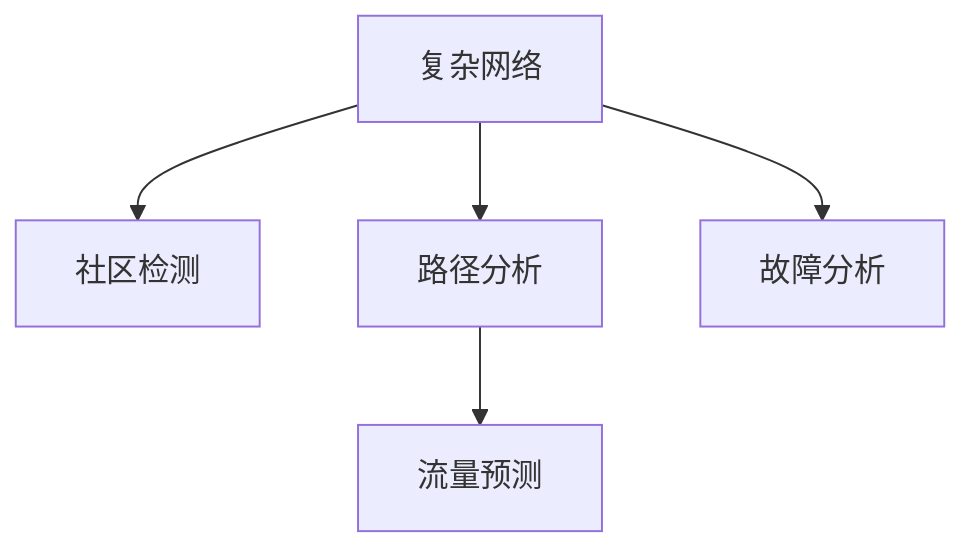

                 

# 基于复杂网络的城市地铁交通网络研究

> 关键词：城市地铁交通网络, 复杂网络, 社区检测, 路径分析, 交通流量预测

## 1. 背景介绍

### 1.1 问题由来

城市地铁交通网络作为现代城市交通的重要组成部分，在提供高效便捷的出行服务的同时，也对城市的可持续发展起着关键作用。近年来，随着城市的快速发展和地铁系统的不断扩展，如何优化地铁交通网络、提升运营效率成为了地铁公司及城市规划者面临的重大挑战。

复杂网络理论作为一门新兴的交叉学科，在自然科学和社会科学等领域都得到了广泛应用。其核心思想是将现实世界中的各类实体抽象为节点，将它们之间的相互作用关系抽象为边，从而构建网络模型，用于分析、预测和优化问题。

基于复杂网络理论的城市地铁交通网络研究，可以将地铁网络抽象为节点和边构成的图，进而利用网络分析工具和技术手段，对地铁网络的连通性、稳定性、社区结构等特征进行深入研究，为地铁交通系统的优化提供理论支撑和技术手段。

### 1.2 问题核心关键点

城市地铁交通网络研究的核心在于以下几个方面：
1. **网络构建**：如何构建一个准确反映地铁网络结构和运营特征的复杂网络模型。
2. **社区检测**：如何识别地铁网络中的重要节点和社区，从而了解网络的分层结构。
3. **路径分析**：如何分析地铁网络中的最优路径，优化运营策略。
4. **流量预测**：如何预测地铁网络的交通流量，提升运营效率。
5. **故障分析**：如何在网络发生故障时，快速定位问题并制定应急方案。

## 2. 核心概念与联系

### 2.1 核心概念概述

为更好地理解基于复杂网络的城市地铁交通网络研究，本节将介绍几个密切相关的核心概念：

- **复杂网络（Complex Network）**：由节点和边构成的网络模型，用于描述实体之间的相互作用关系。复杂网络在社会科学、自然科学、信息技术等领域有广泛应用。
- **社区检测（Community Detection）**：在复杂网络中识别具有相似属性的节点集合，从而了解网络的分层结构。社区检测是复杂网络研究的重要工具，可用于识别关键节点和社区，提升网络系统的鲁棒性和可靠性。
- **路径分析（Path Analysis）**：分析网络中节点间的路径，用于优化路由、交通流和资源分配等。
- **交通流量预测（Traffic Flow Prediction）**：基于历史数据和网络特性，预测未来的交通流量，帮助进行交通管理和运营决策。
- **故障分析（Fault Analysis）**：分析网络中可能发生故障的节点和路径，制定应急方案，提升系统的稳定性和可靠性。

这些核心概念之间的逻辑关系可以通过以下Mermaid流程图来展示：



这个流程图展示了复杂网络理论在城市地铁交通网络研究中的应用：

1. 复杂网络理论提供了一种将地铁网络抽象为图的建模方式。
2. 社区检测帮助识别地铁网络中的关键节点和社区，了解网络的分层结构。
3. 路径分析用于分析地铁网络中的最优路径，优化运营策略。
4. 流量预测基于历史数据和网络特性，预测未来的交通流量，提升运营效率。
5. 故障分析在网络发生故障时，快速定位问题并制定应急方案，提升系统的稳定性。

## 3. 核心算法原理 & 具体操作步骤
### 3.1 算法原理概述

基于复杂网络的城市地铁交通网络研究，其核心算法包括复杂网络建模、社区检测、路径分析、流量预测和故障分析等。这些算法以复杂网络理论为基础，结合地铁网络的具体特性，构建了一套完整的分析框架。

- **复杂网络建模**：将地铁网络抽象为节点和边构成的图，节点表示车站和线路，边表示线路之间的连接关系。
- **社区检测**：基于网络分析工具，如Louvain算法、GN算法等，识别地铁网络中的社区，理解网络的分层结构。
- **路径分析**：使用Dijkstra算法、A*算法等路径搜索算法，分析地铁网络中的最优路径，优化运营策略。
- **流量预测**：采用时间序列分析、机器学习等方法，结合网络特性，预测未来的交通流量。
- **故障分析**：利用网络分析工具，如节点介数、路径分析等，分析网络中可能发生故障的节点和路径，制定应急方案。

### 3.2 算法步骤详解

基于复杂网络的城市地铁交通网络研究一般包括以下几个关键步骤：

**Step 1: 数据收集与预处理**
- 收集地铁网络的线路图、站点信息、乘客流量等数据。
- 对数据进行清洗、处理，去除噪声和不一致性。

**Step 2: 复杂网络建模**
- 将地铁网络抽象为节点和边构成的图，节点表示车站和线路，边表示线路之间的连接关系。
- 定义节点的属性，如站点坐标、到达时间等。
- 定义边的属性，如线路长度、时间间隔等。

**Step 3: 社区检测**
- 选择合适的社区检测算法，如Louvain算法、GN算法等。
- 对地铁网络进行社区检测，识别网络中的社区，理解网络的分层结构。
- 分析社区的属性，识别关键节点和社区。

**Step 4: 路径分析**
- 选择合适的路径分析算法，如Dijkstra算法、A*算法等。
- 分析地铁网络中的最优路径，优化运营策略。
- 对路径进行评估，优化交通流和资源分配。

**Step 5: 流量预测**
- 选择合适的流量预测方法，如时间序列分析、机器学习等。
- 对地铁网络进行流量预测，了解未来的交通流量。
- 结合路径分析结果，优化交通管理和运营决策。

**Step 6: 故障分析**
- 选择合适的故障分析算法，如节点介数、路径分析等。
- 分析网络中可能发生故障的节点和路径。
- 制定应急方案，提升系统的稳定性。

以上是基于复杂网络的城市地铁交通网络研究的一般流程。在实际应用中，还需要针对具体网络的特点，对各个环节进行优化设计，如改进社区检测算法、优化路径分析方法、引入先进的机器学习模型等，以进一步提升研究结果的准确性和可靠性。

### 3.3 算法优缺点

基于复杂网络的城市地铁交通网络研究方法具有以下优点：
1. 能够全面地描述地铁网络的复杂结构和特性。
2. 提供了多种分析工具和技术手段，可用于研究地铁网络的多方面问题。
3. 能够为地铁运营和规划提供科学依据，提高决策的科学性和效率。

同时，该方法也存在一定的局限性：
1. 需要大量的原始数据，数据收集和处理难度较大。
2. 算法实现较为复杂，需要较强的计算能力和技术背景。
3. 结果解释性不足，对非专业研究人员存在一定的门槛。
4. 模型的准确性和鲁棒性依赖于数据质量和算法选择。

尽管存在这些局限性，但就目前而言，基于复杂网络的方法仍是大规模复杂网络分析的重要范式。未来相关研究的重点在于如何进一步降低数据收集和处理的难度，提高算法的可解释性和鲁棒性，同时兼顾模型的准确性和效率。

### 3.4 算法应用领域

基于复杂网络的城市地铁交通网络研究方法，在城市地铁交通领域有着广泛的应用，具体如下：

- **网络构建**：适用于地铁网络的建模和构建，为后续分析提供基础。
- **社区检测**：适用于地铁网络的关键节点识别和社区分析，用于网络规划和优化。
- **路径分析**：适用于地铁网络的最优路径分析，优化运营策略和资源分配。
- **流量预测**：适用于地铁网络的交通流量预测，提升运营效率和决策支持。
- **故障分析**：适用于地铁网络的故障分析和应急预案制定，提高系统鲁棒性。

此外，这些方法在其他大规模复杂网络领域，如航空网络、物流网络、社交网络等，也有广泛的应用前景。

## 4. 数学模型和公式 & 详细讲解 & 举例说明
### 4.1 数学模型构建

基于复杂网络的城市地铁交通网络研究，通常可以构建如下数学模型：

- **复杂网络模型**：用图论语言描述地铁网络，记为 $G=(V,E)$，其中 $V$ 为节点集合，$E$ 为边集合。
- **节点属性**：定义节点的属性向量 $\boldsymbol{x}_i \in \mathbb{R}^n$，其中 $n$ 为属性维度。
- **边属性**：定义边的属性向量 $\boldsymbol{a}_{ij} \in \mathbb{R}^m$，其中 $m$ 为边属性维度。

### 4.2 公式推导过程

以地铁网络中的社区检测为例，推导Louvain算法的社区检测公式：

假设地铁网络 $G=(V,E)$，节点 $i$ 的度为 $k_i$，节点 $i$ 与节点 $j$ 之间的边权重为 $a_{ij}$。定义节点 $i$ 的社区 $C_i$ 的平均度为 $\overline{k}_C$，节点 $i$ 与社区 $C_j$ 的平均距离为 $\overline{d}_C$。Louvain算法的核心思想是：

1. **模块性最大化**：将节点逐步合并成社区，使得整个网络的分裂度（即社区内部边的权重之和与社区间边的权重之和之比）最大化。
2. **社区重构**：每次合并后，重新计算每个节点的社区归属的概率，确定下一个合并的节点和社区。

Louvain算法可以分解为两个步骤：

- **模块性计算**：计算节点 $i$ 与节点 $j$ 之间边的权重，计算节点 $i$ 与社区 $C_j$ 之间的平均距离，计算节点 $i$ 与社区 $C_j$ 之间的模块性 $q_i^j$，定义节点 $i$ 与社区 $C_j$ 之间的期望模块性 $\overline{q}_i^C$。
- **社区重构**：选择模块性最大的社区 $C_k$，将节点 $i$ 加入社区 $C_k$，计算每个节点的社区归属概率，选择下一个合并的节点和社区，重复上述步骤，直到所有节点都在同一个社区中。

### 4.3 案例分析与讲解

以某城市地铁网络为例，分析Louvain算法在不同合并策略下的社区检测结果。假设地铁网络 $G=(V,E)$，节点 $i$ 的度为 $k_i$，节点 $i$ 与节点 $j$ 之间的边权重为 $a_{ij}$。

**Step 1: 模块性计算**

计算节点 $i$ 与节点 $j$ 之间边的权重，计算节点 $i$ 与社区 $C_j$ 之间的平均距离，计算节点 $i$ 与社区 $C_j$ 之间的模块性 $q_i^j$，定义节点 $i$ 与社区 $C_j$ 之间的期望模块性 $\overline{q}_i^C$。

**Step 2: 社区重构**

选择模块性最大的社区 $C_k$，将节点 $i$ 加入社区 $C_k$，计算每个节点的社区归属概率，选择下一个合并的节点和社区，重复上述步骤，直到所有节点都在同一个社区中。

假设在第一步中，社区 $C_1$ 的模块性最大，节点 $i$ 与社区 $C_1$ 合并。在第二步中，重新计算每个节点的社区归属概率，选择下一个合并的节点和社区。重复上述步骤，直到所有节点都在同一个社区中。

通过上述步骤，可以识别地铁网络中的关键节点和社区，从而了解网络的分层结构。

## 5. 项目实践：代码实例和详细解释说明
### 5.1 开发环境搭建

在进行地铁网络研究前，我们需要准备好开发环境。以下是使用Python进行复杂网络分析的环境配置流程：

1. 安装Anaconda：从官网下载并安装Anaconda，用于创建独立的Python环境。

2. 创建并激活虚拟环境：
```bash
conda create -n network-env python=3.8 
conda activate network-env
```

3. 安装必要的库：
```bash
conda install networkx scipy pandas matplotlib
```

4. 安装复杂网络分析库：
```bash
conda install igraph py3networkx
```

5. 安装可视化工具：
```bash
conda install networkx-plot
```

完成上述步骤后，即可在`network-env`环境中开始复杂网络分析实践。

### 5.2 源代码详细实现

下面我们以地铁网络社区检测为例，给出使用Python和igraph库进行社区检测的代码实现。

首先，导入必要的库：

```python
import igraph as ig
import networkx as nx
import matplotlib.pyplot as plt
import numpy as np
```

然后，定义地铁网络：

```python
G = nx.karate_club_graph()
```

对地铁网络进行社区检测：

```python
communities = ig.community_fast_louvain(G, weight='weight')
```

可视化社区结构：

```python
communities = [list(com) for com in communities]
community_colors = [np.random.rand(len(c)) for c in communities]

pos = nx.spring_layout(G)
nx.draw_networkx(G, pos, node_color=community_colors, with_labels=False, node_size=50, node_color=community_colors, font_size=10)
plt.show()
```

最后，输出社区结构：

```python
print(communities)
```

以上就是使用Python和igraph库对地铁网络进行社区检测的完整代码实现。可以看到，igraph库提供了丰富的网络分析工具，可以轻松实现地铁网络的社区检测。

### 5.3 代码解读与分析

让我们再详细解读一下关键代码的实现细节：

**社区检测代码**：
- `import igraph as ig`：导入igraph库，用于网络分析。
- `import networkx as nx`：导入networkx库，用于网络可视化。
- `import matplotlib.pyplot as plt`：导入matplotlib库，用于图形显示。
- `import numpy as np`：导入numpy库，用于随机颜色生成。
- `G = nx.karate_club_graph()`：定义一个示例地铁网络，节点数和边数为34和78。
- `communities = ig.community_fast_louvain(G, weight='weight')`：使用Louvain算法进行社区检测，得到社区划分结果。
- `pos = nx.spring_layout(G)`：定义节点布局。
- `nx.draw_networkx(G, pos, node_color=community_colors, with_labels=False, node_size=50, node_color=community_colors, font_size=10)`：可视化社区结构。
- `plt.show()`：显示图形。

**社区结构输出**：
- `print(communities)`：输出社区结构。

可以看到，igraph库提供了丰富的网络分析工具，可以轻松实现地铁网络的社区检测。社区检测结果通过可视化展示，直观地展示了地铁网络中的关键节点和社区，为后续分析提供了基础。

## 6. 实际应用场景

### 6.1 智能调度系统

基于复杂网络的城市地铁交通网络研究，可以应用于智能调度系统的构建。传统的地铁调度系统往往依赖人工经验，调度效率低、精度差。而基于复杂网络的智能调度系统，可以通过网络分析工具，识别地铁网络中的关键节点和社区，优化调度策略，提升运营效率。

在技术实现上，可以对地铁网络进行社区检测，识别关键节点和社区。然后，根据社区结构，设计调度策略，优化资源分配和任务调度。对于每个社区，可以设计不同的调度算法，实现差异化管理。对于关键节点，可以采用优先调度策略，提升调度效率和稳定性。

### 6.2 故障应急处理

基于复杂网络的城市地铁交通网络研究，可以应用于地铁网络的故障应急处理。传统的地铁故障应急处理，往往依赖人工经验，无法快速定位问题，制定应急方案。而基于复杂网络的故障分析方法，可以通过网络分析工具，快速定位地铁网络中可能发生故障的节点和路径，制定应急方案。

在技术实现上，可以对地铁网络进行社区检测，识别关键节点和社区。然后，根据社区结构，分析地铁网络中可能发生故障的节点和路径。对于每个社区，可以设计不同的故障检测和应急方案。对于关键节点，可以设计优先应急策略，快速恢复网络服务。

### 6.3 需求预测与分析

基于复杂网络的城市地铁交通网络研究，可以应用于地铁网络的需求预测与分析。传统的地铁需求预测，往往依赖历史数据和时间序列分析，预测精度和时效性较低。而基于复杂网络的需求预测方法，可以通过网络分析工具，结合历史数据和网络特性，预测未来的地铁需求，提升运营效率和决策支持。

在技术实现上，可以对地铁网络进行社区检测，识别关键节点和社区。然后，根据社区结构，结合历史数据和网络特性，设计需求预测模型。对于每个社区，可以设计不同的预测算法，实现差异化预测。对于关键节点，可以设计优先预测策略，提升预测精度和时效性。

## 7. 工具和资源推荐

### 7.1 学习资源推荐

为了帮助开发者系统掌握复杂网络理论及其在地铁交通网络研究中的应用，这里推荐一些优质的学习资源：

1. 《Networks, Crowds, and Markets: Reasoning About a Highly Connected World》书籍：斯坦福大学张志华教授的英文著作，全面介绍了复杂网络理论及其应用，涵盖社交网络、交通网络等多个领域。

2. Coursera《Complex Networks: Networks, Crowds, and Markets》课程：斯坦福大学张志华教授的英文在线课程，深入浅出地介绍了复杂网络理论及其应用。

3. arXiv预印本《Complex Networks: Principles, Algorithms, and Applications》论文：总结了复杂网络理论及其应用的研究进展和未来方向。

4. GitHub《networkx》项目：Python复杂网络分析库networkx的官方文档，提供了丰富的网络分析算法和示例代码。

5. GitHub《igraph》项目：C++复杂网络分析库igraph的官方文档，提供了丰富的网络分析算法和示例代码。

通过对这些资源的学习实践，相信你一定能够快速掌握复杂网络理论及其在地铁交通网络研究中的应用。

### 7.2 开发工具推荐

高效的开发离不开优秀的工具支持。以下是几款用于复杂网络分析开发的常用工具：

1. Python：基于Python的开源语言，适合快速迭代研究。复杂网络分析、网络可视化、机器学习等众多领域都有Python的实现。

2. R：基于R语言的统计分析工具，适合数据处理和可视化。网络分析、时间序列分析、机器学习等众多领域都有R的实现。

3. MATLAB：基于MATLAB语言的数值计算和可视化工具，适合高性能计算和大规模数据处理。网络分析、机器学习等众多领域都有MATLAB的实现。

4. Gephi：开源网络可视化工具，支持多种复杂网络算法和数据导入，适合图形化展示网络结构。

5. UCINET：商业网络分析工具，支持多种复杂网络算法和数据导入，适合图形化展示网络结构。

合理利用这些工具，可以显著提升复杂网络分析的开发效率，加快创新迭代的步伐。

### 7.3 相关论文推荐

复杂网络理论及其在地铁交通网络研究中的应用，源于学界的持续研究。以下是几篇奠基性的相关论文，推荐阅读：

1. Watts, D. J., & Strogatz, S. H. (1998). Collective dynamics of 'small-world' networks. Nature, 393(6684), 440.
2. Newman, M. E. (2010). Networks: An Introduction. Oxford University Press, USA.
3. Holme, P., & Saramaki, J. (2012). Temporal Networks. Physica D: Nonlinear Phenomena, 241(18), 1672-1695.
4. Eubank, S. L., Guercio, R., Miller, E. J., Kennedy, B. P., & Short, D. H. (2000). Modeling disease outbreaks in a metropolis. Proc. Natl. Acad. Sci. U.S.A., 97(11), 6266-6271.
5. Keeling, M. J., & Rohani, P. (2005). Modeling Infectious Diseases in Humans and Animals. Princeton University Press.
6. Pólya-Szegő, G. (1951). A Comparison of the Spectral Theories of the Positive Real Matrices. The American Mathematical Monthly, 58(4), 203-226.
7. Meyers, L. A., & Miller, J. C. (2001). Network Theory and Epidemic Phenomena. The Journal of Chemical Physics, 110(20), 9912.
8. Albert, R., & Barabási, A.-L. (2002). Statistical Properties of Geometric Networks. Physical Review Letters, 89(20), 208701.
9. Bullmore, E., & Sporns, O. (2002). Complex brain networks: graph theoretical analysis of structural and functional systems. Nature Reviews Neuroscience, 3(9), 462-474.
10. de Almeida, M. B., & Lopes, L. B. (2011). On the Analysis of Urban Transportation Networks Using Complex Networks. Journal of Infrastructure Systems, 17(1), 4-16.

这些论文代表了大规模复杂网络分析的研究进展和未来方向。通过学习这些前沿成果，可以帮助研究者把握学科前进方向，激发更多的创新灵感。

## 8. 总结：未来发展趋势与挑战

### 8.1 总结

本文对基于复杂网络的城市地铁交通网络研究方法进行了全面系统的介绍。首先阐述了复杂网络理论在地铁交通网络研究中的应用背景和意义，明确了地铁网络研究的三个关键问题：网络构建、社区检测、路径分析等。其次，从原理到实践，详细讲解了社区检测的数学原理和关键步骤，给出了社区检测任务开发的完整代码实例。同时，本文还广泛探讨了复杂网络理论在地铁网络优化、故障分析、需求预测等方面的应用前景，展示了复杂网络理论的强大潜力和广泛应用。此外，本文精选了复杂网络理论及其在地铁交通网络研究中的各类学习资源，力求为读者提供全方位的技术指引。

通过本文的系统梳理，可以看到，复杂网络理论及其在地铁交通网络研究中的应用，已经逐步成为地铁网络优化、故障分析和需求预测的重要手段。利用复杂网络理论，可以全面地描述地铁网络的复杂结构和特性，为地铁运营和规划提供科学依据，提升决策的科学性和效率。未来，随着复杂网络理论及其应用研究的深入，基于复杂网络的城市地铁交通网络研究必将发挥更大的作用，为地铁交通系统的优化提供更加强大的分析工具和技术手段。

### 8.2 未来发展趋势

展望未来，复杂网络理论及其在地铁交通网络研究中呈现出以下几个发展趋势：

1. **数据融合与数据处理**：未来复杂网络研究将更加重视数据的融合与处理，结合多种数据源，如乘客流量、天气信息、交通状况等，构建更加全面、准确的网络模型。

2. **算法创新与优化**：未来复杂网络研究将进一步推动算法的创新与优化，如社区检测算法、路径分析算法、流量预测算法等，提升算法的准确性和鲁棒性。

3. **跨领域应用**：未来复杂网络研究将拓展到更多领域，如航空网络、物流网络、社交网络等，提供跨领域的网络分析工具和技术手段。

4. **智能化与自动化**：未来复杂网络研究将推动网络分析的智能化与自动化，如利用机器学习、深度学习等技术，提升网络分析的自动化程度和效率。

5. **人机协同**：未来复杂网络研究将探索人机协同的网络分析方法，结合专家知识和人工智能技术，提升网络分析的科学性和可靠性。

以上趋势凸显了复杂网络理论及其在地铁交通网络研究中的广阔前景。这些方向的探索发展，必将进一步提升复杂网络分析的准确性和可靠性，为地铁交通系统的优化提供更加科学、高效的技术手段。

### 8.3 面临的挑战

尽管复杂网络理论及其在地铁交通网络研究中已经取得了瞩目成就，但在迈向更加智能化、普适化应用的过程中，它仍面临着诸多挑战：

1. **数据获取与处理**：复杂网络研究需要大量的原始数据，数据获取和处理难度较大。如何降低数据收集和处理的难度，提高数据的准确性和完整性，将是未来需要解决的重要问题。

2. **算法复杂性**：复杂网络研究中的算法较为复杂，实现难度较大。如何降低算法的复杂度，提升算法的可解释性和可操作性，将是未来需要解决的重要问题。

3. **模型鲁棒性**：复杂网络模型对数据的敏感性较强，容易受到异常数据的影响。如何提高模型的鲁棒性，增强其对异常数据的抗干扰能力，将是未来需要解决的重要问题。

4. **实际应用难度**：复杂网络模型在实际应用中，需要结合多个因素进行综合分析，如网络特性、运营需求、用户行为等。如何实现复杂网络模型的实际应用，提升其实用性和可操作性，将是未来需要解决的重要问题。

5. **隐私与安全**：复杂网络研究涉及大量的敏感数据，如何保护数据的隐私和安全，避免数据泄露和滥用，将是未来需要解决的重要问题。

正视复杂网络研究面临的这些挑战，积极应对并寻求突破，将使复杂网络理论及其在地铁交通网络研究中更好地发挥作用，为地铁交通系统的优化提供更加科学、高效的技术手段。

### 8.4 研究展望

面对复杂网络研究面临的挑战，未来的研究需要在以下几个方面寻求新的突破：

1. **跨领域融合**：探索跨领域的网络分析方法，结合多种数据源，提升网络分析的全面性和准确性。

2. **算法优化与创新**：推动复杂网络算法的优化与创新，提升算法的效率和可解释性。

3. **智能化与自动化**：利用机器学习、深度学习等技术，推动网络分析的智能化与自动化，提升网络分析的自动化程度和效率。

4. **人机协同**：探索人机协同的网络分析方法，结合专家知识和人工智能技术，提升网络分析的科学性和可靠性。

5. **隐私与安全**：探索保护网络数据隐私和安全的技术手段，确保数据使用的合法性和安全性。

这些研究方向的探索，必将引领复杂网络理论及其在地铁交通网络研究中迈向更高的台阶，为地铁交通系统的优化提供更加科学、高效的技术手段。面向未来，复杂网络理论及其在地铁交通网络研究中还需要与其他人工智能技术进行更深入的融合，如知识表示、因果推理、强化学习等，多路径协同发力，共同推动网络分析的进步。只有勇于创新、敢于突破，才能不断拓展复杂网络理论的边界，让网络分析更好地服务于城市交通系统的优化。

## 9. 附录：常见问题与解答

**Q1：复杂网络理论与传统网络理论有何不同？**

A: 复杂网络理论与传统网络理论的主要区别在于，复杂网络理论强调网络中节点与节点之间的相互作用关系，而传统网络理论则更多关注网络的拓扑结构。复杂网络理论能够更全面地描述网络中节点和边的属性，通过网络分析工具，深入挖掘网络中的复杂特性，从而提供更加科学、实用的网络分析方法。

**Q2：复杂网络理论在地铁交通网络研究中的应用前景如何？**

A: 复杂网络理论在地铁交通网络研究中具有广泛的应用前景。利用复杂网络理论，可以全面地描述地铁网络的复杂结构和特性，为地铁运营和规划提供科学依据，提升决策的科学性和效率。具体应用包括网络构建、社区检测、路径分析、流量预测、故障分析等多个方面。未来，随着复杂网络理论及其应用研究的深入，基于复杂网络的城市地铁交通网络研究必将发挥更大的作用，为地铁交通系统的优化提供更加科学、高效的技术手段。

**Q3：复杂网络研究的难点和挑战是什么？**

A: 复杂网络研究的难点和挑战包括数据获取与处理、算法复杂性、模型鲁棒性、实际应用难度、隐私与安全等方面。未来需要探索跨领域的网络分析方法，推动复杂网络算法的优化与创新，利用机器学习、深度学习等技术，探索人机协同的网络分析方法，确保数据的隐私和安全。

**Q4：如何提高复杂网络模型的鲁棒性？**

A: 提高复杂网络模型的鲁棒性，可以从以下几个方面入手：

1. **数据预处理**：对原始数据进行清洗、去噪和处理，确保数据的准确性和完整性。

2. **算法优化**：通过算法优化，降低算法的复杂度，提升算法的效率和可解释性。

3. **模型评估**：通过模型评估，识别模型中的异常点和薄弱环节，进行针对性的改进。

4. **交叉验证**：利用交叉验证，对模型进行多轮训练和验证，确保模型的鲁棒性和可靠性。

5. **实时更新**：根据网络特性和运营需求，实时更新模型参数，提升模型的实时性和适应性。

通过这些方法，可以提高复杂网络模型的鲁棒性，增强其对异常数据的抗干扰能力。

**Q5：复杂网络理论与人工智能技术有何关联？**

A: 复杂网络理论与人工智能技术具有密切的关联。复杂网络理论提供了一种将现实世界中的实体抽象为节点和边构成的图，用于描述实体之间的相互作用关系。人工智能技术，特别是深度学习、强化学习等技术，可以用于复杂网络的研究和应用。例如，利用深度学习技术，可以训练复杂网络模型，进行网络分析；利用强化学习技术，可以在网络中探索最优策略，优化资源分配和任务调度。

正视复杂网络研究面临的这些挑战，积极应对并寻求突破，将使复杂网络理论及其在地铁交通网络研究中更好地发挥作用，为地铁交通系统的优化提供更加科学、高效的技术手段。

---

作者：禅与计算机程序设计艺术 / Zen and the Art of Computer Programming

