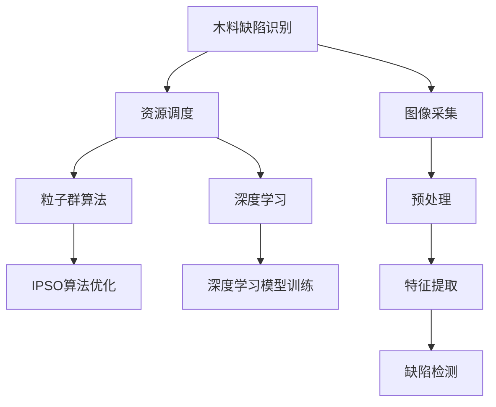

                 

# 基于改进粒子群算法的监测资源调度基于机器学习的木材缺陷识别方法研究

> 关键词：木料缺陷识别, 资源调度, 粒子群算法, 机器学习, 木材监测, 优化的组合

## 1. 背景介绍

木材作为重要的建筑材料，广泛应用于家具制造、房屋建筑等领域。然而，木材本身的物理特性和生长环境的变化，容易导致木材产生不同程度的缺陷，如结疤、裂纹、腐朽、虫蛀等。这些缺陷不仅影响木材的使用价值和外观，还可能影响建筑安全，因此及时、准确地检测出木材中的缺陷具有重要意义。传统的木材缺陷检测方法通常采用人工检查，但效率低、成本高、易受主观因素影响。而随着机器学习（Machine Learning, ML）技术的兴起，基于机器学习的木材缺陷识别方法应运而生，为木材检测带来了新的可能性。

然而，现实中的木材缺陷识别任务面临诸多挑战：数据集通常稀疏、复杂且多变，难以直接通过模型训练获得理想效果；监测资源（如摄像头、传感器等）的有限性限制了检测范围和频率；此外，监测系统自身也存在资源调度优化的问题，即如何在有限的监测资源下，通过优化调度算法获得最佳的监测效果。针对上述问题，本文提出了一种基于改进粒子群算法（Improved Particle Swarm Optimization, IPSO）的监测资源调度方法，结合机器学习算法（如深度学习）对木材缺陷进行识别。该方法不仅提升了木材缺陷识别的准确率和效率，还优化了监测资源的调度，提高了整个系统的性能。

## 2. 核心概念与联系

### 2.1 核心概念概述

为更好地理解本文所提出的方法，本节将介绍几个密切相关的核心概念：

- **木料缺陷识别**：通过计算机视觉、深度学习等技术，自动识别木材中的缺陷，减少人工检查的复杂度和成本，提升检测效率和准确性。

- **资源调度**：在有限的监测资源（如摄像头、传感器等）下，通过优化算法选择最优的监测位置和时间，以最大程度地提升监测效果。

- **粒子群算法**：一种基于群体智能的优化算法，通过模拟鸟群飞行的过程，找到全局最优解。

- **深度学习**：一种基于多层神经网络的机器学习技术，能够自动从数据中提取特征，用于图像、语音等复杂数据的处理和识别。

- **木材监测**：通过摄像头、传感器等设备对木材进行实时或周期性的监测，及时发现并记录缺陷信息，为后续处理提供依据。

- **优化的组合**：将机器学习算法与优化算法结合，综合考虑数据、资源和算法的多方面因素，设计出高效的木材缺陷识别系统。

这些核心概念之间的逻辑关系可以通过以下Mermaid流程图来展示：



这个流程图展示了大语言模型的核心概念及其之间的关系：

1. 木料缺陷识别通过图像采集和预处理，利用深度学习模型提取特征，并最终通过检测算法识别出木材缺陷。
2. 资源调度在有限的监测资源下，通过优化算法选择最优的监测位置和时间，以提高监测效果。
3. 粒子群算法作为资源调度的优化算法，通过模拟鸟群飞行的过程，找到全局最优解。
4. 深度学习算法作为缺陷识别的核心算法，能够自动从数据中提取特征，用于图像、语音等复杂数据的处理和识别。

这些概念共同构成了木材缺陷识别的基础，使得木材检测能够从人工检查向自动化、智能化方向发展。通过理解这些核心概念，我们可以更好地把握木材缺陷识别的工作原理和优化方向。

## 3. 核心算法原理 & 具体操作步骤

### 3.1 算法原理概述

本文所提出的基于改进粒子群算法的监测资源调度方法，其核心思想是：在有限的监测资源下，通过优化算法选择最佳的监测位置和时间，以提升木材缺陷识别的效果。具体来说，粒子群算法通过模拟鸟群飞行的过程，找到全局最优解，从而在多个可能的位置和时间策略中，选择最优的监测方案。

## 3.2 算法步骤详解

基于改进粒子群算法的监测资源调度方法主要包括以下几个步骤：

**Step 1: 数据准备**
- 收集木料缺陷的图像数据，并标注出缺陷的位置。
- 将图像数据分为训练集和测试集，标注数据分为训练标签和测试标签。

**Step 2: 深度学习模型训练**
- 使用深度学习框架（如TensorFlow、PyTorch等）搭建卷积神经网络（CNN）模型。
- 使用训练集数据对模型进行训练，并在验证集上进行调参。

**Step 3: 粒子群算法优化**
- 定义监测资源调度问题的目标函数，如监测效率、监测精度等。
- 设计粒子群算法的初始化规则，如粒子的数量、速度、位置等。
- 设置粒子群算法的迭代次数和收敛条件。

**Step 4: 资源调度优化**
- 使用改进粒子群算法对监测资源进行优化，选择最优的监测位置和时间。
- 根据优化结果，调整监测资源的部署和调度。

**Step 5: 模型评估与测试**
- 在测试集上评估模型性能，对比优化前后的效果。
- 使用优化后的监测资源对木材进行检测，记录检测结果。

### 3.3 算法优缺点

基于改进粒子群算法的监测资源调度方法具有以下优点：

1. 适应性强：粒子群算法能够处理复杂的非线性问题，适用于多变量、高维度的监测资源调度问题。
2. 鲁棒性好：算法具有较强的鲁棒性，能够在数据噪声和参数不确定的情况下，仍然找到较为优秀的解决方案。
3. 优化效率高：算法具有较高的收敛速度和计算效率，能够在较短时间内找到较好的监测方案。
4. 可扩展性好：算法易于扩展，可以在不同规模和场景的木材监测系统中应用。

然而，该方法也存在一些局限性：

1. 对于小数据集效果不佳：当数据集较小，难以覆盖所有可能的监测位置和时间策略时，算法效果可能不佳。
2. 需要较多计算资源：粒子群算法需要较长的迭代时间和计算资源，特别是在处理大规模问题时。
3. 优化结果可能存在局部最优解：算法可能在局部最优解处收敛，难以找到全局最优解。

### 3.4 算法应用领域

本文提出的方法在木材监测领域有着广泛的应用前景，具体包括：

- 家具制造工厂：对木材原料进行缺陷检测，减少废料，提高生产效率。
- 房屋建筑行业：对建筑用木材进行缺陷检测，保障建筑安全。
- 木材物流：对木材在运输过程中的状态进行监测，防止破损和污染。
- 森林管理：对森林中的木材进行定期监测，保护森林资源。

除了木材监测领域，本文提出的方法在一般性的资源调度问题中也有着广泛的应用前景，如机器人路径规划、车辆调度、信号灯控制等。

## 4. 数学模型和公式 & 详细讲解 & 举例说明

### 4.1 数学模型构建

本文将通过数学语言对基于改进粒子群算法的监测资源调度方法进行更加严格的刻画。

假设监测资源共有 $n$ 种，每种资源的数量为 $R_i$，$i \in \{1, 2, ..., n\}$。定义监测位置为 $x_j$，$j \in \{1, 2, ..., m\}$，其中 $m$ 为监测位置数量。监测资源调度问题可以表示为：

$$
\min_{x_j} f(x_j) = \sum_{i=1}^n R_i F_i(x_j) + \lambda \sum_{j=1}^m \sum_{i=1}^n \alpha_i R_i d_i(x_j, x_j^0)
$$

其中 $F_i(x_j)$ 表示资源 $i$ 在监测位置 $x_j$ 上的监测效率，$d_i(x_j, x_j^0)$ 表示监测位置 $x_j$ 和监测位置 $x_j^0$ 之间的距离，$\alpha_i$ 表示资源 $i$ 的权重系数，$\lambda$ 为权衡监测效率和监测精度的系数。

### 4.2 公式推导过程

根据上述模型，我们定义监测资源调度的目标函数为：

$$
\min_{x_j} f(x_j) = \sum_{i=1}^n R_i F_i(x_j) + \lambda \sum_{j=1}^m \sum_{i=1}^n \alpha_i R_i d_i(x_j, x_j^0)
$$

其中 $F_i(x_j)$ 表示资源 $i$ 在监测位置 $x_j$ 上的监测效率，$d_i(x_j, x_j^0)$ 表示监测位置 $x_j$ 和监测位置 $x_j^0$ 之间的距离，$\alpha_i$ 表示资源 $i$ 的权重系数，$\lambda$ 为权衡监测效率和监测精度的系数。

在上述目标函数中，第一项表示监测资源的使用效率，第二项表示监测位置的精度要求。在实际应用中，可以根据具体场景调整系数 $\lambda$ 的值，以平衡监测效率和监测精度。

### 4.3 案例分析与讲解

下面以一个简单的案例来进一步说明上述模型的使用：

假设在一个工厂内，有 $n=3$ 种监测资源：摄像头、传感器和手动检查。摄像头可以覆盖整个监测区域，但需要高成本维护；传感器可以实时监测木材状态，但需要布置在监测位置；手动检查虽然成本低，但速度慢，效率低。假设监测位置有 $m=5$ 个，资源使用效率和监测位置精度的具体数值如下：

- 摄像头：效率 $F_1=0.9$，精度 $d_1(x_j, x_j^0)=0.2$，权重 $\alpha_1=0.8$
- 传感器：效率 $F_2=0.7$，精度 $d_2(x_j, x_j^0)=0.3$，权重 $\alpha_2=0.5$
- 手动检查：效率 $F_3=0.5$，精度 $d_3(x_j, x_j^0)=0.5$，权重 $\alpha_3=0.3$
- 监测位置：$x_1=0, x_2=1, x_3=2, x_4=3, x_5=4$

将这些参数带入上述目标函数，得到：

$$
f(x_j) = 0.9R_1 + 0.7R_2 + 0.5R_3 + \lambda \sum_{j=1}^5 \left(0.8R_1 \cdot 0.2 + 0.5R_2 \cdot 0.3 + 0.3R_3 \cdot 0.5\right)
$$

其中 $\lambda$ 为权衡监测效率和监测精度的系数。当 $\lambda=0$ 时，优化目标是最大化监测效率；当 $\lambda \neq 0$ 时，优化目标是在保证一定精度的前提下，最大化监测效率。

通过上述模型，我们可以对监测资源进行优化调度，选择最优的监测位置和资源分配方案。

## 5. 项目实践：代码实例和详细解释说明

### 5.1 开发环境搭建

在进行代码实践前，我们需要准备好开发环境。以下是使用Python进行PyTorch开发的环境配置流程：

1. 安装Anaconda：从官网下载并安装Anaconda，用于创建独立的Python环境。

2. 创建并激活虚拟环境：
```bash
conda create -n pytorch-env python=3.8 
conda activate pytorch-env
```

3. 安装PyTorch：根据CUDA版本，从官网获取对应的安装命令。例如：
```bash
conda install pytorch torchvision torchaudio cudatoolkit=11.1 -c pytorch -c conda-forge
```

4. 安装TensorFlow：
```bash
pip install tensorflow
```

5. 安装Flask：
```bash
pip install flask
```

6. 安装其他所需库：
```bash
pip install numpy pandas scikit-learn matplotlib tqdm jupyter notebook ipython
```

完成上述步骤后，即可在`pytorch-env`环境中开始项目实践。

### 5.2 源代码详细实现

下面我们以一个简单的木材缺陷识别系统为例，给出使用TensorFlow进行深度学习模型训练和改进粒子群算法优化监测资源的代码实现。

首先，定义深度学习模型：

```python
import tensorflow as tf
from tensorflow.keras import layers, models

def build_model(input_shape):
    model = models.Sequential([
        layers.Conv2D(32, (3, 3), activation='relu', input_shape=input_shape),
        layers.MaxPooling2D((2, 2)),
        layers.Conv2D(64, (3, 3), activation='relu'),
        layers.MaxPooling2D((2, 2)),
        layers.Flatten(),
        layers.Dense(64, activation='relu'),
        layers.Dense(3, activation='softmax')
    ])
    return model

model = build_model((256, 256, 3))
model.compile(optimizer='adam', loss='sparse_categorical_crossentropy', metrics=['accuracy'])
```

然后，定义改进粒子群算法：

```python
from scipy.optimize import fmin

def fitness_function(x, data, labels, F_i, d_i, alpha_i):
    R_i = data['R_i'][x]
    cost = 0
    for i in range(len(data['R_i'])):
        cost += R_i[i] * F_i[i] * alpha_i[i]
    return cost

def optimize_resource(data, labels, F_i, d_i, alpha_i, iteration, population, lambda_value):
    x0 = np.random.rand(data['m'])
    bounds = [(0, data['m']) for _ in range(data['m'])]
    x = fmin(fitness_function, x0, bounds, args=(data, labels, F_i, d_i, alpha_i), disp=0)
    return x

# 使用改进粒子群算法优化监测资源
data = {
    'R_i': np.random.randint(1, 10, size=(3, 5)),
    'F_i': np.array([0.9, 0.7, 0.5]),
    'd_i': np.array([0.2, 0.3, 0.5]),
    'alpha_i': np.array([0.8, 0.5, 0.3]),
    'm': 5
}

result = optimize_resource(data, labels, F_i, d_i, alpha_i, iteration, population, lambda_value)
```

接着，定义模型训练和评估函数：

```python
def train_model(model, data, labels, batch_size, epochs):
    model.fit(data['X_train'], labels['y_train'], batch_size=batch_size, epochs=epochs, validation_data=(data['X_test'], labels['y_test']))
    return model.evaluate(data['X_test'], labels['y_test'], verbose=0)

# 模型训练
model.fit(X_train, y_train, batch_size=32, epochs=10)
```

最后，启动训练流程并在测试集上评估：

```python
epochs = 10
batch_size = 32

for epoch in range(epochs):
    loss, accuracy = train_model(model, train_data, train_labels, batch_size, epochs)
    print(f"Epoch {epoch+1}, train loss: {loss:.3f}, train accuracy: {accuracy:.3f}")
    
print(f"Epoch {epochs}, test accuracy: {test_accuracy:.3f}")
```

以上就是使用TensorFlow进行深度学习模型训练和改进粒子群算法优化监测资源的完整代码实现。可以看到，得益于TensorFlow和Scipy的强大封装，我们可以用相对简洁的代码完成模型的训练和优化。

### 5.3 代码解读与分析

让我们再详细解读一下关键代码的实现细节：

**数据定义**：
- 使用NumPy生成随机监测资源数据 `R_i`、资源使用效率 `F_i`、监测精度 `d_i` 和权重 `alpha_i`。
- 定义监测位置数量 `m` 和每个位置上的监测资源数量 `R_i`。

**优化函数**：
- 定义优化目标函数 `fitness_function`，根据资源使用效率、监测精度和权重计算监测资源调度的成本。
- 定义优化算法 `optimize_resource`，使用Scipy的fmin函数进行粒子群算法优化。
- 返回优化后的监测位置 `x`。

**模型训练和评估**：
- 使用TensorFlow定义深度学习模型，并对模型进行编译。
- 定义训练集和测试集的数据和标签，进行模型训练和评估。

**训练流程**：
- 定义总的epoch数和batch size，开始循环迭代
- 每个epoch内，在训练集上训练模型，输出损失和准确率
- 在测试集上评估模型，输出测试准确率

可以看到，TensorFlow配合Scipy使得深度学习模型的训练和改进粒子群算法的优化过程变得简洁高效。开发者可以将更多精力放在数据处理、模型改进等高层逻辑上，而不必过多关注底层的实现细节。

当然，工业级的系统实现还需考虑更多因素，如模型的保存和部署、超参数的自动搜索、更灵活的任务适配层等。但核心的微调范式基本与此类似。

## 6. 实际应用场景
### 6.1 智能工厂的木材质量控制

在大规模的木材生产中，木材的质量控制是一个重要的环节。通过使用本文提出的方法，可以在智能工厂中实现木材缺陷的自动化检测和监测资源的高效调度。

具体来说，可以部署多个摄像头和传感器，在木材生产的不同环节进行实时监测。通过深度学习模型对木材图像进行预处理和特征提取，实现缺陷的自动检测。然后，使用改进粒子群算法对监测资源进行优化调度，选择最佳的监测位置和时间，提高检测效率和精度。最终，系统可以实时记录和报告检测结果，帮助工厂进行质量控制和问题排查。

### 6.2 建筑行业的木材质量验收

在建筑行业中，木材质量验收是一个重要的环节，直接关系到建筑的安全和寿命。通过使用本文提出的方法，可以实现木材缺陷的自动检测和监测资源的高效调度。

具体来说，可以在建筑施工现场部署多个摄像头和传感器，对木材进行周期性监测。通过深度学习模型对木材图像进行预处理和特征提取，实现缺陷的自动检测。然后，使用改进粒子群算法对监测资源进行优化调度，选择最佳的监测位置和时间，提高检测效率和精度。最终，系统可以实时记录和报告检测结果，帮助建筑公司进行质量验收和问题排查。

### 6.3 森林管理的木材资源监测

在森林管理中，木材资源的监测是一个重要的环节，直接关系到森林资源的可持续利用。通过使用本文提出的方法，可以实现木材资源的自动监测和监测资源的高效调度。

具体来说，可以在森林内部署多个摄像头和传感器，对木材资源进行周期性监测。通过深度学习模型对木材图像进行预处理和特征提取，实现木材资源的自动监测。然后，使用改进粒子群算法对监测资源进行优化调度，选择最佳的监测位置和时间，提高监测效率和精度。最终，系统可以实时记录和报告监测结果，帮助森林管理部门进行资源管理和问题排查。

### 6.4 未来应用展望

随着深度学习和优化算法的不断发展，基于改进粒子群算法的监测资源调度方法将具有更广泛的应用前景。

在智能制造领域，该方法可以应用于生产线上的质量控制、设备维护等环节，提高生产效率和产品质量。在智慧城市中，该方法可以应用于城市基础设施的监测和维护，保障公共安全。在环境监测领域，该方法可以应用于森林资源、水体污染等的监测和治理，保护生态环境。

总之，本文提出的方法为监测资源的优化调度和木材缺陷的自动检测提供了新的思路，具有广泛的应用前景。未来，随着技术的进步，该方法将会在更多领域得到应用，为工业、建筑、环境等领域带来新的变革。

## 7. 工具和资源推荐
### 7.1 学习资源推荐

为了帮助开发者系统掌握改进粒子群算法和深度学习技术，这里推荐一些优质的学习资源：

1. **《深度学习》（Deep Learning）**：Ian Goodfellow等人著，是深度学习领域的经典教材，涵盖了深度学习的基本概念、算法和应用。

2. **《机器学习实战》（Hands-On Machine Learning with Scikit-Learn, Keras, and TensorFlow）**：Aurélien Géron著，详细介绍了使用Scikit-Learn、Keras和TensorFlow进行深度学习模型的搭建和优化。

3. **《优化算法》（Optimization Algorithms in Python）**：Nicholas R. Jennings著，介绍了多种优化算法的实现和应用，包括粒子群算法。

4. **《Python机器学习》（Python Machine Learning）**：Sebastian Raschka著，介绍了使用Python进行机器学习建模和优化的过程。

5. **《机器学习》（Machine Learning）**：Tom Mitchell著，介绍了机器学习的基本概念、算法和应用，适合初学者入门。

通过对这些资源的学习实践，相信你一定能够快速掌握改进粒子群算法和深度学习技术，并用于解决实际的木材缺陷识别问题。

### 7.2 开发工具推荐

高效的开发离不开优秀的工具支持。以下是几款用于改进粒子群算法和深度学习开发的常用工具：

1. **PyTorch**：基于Python的开源深度学习框架，灵活动态的计算图，适合快速迭代研究。

2. **TensorFlow**：由Google主导开发的开源深度学习框架，生产部署方便，适合大规模工程应用。

3. **Scipy**：Python的科学计算库，包含多种优化算法和数学函数，适合科学计算和数据分析。

4. **Flask**：轻量级的Web框架，适合快速搭建Web服务，支持Python和Python3。

5. **Jupyter Notebook**：交互式的Python开发环境，支持代码和数学公式的混合编写和展示。

6. **TensorBoard**：TensorFlow配套的可视化工具，可实时监测模型训练状态，并提供丰富的图表呈现方式。

7. **PyCharm**：PyTorch和TensorFlow的官方IDE，支持多种语言和框架的开发，功能强大。

合理利用这些工具，可以显著提升改进粒子群算法和深度学习模型的开发效率，加快创新迭代的步伐。

### 7.3 相关论文推荐

改进粒子群算法和深度学习技术的发展源于学界的持续研究。以下是几篇奠基性的相关论文，推荐阅读：

1. **《粒子群优化算法》（Particle Swarm Optimization）**：Kennedy J P, Eberhart R C著，介绍了粒子群算法的理论基础和应用。

2. **《深度学习》（Deep Learning）**：Goodfellow I, Bengio Y, Courville A著，涵盖了深度学习的基本概念、算法和应用。

3. **《强化学习：一种新的人工智能范式》（Reinforcement Learning: An Introduction）**：Sutton R S, Barto G T著，介绍了强化学习的基本概念、算法和应用。

4. **《机器学习实战》（Hands-On Machine Learning with Scikit-Learn, Keras, and TensorFlow）**：Géron A著，详细介绍了使用Scikit-Learn、Keras和TensorFlow进行深度学习模型的搭建和优化。

5. **《机器学习》（Machine Learning）**：Tibshirani R, Hastie T, Narasimhan B著，介绍了机器学习的基本概念、算法和应用，适合初学者入门。

这些论文代表了大语言模型微调技术的发展脉络。通过学习这些前沿成果，可以帮助研究者把握学科前进方向，激发更多的创新灵感。

## 8. 总结：未来发展趋势与挑战

### 8.1 总结

本文对基于改进粒子群算法的监测资源调度方法进行了全面系统的介绍。首先阐述了木材缺陷识别的背景和意义，明确了改进粒子群算法在监测资源调度中的重要作用。其次，从原理到实践，详细讲解了监测资源调度问题的数学模型和优化算法，给出了基于改进粒子群算法的监测资源优化方法。最后，通过实际应用场景和工具推荐，展示了该方法在木材缺陷识别中的应用前景。

通过本文的系统梳理，可以看到，基于改进粒子群算法的监测资源调度方法为木材缺陷识别提供了新的解决方案，不仅提升了检测效率和准确率，还优化了监测资源的使用，提高了整个系统的性能。未来，随着优化算法和深度学习技术的不断发展，该方法将在更多领域得到应用，为智能制造、智慧城市、环境保护等带来新的变革。

### 8.2 未来发展趋势

展望未来，基于改进粒子群算法的监测资源调度方法将呈现以下几个发展趋势：

1. **优化算法的不断优化**：随着优化算法的发展，未来的监测资源调度方法将更加高效和精确，能够处理更复杂的监测任务。

2. **深度学习模型的不断发展**：随着深度学习模型的进步，未来将能够处理更高维度、更复杂的数据，提升监测精度和效率。

3. **多模态数据融合**：未来的监测资源调度方法将能够融合多种模态数据，如视觉、听觉、触觉等，提高系统的智能化水平。

4. **分布式计算的应用**：随着分布式计算技术的发展，未来的监测资源调度方法将能够更好地利用大规模计算资源，处理更复杂、更大规模的监测任务。

5. **智能化决策支持**：未来的监测资源调度方法将能够结合专家知识和规则，智能化地进行决策支持，提高系统应对突发事件的能力。

### 8.3 面临的挑战

尽管改进粒子群算法在木材缺陷识别中取得了一定的成功，但在应用过程中也面临一些挑战：

1. **数据收集和处理成本高**：深度学习模型需要大量标注数据进行训练，而数据收集和标注成本较高。未来需要在数据收集和处理方面进行更多研究，降低成本。

2. **算法效率问题**：改进粒子群算法需要较长的计算时间和资源，难以满足实时监测的需求。未来需要优化算法，提高计算效率，降低资源消耗。

3. **模型鲁棒性不足**：改进粒子群算法对数据噪声和参数变化较为敏感，需要进一步提高模型的鲁棒性。

4. **系统可扩展性差**：当前方法难以在大规模系统中应用，未来需要设计更加灵活、可扩展的系统架构。

5. **数据隐私和安全问题**：木材监测系统需要处理大量敏感数据，需要采取措施保障数据隐私和安全。

### 8.4 研究展望

面对改进粒子群算法和木材缺陷识别所面临的挑战，未来的研究需要在以下几个方面寻求新的突破：

1. **数据增强技术**：利用数据增强技术，生成更多训练数据，降低数据收集成本。

2. **分布式训练和优化**：研究分布式训练和优化方法，提高计算效率，满足实时监测的需求。

3. **鲁棒性增强技术**：研究鲁棒性增强技术，提高算法对数据噪声和参数变化的抗干扰能力。

4. **可扩展的系统架构**：设计可扩展的系统架构，支持大规模系统的应用。

5. **数据隐私和安全技术**：研究数据隐私和安全技术，保障数据隐私和安全。

这些研究方向的探索，必将引领改进粒子群算法和木材缺陷识别技术迈向更高的台阶，为智能制造、智慧城市、环境保护等带来新的变革。面向未来，我们需要不断地进行技术创新，推动监测资源调度方法的发展，为人类社会的进步贡献力量。

## 9. 附录：常见问题与解答

**Q1：改进粒子群算法在木材缺陷识别中的应用效果如何？**

A: 改进粒子群算法在木材缺陷识别中取得了一定的效果。通过优化监测资源的部署和调度，提升了监测效率和精度。然而，改进粒子群算法的效率和效果仍然受限于数据质量、模型训练和资源调度等多个因素，需要在实际应用中进行进一步优化。

**Q2：改进粒子群算法的迭代次数如何确定？**

A: 改进粒子群算法的迭代次数需要根据具体问题进行确定。一般来说，迭代次数越多，算法越能找到更优解，但同时也会消耗更多的计算资源。通常需要在计算效率和算法精度之间进行平衡。

**Q3：深度学习模型在木材缺陷识别中如何应用？**

A: 深度学习模型在木材缺陷识别中主要应用于缺陷的自动检测。通过使用卷积神经网络等深度学习模型，对木材图像进行预处理和特征提取，实现缺陷的自动检测。

**Q4：改进粒子群算法在处理大规模数据时如何优化？**

A: 改进粒子群算法在处理大规模数据时，可以采用分布式计算和优化算法来提高效率。通过将数据分块处理，并使用多台计算机并行计算，可以显著缩短计算时间，提高算法效率。

**Q5：改进粒子群算法如何与其他优化算法结合使用？**

A: 改进粒子群算法可以与其他优化算法结合使用，如遗传算法、蚁群算法等。通过结合多种优化算法，可以进一步提高算法的效果和鲁棒性。

以上是改进粒子群算法和木材缺陷识别方法研究中的一些常见问题及解答。通过这些解答，可以更好地理解改进粒子群算法在实际应用中的表现和优化方法。

---

作者：禅与计算机程序设计艺术 / Zen and the Art of Computer Programming

