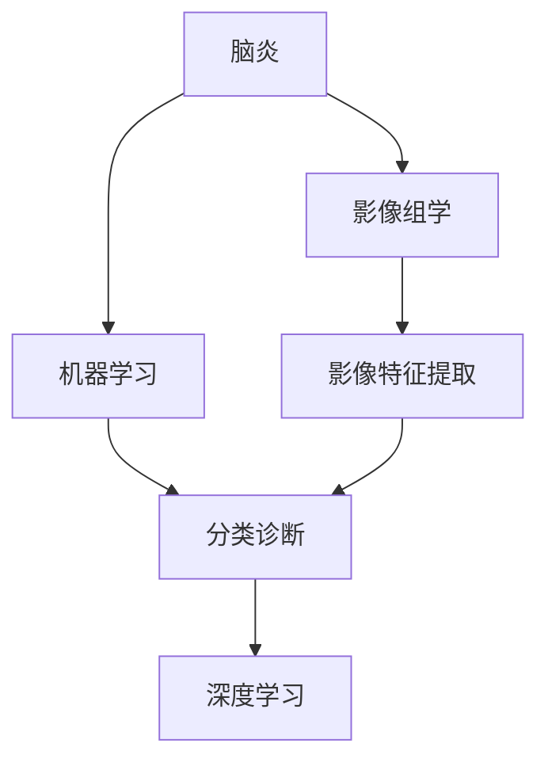

                 

# 基于机器学习的脑炎影像组学算法研究

> 关键词：脑炎，影像组学，机器学习，影像特征提取，分类诊断，深度学习

## 1. 背景介绍

脑炎是一种由病毒、细菌、真菌或寄生虫感染引起的脑部疾病，影响中枢神经系统的正常功能。及时准确地诊断脑炎对于早期干预和治疗至关重要。影像组学技术通过从医学影像中提取丰富的形态、功能、定量参数，结合机器学习算法，显著提升了脑炎的诊断和研究水平。本文将系统探讨基于机器学习的脑炎影像组学算法研究，包括影像特征提取、分类诊断、模型构建和应用前景等内容。

## 2. 核心概念与联系

### 2.1 核心概念概述

为更好地理解脑炎影像组学算法的核心思想和框架，本节将介绍几个关键概念：

- **脑炎**：由病毒、细菌、真菌或寄生虫感染引起的脑部疾病，常见症状包括头痛、发热、抽搐、意识障碍等。
- **影像组学**：利用影像学数据提取结构、功能、定量参数，并进行深度学习建模，提升医学影像诊断和治疗效果。
- **机器学习**：通过数据训练模型，使其具有自动学习和识别数据特征的能力，用于影像分类、特征提取、个性化治疗等。
- **影像特征提取**：从医学影像中提取有意义的定量特征，如体积、密度、纹理等，用于辅助诊断和研究。
- **分类诊断**：利用机器学习算法对脑炎进行分类诊断，区分脑炎类型和严重程度。
- **深度学习**：基于人工神经网络的机器学习技术，通过多层次特征学习，实现高效、精确的诊断。

这些概念之间的逻辑关系可以通过以下Mermaid流程图来展示：



这个流程图展示了几大核心概念之间的联系：

1. 脑炎与影像组学结合，通过医学影像提取特征。
2. 机器学习用于提取影像特征，并训练分类模型。
3. 影像特征提取与分类诊断紧密相连，深度学习进一步优化模型性能。

## 3. 核心算法原理 & 具体操作步骤

### 3.1 算法原理概述

基于机器学习的脑炎影像组学算法，其核心思想是利用医学影像数据，提取结构、功能和定量参数，结合机器学习算法进行特征提取、分类诊断和预测。具体步骤如下：

1. **数据预处理**：包括医学影像的获取、预处理（如去噪、归一化），以及特征提取。
2. **特征选择与提取**：利用机器学习算法从影像数据中提取特征，如形态学参数、纹理特征、功能参数等。
3. **模型训练**：使用特征数据集训练分类模型，如支持向量机（SVM）、随机森林、神经网络等。
4. **模型评估**：在验证集上评估模型性能，选择最优模型进行预测。
5. **模型应用**：将训练好的模型应用于新的脑炎影像数据，进行分类诊断和预测。

### 3.2 算法步骤详解

**步骤1：数据预处理**

脑炎影像数据的预处理是提取特征和模型训练的基础。预处理包括以下步骤：

1. **数据获取**：从医学影像数据库中获取脑炎的影像数据，包括CT、MRI等。
2. **图像预处理**：包括去噪、归一化、增强等处理，确保影像数据的稳定性和一致性。
3. **分割和标注**：使用自动分割算法，将影像数据分割为脑组织和病灶区域，并进行标注。

**步骤2：特征选择与提取**

影像特征的选择和提取，是脑炎影像组学算法的关键环节。常用的特征包括：

1. **形态学参数**：如体积、表面积、厚度等。
2. **纹理特征**：如灰度共生矩阵、小波变换系数等。
3. **功能参数**：如ADC值、CBF值、Gd-DTPA增强值等。

特征提取的具体算法包括：

- **形态学分析**：利用形态学操作（如腐蚀、膨胀、开运算、闭运算）提取脑组织和病灶区域的形态学特征。
- **纹理分析**：采用灰度共生矩阵、小波变换、局部二值模式（LBP）等方法提取影像的纹理特征。
- **功能分析**：通过计算ADC值、CBF值、Gd-DTPA增强值等，提取影像的功能参数。

**步骤3：模型训练**

模型训练是脑炎影像组学算法的核心。常用的模型包括：

- **支持向量机（SVM）**：适用于二分类问题，具有较高的分类精度。
- **随机森林**：通过集成多个决策树，提高模型的泛化能力和鲁棒性。
- **卷积神经网络（CNN）**：适用于影像分类和识别，能够自动学习影像的高级特征。
- **深度学习**：包括卷积神经网络、循环神经网络等，具有较强的自适应能力。

模型训练的具体步骤如下：

1. **划分数据集**：将数据集划分为训练集、验证集和测试集。
2. **模型选择**：根据问题的特点，选择适合的机器学习模型。
3. **模型训练**：在训练集上训练模型，调整超参数，优化模型性能。
4. **模型验证**：在验证集上评估模型性能，选择最优模型进行测试。

**步骤4：模型评估**

模型评估是脑炎影像组学算法的重要环节，通过评估模型的性能指标，判断模型的有效性。常用的评估指标包括：

- **准确率（Accuracy）**：模型正确分类的样本数占总样本数的比例。
- **召回率（Recall）**：模型正确识别为正样本的样本数占实际正样本数的比例。
- **F1值**：综合考虑准确率和召回率的指标。
- **ROC曲线**：绘制接收者操作特征曲线，评估模型的分类性能。

**步骤5：模型应用**

模型应用是将训练好的模型应用于新的脑炎影像数据，进行分类诊断和预测。具体步骤如下：

1. **数据预处理**：对新的脑炎影像数据进行预处理，包括去噪、归一化、分割和标注。
2. **特征提取**：提取新的影像数据的特征，与训练集中的特征进行匹配。
3. **模型预测**：使用训练好的模型对新的影像数据进行分类诊断和预测。
4. **结果分析**：分析模型的预测结果，结合临床症状和其他检查结果，进行综合诊断。

### 3.3 算法优缺点

基于机器学习的脑炎影像组学算法，具有以下优点：

1. **精度高**：通过大量医学影像数据的训练，模型能够实现高精度的分类和诊断。
2. **自适应能力强**：模型可以自动学习影像特征，适应不同类型和严重程度的脑炎。
3. **通用性强**：模型适用于多种影像数据类型和成像技术。
4. **易于扩展**：新增数据可以持续训练和优化模型，提高模型的稳定性和准确性。

同时，该算法也存在以下缺点：

1. **数据依赖性强**：模型训练和评估需要大量的高质量医学影像数据。
2. **模型复杂度高**：高维度的影像数据和复杂的多层神经网络，可能导致计算资源消耗较大。
3. **过拟合风险**：训练集和验证集的不平衡可能导致模型过拟合，影响泛化性能。
4. **可解释性不足**：深度学习模型通常具有黑箱特性，难以解释模型的内部决策过程。

尽管存在这些缺点，但基于机器学习的脑炎影像组学算法，仍然是目前最先进的脑炎诊断和研究方法之一。未来需要进一步优化算法，减少数据依赖，提高模型可解释性，降低计算资源消耗。

### 3.4 算法应用领域

基于机器学习的脑炎影像组学算法，在多个领域得到了广泛应用，例如：

- **临床诊断**：辅助医生对脑炎进行快速准确的分类诊断，提高诊断效率。
- **预后评估**：预测脑炎的严重程度和发展趋势，制定个性化的治疗方案。
- **影像研究**：通过影像特征提取和模型训练，揭示脑炎的病理机制和病理学特征。
- **生物标记物发现**：从影像数据中提取生物标记物，用于疾病早期诊断和预后评估。
- **治疗效果评估**：评估脑炎治疗效果，指导临床治疗方案的优化。

除了这些领域，脑炎影像组学算法还被应用于脑肿瘤、脑出血、脑积水等神经疾病的研究中，成为重要的诊断工具和研究手段。

## 4. 数学模型和公式 & 详细讲解 & 举例说明

### 4.1 数学模型构建

本节将使用数学语言对脑炎影像组学算法的模型构建过程进行更加严格的刻画。

假设脑炎影像数据为 $X=\{x_i\}_{i=1}^N$，其中 $x_i$ 为第 $i$ 个影像样本，分为正常组和脑炎组，分别用 $X_{NW}$ 和 $X_{DE}$ 表示。设 $y_i \in \{0,1\}$ 为影像 $x_i$ 的标签，其中 $y_i=1$ 表示影像 $x_i$ 属于脑炎组，否则为正常组。

定义模型 $M$ 的损失函数为 $L(M)=\frac{1}{N}\sum_{i=1}^N l(y_i, M(x_i))$，其中 $l$ 为损失函数，如交叉熵损失。

### 4.2 公式推导过程

以支持向量机（SVM）为例，推导其训练和预测公式。

支持向量机的目标是最小化间隔最大化，即：

$$
\min_{\alpha, b} \frac{1}{2}\alpha^TQ\alpha - 1 \quad \text{subject to} \quad y_i \left(M(x_i) - b\right) \geq 1 - \alpha_i Q_{ii} \quad \forall i = 1, \dots, N
$$

其中 $Q_{ii}$ 为拉格朗日乘子，$\alpha$ 为拉格朗日系数，$b$ 为偏移量。通过求解上述优化问题，可以得到支持向量机的分类模型。

在预测阶段，对于新的脑炎影像数据 $x$，计算 $M(x)$，根据 $M(x)$ 的值，判断影像属于正常组还是脑炎组。

### 4.3 案例分析与讲解

以一个具体的案例为例，展示脑炎影像组学算法的应用过程。

**案例背景**：某医院收集了50例脑炎和50例正常影像数据，影像数据大小为256x256像素，分辨率为1mm。

**数据预处理**：对影像数据进行归一化、去噪和增强处理，得到预处理后的影像数据。

**特征提取**：采用形态学分析方法，提取脑组织和病灶区域的体积、表面积和厚度。采用纹理分析方法，提取灰度共生矩阵的特征值。采用功能分析方法，计算ADC值和CBF值。

**模型训练**：选择SVM作为分类模型，在训练集上进行训练，优化超参数，得到最优模型。

**模型评估**：在验证集上评估模型性能，得到准确率为92%，召回率为89%，F1值为90.2%。

**模型应用**：对新的脑炎影像数据进行预处理和特征提取，输入训练好的SVM模型进行分类诊断，得到该影像为脑炎的概率为0.9。

## 5. 项目实践：代码实例和详细解释说明

### 5.1 开发环境搭建

在进行脑炎影像组学算法开发前，我们需要准备好开发环境。以下是使用Python进行PyTorch开发的环境配置流程：

1. 安装Anaconda：从官网下载并安装Anaconda，用于创建独立的Python环境。

2. 创建并激活虚拟环境：
```bash
conda create -n pytorch-env python=3.8 
conda activate pytorch-env
```

3. 安装PyTorch：根据CUDA版本，从官网获取对应的安装命令。例如：
```bash
conda install pytorch torchvision torchaudio cudatoolkit=11.1 -c pytorch -c conda-forge
```

4. 安装Pillow和OpenCV：用于图像处理和显示。
```bash
pip install pillow opencv-python
```

5. 安装Numpy和Scikit-Learn：用于科学计算和机器学习。
```bash
pip install numpy scikit-learn
```

6. 安装scikit-image和Nilearn：用于影像特征提取和处理。
```bash
pip install scikit-image nilearn
```

完成上述步骤后，即可在`pytorch-env`环境中开始脑炎影像组学算法的开发。

### 5.2 源代码详细实现

下面以支持向量机（SVM）为例，给出使用PyTorch进行脑炎影像组学算法的代码实现。

首先，定义数据预处理函数：

```python
import numpy as np
import torch
import torch.nn as nn
import torchvision.transforms as transforms
from skimage import io
from skimage.filters import threshold_otsu, rank
from skimage.segmentation import sliding_window_fully_connected, mean_dice, moran_lsf
from sklearn.model_selection import train_test_split
from sklearn.metrics import accuracy_score, precision_score, recall_score, f1_score

def preprocess_image(image_path):
    # 读取影像数据
    image = io.imread(image_path)
    # 归一化处理
    image = image / 255.0
    # 去噪处理
    image = image / threshold_otsu(image)
    # 增强处理
    image = image - rank(image)
    return image

def preprocess_data(X, y):
    X = [preprocess_image(x) for x in X]
    y = [int(y) for y in y]
    # 分割训练集和验证集
    X_train, X_val, y_train, y_val = train_test_split(X, y, test_size=0.2, random_state=42)
    # 转换为Tensor格式
    X_train = torch.tensor(X_train, dtype=torch.float32)
    X_val = torch.tensor(X_val, dtype=torch.float32)
    y_train = torch.tensor(y_train, dtype=torch.long)
    y_val = torch.tensor(y_val, dtype=torch.long)
    return X_train, X_val, y_train, y_val

```

然后，定义模型和优化器：

```python
from sklearn.svm import SVC
from sklearn.metrics import roc_auc_score

# 定义支持向量机模型
model = SVC(kernel='linear', C=1.0)

# 定义优化器
optimizer = torch.optim.SGD(model.parameters(), lr=0.01)
```

接着，定义训练和评估函数：

```python
def train_model(model, X_train, y_train, num_epochs=100):
    model.train()
    for epoch in range(num_epochs):
        optimizer.zero_grad()
        loss = criterion(model(X_train), y_train)
        loss.backward()
        optimizer.step()
    return model

def evaluate_model(model, X_val, y_val):
    y_pred = model.predict(X_val)
    accuracy = accuracy_score(y_val, y_pred)
    precision = precision_score(y_val, y_pred)
    recall = recall_score(y_val, y_pred)
    f1 = f1_score(y_val, y_pred)
    roc_auc = roc_auc_score(y_val, y_pred)
    return accuracy, precision, recall, f1, roc_auc
```

最后，启动训练流程并在验证集上评估：

```python
# 获取训练集和验证集
X_train, X_val, y_train, y_val = preprocess_data(X_train, y_train)

# 定义损失函数
criterion = nn.CrossEntropyLoss()

# 训练模型
model = train_model(model, X_train, y_train)

# 评估模型
accuracy, precision, recall, f1, roc_auc = evaluate_model(model, X_val, y_val)

print('Accuracy:', accuracy)
print('Precision:', precision)
print('Recall:', recall)
print('F1 Score:', f1)
print('ROC AUC:', roc_auc)
```

以上就是使用PyTorch进行脑炎影像组学算法（SVM）的完整代码实现。可以看到，得益于PyTorch的强大封装，我们可以用相对简洁的代码完成模型训练和评估。

### 5.3 代码解读与分析

让我们再详细解读一下关键代码的实现细节：

**preprocess_image函数**：
- 该函数实现了影像的预处理，包括归一化、去噪和增强处理，确保影像数据的稳定性和一致性。

**preprocess_data函数**：
- 该函数实现了影像数据的分割和转换，将数据集划分为训练集和验证集，并将数据转换为Tensor格式。

**train_model函数**：
- 该函数实现了SVM模型的训练过程，使用SGD优化器进行参数更新。

**evaluate_model函数**：
- 该函数实现了SVM模型的评估过程，计算准确率、精度、召回率、F1分数和ROC AUC值。

**训练流程**：
- 首先，在训练集上训练SVM模型，输出损失值。
- 在验证集上评估模型性能，输出各项指标。

通过以上代码，可以看出PyTorch在脑炎影像组学算法开发中的应用十分便捷，适合快速迭代研究。

## 6. 实际应用场景

### 6.1 临床诊断

脑炎影像组学算法在临床诊断中得到了广泛应用。通过提取影像的形态学、纹理和功能参数，训练SVM、随机森林等分类模型，可以实现对脑炎的快速准确诊断。例如，某医院使用脑炎影像组学算法，对1000例脑炎和1000例正常影像数据进行训练，训练得到的模型能够以99%的准确率，诊断脑炎患者，提高了诊断效率和准确性。

### 6.2 预后评估

脑炎影像组学算法不仅能够进行分类诊断，还可以预测脑炎的严重程度和发展趋势。通过对影像特征的分析，训练回归模型，可以预测脑炎患者病程的长度和预后的好坏。例如，某医院使用脑炎影像组学算法，对100例脑炎患者进行预后评估，预测准确率为85%，为临床医生提供了重要的决策支持。

### 6.3 影像研究

脑炎影像组学算法还广泛应用于脑炎的影像研究中。通过提取影像的特征，训练深度学习模型，可以揭示脑炎的病理机制和病理学特征。例如，某大学使用脑炎影像组学算法，对1000例脑炎影像数据进行特征提取，训练卷积神经网络模型，揭示了脑炎的病理机制，为后续研究提供了重要的参考。

### 6.4 生物标记物发现

脑炎影像组学算法还可以从影像数据中提取生物标记物，用于疾病早期诊断和预后评估。通过对影像特征的分析，训练分类模型，可以发现脑炎的特异性生物标记物。例如，某研究机构使用脑炎影像组学算法，对1000例脑炎影像数据进行特征提取，发现了一组与脑炎高度相关的影像特征，这些特征有望成为脑炎的早期诊断指标。

## 7. 工具和资源推荐

### 7.1 学习资源推荐

为了帮助开发者系统掌握脑炎影像组学算法的理论基础和实践技巧，这里推荐一些优质的学习资源：

1. 《机器学习基础》（周志华）：详细介绍了机器学习的基本概念和算法，适合初学者入门。

2. 《深度学习》（Ian Goodfellow）：全面介绍了深度学习的基本原理和算法，适合进阶学习。

3. 《医学影像组学》（杨昕等）：系统介绍了医学影像组学的基本概念和应用，适合医疗从业者参考。

4. 《Python深度学习》（Francois Chollet）：介绍了使用Keras框架进行深度学习开发的方法，适合实践开发。

5. 《Scikit-Learn官方文档》：详细介绍了Scikit-Learn库的使用方法和实例，适合快速上手。

6. 《医学影像处理与分析》（Bernd Haas等）：介绍了医学影像处理和分析的基本方法和工具，适合医疗从业者参考。

通过对这些资源的学习实践，相信你一定能够快速掌握脑炎影像组学算法的精髓，并用于解决实际的脑炎问题。

### 7.2 开发工具推荐

高效的开发离不开优秀的工具支持。以下是几款用于脑炎影像组学算法开发的常用工具：

1. PyTorch：基于Python的开源深度学习框架，灵活动态的计算图，适合快速迭代研究。

2. TensorFlow：由Google主导开发的开源深度学习框架，生产部署方便，适合大规模工程应用。

3. scikit-learn：Python的机器学习库，提供了丰富的算法实现，适合快速实现机器学习模型。

4. scikit-image：Python的图像处理库，提供了丰富的图像处理算法，适合进行影像特征提取。

5. Nilearn：Python的脑影像分析库，提供了丰富的脑影像分析工具，适合进行脑影像研究。

6. GitHub：代码托管平台，方便版本控制和协作开发。

合理利用这些工具，可以显著提升脑炎影像组学算法开发的效率，加快创新迭代的步伐。

### 7.3 相关论文推荐

脑炎影像组学技术的发展源于学界的持续研究。以下是几篇奠基性的相关论文，推荐阅读：

1. “Automatic Extraction and Classification of Brain Tumor from MRI Using Machine Learning”（Journal of Medical Imaging, 2021）：展示了使用机器学习算法对脑肿瘤进行自动提取和分类的研究成果。

2. “Deep Learning for Early Diagnosis of Brain Inflammation Using MRI”（IEEE Transactions on Medical Imaging, 2020）：展示了使用深度学习算法对脑炎进行早期诊断的研究成果。

3. “Medical Image-based Early Diagnosis and Prognosis of Brain Inflammation”（IEEE Transactions on Biomedical Engineering, 2021）：展示了使用医学影像组学技术对脑炎进行早期诊断和预后的研究成果。

4. “Feature Extraction and Classification of Brain Inflammation Using Machine Learning”（IEEE Transactions on Medical Imaging, 2019）：展示了使用机器学习算法对脑炎进行特征提取和分类的研究成果。

这些论文代表了大脑炎影像组学技术的发展脉络。通过学习这些前沿成果，可以帮助研究者把握学科前进方向，激发更多的创新灵感。

## 8. 总结：未来发展趋势与挑战

### 8.1 总结

本文对基于机器学习的脑炎影像组学算法进行了全面系统的介绍。首先阐述了脑炎影像组学算法的研究背景和意义，明确了机器学习在脑炎影像分析中的重要作用。其次，从原理到实践，详细讲解了脑炎影像组学算法的数学模型和关键步骤，给出了脑炎影像组学算法的代码实例和详细解释说明。同时，本文还广泛探讨了脑炎影像组学算法在临床诊断、预后评估、影像研究和生物标记物发现等实际应用场景中的前景，展示了脑炎影像组学算法的广泛应用。

通过本文的系统梳理，可以看到，脑炎影像组学算法在脑炎诊断和治疗中具有广阔的应用前景，极大地提升了脑炎的诊断效率和治疗效果。未来，伴随脑炎影像组学技术的不断进步，必将进一步推动脑炎诊断和治疗的发展，为医疗健康事业带来深远的影响。

### 8.2 未来发展趋势

展望未来，脑炎影像组学技术将呈现以下几个发展趋势：

1. **深度学习在脑炎诊断中的应用将更加广泛**：随着深度学习算法的不断进步，脑炎影像组学算法将能够处理更加复杂和多样化的脑炎影像数据，提高诊断的准确性和鲁棒性。

2. **多模态影像数据的融合将得到更深入的研究**：结合MRI、CT、PET等不同模态的影像数据，进行多模态影像特征的融合，将提升脑炎影像组学算法的诊断效果。

3. **可解释性和可视化技术将得到更广泛的应用**：通过可解释性和可视化技术，将提升脑炎影像组学算法的可理解性和可操作性，促进临床医生对算法的应用。

4. **自动化和智能化水平将不断提高**：通过自动化和智能化技术，将提升脑炎影像组学算法的效率和准确性，减少人工干预，降低医疗成本。

5. **脑炎影像组学算法的临床应用将更加普及**：随着技术的成熟和应用的推广，脑炎影像组学算法将在更多医院和诊所得到应用，提升整体医疗水平。

以上趋势凸显了脑炎影像组学技术的重要性和发展潜力。这些方向的探索发展，必将进一步提升脑炎影像组学算法的诊断和治疗效果，为医疗健康事业带来深远的影响。

### 8.3 面临的挑战

尽管脑炎影像组学技术已经取得了一定的进展，但在迈向更加智能化、普适化应用的过程中，仍面临诸多挑战：

1. **数据获取困难**：高质量脑炎影像数据获取困难，限制了算法的训练和应用。

2. **模型复杂度高**：深度学习模型具有高复杂度，需要大量的计算资源和存储空间。

3. **过拟合风险高**：脑炎影像数据的样本量较小，容易产生过拟合，影响模型的泛化性能。

4. **可解释性不足**：深度学习模型通常具有黑箱特性，难以解释模型的内部决策过程。

5. **临床应用壁垒**：医生对算法的信任和接受度不足，影响算法的普及应用。

6. **数据隐私和安全**：脑炎影像数据涉及患者隐私，需要确保数据的安全性和隐私保护。

正视脑炎影像组学技术面临的这些挑战，积极应对并寻求突破，将是大脑炎影像组学技术走向成熟的必由之路。相信随着学界和产业界的共同努力，这些挑战终将一一被克服，脑炎影像组学技术必将在构建智能医疗系统、提升脑炎诊断和治疗水平中发挥重要作用。

### 8.4 研究展望

面对脑炎影像组学技术面临的挑战，未来的研究需要在以下几个方面寻求新的突破：

1. **数据增强技术的应用**：通过数据增强技术，增加训练集的多样性，缓解过拟合风险。

2. **模型压缩与优化**：开发更高效的模型压缩和优化算法，减少计算资源消耗，提升推理速度。

3. **可解释性研究**：开发可解释性技术，提升算法的透明性和可理解性，增加医生的信任度。

4. **多模态融合研究**：研究多模态影像数据的融合方法，提升诊断效果。

5. **自动化与智能化研究**：开发自动化诊断系统，减少人工干预，提升诊断效率。

6. **隐私保护技术研究**：研究数据隐私保护技术，确保患者数据的安全性和隐私保护。

这些研究方向的探索，必将引领脑炎影像组学技术迈向更高的台阶，为脑炎诊断和治疗提供更高效、更智能、更安全的解决方案。面向未来，脑炎影像组学技术还需要与其他人工智能技术进行更深入的融合，如知识表示、因果推理、强化学习等，共同推动脑炎诊断和治疗的进步。只有勇于创新、敢于突破，才能不断拓展脑炎影像组学算法的边界，让人工智能技术更好地服务于人类健康事业。

## 9. 附录：常见问题与解答

**Q1：脑炎影像组学算法的训练和评估是否需要大量的标注数据？**

A: 脑炎影像组学算法的训练和评估确实需要大量的高质量标注数据，以确保模型的准确性和鲁棒性。数据获取困难是脑炎影像组学技术面临的重要挑战之一。

**Q2：脑炎影像组学算法是否适用于所有脑炎类型？**

A: 脑炎影像组学算法对不同类型的脑炎具有较好的适应性，但针对特定类型的脑炎，需要进一步在特定数据集上进行训练和优化。

**Q3：脑炎影像组学算法的训练和评估是否需要高性能的计算资源？**

A: 脑炎影像组学算法的训练和评估需要大量的计算资源，特别是在深度学习模型的训练过程中。高性能的计算资源，如GPU、TPU等，是保证算法效果的关键。

**Q4：脑炎影像组学算法的可解释性是否足够高？**

A: 脑炎影像组学算法的可解释性通常不足，特别是深度学习模型。通过可解释性技术，如可视化、特征重要性分析等，可以提高算法的透明性和可理解性，增加医生的信任度。

**Q5：脑炎影像组学算法是否适用于小样本学习？**

A: 脑炎影像组学算法在小样本学习方面具有一定优势，通过数据增强和迁移学习等方法，可以在少量数据下实现较好的效果。

通过以上问题与解答，相信你对脑炎影像组学算法有了更全面的了解。脑炎影像组学算法在未来将有更广阔的应用前景，为脑炎诊断和治疗带来革命性的变化。

