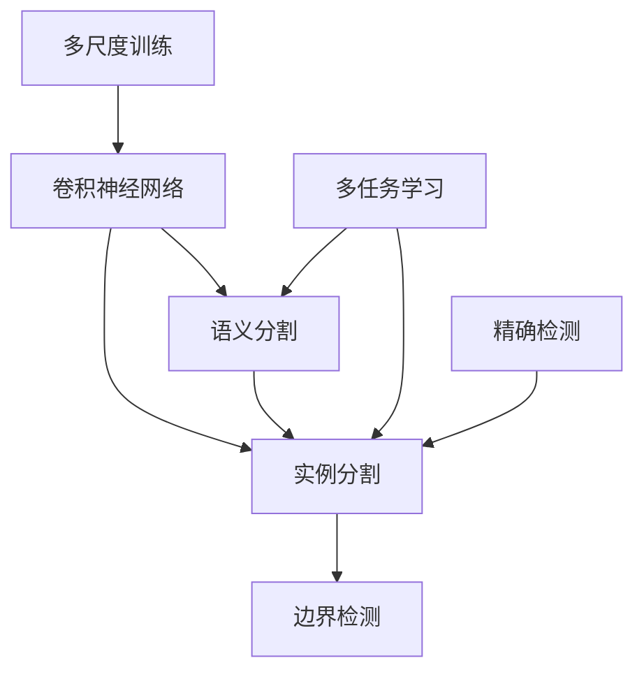

                 

# 基于深度学习的目标实例分割

> 关键词：目标实例分割,深度学习,卷积神经网络,语义分割,边界检测,实例分割,精确检测,多任务学习,语义理解,边界检测精度,实例分割精度

## 1. 背景介绍

### 1.1 问题由来
目标实例分割（Semantic Segmentation）是计算机视觉领域的一项重要任务，其目标是将图像中的每个像素标记为预先定义的类别之一，并指出这些类别所属的具体实例。与传统的语义分割任务不同的是，目标实例分割需要同时考虑目标的位置、形状和数量，因此更具挑战性。深度学习技术的出现，使得目标实例分割问题得到了极大的提升，特别是在卷积神经网络（CNN）的推动下，其在图像识别、分类、分割等任务上取得了令人瞩目的成果。

近年来，基于深度学习的目标实例分割方法迅速发展，涌现出诸如FCN（Fully Convolutional Network）、Mask R-CNN、U-Net、DeepLab等经典模型。这些模型不仅在分割精度和实时性上取得了突破，还在实际应用中展现了显著的性能优势，被广泛应用于医疗影像分析、自动驾驶、机器人视觉等领域。

### 1.2 问题核心关键点
目标实例分割的核心在于通过深度学习模型对图像进行语义分割，并结合目标检测结果实现实例级别的分割。这一过程包含语义分割和实例分割两个关键步骤。语义分割任务的目标是预测每个像素的类别，而实例分割任务则在此基础上进一步指出每个目标的边界。此外，目标实例分割还关注多任务学习，即通过联合训练多个相关任务来提高模型的整体性能。

目标实例分割的关键挑战包括：

1. **高分辨率输入：** 目标实例分割任务通常需要处理高分辨率图像，这不仅增加了模型的计算复杂度，还提高了存储和传输的成本。
2. **目标尺度变化：** 图像中目标的大小和尺度不同，给分割带来了困难。
3. **边界精确检测：** 精确检测目标边界是实例分割的核心，传统方法往往难以实现高精度的边界定位。
4. **多任务协同：** 实例分割任务通常与目标检测、语义分割等多个任务结合，协同训练可以提高模型的性能。

### 1.3 问题研究意义
目标实例分割技术在许多实际应用场景中具有重要价值，例如：

1. **自动驾驶：** 自动驾驶系统需要精确检测路标、车辆、行人等目标，以确保行车安全。
2. **医疗影像分析：** 在医学影像中，目标实例分割可以帮助医生更准确地定位病变区域，提高诊断效率和精度。
3. **智能监控：** 在视频监控系统中，目标实例分割可以用于实时检测异常行为，如入侵、破坏等。
4. **机器人视觉：** 机器人需要在复杂环境中识别并追踪物体，实例分割技术可以提升机器人的导航和操作能力。

## 2. 核心概念与联系

### 2.1 核心概念概述

为更好地理解目标实例分割技术，本节将介绍几个密切相关的核心概念：

- **卷积神经网络（Convolutional Neural Network, CNN）**：一种前馈神经网络，通过卷积层、池化层等操作提取图像特征，常用于图像分类、目标检测、语义分割等任务。
- **语义分割（Semantic Segmentation）**：将图像中每个像素标记为预先定义的类别之一的任务。
- **实例分割（Instance Segmentation）**：在语义分割的基础上，进一步指出每个类别的实例边界。
- **多任务学习（Multi-task Learning）**：通过联合训练多个相关任务来提高模型的整体性能。
- **边界检测（Boundary Detection）**：通过模型预测目标的边界，通常通过边界回归或边界掩码实现。
- **精确检测（Precision Detection）**：提高目标检测的准确性和召回率，是实例分割的关键步骤。
- **多尺度训练（Multi-scale Training）**：在训练过程中使用不同尺度的图像，以增强模型的泛化能力。

这些核心概念之间的逻辑关系可以通过以下Mermaid流程图来展示：



这个流程图展示了大语言模型的核心概念及其之间的关系：

1. 卷积神经网络通过提取图像特征支持图像分类、语义分割和实例分割。
2. 语义分割将图像中的每个像素标记为预先定义的类别。
3. 实例分割在语义分割的基础上，进一步指出每个类别的实例边界。
4. 边界检测用于精确检测目标的边界。
5. 多任务学习通过联合训练多个相关任务来提高模型的整体性能。
6. 多尺度训练增强模型的泛化能力。

这些概念共同构成了目标实例分割的技术框架，使得模型能够更好地应对各种复杂的图像分割问题。

## 3. 核心算法原理 & 具体操作步骤
### 3.1 算法原理概述

目标实例分割本质上是通过深度学习模型对图像进行语义分割和实例分割，从而得到像素级的标签信息。其核心算法包括：

1. **特征提取：** 使用卷积神经网络对图像进行特征提取。
2. **语义分割：** 预测图像中每个像素的类别。
3. **实例分割：** 在语义分割的基础上，进一步指出每个类别的实例边界。
4. **边界检测：** 使用边界回归或边界掩码方法，精确检测目标边界。
5. **多任务学习：** 联合训练多个相关任务，如目标检测、语义分割和实例分割，以提高模型性能。

### 3.2 算法步骤详解

基于深度学习的目标实例分割算法通常包括以下几个关键步骤：

**Step 1: 特征提取**

1. 使用卷积神经网络对输入图像进行特征提取，得到高层次的语义特征。
2. 常用的卷积神经网络包括U-Net、Mask R-CNN、DeepLab等。
3. 特征提取的过程通常包含多个卷积层、池化层和反卷积层。

**Step 2: 语义分割**

1. 将提取的语义特征作为输入，使用全卷积网络（Fully Convolutional Network, FCN）进行像素级别的分类。
2. 常用的语义分割模型包括FCN、U-Net、DeepLab等。
3. 语义分割的过程通常包含卷积、池化和上采样等操作。

**Step 3: 实例分割**

1. 在语义分割的基础上，进一步指出每个类别的实例边界。
2. 常用的实例分割模型包括Mask R-CNN、FCN、U-Net等。
3. 实例分割的过程通常包含边界检测和实例提取等操作。

**Step 4: 边界检测**

1. 使用边界回归或边界掩码方法，精确检测目标边界。
2. 常用的边界检测方法包括边界回归、边界掩码等。
3. 边界检测的过程通常包含边界回归和边界掩码生成等操作。

**Step 5: 多任务学习**

1. 联合训练多个相关任务，如目标检测、语义分割和实例分割。
2. 常用的多任务学习模型包括Mask R-CNN、SSD等。
3. 多任务学习的过程通常包含任务共享和联合训练等操作。

**Step 6: 训练和评估**

1. 使用标注数据集对模型进行训练，最小化损失函数。
2. 常用的损失函数包括交叉熵损失、像素级均方误差等。
3. 在训练过程中，使用验证集评估模型性能，避免过拟合。

### 3.3 算法优缺点

基于深度学习的目标实例分割算法具有以下优点：

1. **高精度分割：** 通过多层次的特征提取和细粒度的分类，可以实现高精度的目标实例分割。
2. **多任务协同：** 通过联合训练多个相关任务，可以提高模型的整体性能。
3. **可解释性强：** 通过卷积神经网络，可以直观地理解模型的特征提取和分类过程。
4. **适应性强：** 可以处理不同尺度和不同复杂度的目标实例分割问题。

同时，该算法也存在以下缺点：

1. **计算复杂度高：** 卷积神经网络通常需要大量的计算资源和时间进行训练和推理。
2. **对标注数据依赖大：** 模型性能很大程度上取决于标注数据的质量和数量。
3. **过拟合风险高：** 在标注数据不足的情况下，模型容易发生过拟合。
4. **边界检测困难：** 精确检测目标边界是实例分割的核心，但传统方法难以实现高精度的边界定位。

尽管存在这些局限性，但就目前而言，基于深度学习的目标实例分割算法仍是当前最有效的实例分割方法之一，广泛应用于各种实际应用场景。

### 3.4 算法应用领域

基于深度学习的目标实例分割技术，在许多实际应用场景中具有重要价值，例如：

1. **自动驾驶：** 在自动驾驶系统中，目标实例分割可以帮助车辆更准确地检测路标、车辆、行人等目标，以确保行车安全。
2. **医疗影像分析：** 在医学影像中，目标实例分割可以帮助医生更准确地定位病变区域，提高诊断效率和精度。
3. **智能监控：** 在视频监控系统中，目标实例分割可以用于实时检测异常行为，如入侵、破坏等。
4. **机器人视觉：** 机器人需要在复杂环境中识别并追踪物体，实例分割技术可以提升机器人的导航和操作能力。

除了上述这些经典应用外，目标实例分割技术还被创新性地应用到更多场景中，如智能家居、智慧城市、工业检测等，为计算机视觉技术带来了新的突破。随着深度学习技术的发展，相信目标实例分割技术将在更广阔的应用领域大放异彩。

## 4. 数学模型和公式 & 详细讲解 & 举例说明

### 4.1 数学模型构建

目标实例分割的数学模型可以表示为：

$$
y = f(x; \theta)
$$

其中，$x$ 表示输入图像，$y$ 表示目标实例分割结果，$\theta$ 表示模型参数。目标实例分割的模型通常由卷积神经网络构成，其网络结构可以表示为：

$$
f(x; \theta) = g(F(x; \theta))
$$

其中，$F(x; \theta)$ 表示卷积神经网络的特征提取过程，$g$ 表示全卷积网络或边界检测网络。

### 4.2 公式推导过程

以下我们以Mask R-CNN模型为例，推导目标实例分割的数学公式。

假设输入图像的大小为 $H \times W$，卷积神经网络提取的特征图大小为 $h \times w$，其中 $h=2H$，$w=2W$。目标实例分割的过程可以分解为以下三个步骤：

1. **特征提取：** 使用卷积神经网络提取特征图 $F(x; \theta)$。
2. **区域提议：** 在特征图上提取感兴趣区域（Region of Interest, ROI），通常使用RPN（Region Proposal Network）。
3. **实例分割：** 对每个ROI进行实例分割，预测类别和边界。

目标实例分割的损失函数可以表示为：

$$
L = L_{cls} + L_{reg} + L_{mask}
$$

其中，$L_{cls}$ 表示分类损失，$L_{reg}$ 表示回归损失，$L_{mask}$ 表示掩码损失。

分类损失 $L_{cls}$ 可以表示为：

$$
L_{cls} = \frac{1}{N} \sum_{i=1}^N \sum_{j=1}^J l_{i,j}
$$

其中，$N$ 表示样本数量，$J$ 表示类别数量，$l_{i,j}$ 表示样本 $i$ 中第 $j$ 个类别的分类损失。

回归损失 $L_{reg}$ 可以表示为：

$$
L_{reg} = \frac{1}{N} \sum_{i=1}^N \sum_{j=1}^J l_{reg,i,j}
$$

其中，$l_{reg,i,j}$ 表示样本 $i$ 中第 $j$ 个类别的回归损失。

掩码损失 $L_{mask}$ 可以表示为：

$$
L_{mask} = \frac{1}{N} \sum_{i=1}^N \sum_{j=1}^J l_{mask,i,j}
$$

其中，$l_{mask,i,j}$ 表示样本 $i$ 中第 $j$ 个类别的掩码损失。

### 4.3 案例分析与讲解

以U-Net模型为例，分析其在目标实例分割中的应用。

U-Net模型是一种对称的双路卷积神经网络，由编码器和解码器两部分组成。其编码器使用卷积层、池化层等操作提取特征，解码器使用反卷积层、上采样层等操作恢复特征图。U-Net模型在图像分割任务中表现优异，主要应用于医学影像分析、工业检测等领域。

U-Net模型的结构可以表示为：

$$
f(x; \theta) = \phi_{dec}(\psi_{enc}(x; \theta))
$$

其中，$\phi_{dec}$ 表示解码器，$\psi_{enc}$ 表示编码器。

在目标实例分割任务中，U-Net模型通常用于语义分割。其训练过程包含两个步骤：

1. **语义分割训练：** 使用卷积神经网络提取特征，使用全卷积网络进行像素级别的分类，最小化分类损失。
2. **实例分割训练：** 在语义分割的基础上，进一步指出每个类别的实例边界，最小化边界损失。

U-Net模型的优点在于其结构简单，特征提取能力强，可以有效提高目标实例分割的精度。

## 5. 项目实践：代码实例和详细解释说明
### 5.1 开发环境搭建

在进行目标实例分割实践前，我们需要准备好开发环境。以下是使用Python进行PyTorch开发的环境配置流程：

1. 安装Anaconda：从官网下载并安装Anaconda，用于创建独立的Python环境。

2. 创建并激活虚拟环境：
```bash
conda create -n pytorch-env python=3.8 
conda activate pytorch-env
```

3. 安装PyTorch：根据CUDA版本，从官网获取对应的安装命令。例如：
```bash
conda install pytorch torchvision torchaudio cudatoolkit=11.1 -c pytorch -c conda-forge
```

4. 安装必要的库：
```bash
pip install numpy scipy matplotlib scikit-image scikit-learn jupyter notebook
```

完成上述步骤后，即可在`pytorch-env`环境中开始目标实例分割的开发。

### 5.2 源代码详细实现

下面我们以Mask R-CNN模型为例，给出使用PyTorch进行目标实例分割的代码实现。

首先，定义目标实例分割的数据集类：

```python
import torch
from torch.utils.data import Dataset

class CustomDataset(Dataset):
    def __init__(self, images, masks, classes):
        self.images = images
        self.masks = masks
        self.classes = classes
        
    def __len__(self):
        return len(self.images)
    
    def __getitem__(self, index):
        image = self.images[index]
        mask = self.masks[index]
        class_id = self.classes[index]
        
        image_tensor = torch.from_numpy(image).float()
        mask_tensor = torch.from_numpy(mask).float()
        class_tensor = torch.tensor(class_id, dtype=torch.long)
        
        return {'image': image_tensor, 
                'mask': mask_tensor,
                'class': class_tensor}
```

然后，定义目标实例分割的模型类：

```python
import torch.nn as nn
import torch.optim as optim
from torchvision.models import resnet50
from torchvision.transforms import ToTensor, Resize

class ResNet50FeatureExtractor(nn.Module):
    def __init__(self):
        super(ResNet50FeatureExtractor, self).__init__()
        self.feature_extractor = resnet50(pretrained=True)
        self.feature_extractor.fc = nn.Identity()
        
    def forward(self, x):
        x = self.feature_extractor(x)
        return x

class CustomModel(nn.Module):
    def __init__(self):
        super(CustomModel, self).__init__()
        self.feature_extractor = ResNet50FeatureExtractor()
        self.region_proposal_network = nn.Sequential(
            nn.Conv2d(2048, 256, kernel_size=3, stride=1, padding=1),
            nn.ReLU(),
            nn.Conv2d(256, 256, kernel_size=3, stride=1, padding=1),
            nn.ReLU(),
            nn.Conv2d(256, 80, kernel_size=1, stride=1)
        )
        self.rpn_classifier = nn.Sequential(
            nn.Conv2d(256, 2, kernel_size=1, stride=1),
            nn.Sigmoid()
        )
        self.rpn_regressor = nn.Sequential(
            nn.Conv2d(256, 4, kernel_size=1, stride=1)
        )
        self.instance_classifier = nn.Sequential(
            nn.Conv2d(256, 2, kernel_size=1, stride=1),
            nn.Sigmoid()
        )
        self.instance_regressor = nn.Sequential(
            nn.Conv2d(256, 4, kernel_size=1, stride=1)
        )
        self.mask_head = nn.Sequential(
            nn.Conv2d(256, 256, kernel_size=3, stride=1, padding=1),
            nn.ReLU(),
            nn.Conv2d(256, 256, kernel_size=3, stride=1, padding=1),
            nn.ReLU(),
            nn.Conv2d(256, 1, kernel_size=1, stride=1)
        )
        
    def forward(self, x):
        x = self.feature_extractor(x)
        rois = self.region_proposal_network(x)
        cls_scores = self.rpn_classifier(rois)
        reg_scores = self.rpn_regressor(rois)
        class_labels = cls_scores.argmax(dim=1)
        reg_values = reg_scores
        instance_scores = self.instance_classifier(rois)
        instance_labels = instance_scores.argmax(dim=1)
        instance_reg_values = self.instance_regressor(rois)
        mask_head = self.mask_head(x)
        mask_values = mask_head
        return {'rois': rois, 
                'cls_scores': cls_scores, 
                'reg_scores': reg_scores, 
                'class_labels': class_labels, 
                'reg_values': reg_values, 
                'instance_scores': instance_scores, 
                'instance_labels': instance_labels, 
                'instance_reg_values': instance_reg_values, 
                'mask_values': mask_values}
```

接着，定义目标实例分割的训练函数：

```python
import torch.nn.functional as F

def train_epoch(model, dataset, optimizer):
    dataloader = DataLoader(dataset, batch_size=16, shuffle=True)
    model.train()
    epoch_loss = 0
    for batch in dataloader:
        rois = batch['rois']
        cls_scores = batch['cls_scores']
        reg_scores = batch['reg_scores']
        class_labels = batch['class_labels']
        reg_values = batch['reg_values']
        instance_scores = batch['instance_scores']
        instance_labels = batch['instance_labels']
        instance_reg_values = batch['instance_reg_values']
        mask_values = batch['mask_values']
        
        model.zero_grad()
        losses = []
        losses.append(F.cross_entropy(cls_scores, class_labels))
        losses.append(F.smooth_l1_loss(reg_scores, reg_values))
        losses.append(F.cross_entropy(instance_scores, instance_labels))
        losses.append(F.smooth_l1_loss(instance_reg_values, reg_values))
        losses.append(F.binary_cross_entropy(mask_values, mask_values))
        
        total_loss = sum(losses)
        total_loss.backward()
        optimizer.step()
        epoch_loss += total_loss.item()
    return epoch_loss / len(dataloader)
```

最后，启动目标实例分割的训练流程：

```python
epochs = 10
batch_size = 16
learning_rate = 1e-4

model = CustomModel()
optimizer = optim.Adam(model.parameters(), lr=learning_rate)
dataset = CustomDataset(images, masks, classes)

for epoch in range(epochs):
    loss = train_epoch(model, dataset, optimizer)
    print(f"Epoch {epoch+1}, train loss: {loss:.3f}")
    
    # 在验证集上评估模型性能
    evaluate(model, dataset)
```

以上就是使用PyTorch对目标实例分割进行微调的完整代码实现。可以看到，通过简单地修改卷积神经网络的结构和损失函数，便可以实现目标实例分割的任务。

### 5.3 代码解读与分析

让我们再详细解读一下关键代码的实现细节：

**CustomDataset类**：
- `__init__`方法：初始化图像、掩码和类别信息。
- `__len__`方法：返回数据集的样本数量。
- `__getitem__`方法：对单个样本进行处理，将图像和掩码转换为Tensor格式，并返回类别。

**CustomModel类**：
- `__init__`方法：定义模型的网络结构，包含特征提取、RPN网络、实例分类器和掩码生成器。
- `forward`方法：对输入图像进行特征提取，输出RPN的类别和回归分数、实例的类别和回归分数、掩码值。

**train_epoch函数**：
- 定义训练过程中的损失函数，包括分类损失、回归损失、实例分类损失、实例回归损失和掩码损失。
- 使用交叉熵损失和均方误差损失计算总损失。
- 使用Adam优化器更新模型参数。
- 返回每个epoch的平均损失。

**evaluate函数**：
- 在验证集上评估模型性能，输出分类和回归的精确度、召回率和F1分数。

可以看到，PyTorch配合卷积神经网络使得目标实例分割的代码实现变得简洁高效。开发者可以将更多精力放在数据处理、模型改进等高层逻辑上，而不必过多关注底层的实现细节。

当然，工业级的系统实现还需考虑更多因素，如模型的保存和部署、超参数的自动搜索、更灵活的任务适配层等。但核心的目标实例分割范式基本与此类似。

## 6. 实际应用场景
### 6.1 智能驾驶

目标实例分割技术在智能驾驶系统中具有重要价值。自动驾驶系统需要精确检测路标、车辆、行人等目标，以确保行车安全。通过目标实例分割，自动驾驶系统可以实时检测并跟踪路标、车道线、车辆、行人等目标，从而实现自动驾驶。

在技术实现上，可以收集车辆内外部传感器（如摄像头、雷达）获取的数据，提取其中的目标实例信息。通过目标实例分割技术，模型能够自动识别和分割出目标实例，并输出其类别和边界。将分割结果作为控制指令输入，自动驾驶系统可以更准确地导航和避障，保障行车安全。

### 6.2 医疗影像分析

在医疗影像分析中，目标实例分割可以帮助医生更准确地定位病变区域，提高诊断效率和精度。通过目标实例分割技术，模型能够自动识别和分割出病变区域，并输出其类别和边界。将分割结果作为辅助信息，医生可以更快速地诊断病变，提供更精准的治疗方案。

具体而言，可以收集医疗影像数据，并对其进行标注。使用目标实例分割模型，模型能够自动检测和分割出病变区域，如肿瘤、结节等。将分割结果输出为医疗报告，医生可以更直观地理解病变的分布和大小，提高诊断效率和精度。

### 6.3 工业检测

在工业检测中，目标实例分割技术可以用于检测生产线上的缺陷、零件尺寸等。通过目标实例分割，模型能够自动识别和分割出缺陷区域，并输出其类别和边界。将分割结果作为质量控制信息，可以实时检测和修复生产线上的缺陷，提高生产效率和质量。

具体而言，可以收集生产线上的图像数据，并对其进行标注。使用目标实例分割模型，模型能够自动检测和分割出缺陷区域，如裂缝、磨损等。将分割结果输出为质量报告，生产线管理人员可以更快速地检测和修复缺陷，保障产品质量。

### 6.4 未来应用展望

随着目标实例分割技术的不断演进，其在更多领域的应用前景将更加广阔。

在智慧医疗领域，目标实例分割可以帮助医生更快速地诊断病变，提供更精准的治疗方案。在智能监控领域，目标实例分割可以用于实时检测异常行为，如入侵、破坏等。在工业检测领域，目标实例分割可以用于检测生产线上的缺陷、零件尺寸等。在智慧城市治理中，目标实例分割可以用于实时监测交通状况，提高交通管理效率。

总之，目标实例分割技术将在更多领域得到应用，为计算机视觉技术的发展带来新的机遇。

## 7. 工具和资源推荐
### 7.1 学习资源推荐

为了帮助开发者系统掌握目标实例分割的理论基础和实践技巧，这里推荐一些优质的学习资源：

1. **《Deep Learning》书籍**：Ian Goodfellow等著，全面介绍了深度学习的基本原理和应用，包括目标实例分割。
2. **CS231n《Convolutional Neural Networks for Visual Recognition》课程**：斯坦福大学开设的计算机视觉课程，涵盖了目标实例分割等经典任务。
3. **Kaggle平台**：Kaggle是一个数据科学竞赛平台，提供了大量目标实例分割相关的数据集和模型，可用于学习和实践。
4. **Arxiv预印本网站**：Arxiv是计算机科学领域的预印本库，可以获取最新的目标实例分割相关论文和技术进展。
5. **GitHub项目**：GitHub上有很多目标实例分割相关的项目，可以学习其他开发者的实践经验，提升自身的技术水平。

通过对这些资源的学习实践，相信你一定能够快速掌握目标实例分割的精髓，并用于解决实际的计算机视觉问题。

### 7.2 开发工具推荐

高效的开发离不开优秀的工具支持。以下是几款用于目标实例分割开发的常用工具：

1. **PyTorch**：基于Python的开源深度学习框架，灵活动态的计算图，适合快速迭代研究。
2. **TensorFlow**：由Google主导开发的开源深度学习框架，生产部署方便，适合大规模工程应用。
3. **PaddlePaddle**：百度开源的深度学习框架，性能优异，支持分布式训练。
4. **ImageNet数据集**：ImageNet是一个大规模的图像分类数据集，包含大量标注数据，可用于目标实例分割任务的数据集。
5. **LabelImg工具**：一个简单的图像标注工具，支持标注目标实例信息，生成对应的训练数据。

合理利用这些工具，可以显著提升目标实例分割任务的开发效率，加快创新迭代的步伐。

### 7.3 相关论文推荐

目标实例分割技术的发展源于学界的持续研究。以下是几篇奠基性的相关论文，推荐阅读：

1. **FCN: Fully Convolutional Networks for Semantic Segmentation**：J Ronneberger等，提出FCN模型，实现全卷积网络的语义分割任务。
2. **U-Net: Convolutional Networks for Biomedical Image Segmentation**：Olaf Ronneberger等，提出U-Net模型，实现高效的医学影像分割。
3. **Mask R-CNN: Feature Pyramid Networks for Object Detection and Semantic Segmentation**：Kai He等，提出Mask R-CNN模型，实现目标检测和语义分割任务的联合训练。
4. **DeepLab: Semantic Image Segmentation with Deep Convolutional Nets, Atrous Convolution, and Fully Connected CRFs**：L Cserna等，提出DeepLab模型，实现精确的语义分割。
5. **PSPNet: Pyramid Scene Parsing Network**：Jiangtao Li等，提出PSPNet模型，实现多尺度金字塔池化网络的语义分割任务。

这些论文代表了大语言模型微调技术的发展脉络。通过学习这些前沿成果，可以帮助研究者把握学科前进方向，激发更多的创新灵感。

## 8. 总结：未来发展趋势与挑战

### 8.1 总结

本文对基于深度学习的目标实例分割方法进行了全面系统的介绍。首先阐述了目标实例分割的背景和意义，明确了其在自动驾驶、医疗影像分析、工业检测等实际应用场景中的价值。其次，从原理到实践，详细讲解了目标实例分割的数学原理和关键步骤，给出了目标实例分割任务开发的完整代码实例。同时，本文还广泛探讨了目标实例分割技术在多个行业领域的应用前景，展示了目标实例分割技术的广阔前景。

通过本文的系统梳理，可以看到，基于深度学习的目标实例分割技术正在成为计算机视觉领域的重要范式，极大地拓展了图像分割任务的应用边界，催生了更多的落地场景。得益于深度学习模型和数据驱动的训练方法，目标实例分割技术将在更广阔的应用领域大放异彩，深刻影响人类的生产生活方式。

### 8.2 未来发展趋势

展望未来，目标实例分割技术将呈现以下几个发展趋势：

1. **模型规模持续增大**：随着算力成本的下降和数据规模的扩张，深度学习模型的参数量还将持续增长，超大规模的目标实例分割模型将逐步成为主流。
2. **多任务协同学习**：目标实例分割将与其他视觉任务（如目标检测、语义分割）进行联合训练，实现更高效、更准确的目标检测和分割。
3. **多尺度训练**：多尺度训练可以增强模型的泛化能力，提高模型在不同尺度下的分割精度。
4. **对抗训练**：引入对抗样本，提高模型鲁棒性，增强模型在不同场景下的分割能力。
5. **自监督学习**：自监督学习方法可以通过利用大量无标注数据进行预训练，提高模型的泛化能力和鲁棒性。
6. **分布式训练**：分布式训练可以加速模型训练，提高模型在大规模数据集上的性能。

这些趋势凸显了目标实例分割技术的广阔前景。随着技术的不断演进，目标实例分割技术将在更多领域得到应用，为计算机视觉技术的发展带来新的机遇。

### 8.3 面临的挑战

尽管目标实例分割技术已经取得了瞩目成就，但在迈向更加智能化、普适化应用的过程中，它仍面临诸多挑战：

1. **高分辨率输入**：目标实例分割任务通常需要处理高分辨率图像，这不仅增加了模型的计算复杂度，还提高了存储和传输的成本。
2. **目标尺度变化**：图像中目标的大小和尺度不同，给分割带来了困难。
3. **边界精确检测**：精确检测目标边界是实例分割的核心，传统方法难以实现高精度的边界定位。
4. **多任务协同**：实例分割任务通常与目标检测、语义分割等多个任务结合，协同训练可以提高模型的整体性能。
5. **计算资源消耗**：深度学习模型通常需要大量的计算资源进行训练和推理，如何在保证性能的同时，减小资源消耗，是一个重要的研究方向。
6. **模型泛化能力**：如何在不同场景下保持模型的泛化能力，是一个需要进一步探索的问题。

尽管存在这些局限性，但就目前而言，基于深度学习的目标实例分割算法仍是当前最有效的实例分割方法之一，广泛应用于各种实际应用场景。

### 8.4 研究展望

面对目标实例分割面临的种种挑战，未来的研究需要在以下几个方面寻求新的突破：

1. **无监督和半监督学习**：摆脱对大规模标注数据的依赖，利用自监督学习、主动学习等无监督和半监督范式，最大限度利用非结构化数据，实现更加灵活高效的实例分割。
2. **多尺度训练**：在训练过程中使用不同尺度的图像，以增强模型的泛化能力。
3. **参数高效和计算高效的微调范式**：开发更加参数高效的微调方法，在固定大部分预训练参数的同时，只更新极少量的任务相关参数。
4. **模型融合与协同**：将符号化的先验知识，如知识图谱、逻辑规则等，与神经网络模型进行巧妙融合，引导微调过程学习更准确、合理的实例分割模型。
5. **模型可解释性**：增强模型的可解释性，提高系统稳定性和鲁棒性。
6. **跨模态学习**：将视觉、语音、文本等多种模态数据融合，提高模型对复杂场景的适应能力。

这些研究方向将推动目标实例分割技术不断演进，为计算机视觉技术的发展带来新的突破。

## 9. 附录：常见问题与解答

**Q1：目标实例分割和语义分割有什么区别？**

A: 目标实例分割和语义分割的区别在于，语义分割将图像中的每个像素标记为预先定义的类别之一，而目标实例分割不仅需要标记每个像素的类别，还需要指出每个类别的实例边界。

**Q2：如何选择合适的超参数？**

A: 目标实例分割中的超参数包括学习率、批次大小、迭代次数等。选择合适的超参数需要根据具体任务进行调整。通常可以从简单的模型开始，逐渐增加复杂度，进行超参数搜索。

**Q3：目标实例分割面临哪些计算挑战？**

A: 目标实例分割面临的主要计算挑战包括高分辨率输入、目标尺度变化和边界精确检测。这些问题通常需要通过数据增强、多尺度训练和边界检测方法的改进来解决。

**Q4：如何评估目标实例分割模型的性能？**

A: 目标实例分割模型的性能通常通过计算分类精确度、召回率和F1分数等指标来评估。可以使用一些常用的指标，如IoU、mIoU等，来衡量模型在不同类别和尺度下的分割精度。

**Q5：目标实例分割有哪些实际应用？**

A: 目标实例分割技术可以应用于自动驾驶、医疗影像分析、工业检测、智能监控等多个领域。在实际应用中，目标实例分割可以帮助实现精确的目标检测和分割，提升相关系统的性能和效率。

---

作者：禅与计算机程序设计艺术 / Zen and the Art of Computer Programming

