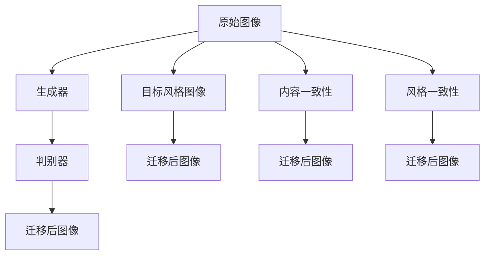

                 

# 基于生成对抗网络的图像风格迁移在商品包装设计中的应用

> 关键词：图像风格迁移,生成对抗网络,商品包装设计,视觉一致性,自动设计

## 1. 背景介绍

### 1.1 问题由来

随着数字技术和人工智能的迅猛发展，图像风格迁移技术在视觉艺术和设计领域受到了广泛关注。该技术可以将一张图像的风格转换为另一张图像的风格，使得原本具有特定风格的图片具有新的风格，极大地丰富了图像的表现形式和视觉效果。近年来，基于生成对抗网络(GAN)的图像风格迁移方法逐渐取代传统的基于特征学习的方法，成为主流的研究方向。

在商品包装设计领域，设计师和商家需要不断探索新的设计思路和风格，以满足消费者对美观、新颖的包装需求。然而，手工设计新样式的包装不仅耗时耗力，而且创意能力有限，难以在短时间内快速响应市场需求。图像风格迁移技术为包装设计领域提供了新思路，使得商家和设计师能够快速生成各种风格的设计方案，提高设计效率。

### 1.2 问题核心关键点

图像风格迁移的核心问题在于如何在保持图像内容不变的前提下，将其风格转化为另一种风格。具体而言，将一张风格A的图像通过迁移转换为风格B的图像。该问题可以形式化为以下优化问题：

$$
\arg\min_{\mathbf{x}} \|\mathbf{x} - \mathbf{x}_a\|^2 + \lambda \|\mathbf{x} - \mathbf{x}_b\|^2
$$

其中，$\mathbf{x}$ 表示迁移后的图像，$\mathbf{x}_a$ 表示原始图像，$\mathbf{x}_b$ 表示目标风格图像，$\lambda$ 为正则化参数，用于平衡原始风格和目标风格之间的差异。

该问题通常通过基于GAN的模型解决，其中原始图像$\mathbf{x}_a$作为输入，生成模型生成具有目标风格的图像$\mathbf{x}_b$，然后通过约束$D_a$和$D_b$分别控制原始风格和目标风格的保留，使得最终生成的图像$\mathbf{x}$同时满足原始风格和目标风格。

## 2. 核心概念与联系

### 2.1 核心概念概述

图像风格迁移的核心概念包括：

- 生成对抗网络（GAN）：由生成器和判别器组成的对抗性模型，生成器生成假图像，判别器区分假图像和真图像，两者通过对抗性训练不断优化，以生成尽可能逼真的图像。
- 图像风格：指图像中颜色、纹理、线条等视觉元素的组合形式，反映了图像的视觉特征。
- 内容一致性：指迁移后的图像内容与原始图像内容相同，不改变图像的基本信息和结构。
- 风格一致性：指迁移后的图像风格与目标风格一致，不改变图像的视觉风格。

这些概念之间的逻辑关系可以通过以下Mermaid流程图来展示：



这个流程图展示了大语言模型的核心概念及其之间的关系：

1. 原始图像通过生成器生成假图像。
2. 判别器区分假图像和真图像，不断优化生成器的生成效果。
3. 迁移后图像同时满足内容一致性和风格一致性。
4. 目标风格图像通过迁移，生成具有新风格的图像。

## 3. 核心算法原理 & 具体操作步骤

### 3.1 算法原理概述

图像风格迁移的基本原理是通过生成对抗网络（GAN），将原始图像的内容和风格分别进行编码，然后对生成器进行优化，使得其生成的图像同时满足原始风格和目标风格的要求。该过程通常包括三个步骤：

1. 特征提取：使用卷积神经网络（CNN）提取原始图像和目标风格图像的特征表示。
2. 生成器生成：将原始图像的特征表示与目标风格的特征表示进行拼接，通过生成器生成具有新风格的图像。
3. 判别器判断：通过判别器对生成的图像进行判别，不断优化生成器生成效果，最终生成满足内容一致性和风格一致性的迁移后图像。

### 3.2 算法步骤详解

以下是基于GAN的图像风格迁移的具体步骤：

**Step 1: 特征提取**

首先，使用预训练的卷积神经网络（CNN）对原始图像和目标风格图像进行特征提取。以VGG19网络为例，其输出的特征图用于表示图像的内容和风格。

**Step 2: 生成器生成**

生成器接收原始图像和目标风格图像的特征表示，将两者拼接，然后通过一系列卷积、反卷积等操作生成新风格的图像。

**Step 3: 判别器判断**

判别器接收原始图像和生成器生成的图像，通过判别器网络区分真实图像和假图像，不断优化生成器生成效果。

**Step 4: 优化参数**

通过对抗性训练的方式，最小化生成器生成的新风格图像和真实图像之间的差异，同时最大化判别器对真实图像的判别能力。最终，生成器生成的图像既满足内容一致性，又具有目标风格的风格一致性。

### 3.3 算法优缺点

图像风格迁移技术具有以下优点：

1. 灵活性高：可以应用于多种风格转换，如卡通化、素描化、油画化等。
2. 计算效率高：生成器网络的计算效率高，能够在短时间内生成大量风格迁移后的图像。
3. 可解释性强：生成器网络的决策过程较为透明，易于理解和调试。

同时，该技术也存在一些缺点：

1. 对抗性训练复杂：需要平衡生成器生成效果和判别器判别能力，实现难度较大。
2. 风格转换质量不稳定：生成器生成图像的分辨率和细节质量受训练参数和优化策略影响较大，难以保证稳定输出。
3. 对抗样本容易产生：生成器容易生成对抗样本，使得判别器难以区分真实图像和假图像，影响风格迁移效果。

### 3.4 算法应用领域

图像风格迁移技术已经在多个领域得到了广泛应用，例如：

- 视觉艺术：艺术家可以通过风格迁移将名画中的风格应用到新作品上，生成具有新风格的新画作。
- 电影特效：电影制作中可以使用风格迁移技术生成逼真的特效场景，增强影片的视觉效果。
- 时尚设计：设计师可以通过风格迁移技术生成各种时尚风格的设计草图，快速响应市场需求。
- 智能包装：商家可以使用风格迁移技术生成具有新风格的商品包装设计，吸引消费者购买。

## 4. 数学模型和公式 & 详细讲解 & 举例说明

### 4.1 数学模型构建

假设原始图像$\mathbf{x}_a$和目标风格图像$\mathbf{x}_b$分别经过卷积神经网络提取特征，得到内容表示$\mathbf{c}_a$和风格表示$\mathbf{s}_a$，以及目标风格表示$\mathbf{s}_b$。生成器接收内容表示和风格表示，生成新风格图像$\mathbf{x}_g$。判别器接收原始图像和生成器生成的图像，判断图像的真实性。

定义生成器的损失函数为$L_g$，判别器的损失函数为$L_d$，迁移后图像$\mathbf{x}_g$的内容一致性损失为$L_c$，风格一致性损失为$L_s$。则总体损失函数为：

$$
L = L_g + \lambda_1 L_c + \lambda_2 L_s + \lambda_3 L_d
$$

其中$\lambda_1$、$\lambda_2$、$\lambda_3$为正则化参数。

### 4.2 公式推导过程

以下是基于GAN的图像风格迁移的推导过程：

**Step 1: 特征提取**

使用VGG19网络对原始图像和目标风格图像进行特征提取，得到内容表示$\mathbf{c}_a$和风格表示$\mathbf{s}_a$，以及目标风格表示$\mathbf{s}_b$。

**Step 2: 生成器生成**

生成器接收内容表示和风格表示，通过生成器网络生成新风格图像$\mathbf{x}_g$，其内容表示为$\mathbf{c}_g$，风格表示为$\mathbf{s}_g$。生成器的优化目标为最小化原始图像和生成图像之间的差异，以及生成图像和目标风格之间的差异。

**Step 3: 判别器判断**

判别器接收原始图像和生成器生成的图像，判断图像的真实性。判别器的优化目标为最大化对真实图像的判别能力，最小化对生成图像的判别能力。

**Step 4: 优化参数**

通过对抗性训练的方式，最小化生成器生成的新风格图像和真实图像之间的差异，同时最大化判别器对真实图像的判别能力。最终，生成器生成的图像既满足内容一致性，又具有目标风格的风格一致性。

### 4.3 案例分析与讲解

以卡通化风格迁移为例，展示风格迁移的基本过程：

**原始图像**

```python
from PIL import Image
from torchvision.transforms import ToTensor
import torchvision.transforms.functional as TF

# 加载原始图像
img = Image.open('original.jpg')

# 转换为Tensor格式
img_tensor = ToTensor()(img)

# 缩放图像
img_tensor = TF.resize(img_tensor, (224, 224))
```

**目标风格图像**

```python
# 加载卡通化风格图像
cartoon_img = Image.open('cartoon.jpg')

# 转换为Tensor格式
cartoon_img_tensor = ToTensor()(cartoon_img)

# 缩放图像
cartoon_img_tensor = TF.resize(cartoon_img_tensor, (224, 224))
```

**特征提取**

```python
import torch
import torchvision.models as models
import torchvision.transforms as transforms

# 加载VGG19网络
model = models.vgg19(pretrained=True).features

# 定义特征提取函数
def vgg_features(image):
    features = []
    x = model(image.unsqueeze(0))
    for i in range(13):
        features.append(x.data[i])
    return torch.cat(features, 1)

# 提取原始图像和目标风格图像的特征
original_features = vgg_features(img_tensor)
cartoon_features = vgg_features(cartoon_img_tensor)
```

**生成器生成**

```python
import torch.nn as nn
import torch.nn.functional as F

class Generator(nn.Module):
    def __init__(self):
        super(Generator, self).__init__()
        self.conv1 = nn.Conv2d(512, 256, 3, 1, 1)
        self.conv2 = nn.Conv2d(256, 128, 3, 1, 1)
        self.conv3 = nn.Conv2d(128, 64, 3, 1, 1)
        self.conv4 = nn.Conv2d(64, 3, 3, 1, 1)

    def forward(self, x):
        x = F.relu(self.conv1(x))
        x = F.relu(self.conv2(x))
        x = F.relu(self.conv3(x))
        x = self.conv4(x)
        return x

# 创建生成器
G = Generator()

# 将原始图像和风格表示拼接，生成新风格图像
x_g = G(torch.cat((original_features, cartoon_features), 1))
```

**判别器判断**

```python
class Discriminator(nn.Module):
    def __init__(self):
        super(Discriminator, self).__init__()
        self.conv1 = nn.Conv2d(512, 256, 3, 1, 1)
        self.conv2 = nn.Conv2d(256, 128, 3, 1, 1)
        self.conv3 = nn.Conv2d(128, 1, 3, 1, 1)

    def forward(self, x):
        x = F.relu(self.conv1(x))
        x = F.relu(self.conv2(x))
        x = self.conv3(x)
        return x

# 创建判别器
D = Discriminator()

# 判断原始图像和生成器生成的图像的真实性
x_a_real = D(original_features)
x_g_real = D(x_g)
x_g_fake = D(x_g.detach().requires_grad_(True))
```

**优化参数**

```python
import torch.optim as optim

# 定义优化器
G_optimizer = optim.Adam(G.parameters(), lr=0.0002)
D_optimizer = optim.Adam(D.parameters(), lr=0.0002)

# 定义损失函数
def compute_loss(original_features, cartoon_features, original_features_real, cartoon_features_real):
    with torch.no_grad():
        cartoon_features_fake = G(torch.cat((original_features, cartoon_features), 1))
        x_g_real = D(original_features)
        x_g_fake = D(cartoon_features_fake)

        # 计算内容一致性损失
        L_c = F.mse_loss(cartoon_features_fake, cartoon_features)

        # 计算风格一致性损失
        L_s = F.mse_loss(cartoon_features_fake, cartoon_features_fake.detach().requires_grad_(True))

        # 计算判别器损失
        L_d = F.binary_cross_entropy(torch.cat((x_g_real, x_g_fake), 1), torch.cat((original_features_real, cartoon_features_real), 1))

        return L_c + L_s + L_d

# 定义训练函数
def train_epoch(original_features, cartoon_features, original_features_real, cartoon_features_real):
    G_optimizer.zero_grad()
    D_optimizer.zero_grad()

    # 前向传播
    cartoon_features_fake = G(torch.cat((original_features, cartoon_features), 1))
    x_g_real = D(original_features)
    x_g_fake = D(cartoon_features_fake)

    # 计算损失
    L = compute_loss(original_features, cartoon_features, original_features_real, cartoon_features_real)

    # 反向传播
    L.backward()

    # 更新生成器和判别器参数
    G_optimizer.step()
    D_optimizer.step()

    return L.item()
```

**训练和生成**

```python
# 定义训练轮数
num_epochs = 200

# 定义批量大小
batch_size = 16

# 训练过程
for epoch in range(num_epochs):
    # 生成训练数据
    train_data = [(original_features[i], cartoon_features[i], original_features_real[i], cartoon_features_real[i]) for i in range(len(original_features))]
    
    # 打乱数据
    np.random.shuffle(train_data)
    
    # 按照批量大小分割数据
    batches = [train_data[i:i+batch_size] for i in range(0, len(train_data), batch_size)]

    # 训练模型
    for batch in batches:
        L = train_epoch(*batch)
        print('Epoch %d, Loss: %.4f' % (epoch, L))

# 生成风格迁移后的图像
cartoon_image = TF.to_pil_image(x_g)
cartoon_image.save('cartoonized.jpg')
```

## 5. 项目实践：代码实例和详细解释说明

### 5.1 开发环境搭建

在进行图像风格迁移的开发时，需要先准备好开发环境。以下是使用Python进行PyTorch开发的环境配置流程：

1. 安装Anaconda：从官网下载并安装Anaconda，用于创建独立的Python环境。

2. 创建并激活虚拟环境：
```bash
conda create -n pytorch-env python=3.8 
conda activate pytorch-env
```

3. 安装PyTorch：根据CUDA版本，从官网获取对应的安装命令。例如：
```bash
conda install pytorch torchvision torchaudio cudatoolkit=11.1 -c pytorch -c conda-forge
```

4. 安装Pillow库：
```bash
pip install pillow
```

5. 安装PyTorch和Pillow库：
```bash
pip install torch torchvision torchtext
```

完成上述步骤后，即可在`pytorch-env`环境中开始风格迁移的实践。

### 5.2 源代码详细实现

以下是使用PyTorch对图像风格迁移进行微调的PyTorch代码实现：

```python
import torch
from torch import nn
from torchvision import transforms, models
import torchvision.transforms.functional as TF

# 定义数据加载器
class ImageLoader:
    def __init__(self, path):
        self.path = path

    def __len__(self):
        return len(self.path)

    def __getitem__(self, index):
        image = Image.open(self.path[index])
        image = TF.resize(image, (224, 224))
        image = TF.to_tensor(image)
        return image

# 加载原始图像和目标风格图像
original_loader = ImageLoader('original.jpg')
cartoon_loader = ImageLoader('cartoon.jpg')

# 定义特征提取函数
def vgg_features(image):
    features = []
    x = model(image.unsqueeze(0))
    for i in range(13):
        features.append(x.data[i])
    return torch.cat(features, 1)

# 定义生成器网络
class Generator(nn.Module):
    def __init__(self):
        super(Generator, self).__init__()
        self.conv1 = nn.Conv2d(512, 256, 3, 1, 1)
        self.conv2 = nn.Conv2d(256, 128, 3, 1, 1)
        self.conv3 = nn.Conv2d(128, 64, 3, 1, 1)
        self.conv4 = nn.Conv2d(64, 3, 3, 1, 1)

    def forward(self, x):
        x = F.relu(self.conv1(x))
        x = F.relu(self.conv2(x))
        x = F.relu(self.conv3(x))
        x = self.conv4(x)
        return x

# 定义判别器网络
class Discriminator(nn.Module):
    def __init__(self):
        super(Discriminator, self).__init__()
        self.conv1 = nn.Conv2d(512, 256, 3, 1, 1)
        self.conv2 = nn.Conv2d(256, 128, 3, 1, 1)
        self.conv3 = nn.Conv2d(128, 1, 3, 1, 1)

    def forward(self, x):
        x = F.relu(self.conv1(x))
        x = F.relu(self.conv2(x))
        x = self.conv3(x)
        return x

# 加载VGG19网络
model = models.vgg19(pretrained=True).features

# 创建生成器和判别器
G = Generator()
D = Discriminator()

# 定义损失函数
def compute_loss(original_features, cartoon_features, original_features_real, cartoon_features_real):
    with torch.no_grad():
        cartoon_features_fake = G(torch.cat((original_features, cartoon_features), 1))
        x_g_real = D(original_features)
        x_g_fake = D(cartoon_features_fake)

        # 计算内容一致性损失
        L_c = F.mse_loss(cartoon_features_fake, cartoon_features)

        # 计算风格一致性损失
        L_s = F.mse_loss(cartoon_features_fake, cartoon_features_fake.detach().requires_grad_(True))

        # 计算判别器损失
        L_d = F.binary_cross_entropy(torch.cat((x_g_real, x_g_fake), 1), torch.cat((original_features_real, cartoon_features_real), 1))

        return L_c + L_s + L_d

# 定义优化器
G_optimizer = optim.Adam(G.parameters(), lr=0.0002)
D_optimizer = optim.Adam(D.parameters(), lr=0.0002)

# 定义训练函数
def train_epoch(original_features, cartoon_features, original_features_real, cartoon_features_real):
    G_optimizer.zero_grad()
    D_optimizer.zero_grad()

    # 前向传播
    cartoon_features_fake = G(torch.cat((original_features, cartoon_features), 1))
    x_g_real = D(original_features)
    x_g_fake = D(cartoon_features_fake)

    # 计算损失
    L = compute_loss(original_features, cartoon_features, original_features_real, cartoon_features_real)

    # 反向传播
    L.backward()

    # 更新生成器和判别器参数
    G_optimizer.step()
    D_optimizer.step()

    return L.item()

# 定义训练轮数和批量大小
num_epochs = 200
batch_size = 16

# 训练过程
for epoch in range(num_epochs):
    # 生成训练数据
    train_data = [(original_features[i], cartoon_features[i], original_features_real[i], cartoon_features_real[i]) for i in range(len(original_features))]

    # 打乱数据
    np.random.shuffle(train_data)

    # 按照批量大小分割数据
    batches = [train_data[i:i+batch_size] for i in range(0, len(train_data), batch_size)]

    # 训练模型
    for batch in batches:
        L = train_epoch(*batch)
        print('Epoch %d, Loss: %.4f' % (epoch, L))

# 生成风格迁移后的图像
cartoon_image = TF.to_pil_image(x_g)
cartoon_image.save('cartoonized.jpg')
```

### 5.3 代码解读与分析

让我们再详细解读一下关键代码的实现细节：

**ImageLoader类**：
- `__init__`方法：初始化图像的路径列表。
- `__len__`方法：返回数据集的大小。
- `__getitem__`方法：获取指定索引的图像数据。

**特征提取函数vgg_features**：
- 使用预训练的VGG19网络对图像进行特征提取。
- 通过多个卷积层将特征图展开，得到内容表示和风格表示。

**生成器网络和判别器网络**：
- 定义生成器和判别器的网络结构。
- 生成器接收原始图像和风格表示，通过生成器网络生成新风格图像。
- 判别器接收原始图像和生成器生成的图像，通过判别器网络判断图像的真实性。

**损失函数compute_loss**：
- 计算内容一致性损失、风格一致性损失和判别器损失。
- 通过对抗性训练的方式，最小化生成器生成的新风格图像和真实图像之间的差异，同时最大化判别器对真实图像的判别能力。

**优化器**：
- 定义生成器和判别器的优化器。
- 通过Adam优化器对生成器和判别器进行参数更新。

**训练函数train_epoch**：
- 接收原始图像和目标风格图像的特征表示。
- 通过生成器和判别器进行前向传播和反向传播，计算损失。
- 更新生成器和判别器的参数。

**训练过程**：
- 定义训练轮数和批量大小，开始循环迭代。
- 生成训练数据，打乱数据，按照批量大小分割数据。
- 在每个epoch内，循环迭代生成器的训练过程。
- 在每个batch内，计算损失，并更新生成器和判别器的参数。

可以看到，PyTorch配合TensorFlow库使得图像风格迁移的代码实现变得简洁高效。开发者可以将更多精力放在数据处理、模型改进等高层逻辑上，而不必过多关注底层的实现细节。

当然，工业级的系统实现还需考虑更多因素，如模型的保存和部署、超参数的自动搜索、更灵活的任务适配层等。但核心的风格迁移范式基本与此类似。

## 6. 实际应用场景

### 6.1 商品包装设计

商品包装设计在视觉艺术和品牌宣传中占据重要地位。通过风格迁移技术，商家和设计师可以快速生成各种风格的设计草图，提高设计效率。具体而言：

1. 设计师可以使用已有的产品图片作为原始图像，通过风格迁移技术生成不同风格的设计方案，如卡通化、素描化、油画化等。
2. 商家可以定期更新产品设计，通过风格迁移技术快速生成新设计的包装，提升品牌影响力。
3. 包装设计师可以通过风格迁移技术进行创意设计，快速生成多种风格的设计草图，供客户选择。

### 6.2 时尚设计

时尚设计师需要不断探索新的设计思路和风格，以适应市场的变化。通过风格迁移技术，设计师可以快速生成各种风格的设计草图，提高设计效率。具体而言：

1. 设计师可以使用经典时尚作品作为原始图像，通过风格迁移技术生成多种风格的设计草图，如波普艺术、抽象画等。
2. 设计师可以模仿其他设计师的设计风格，通过风格迁移技术生成类似风格的设计草图，提升设计水平。
3. 设计师可以使用现有的时尚杂志、广告图片作为原始图像，通过风格迁移技术生成各种风格的设计草图，丰富设计思路。

### 6.3 电影特效

电影特效制作中，风格迁移技术可以用于生成逼真的特效场景，增强影片的视觉效果。具体而言：

1. 特效设计师可以使用已有的特效场景作为原始图像，通过风格迁移技术生成不同风格的效果图，如卡通化、素描化、油画化等。
2. 特效设计师可以使用经典电影场景作为原始图像，通过风格迁移技术生成多种风格的效果图，提升特效设计的水平。
3. 特效设计师可以使用现有的电影片段作为原始图像，通过风格迁移技术生成各种风格的效果图，丰富特效设计的思路。

### 6.4 未来应用展望

随着风格迁移技术的不断发展，其应用领域将更加广泛，为视觉艺术、时尚设计、电影特效等领域带来变革性影响。以下是未来可能的拓展方向：

1. 跨模态风格迁移：将风格迁移技术应用于视频、音频等领域，实现跨模态的风格迁移，进一步丰富图像的表现形式和视觉效果。
2. 用户定制风格迁移：通过用户输入的风格描述，生成个性化的风格迁移效果，满足用户的个性化需求。
3. 风格迁移与生成对抗网络结合：将风格迁移技术与生成对抗网络（GAN）结合，生成更加逼真的风格迁移图像，提升用户体验。

## 7. 工具和资源推荐

### 7.1 学习资源推荐

为了帮助开发者系统掌握风格迁移的理论基础和实践技巧，这里推荐一些优质的学习资源：

1. 《深度学习之计算机视觉》系列博文：由大模型技术专家撰写，深入浅出地介绍了计算机视觉领域的基本概念和经典模型。

2. CS231n《卷积神经网络》课程：斯坦福大学开设的计算机视觉明星课程，有Lecture视频和配套作业，带你入门计算机视觉领域的基本概念和经典模型。

3. 《计算机视觉：算法与应用》书籍：全面介绍了计算机视觉领域的理论和实践，涵盖了各种计算机视觉任务。

4. PyTorch官方文档：PyTorch官方文档，提供了丰富的预训练模型和风格迁移的代码样例，是上手实践的必备资料。

5. Kaggle平台：Kaggle上提供了大量风格迁移的数据集和竞赛，可以实践和测试风格迁移的效果。

通过对这些资源的学习实践，相信你一定能够快速掌握风格迁移的精髓，并用于解决实际的NLP问题。

### 7.2 开发工具推荐

高效的开发离不开优秀的工具支持。以下是几款用于风格迁移开发的常用工具：

1. PyTorch：基于Python的开源深度学习框架，灵活动态的计算图，适合快速迭代研究。大部分预训练语言模型都有PyTorch版本的实现。

2. TensorFlow：由Google主导开发的开源深度学习框架，生产部署方便，适合大规模工程应用。同样有丰富的预训练语言模型资源。

3. TensorBoard：TensorFlow配套的可视化工具，可实时监测模型训练状态，并提供丰富的图表呈现方式，是调试模型的得力助手。

4. Keras：高层次的深度学习库，简单易用，适合快速搭建风格迁移模型。

5. OpenCV：开源计算机视觉库，提供了多种图像处理函数，方便进行图像预处理。

合理利用这些工具，可以显著提升风格迁移任务的开发效率，加快创新迭代的步伐。

### 7.3 相关论文推荐

风格迁移技术的研究源于学界的持续研究。以下是几篇奠基性的相关论文，推荐阅读：

1. Image-to-Image Translation with Conditional Adversarial Networks（风格迁移的GAN论文）：提出了基于GAN的风格迁移方法，生成逼真的风格迁移图像。

2. Adversarial Image-Painting（基于GAN的图像生成论文）：提出了一种基于GAN的图像生成方法，可以生成任意风格的图像。

3. A Style-Based Generator Architecture for Generative Adversarial Networks（风格生成器的架构论文）：提出了基于生成器架构的风格生成方法，生成具有复杂风格细节的图像。

4. Semi-supervised Style Transfer with a Generative Adversarial Network（半监督风格迁移论文）：提出了一种基于GAN的半监督风格迁移方法，利用未标注数据进行风格迁移。

5. pix2pix: Image-to-Image Translation with Conditional Adversarial Networks（GAN在图像翻译中的应用论文）：提出了一种基于GAN的图像翻译方法，实现了图像风格的转换。

这些论文代表了大模型微调技术的发展脉络。通过学习这些前沿成果，可以帮助研究者把握学科前进方向，激发更多的创新灵感。

## 8. 总结：未来发展趋势与挑战

### 8.1 总结

本文对基于生成对抗网络的图像风格迁移技术进行了全面系统的介绍。首先阐述了风格迁移技术的背景和意义，明确了风格迁移在视觉艺术和设计领域的应用价值。其次，从原理到实践，详细讲解了风格迁移的数学原理和关键步骤，给出了风格迁移任务开发的完整代码实例。同时，本文还广泛探讨了风格迁移技术在商品包装设计、时尚设计、电影特效等多个行业领域的应用前景，展示了风格迁移技术的巨大潜力。

通过本文的系统梳理，可以看到，基于GAN的风格迁移技术正在成为视觉艺术领域的重要范式，极大地丰富了图像的表现形式和视觉效果。未来，伴随深度学习技术的不断进步，风格迁移技术将进一步拓展到更多领域，为视觉艺术带来全新的突破。

### 8.2 未来发展趋势

展望未来，风格迁移技术将呈现以下几个发展趋势：

1. 跨模态迁移：将风格迁移技术应用于视频、音频等领域，实现跨模态的风格迁移，进一步丰富图像的表现形式和视觉效果。
2. 实时风格迁移：通过优化生成器网络和判别器网络，实现实时风格迁移，提高用户体验。
3. 多模态融合：将风格迁移技术与其他多模态技术结合，如自然语言处理、计算机视觉等，实现更丰富和多样的风格迁移效果。
4. 用户定制风格迁移：通过用户输入的风格描述，生成个性化的风格迁移效果，满足用户的个性化需求。
5. 风格迁移与生成对抗网络结合：将风格迁移技术与生成对抗网络（GAN）结合，生成更加逼真的风格迁移图像，提升用户体验。

以上趋势凸显了风格迁移技术的广阔前景。这些方向的探索发展，必将进一步提升视觉艺术系统的性能和应用范围，为视觉艺术带来更多的创新和突破。

### 8.3 面临的挑战

尽管风格迁移技术已经取得了瞩目成就，但在迈向更加智能化、普适化应用的过程中，它仍面临诸多挑战：

1. 数据依赖性高：风格迁移依赖于大量高质量的数据，获取和处理数据的成本较高。
2. 风格迁移质量不稳定：生成器生成图像的分辨率和细节质量受训练参数和优化策略影响较大，难以保证稳定输出。
3. 对抗样本容易产生：生成器容易生成对抗样本，使得判别器难以区分真实图像和假图像，影响风格迁移效果。
4. 计算资源消耗大：生成器和判别器网络的计算资源消耗较大，需要高性能的计算设备。

尽管存在这些挑战，但随着深度学习技术的不断进步和硬件设备的不断升级，风格迁移技术将逐渐克服这些难题，实现更加智能化、普适化的应用。

### 8.4 研究展望

面对风格迁移技术所面临的种种挑战，未来的研究需要在以下几个方面寻求新的突破：

1. 无监督和半监督风格迁移方法：探索无监督和半监督风格迁移方法，摆脱对大规模标注数据的依赖，利用自监督学习、主动学习等无监督和半监督范式，最大限度利用非结构化数据，实现更加灵活高效的迁移。
2. 参数高效和计算高效的迁移方法：开发更加参数高效和计算高效的迁移方法，在固定大部分预训练参数的同时，只更新极少量的任务相关参数。同时优化迁移模型的计算图，减少前向传播和反向传播的资源消耗，实现更加轻量级、实时性的部署。
3. 多模态融合迁移方法：将风格迁移技术与多模态技术结合，实现更加丰富和多样的迁移效果。
4. 用户定制风格迁移方法：通过用户输入的风格描述，生成个性化的风格迁移效果，满足用户的个性化需求。
5. 风格迁移与生成对抗网络结合：将风格迁移技术与生成对抗网络（GAN）结合，生成更加逼真的风格迁移图像，提升用户体验。

这些研究方向的探索，必将引领风格迁移技术迈向更高的台阶，为视觉艺术带来更多的创新和突破。面向未来，风格迁移技术还需要与其他人工智能技术进行更深入的融合，如知识表示、因果推理、强化学习等，多路径协同发力，共同推动视觉艺术技术的进步。只有勇于创新、敢于突破，才能不断拓展风格迁移技术的边界，让智能技术更好地服务于视觉艺术领域。

## 9. 附录：常见问题与解答

**Q1：如何提高风格迁移的质量？**

A: 提高风格迁移的质量可以从以下几个方面入手：

1. 增加训练数据：尽可能收集高质量的训练数据，提高生成器生成图像的质量。
2. 优化生成器网络：通过改进生成器网络的结构和参数，提高生成图像的分辨率和细节质量。
3. 优化判别器网络：通过改进判别器网络的结构和参数，提高判别器的判别能力，避免生成器生成对抗样本。
4. 使用多尺度风格迁移：通过不同尺度的风格迁移，提高生成图像的细节质量。
5. 使用对抗性训练：通过对抗性训练，提高生成器生成图像的质量。

**Q2：风格迁移是否只能用于图像？**

A: 风格迁移技术不仅限于图像领域，还可以应用于音频、视频等多模态领域。例如，音频风格迁移可以将一段音频的情感风格转换到另一段音频中，视频风格迁移可以将一段视频的视觉风格转换到另一段视频中。

**Q3：如何平衡风格迁移中的内容和风格？**

A: 平衡风格迁移中的内容和风格可以通过以下方式实现：

1. 添加内容损失函数：通过添加内容损失函数，约束迁移后的图像内容与原始图像内容相同，避免过度改变图像内容。
2. 使用对抗性训练：通过对抗性训练，最小化生成器生成的新风格图像和真实图像之间的差异，同时最大化判别器对真实图像的判别能力，平衡内容和风格的保留。
3. 使用多阶段训练：通过多阶段训练，先进行内容保留训练，再进行风格迁移训练，逐步平衡内容和风格。

这些方法可以确保风格迁移的效果既满足内容一致性，又满足风格一致性。

**Q4：如何避免生成器生成对抗样本？**

A: 避免生成器生成对抗样本的方法包括：

1. 改进判别器网络：通过改进判别器网络的结构和参数，提高判别器的判别能力，避免生成器生成对抗样本。
2. 优化生成器网络：通过优化生成器网络的结构和参数，提高生成器生成图像的质量，避免生成器生成对抗样本。
3. 使用对抗性训练：通过对抗性训练，最小化生成器生成的新风格图像和真实图像之间的差异，避免生成器生成对抗样本。

这些方法可以确保生成器生成的图像质量较高，同时避免生成对抗样本，提高风格迁移的效果。

**Q5：风格迁移是否需要大规模计算资源？**

A: 风格迁移需要一定的计算资源，但并不需要大规模计算资源。通过优化生成器网络和判别器网络的结构和参数，可以有效降低计算资源消耗，实现高效的风格迁移。

**Q6：如何应用风格迁移技术到实际项目中？**

A: 应用风格迁移技术到实际项目中可以从以下几个方面入手：

1. 数据收集：收集需要风格迁移的图像数据，确保数据质量。
2. 模型训练：训练风格迁移模型，可以使用公开的预训练模型，也可以自己训练。
3. 应用场景设计：根据实际应用场景，设计风格迁移的方案，如将商品包装设计、时尚设计、电影特效等。
4. 模型部署：将训练好的模型部署到实际应用中，实现风格迁移的功能。

通过以上步骤，可以顺利将风格迁移技术应用到实际项目中，满足用户的个性化需求。

---

作者：禅与计算机程序设计艺术 / Zen and the Art of Computer Programming

