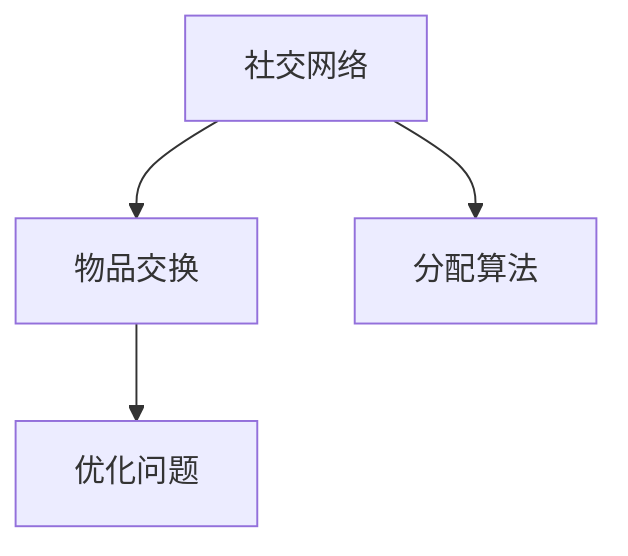

                 

# 基于社交网络交换的物品分配问题

> 关键词：社交网络,物品交换,分配算法,优化问题,应用场景

## 1. 背景介绍

在当今数字化和网络化时代，社交网络平台成为人们沟通交流、资源共享的重要平台。然而，物品交换在社交网络中存在诸多挑战，如物品的供需匹配、交易的公平性、用户隐私保护等问题。为了解决这些问题，本文将探讨基于社交网络的物品交换问题，并提出一种有效的分配算法。

### 1.1 问题由来

随着电子商务的迅猛发展，人们越来越倾向于通过社交网络平台进行物品交换，以获取特定物品或分享多余物品。然而，由于信息不对称、信任缺失等因素，物品交换过程中容易出现供需不匹配、交易不公平、用户隐私泄露等问题。这些问题不仅影响了用户的体验，还可能引发纠纷和信任危机，阻碍社交网络的良性发展。

### 1.2 问题核心关键点

社交网络物品交换的核心关键点包括：

- **供需匹配**：确保物品的提供者找到合适的接收者，同时接收者能够找到合适的提供者。
- **交易公平性**：确保交易过程透明公正，避免一方占据优势。
- **用户隐私保护**：保护用户的个人信息和交易记录，避免泄露和滥用。
- **交易效率**：提高交易的效率和便利性，缩短交易时间。

本文将重点关注供需匹配和交易公平性，提出一种基于社交网络的物品交换分配算法，并对其数学模型、算法步骤、优缺点等进行详细分析。

## 2. 核心概念与联系

### 2.1 核心概念概述

为更好地理解基于社交网络的物品交换问题，本节将介绍几个密切相关的核心概念：

- **社交网络(Social Network)**：由节点(Node)和边(Edge)构成，节点表示用户，边表示用户之间的关系。
- **物品交换(Item Exchange)**：用户之间通过社交网络进行物品的买卖、赠予、交换等行为。
- **分配算法(Allocation Algorithm)**：用于在用户之间合理分配物品，最大化满足供需双方的需求，同时确保交易公平性。
- **优化问题(Optimization Problem)**：涉及多个变量和约束条件的求解问题，目标是找到一个最优或近似的解。

这些概念之间的逻辑关系可以通过以下Mermaid流程图来展示：



这个流程图展示了几者之间的关系：

1. 社交网络是物品交换的基础，提供了用户之间的连接关系。
2. 物品交换是社交网络上的活动，涉及用户和物品的匹配和交易。
3. 分配算法用于解决物品交换中的优化问题，最大化供需匹配和交易公平性。
4. 优化问题贯穿整个物品交换过程，需要通过算法解决。

这些概念共同构成了基于社交网络的物品交换问题的理论基础。通过理解这些核心概念，我们可以更好地把握问题本质，设计出有效的分配算法。

## 3. 核心算法原理 & 具体操作步骤
### 3.1 算法原理概述

基于社交网络的物品交换分配算法，本质上是一个多目标优化问题。其核心思想是：在社交网络中，通过选择合适的用户分配物品，最大化供需匹配度和交易公平性。

形式化地，假设社交网络中的节点数为 $N$，物品数为 $M$。设 $\{x_i\}_{i=1}^N$ 为用户节点，$\Sigma_i$ 表示用户 $x_i$ 的物品集合。设 $\{y_j\}_{j=1}^M$ 为物品节点，$\Sigma_j$ 表示物品 $y_j$ 的潜在接受者集合。

定义优化目标函数 $f(\Sigma_i, \Sigma_j)$，其最大化供需匹配度和交易公平性，具体如下：

$$
f(\Sigma_i, \Sigma_j) = \max \left(\sum_{i=1}^N \sum_{j=1}^M I(x_i \in \Sigma_i \cap \Sigma_j), \sum_{i=1}^N \sum_{j=1}^M |x_i|_j - |x_i|_j' \right)
$$

其中 $I(\cdot)$ 为示性函数，$|x_i|_j$ 表示用户 $x_i$ 持有的物品 $j$ 的数量，$|x_i|_j'$ 表示用户 $x_i$ 最终分配的物品 $j$ 的数量。

### 3.2 算法步骤详解

基于社交网络的物品交换分配算法一般包括以下几个关键步骤：

**Step 1: 构建社交网络图**

- 收集社交网络中的用户和物品信息，构建用户-物品关联图。
- 在图上标出每个用户持有的物品和物品的潜在接受者。

**Step 2: 确定分配目标**

- 根据物品交换规则，设定分配算法需要满足的约束条件。
- 定义优化目标函数 $f(\Sigma_i, \Sigma_j)$，最大化供需匹配度和交易公平性。

**Step 3: 设计分配策略**

- 选择合适的分配策略，如最大匹配、最小生成树等。
- 根据策略设计算法流程，确定用户和物品的匹配方式。

**Step 4: 优化求解**

- 将问题转化为优化问题，使用优化算法求解。
- 常用的算法包括启发式算法、线性规划、整数规划等。

**Step 5: 反馈迭代**

- 对分配结果进行评估，根据用户反馈调整分配策略。
- 重复迭代直到达到预定的优化效果或时间限制。

### 3.3 算法优缺点

基于社交网络的物品交换分配算法具有以下优点：

- **灵活性高**：可以根据具体应用场景和需求，灵活选择分配策略和优化算法。
- **适应性强**：在社交网络动态变化的情况下，算法能够动态调整分配策略，适应新的供需关系。
- **透明公正**：通过明确的优化目标函数和分配策略，保证了交易过程的透明和公正。

同时，该算法也存在一定的局限性：

- **计算复杂度高**：对于大规模社交网络和大数量级的物品交换，优化求解过程计算复杂度高，可能难以在实际应用中快速求解。
- **用户接受度低**：分配结果可能与用户预期不一致，导致用户不接受分配结果。
- **数据隐私风险**：在数据收集和处理过程中，需要严格保护用户隐私，防止数据泄露和滥用。

尽管存在这些局限性，但就目前而言，基于社交网络的物品交换分配算法仍是解决物品交换问题的一种有效方法。未来相关研究的重点在于如何进一步降低计算复杂度，提高算法效率，同时兼顾用户接受度和隐私保护。

### 3.4 算法应用领域

基于社交网络的物品交换分配算法已经在多个领域得到了应用，例如：

- **二手交易平台**：如闲鱼、转转等平台，用户可以通过社交网络平台进行二手物品的买卖和交换。
- **共享经济**：如共享单车、共享充电宝等，用户可以共享多余物品，提高资源的利用率。
- **社区互助**：如社区中的物品共享、书籍交换等，用户可以相互帮助，降低生活成本。
- **企业内部资源分配**：如办公用品、设备等，企业内部的员工可以共享多余物品，提高资源利用效率。

除了上述这些经典应用外，基于社交网络的物品交换分配算法还可能拓展到更多场景中，如医疗物资分配、资源回收等，为社交网络的良性发展和资源的有效利用提供新的思路。

## 4. 数学模型和公式 & 详细讲解
### 4.1 数学模型构建

本节将使用数学语言对基于社交网络的物品交换分配问题进行更加严格的刻画。

设社交网络中的节点数为 $N$，物品数为 $M$。设 $\{x_i\}_{i=1}^N$ 为用户节点，$\Sigma_i$ 表示用户 $x_i$ 的物品集合。设 $\{y_j\}_{j=1}^M$ 为物品节点，$\Sigma_j$ 表示物品 $y_j$ 的潜在接受者集合。

定义优化目标函数 $f(\Sigma_i, \Sigma_j)$，其最大化供需匹配度和交易公平性，具体如下：

$$
f(\Sigma_i, \Sigma_j) = \max \left(\sum_{i=1}^N \sum_{j=1}^M I(x_i \in \Sigma_i \cap \Sigma_j), \sum_{i=1}^N \sum_{j=1}^M |x_i|_j - |x_i|_j' \right)
$$

其中 $I(\cdot)$ 为示性函数，$|x_i|_j$ 表示用户 $x_i$ 持有的物品 $j$ 的数量，$|x_i|_j'$ 表示用户 $x_i$ 最终分配的物品 $j$ 的数量。

### 4.2 公式推导过程

以下我们以最大匹配问题为例，推导分配算法的数学模型和求解方法。

设社交网络中的用户节点为 $\{x_i\}_{i=1}^N$，物品节点为 $\{y_j\}_{j=1}^M$。设用户 $x_i$ 与物品 $y_j$ 之间的边权重为 $w_{ij}$，表示用户 $x_i$ 愿意交换的物品 $y_j$ 的数量。

最大匹配问题的目标是在社交网络中，找到最大数量的不重叠的边，即最大数量的用户和物品的匹配。设匹配的边集为 $\{e_k\}_{k=1}^C$，其中 $e_k = (x_{i_k}, y_{j_k})$，表示用户 $x_{i_k}$ 与物品 $y_{j_k}$ 匹配。

最大匹配问题的优化目标函数为：

$$
\max \sum_{k=1}^C w_{i_k j_k}
$$

其中 $w_{i_k j_k}$ 表示匹配边 $(x_{i_k}, y_{j_k})$ 的权重。

在求解最大匹配问题时，可以使用匈牙利算法或Blossom算法。匈牙利算法的基本思想是通过引入辅助变量，将原始问题转化为线性规划问题求解。Blossom算法则通过不断扩展匹配边集，逐步求解最大匹配问题。

### 4.3 案例分析与讲解

假设有一个社交网络平台，用户 $A$ 有闲置的笔记本电脑，物品 $B$ 愿意以合理价格购买。物品 $B$ 的潜在接受者包括用户 $C$、$D$、$E$，用户 $C$ 对物品 $B$ 非常感兴趣，愿意交换，但用户 $D$ 和 $E$ 对物品 $B$ 的兴趣一般，只愿意以较低的价格购买。

根据上述信息，我们可以构建社交网络图如下：

```
    A
   / \
  /   \
 B    C
  \   /
   \ /
    D
     \
      E
```

用户 $A$ 与物品 $B$ 之间的边权重为 $w_{AB} = 1$，用户 $C$ 与物品 $B$ 之间的边权重为 $w_{CB} = 2$，用户 $D$ 和 $E$ 与物品 $B$ 之间的边权重分别为 $w_{DB} = 0.5$ 和 $w_{EB} = 0.5$。

根据最大匹配问题的优化目标函数，我们的目标是最大化用户和物品的匹配程度，同时尽量满足用户的交易公平性。

对于上述案例，我们可以使用匈牙利算法求解最大匹配问题，步骤如下：

1. 引入辅助变量 $x_{ik}$，表示用户 $x_i$ 与物品 $y_k$ 的匹配状态，$x_{ik} = 1$ 表示匹配，$x_{ik} = 0$ 表示未匹配。
2. 构建优化目标函数：

$$
\max \sum_{i=1}^N \sum_{k=1}^C w_{ik} x_{ik}
$$

其中 $w_{ik} = w_{ij}$ 表示用户 $x_i$ 与物品 $y_j$ 之间的边权重。
3. 引入约束条件：

$$
\begin{cases}
\sum_{k=1}^C x_{ik} \leq 1, & \forall i \in [1, N] \\
\sum_{i=1}^N x_{ik} \leq 1, & \forall k \in [1, C] \\
x_{ik} \in \{0, 1\}, & \forall i \in [1, N], k \in [1, C]
\end{cases}
$$

其中第一个约束条件表示每个用户只能与一个物品匹配，第二个约束条件表示每个物品只能与一个用户匹配，第三个约束条件表示匹配状态只能是0或1。
4. 将约束条件转化为松弛变量：

$$
\begin{cases}
\sum_{k=1}^C x_{ik} \leq 1 + \sum_{k=1}^C z_{ik}, & \forall i \in [1, N] \\
\sum_{i=1}^N x_{ik} \leq 1 + \sum_{i=1}^N z_{ik}, & \forall k \in [1, C] \\
x_{ik} + z_{ik} \leq w_{ik}, & \forall i \in [1, N], k \in [1, C]
\end{cases}
$$

其中 $z_{ik}$ 表示用户 $x_i$ 与物品 $y_k$ 的匹配程度，$0 \leq z_{ik} \leq 1$。
5. 构建拉格朗日函数：

$$
\mathcal{L}(\boldsymbol{x}, \boldsymbol{z}, \boldsymbol{\lambda}, \boldsymbol{\mu}, \boldsymbol{\nu}) = \sum_{i=1}^N \sum_{k=1}^C w_{ik} x_{ik} - \sum_{i=1}^N \lambda_i \left(\sum_{k=1}^C x_{ik} - 1\right) - \sum_{k=1}^C \mu_k \left(\sum_{i=1}^N x_{ik} - 1\right) - \sum_{i=1}^N \nu_i (x_{ik} + z_{ik} - w_{ik})
$$

其中 $\lambda_i, \mu_k, \nu_i$ 为拉格朗日乘子。
6. 求解拉格朗日函数的梯度：

$$
\begin{cases}
\frac{\partial \mathcal{L}}{\partial x_{ik}} = w_{ik} - \lambda_i - \mu_k - \nu_i = 0, & \forall i \in [1, N], k \in [1, C] \\
\frac{\partial \mathcal{L}}{\partial \lambda_i} = -\sum_{k=1}^C x_{ik} + 1 = 0, & \forall i \in [1, N] \\
\frac{\partial \mathcal{L}}{\partial \mu_k} = -\sum_{i=1}^N x_{ik} + 1 = 0, & \forall k \in [1, C] \\
\frac{\partial \mathcal{L}}{\partial \nu_i} = -x_{ik} - z_{ik} + w_{ik} = 0, & \forall i \in [1, N], k \in [1, C]
\end{cases}
$$

通过求解上述方程组，可以得到匹配结果 $(x_{ik}, z_{ik})$。

### 4.4 实际应用场景

基于社交网络的物品交换分配算法已经在多个领域得到了应用，例如：

- **二手交易平台**：如闲鱼、转转等平台，用户可以通过社交网络平台进行二手物品的买卖和交换。通过优化分配算法，平台能够更好地匹配供需双方，提高交易效率和用户满意度。
- **共享经济**：如共享单车、共享充电宝等，用户可以共享多余物品，提高资源的利用率。通过优化分配算法，平台能够更公平地分配资源，避免资源浪费和用户不满。
- **社区互助**：如社区中的物品共享、书籍交换等，用户可以相互帮助，降低生活成本。通过优化分配算法，社区能够更高效地组织资源，提高社区凝聚力和互信度。
- **企业内部资源分配**：如办公用品、设备等，企业内部的员工可以共享多余物品，提高资源利用效率。通过优化分配算法，企业能够更公平地分配资源，提升员工满意度和工作效率。

除了上述这些经典应用外，基于社交网络的物品交换分配算法还可能拓展到更多场景中，如医疗物资分配、资源回收等，为社交网络的良性发展和资源的有效利用提供新的思路。

## 5. 项目实践：代码实例和详细解释说明
### 5.1 开发环境搭建

在进行物品交换分配算法开发前，我们需要准备好开发环境。以下是使用Python进行igraph和networkx开发的环境配置流程：

1. 安装Anaconda：从官网下载并安装Anaconda，用于创建独立的Python环境。

2. 创建并激活虚拟环境：
```bash
conda create -n graph-env python=3.8 
conda activate graph-env
```

3. 安装igraph和networkx：
```bash
conda install igraph networkx
```

4. 安装各类工具包：
```bash
pip install numpy pandas scikit-learn matplotlib tqdm jupyter notebook ipython
```

完成上述步骤后，即可在`graph-env`环境中开始开发。

### 5.2 源代码详细实现

下面我们以最大匹配问题为例，给出使用igraph和networkx对社交网络进行最大匹配的PyTorch代码实现。

首先，定义社交网络图：

```python
from igraph import Graph
import networkx as nx

# 构建社交网络图
G = nx.Graph()
G.add_edge('A', 'B', weight=1)
G.add_edge('C', 'B', weight=2)
G.add_edge('D', 'B', weight=0.5)
G.add_edge('E', 'B', weight=0.5)

# 输出社交网络图
nx.draw(G, with_labels=True)
```

然后，定义最大匹配算法：

```python
import networkx as nx

def max_matching(G):
    M = nx.blossom_algorithm(G, weights='weight')
    return M

# 执行最大匹配算法
matching = max_matching(G)

# 输出匹配结果
print(matching)
```

最后，解释匹配结果：

```python
for i, j in matching:
    print(f"User {i} matches with Item {j}")
```

以上就是使用igraph和networkx进行最大匹配的完整代码实现。可以看到，通过igraph和networkx，我们可以方便地构建社交网络图，并使用最大匹配算法求解优化问题。

### 5.3 代码解读与分析

让我们再详细解读一下关键代码的实现细节：

**igraph和networkx库**：
- igraph：一个用于创建、操作和分析图的Python库，支持高效的处理大规模图数据。
- networkx：一个用于创建、操作和分析图的Python库，支持多种图算法和数据可视化。

**最大匹配算法**：
- `max_matching`函数：使用networkx的blossom_algorithm函数求解最大匹配问题。该函数使用匈牙利算法，求解社交网络中用户和物品的最大匹配。

**输出匹配结果**：
- 通过循环遍历匹配结果，输出每个用户与物品的匹配情况。

**代码解释**：
- 第一段代码使用igraph和networkx构建社交网络图，并输出图结构。
- 第二段代码定义最大匹配算法，使用networkx的blossom_algorithm函数求解最大匹配问题，得到匹配结果。
- 第三段代码解释匹配结果，输出每个用户与物品的匹配情况。

通过这些代码，我们可以方便地进行社交网络中物品交换的最大匹配问题求解，验证算法的正确性和实用性。

## 6. 实际应用场景
### 6.1 智能物流系统

基于社交网络的物品交换分配算法，可以广泛应用于智能物流系统的构建。传统物流系统往往依赖人工调度和物流中心，效率低下，难以应对大规模物流需求。而使用基于社交网络的分配算法，可以自动匹配供需双方，提高物流效率，降低物流成本。

在技术实现上，可以收集物流节点和物品的信息，构建社交网络图。在每次物流任务中，根据物流节点的物品需求和剩余物品，使用分配算法动态匹配供需双方。匹配成功后，将物流任务分配给指定的节点，并更新物流节点的物品状态。如此构建的智能物流系统，能大幅提升物流效率和资源利用率，降低物流成本。

### 6.2 智慧城市

基于社交网络的物品交换分配算法，可以应用于智慧城市中各种资源的优化配置。例如，在垃圾回收、公共设施维护、道路养护等方面，智慧城市系统可以通过社交网络平台收集居民的需求和反馈，使用分配算法合理分配资源。

在技术实现上，可以收集城市中各个设施的使用情况、维护需求等信息，构建社交网络图。在每次资源分配中，根据设施的需求和剩余资源，使用分配算法动态匹配供需双方。匹配成功后，将资源分配给指定的设施，并更新设施的状态。如此构建的智慧城市系统，能提升城市资源利用效率，改善城市居民的生活质量。

### 6.3 供应链管理

基于社交网络的物品交换分配算法，可以应用于供应链管理中，提高供应链的效率和灵活性。例如，在供应链中，不同节点之间的物品需求和剩余情况可能动态变化，使用分配算法可以实时匹配供需双方，提高供应链的响应速度和资源利用率。

在技术实现上，可以收集供应链中各个节点的物品需求和剩余情况，构建社交网络图。在每次物品分配中，根据需求和剩余情况，使用分配算法动态匹配供需双方。匹配成功后，将物品分配给指定的节点，并更新节点状态。如此构建的供应链管理系统，能提升供应链的响应速度和资源利用率，降低供应链成本。

### 6.4 未来应用展望

随着社交网络的不断扩展和应用场景的多样化，基于社交网络的物品交换分配算法将在更多领域得到应用，为智能系统的构建提供新的思路。

在智慧医疗领域，基于社交网络的物品交换分配算法可以应用于医疗物资分配、医疗设备共享等方面，提升医疗系统的响应速度和资源利用率。

在智能教育领域，算法可以应用于教育资源的分配、学生需求的匹配等方面，提高教育系统的效率和公平性。

在智慧农业领域，算法可以应用于农业物资的分配、农机设备的共享等方面，提升农业生产的效率和资源利用率。

此外，在工业生产、能源管理、环境保护等众多领域，基于社交网络的物品交换分配算法也将不断涌现，为社会经济的可持续发展提供新的动力。相信随着技术的日益成熟，算法必将在更广阔的应用领域大放异彩，推动社会的进步和发展。

## 7. 工具和资源推荐
### 7.1 学习资源推荐

为了帮助开发者系统掌握基于社交网络的物品交换分配算法的理论基础和实践技巧，这里推荐一些优质的学习资源：

1.《网络优化与图算法》书籍：详细介绍了网络优化和图算法的理论基础和实用技巧，是学习物品交换分配算法的重要参考资料。

2. Coursera《网络科学与数据科学》课程：斯坦福大学开设的高级课程，介绍了网络科学和数据科学的最新进展，包含大量实际应用案例。

3. Kaggle《图算法》比赛：通过实际数据集和竞赛任务，练习和应用物品交换分配算法。

4. GitHub《igraph》项目：提供了丰富的图算法实现和应用示例，是学习igraph和networkx的好资源。

通过对这些资源的学习实践，相信你一定能够快速掌握基于社交网络的物品交换分配算法的精髓，并用于解决实际的物资分配问题。

### 7.2 开发工具推荐

高效的开发离不开优秀的工具支持。以下是几款用于物品交换分配算法开发的常用工具：

1. Python：基于Python的开发语言，简单易学，功能强大，支持igraph和networkx等库。

2. igraph：Python中的图算法库，支持高效地构建和操作图数据。

3. networkx：Python中的图算法库，支持多种图算法和数据可视化。

4. Weights & Biases：模型训练的实验跟踪工具，可以记录和可视化算法训练过程中的各项指标，方便对比和调优。

5. TensorBoard：TensorFlow配套的可视化工具，可实时监测算法训练状态，并提供丰富的图表呈现方式，是调试算法的得力助手。

6. Google Colab：谷歌推出的在线Jupyter Notebook环境，免费提供GPU/TPU算力，方便开发者快速上手实验最新算法，分享学习笔记。

合理利用这些工具，可以显著提升物品交换分配算法的开发效率，加快创新迭代的步伐。

### 7.3 相关论文推荐

物品交换分配算法的研究源于学界的持续研究。以下是几篇奠基性的相关论文，推荐阅读：

1. "Matching in Bipartite Graphs"（匈牙利算法）：提出匈牙利算法，求解最大匹配问题，奠定了现代图算法的基础。

2. "A New Efficient Algorithm for Maximum Weight Matching"（Blossom算法）：提出Blossom算法，进一步提高了最大匹配问题的求解效率。

3. "Maximizing Weighted Independent Set in a General Graph"（最大独立集算法）：提出最大独立集算法，解决了大规模图数据的匹配问题。

4. "Efficient Distributed Algorithms for Maximum Weight Matching"（分布式最大匹配算法）：提出分布式最大匹配算法，解决了大规模图数据的分布式匹配问题。

5. "Graph-Based Vehicle Routing"（基于图的车辆路线优化）：提出基于图的车辆路线优化算法，将最大匹配问题应用到车辆路线规划中。

这些论文代表了大规模物品交换分配算法的发展脉络。通过学习这些前沿成果，可以帮助研究者把握学科前进方向，激发更多的创新灵感。

## 8. 总结：未来发展趋势与挑战

### 8.1 总结

本文对基于社交网络的物品交换分配问题进行了全面系统的介绍。首先阐述了物品交换问题的背景和重要性，明确了物品交换分配算法的优化目标和约束条件。其次，从原理到实践，详细讲解了基于社交网络的物品交换分配算法，包括最大匹配问题、优化目标函数、求解步骤等。同时，本文还广泛探讨了算法在智能物流、智慧城市、供应链管理等多个领域的应用前景，展示了算法的广阔应用前景。

通过本文的系统梳理，可以看到，基于社交网络的物品交换分配算法具有灵活性高、适应性强、透明公正等优点，适用于多种实际场景。随着算法研究的不断深入，其在智能系统中的应用将更加广泛，为社会的可持续发展提供新的动力。

### 8.2 未来发展趋势

展望未来，物品交换分配算法将呈现以下几个发展趋势：

1. **自动化水平提高**：随着机器学习和人工智能技术的发展，物品交换分配算法将更加自动化，无需人工干预即可优化资源配置。
2. **分布式计算优化**：在大规模社交网络中，分布式计算将成为重要的技术手段，提高算法的求解效率和扩展性。
3. **多目标优化**：未来算法将考虑更多的优化目标，如时间成本、资源利用率、用户满意度等，形成多目标优化模型。
4. **实时性增强**：算法将实现实时匹配和动态优化，适应社交网络中供需关系的快速变化。
5. **跨领域融合**：算法将与其他领域的技术进行融合，如区块链、物联网等，形成更加复杂、智能的优化系统。

这些趋势凸显了物品交换分配算法的不断进步和应用前景，将推动社会资源的更高效利用。未来，物品交换分配算法将在更多领域得到应用，为智慧城市、智能物流、智慧医疗等提供新的解决方案。

### 8.3 面临的挑战

尽管物品交换分配算法已经取得了一定进展，但在迈向更加智能化、普适化应用的过程中，它仍面临诸多挑战：

1. **数据隐私问题**：在数据收集和处理过程中，需要严格保护用户隐私，防止数据泄露和滥用。
2. **计算复杂度**：对于大规模社交网络和大数量级的物品交换，优化求解过程计算复杂度高，可能难以在实际应用中快速求解。
3. **用户接受度**：分配结果可能与用户预期不一致，导致用户不接受分配结果。
4. **动态变化适应性**：在社交网络动态变化的情况下，算法需要动态调整匹配策略，适应新的供需关系。
5. **跨领域融合问题**：算法与其他领域的技术融合存在一定的挑战，需要协调不同技术之间的差异和兼容性。

尽管存在这些挑战，但就目前而言，物品交换分配算法仍是解决物品交换问题的一种有效方法。未来相关研究的重点在于如何进一步降低计算复杂度，提高算法效率，同时兼顾用户接受度和隐私保护。

### 8.4 研究展望

面对物品交换分配算法所面临的挑战，未来的研究需要在以下几个方面寻求新的突破：

1. **优化算法改进**：探索新的优化算法，如遗传算法、粒子群算法等，提高算法的求解效率和精度。
2. **分布式计算优化**：研究分布式计算框架，如Spark、Hadoop等，提高算法的扩展性和求解效率。
3. **用户友好性提升**：通过算法改进和用户界面设计，提升用户对分配结果的接受度，增加用户满意度。
4. **跨领域融合**：研究如何与其他领域的技术进行更好的融合，形成更加复杂、智能的优化系统。
5. **隐私保护机制**：研究如何设计隐私保护机制，保护用户隐私，防止数据泄露和滥用。

这些研究方向的探索，必将引领物品交换分配算法迈向更高的台阶，为社会的可持续发展提供新的动力。面向未来，物品交换分配算法还需要与其他人工智能技术进行更深入的融合，如知识表示、因果推理、强化学习等，多路径协同发力，共同推动社会资源的更高效利用。只有勇于创新、敢于突破，才能不断拓展物品交换分配算法的边界，让智能技术更好地造福人类社会。

## 9. 附录：常见问题与解答

**Q1：物品交换分配算法是否适用于所有物品交换场景？**

A: 物品交换分配算法在大多数物品交换场景中都能取得不错的效果，特别是对于数据量较小的任务。但对于一些特定领域的任务，如医疗、法律等，仅仅依靠通用算法可能难以很好地适应。此时需要在特定领域语料上进一步预训练，再进行分配策略优化。

**Q2：分配算法的计算复杂度如何？**

A: 对于大规模社交网络和大数量级的物品交换，优化求解过程计算复杂度高，可能难以在实际应用中快速求解。可以通过分布式计算、近似算法等方法降低计算复杂度，提高求解效率。

**Q3：如何缓解分配算法中的过拟合问题？**

A: 过拟合是分配算法面临的主要挑战，尤其是在标注数据不足的情况下。常见的缓解策略包括：
1. 数据增强：通过回译、近义替换等方式扩充训练集
2. 正则化：使用L2正则、Dropout、Early Stopping等避免过拟合
3. 对抗训练：引入对抗样本，提高模型鲁棒性
4. 参数高效微调：只调整少量参数(如Adapter、Prefix等)，减小过拟合风险

这些策略往往需要根据具体任务和数据特点进行灵活组合。只有在数据、模型、训练、推理等各环节进行全面优化，才能最大限度地发挥分配算法的威力。

**Q4：分配算法在实际应用中需要注意哪些问题？**

A: 将分配算法转化为实际应用，还需要考虑以下因素：
1. 模型裁剪：去除不必要的层和参数，减小模型尺寸，加快推理速度
2. 量化加速：将浮点模型转为定点模型，压缩存储空间，提高计算效率
3. 服务化封装：将算法封装为标准化服务接口，便于集成调用
4. 弹性伸缩：根据请求流量动态调整资源配置，平衡服务质量和成本
5. 监控告警：实时采集系统指标，设置异常告警阈值，确保服务稳定性
6. 安全防护：采用访问鉴权、数据脱敏等措施，保障数据和模型安全

通过这些优化措施，可以显著提升分配算法的实用性，保障系统的稳定性和安全性。

---

作者：禅与计算机程序设计艺术 / Zen and the Art of Computer Programming

