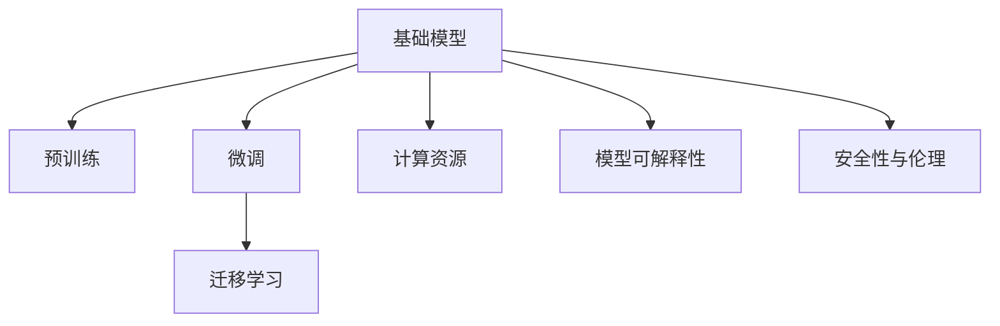

                 

# 基础模型在科技产业的影响

## 1. 背景介绍

### 1.1 问题由来
在过去的几十年中，科技产业经历了翻天覆地的变化。从最初的硬件驱动，到如今的算法主导，科技产业的重心逐渐转向了人工智能（AI）和机器学习（ML）技术的突破。其中，基础模型（Foundation Models）作为一种革命性的技术，正逐渐成为推动科技产业发展的核心驱动力。基础模型通过大量无标签数据进行预训练，学习到广泛的通用知识，并在特定任务上进行调整微调，实现了在多个领域的高性能表现。

### 1.2 问题核心关键点
基础模型的核心关键点在于其庞大的数据规模、复杂的模型结构和强大的泛化能力。通过在大规模数据集上进行自监督预训练，这些模型能够学习到丰富的语言、图像、声音等数据的表示能力，并在下游任务上进行微调，快速适应新的任务需求。此外，基础模型的开发和应用还需要解决诸如计算资源需求、模型可解释性、安全性与伦理问题等挑战。

### 1.3 问题研究意义
基础模型的研究和应用对于推动科技产业的进步具有重要意义：
- **降低研发成本**：基础模型能够大幅降低开发复杂任务所需的计算资源和人力成本。
- **提升应用效果**：通过微调，基础模型能够在特定任务上取得比从头训练模型更好的性能。
- **加速技术迭代**：基础模型的快速迭代能力，使得科技公司在产品开发过程中能够迅速响应市场变化。
- **促进跨领域应用**：基础模型能够应用于多个领域，推动AI技术在不同行业的广泛应用。

## 2. 核心概念与联系

### 2.1 核心概念概述

- **基础模型**：一种通过在大规模数据集上进行自监督预训练，学习到广泛通用知识的大型预训练模型。常见的基础模型包括BERT、GPT、DALL·E等。

- **预训练**：指在大规模无标签数据集上进行自监督学习，学习模型对数据表示的通用能力。预训练过程中，模型通过预测缺失的数据或者对比相似数据等方法，逐步提升对数据的理解和表示能力。

- **微调**：指在预训练模型基础上，使用特定任务的数据进行有监督学习，调整模型以适应该任务的需求。微调过程中，模型通常仅调整顶层或部分层，以避免破坏预训练的通用能力。

- **迁移学习**：指将预训练模型在特定任务上的知识迁移应用到其他相似任务上的学习范式。迁移学习通过在预训练模型上进行微调，使得模型能够快速适应新任务，减少从头训练模型所需的计算资源和时间。

- **计算资源**：基础模型的训练和应用需要强大的计算资源支持。常见的计算资源包括高性能计算集群、GPU、TPU等。

- **模型可解释性**：基础模型通常被视为“黑箱”，其内部工作机制难以解释。模型可解释性问题对于科技产业的应用推广尤为关键，特别是在医疗、金融等高风险领域。

- **安全性与伦理**：基础模型可能学习到有偏见或有害信息，这些信息可能通过微调传递到下游任务中，导致偏见、误导或歧视。因此，确保模型的安全性与伦理使用成为基础模型应用中的重要问题。

这些核心概念之间的逻辑关系可以通过以下Mermaid流程图来展示：



这个流程图展示了大模型及其相关概念之间的联系，突出了预训练、微调和迁移学习在基础模型开发和应用中的关键作用，同时也强调了计算资源、模型可解释性、安全性与伦理等重要问题。

## 3. 核心算法原理 & 具体操作步骤
### 3.1 算法原理概述

基础模型的核心算法原理主要基于深度学习模型，特别是神经网络模型。其核心思想是通过在大规模无标签数据集上进行自监督预训练，学习到广泛的通用知识，并在特定任务上进行微调，以适应新任务的需求。

基础模型的训练通常分为两个阶段：
1. 预训练阶段：在大量无标签数据上训练模型，学习通用的数据表示能力。
2. 微调阶段：在特定任务的数据集上进行微调，调整模型以适应该任务的需求。

在预训练阶段，基础模型通常采用自监督学习任务，如掩码语言模型（Masked Language Model, MLM）、自回归模型（Auto-Regressive Model, ARM）、图像生成任务等。这些任务旨在学习模型对数据的表示能力，并减少过拟合的风险。

在微调阶段，基础模型通常使用有标签数据集进行微调，通过有监督学习调整模型的参数，使其能够更准确地完成特定任务。微调过程通常采用小批量梯度下降算法（Stochastic Gradient Descent, SGD）或其变种，如AdamW、RMSprop等。

### 3.2 算法步骤详解

以下详细讲解基础模型的预训练和微调过程：

**预训练过程**：
1. **数据准备**：收集大规模无标签数据集，如维基百科、新闻文章、图像数据等。
2. **模型初始化**：选择适合的基础模型，如BERT、GPT等，进行模型初始化。
3. **自监督任务**：设计自监督任务，如MLM、ARM等，并在模型上进行训练。
4. **参数更新**：通过反向传播算法更新模型参数，最小化预测误差。

**微调过程**：
1. **任务适配**：根据特定任务的需求，调整模型的输出层和损失函数。
2. **数据集准备**：收集特定任务的标注数据集，并划分为训练集、验证集和测试集。
3. **模型初始化**：将预训练模型作为初始化参数。
4. **微调训练**：在特定任务的数据集上进行微调训练，调整模型以适应该任务的需求。
5. **模型评估**：在测试集上评估微调后模型的性能，对比预训练模型和微调模型的性能差异。

### 3.3 算法优缺点

基础模型的预训练和微调方法具有以下优点：
1. **高效性**：基础模型能够在大规模数据上预训练，学习到广泛的通用知识，并在特定任务上进行微调，效率较高。
2. **泛化能力强**：基础模型通过预训练学习到通用的数据表示能力，能够在多个任务上表现优异。
3. **迁移学习能力强**：基础模型通过迁移学习，能够快速适应新任务，减少从头训练模型所需的计算资源和时间。

同时，基础模型也存在以下缺点：
1. **计算资源需求高**：基础模型的预训练和微调需要强大的计算资源支持，如高性能计算集群、GPU、TPU等。
2. **模型可解释性差**：基础模型通常被视为“黑箱”，其内部工作机制难以解释，难以理解模型的决策过程。
3. **安全性与伦理问题**：基础模型可能学习到有偏见或有害信息，这些信息可能通过微调传递到下游任务中，导致偏见、误导或歧视。
4. **过拟合风险**：基础模型可能在大规模数据上进行过拟合，需要额外的正则化技术来避免过拟合。

### 3.4 算法应用领域

基础模型在多个领域中得到了广泛的应用，包括但不限于：

- **自然语言处理（NLP）**：基础模型可以用于文本分类、情感分析、机器翻译、问答系统等任务。
- **计算机视觉（CV）**：基础模型可以用于图像分类、物体检测、图像生成等任务。
- **语音处理**：基础模型可以用于语音识别、语音合成、语音情感分析等任务。
- **智能推荐系统**：基础模型可以用于个性化推荐、广告推荐、内容推荐等任务。
- **金融科技**：基础模型可以用于信用评分、欺诈检测、投资策略等任务。
- **医疗健康**：基础模型可以用于疾病预测、病历分析、药物研发等任务。

## 4. 数学模型和公式 & 详细讲解 & 举例说明

### 4.1 数学模型构建

假设基础模型为$M_{\theta}$，其中$\theta$为模型参数。预训练过程通常采用自监督学习任务，如掩码语言模型（Masked Language Model, MLM）。掩码语言模型通过预测被掩码的词语，学习模型的语言表示能力。

掩码语言模型的损失函数为：
$$
\mathcal{L}_{\text{MLM}} = -\sum_{i=1}^N \log P(y_i | x_i)
$$
其中$x_i$为输入的文本，$y_i$为被掩码的词语，$P(y_i | x_i)$为模型预测该词语的概率分布。

在微调阶段，假设特定任务的标注数据集为$D=\{(x_i, y_i)\}_{i=1}^N$，其中$x_i$为输入，$y_i$为标签。微调的损失函数为：
$$
\mathcal{L}_{\text{Fine-tuning}} = \sum_{i=1}^N \ell(M_{\theta}(x_i), y_i)
$$
其中$\ell$为任务特定的损失函数，如交叉熵损失函数。

### 4.2 公式推导过程

以文本分类任务为例，假设模型$M_{\theta}$的输出为$\hat{y}=M_{\theta}(x) \in [0,1]$，表示样本属于正类的概率。真实标签$y \in \{0,1\}$。则二分类交叉熵损失函数定义为：
$$
\ell(M_{\theta}(x),y) = -[y\log \hat{y} + (1-y)\log (1-\hat{y})]
$$

将其代入微调的损失函数，得：
$$
\mathcal{L}_{\text{Fine-tuning}} = -\sum_{i=1}^N [y_i\log \hat{y}_i+(1-y_i)\log(1-\hat{y}_i)]
$$

根据链式法则，损失函数对参数$\theta_k$的梯度为：
$$
\frac{\partial \mathcal{L}_{\text{Fine-tuning}}}{\partial \theta_k} = -\sum_{i=1}^N (\frac{y_i}{\hat{y}_i}-\frac{1-y_i}{1-\hat{y}_i}) \frac{\partial M_{\theta}(x_i)}{\partial \theta_k}
$$

其中$\frac{\partial M_{\theta}(x_i)}{\partial \theta_k}$可进一步递归展开，利用自动微分技术完成计算。

### 4.3 案例分析与讲解

以BERT模型为例，BERT模型在文本分类任务上的微调过程如下：
1. **数据准备**：收集特定任务的标注数据集，划分为训练集、验证集和测试集。
2. **模型初始化**：使用BERT模型作为初始化参数。
3. **任务适配**：将BERT模型作为文本分类的基础模型，使用输出层和交叉熵损失函数。
4. **微调训练**：在训练集上使用小批量梯度下降算法，更新模型参数。
5. **模型评估**：在验证集上评估模型性能，调整学习率等超参数。
6. **测试集测试**：在测试集上测试模型性能，对比预训练模型和微调模型的效果。

## 5. 项目实践：代码实例和详细解释说明

### 5.1 开发环境搭建

在进行基础模型微调实践前，需要先准备好开发环境。以下是使用Python进行TensorFlow开发的环境配置流程：

1. 安装Anaconda：从官网下载并安装Anaconda，用于创建独立的Python环境。
2. 创建并激活虚拟环境：
```bash
conda create -n tf-env python=3.8 
conda activate tf-env
```

3. 安装TensorFlow：根据CUDA版本，从官网获取对应的安装命令。例如：
```bash
conda install tensorflow=2.6 -c pytorch -c conda-forge
```

4. 安装各类工具包：
```bash
pip install numpy pandas scikit-learn matplotlib tqdm jupyter notebook ipython
```

完成上述步骤后，即可在`tf-env`环境中开始基础模型微调的实践。

### 5.2 源代码详细实现

以下以BERT模型在文本分类任务上的微调为例，给出使用TensorFlow进行基础模型微调的代码实现。

首先，定义文本分类的数据处理函数：

```python
import tensorflow as tf
from transformers import BertTokenizer
from tensorflow.keras.preprocessing.text import Tokenizer
from tensorflow.keras.preprocessing.sequence import pad_sequences

tokenizer = BertTokenizer.from_pretrained('bert-base-cased')
max_len = 256

# 构建数据生成器
def generate_data(data, batch_size):
    while True:
        for i in range(0, len(data), batch_size):
            batch = data[i:i+batch_size]
            x, y = [], []
            for text, label in batch:
                tokenized_text = tokenizer.encode_plus(text, max_length=max_len, padding='max_length', truncation=True, return_tensors='tf')
                x.append(tokenized_text['input_ids'])
                y.append(label)
            yield pad_sequences(x, padding='post'), tf.convert_to_tensor(y)

# 构建数据集
train_dataset = tf.data.Dataset.from_generator(lambda: generate_data(train_data, batch_size=16), (tf.int32, tf.int32), (tf.int32, tf.int32))
train_dataset = train_dataset.shuffle(buffer_size=1024).batch(16).repeat()

dev_dataset = tf.data.Dataset.from_generator(lambda: generate_data(dev_data, batch_size=16), (tf.int32, tf.int32), (tf.int32, tf.int32))
dev_dataset = dev_dataset.batch(16).repeat()

test_dataset = tf.data.Dataset.from_generator(lambda: generate_data(test_data, batch_size=16), (tf.int32, tf.int32), (tf.int32, tf.int32))
test_dataset = test_dataset.batch(16)
```

然后，定义基础模型和优化器：

```python
from transformers import BertForSequenceClassification

model = BertForSequenceClassification.from_pretrained('bert-base-cased', num_labels=num_classes, output_attentions=False, output_hidden_states=False)

optimizer = tf.keras.optimizers.Adam(learning_rate=2e-5, epsilon=1e-08, clipnorm=1.0)

checkpoint = tf.keras.callbacks.ModelCheckpoint('model.h5', save_best_only=True)
```

接着，定义训练和评估函数：

```python
from tensorflow.keras.metrics import BinaryCrossentropy, Precision, Recall

def train_epoch(model, dataset, optimizer, checkpoint):
    model.compile(loss='binary_crossentropy', optimizer=optimizer, metrics=[Precision(), Recall()])
    model.fit(dataset, epochs=1, validation_data=dev_dataset, callbacks=[checkpoint])

def evaluate(model, dataset, batch_size):
    model.evaluate(dataset, batch_size=batch_size)
```

最后，启动训练流程并在测试集上评估：

```python
epochs = 3
batch_size = 16

for epoch in range(epochs):
    train_epoch(model, train_dataset, optimizer, checkpoint)
    evaluate(model, dev_dataset, batch_size)
    
print("Test results:")
evaluate(model, test_dataset, batch_size)
```

以上就是使用TensorFlow对BERT模型进行文本分类任务微调的完整代码实现。可以看到，得益于TensorFlow的强大封装，我们能够用相对简洁的代码完成BERT模型的加载和微调。

### 5.3 代码解读与分析

让我们再详细解读一下关键代码的实现细节：

**generate_data函数**：
- 生成数据的函数，用于将文本数据转换为TensorFlow模型所需的格式。
- 使用BertTokenizer进行分词，将文本转换为token ids，并添加padding和truncation。
- 构建数据生成器，以便进行批量处理和无限迭代。

**数据集定义**：
- 定义训练集、验证集和测试集的数据生成器，并使用shuffle和batch等操作进行数据增强。
- 使用pad_sequences函数将token ids转换为TensorFlow可接受的格式。

**模型定义**：
- 使用BertForSequenceClassification类定义模型，选择适合的基础模型和输出层。
- 定义Adam优化器，并设置学习率、epsilon和clipnorm等超参数。
- 使用ModelCheckpoint回调函数，保存模型在验证集上性能最优时的权重。

**训练和评估函数**：
- 使用compile函数定义模型，选择损失函数和优化器。
- 使用fit函数进行训练，设置epochs、batch size和验证集等参数。
- 使用evaluate函数评估模型性能，输出模型的精度和召回率等指标。

**训练流程**：
- 定义总的epoch数和batch size，开始循环迭代
- 每个epoch内，先在训练集上训练，输出平均loss和模型权重
- 在验证集上评估，调整学习率等超参数
- 重复上述过程直至满足预设的epoch数或验证集性能不再提升

可以看到，TensorFlow配合BERT模型的封装，使得微调过程的代码实现变得简洁高效。开发者可以将更多精力放在数据处理、模型改进等高层逻辑上，而不必过多关注底层的实现细节。

当然，工业级的系统实现还需考虑更多因素，如模型的保存和部署、超参数的自动搜索、更灵活的任务适配层等。但核心的微调范式基本与此类似。

## 6. 实际应用场景
### 6.1 智能客服系统

基于基础模型微调的对话技术，可以广泛应用于智能客服系统的构建。传统客服往往需要配备大量人力，高峰期响应缓慢，且一致性和专业性难以保证。使用基础模型进行微调，智能客服系统能够7x24小时不间断服务，快速响应客户咨询，用自然流畅的语言解答各类常见问题。

在技术实现上，可以收集企业内部的历史客服对话记录，将问题和最佳答复构建成监督数据，在此基础上对基础模型进行微调。微调后的对话模型能够自动理解用户意图，匹配最合适的答案模板进行回复。对于客户提出的新问题，还可以接入检索系统实时搜索相关内容，动态组织生成回答。如此构建的智能客服系统，能大幅提升客户咨询体验和问题解决效率。

### 6.2 金融舆情监测

金融机构需要实时监测市场舆论动向，以便及时应对负面信息传播，规避金融风险。传统的人工监测方式成本高、效率低，难以应对网络时代海量信息爆发的挑战。基于基础模型微调的文本分类和情感分析技术，为金融舆情监测提供了新的解决方案。

具体而言，可以收集金融领域相关的新闻、报道、评论等文本数据，并对其进行主题标注和情感标注。在此基础上对基础模型进行微调，使其能够自动判断文本属于何种主题，情感倾向是正面、中性还是负面。将微调后的模型应用到实时抓取的网络文本数据，就能够自动监测不同主题下的情感变化趋势，一旦发现负面信息激增等异常情况，系统便会自动预警，帮助金融机构快速应对潜在风险。

### 6.3 个性化推荐系统

当前的推荐系统往往只依赖用户的历史行为数据进行物品推荐，无法深入理解用户的真实兴趣偏好。基于基础模型的个性化推荐系统可以更好地挖掘用户行为背后的语义信息，从而提供更精准、多样的推荐内容。

在实践中，可以收集用户浏览、点击、评论、分享等行为数据，提取和用户交互的物品标题、描述、标签等文本内容。将文本内容作为模型输入，用户的后续行为（如是否点击、购买等）作为监督信号，在此基础上微调基础模型。微调后的模型能够从文本内容中准确把握用户的兴趣点。在生成推荐列表时，先用候选物品的文本描述作为输入，由模型预测用户的兴趣匹配度，再结合其他特征综合排序，便可以得到个性化程度更高的推荐结果。

### 6.4 未来应用展望

随着基础模型的不断发展，其在科技产业中的应用前景广阔：

1. **智慧医疗**：在医疗领域，基础模型可以用于疾病预测、病历分析、药物研发等任务，提升医疗服务的智能化水平。
2. **智能教育**：在教育领域，基础模型可以用于作业批改、学情分析、知识推荐等任务，因材施教，促进教育公平，提高教学质量。
3. **智慧城市治理**：在城市管理领域，基础模型可以用于城市事件监测、舆情分析、应急指挥等环节，提高城市管理的自动化和智能化水平，构建更安全、高效的未来城市。
4. **智能制造**：在工业领域，基础模型可以用于设备维护、生产调度、质量控制等任务，推动制造业的数字化、智能化转型。
5. **智能金融**：在金融领域，基础模型可以用于信用评分、欺诈检测、投资策略等任务，提升金融服务的智能化水平。

此外，基础模型还将在更多领域得到应用，为传统行业数字化转型升级提供新的技术路径。

## 7. 工具和资源推荐
### 7.1 学习资源推荐

为了帮助开发者系统掌握基础模型的理论基础和实践技巧，这里推荐一些优质的学习资源：

1. **《Deep Learning》**：由Ian Goodfellow、Yoshua Bengio、Aaron Courville等专家合著的经典教材，全面介绍了深度学习的基本概念、算法和应用。
2. **Coursera《Deep Learning Specialization》**：由Andrew Ng教授主讲的深度学习系列课程，系统讲解深度学习的基本原理和应用技术。
3. **《Transformer》**：Hugging Face出版的关于Transformer的专著，详细介绍了Transformer的结构和应用，包括基础模型的预训练和微调技术。
4. **ArXiv论文库**：访问和下载最新的基础模型和微调论文，跟踪研究进展。
5. **Kaggle竞赛平台**：参与NLP领域的竞赛，积累实践经验，了解最新的技术和算法。

通过对这些资源的学习实践，相信你一定能够快速掌握基础模型的微调技术，并用于解决实际的NLP问题。

### 7.2 开发工具推荐

高效的开发离不开优秀的工具支持。以下是几款用于基础模型微调开发的常用工具：

1. **TensorFlow**：由Google开发的深度学习框架，支持GPU加速，提供丰富的API和模型库。
2. **PyTorch**：由Facebook开发的深度学习框架，灵活性高，支持动态计算图。
3. **TensorFlow Hub**：提供预训练模型和工具库，方便开发者快速应用基础模型。
4. **JAX**：由Google开发的基于JIT编译器的深度学习框架，支持自动微分和向量化的高效计算。
5. **Jupyter Notebook**：一个免费的开源笔记本平台，支持Python、R等语言，方便开发者进行实验和分享代码。
6. **Cloud Functions**：Google Cloud提供的服务器无服务器函数，方便开发者快速部署微调模型。

合理利用这些工具，可以显著提升基础模型微调的开发效率，加快创新迭代的步伐。

### 7.3 相关论文推荐

基础模型的研究和应用源于学界的持续研究。以下是几篇奠基性的相关论文，推荐阅读：

1. **Attention is All You Need**：提出Transformer结构，开启了NLP领域的预训练大模型时代。
2. **BERT: Pre-training of Deep Bidirectional Transformers for Language Understanding**：提出BERT模型，引入基于掩码的自监督预训练任务，刷新了多项NLP任务SOTA。
3. **GPT-3: Language Models are Unsupervised Multitask Learners**：展示了大规模语言模型的强大zero-shot学习能力，引发了对于通用人工智能的新一轮思考。
4. **MarianMT**：基于Transformer的序列到序列模型，用于机器翻译任务，展示了Transformer在多语言处理中的应用。
5. **XLM**：一种基于Transformer的跨语言模型，用于机器翻译和跨语言语言理解任务，展示了Transformer在多语言处理中的优势。

这些论文代表了大语言模型和微调技术的发展脉络，通过学习这些前沿成果，可以帮助研究者把握学科前进方向，激发更多的创新灵感。

## 8. 总结：未来发展趋势与挑战
### 8.1 研究成果总结

基础模型的研究和应用已经取得了显著的进展，广泛应用于自然语言处理、计算机视觉、语音处理等多个领域。通过预训练和微调，基础模型不仅能够快速适应新任务，还能够在特定任务上取得优异的表现。

### 8.2 未来发展趋势

展望未来，基础模型的发展趋势将更加多样化：

1. **模型规模持续增大**：随着算力成本的下降和数据规模的扩张，预训练模型的参数量还将持续增长。超大规模语言模型蕴含的丰富语言知识，有望支撑更加复杂多变的下游任务。
2. **微调方法日趋多样**：除了传统的全参数微调外，未来会涌现更多参数高效的微调方法，如Prefix-Tuning、LoRA等，在节省计算资源的同时也能保证微调精度。
3. **持续学习成为常态**：随着数据分布的不断变化，微调模型也需要持续学习新知识以保持性能。如何在不遗忘原有知识的同时，高效吸收新样本信息，将成为重要的研究课题。
4. **标注样本需求降低**：受启发于提示学习(Prompt-based Learning)的思路，未来的微调方法将更好地利用基础模型的语言理解能力，通过更加巧妙的任务描述，在更少的标注样本上也能实现理想的微调效果。
5. **多模态微调崛起**：当前的基础模型往往聚焦于纯文本数据，未来会进一步拓展到图像、视频、语音等多模态数据微调。多模态信息的融合，将显著提升语言模型对现实世界的理解和建模能力。
6. **模型通用性增强**：经过海量数据的预训练和多领域任务的微调，未来的基础模型将具备更强大的常识推理和跨领域迁移能力，逐步迈向通用人工智能(AGI)的目标。

以上趋势凸显了基础模型微调技术的广阔前景。这些方向的探索发展，必将进一步提升基础模型的性能和应用范围，为人工智能技术在各个领域的落地提供新的动力。

### 8.3 面临的挑战

尽管基础模型的研究和应用已经取得了显著进展，但在迈向更加智能化、普适化应用的过程中，仍面临诸多挑战：

1. **标注成本瓶颈**：虽然基础模型能够大幅降低标注数据的需求，但对于长尾应用场景，难以获得充足的高质量标注数据，成为制约微调性能的瓶颈。如何进一步降低微调对标注样本的依赖，将是一大难题。
2. **模型鲁棒性不足**：基础模型面对域外数据时，泛化性能往往大打折扣。对于测试样本的微小扰动，基础模型的预测也容易发生波动。如何提高基础模型的鲁棒性，避免灾难性遗忘，还需要更多理论和实践的积累。
3. **推理效率有待提高**：大规模基础模型虽然精度高，但在实际部署时往往面临推理速度慢、内存占用大等效率问题。如何在保证性能的同时，简化模型结构，提升推理速度，优化资源占用，将是重要的优化方向。
4. **可解释性亟需加强**：基础模型通常被视为“黑箱”，其内部工作机制难以解释。对于医疗、金融等高风险领域，算法的可解释性和可审计性尤为重要。如何赋予基础模型更强的可解释性，将是亟待攻克的难题。
5. **安全性与伦理问题**：基础模型可能学习到有偏见或有害信息，这些信息可能通过微调传递到下游任务中，导致偏见、误导或歧视。如何从数据和算法层面消除模型偏见，避免恶意用途，确保输出的安全性，也将是重要的研究课题。
6. **知识整合能力不足**：现有的基础模型往往局限于任务内数据，难以灵活吸收和运用更广泛的先验知识。如何让基础模型更好地与外部知识库、规则库等专家知识结合，形成更加全面、准确的信息整合能力，还有很大的想象空间。

正视基础模型面临的这些挑战，积极应对并寻求突破，将是基础模型微调走向成熟的必由之路。相信随着学界和产业界的共同努力，这些挑战终将一一被克服，基础模型微调技术必将在构建人机协同的智能系统中发挥越来越重要的作用。

### 8.4 研究展望

面对基础模型微调所面临的诸多挑战，未来的研究需要在以下几个方面寻求新的突破：

1. **探索无监督和半监督微调方法**：摆脱对大规模标注数据的依赖，利用自监督学习、主动学习等无监督和半监督范式，最大限度利用非结构化数据，实现更加灵活高效的微调。
2. **研究参数高效和计算高效的微调范式**：开发更加参数高效的微调方法，在固定大部分预训练参数的同时，只更新极少量的任务相关参数。同时优化微调模型的计算图，减少前向传播和反向传播的资源消耗，实现更加轻量级、实时性的部署。
3. **融合因果和对比学习范式**：通过引入因果推断和对比学习思想，增强基础模型建立稳定因果关系的能力，学习更加普适、鲁棒的语言表征，从而提升模型泛化性和抗干扰能力。
4. **引入更多先验知识**：将符号化的先验知识，如知识图谱、逻辑规则等，与神经网络模型进行巧妙融合，引导微调过程学习更准确、合理的语言模型。同时加强不同模态数据的整合，实现视觉、语音等多模态信息与文本信息的协同建模。
5. **结合因果分析和博弈论工具**：将因果分析方法引入基础模型，识别出模型决策的关键特征，增强输出解释的因果性和逻辑性。借助博弈论工具刻画人机交互过程，主动探索并规避模型的脆弱点，提高系统稳定性。
6. **纳入伦理道德约束**：在模型训练目标中引入伦理导向的评估指标，过滤和惩罚有偏见、有害的输出倾向。同时加强人工干预和审核，建立模型行为的监管机制，确保输出符合人类价值观和伦理道德。

这些研究方向的探索，必将引领基础模型微调技术迈向更高的台阶，为构建安全、可靠、可解释、可控的智能系统铺平道路。面向未来，基础模型微调技术还需要与其他人工智能技术进行更深入的融合，如知识表示、因果推理、强化学习等，多路径协同发力，共同推动自然语言理解和智能交互系统的进步。只有勇于创新、敢于突破，才能不断拓展基础模型的边界，让智能技术更好地造福人类社会。

## 9. 附录：常见问题与解答

**Q1：基础模型微调是否适用于所有NLP任务？**

A: 基础模型微调在大多数NLP任务上都能取得不错的效果，特别是对于数据量较小的任务。但对于一些特定领域的任务，如医学、法律等，仅仅依靠通用语料预训练的基础模型可能难以很好地适应。此时需要在特定领域语料上进一步预训练，再进行微调，才能获得理想效果。此外，对于一些需要时效性、个性化很强的任务，如对话、推荐等，基础模型也需要针对性的改进优化。

**Q2：微调过程中如何选择合适的学习率？**

A: 基础模型的预训练和微调通常采用较小的学习率，以避免破坏预训练权重。一般建议从1e-5开始调参，逐步减小学习率，直至收敛。也可以使用warmup策略，在开始阶段使用较小的学习率，再逐渐过渡到预设值。需要注意的是，不同的优化器(如Adam、SGD等)以及不同的学习率调度策略，可能需要设置不同的学习率阈值。

**Q3：基础模型微调时如何进行正则化？**

A: 基础模型微调过程中，正则化技术可以帮助避免过拟合。常见的正则化技术包括L2正则、Dropout、Early Stopping等。这些技术通常需要根据具体任务和数据特点进行灵活组合。例如，对于文本分类任务，可以使用L2正则来惩罚过大的参数，使用Dropout来防止过拟合，使用Early Stopping来监控模型在验证集上的性能。

**Q4：基础模型在落地部署时需要注意哪些问题？**

A: 将基础模型微调转化为实际应用，还需要考虑以下因素：
1. **模型裁剪**：去除不必要的层和参数，减小模型尺寸，加快推理速度。
2. **量化加速**：将浮点模型转为定点模型，压缩存储空间，提高计算效率。
3. **服务化封装**：将模型封装为标准化服务接口，便于集成调用。
4. **弹性伸缩**：根据请求流量动态调整资源配置，平衡服务质量和成本。
5. **监控告警**：实时采集系统指标，设置异常告警阈值，确保服务稳定性。
6. **安全防护**：采用访问鉴权、数据脱敏等措施，保障数据和模型安全。

基础模型微调为NLP应用开启了广阔的想象空间，但如何将强大的性能转化为稳定、高效、安全的业务价值，还需要工程实践的不断打磨。唯有从数据、算法、工程、业务等多个维度协同发力，才能真正实现人工智能技术在垂直行业的规模化落地。总之，基础模型微调需要开发者根据具体任务，不断迭代和优化模型、数据和算法，方能得到理想的效果。

---

作者：禅与计算机程序设计艺术 / Zen and the Art of Computer Programming

