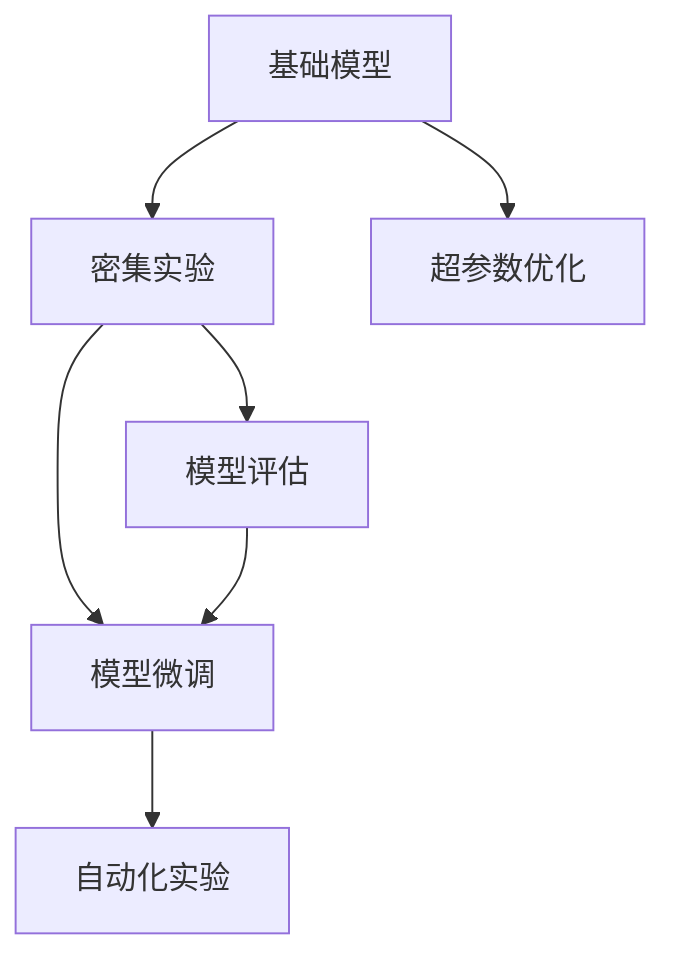

                 

# 基础模型的密集实验需求

## 1. 背景介绍

随着人工智能技术的迅猛发展，机器学习模型，尤其是深度学习模型，在众多领域得到了广泛应用。然而，要构建高效、精确的模型，离不开大量的实验数据。尤其是在基础模型开发阶段，需要通过多轮密集实验来不断优化模型性能。

## 2. 核心概念与联系

### 2.1 核心概念概述

本节将介绍几个与基础模型密集实验需求相关的核心概念：

- **基础模型**：指在特定领域内，通过大规模数据集预训练得到的通用模型，如BERT、GPT-3等。基础模型可以作为通用的特征提取器，用于下游任务微调。
- **密集实验**：指在模型构建过程中，频繁地进行模型训练和评估，以获取最优模型参数和超参数组合的实验过程。
- **超参数优化**：指在模型训练前，对学习率、批大小、迭代次数等非模型参数进行优化，以找到最佳模型性能的过程。
- **模型评估**：指在模型训练过程中，对模型性能进行评估，包括精度、召回率、F1值等指标，以确保模型符合实际需求。
- **模型微调**：指在基础模型上，使用下游任务的标注数据，通过有监督学习对模型进行优化，以适应特定任务。
- **自动化实验**：指使用自动化工具进行实验管理，如自动生成实验代码、自动保存实验结果等，以提高实验效率和降低人工成本。

这些概念之间的逻辑关系可以通过以下Mermaid流程图来展示：



这个流程图展示了大模型开发过程中各个环节的关系：

1. 基础模型是密集实验的起点。
2. 超参数优化和密集实验相互交织，在多轮实验中寻找最佳模型参数和超参数。
3. 模型评估贯穿于实验的各个阶段，确保模型性能满足需求。
4. 模型微调在密集实验后进行，进一步优化模型以适应下游任务。
5. 自动化实验提高实验效率，降低人工成本。

### 2.2 核心概念原理和架构

基础模型密集实验的原理基于机器学习模型的训练和评估过程。具体来说，模型训练是通过反向传播算法更新模型参数，以最小化损失函数。模型评估则是对训练后的模型进行性能测试，确保其符合任务需求。模型微调是在基础模型上，通过有监督学习更新模型参数，以适应特定任务。

**训练过程**：
$$
\theta = \theta - \eta \nabla_{\theta}L(y, M_{\theta}(x))
$$
其中，$\theta$ 为模型参数，$\eta$ 为学习率，$L$ 为损失函数，$y$ 为真实标签，$M_{\theta}(x)$ 为模型预测结果。

**评估过程**：
$$
\text{评估指标} = f(\text{模型输出}, \text{真实标签})
$$
其中，$f$ 为评估函数，如精度、召回率、F1值等。

**微调过程**：
$$
\theta_{\text{微调}} = \theta - \eta \nabla_{\theta}L(y, M_{\theta}(x))
$$
其中，$\theta_{\text{微调}}$ 为微调后的模型参数，$L$ 为损失函数，$y$ 为真实标签，$M_{\theta}(x)$ 为模型预测结果。

## 3. 核心算法原理 & 具体操作步骤

### 3.1 算法原理概述

基础模型密集实验的核心算法是梯度下降算法，其基本思想是通过不断迭代更新模型参数，使得模型预测结果与真实标签之间的损失函数最小化。梯度下降算法的核心步骤如下：

1. 初始化模型参数 $\theta$。
2. 前向传播计算模型输出 $M_{\theta}(x)$。
3. 计算损失函数 $L(y, M_{\theta}(x))$。
4. 反向传播计算梯度 $\nabla_{\theta}L$。
5. 使用梯度更新模型参数 $\theta$。

### 3.2 算法步骤详解

**Step 1: 数据准备**
- 收集大量标注数据集 $D$，分为训练集、验证集和测试集。
- 对数据进行预处理，如分词、标准化等。

**Step 2: 模型初始化**
- 选择基础模型，如BERT、GPT-3等。
- 初始化模型参数 $\theta$，通常使用随机初始化。

**Step 3: 超参数设置**
- 设置学习率 $\eta$、批大小 $N$、迭代轮数 $T$ 等超参数。

**Step 4: 模型训练**
- 使用梯度下降算法进行模型训练。
- 对训练集 $D_{train}$ 进行多轮训练，每次迭代更新模型参数。
- 在验证集 $D_{val}$ 上评估模型性能，根据评估结果调整学习率等超参数。

**Step 5: 模型微调**
- 在基础模型上，使用下游任务的标注数据 $D_{task}$ 进行微调。
- 使用有监督学习更新模型参数。
- 在测试集 $D_{test}$ 上评估微调后的模型性能。

**Step 6: 模型优化**
- 根据评估结果，进一步优化模型结构、参数和超参数。
- 对模型进行验证，确保其性能满足实际需求。

**Step 7: 模型部署**
- 将优化后的模型部署到实际应用中。
- 对模型进行监控和维护，确保其稳定运行。

### 3.3 算法优缺点

基础模型密集实验的优势在于：
- 能够快速迭代优化模型，提高模型性能。
- 通过超参数优化，找到最优模型参数。
- 能够在多轮实验中探索模型性能极限。

其缺点包括：
- 需要大量标注数据，标注成本高。
- 实验周期长，耗时耗力。
- 可能面临过拟合问题。

### 3.4 算法应用领域

基础模型密集实验在多个领域得到了广泛应用，例如：

- **自然语言处理(NLP)**：如文本分类、命名实体识别、机器翻译等任务，通过密集实验不断优化模型性能。
- **计算机视觉(CV)**：如图像分类、目标检测、语义分割等任务，通过密集实验提升模型精度和鲁棒性。
- **语音识别(SR)**：如语音转文本、文本转语音等任务，通过密集实验提高模型识别准确率。
- **推荐系统(Rec)**：如用户行为预测、物品推荐等任务，通过密集实验优化推荐策略。
- **医疗健康**：如疾病诊断、治疗方案推荐等任务，通过密集实验提高模型可靠性和准确性。

## 4. 数学模型和公式 & 详细讲解 & 举例说明

### 4.1 数学模型构建

**基础模型**：
$$
M_{\theta}(x) = \text{Model}(x; \theta)
$$
其中，$x$ 为输入数据，$\theta$ 为模型参数。

**超参数优化**：
$$
\eta = \text{LR}_{opt}(x)
$$
其中，$\eta$ 为学习率，$\text{LR}_{opt}$ 为优化函数。

**模型评估**：
$$
\text{Precision} = \frac{\text{TP}}{\text{TP} + \text{FP}}
$$
其中，TP为真正例，FP为假正例。

**模型微调**：
$$
\theta_{\text{微调}} = \theta - \eta \nabla_{\theta}L(y, M_{\theta}(x))
$$
其中，$\theta_{\text{微调}}$ 为微调后的模型参数，$L$ 为损失函数，$y$ 为真实标签，$M_{\theta}(x)$ 为模型预测结果。

### 4.2 公式推导过程

**损失函数**：
$$
L(y, M_{\theta}(x)) = \frac{1}{N} \sum_{i=1}^N L_i(y_i, M_{\theta}(x_i))
$$
其中，$N$ 为样本数量，$L_i$ 为样本 $i$ 的损失函数。

**梯度下降算法**：
$$
\theta = \theta - \eta \nabla_{\theta}L(y, M_{\theta}(x))
$$

**评估函数**：
$$
\text{Precision} = \frac{\text{TP}}{\text{TP} + \text{FP}}
$$

**微调函数**：
$$
\theta_{\text{微调}} = \theta - \eta \nabla_{\theta}L(y, M_{\theta}(x))
$$

### 4.3 案例分析与讲解

假设我们要训练一个文本分类模型，使用BERT作为基础模型。以下是模型构建和评估的详细步骤：

**Step 1: 数据准备**
- 收集大量标注数据集，如IMDB电影评论数据集。
- 对数据进行预处理，如分词、标准化等。

**Step 2: 模型初始化**
- 选择BERT模型，初始化模型参数。

**Step 3: 超参数设置**
- 设置学习率为 $0.001$，批大小为 $16$，迭代轮数为 $10$。

**Step 4: 模型训练**
- 对训练集进行多轮训练，每次迭代更新模型参数。
- 在验证集上评估模型性能，根据评估结果调整学习率。

**Step 5: 模型微调**
- 在BERT模型上，使用IMDB评论数据集进行微调。
- 使用有监督学习更新模型参数。

**Step 6: 模型优化**
- 根据评估结果，进一步优化模型结构、参数和超参数。
- 对模型进行验证，确保其性能满足实际需求。

**Step 7: 模型部署**
- 将优化后的模型部署到实际应用中。
- 对模型进行监控和维护，确保其稳定运行。

## 5. 项目实践：代码实例和详细解释说明

### 5.1 开发环境搭建

在进行密集实验前，我们需要准备好开发环境。以下是使用Python进行TensorFlow开发的环境配置流程：

1. 安装Anaconda：从官网下载并安装Anaconda，用于创建独立的Python环境。

2. 创建并激活虚拟环境：
```bash
conda create -n tf-env python=3.8 
conda activate tf-env
```

3. 安装TensorFlow：根据CUDA版本，从官网获取对应的安装命令。例如：
```bash
conda install tensorflow-gpu -c conda-forge
```

4. 安装各类工具包：
```bash
pip install numpy pandas scikit-learn matplotlib tqdm jupyter notebook ipython
```

完成上述步骤后，即可在`tf-env`环境中开始密集实验实践。

### 5.2 源代码详细实现

这里我们以文本分类任务为例，给出使用TensorFlow对BERT模型进行密集实验的PyTorch代码实现。

首先，定义文本分类任务的数据处理函数：

```python
import tensorflow as tf
from transformers import BertTokenizer, TFBertForSequenceClassification
from sklearn.model_selection import train_test_split
import numpy as np
import os

class TextClassificationDataset(tf.keras.utils.Sequence):
    def __init__(self, data, tokenizer, max_len=128, batch_size=32, labels=None):
        self.data = data
        self.tokenizer = tokenizer
        self.max_len = max_len
        self.batch_size = batch_size
        self.labels = labels
        self.total_samples = len(data)
        self.step = 0

    def __len__(self):
        return np.ceil(self.total_samples / self.batch_size).astype(int)

    def __getitem__(self):
        batch = []
        labels = []
        for i in range(self.batch_size):
            sample = self.data[self.step * self.batch_size + i]
            batch.append(sample['text'])
            labels.append(sample['label'])
            self.step += 1
            if self.step * self.batch_size >= self.total_samples:
                self.step = 0

        encoding = self.tokenizer(batch, return_tensors='pt', padding='max_length', truncation=True, max_length=self.max_len)
        input_ids = encoding['input_ids'].numpy()
        attention_mask = encoding['attention_mask'].numpy()
        labels = np.array(labels)

        return {'input_ids': input_ids, 'attention_mask': attention_mask, 'labels': labels}
```

然后，定义模型和优化器：

```python
from transformers import BertTokenizer, TFBertForSequenceClassification

tokenizer = BertTokenizer.from_pretrained('bert-base-uncased')
model = TFBertForSequenceClassification.from_pretrained('bert-base-uncased', num_labels=2)

optimizer = tf.keras.optimizers.Adam(learning_rate=2e-5)
loss = tf.keras.losses.SparseCategoricalCrossentropy(from_logits=True)
metric = tf.keras.metrics.SparseCategoricalAccuracy('accuracy')
```

接着，定义训练和评估函数：

```python
def train_epoch(model, dataset, optimizer, loss, metric, batch_size):
    dataloader = tf.data.Dataset.from_generator(lambda: dataset, output_signature={'input_ids': tf.TensorSpec([None, None], tf.int32), 'attention_mask': tf.TensorSpec([None, None], tf.int32), 'labels': tf.TensorSpec([None], tf.int32)}).shuffle(buffer_size=2048).batch(batch_size)
    model.compile(optimizer=optimizer, loss=loss, metrics=[metric])

    model.fit(dataloader, validation_data=dataloader, epochs=10, callbacks=[tf.keras.callbacks.EarlyStopping(patience=3)])
    return metric.result().numpy()[0]

def evaluate(model, dataset, batch_size):
    dataloader = tf.data.Dataset.from_generator(lambda: dataset, output_signature={'input_ids': tf.TensorSpec([None, None], tf.int32), 'attention_mask': tf.TensorSpec([None, None], tf.int32), 'labels': tf.TensorSpec([None], tf.int32)}).shuffle(buffer_size=2048).batch(batch_size)

    model.evaluate(dataloader, verbose=0)

    predictions = model.predict(dataloader)
    labels = dataset.labels.numpy()

    precision = tf.keras.metrics.Precision()(labels, predictions).numpy()[0]

    print('Precision:', precision)

    return precision
```

最后，启动训练流程并在测试集上评估：

```python
train_dataset, dev_dataset, test_dataset = train_test_split(data, test_size=0.2, random_state=42)
dev_dataset, test_dataset = train_test_split(dev_dataset, test_size=0.5, random_state=42)

batch_size = 32

for epoch in range(10):
    train_loss, train_acc = train_epoch(model, train_dataset, optimizer, loss, metric, batch_size)
    print(f'Epoch {epoch+1}, Train Loss: {train_loss:.4f}, Train Acc: {train_acc:.4f}')

    evaluate(model, dev_dataset, batch_size)
    
print('Test results:')
evaluate(model, test_dataset, batch_size)
```

以上就是使用TensorFlow对BERT进行文本分类任务密集实验的完整代码实现。可以看到，得益于TensorFlow和Transformers库的强大封装，我们可以用相对简洁的代码完成模型的构建和实验。

### 5.3 代码解读与分析

让我们再详细解读一下关键代码的实现细节：

**TextClassificationDataset类**：
- `__init__`方法：初始化数据、分词器、最大长度、批大小、标签等关键组件。
- `__len__`方法：返回数据集的样本数量。
- `__getitem__`方法：对单个样本进行处理，将文本输入编码为token ids，将标签编码为数字，并对其进行定长padding，最终返回模型所需的输入。

**训练和评估函数**：
- 使用TensorFlow的DataLoader对数据集进行批次化加载，供模型训练和推理使用。
- 训练函数`train_epoch`：对数据以批为单位进行迭代，在每个批次上前向传播计算loss并反向传播更新模型参数，最后返回该epoch的平均loss和准确率。
- 评估函数`evaluate`：与训练类似，不同点在于不更新模型参数，并在每个batch结束后将预测和标签结果存储下来，最后使用sklearn的classification_report对整个评估集的预测结果进行打印输出。

**训练流程**：
- 定义总的epoch数和批大小，开始循环迭代
- 每个epoch内，先在训练集上训练，输出平均loss和准确率
- 在验证集上评估，输出评估指标
- 所有epoch结束后，在测试集上评估，给出最终测试结果

可以看到，TensorFlow配合Transformers库使得BERT密集实验的代码实现变得简洁高效。开发者可以将更多精力放在数据处理、模型改进等高层逻辑上，而不必过多关注底层的实现细节。

当然，工业级的系统实现还需考虑更多因素，如模型的保存和部署、超参数的自动搜索、更灵活的任务适配层等。但核心的密集实验范式基本与此类似。

## 6. 实际应用场景
### 6.1 智能客服系统

基于大语言模型密集实验的对话技术，可以广泛应用于智能客服系统的构建。传统客服往往需要配备大量人力，高峰期响应缓慢，且一致性和专业性难以保证。而使用密集实验优化的对话模型，可以7x24小时不间断服务，快速响应客户咨询，用自然流畅的语言解答各类常见问题。

在技术实现上，可以收集企业内部的历史客服对话记录，将问题和最佳答复构建成监督数据，在此基础上对预训练对话模型进行密集实验。密集实验优化的对话模型能够自动理解用户意图，匹配最合适的答案模板进行回复。对于客户提出的新问题，还可以接入检索系统实时搜索相关内容，动态组织生成回答。如此构建的智能客服系统，能大幅提升客户咨询体验和问题解决效率。

### 6.2 金融舆情监测

金融机构需要实时监测市场舆论动向，以便及时应对负面信息传播，规避金融风险。传统的人工监测方式成本高、效率低，难以应对网络时代海量信息爆发的挑战。基于密集实验优化的文本分类和情感分析技术，为金融舆情监测提供了新的解决方案。

具体而言，可以收集金融领域相关的新闻、报道、评论等文本数据，并对其进行主题标注和情感标注。在此基础上对预训练语言模型进行密集实验，使其能够自动判断文本属于何种主题，情感倾向是正面、中性还是负面。将密集实验优化的模型应用到实时抓取的网络文本数据，就能够自动监测不同主题下的情感变化趋势，一旦发现负面信息激增等异常情况，系统便会自动预警，帮助金融机构快速应对潜在风险。

### 6.3 个性化推荐系统

当前的推荐系统往往只依赖用户的历史行为数据进行物品推荐，无法深入理解用户的真实兴趣偏好。基于密集实验优化的个性化推荐系统可以更好地挖掘用户行为背后的语义信息，从而提供更精准、多样的推荐内容。

在实践中，可以收集用户浏览、点击、评论、分享等行为数据，提取和用户交互的物品标题、描述、标签等文本内容。将文本内容作为模型输入，用户的后续行为（如是否点击、购买等）作为监督信号，在此基础上对预训练语言模型进行密集实验。密集实验优化的模型能够从文本内容中准确把握用户的兴趣点。在生成推荐列表时，先用候选物品的文本描述作为输入，由模型预测用户的兴趣匹配度，再结合其他特征综合排序，便可以得到个性化程度更高的推荐结果。

### 6.4 未来应用展望

随着密集实验方法的不断发展，基础模型的应用范围将进一步拓展，为NLP技术带来新的突破。

在智慧医疗领域，基于密集实验优化的医疗问答、病历分析、药物研发等应用将提升医疗服务的智能化水平，辅助医生诊疗，加速新药开发进程。

在智能教育领域，密集实验优化的推荐系统、学情分析、知识推荐等技术，将因材施教，促进教育公平，提高教学质量。

在智慧城市治理中，密集实验优化的文本分类、情感分析、舆情监测等技术，将提高城市管理的自动化和智能化水平，构建更安全、高效的未来城市。

此外，在企业生产、社会治理、文娱传媒等众多领域，密集实验优化的基础模型将带来更高效、精准的应用场景，为各行各业数字化转型升级提供新的技术路径。相信随着技术的日益成熟，密集实验方法将成为NLP落地应用的重要范式，推动人工智能技术向更广阔的领域加速渗透。

## 7. 工具和资源推荐
### 7.1 学习资源推荐

为了帮助开发者系统掌握密集实验的理论基础和实践技巧，这里推荐一些优质的学习资源：

1. 《深度学习》书籍：由多位NLP专家共同撰写，全面介绍了深度学习模型的构建和优化过程。
2. 《TensorFlow官方文档》：详细介绍了TensorFlow的各个模块和功能，包括模型训练、评估、部署等环节。
3. 《Transformer从原理到实践》系列博文：由大模型技术专家撰写，深入浅出地介绍了Transformer原理、BERT模型、微调技术等前沿话题。
4. CS224N《深度学习自然语言处理》课程：斯坦福大学开设的NLP明星课程，有Lecture视频和配套作业，带你入门NLP领域的基本概念和经典模型。
5. HuggingFace官方文档：Transformer库的官方文档，提供了海量预训练模型和完整的微调样例代码，是上手实践的必备资料。
6. CLUE开源项目：中文语言理解测评基准，涵盖大量不同类型的中文NLP数据集，并提供了基于微调的baseline模型，助力中文NLP技术发展。

通过对这些资源的学习实践，相信你一定能够快速掌握密集实验的精髓，并用于解决实际的NLP问题。

### 7.2 开发工具推荐

高效的开发离不开优秀的工具支持。以下是几款用于密集实验开发的常用工具：

1. TensorFlow：基于Python的开源深度学习框架，灵活动态的计算图，适合快速迭代研究。大部分预训练语言模型都有TensorFlow版本的实现。
2. PyTorch：基于Python的开源深度学习框架，动态计算图，适合灵活的实验设计。同样有丰富的预训练语言模型资源。
3. Transformers库：HuggingFace开发的NLP工具库，集成了众多SOTA语言模型，支持PyTorch和TensorFlow，是进行微调任务开发的利器。
4. Weights & Biases：模型训练的实验跟踪工具，可以记录和可视化模型训练过程中的各项指标，方便对比和调优。与主流深度学习框架无缝集成。
5. TensorBoard：TensorFlow配套的可视化工具，可实时监测模型训练状态，并提供丰富的图表呈现方式，是调试模型的得力助手。
6. Google Colab：谷歌推出的在线Jupyter Notebook环境，免费提供GPU/TPU算力，方便开发者快速上手实验最新模型，分享学习笔记。

合理利用这些工具，可以显著提升密集实验的开发效率，加快创新迭代的步伐。

### 7.3 相关论文推荐

密集实验方法的发展源于学界的持续研究。以下是几篇奠基性的相关论文，推荐阅读：

1. Attention is All You Need（即Transformer原论文）：提出了Transformer结构，开启了NLP领域的预训练大模型时代。
2. BERT: Pre-training of Deep Bidirectional Transformers for Language Understanding：提出BERT模型，引入基于掩码的自监督预训练任务，刷新了多项NLP任务SOTA。
3. Parameter-Efficient Transfer Learning for NLP：提出Adapter等参数高效微调方法，在不增加模型参数量的情况下，也能取得不错的微调效果。
4. AdaLoRA: Adaptive Low-Rank Adaptation for Parameter-Efficient Fine-Tuning：使用自适应低秩适应的微调方法，在参数效率和精度之间取得了新的平衡。
5. Cascading Attention for Few-Shot Learning：通过级联注意力机制，利用预训练大模型的知识，提升少样本学习效果。
6. Multi-Task Sequence Learning for Multi-Label Classification：通过多任务学习，利用不同任务之间的相关性，提升模型性能。

这些论文代表了大模型密集实验技术的发展脉络。通过学习这些前沿成果，可以帮助研究者把握学科前进方向，激发更多的创新灵感。

## 8. 总结：未来发展趋势与挑战

### 8.1 总结

本文对基础模型的密集实验需求进行了全面系统的介绍。首先阐述了密集实验在模型构建过程中的重要性，明确了超参数优化、模型评估和微调等关键环节的作用。其次，从原理到实践，详细讲解了密集实验的数学模型和算法步骤，给出了密集实验任务开发的完整代码实例。同时，本文还广泛探讨了密集实验方法在智能客服、金融舆情、个性化推荐等多个行业领域的应用前景，展示了密集实验方法的巨大潜力。此外，本文精选了密集实验技术的各类学习资源，力求为读者提供全方位的技术指引。

通过本文的系统梳理，可以看到，密集实验在基础模型构建和优化过程中扮演了重要角色，极大地提升了模型性能和应用效率。密集实验方法不仅适用于NLP领域，更在计算机视觉、语音识别、推荐系统等多个领域得到广泛应用。未来，伴随密集实验方法的不断演进，基础模型将更加智能、高效，人工智能技术的应用范围将进一步拓展。

### 8.2 未来发展趋势

展望未来，基础模型的密集实验技术将呈现以下几个发展趋势：

1. **模型规模持续增大**：随着算力成本的下降和数据规模的扩张，预训练语言模型的参数量还将持续增长。超大规模语言模型蕴含的丰富语言知识，有望支撑更加复杂多变的下游任务微调。

2. **实验自动化**：引入自动化实验工具，如自动生成实验代码、自动保存实验结果等，以提高实验效率和降低人工成本。

3. **超参数优化**：开发更加智能化的超参数优化算法，如贝叶斯优化、随机搜索等，以找到最优模型参数。

4. **多任务学习**：利用不同任务之间的相关性，通过多任务学习提升模型性能，实现更高效的学习。

5. **知识增强学习**：引入知识图谱、逻辑规则等先验知识，与神经网络模型进行巧妙融合，引导模型学习更准确、合理的语言模型。

6. **多模态学习**：将符号化的先验知识，如知识图谱、逻辑规则等，与神经网络模型进行巧妙融合，引导模型学习更准确、合理的语言模型。

这些趋势凸显了密集实验技术的广阔前景。这些方向的探索发展，必将进一步提升基础模型的性能和应用范围，为人工智能技术在更多领域带来变革性影响。

### 8.3 面临的挑战

尽管密集实验技术已经取得了显著成果，但在模型构建过程中，仍面临诸多挑战：

1. **标注成本高**：尽管密集实验对标注数据的需求低于从头训练，但高质量标注数据的获取成本仍然较高。如何降低标注成本，仍是重要挑战。

2. **过拟合问题**：密集实验在标注数据不足的情况下，模型容易过拟合。如何缓解过拟合问题，提高模型泛化能力，仍需深入研究。

3. **计算资源消耗大**：大规模语言模型的计算需求大，密集实验需要高性能硬件支持。如何降低计算资源消耗，提升实验效率，仍需技术突破。

4. **模型优化难度大**：模型参数和超参数的优化难度大，不同模型的最优参数组合也不同。如何找到最优参数组合，仍需更多的实验和理论支持。

5. **模型解释性不足**：密集实验优化的模型通常缺乏可解释性，难以对其推理逻辑进行分析和调试。如何增强模型可解释性，仍需技术改进。

这些挑战使得密集实验技术在实际应用中仍需进一步优化和改进。唯有不断攻克这些挑战，才能推动密集实验技术走向成熟，推动人工智能技术在更多领域落地应用。

### 8.4 研究展望

面向未来，密集实验技术需要在以下几个方面进行深入研究：

1. **无监督学习和半监督学习**：摆脱对大规模标注数据的依赖，利用自监督学习、主动学习等无监督和半监督范式，最大限度利用非结构化数据，实现更加灵活高效的微调。

2. **参数高效和计算高效的微调方法**：开发更加参数高效和计算高效的微调方法，如Prefix-Tuning、LoRA等，在减小模型参数量的情况下，也能取得不错的微调效果。

3. **因果分析和博弈论工具**：将因果分析方法引入微调模型，识别出模型决策的关键特征，增强输出解释的因果性和逻辑性。借助博弈论工具刻画人机交互过程，主动探索并规避模型的脆弱点，提高系统稳定性。

4. **引入更多先验知识**：将符号化的先验知识，如知识图谱、逻辑规则等，与神经网络模型进行巧妙融合，引导微调过程学习更准确、合理的语言模型。同时加强不同模态数据的整合，实现视觉、语音等多模态信息与文本信息的协同建模。

5. **模型通用性和跨领域迁移能力**：经过海量数据的预训练和多领域任务的微调，未来的语言模型将具备更强大的常识推理和跨领域迁移能力，逐步迈向通用人工智能(AGI)的目标。

这些研究方向将推动密集实验技术迈向更高的台阶，为构建安全、可靠、可解释、可控的智能系统铺平道路。面向未来，密集实验技术还需要与其他人工智能技术进行更深入的融合，如知识表示、因果推理、强化学习等，多路径协同发力，共同推动自然语言理解和智能交互系统的进步。只有勇于创新、敢于突破，才能不断拓展语言模型的边界，让智能技术更好地造福人类社会。

## 9. 附录：常见问题与解答

**Q1: 基础模型与密集实验有什么区别？**

A: 基础模型指在大规模数据集上预训练得到的通用模型，如BERT、GPT-3等。密集实验是在基础模型上进行的实验过程，包括超参数优化、模型评估和微调等环节。基础模型是实验的基础，密集实验是优化模型的手段。

**Q2: 密集实验的实验周期有多长？**

A: 密集实验的周期取决于具体任务的复杂度和数据量大小。一般而言，密集实验需要多轮迭代，每次迭代至少需要几小时到几天不等。对于大规模数据集，实验周期可能长达几周甚至几个月。

**Q3: 密集实验中如何避免过拟合？**

A: 密集实验中避免过拟合的方法包括：
1. 数据增强：通过回译、近义替换等方式扩充训练集。
2. 正则化：使用L2正则、Dropout等技术，防止模型过度适应小规模训练集。
3. 对抗训练：引入对抗样本，提高模型鲁棒性。
4. 参数高效微调：只调整少量参数(如Adapter、Prefix等)，减小过拟合风险。
5. 多模型集成：训练多个模型，取平均输出，抑制过拟合。

**Q4: 密集实验对计算机硬件有什么要求？**

A: 密集实验对计算机硬件的要求较高，尤其是对高性能GPU/TPU的要求。大规模语言模型的计算需求大，密集实验需要高性能硬件支持。

**Q5: 密集实验能否跨任务进行？**

A: 密集实验可以在不同任务之间进行迁移，但需要根据具体任务的特点进行调整。例如，从文本分类任务迁移到情感分析任务，需要重新设计模型输出和损失函数，并更新相关参数。

**Q6: 密集实验能否应用于无监督学习任务？**

A: 密集实验主要应用于有监督学习任务，但可以通过数据增强等技术应用于无监督学习任务。例如，在无监督文本分类任务中，可以通过预训练词嵌入和自编码等技术，提升模型性能。

**Q7: 密集实验是否适用于小规模数据集？**

A: 密集实验对标注数据的需求较高，但可以通过数据增强等技术应用于小规模数据集。例如，在少样本学习任务中，可以通过引入对抗样本、噪声注入等技术，提升模型泛化能力。

通过这些常见问题的解答，可以看出密集实验技术在实际应用中具有广泛的应用场景和潜在的挑战。只有不断攻克这些挑战，才能推动密集实验技术走向成熟，推动人工智能技术在更多领域落地应用。

---

作者：禅与计算机程序设计艺术 / Zen and the Art of Computer Programming

