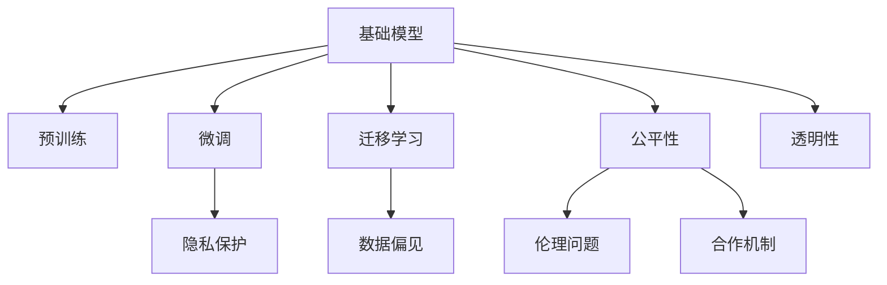

                 

# 基础模型的技术创新与社会合作

## 1. 背景介绍

### 1.1 问题由来

在过去十年中，人工智能（AI）领域取得了飞速的发展，尤其是深度学习技术在各个应用场景中大放异彩。其中，基础模型（Foundation Models）以其广泛的影响力和潜力，成为科技巨头和研究机构争相投资和开发的热点。基础模型通常是指在大规模数据上预训练的大规模神经网络模型，如GPT-3、BERT、RoBERTa等，它们在自然语言处理（NLP）、计算机视觉、语音识别等领域发挥了重要作用。

基础模型通过在大规模无标签数据上进行预训练，能够学习到丰富的语义和结构知识，从而在特定的下游任务中，如文本分类、命名实体识别、机器翻译等，通过微调（Fine-Tuning）或迁移学习（Transfer Learning）等方法，显著提升任务的性能。这些模型在性能上超越了传统的方法，且在广泛的应用场景中展现出了强大的能力。

然而，基础模型的广泛应用也引发了诸多社会关注和争议。从隐私保护、伦理问题到数据偏见，基础模型在技术创新和社会责任之间，面临着复杂且多维度的挑战。如何协调基础模型的技术创新与社会合作，成为当前AI领域的重要课题。

### 1.2 问题核心关键点

基础模型的技术创新与社会合作的讨论涉及以下几个核心关键点：

- **技术创新**：基础模型通过大规模预训练和微调，带来了性能上的巨大提升，能够解决众多复杂任务，是当前AI技术的重要组成部分。
- **社会影响**：基础模型在隐私、伦理、数据偏见等方面的社会影响，亟需规范和监管，以确保技术应用的公平性和安全性。
- **合作机制**：基础模型的开发和使用需要多方合作，包括学术界、工业界、政府、用户等，构建透明、公平的合作机制，是实现技术创新的关键。

## 2. 核心概念与联系

### 2.1 核心概念概述

为了更好地理解基础模型的技术创新与社会合作，本节将介绍几个密切相关的核心概念：

- **基础模型（Foundation Models）**：指在大规模数据上预训练的大规模神经网络模型，如GPT-3、BERT、RoBERTa等。这些模型通常具有数十亿个参数，能够学习到丰富的语义和结构知识。

- **预训练（Pre-training）**：指在大规模无标签数据上，通过自监督学习任务训练通用模型，从而获得通用的语言、视觉等表示，供下游任务使用。

- **微调（Fine-Tuning）**：指在预训练模型的基础上，通过小规模有标签数据训练模型，使其适应特定任务，如自然语言处理（NLP）中的文本分类、命名实体识别等。

- **迁移学习（Transfer Learning）**：指将一个领域学到的知识，迁移到另一个相关领域，通过微调等方法，提升新领域任务的性能。

- **隐私保护（Privacy Protection）**：指在基础模型的开发和使用过程中，确保用户数据的安全和隐私保护，防止数据滥用。

- **伦理问题（Ethical Issues）**：指基础模型在应用过程中可能引发的伦理问题，如偏见、歧视、误导等。

- **数据偏见（Data Bias）**：指基础模型在训练过程中，由于数据分布不均衡等原因，可能学习到偏见，导致模型输出不公正或有害结果。

- **公平性（Fairness）**：指基础模型在应用过程中，确保所有用户、群体的公平待遇，避免算法歧视。

- **透明性（Transparency）**：指基础模型的开发和使用过程应保持透明，便于审查和监督。

- **合作机制（Collaborative Mechanisms）**：指基础模型的开发和使用需要多方合作，包括学术界、工业界、政府、用户等，构建公平、透明的合作机制。

这些核心概念之间存在着复杂的联系，共同构成了基础模型技术创新的基础，同时又涉及众多社会责任和伦理问题。以下Mermaid流程图展示了这些概念之间的关系：



### 2.2 核心概念原理和架构

基础模型通过在大规模数据上进行预训练，学习到通用的语言、视觉等表示。这些表示能够应用于多种下游任务，如自然语言处理（NLP）、计算机视觉（CV）、语音识别（ASR）等。以下我们将通过一个简单的例子，说明基础模型的预训练和微调过程：

#### 2.2.1 预训练过程

预训练过程通常包括以下步骤：

1. **数据准备**：收集大规模无标签数据，如互联网文本、图片、音频等。这些数据集需要覆盖广泛的主题和领域，以确保模型学习到丰富的知识。

2. **模型训练**：使用预训练模型（如BERT、GPT-3等）在大规模数据集上进行训练。预训练模型通常具有数十亿个参数，通过自监督学习任务（如语言建模、图像分类等），学习到通用的表示。

3. **特征提取**：将预训练模型作为特征提取器，用于下游任务的微调。预训练模型可以提取出通用的特征，供下游任务使用。

4. **模型优化**：通过小规模有标签数据进行微调，优化模型在特定任务上的性能。微调过程中，需要选择合适的学习率、正则化技术、任务适配层等，以避免过拟合和提高模型性能。

#### 2.2.2 微调过程

微调过程通常包括以下步骤：

1. **数据准备**：收集下游任务的有标签数据集，如自然语言处理（NLP）中的文本分类、命名实体识别等。这些数据集需要覆盖不同的类别和场景，以确保模型泛化能力。

2. **模型初始化**：将预训练模型作为初始参数，用于微调。通常只微调顶层或部分层，以减少计算资源消耗。

3. **任务适配**：根据下游任务，设计合适的输出层和损失函数。对于分类任务，通常使用交叉熵损失函数；对于生成任务，通常使用负对数似然损失函数。

4. **模型训练**：在微调过程中，需要选择合适的优化器（如Adam、SGD等）和超参数（如学习率、批大小等），以确保模型收敛。微调过程中，需要控制正则化、学习率衰减等策略，避免过拟合。

5. **模型评估**：在微调完成后，评估模型在测试集上的性能，如准确率、召回率、F1分数等，以评估模型泛化能力。

## 3. 核心算法原理 & 具体操作步骤

### 3.1 算法原理概述

基础模型的微调过程本质上是一种有监督学习的过程。通过在大规模预训练模型的基础上，使用下游任务的有标签数据进行微调，从而优化模型在特定任务上的性能。以下是微调过程的基本原理：

1. **模型初始化**：将预训练模型作为初始化参数，用于微调。预训练模型通常具有数十亿个参数，通过大规模无标签数据进行预训练，学习到通用的表示。

2. **任务适配**：根据下游任务，设计合适的输出层和损失函数。对于分类任务，通常使用交叉熵损失函数；对于生成任务，通常使用负对数似然损失函数。

3. **模型训练**：在微调过程中，需要选择合适的优化器（如Adam、SGD等）和超参数（如学习率、批大小等），以确保模型收敛。微调过程中，需要控制正则化、学习率衰减等策略，避免过拟合。

4. **模型评估**：在微调完成后，评估模型在测试集上的性能，如准确率、召回率、F1分数等，以评估模型泛化能力。

### 3.2 算法步骤详解

以下是微调过程的详细步骤：

#### 3.2.1 数据准备

1. **收集数据**：收集下游任务的有标签数据集，如自然语言处理（NLP）中的文本分类、命名实体识别等。这些数据集需要覆盖不同的类别和场景，以确保模型泛化能力。

2. **数据预处理**：对数据进行预处理，如分词、标记、拼接等，转换为模型所需的输入格式。

#### 3.2.2 模型初始化

1. **加载预训练模型**：使用预训练模型（如BERT、GPT-3等）作为初始化参数，用于微调。通常只微调顶层或部分层，以减少计算资源消耗。

2. **任务适配**：根据下游任务，设计合适的输出层和损失函数。对于分类任务，通常使用交叉熵损失函数；对于生成任务，通常使用负对数似然损失函数。

#### 3.2.3 模型训练

1. **模型优化**：选择合适的优化器（如Adam、SGD等）和超参数（如学习率、批大小等），以确保模型收敛。

2. **数据加载**：使用PyTorch等深度学习框架，加载训练数据集，进行批次化处理。

3. **前向传播**：将训练数据输入模型，计算损失函数。

4. **反向传播**：计算损失函数对模型参数的梯度，进行反向传播。

5. **模型更新**：根据梯度信息，更新模型参数。

6. **正则化**：控制正则化、学习率衰减等策略，避免过拟合。

7. **模型评估**：在每个epoch结束后，评估模型在验证集上的性能，如准确率、召回率、F1分数等，以评估模型泛化能力。

#### 3.2.4 模型评估

1. **加载测试数据集**：使用测试数据集，进行批次化处理。

2. **模型预测**：将测试数据输入模型，进行预测。

3. **评估指标**：计算模型的评估指标，如准确率、召回率、F1分数等，以评估模型泛化能力。

### 3.3 算法优缺点

基础模型微调具有以下优点：

1. **性能提升**：通过微调，可以显著提升模型在特定任务上的性能，尤其是对于一些数据量较小的任务。

2. **泛化能力强**：基础模型具有强大的泛化能力，可以在不同领域和任务中应用。

3. **参数高效**：基础模型通常具有数十亿个参数，通过微调，只更新顶层或部分层，可以显著降低计算资源消耗。

4. **可解释性强**：基础模型通过预训练和微调，学习到丰富的知识，可以提供更强的可解释性。

基础模型微调也存在以下缺点：

1. **数据依赖**：微调效果很大程度上取决于标注数据的质量和数量，获取高质量标注数据的成本较高。

2. **模型复杂**：基础模型具有数十亿个参数，模型复杂度高，训练和推理速度较慢。

3. **偏见和歧视**：基础模型可能学习到偏见和歧视，导致模型输出不公正或有害结果。

4. **隐私问题**：基础模型在训练和使用过程中，涉及大量用户数据，隐私保护问题亟需解决。

5. **伦理问题**：基础模型在应用过程中，可能引发伦理问题，如误导、歧视、隐私泄露等。

### 3.4 算法应用领域

基础模型微调在多个领域中得到了广泛应用，以下是几个典型应用领域：

1. **自然语言处理（NLP）**：基础模型在文本分类、命名实体识别、情感分析、机器翻译等任务中表现出色。通过微调，模型可以进一步适应特定任务，提升性能。

2. **计算机视觉（CV）**：基础模型在图像分类、物体检测、图像生成等任务中表现出色。通过微调，模型可以进一步适应特定任务，提升性能。

3. **语音识别（ASR）**：基础模型在语音识别、语音合成等任务中表现出色。通过微调，模型可以进一步适应特定任务，提升性能。

4. **智能推荐系统**：基础模型在个性化推荐、内容推荐等任务中表现出色。通过微调，模型可以进一步适应特定用户需求，提升推荐效果。

5. **医疗健康**：基础模型在疾病诊断、健康管理等任务中表现出色。通过微调，模型可以进一步适应特定场景，提升应用效果。

6. **金融科技**：基础模型在风险评估、欺诈检测等任务中表现出色。通过微调，模型可以进一步适应特定场景，提升应用效果。

7. **自动驾驶**：基础模型在自动驾驶、辅助驾驶等任务中表现出色。通过微调，模型可以进一步适应特定场景，提升应用效果。

## 4. 数学模型和公式 & 详细讲解 & 举例说明

### 4.1 数学模型构建

基础模型的微调过程可以抽象为以下几个步骤：

1. **输入数据**：$x$ 表示输入数据，通常为文本、图像、音频等。

2. **预训练模型**：$M_{\theta}$ 表示预训练模型，通常为BERT、GPT-3等大规模神经网络模型。

3. **输出数据**：$y$ 表示模型输出，通常为标签、概率分布、嵌入向量等。

4. **损失函数**：$\mathcal{L}$ 表示模型在特定任务上的损失函数，用于衡量模型输出与真实标签之间的差异。

5. **优化器**：$\mathcal{O}$ 表示优化器，如Adam、SGD等，用于更新模型参数。

6. **超参数**：$\lambda$ 表示正则化系数，用于控制正则化策略。

7. **迭代次数**：$T$ 表示迭代的次数，通常为多次训练。

基于以上步骤，可以构建基础模型的微调数学模型：

$$
\theta^* = \mathop{\arg\min}_{\theta} \sum_{t=1}^T \mathcal{L}(M_{\theta}, x^t, y^t) + \lambda \mathcal{R}(\theta)
$$

其中，$\theta$ 表示模型参数，$\mathcal{L}$ 表示损失函数，$x^t$ 表示第 $t$ 次迭代的输入数据，$y^t$ 表示第 $t$ 次迭代的真实标签，$\mathcal{R}(\theta)$ 表示正则化项，$\lambda$ 表示正则化系数，$T$ 表示迭代次数。

### 4.2 公式推导过程

以文本分类任务为例，说明基础模型微调过程的数学推导：

1. **输入数据**：$x$ 表示输入文本，$y$ 表示文本所属的类别。

2. **预训练模型**：$M_{\theta}$ 表示预训练模型，通常为BERT、GPT-3等大规模神经网络模型。

3. **输出数据**：$y$ 表示模型输出，通常为文本所属的类别。

4. **损失函数**：$\mathcal{L}$ 表示模型在文本分类任务上的损失函数，通常为交叉熵损失函数。

5. **优化器**：$\mathcal{O}$ 表示优化器，如Adam、SGD等，用于更新模型参数。

6. **超参数**：$\lambda$ 表示正则化系数，用于控制正则化策略。

7. **迭代次数**：$T$ 表示迭代的次数，通常为多次训练。

基于以上步骤，可以构建文本分类任务的微调数学模型：

$$
\theta^* = \mathop{\arg\min}_{\theta} \sum_{t=1}^T -y^t\log \hat{y}^t + (1-y^t)\log (1-\hat{y}^t) + \lambda \mathcal{R}(\theta)
$$

其中，$\theta$ 表示模型参数，$\hat{y}^t$ 表示模型在第 $t$ 次迭代时对输入文本 $x^t$ 的预测类别，$y^t$ 表示输入文本 $x^t$ 的真实类别，$\mathcal{R}(\theta)$ 表示正则化项，$\lambda$ 表示正则化系数，$T$ 表示迭代次数。

### 4.3 案例分析与讲解

以BERT模型为例，说明基础模型的微调过程：

1. **数据准备**：收集下游任务的标注数据集，如IMDB电影评论分类任务，包含25000条电影评论及其所属的正面或负面标签。

2. **模型初始化**：加载预训练的BERT模型作为初始参数。

3. **任务适配**：设计适当的输出层和损失函数。对于二分类任务，通常使用交叉熵损失函数。

4. **模型训练**：在微调过程中，选择合适的优化器（如Adam、SGD等）和超参数（如学习率、批大小等），以确保模型收敛。

5. **模型评估**：在微调完成后，评估模型在测试集上的性能，如准确率、召回率、F1分数等，以评估模型泛化能力。

## 5. 项目实践：代码实例和详细解释说明

### 5.1 开发环境搭建

在进行微调实践前，我们需要准备好开发环境。以下是使用Python进行PyTorch开发的环境配置流程：

1. 安装Anaconda：从官网下载并安装Anaconda，用于创建独立的Python环境。

2. 创建并激活虚拟环境：
```bash
conda create -n pytorch-env python=3.8 
conda activate pytorch-env
```

3. 安装PyTorch：根据CUDA版本，从官网获取对应的安装命令。例如：
```bash
conda install pytorch torchvision torchaudio cudatoolkit=11.1 -c pytorch -c conda-forge
```

4. 安装Transformers库：
```bash
pip install transformers
```

5. 安装各类工具包：
```bash
pip install numpy pandas scikit-learn matplotlib tqdm jupyter notebook ipython
```

完成上述步骤后，即可在`pytorch-env`环境中开始微调实践。

### 5.2 源代码详细实现

这里我们以BERT模型为例，说明基础模型在文本分类任务上的微调过程。

首先，定义BERT模型和微调参数：

```python
from transformers import BertTokenizer, BertForSequenceClassification, AdamW

tokenizer = BertTokenizer.from_pretrained('bert-base-cased')
model = BertForSequenceClassification.from_pretrained('bert-base-cased', num_labels=2)

optimizer = AdamW(model.parameters(), lr=2e-5)
```

然后，定义训练和评估函数：

```python
from torch.utils.data import DataLoader
from tqdm import tqdm
from sklearn.metrics import classification_report

device = torch.device('cuda') if torch.cuda.is_available() else torch.device('cpu')
model.to(device)

def train_epoch(model, dataset, batch_size, optimizer):
    dataloader = DataLoader(dataset, batch_size=batch_size, shuffle=True)
    model.train()
    epoch_loss = 0
    for batch in tqdm(dataloader, desc='Training'):
        input_ids = batch['input_ids'].to(device)
        attention_mask = batch['attention_mask'].to(device)
        labels = batch['labels'].to(device)
        model.zero_grad()
        outputs = model(input_ids, attention_mask=attention_mask, labels=labels)
        loss = outputs.loss
        epoch_loss += loss.item()
        loss.backward()
        optimizer.step()
    return epoch_loss / len(dataloader)

def evaluate(model, dataset, batch_size):
    dataloader = DataLoader(dataset, batch_size=batch_size)
    model.eval()
    preds, labels = [], []
    with torch.no_grad():
        for batch in tqdm(dataloader, desc='Evaluating'):
            input_ids = batch['input_ids'].to(device)
            attention_mask = batch['attention_mask'].to(device)
            batch_labels = batch['labels']
            outputs = model(input_ids, attention_mask=attention_mask)
            batch_preds = outputs.logits.argmax(dim=2).to('cpu').tolist()
            batch_labels = batch_labels.to('cpu').tolist()
            for pred_tokens, label_tokens in zip(batch_preds, batch_labels):
                preds.append(pred_tokens[:len(label_tokens)])
                labels.append(label_tokens)
                
    print(classification_report(labels, preds))
```

最后，启动训练流程并在测试集上评估：

```python
epochs = 5
batch_size = 16

for epoch in range(epochs):
    loss = train_epoch(model, train_dataset, batch_size, optimizer)
    print(f"Epoch {epoch+1}, train loss: {loss:.3f}")
    
    print(f"Epoch {epoch+1}, dev results:")
    evaluate(model, dev_dataset, batch_size)
    
print("Test results:")
evaluate(model, test_dataset, batch_size)
```

以上就是使用PyTorch对BERT进行文本分类任务微调的完整代码实现。可以看到，得益于Transformers库的强大封装，我们可以用相对简洁的代码完成BERT模型的加载和微调。

### 5.3 代码解读与分析

让我们再详细解读一下关键代码的实现细节：

**BERTForSequenceClassification类**：
- `__init__`方法：初始化模型，传入预训练模型和输出类别数。
- `forward`方法：实现模型前向传播，输入文本和标签，输出模型预测结果和损失。

**tokenizer和model对象**：
- `tokenizer`对象：用于分词和编码文本，转换输入为模型所需的格式。
- `model`对象：加载预训练的BERT模型，用于微调。

**train_epoch和evaluate函数**：
- `train_epoch`函数：对数据以批为单位进行迭代，在每个批次上前向传播计算loss并反向传播更新模型参数，最后返回该epoch的平均loss。
- `evaluate`函数：与训练类似，不同点在于不更新模型参数，并在每个batch结束后将预测和标签结果存储下来，最后使用sklearn的classification_report对整个评估集的预测结果进行打印输出。

**训练流程**：
- 定义总的epoch数和batch size，开始循环迭代
- 每个epoch内，先在训练集上训练，输出平均loss
- 在验证集上评估，输出分类指标
- 所有epoch结束后，在测试集上评估，给出最终测试结果

可以看到，PyTorch配合Transformers库使得BERT微调的代码实现变得简洁高效。开发者可以将更多精力放在数据处理、模型改进等高层逻辑上，而不必过多关注底层的实现细节。

当然，工业级的系统实现还需考虑更多因素，如模型的保存和部署、超参数的自动搜索、更灵活的任务适配层等。但核心的微调范式基本与此类似。

## 6. 实际应用场景

### 6.1 智能客服系统

基于大语言模型微调的对话技术，可以广泛应用于智能客服系统的构建。传统客服往往需要配备大量人力，高峰期响应缓慢，且一致性和专业性难以保证。而使用微调后的对话模型，可以7x24小时不间断服务，快速响应客户咨询，用自然流畅的语言解答各类常见问题。

在技术实现上，可以收集企业内部的历史客服对话记录，将问题和最佳答复构建成监督数据，在此基础上对预训练对话模型进行微调。微调后的对话模型能够自动理解用户意图，匹配最合适的答案模板进行回复。对于客户提出的新问题，还可以接入检索系统实时搜索相关内容，动态组织生成回答。如此构建的智能客服系统，能大幅提升客户咨询体验和问题解决效率。

### 6.2 金融舆情监测

金融机构需要实时监测市场舆论动向，以便及时应对负面信息传播，规避金融风险。传统的人工监测方式成本高、效率低，难以应对网络时代海量信息爆发的挑战。基于大语言模型微调的文本分类和情感分析技术，为金融舆情监测提供了新的解决方案。

具体而言，可以收集金融领域相关的新闻、报道、评论等文本数据，并对其进行主题标注和情感标注。在此基础上对预训练语言模型进行微调，使其能够自动判断文本属于何种主题，情感倾向是正面、中性还是负面。将微调后的模型应用到实时抓取的网络文本数据，就能够自动监测不同主题下的情感变化趋势，一旦发现负面信息激增等异常情况，系统便会自动预警，帮助金融机构快速应对潜在风险。

### 6.3 个性化推荐系统

当前的推荐系统往往只依赖用户的历史行为数据进行物品推荐，无法深入理解用户的真实兴趣偏好。基于大语言模型微调技术，个性化推荐系统可以更好地挖掘用户行为背后的语义信息，从而提供更精准、多样的推荐内容。

在实践中，可以收集用户浏览、点击、评论、分享等行为数据，提取和用户交互的物品标题、描述、标签等文本内容。将文本内容作为模型输入，用户的后续行为（如是否点击、购买等）作为监督信号，在此基础上微调预训练语言模型。微调后的模型能够从文本内容中准确把握用户的兴趣点。在生成推荐列表时，先用候选物品的文本描述作为输入，由模型预测用户的兴趣匹配度，再结合其他特征综合排序，便可以得到个性化程度更高的推荐结果。

### 6.4 未来应用展望

随着大语言模型微调技术的发展，基于微调范式将在更多领域得到应用，为传统行业带来变革性影响。

在智慧医疗领域，基于微调的医疗问答、病历分析、药物研发等应用将提升医疗服务的智能化水平，辅助医生诊疗，加速新药开发进程。

在智能教育领域，微调技术可应用于作业批改、学情分析、知识推荐等方面，因材施教，促进教育公平，提高教学质量。

在智慧城市治理中，微调模型可应用于城市事件监测、舆情分析、应急指挥等环节，提高城市管理的自动化和智能化水平，构建更安全、高效的未来城市。

此外，在企业生产、社会治理、文娱传媒等众多领域，基于大模型微调的人工智能应用也将不断涌现，为经济社会发展注入新的动力。相信随着技术的日益成熟，微调方法将成为人工智能落地应用的重要范式，推动人工智能技术在垂直行业的规模化落地。

## 7. 工具和资源推荐

### 7.1 学习资源推荐

为了帮助开发者系统掌握大语言模型微调的理论基础和实践技巧，这里推荐一些优质的学习资源：

1. 《Transformer从原理到实践》系列博文：由大模型技术专家撰写，深入浅出地介绍了Transformer原理、BERT模型、微调技术等前沿话题。

2. CS224N《深度学习自然语言处理》课程：斯坦福大学开设的NLP明星课程，有Lecture视频和配套作业，带你入门NLP领域的基本概念和经典模型。

3. 《Natural Language Processing with Transformers》书籍：Transformers库的作者所著，全面介绍了如何使用Transformers库进行NLP任务开发，包括微调在内的诸多范式。

4. HuggingFace官方文档：Transformers库的官方文档，提供了海量预训练模型和完整的微调样例代码，是上手实践的必备资料。

5. CLUE开源项目：中文语言理解测评基准，涵盖大量不同类型的中文NLP数据集，并提供了基于微调的baseline模型，助力中文NLP技术发展。

通过对这些资源的学习实践，相信你一定能够快速掌握大语言模型微调的精髓，并用于解决实际的NLP问题。

### 7.2 开发工具推荐

高效的开发离不开优秀的工具支持。以下是几款用于大语言模型微调开发的常用工具：

1. PyTorch：基于Python的开源深度学习框架，灵活动态的计算图，适合快速迭代研究。大部分预训练语言模型都有PyTorch版本的实现。

2. TensorFlow：由Google主导开发的开源深度学习框架，生产部署方便，适合大规模工程应用。同样有丰富的预训练语言模型资源。

3. Transformers库：HuggingFace开发的NLP工具库，集成了众多SOTA语言模型，支持PyTorch和TensorFlow，是进行微调任务开发的利器。

4. Weights & Biases：模型训练的实验跟踪工具，可以记录和可视化模型训练过程中的各项指标，方便对比和调优。与主流深度学习框架无缝集成。

5. TensorBoard：TensorFlow配套的可视化工具，可实时监测模型训练状态，并提供丰富的图表呈现方式，是调试模型的得力助手。

6. Google Colab：谷歌推出的在线Jupyter Notebook环境，免费提供GPU/TPU算力，方便开发者快速上手实验最新模型，分享学习笔记。

合理利用这些工具，可以显著提升大语言模型微调任务的开发效率，加快创新迭代的步伐。

### 7.3 相关论文推荐

大语言模型和微调技术的发展源于学界的持续研究。以下是几篇奠基性的相关论文，推荐阅读：

1. Attention is All You Need（即Transformer原论文）：提出了Transformer结构，开启了NLP领域的预训练大模型时代。

2. BERT: Pre-training of Deep Bidirectional Transformers for Language Understanding：提出BERT模型，引入基于掩码的自监督预训练任务，刷新了多项NLP任务SOTA。

3. Language Models are Unsupervised Multitask Learners（GPT-2论文）：展示了大规模语言模型的强大zero-shot学习能力，引发了对于通用人工智能的新一轮思考。

4. Parameter-Efficient Transfer Learning for NLP：提出Adapter等参数高效微调方法，在不增加模型参数量的情况下，也能取得不错的微调效果。

5. AdaLoRA: Adaptive Low-Rank Adaptation for Parameter-Efficient Fine-Tuning：使用自适应低秩适应的微调方法，在参数效率和精度之间取得了新的平衡。

这些论文代表了大语言模型微调技术的发展脉络。通过学习这些前沿成果，可以帮助研究者把握学科前进方向，激发更多的创新灵感。

## 8. 总结：未来发展趋势与挑战

### 8.1 总结

本文对大语言模型的技术创新和社会合作进行了全面系统的介绍。首先阐述了大语言模型和微调技术的研究背景和意义，明确了微调在拓展预训练模型应用、提升下游任务性能方面的独特价值。其次，从原理到实践，详细讲解了微调过程的数学原理和关键步骤，给出了微调任务开发的完整代码实例。同时，本文还广泛探讨了微调方法在智能客服、金融舆情、个性化推荐等多个行业领域的应用前景，展示了微调范式的巨大潜力。此外，本文精选了微调技术的各类学习资源，力求为读者提供全方位的技术指引。

通过本文的系统梳理，可以看到，大语言模型微调技术在技术创新和社会合作方面，面临着多维度的挑战和机遇。如何在保持技术创新的同时，兼顾社会责任和伦理道德，是未来大语言模型微调技术发展的关键。

### 8.2 未来发展趋势

展望未来，大语言模型微调技术将呈现以下几个发展趋势：

1. **模型规模持续增大**：随着算力成本的下降和数据规模的扩张，预训练语言模型的参数量还将持续增长。超大规模语言模型蕴含的丰富语言知识，有望支撑更加复杂多变的下游任务微调。

2. **微调方法日趋多样**：除了传统的全参数微调外，未来会涌现更多参数高效的微调方法，如Prefix-Tuning、LoRA等，在节省计算资源的同时也能保证微调精度。

3. **持续学习成为常态**：随着数据分布的不断变化，微调模型也需要持续学习新知识以保持性能。如何在不遗忘原有知识的同时，高效吸收新样本信息，将成为重要的研究课题。

4. **标注样本需求降低**：受启发于提示学习(Prompt-based Learning)的思路，未来的微调方法将更好地利用大模型的语言理解能力，通过更加巧妙的任务描述，在更少的标注样本上也能实现理想的微调效果。

5. **多模态微调崛起**：当前的微调主要聚焦于纯文本数据，未来会进一步拓展到图像、视频、语音等多模态数据微调。多模态信息的融合，将显著提升语言模型对现实世界的理解和建模能力。

6. **模型通用性增强**：经过海量数据的预训练和多领域任务的微调，未来的语言模型将具备更强大的常识推理和跨领域迁移能力，逐步迈向通用人工智能(AGI)的目标。

以上趋势凸显了大语言模型微调技术的广阔前景。这些方向的探索发展，必将进一步提升NLP系统的性能和应用范围，为人类认知智能的进化带来深远影响。

### 8.3 面临的挑战

尽管大语言模型微调技术已经取得了瞩目成就，但在迈向更加智能化、普适化应用的过程中，它仍面临着诸多挑战：

1. **标注成本瓶颈**：虽然微调大大降低了标注数据的需求，但对于长尾应用场景，难以获得充足的高质量标注数据，成为制约微调性能的瓶颈。如何进一步降低微调对标注样本的依赖，将是一大难题。

2. **模型鲁棒性不足**：当前微调模型面对域外数据时，泛化性能往往大打折扣。对于测试样本的微小扰动，微调模型的预测也容易发生波动。如何提高微调模型的鲁棒性，避免灾难性遗忘，还需要更多理论和实践的积累。

3. **推理效率有待提高**：大规模语言模型虽然精度高，但在实际部署时往往面临推理速度慢、内存占用大等效率问题。如何在保证性能的同时，简化模型结构，提升推理速度，优化资源占用，将是重要的优化方向。

4. **可解释性亟需加强**：当前微调模型更像是"黑盒"系统，难以解释其内部工作机制和决策逻辑。对于医疗、金融等高风险应用，算法的可解释性和可审计性尤为重要。如何赋予微调模型更强的可解释性，将是亟待攻克的难题。

5. **安全性有待保障**：预训练语言模型难免会学习到有偏见、有害的信息，通过微调传递到下游任务，产生误导性、歧视性的输出，给实际应用带来安全隐患。如何从数据和算法层面消除模型偏见，避免恶意用途，确保输出的安全性，也将是重要的研究课题。

6. **知识整合能力不足**：现有的微调模型往往局限于任务内数据，难以灵活吸收和运用更广泛的先验知识。如何让微调过程更好地与外部知识库、规则库等专家知识结合，形成更加全面、准确的信息整合能力，还有很大的想象空间。

正视微调面临的这些挑战，积极应对并寻求突破，将是大语言模型微调走向成熟的必由之路。相信随着学界和产业界的共同努力，这些挑战终将一一被克服，大语言模型微调必将在构建安全、可靠、可解释、可控的智能系统铺平道路。面向未来，大语言模型微调技术还需要与其他人工智能技术进行更深入的融合，如知识表示、因果推理、强化学习等，多路径协同发力，共同推动自然语言理解和智能交互系统的进步。只有勇于创新、敢于突破，才能不断拓展语言模型的边界，让智能技术更好地造福人类社会。

### 8.4 研究展望

面对大语言模型微调所面临的种种挑战，未来的研究需要在以下几个方面寻求新的突破：

1. **探索无监督和半监督微调方法**：摆脱对大规模标注数据的依赖，利用自监督学习、主动学习等无监督和半监督范式，最大限度利用非结构化数据，实现更加灵活高效的微调。

2. **研究参数高效和计算高效的微调范式**：开发更加参数高效的微调方法，在固定大部分预训练参数的同时，只更新极少量的任务相关参数。同时优化微调模型的计算图，减少前向传播和反向传播的资源消耗，实现更加轻量级、实时性的部署。

3. **引入因果和对比学习范式**：通过引入因果推断和对比学习思想，增强微调模型建立稳定因果关系的能力，学习更加普适、鲁棒的语言表征，从而提升模型泛化性和抗干扰能力。

4. **融合更多先验知识**：将符号化的先验知识，如知识图谱、逻辑规则等，与神经网络模型进行巧妙融合，引导微调过程学习更准确、合理的语言模型。同时加强不同模态数据的整合，实现视觉、语音等多模态信息与文本信息的协同建模。

5. **结合因果分析和博弈论工具**：将因果分析方法引入微调模型，识别出模型决策的关键特征，增强输出解释的因果性和逻辑性。借助博弈论工具刻画人机交互过程，主动探索并规避模型的脆弱点，提高系统稳定性。

6. **纳入伦理道德约束**：在模型训练目标中引入伦理导向的评估指标，过滤和惩罚有偏见、有害的输出倾向。同时加强人工干预和审核，建立模型行为的监管机制，确保输出符合人类价值观和伦理道德。

这些研究方向的探索，必将引领大语言模型微调技术迈向更高的台阶，为构建安全、可靠、可解释、可控的智能系统铺平道路。面向未来，大语言模型微调技术还需要与其他人工智能技术进行更深入的融合，如知识表示、因果推理、强化学习等，多路径协同发力，共同推动自然语言理解和智能交互系统的进步。只有勇于创新、敢于突破，才能不断拓展语言模型的边界，让智能技术更好地造福人类社会。

## 9. 附录：常见问题与解答

**Q1：大语言模型微调是否适用于所有NLP任务？**

A: 大语言模型微调在大多数NLP任务上都能取得不错的效果，特别是对于数据量较小的任务。但对于一些特定领域的任务，如医学、法律等，仅仅依靠通用语料预训练的模型可能难以很好地适应。此时需要在特定领域语料上进一步预训练，再进行微调，才能获得理想效果。此外，对于一些需要时效性、个性化很强的任务，如对话、推荐等，微调方法也需要针对性的改进优化。

**Q2：微调过程中如何选择合适的学习率？**

A: 微调的学习率一般要比预训练时小1-2个数量级，如果使用过大的学习率，容易破坏预训练权重，导致过拟合。一般建议从1e-5开始调参，逐步减小学习率，直至收敛。也可以使用warmup策略，在开始阶段使用较小的学习率，再逐渐过渡到预设值。需要注意的是，不同的优化器(如AdamW、Adafactor等)以及不同的学习率调度策略，可能需要设置不同的学习率阈值。

**Q3：采用大模型微调时会面临哪些资源瓶颈？**

A: 目前主流的预训练大模型动辄以亿计的参数规模，对算力、内存、存储都提出了很高的要求。GPU/TPU等高性能设备是必不可少的，但即便如此，超大批次的训练和推理也可能遇到显存不足的问题。因此需要采用一些资源优化技术，如梯度积累、混合精度训练、模型并行等，来突破硬件瓶颈。同时，模型的存储和读取也可能占用大量时间和空间，需要采用模型压缩、稀疏化存储等方法进行优化。

**Q4：如何缓解微调过程中的过拟合问题？**

A: 过拟合是微调面临的主要挑战，尤其是在标注数据不足的情况下。常见的缓解策略包括：

1. 数据增强：通过回译、近义替换等方式扩充训练集。
2. 正则化：使用L2正则、Dropout、Early Stopping等避免过拟合。
3. 对抗训练：引入对抗样本，提高模型鲁棒性。
4. 参数高效微调：只调整少量参数(如Adapter、Prefix等)，减小过拟合风险。
5. 多模型集成：训练多个微调模型，取平均输出，抑制过拟合。

这些策略往往需要根据具体任务和数据特点进行灵活组合。只有在数据、模型、训练、推理等各环节进行全面优化，才能最大限度地发挥大模型微调的威力。

**Q5：微调模型在落地部署时需要注意哪些问题？**

A: 将微调模型转化为实际应用，还需要考虑以下因素：

1. 模型裁剪：去除不必要的层和参数，减小模型尺寸，加快推理速度。
2. 量化加速：将浮点模型转为定点模型，压缩存储空间，提高计算效率。
3. 服务化封装：将模型封装为标准化服务接口，便于集成调用。
4. 弹性伸缩：根据请求流量动态调整资源配置，平衡服务质量和成本。
5. 监控告警：实时采集系统指标，设置异常告警阈值，确保服务稳定性。
6. 安全防护：采用访问鉴权、数据脱敏等措施，保障数据和模型安全。

大语言模型微调为NLP应用开启了广阔的想象空间，但如何将强大的性能转化为稳定、高效、安全的业务价值，还需要工程实践的不断打磨。唯有从数据、算法、工程、业务等多个维度协同发力，才能真正实现人工智能技术在垂直行业的规模化落地。总之，微调需要开发者根据具体任务，不断迭代和优化模型、数据和算法，方能得到理想的效果。

---

作者：禅与计算机程序设计艺术 / Zen and the Art of Computer Programming

