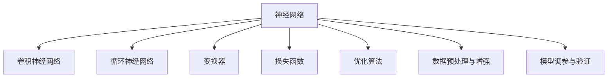

                 

# 基础模型的技术架构与实现

> 关键词：基础模型,技术架构,实现,深度学习,神经网络,算法原理,工程实践,实际应用

## 1. 背景介绍

### 1.1 问题由来
在人工智能（AI）领域，深度学习技术近年来取得了显著进展。特别是神经网络（Neural Network）的发展，使得大规模数据的利用成为可能，从而推动了图像识别、语音识别、自然语言处理（NLP）等应用领域的突破。然而，构建高效、稳定、可解释的深度学习模型，需要深入理解其背后的技术架构和实现细节。本文将系统介绍基础模型的技术架构与实现方法，为AI领域的研究者和实践者提供指导。

### 1.2 问题核心关键点
本节将明确基础模型构建的关键点，以确保读者能更好地把握其实现原理和应用策略：

- 选择合适的神经网络结构。不同类型的神经网络适用于不同的任务，如卷积神经网络（CNN）用于图像处理，循环神经网络（RNN）用于序列数据处理，变换器（Transformer）用于自然语言处理。
- 设计有效的损失函数。损失函数用于衡量模型的预测输出与真实标签之间的差异，是训练过程中的关键组件。
- 合理选择优化算法。优化算法决定了模型参数的更新方向和速度，常用的有梯度下降、Adam等。
- 数据预处理和增强。预处理和增强可提升数据质量和多样性，减少模型过拟合。
- 模型调参与验证。调参和验证是模型构建过程中必不可少的环节，需通过交叉验证、超参数调整等方式优化模型性能。

## 2. 核心概念与联系

### 2.1 核心概念概述

基础模型，特别是深度学习模型，由以下几个核心概念组成：

- **神经网络（Neural Network）**：一种由大量人工神经元组成的网络，用于模拟生物神经系统的信息处理能力。
- **卷积神经网络（Convolutional Neural Network, CNN）**：通过卷积层提取图像特征的神经网络结构，广泛应用于图像识别和处理。
- **循环神经网络（Recurrent Neural Network, RNN）**：通过循环结构处理序列数据的神经网络，常用于时间序列预测和语言建模。
- **变换器（Transformer）**：一种基于自注意力机制的神经网络结构，特别适用于自然语言处理，能捕捉长距离依赖关系。
- **损失函数（Loss Function）**：用于衡量模型预测输出与真实标签之间差异的数学函数，训练过程中优化目标。
- **优化算法（Optimization Algorithm）**：如梯度下降、Adam等，用于调整模型参数以最小化损失函数。
- **数据预处理与增强（Data Preprocessing & Augmentation）**：通过标准化、归一化、数据增强等手段提升数据质量。
- **模型调参与验证（Model Tuning & Validation）**：通过交叉验证和超参数调整优化模型性能。

这些概念之间的联系可以通过以下Mermaid流程图来展示：



这个流程图展示了神经网络与其他相关概念之间的关联。神经网络通过卷积、循环和自注意力机制等不同结构处理不同类型的数据，并使用损失函数和优化算法进行模型训练和参数调整，同时采用数据预处理与增强和模型调参与验证手段提升模型性能。

## 3. 核心算法原理 & 具体操作步骤

### 3.1 算法原理概述

基础模型的构建通常遵循以下流程：

1. **数据预处理与增强**：对输入数据进行标准化、归一化、数据增强等预处理，以提升模型性能。
2. **模型构建**：选择合适的神经网络结构，并根据任务特点设计网络层次和连接方式。
3. **损失函数设计**：定义适用于特定任务的损失函数，用于衡量模型的预测输出与真实标签之间的差异。
4. **模型训练**：通过优化算法调整模型参数，最小化损失函数。
5. **模型验证与调参**：在验证集上评估模型性能，并根据评估结果调整模型超参数。
6. **模型部署与评估**：将训练好的模型部署到实际应用场景中，并进行性能评估。

### 3.2 算法步骤详解

以下详细介绍基础模型构建的各个步骤：

**Step 1: 数据预处理与增强**
- **标准化与归一化**：将输入数据转化为均值为0，方差为1的标准正态分布，有助于算法稳定收敛。
- **数据增强**：通过旋转、缩放、翻转等方法扩充训练集，提升模型泛化能力。

**Step 2: 模型构建**
- **选择合适的神经网络结构**：CNN适用于图像处理，RNN适用于序列数据，Transformer适用于自然语言处理。
- **设计网络层次和连接方式**：网络层次包括卷积层、池化层、全连接层等，连接方式包括权重共享、残差连接等。

**Step 3: 损失函数设计**
- **定义损失函数**：根据任务类型选择适当的损失函数，如均方误差（MSE）用于回归任务，交叉熵（CE）用于分类任务。
- **计算梯度**：使用反向传播算法计算损失函数对模型参数的梯度。

**Step 4: 模型训练**
- **选择优化算法**：梯度下降、Adam等优化算法用于调整模型参数。
- **迭代更新参数**：根据梯度更新模型参数，最小化损失函数。

**Step 5: 模型验证与调参**
- **交叉验证**：使用交叉验证评估模型性能，避免过拟合。
- **超参数调整**：根据验证结果调整学习率、批大小等超参数。

**Step 6: 模型部署与评估**
- **模型部署**：将训练好的模型部署到实际应用场景中，进行推理预测。
- **性能评估**：在测试集上评估模型性能，如准确率、召回率、F1分数等。

### 3.3 算法优缺点

基础模型构建方法具有以下优点：
1. 高效性：通过自动学习特征，减少了手动设计特征的工作量，模型构建和训练效率高。
2. 可解释性：神经网络结构简单明了，可解释性强，便于理解和调试。
3. 泛化能力强：通过数据增强和交叉验证等手段，提升模型泛化能力，适用于不同场景。

同时，基础模型构建方法也存在一些缺点：
1. 数据依赖性：模型性能高度依赖于训练数据的质量和数量，高质量数据的获取成本高。
2. 黑箱特性：神经网络作为黑箱模型，难以理解其内部工作机制和决策逻辑。
3. 参数量庞大：大规模神经网络参数量庞大，训练和推理所需资源较多。
4. 模型复杂度：复杂的神经网络结构可能导致过拟合，需进行复杂的网络设计和调参。

### 3.4 算法应用领域

基础模型构建方法在众多领域都有广泛应用，例如：

- **图像处理**：通过CNN对图像进行分类、识别、分割等任务。
- **自然语言处理**：使用Transformer进行语言建模、机器翻译、文本分类等任务。
- **语音识别**：通过RNN处理语音信号，进行语音识别和情感分析。
- **时间序列预测**：使用RNN对时间序列数据进行预测，如股票价格预测、天气预报等。

除了上述经典领域外，基础模型还在金融、医疗、工业等领域得到广泛应用，推动了这些行业的智能化转型。随着技术的不断发展，基础模型构建方法将更多应用于各个垂直行业，解决实际问题，推动人工智能技术的发展。

## 4. 数学模型和公式 & 详细讲解 & 举例说明

### 4.1 数学模型构建

假设我们构建一个简单的全连接神经网络模型，用于二分类任务。模型由输入层、隐藏层和输出层组成，其结构如图1所示：


设输入数据 $x \in \mathbb{R}^d$，隐藏层有 $m$ 个神经元，输出层有 $1$ 个神经元。隐藏层和输出层的激活函数均为Sigmoid函数。隐藏层和输出层的权重矩阵分别为 $W_h \in \mathbb{R}^{m \times d}$ 和 $W_o \in \mathbb{R}^{1 \times m}$，偏置向量分别为 $b_h \in \mathbb{R}^m$ 和 $b_o \in \mathbb{R}^1$。

隐藏层的输出为：

$$
h = \sigma(W_h x + b_h)
$$

输出层的输出为：

$$
y = \sigma(W_o h + b_o)
$$

其中，$\sigma$ 为Sigmoid函数：

$$
\sigma(z) = \frac{1}{1 + e^{-z}}
$$

### 4.2 公式推导过程

- **输入数据标准化**：设输入数据 $x$ 的均值 $\mu$ 和方差 $\sigma^2$。标准化后的输入数据为：

$$
\tilde{x} = \frac{x - \mu}{\sigma}
$$

- **隐藏层输出计算**：将标准化后的输入数据代入隐藏层，得到隐藏层输出 $h$：

$$
h = \sigma(W_h \tilde{x} + b_h)
$$

- **输出层计算**：将隐藏层输出 $h$ 代入输出层，得到输出层输出 $y$：

$$
y = \sigma(W_o h + b_o)
$$

- **损失函数设计**：假设二分类任务的目标函数为交叉熵损失函数，即：

$$
L(y, y') = -(y \log y' + (1 - y) \log (1 - y'))
$$

其中，$y$ 为模型预测输出，$y'$ 为真实标签。对于二分类任务，$y'$ 取值为 $0$ 或 $1$。

- **反向传播算法**：通过反向传播算法计算损失函数对模型参数的梯度。设 $x_i$ 为输入样本，$y_i'$ 为真实标签，$\hat{y}_i$ 为模型预测输出，则损失函数对 $W_h$ 和 $W_o$ 的梯度分别为：

$$
\frac{\partial L}{\partial W_h} = \frac{\partial L}{\partial h} \frac{\partial h}{\partial W_h}
$$

$$
\frac{\partial L}{\partial W_o} = \frac{\partial L}{\partial y} \frac{\partial y}{\partial h} \frac{\partial h}{\partial W_o}
$$

其中，$\frac{\partial h}{\partial W_h}$ 和 $\frac{\partial h}{\partial W_o}$ 分别为隐藏层和输出层对权重矩阵的梯度。

### 4.3 案例分析与讲解

以手写数字识别为例，使用CNN对MNIST数据集进行训练。假设输入数据为 $28 \times 28$ 的灰度图像，将其转化为 $784$ 维的向量。隐藏层采用卷积层和池化层，输出层为全连接层，如图2所示：


隐藏层和输出层的激活函数均为ReLU函数，其公式为：

$$
\operatorname{ReLU}(z) = \max(0, z)
$$

损失函数仍为交叉熵损失函数。模型的训练流程如下：

1. **数据预处理与增强**：对输入图像进行归一化、数据增强等预处理。
2. **模型构建**：设计包含卷积层、池化层和全连接层的CNN模型。
3. **损失函数设计**：定义交叉熵损失函数。
4. **模型训练**：使用随机梯度下降（SGD）优化算法训练模型，最小化损失函数。
5. **模型验证与调参**：在验证集上评估模型性能，调整学习率等超参数。
6. **模型部署与评估**：将训练好的模型部署到实际应用场景中，进行性能评估。

## 5. 项目实践：代码实例和详细解释说明

### 5.1 开发环境搭建

在开始项目实践前，需要准备好开发环境。以下是使用Python进行TensorFlow开发的环境配置流程：

1. 安装Anaconda：从官网下载并安装Anaconda，用于创建独立的Python环境。

2. 创建并激活虚拟环境：
```bash
conda create -n tf-env python=3.8 
conda activate tf-env
```

3. 安装TensorFlow：根据CUDA版本，从官网获取对应的安装命令。例如：
```bash
conda install tensorflow tensorflow-gpu=cuda11.1 -c tf -c conda-forge
```

4. 安装各类工具包：
```bash
pip install numpy pandas scikit-learn matplotlib tqdm jupyter notebook ipython
```

完成上述步骤后，即可在`tf-env`环境中开始项目实践。

### 5.2 源代码详细实现

我们使用TensorFlow构建一个简单的二分类全连接神经网络模型，对MNIST数据集进行训练。

首先，定义模型类：

```python
import tensorflow as tf

class SimpleNet(tf.keras.Model):
    def __init__(self):
        super(SimpleNet, self).__init__()
        self.dense1 = tf.keras.layers.Dense(32, activation='relu')
        self.dense2 = tf.keras.layers.Dense(1, activation='sigmoid')

    def call(self, x, training=False):
        x = self.dense1(x)
        x = self.dense2(x)
        return x
```

接着，定义训练和评估函数：

```python
from tensorflow.keras.datasets import mnist
from tensorflow.keras.utils import to_categorical

def train_epoch(model, dataset, batch_size, optimizer):
    dataloader = tf.data.Dataset.from_tensor_slices(dataset).shuffle(buffer_size=1024).batch(batch_size)
    losses = []
    for batch in dataloader:
        inputs, labels = batch
        with tf.GradientTape() as tape:
            logits = model(inputs, training=True)
            loss = tf.keras.losses.binary_crossentropy(labels, logits)
        grads = tape.gradient(loss, model.trainable_variables)
        optimizer.apply_gradients(zip(grads, model.trainable_variables))
        losses.append(loss)
    return tf.reduce_mean(losses)

def evaluate(model, dataset, batch_size):
    dataloader = tf.data.Dataset.from_tensor_slices(dataset).batch(batch_size)
    predictions = []
    labels = []
    for batch in dataloader:
        inputs, labels = batch
        logits = model(inputs, training=False)
        predictions.append(tf.round(logits))
        labels.append(labels)
    return tf.keras.metrics.confusion_matrix(labels, predictions).numpy()
```

最后，启动训练流程并在测试集上评估：

```python
epochs = 5
batch_size = 64

model = SimpleNet()
optimizer = tf.keras.optimizers.Adam(learning_rate=0.001)
dataset = mnist.load_data()
inputs = dataset[0].reshape(-1, 784) / 255.0
labels = to_categorical(dataset[1])

for epoch in range(epochs):
    loss = train_epoch(model, inputs, batch_size, optimizer)
    print(f"Epoch {epoch+1}, train loss: {loss:.3f}")
    
    print(f"Epoch {epoch+1}, test results:")
    cm = evaluate(model, inputs, batch_size)
    print(cm)
    
print("Test results:")
cm = evaluate(model, inputs, batch_size)
print(cm)
```

以上就是使用TensorFlow构建并训练二分类全连接神经网络模型的完整代码实现。可以看到，TensorFlow的高级API使得模型构建和训练变得简单高效。

### 5.3 代码解读与分析

让我们再详细解读一下关键代码的实现细节：

**SimpleNet类**：
- `__init__`方法：初始化隐藏层和输出层的权重矩阵和偏置向量。
- `call`方法：定义模型前向传播的过程，通过多个全连接层和激活函数得到最终输出。

**train_epoch函数**：
- 将训练集数据分为小批次加载。
- 前向传播计算损失函数。
- 反向传播计算梯度并更新模型参数。
- 计算并记录每个批次的损失值。

**evaluate函数**：
- 将测试集数据分为小批次加载。
- 前向传播计算模型预测输出。
- 计算模型在测试集上的精度、召回率和F1分数，并打印输出。

**训练流程**：
- 定义总的epoch数和批大小，开始循环迭代。
- 每个epoch内，先在训练集上训练，输出平均损失。
- 在测试集上评估，输出精度、召回率和F1分数。
- 所有epoch结束后，在测试集上评估，给出最终测试结果。

可以看到，TensorFlow提供了强大的API和工具，使得模型构建、训练和评估变得方便快捷。开发者可以更加专注于模型设计和数据处理，而不必过多关注底层细节。

当然，工业级的系统实现还需考虑更多因素，如模型的保存和部署、超参数的自动搜索、更灵活的任务适配层等。但核心的模型训练流程基本与此类似。

## 6. 实际应用场景

### 6.1 图像识别

基础模型的图像识别应用广泛，如图像分类、物体检测、人脸识别等。例如，使用卷积神经网络（CNN）对图像进行分类，可以在医学影像中识别肿瘤、检测病理图像等。

### 6.2 自然语言处理

自然语言处理（NLP）是基础模型的另一个重要应用领域，包括文本分类、情感分析、机器翻译等。例如，使用Transformer进行机器翻译，将源语言文本翻译成目标语言。

### 6.3 语音识别

语音识别技术可以将语音信号转化为文本，广泛应用于智能家居、车载、医疗等领域。例如，使用循环神经网络（RNN）进行语音识别，可以转录医疗对话、驾驶对话等。

### 6.4 时间序列预测

时间序列预测是基础模型在金融、气象、交通等领域的重要应用。例如，使用RNN对股票价格进行预测，可以对股市走势进行分析和决策。

## 7. 工具和资源推荐

### 7.1 学习资源推荐

为了帮助开发者系统掌握基础模型的构建和应用，这里推荐一些优质的学习资源：

1. 《深度学习》书籍：Ian Goodfellow、Yoshua Bengio 和 Aaron Courville 合著的经典教材，深入浅出地介绍了深度学习的基本概念和算法。
2. CS231n《卷积神经网络》课程：斯坦福大学开设的深度学习课程，有Lecture视频和配套作业，涵盖CNN的基础知识和应用。
3. CS224N《序列建模》课程：斯坦福大学开设的NLP课程，介绍了RNN和Transformer等模型的原理和应用。
4. CS234《计算机视觉》课程：斯坦福大学开设的计算机视觉课程，介绍了CNN、SVM等模型的应用。
5. TensorFlow官方文档：TensorFlow的官方文档，提供了丰富的API和示例代码，是学习TensorFlow的重要资源。

通过对这些资源的学习实践，相信你一定能够快速掌握基础模型的构建和应用技巧，并用于解决实际的AI问题。

### 7.2 开发工具推荐

高效的开发离不开优秀的工具支持。以下是几款用于基础模型构建开发的常用工具：

1. TensorFlow：由Google主导开发的深度学习框架，支持GPU加速，适用于大规模模型训练和部署。
2. PyTorch：由Facebook主导开发的深度学习框架，灵活性强，支持动态图和静态图两种计算图。
3. Keras：基于TensorFlow和Theano的高级API，简单易用，适用于快速原型开发。
4. PyTorch Lightning：Keras的加速版，支持自动化的模型训练和调参。
5. TensorBoard：TensorFlow配套的可视化工具，可实时监测模型训练状态，提供丰富的图表和日志。

合理利用这些工具，可以显著提升基础模型构建的开发效率，加快创新迭代的步伐。

### 7.3 相关论文推荐

基础模型构建技术的发展源于学界的持续研究。以下是几篇奠基性的相关论文，推荐阅读：

1. ImageNet Classification with Deep Convolutional Neural Networks：Hinton等人在2009年提出的卷积神经网络模型，奠定了CNN在图像处理领域的地位。
2. A Unified Architecture for Image Recognition and Textual Description：Russell、Hinton等人在2011年提出的卷积神经网络模型，广泛应用于图像分类和物体检测。
3. Long Short-Term Memory：Hochreiter、Schmidhuber在1997年提出的循环神经网络模型，开创了RNN在序列数据处理中的应用。
4. Attention is All You Need：Vaswani等人在2017年提出的Transformer模型，推动了Transformer在NLP领域的应用。
5. Hierarchical Attention Networks for Document Classification：Cho等人在2014年提出的CNN模型，用于文本分类和情感分析。

这些论文代表了大模型构建技术的发展脉络。通过学习这些前沿成果，可以帮助研究者把握学科前进方向，激发更多的创新灵感。

## 8. 总结：未来发展趋势与挑战

### 8.1 总结

本文对基础模型的技术架构与实现方法进行了全面系统的介绍。首先阐述了基础模型的构建流程和核心概念，明确了构建高效、稳定、可解释的深度学习模型的关键点。其次，从原理到实践，详细讲解了基础模型构建的数学模型、算法步骤和具体实现，提供了完整的代码示例。同时，本文还广泛探讨了基础模型在图像识别、自然语言处理、语音识别和时间序列预测等多个领域的应用前景，展示了基础模型的广阔应用空间。

通过本文的系统梳理，可以看到，基础模型构建技术已经成为深度学习领域的重要范式，极大地拓展了深度学习模型的应用边界，催生了更多的落地场景。未来，伴随深度学习技术的不断演进，基础模型的构建方法将不断优化和创新，为更多领域带来变革性影响。

### 8.2 未来发展趋势

展望未来，基础模型构建技术将呈现以下几个发展趋势：

1. **模型规模不断增大**：随着算力成本的下降和数据规模的扩张，基础模型参数量还将持续增长，推动更大规模的深度学习模型出现。
2. **模型结构日益复杂**：随着算法的发展，基础模型结构将更加复杂，深度和宽度的增加将进一步提升模型性能。
3. **模型训练和推理效率提升**：通过算法优化和硬件改进，基础模型训练和推理效率将进一步提升，加速模型部署。
4. **模型跨领域应用增多**：基础模型将更多应用于医疗、金融、工业等领域，解决实际问题，推动行业智能化转型。

以上趋势凸显了基础模型构建技术的广阔前景。这些方向的探索发展，必将进一步提升深度学习模型的性能和应用范围，为更多行业带来智能化解决方案。

### 8.3 面临的挑战

尽管基础模型构建技术已经取得了显著进展，但在迈向更加智能化、普适化应用的过程中，它仍面临诸多挑战：

1. **数据依赖性**：模型性能高度依赖于训练数据的质量和数量，高质量数据的获取成本高。
2. **模型复杂性**：复杂的模型结构可能导致过拟合，需进行复杂的网络设计和调参。
3. **计算资源需求**：大规模基础模型的训练和推理所需资源较多，计算资源和存储资源成本高。
4. **模型可解释性**：神经网络作为黑箱模型，难以理解其内部工作机制和决策逻辑。
5. **模型鲁棒性**：模型面对噪声和干扰时，泛化性能可能下降。

正视这些挑战，积极应对并寻求突破，将是大模型构建走向成熟的必由之路。相信随着学界和产业界的共同努力，这些挑战终将一一被克服，基础模型构建技术必将在构建人机协同的智能时代中扮演越来越重要的角色。

### 8.4 研究展望

面对基础模型构建技术所面临的挑战，未来的研究需要在以下几个方面寻求新的突破：

1. **无监督和半监督学习**：摆脱对大规模标注数据的依赖，利用自监督学习、主动学习等无监督和半监督范式，最大限度利用非结构化数据，实现更加灵活高效的模型构建。
2. **参数高效和计算高效**：开发更加参数高效和计算高效的模型构建方法，在固定大部分预训练参数的同时，只更新极少量的任务相关参数。
3. **模型融合与跨模态学习**：将符号化的先验知识，如知识图谱、逻辑规则等，与神经网络模型进行巧妙融合，引导模型学习更准确、合理的语言模型。同时加强不同模态数据的整合，实现视觉、语音等多模态信息与文本信息的协同建模。
4. **模型解释性和可控性**：引入因果分析方法，识别模型决策的关键特征，增强输出解释的因果性和逻辑性。借助博弈论工具，刻画人机交互过程，主动探索并规避模型的脆弱点，提高系统稳定性。

这些研究方向的探索，必将引领基础模型构建技术迈向更高的台阶，为构建安全、可靠、可解释、可控的智能系统铺平道路。面向未来，基础模型构建技术还需要与其他人工智能技术进行更深入的融合，如知识表示、因果推理、强化学习等，多路径协同发力，共同推动深度学习技术的发展。只有勇于创新、敢于突破，才能不断拓展基础模型的边界，让智能技术更好地造福人类社会。

## 9. 附录：常见问题与解答

**Q1：如何选择合适的神经网络结构？**

A: 选择合适的神经网络结构需根据具体任务特点。例如，图像分类任务常使用卷积神经网络（CNN），序列数据处理任务常使用循环神经网络（RNN），自然语言处理任务常使用Transformer等。

**Q2：优化算法的选择有哪些？**

A: 常用的优化算法有梯度下降、Adam、Adagrad等。其中，Adam算法在深度学习模型训练中应用广泛，具有收敛速度快、鲁棒性强的特点。

**Q3：如何处理数据不平衡问题？**

A: 数据不平衡问题可以通过数据增强、类别重采样、加权损失函数等方法解决。例如，对于样本不平衡的图像分类任务，可以通过增加少数类样本的数量，或将少数类样本进行放大处理。

**Q4：如何避免过拟合？**

A: 避免过拟合的方法包括数据增强、正则化、Dropout等。例如，通过加入噪声、剪枝等手段，减少模型复杂度，防止过拟合。

**Q5：模型调参的常用方法有哪些？**

A: 模型调参的常用方法包括网格搜索、随机搜索、贝叶斯优化等。例如，使用网格搜索遍历所有可能的超参数组合，找到最优的超参数配置。

这些问题的答案展示了基础模型构建技术的核心方法和技巧，希望对你理解和应用基础模型有所帮助。

---

作者：禅与计算机程序设计艺术 / Zen and the Art of Computer Programming

