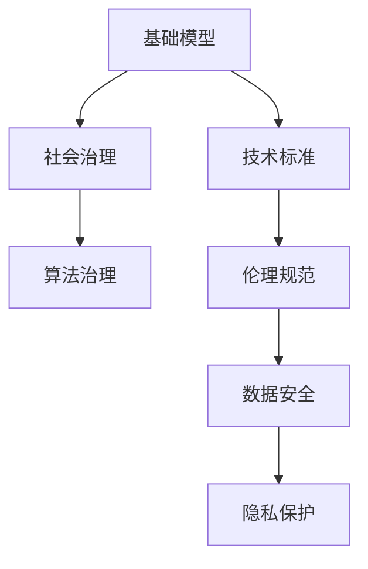

                 

# 基础模型的技术标准与社会治理

> 关键词：基础模型,技术标准,社会治理,算法治理,伦理规范,数据安全

## 1. 背景介绍

### 1.1 问题由来
基础模型（Foundation Models）是指那些通过大规模无标签数据预训练获得的通用模型，如BERT、GPT-3等。它们具备强大的语言和视觉理解能力，为许多下游任务提供了一阶能力（First-Principles Capability）。然而，随着基础模型的应用越来越广泛，其带来的伦理、法律和社会治理问题也愈发突出。

当前，基础模型的广泛应用已渗透到医疗、金融、司法等多个领域。这些模型基于庞大的数据集进行训练，其决策过程往往缺乏透明性和可解释性，容易导致偏见和歧视。例如，训练数据中存在的性别、种族等偏见，可能会通过模型传递到下游应用中，影响决策的公平性和公正性。此外，基础模型的大规模参数和计算资源需求，也引发了关于数据隐私、计算安全和算法治理等社会治理问题。

在这样的背景下，如何制定基础模型的技术标准，确保其决策的公正性和透明性，成为了一个迫切需要解决的问题。本文旨在从技术标准和社会治理两个层面，探讨基础模型的应用和治理问题，为相关领域的从业人员提供一定的参考。

## 2. 核心概念与联系

### 2.1 核心概念概述

- **基础模型（Foundation Model）**：指通过大规模无标签数据预训练获得的通用模型，具备强大的语言和视觉理解能力，为下游任务提供一阶能力。
- **技术标准（Technical Standards）**：指对基础模型的训练、应用和部署过程，提出的性能、安全、透明和公平等要求。
- **社会治理（Social Governance）**：指对基础模型在社会应用中的伦理、法律和道德问题，进行规范和治理的措施和机制。
- **算法治理（Algorithm Governance）**：指对基础模型在算法决策中的可解释性、公正性和透明性，进行管理和监控的方法和工具。
- **伦理规范（Ethical Norms）**：指对基础模型在社会应用中的伦理道德问题，如隐私保护、数据使用和偏见消除等，进行约束和指导的原则和规范。
- **数据安全（Data Security）**：指对基础模型训练和应用过程中涉及的数据隐私和安全性问题，进行保护和管理的手段和措施。

这些核心概念通过技术标准和社会治理的桥梁，将基础模型的性能优化与伦理、法律和道德的规范相结合，形成了一个完整的基础模型治理体系。

### 2.2 核心概念原理和架构的 Mermaid 流程图



这个流程图展示了基础模型、技术标准、社会治理、算法治理、伦理规范和数据安全之间的联系：

1. **基础模型**：通过大规模无标签数据预训练，为下游任务提供通用能力。
2. **技术标准**：对基础模型的训练、应用和部署过程，提出性能、安全、透明和公平等要求。
3. **社会治理**：通过制定伦理、法律和道德规范，对基础模型在社会应用中的问题进行治理。
4. **算法治理**：对基础模型在算法决策中的可解释性、公正性和透明性，进行管理和监控。
5. **伦理规范**：对基础模型在社会应用中的伦理道德问题，进行约束和指导。
6. **数据安全**：对基础模型训练和应用过程中涉及的数据隐私和安全性问题，进行保护和管理。

## 3. 核心算法原理 & 具体操作步骤

### 3.1 算法原理概述

基础模型通常通过大规模无标签数据进行预训练，学习到语言和视觉等领域的通用知识。其核心算法包括自监督学习、深度神经网络、Transformer架构等。预训练过程通过大规模数据并行计算，显著提升了模型的性能和泛化能力。

### 3.2 算法步骤详解

基础模型的预训练步骤通常包括：

1. **数据准备**：收集大规模无标签数据，进行数据清洗和预处理。
2. **模型训练**：使用Transformer架构，在大规模数据上进行多轮训练，学习到语言和视觉等领域的通用知识。
3. **下游任务微调**：将预训练模型应用于下游任务，通过少量标注数据进行微调，获得任务的特定能力。

### 3.3 算法优缺点

**优点**：

- 通用性强：预训练模型可以应用于多种下游任务，具有较强的泛化能力。
- 性能优越：大规模数据和复杂结构的Transformer架构，使得模型性能显著优于传统模型。
- 可扩展性好：模型可以通过微调和迁移学习，进一步适应特定领域和任务。

**缺点**：

- 数据需求高：预训练和微调都需要大规模数据，数据获取成本高。
- 计算资源需求大：大规模参数和复杂架构，对计算资源需求高。
- 决策透明性低：模型复杂，决策过程难以解释，缺乏透明性。

### 3.4 算法应用领域

基础模型在多个领域得到了广泛应用，如自然语言处理（NLP）、计算机视觉（CV）、语音识别等。其应用场景包括但不限于：

- **自然语言处理**：文本分类、情感分析、机器翻译、对话系统等。
- **计算机视觉**：图像识别、物体检测、图像生成、视频分析等。
- **语音识别**：语音转文字、语音合成、语音情感分析等。
- **医疗健康**：医学影像分析、病历摘要、疾病诊断等。
- **金融领域**：信用评估、欺诈检测、投资分析等。
- **司法领域**：法律文书分析、证据推理、判决生成等。

## 4. 数学模型和公式 & 详细讲解 & 举例说明

### 4.1 数学模型构建

基础模型的数学模型通常包括自监督学习目标和下游任务的目标函数。以语言模型为例，自监督学习目标为最大化语言概率，下游任务目标为在特定数据集上的分类准确率。

### 4.2 公式推导过程

自监督学习目标函数为：

$$
\mathcal{L}_{self\text{-}sup} = -\frac{1}{N} \sum_{i=1}^{N} \log P(x_i)
$$

其中 $N$ 为数据集大小，$P(x_i)$ 为模型对样本 $x_i$ 的预测概率。

下游任务目标函数为：

$$
\mathcal{L}_{task} = -\frac{1}{N} \sum_{i=1}^{N} \ell(M_{\theta}(x_i), y_i)
$$

其中 $\ell$ 为任务特定的损失函数，$y_i$ 为样本的真实标签。

### 4.3 案例分析与讲解

以BERT模型为例，其预训练过程主要包括掩码语言模型（Masked Language Model）和下一句预测（Next Sentence Prediction）两个任务。掩码语言模型的目标是通过预测被屏蔽的单词，学习到上下文信息。下一句预测任务的目标是通过预测两个句子是否相连，学习到句子之间的关系。

在微调过程中，BERT模型可以应用于文本分类、情感分析等任务。通过在文本分类任务上微调，可以使其学习到文本与类别之间的关系，从而获得特定的分类能力。

## 5. 项目实践：代码实例和详细解释说明

### 5.1 开发环境搭建

在进行基础模型项目实践前，需要搭建开发环境。以下是使用Python和TensorFlow搭建环境的步骤：

1. 安装Anaconda：从官网下载并安装Anaconda，用于创建独立的Python环境。
2. 创建并激活虚拟环境：
```bash
conda create -n pyenv python=3.8
conda activate pyenv
```
3. 安装TensorFlow：根据CUDA版本，从官网获取对应的安装命令。例如：
```bash
conda install tensorflow -c tf -c conda-forge
```
4. 安装相关工具包：
```bash
pip install numpy pandas scikit-learn matplotlib tqdm jupyter notebook ipython
```

完成上述步骤后，即可在`pyenv`环境中开始基础模型的项目实践。

### 5.2 源代码详细实现

以下是一个使用TensorFlow实现BERT微调的代码实例。

```python
import tensorflow as tf
from transformers import BertTokenizer, TFBertForSequenceClassification
import numpy as np
from sklearn.model_selection import train_test_split

# 准备数据
tokenizer = BertTokenizer.from_pretrained('bert-base-uncased')
train_data, test_data = train_test_split(df, test_size=0.2, random_state=42)

# 定义模型
model = TFBertForSequenceClassification.from_pretrained('bert-base-uncased', num_labels=num_labels)

# 准备输入数据
train_encodings = tokenizer(train_data, truncation=True, padding=True)
test_encodings = tokenizer(test_data, truncation=True, padding=True)

# 定义损失函数和优化器
loss_fn = tf.keras.losses.SparseCategoricalCrossentropy(from_logits=True)
optimizer = tf.keras.optimizers.Adam(learning_rate=3e-5)

# 定义训练函数
@tf.function
def train_step(encodings, labels):
    with tf.GradientTape() as tape:
        outputs = model(encodings['input_ids'], attention_mask=encodings['attention_mask'])
        loss = loss_fn(labels, outputs.logits)
    gradients = tape.gradient(loss, model.trainable_variables)
    optimizer.apply_gradients(zip(gradients, model.trainable_variables))
    return loss

# 训练模型
train_loss = 0.0
train_acc = 0.0
for epoch in range(num_epochs):
    for batch in train_dataset:
        labels = batch['label']
        encodings = batch['encodings']
        loss = train_step(encodings, labels)
        train_loss += loss.numpy()
        train_acc += tf.keras.metrics.sparse_categorical_accuracy(labels, model(encodings['input_ids'], attention_mask=encodings['attention_mask'])).numpy()

# 评估模型
test_loss = 0.0
test_acc = 0.0
for batch in test_dataset:
    labels = batch['label']
    encodings = batch['encodings']
    loss = test_step(encodings, labels)
    test_loss += loss.numpy()
    test_acc += tf.keras.metrics.sparse_categorical_accuracy(labels, model(encodings['input_ids'], attention_mask=encodings['attention_mask'])).numpy()

print(f'Train Loss: {train_loss / num_epochs}')
print(f'Train Acc: {train_acc / num_epochs}')
print(f'Test Loss: {test_loss / num_epochs}')
print(f'Test Acc: {test_acc / num_epochs}')
```

在这个代码实例中，我们首先导入了TensorFlow和Transformers库，然后准备数据集并进行模型定义。接着，我们定义了损失函数和优化器，并使用TensorFlow的`@tf.function`装饰器将训练函数定义为函数式模型，以优化性能。最后，我们训练模型并在测试集上评估性能。

### 5.3 代码解读与分析

**数据准备**：
- 使用BERT的Tokenizer对文本进行分词和编码。
- 将数据集分为训练集和测试集，并使用`train_test_split`函数进行划分。

**模型定义**：
- 使用Transformers库的`TFBertForSequenceClassification`类定义模型。

**输入数据准备**：
- 使用`tokenizer`对文本进行编码，生成模型的输入特征。

**损失函数和优化器定义**：
- 使用`SparseCategoricalCrossentropy`作为损失函数，`Adam`作为优化器。

**训练函数实现**：
- 在每个批次的数据上执行前向传播和反向传播，计算损失并更新模型参数。

**模型训练和评估**：
- 在训练集上循环迭代，计算损失和精度，并记录训练结果。
- 在测试集上计算损失和精度，评估模型性能。

## 6. 实际应用场景

### 6.1 智能客服系统

在智能客服系统中，基础模型可以用于构建智能对话机器人。通过预训练和微调，机器人可以理解用户意图，并自动提供答案。例如，可以训练基础模型进行对话生成的微调，使其能够生成符合用户需求的回复。此外，可以通过加入情感分析模型，对用户情绪进行识别和反馈，提升用户体验。

### 6.2 金融领域

在金融领域，基础模型可以用于信用评估、欺诈检测、投资分析等任务。通过在金融领域的数据上进行微调，基础模型可以学习到与金融相关的知识，提高决策的准确性。例如，可以训练基础模型进行金融文本分类，区分正面和负面评论，从而评估贷款申请人的信用风险。

### 6.3 医疗领域

在医疗领域，基础模型可以用于疾病诊断、病历摘要、医学影像分析等任务。通过在医疗领域的数据上进行微调，基础模型可以学习到医学领域的知识，提高诊断的准确性。例如，可以训练基础模型进行医学影像分类，识别不同类型的疾病，提供初步的诊断建议。

## 7. 工具和资源推荐

### 7.1 学习资源推荐

为了帮助开发者系统掌握基础模型的理论基础和实践技巧，这里推荐一些优质的学习资源：

1. 《深度学习入门》：由张铁朗教授所著，详细介绍了深度学习的基础概念和算法，适合入门读者。
2. 《TensorFlow实战Google深度学习》：由Andriy Burkov所著，介绍了TensorFlow的实际应用，涵盖从入门到进阶的内容。
3. 《Transformers：序列到序列学习》：由Wojciech Zaremba等人所著，深入浅出地介绍了Transformer架构，适合进阶读者。
4. 《自然语言处理入门》：由林达华教授所著，介绍了自然语言处理的基本概念和算法，适合入门读者。
5. 《机器学习实战》：由Peter Harrington所著，介绍了机器学习的基本概念和算法，适合入门读者。

通过对这些资源的学习实践，相信你一定能够快速掌握基础模型的理论基础和实践技巧，并用于解决实际的NLP问题。

### 7.2 开发工具推荐

高效的开发离不开优秀的工具支持。以下是几款用于基础模型开发常用的工具：

1. TensorFlow：由Google主导开发的开源深度学习框架，生产部署方便，适合大规模工程应用。
2. PyTorch：基于Python的开源深度学习框架，灵活动态的计算图，适合快速迭代研究。
3. Jupyter Notebook：开源的Web应用程序，用于创建和共享文档、数据和代码。
4. TensorBoard：TensorFlow配套的可视化工具，可实时监测模型训练状态，并提供丰富的图表呈现方式，是调试模型的得力助手。
5. Weights & Biases：模型训练的实验跟踪工具，可以记录和可视化模型训练过程中的各项指标，方便对比和调优。

合理利用这些工具，可以显著提升基础模型开发和研究的效率，加快创新迭代的步伐。

### 7.3 相关论文推荐

基础模型的发展源于学界的持续研究。以下是几篇奠基性的相关论文，推荐阅读：

1. Attention is All You Need：提出了Transformer结构，开启了NLP领域的预训练大模型时代。
2. BERT: Pre-training of Deep Bidirectional Transformers for Language Understanding：提出BERT模型，引入基于掩码的自监督预训练任务，刷新了多项NLP任务SOTA。
3. Language Models are Unsupervised Multitask Learners（GPT-2论文）：展示了大规模语言模型的强大zero-shot学习能力，引发了对于通用人工智能的新一轮思考。
4. Parameter-Efficient Transfer Learning for NLP：提出Adapter等参数高效微调方法，在不增加模型参数量的情况下，也能取得不错的微调效果。
5. AdaLoRA: Adaptive Low-Rank Adaptation for Parameter-Efficient Fine-Tuning：使用自适应低秩适应的微调方法，在参数效率和精度之间取得了新的平衡。

这些论文代表了大模型微调技术的发展脉络。通过学习这些前沿成果，可以帮助研究者把握学科前进方向，激发更多的创新灵感。

## 8. 总结：未来发展趋势与挑战

### 8.1 研究成果总结

基础模型的广泛应用已经带来了显著的经济和社会效益，但其带来的伦理、法律和社会治理问题也愈发突出。通过制定技术标准和社会治理措施，基础模型的应用可以更加规范和安全。未来，基础模型的发展趋势和挑战如下：

- 技术标准：制定统一的技术标准，确保基础模型的性能和公平性。
- 社会治理：通过伦理规范和法律约束，保护数据隐私和算法透明性。
- 算法治理：开发可解释性和公正性的算法治理工具，监控模型决策过程。
- 数据安全：加强数据隐私保护，确保数据安全性和合法使用。

### 8.2 未来发展趋势

未来，基础模型的发展趋势如下：

1. 技术标准：制定统一的技术标准，确保基础模型的性能和公平性。
2. 社会治理：通过伦理规范和法律约束，保护数据隐私和算法透明性。
3. 算法治理：开发可解释性和公正性的算法治理工具，监控模型决策过程。
4. 数据安全：加强数据隐私保护，确保数据安全性和合法使用。

### 8.3 面临的挑战

尽管基础模型已经取得了显著进展，但在迈向更加智能化、普适化应用的过程中，其面临的挑战仍然存在：

1. 数据隐私：基础模型的训练和应用过程中，需要处理大量个人数据，如何保护数据隐私是一个重要问题。
2. 算法透明性：基础模型的复杂性使得其决策过程难以解释，如何提高算法的透明性是一个关键挑战。
3. 公平性：基础模型可能继承训练数据中的偏见，如何在模型中消除这些偏见是一个重要问题。
4. 安全性和鲁棒性：基础模型可能受到对抗样本的攻击，如何提高模型的安全性和鲁棒性是一个重要挑战。
5. 计算资源：基础模型的训练和推理需要大量的计算资源，如何提高模型的高效性和可扩展性是一个重要问题。

### 8.4 研究展望

未来，基础模型研究的展望如下：

1. 数据隐私保护：开发更加隐私保护的数据处理技术，确保数据使用的合法性和安全性。
2. 算法透明性：开发更加可解释性的算法模型，提高算法的透明性和可信度。
3. 公平性：开发更加公平性的算法模型，消除模型中的偏见和歧视。
4. 安全性和鲁棒性：开发更加安全性和鲁棒性的算法模型，提高模型的抗攻击能力。
5. 高效性：开发更加高效性的算法模型，提高模型的计算效率和可扩展性。

总之，基础模型的未来发展需要综合考虑技术、伦理和法律等多个维度，只有协同发力，才能构建更加智能、普适、安全和可信赖的AI系统。

## 9. 附录：常见问题与解答

**Q1：基础模型的伦理问题如何解决？**

A: 基础模型的伦理问题主要来源于训练数据中的偏见和歧视。解决这一问题需要：

1. 数据清洗：对训练数据进行清洗，去除包含偏见和歧视的数据。
2. 多样化数据：使用多样化的数据进行训练，减少模型对单一数据集的依赖。
3. 模型监控：对模型进行持续监控，及时发现和纠正模型中的偏见和歧视。
4. 公平性评估：对模型进行公平性评估，确保模型在不同人群中的表现一致。

**Q2：如何保护基础模型的数据隐私？**

A: 保护基础模型的数据隐私需要：

1. 数据匿名化：对数据进行匿名化处理，去除个人隐私信息。
2. 访问控制：对数据访问进行严格控制，确保只有授权人员可以访问数据。
3. 加密技术：使用加密技术对数据进行保护，防止数据泄露。
4. 合规性：确保数据处理符合相关法律法规和隐私保护标准。

**Q3：如何提高基础模型的透明性？**

A: 提高基础模型的透明性需要：

1. 可解释性模型：使用可解释性模型，提高模型的解释能力。
2. 决策路径可视化：通过决策路径可视化技术，展示模型决策过程。
3. 模型文档：编写详细的模型文档，描述模型的结构和训练过程。
4. 模型评估：对模型进行全面的评估，包括性能、公平性和透明性等。

**Q4：如何提高基础模型的公平性？**

A: 提高基础模型的公平性需要：

1. 数据多样性：使用多样化的数据进行训练，减少模型对单一数据集的依赖。
2. 公平性评估：对模型进行公平性评估，确保模型在不同人群中的表现一致。
3. 算法调整：调整算法模型，消除模型中的偏见和歧视。
4. 模型监控：对模型进行持续监控，及时发现和纠正模型中的偏见和歧视。

**Q5：如何提高基础模型的鲁棒性？**

A: 提高基础模型的鲁棒性需要：

1. 对抗样本训练：使用对抗样本训练模型，提高模型的抗攻击能力。
2. 模型泛化：使用更多的数据进行训练，提高模型的泛化能力。
3. 多模型集成：使用多个模型进行集成，提高模型的鲁棒性和可靠性。
4. 模型监控：对模型进行持续监控，及时发现和纠正模型中的问题。

---

作者：禅与计算机程序设计艺术 / Zen and the Art of Computer Programming

