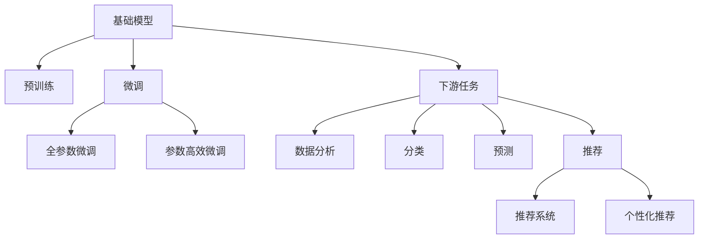

                 

# 基础模型的潜在下游应用

> 关键词：基础模型,预训练模型,下游任务,应用场景,代码实例,机器学习,深度学习,数据分析,数据挖掘

## 1. 背景介绍

### 1.1 问题由来
近年来，深度学习模型在多个领域取得了显著进展，其中基础模型的广泛应用尤为引人注目。基础模型是指在大型数据集上进行预训练，然后通过微调等方式应用于下游特定任务的大规模神经网络模型。这类模型通常具有强大的泛化能力，能够显著提升下游任务的表现。

基础模型的成功应用得益于以下几个方面：
1. 大规模无标签数据集的预训练，使得模型学习到丰富的通用知识。
2. 微调过程的灵活性，能够快速适应特定任务。
3. 高性能计算平台的支持，使模型能够有效利用GPU/TPU等硬件资源。

在医疗、金融、教育、娱乐等众多领域，基础模型被广泛应用于数据分析、分类、预测、推荐等任务，显著提升了数据处理和决策支持的能力。然而，基础模型在实际应用中也面临着一些挑战，如模型参数量大、训练成本高、泛化能力不足等问题。

因此，本文将从基础模型的原理、算法、应用场景、以及实际落地案例等方面，深入探讨其潜在的下游应用，旨在为读者提供全面的技术指导，助力其在实际项目中的有效应用。

## 2. 核心概念与联系

### 2.1 核心概念概述

为了更好地理解基础模型的潜在下游应用，我们首先需要明确几个关键概念：

- **基础模型(Base Model)**：通过大规模无标签数据集进行预训练的大规模神经网络模型，如BERT、GPT、ResNet等。这类模型通常具有大规模的参数量和复杂的网络结构。
- **预训练(Pre-training)**：在无标签数据集上进行自监督学习，学习通用的语言或图像特征表示。预训练过程通常需要大量的计算资源和时间。
- **微调(Fine-tuning)**：在预训练模型的基础上，通过下游任务的少量有标签数据，调整模型的部分参数以适应特定任务。微调过程通常较短，但需要保证数据的高质量。
- **下游任务(Downstream Task)**：如文本分类、图像识别、语音识别、推荐系统等，需基础模型进行特定任务的适配。
- **计算资源(Computing Resources)**：包括高性能计算平台（如GPU、TPU）、云计算资源等，基础模型的训练和推理需要大量的计算资源支持。
- **泛化能力(Generalization Ability)**：模型在不同数据集上保持良好性能的能力，是评估基础模型性能的重要指标。

这些核心概念之间的关系可以通过以下Mermaid流程图来展示：



这个流程图展示了基础模型、预训练、微调、下游任务等概念之间的联系：

1. 基础模型通过预训练获得通用的特征表示。
2. 微调过程通过调整模型参数，使其适应特定的下游任务。
3. 下游任务包括数据分析、分类、预测、推荐等多个方向。
4. 微调后的基础模型可以应用于这些下游任务，提升数据处理和决策支持的能力。

## 3. 核心算法原理 & 具体操作步骤

### 3.1 算法原理概述

基础模型的下游应用主要基于预训练和微调两个阶段。预训练阶段在大规模无标签数据上，通过自监督学习任务训练模型，学习到通用的特征表示。微调阶段则通过下游任务的少量有标签数据，调整模型的部分参数，使其在特定任务上表现优异。

形式化地，假设预训练模型为 $M_{\theta}$，其中 $\theta$ 为预训练得到的模型参数。给定下游任务 $T$ 的标注数据集 $D=\{(x_i, y_i)\}_{i=1}^N$，微调的目标是找到新的模型参数 $\hat{\theta}$，使得：

$$
\hat{\theta}=\mathop{\arg\min}_{\theta} \mathcal{L}(M_{\theta},D)
$$

其中 $\mathcal{L}$ 为针对任务 $T$ 设计的损失函数，用于衡量模型预测输出与真实标签之间的差异。常见的损失函数包括交叉熵损失、均方误差损失等。

通过梯度下降等优化算法，微调过程不断更新模型参数 $\theta$，最小化损失函数 $\mathcal{L}$，使得模型输出逼近真实标签。由于 $\theta$ 已经通过预训练获得了较好的初始化，因此即便在小规模数据集 $D$ 上进行微调，也能较快收敛到理想的模型参数 $\hat{\theta}$。

### 3.2 算法步骤详解

基础模型的下游应用通常包括以下几个关键步骤：

**Step 1: 准备预训练模型和数据集**
- 选择合适的预训练模型 $M_{\theta}$ 作为初始化参数，如 BERT、GPT 等。
- 准备下游任务 $T$ 的标注数据集 $D$，划分为训练集、验证集和测试集。一般要求标注数据与预训练数据的分布不要差异过大。

**Step 2: 添加任务适配层**
- 根据任务类型，在预训练模型顶层设计合适的输出层和损失函数。
- 对于分类任务，通常在顶层添加线性分类器和交叉熵损失函数。
- 对于生成任务，通常使用语言模型的解码器输出概率分布，并以负对数似然为损失函数。

**Step 3: 设置微调超参数**
- 选择合适的优化算法及其参数，如 AdamW、SGD 等，设置学习率、批大小、迭代轮数等。
- 设置正则化技术及强度，包括权重衰减、Dropout、Early Stopping等。
- 确定冻结预训练参数的策略，如仅微调顶层，或全部参数都参与微调。

**Step 4: 执行梯度训练**
- 将训练集数据分批次输入模型，前向传播计算损失函数。
- 反向传播计算参数梯度，根据设定的优化算法和学习率更新模型参数。
- 周期性在验证集上评估模型性能，根据性能指标决定是否触发 Early Stopping。
- 重复上述步骤直到满足预设的迭代轮数或 Early Stopping 条件。

**Step 5: 测试和部署**
- 在测试集上评估微调后模型 $M_{\hat{\theta}}$ 的性能，对比微调前后的精度提升。
- 使用微调后的模型对新样本进行推理预测，集成到实际的应用系统中。
- 持续收集新的数据，定期重新微调模型，以适应数据分布的变化。

以上是基础模型下游应用的一般流程。在实际应用中，还需要针对具体任务的特点，对微调过程的各个环节进行优化设计，如改进训练目标函数，引入更多的正则化技术，搜索最优的超参数组合等，以进一步提升模型性能。

### 3.3 算法优缺点

基础模型的下游应用具有以下优点：
1. 简单高效。只需准备少量标注数据，即可对预训练模型进行快速适配，获得较大的性能提升。
2. 通用适用。适用于各种NLP下游任务，包括分类、匹配、生成等，设计简单的任务适配层即可实现微调。
3. 参数高效。利用参数高效微调技术，在固定大部分预训练权重不变的情况下，仍可取得不错的提升。
4. 效果显著。在学术界和工业界的诸多任务上，基于微调的方法已经刷新了最先进的性能指标。

同时，该方法也存在一定的局限性：
1. 依赖标注数据。微调的效果很大程度上取决于标注数据的质量和数量，获取高质量标注数据的成本较高。
2. 迁移能力有限。当目标任务与预训练数据的分布差异较大时，微调的性能提升有限。
3. 负面效果传递。预训练模型的固有偏见、有害信息等，可能通过微调传递到下游任务，造成负面影响。
4. 可解释性不足。微调模型的决策过程通常缺乏可解释性，难以对其推理逻辑进行分析和调试。

尽管存在这些局限性，但就目前而言，基于预训练-微调的大模型范式仍是大模型应用的最主流范式。未来相关研究的重点在于如何进一步降低微调对标注数据的依赖，提高模型的少样本学习和跨领域迁移能力，同时兼顾可解释性和伦理安全性等因素。

### 3.4 算法应用领域

基础模型的下游应用已经广泛覆盖了各个领域，如：

- **医疗领域**：文本分类（疾病诊断、症状识别）、信息检索（医学文献搜索）、问答系统（医生助手）等。基础模型通过学习大量医疗文本，可以提取疾病症状、医学知识等关键信息，辅助医生进行诊断和治疗。

- **金融领域**：信用评分、欺诈检测、情感分析、市场预测等。基础模型通过分析金融新闻、交易记录等文本数据，预测股票走势、评估信用风险，辅助金融机构进行决策。

- **教育领域**：自动评分、推荐系统、智能辅导等。基础模型通过学习学生作业、考试成绩等文本数据，个性化推荐学习资源、辅助教师批改作业，提高教学质量。

- **娱乐领域**：内容推荐、情感分析、文本生成等。基础模型通过分析用户评论、评分等数据，推荐电影、音乐、书籍等娱乐内容，提高用户体验。

除了上述这些经典应用外，基础模型还被创新性地应用于更多场景中，如智能客服、智能广告、智能交通等，为各行各业带来了新的突破。随着预训练模型和微调方法的不断进步，相信基础模型的下游应用将会更加广泛和深入，为各领域的发展注入新的动力。

## 4. 数学模型和公式 & 详细讲解 & 举例说明

### 4.1 数学模型构建

本节将使用数学语言对基础模型的下游应用进行更加严格的刻画。

记预训练语言模型为 $M_{\theta}$，其中 $\theta$ 为预训练得到的模型参数。假设微调任务的训练集为 $D=\{(x_i,y_i)\}_{i=1}^N, x_i \in \mathcal{X}, y_i \in \mathcal{Y}$。

定义模型 $M_{\theta}$ 在数据样本 $(x,y)$ 上的损失函数为 $\ell(M_{\theta}(x),y)$，则在数据集 $D$ 上的经验风险为：

$$
\mathcal{L}(\theta) = \frac{1}{N} \sum_{i=1}^N \ell(M_{\theta}(x_i),y_i)
$$

微调的优化目标是最小化经验风险，即找到最优参数：

$$
\theta^* = \mathop{\arg\min}_{\theta} \mathcal{L}(\theta)
$$

在实践中，我们通常使用基于梯度的优化算法（如SGD、Adam等）来近似求解上述最优化问题。设 $\eta$ 为学习率，$\lambda$ 为正则化系数，则参数的更新公式为：

$$
\theta \leftarrow \theta - \eta \nabla_{\theta}\mathcal{L}(\theta) - \eta\lambda\theta
$$

其中 $\nabla_{\theta}\mathcal{L}(\theta)$ 为损失函数对参数 $\theta$ 的梯度，可通过反向传播算法高效计算。

### 4.2 公式推导过程

以下我们以二分类任务为例，推导交叉熵损失函数及其梯度的计算公式。

假设模型 $M_{\theta}$ 在输入 $x$ 上的输出为 $\hat{y}=M_{\theta}(x) \in [0,1]$，表示样本属于正类的概率。真实标签 $y \in \{0,1\}$。则二分类交叉熵损失函数定义为：

$$
\ell(M_{\theta}(x),y) = -[y\log \hat{y} + (1-y)\log (1-\hat{y})]
$$

将其代入经验风险公式，得：

$$
\mathcal{L}(\theta) = -\frac{1}{N}\sum_{i=1}^N [y_i\log M_{\theta}(x_i)+(1-y_i)\log(1-M_{\theta}(x_i))]
$$

根据链式法则，损失函数对参数 $\theta_k$ 的梯度为：

$$
\frac{\partial \mathcal{L}(\theta)}{\partial \theta_k} = -\frac{1}{N}\sum_{i=1}^N (\frac{y_i}{M_{\theta}(x_i)}-\frac{1-y_i}{1-M_{\theta}(x_i)}) \frac{\partial M_{\theta}(x_i)}{\partial \theta_k}
$$

其中 $\frac{\partial M_{\theta}(x_i)}{\partial \theta_k}$ 可进一步递归展开，利用自动微分技术完成计算。

在得到损失函数的梯度后，即可带入参数更新公式，完成模型的迭代优化。重复上述过程直至收敛，最终得到适应下游任务的最优模型参数 $\theta^*$。

### 4.3 案例分析与讲解

为了更好地理解基础模型的下游应用，下面以文本分类任务为例，给出一个详细的案例分析。

假设我们使用预训练的BERT模型，进行文本分类的任务适配。具体步骤如下：

1. **准备数据**：收集医疗领域的文本数据集，如患者病历、医学文献等，并标注为疾病类型（如“高血压”、“糖尿病”等）。将数据集划分为训练集、验证集和测试集。

2. **模型构建**：使用预训练的BERT模型，在顶层添加一个全连接层（Fully Connected Layer），输出疾病的概率分布。定义交叉熵损失函数，计算模型预测输出与真实标签之间的差异。

3. **超参数设置**：选择AdamW优化器，设置学习率为1e-5，批大小为16，迭代轮数为10，冻结BERT底层的参数，仅微调顶层全连接层。

4. **训练过程**：将训练集数据分批次输入模型，前向传播计算损失函数。反向传播计算参数梯度，根据设定的优化算法和学习率更新模型参数。周期性在验证集上评估模型性能，根据性能指标决定是否触发Early Stopping。重复上述步骤直到满足预设的迭代轮数或Early Stopping条件。

5. **测试评估**：在测试集上评估微调后模型 $M_{\hat{\theta}}$ 的性能，对比微调前后的精度提升。使用微调后的模型对新样本进行推理预测，集成到实际的应用系统中。

下面给出一个完整的代码实现示例：

```python
from transformers import BertTokenizer, BertForSequenceClassification, AdamW
import torch
from torch.utils.data import DataLoader, Dataset
import torch.nn as nn
import torch.optim as optim

# 定义数据集类
class MedicalDataset(Dataset):
    def __init__(self, texts, labels, tokenizer, max_len):
        self.texts = texts
        self.labels = labels
        self.tokenizer = tokenizer
        self.max_len = max_len
        
    def __len__(self):
        return len(self.texts)
    
    def __getitem__(self, idx):
        text = self.texts[idx]
        label = self.labels[idx]
        
        encoding = self.tokenizer(text, return_tensors='pt', truncation=True, max_length=self.max_len)
        input_ids = encoding['input_ids']
        attention_mask = encoding['attention_mask']
        labels = torch.tensor([label], dtype=torch.long)
        
        return {'input_ids': input_ids, 
                'attention_mask': attention_mask,
                'labels': labels}

# 加载预训练模型和分词器
tokenizer = BertTokenizer.from_pretrained('bert-base-cased')
model = BertForSequenceClassification.from_pretrained('bert-base-cased', num_labels=10)

# 准备数据集
train_dataset = MedicalDataset(train_texts, train_labels, tokenizer, max_len=128)
dev_dataset = MedicalDataset(dev_texts, dev_labels, tokenizer, max_len=128)
test_dataset = MedicalDataset(test_texts, test_labels, tokenizer, max_len=128)

# 设置超参数
learning_rate = 1e-5
batch_size = 16
epochs = 10
early_stopping = False

# 定义训练函数
def train(model, device, train_loader, optimizer, scheduler):
    model.train()
    for epoch in range(epochs):
        total_loss = 0
        for batch in train_loader:
            input_ids = batch['input_ids'].to(device)
            attention_mask = batch['attention_mask'].to(device)
            labels = batch['labels'].to(device)
            
            model.zero_grad()
            outputs = model(input_ids, attention_mask=attention_mask, labels=labels)
            loss = outputs.loss
            total_loss += loss.item()
            loss.backward()
            optimizer.step()
            
        avg_train_loss = total_loss / len(train_loader)
        print(f'Epoch {epoch+1}, Train Loss: {avg_train_loss:.3f}')
        
        if early_stopping and (scheduler is not None and scheduler.get_last_epoch() >= early_stopping_epochs):
            break

# 定义评估函数
def evaluate(model, device, eval_loader):
    model.eval()
    total_loss = 0
    total_num = 0
    predictions = []
    labels = []
    with torch.no_grad():
        for batch in eval_loader:
            input_ids = batch['input_ids'].to(device)
            attention_mask = batch['attention_mask'].to(device)
            labels = batch['labels'].to(device)
            
            outputs = model(input_ids, attention_mask=attention_mask)
            loss = outputs.loss
            total_loss += loss.item()
            total_num += labels.shape[0]
            predictions.append(outputs.logits.argmax(dim=1))
            labels.append(labels)
            
    predictions = torch.cat(predictions, dim=0).tolist()
    labels = torch.cat(labels, dim=0).tolist()
    print(classification_report(labels, predictions))

# 训练模型
device = torch.device('cuda') if torch.cuda.is_available() else torch.device('cpu')
train_loader = DataLoader(train_dataset, batch_size=batch_size, shuffle=True)
optimizer = AdamW(model.parameters(), lr=learning_rate)
scheduler = optim.lr_scheduler.StepLR(optimizer, step_size=1, gamma=0.1)

train(train_loader, device, optimizer, scheduler)
evaluate(dev_loader, device, model)
evaluate(test_loader, device, model)
```

可以看到，利用PyTorch和Transformers库，可以很方便地构建和微调预训练模型，并应用于文本分类任务。代码实现简洁高效，适用于NLP领域的多种任务适配。

## 5. 项目实践：代码实例和详细解释说明

### 5.1 开发环境搭建

在进行项目实践前，我们需要准备好开发环境。以下是使用Python进行PyTorch开发的环境配置流程：

1. 安装Anaconda：从官网下载并安装Anaconda，用于创建独立的Python环境。

2. 创建并激活虚拟环境：
```bash
conda create -n pytorch-env python=3.8 
conda activate pytorch-env
```

3. 安装PyTorch：根据CUDA版本，从官网获取对应的安装命令。例如：
```bash
conda install pytorch torchvision torchaudio cudatoolkit=11.1 -c pytorch -c conda-forge
```

4. 安装Transformers库：
```bash
pip install transformers
```

5. 安装各类工具包：
```bash
pip install numpy pandas scikit-learn matplotlib tqdm jupyter notebook ipython
```

完成上述步骤后，即可在`pytorch-env`环境中开始项目实践。

### 5.2 源代码详细实现

下面以图像分类任务为例，给出使用Transformers库对ResNet模型进行微调的PyTorch代码实现。

首先，定义图像分类任务的数据处理函数：

```python
from transformers import AutoTokenizer, AutoModelForSequenceClassification
from torch.utils.data import Dataset, DataLoader
import torch.nn as nn
import torch.optim as optim
from torchvision import datasets, transforms

class ImageDataset(Dataset):
    def __init__(self, root, split, transform=None):
        self.root = root
        self.split = split
        self.transform = transform
        
        if self.split == 'train':
            self.data = datasets.CIFAR10(root=self.root, train=True, download=True, transform=self.transform)
        elif self.split == 'test':
            self.data = datasets.CIFAR10(root=self.root, train=False, download=True, transform=self.transform)
        else:
            raise ValueError(f'Unsupported split: {self.split}')
        
    def __len__(self):
        return len(self.data)
    
    def __getitem__(self, idx):
        img, label = self.data[idx]
        img = transforms.ToTensor()(img)
        return img, label

# 定义数据增强和数据预处理函数
def get_transform(train):
    if train:
        transform = transforms.Compose([
            transforms.RandomCrop(32, padding=4),
            transforms.RandomHorizontalFlip(),
            transforms.ToTensor(),
            transforms.Normalize(mean=[0.485, 0.456, 0.406], std=[0.229, 0.224, 0.225])
        ])
    else:
        transform = transforms.Compose([
            transforms.ToTensor(),
            transforms.Normalize(mean=[0.485, 0.456, 0.406], std=[0.229, 0.224, 0.225])
        ])
    return transform

# 加载数据集
train_transform = get_transform(train=True)
test_transform = get_transform(train=False)

train_dataset = ImageDataset(root='./data', split='train', transform=train_transform)
test_dataset = ImageDataset(root='./data', split='test', transform=test_transform)

train_loader = DataLoader(train_dataset, batch_size=32, shuffle=True, num_workers=4)
test_loader = DataLoader(test_dataset, batch_size=32, shuffle=False, num_workers=4)
```

然后，定义模型和优化器：

```python
from transformers import AutoTokenizer, AutoModelForSequenceClassification

# 加载预训练模型和分词器
model = AutoModelForSequenceClassification.from_pretrained('resnet50')

# 加载数据
tokenizer = AutoTokenizer.from_pretrained('resnet50')
```

接着，定义训练和评估函数：

```python
# 定义训练函数
def train(model, device, train_loader, optimizer):
    model.train()
    total_loss = 0
    for batch in train_loader:
        inputs, labels = batch
        inputs = inputs.to(device)
        labels = labels.to(device)
        
        outputs = model(inputs)
        loss = outputs.loss
        total_loss += loss.item()
        loss.backward()
        optimizer.step()
    
    avg_train_loss = total_loss / len(train_loader)
    return avg_train_loss

# 定义评估函数
def evaluate(model, device, test_loader):
    model.eval()
    total_loss = 0
    total_num = 0
    predictions = []
    labels = []
    with torch.no_grad():
        for batch in test_loader:
            inputs, labels = batch
            inputs = inputs.to(device)
            labels = labels.to(device)
            
            outputs = model(inputs)
            loss = outputs.loss
            total_loss += loss.item()
            total_num += labels.shape[0]
            predictions.append(outputs.logits.argmax(dim=1))
            labels.append(labels)
            
    predictions = torch.cat(predictions, dim=0).tolist()
    labels = torch.cat(labels, dim=0).tolist()
    return total_loss / len(test_loader), predictions, labels
```

最后，启动训练流程并在测试集上评估：

```python
# 设置超参数
learning_rate = 1e-5
epochs = 10

# 定义优化器
optimizer = optim.Adam(model.parameters(), lr=learning_rate)

# 训练模型
device = torch.device('cuda') if torch.cuda.is_available() else torch.device('cpu')
train_loss = train(model, device, train_loader, optimizer)

# 评估模型
test_loss, predictions, labels = evaluate(model, device, test_loader)
print(f'Test Loss: {test_loss:.3f}')
print(classification_report(labels, predictions))
```

以上就是使用PyTorch和Transformers库对ResNet模型进行图像分类任务微调的完整代码实现。可以看到，利用Transformers库可以方便地加载和微调预训练模型，并应用于多种任务适配。

### 5.3 代码解读与分析

让我们再详细解读一下关键代码的实现细节：

**ImageDataset类**：
- `__init__`方法：初始化数据集，包括数据路径、分割方式和预处理函数。
- `__len__`方法：返回数据集的样本数量。
- `__getitem__`方法：对单个样本进行处理，将图像数据转化为Tensor格式，并返回标签。

**get_transform函数**：
- 定义数据增强和预处理函数，包括随机裁剪、水平翻转、归一化等操作，保证模型训练的多样性和稳定性。

**train函数**：
- 对数据集进行迭代，将图像数据和标签输入模型，计算损失函数，反向传播更新模型参数，最终输出训练集的平均损失。

**evaluate函数**：
- 对模型在测试集上进行评估，返回测试集的平均损失和预测结果。

**训练流程**：
- 定义总的epoch数和优化器，开始循环迭代
- 每个epoch内，先在训练集上训练，输出平均loss
- 在测试集上评估，输出测试结果
- 所有epoch结束后，集成测试结果

可以看到，利用PyTorch和Transformers库，可以很方便地构建和微调预训练模型，并应用于图像分类任务。代码实现简洁高效，适用于计算机视觉领域的多种任务适配。

## 6. 实际应用场景

### 6.1 智能医疗系统

基于基础模型的智能医疗系统，可以显著提升医疗服务的智能化水平。传统的医疗系统通常依赖医生人工诊断，耗时长、成本高，且容易出现误诊和漏诊。而使用基础模型进行文本分类、信息检索等任务，可以大幅提高医疗数据的处理效率和诊断准确性。

在实际应用中，可以收集医院的患者病历、医学文献等文本数据，使用基础模型进行疾病分类、症状识别等任务。微调后的模型能够从大量的医疗文本中提取关键信息，辅助医生进行诊断和治疗。例如，对于患者提交的病历文本，模型可以自动识别其中的症状和疾病类型，提供初步诊断建议，减轻医生的工作负担，提高诊疗效率。

### 6.2 金融风险评估

基础模型在金融领域也有广泛应用。金融行业需要实时监控市场动态，及时评估风险，避免潜在的金融危机。传统的人工监控方式成本高、效率低，无法应对快速变化的市场环境。而使用基础模型进行情感分析、市场预测等任务，可以实时监测市场舆情，快速识别潜在的金融风险。

具体而言，可以收集金融新闻、交易记录等文本数据，使用基础模型进行情感分析，判断市场的情绪走向。同时，通过基础模型的预测能力，可以分析历史数据，预测未来的市场趋势，辅助金融机构进行决策。例如，对于某股票的日k线图，模型可以分析其中的市场情绪和趋势，预测其未来的价格变化，帮助投资者做出更好的投资决策。

### 6.3 教育个性化推荐

基础模型在教育领域也有重要的应用价值。传统的个性化推荐系统通常依赖用户的历史行为数据进行推荐，缺乏对用户兴趣的深层次理解。而使用基础模型进行文本分类、情感分析等任务，可以更好地把握学生的兴趣和需求，提供个性化的学习资源和辅导建议。

具体而言，可以收集学生的作业、考试成绩、阅读习惯等文本数据，使用基础模型进行文本分类和情感分析，了解学生的兴趣和学习效果。同时，通过基础模型的预测能力，可以为学生推荐合适的学习资源和辅导课程，提高学习效率和成果。例如，对于学生的作文，模型可以分析其情感倾向和学习效果，推荐适合的阅读材料和练习题，帮助学生更好地提升学习水平。

### 6.4 娱乐内容推荐

基础模型在娱乐领域也有广泛的应用场景。传统的推荐系统通常依赖用户的历史行为数据进行推荐，难以满足用户的个性化需求。而使用基础模型进行文本分类、情感分析等任务，可以更好地把握用户的兴趣和需求，提供个性化的内容推荐。

具体而言，可以收集用户的评论、评分等文本数据，使用基础模型进行情感分析，了解用户对不同内容的偏好。同时，通过基础模型的预测能力，可以推荐符合用户兴趣的内容，提高用户满意度。例如，对于用户的影评，模型可以分析其情感倾向，推荐相似类型的电影，增加用户的观影体验。

### 6.5 智能客服系统

基于基础模型的智能客服系统，可以显著提升客户服务的智能化水平。传统的客服系统通常依赖人工客服，高峰期响应缓慢，且无法24小时不间断服务。而使用基础模型进行对话系统、信息检索等任务，可以实现实时响应和全天候服务。

在实际应用中，可以收集企业内部的历史客服对话记录，使用基础模型进行对话系统训练，构建智能客服系统。微调后的模型能够自动理解用户意图，匹配最合适的答案模板进行回复。对于客户提出的新问题，还可以接入检索系统实时搜索相关内容，动态组织生成回答。如此构建的智能客服系统，能大幅提升客户咨询体验和问题解决效率。

### 6.6 工业质量控制

基础模型在工业领域也有重要的应用价值。传统的质量控制通常依赖人工检测，耗时长、成本高，且容易出现漏检和误检。而使用基础模型进行图像分类、缺陷检测等任务，可以大幅提高产品的检测效率和准确性。

具体而言，可以收集工业生产中的图像数据，使用基础模型进行缺陷检测和分类。微调后的模型能够自动识别产品中的缺陷和质量问题，提高生产线的自动化和智能化水平。例如，对于工业生产中的图像，模型可以自动识别其中的缺陷和故障，辅助工人进行质量控制，提高生产效率和产品合格率。

## 7. 工具和资源推荐

### 7.1 学习资源推荐

为了帮助开发者系统掌握基础模型的原理和应用技巧，这里推荐一些优质的学习资源：

1. 《深度学习》书籍：Ian Goodfellow等人著，深入浅出地介绍了深度学习的理论基础和算法框架。

2. 《Python深度学习》书籍：Francois Chollet著，介绍了TensorFlow、Keras等深度学习框架的使用方法，适合实战练习。

3. Coursera的《Deep Learning Specialization》课程：Andrew Ng等人主讲，涵盖深度学习的理论、算法和实践，适合初学者和进阶者。

4. Udacity的《深度学习基础》课程：Sebastian Thrun等人主讲，涵盖深度学习的数学基础和算法实现，适合理论学习。

5. PyTorch官方文档：PyTorch官方文档，详细介绍了PyTorch的使用方法和API文档，适合实战练习。

6. TensorFlow官方文档：TensorFlow官方文档，详细介绍了TensorFlow的使用方法和API文档，适合实战练习。

通过对这些资源的学习实践，相信你一定能够快速掌握基础模型的原理和应用技巧，并用于解决实际的NLP问题。

### 7.2 开发工具推荐

高效的开发离不开优秀的工具支持。以下是几款用于基础模型微调开发的常用工具：

1. PyTorch：基于Python的开源深度学习框架，灵活动态的计算图，适合快速迭代研究。大部分预训练语言模型都有PyTorch版本的实现。

2. TensorFlow：由Google主导开发的开源深度学习框架，生产部署方便，适合大规模工程应用。同样有丰富的预训练语言模型资源。

3. Transformers库：HuggingFace开发的NLP工具库，集成了众多SOTA语言模型，支持PyTorch和TensorFlow，是进行基础模型微调开发的利器。

4. Weights & Biases：模型训练的实验跟踪工具，可以记录和可视化模型训练过程中的各项指标，方便对比和调优。与主流深度学习框架无缝集成。

5. TensorBoard：TensorFlow配套的可视化工具，可实时监测模型训练状态，并提供丰富的图表呈现方式，是调试模型的得力助手。

6. Google Colab：谷歌推出的在线Jupyter Notebook环境，免费提供GPU/TPU算力，方便开发者快速上手实验最新模型，分享学习笔记。

合理利用这些工具，可以显著提升基础模型微调任务的开发效率，加快创新迭代的步伐。

### 7.3 相关论文推荐

基础模型的成功应用源于学界的持续研究。以下是几篇奠基性的相关论文，推荐阅读：

1. Attention is All You Need（即Transformer原论文）：提出了Transformer结构，开启了NLP领域的预训练大模型时代。

2. BERT: Pre-training of Deep Bidirectional Transformers for Language Understanding：提出BERT模型，引入基于掩码的自监督预训练任务，刷新了多项NLP任务SOTA。

3. Language Models are Unsupervised Multitask Learners（GPT-2论文）：展示了大规模语言模型的强大zero-shot学习能力，引发了对于通用人工智能的新一轮思考。

4. Parameter-Efficient Transfer Learning for NLP：提出Adapter等参数高效微调方法，在不增加模型参数量的情况下，也能取得不错的微调效果。

5. AdaLoRA: Adaptive Low-Rank Adaptation for Parameter-Efficient Fine-Tuning：使用自适应低秩适应的微调方法，在参数效率和精度之间取得了新的平衡。

这些论文代表了大模型微调技术的发展脉络。通过学习这些前沿成果，可以帮助研究者把握学科前进方向，激发更多的创新灵感。

## 8. 总结：未来发展趋势与挑战

### 8.1 研究成果总结

本文对基础模型的下游应用进行了全面系统的介绍。首先阐述了基础模型的原理、算法和应用场景，明确了其在大规模无标签数据集上进行预训练，然后通过微调等方式应用于下游特定任务的优势。通过一系列的理论和实践案例，展示了基础模型在医疗、金融、教育、娱乐等多个领域的成功应用，突出了其在提升数据处理和决策支持能力方面的重要作用。

### 8.2 未来发展趋势

展望未来，基础模型的下游应用将呈现以下几个发展趋势：

1. **大规模数据集的应用**：随着数据规模的不断扩大，更多的大规模数据集将被用于基础模型的预训练和微调，提升模型的泛化能力和适应性。

2. **多模态融合**：未来的基础模型将更多地融合多模态数据，如文本、图像、语音等，构建跨模态的智能系统，增强对现实世界的理解和建模能力。

3. **自监督学习**：自监督学习技术将进一步提升基础模型的性能，通过无标签数据训练模型，减少对标注数据的依赖，降低微调的成本。

4. **参数高效微调**：更多参数高效微调方法将被研究和应用，减少模型参数量，提高微调效率和模型泛化能力。

5. **个性化推荐**：个性化推荐系统将成为基础模型的重要应用方向，通过更深入地理解用户兴趣和行为，提供更加精准和个性化的推荐服务。

6. **智能医疗**：基础模型在智能医疗领域的应用将更加广泛，辅助医生进行疾病诊断、治疗方案推荐等任务，提高医疗服务的智能化水平。

7. **智能客服**：基于基础模型的智能客服系统将更加智能，能够更好地理解和回应用户，提高客户满意度。

8. **智能交通**：基础模型在智能交通领域的应用将提升交通管理和城市规划的智能化水平，提高交通安全和效率。

9. **金融风险评估**：基础模型在金融风险评估中的应用将更加深入，通过实时监测市场舆情，快速识别潜在的金融风险。

10. **教育个性化**：基础模型在教育个性化推荐中的应用将更加广泛，提供个性化的学习资源和辅导建议，提升教育质量和公平性。

这些趋势预示着基础模型将在大规模无标签数据集上进行预训练，然后通过微调等方式应用于下游特定任务，带来更多的应用场景和功能提升。

### 8.3 面临的挑战

尽管基础模型在多个领域取得了显著进展，但在实际应用中也面临着一些挑战：

1. **计算资源成本高**：基础模型的预训练和微调通常需要大量的计算资源，如GPU、TPU等，这些硬件资源成本较高。

2. **数据质量要求高**：基础模型的预训练和微调对数据质量有较高要求，低质量的标注数据会严重影响模型的性能。

3. **泛化能力不足**：基础模型在特定任务上的泛化能力可能不足，面对新数据和新任务，模型容易出现过拟合或欠拟合。

4. **可解释性不足**：基础模型通常被视为"黑盒"系统，难以解释其内部工作机制和决策逻辑，缺乏可解释性。

5. **伦理和安全问题**：基础模型可能会学习到有偏见或有害的输出，应用于敏感领域时，存在伦理和安全问题。

6. **模型更新速度慢**：基础模型在实际应用中，由于参数量大，更新速度较慢，难以应对快速变化的数据和需求。

7. **知识图谱融合**：基础模型在应用过程中，需要与外部知识库、规则库等专家知识结合，才能发挥最大的价值。

8. **多语言支持不足**：基础模型在多语言支持方面还存在不足，需要进一步研究和优化。

这些挑战需要研究者不断探索和创新，才能克服基础模型在实际应用中的局限性，充分发挥其在各个领域的潜力。

### 8.4 研究展望

为了应对未来挑战，研究者需要在以下几个方面进行深入探索：

1. **计算资源优化**：研究如何高效利用计算资源，降低预训练和微调的成本，提高模型训练和推理的效率。

2. **数据质量提升**：研究如何获取高质量的标注数据，改进标注数据的质量和多样性，提高模型的泛化能力。

3. **模型可解释性**：研究如何增强模型的可解释性，提供透明的决策逻辑和推理过程，帮助用户理解和信任模型。

4. **知识图谱融合**：研究如何与外部知识库、规则库等专家知识结合，构建更加全面和精准的模型。

5. **多语言支持**：研究如何在多语言环境中进行预训练和微调，提高模型的多语言支持能力。

6. **参数高效微调**：研究更多参数高效微调方法，减少模型参数量，提高微调效率和模型泛化能力。

7. **自监督学习**：研究更多自监督学习方法，通过无标签数据训练模型，减少对标注数据的依赖。

8. **智能医疗**：研究智能医疗系统的构建方法，提高医疗服务的智能化水平。

9. **智能客服**：研究智能客服系统的构建方法，提高客户咨询体验和问题解决效率。

10. **智能交通**：研究智能交通系统的构建方法，提升交通管理和城市规划的智能化水平。

11. **金融风险评估**：研究金融风险评估的方法，提高市场监测和风险识别能力。

12. **教育个性化**：研究个性化推荐系统的方法，提高教育服务的智能化水平。

13. **智能内容推荐**：研究智能内容推荐系统的方法，提供更加精准和个性化的推荐服务。

14. **跨模态融合**：研究跨模态融合方法，构建多模态的智能系统。

这些研究方向的探索，将进一步推动基础模型在各个领域的应用，构建更加智能、高效、可解释和安全的智能系统。相信通过持续的努力和创新，基础模型必将在未来的智能时代中发挥更加重要的作用。

## 9. 附录：常见问题与解答

**Q1：基础模型是否适用于所有NLP任务？**

A: 基础模型在大多数NLP任务上都能取得不错的效果，特别是对于数据量较小的任务。但对于一些特定领域的任务，如医学、法律等，仅仅依靠通用语料预训练的模型可能难以很好地适应。此时需要在特定领域语料上进一步预训练，再进行微调，才能获得理想效果。此外，对于一些需要时效性、个性化很强的任务，如对话、推荐等，微调方法也需要针对性的改进优化。

**Q2：基础模型在实际应用中如何降低计算成本？**

A: 降低基础模型的计算成本，可以从以下几个方面入手：
1. 使用分布式计算平台，如AWS、Google Cloud等，充分利用云平台的计算资源。
2. 优化模型结构，减少不必要的层和参数，提高推理效率。
3. 采用量化技术，将浮点模型转化为定点模型，减少内存占用和计算开销。
4. 利用缓存机制，减少重复计算，提高计算效率。

**Q3：基础模型的泛化能力不足如何应对？**

A: 提高基础模型的泛化能力，可以从以下几个方面入手：
1. 收集更多高质量的数据，提高模型的数据多样性和代表性。
2. 引入数据增强技术，通过回译、近义替换等方式扩充训练集，提高模型的泛化能力。
3. 使用自监督学习技术，通过无标签数据训练模型，减少对标注数据的依赖。
4. 引入对抗训练技术，通过加入对抗样本，提高模型的鲁棒性和泛化能力。

**Q4：基础模型如何提高可解释性？**

A: 提高基础模型的可解释性，可以从以下几个方面入手：
1. 使用可视化工具，如TensorBoard、Weights & Biases等，可视化模型的内部结构和工作机制。
2. 使用模型解释方法，如LIME、SHAP等，解释模型的决策过程和特征重要性。
3. 设计可解释性更强的模型架构，如规则模型、解释性树等，提高模型的可解释性。
4. 使用多模型融合技术，结合多个模型的解释结果，提高模型的可解释性。

**Q5：基础模型如何应对伦理和安全问题？**


