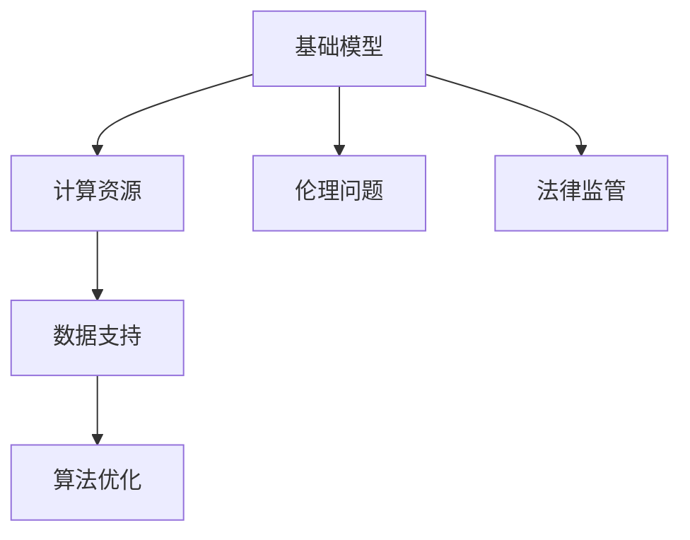

                 

# 基础模型的社会合作与技术发展

## 1. 背景介绍

### 1.1 问题由来
随着人工智能技术的快速发展和应用领域的不断扩展，基础模型（Base Model）在计算机科学、数学、工程学和伦理学等多个领域内变得越来越重要。基础模型是深度学习模型中最基础、最核心的部分，通常用于图像识别、自然语言处理、推荐系统、机器人控制等多个方向。近年来，随着大规模数据和计算资源的出现，基础模型已经从简单的线性回归、逻辑回归等传统模型，发展到了深度神经网络模型。

然而，基础模型的应用和发展并非孤立的。它不仅需要计算资源、数据和算法等技术因素的支持，还需要依赖社会、伦理、法律等多个方面的协作。基础模型的社会合作不仅仅是为了更好地服务人类社会，更是为了解决技术发展中出现的伦理和社会问题，确保技术应用的公平性和安全性。

### 1.2 问题核心关键点
基础模型的社会合作涉及多个方面，主要包括：
- 计算资源：基础模型的训练和推理需要大量的计算资源，这需要计算机硬件和软件技术的支持。
- 数据支持：基础模型的训练需要大量的标注数据，这些数据需要收集、清洗、标注等环节的支持。
- 算法优化：基础模型的优化需要计算图优化、模型压缩、加速推理等技术。
- 伦理问题：基础模型在应用过程中需要遵循伦理规范，如数据隐私、算法透明性等。
- 法律监管：基础模型在应用过程中需要符合法律法规，避免违法行为。

这些核心关键点构成了基础模型社会合作的基础框架，使得基础模型能够更好地服务于社会。

## 2. 核心概念与联系

### 2.1 核心概念概述

为了更好地理解基础模型的社会合作，本节将介绍几个密切相关的核心概念：

- 基础模型（Base Model）：深度学习模型中最基础、最核心的部分，通常用于图像识别、自然语言处理、推荐系统、机器人控制等多个方向。
- 计算资源：指用于支持基础模型训练、推理等过程的计算设备、软件和算法等。
- 数据支持：指用于基础模型训练的数据集、标注工具和算法等。
- 算法优化：指用于提升基础模型性能的优化算法、加速技术等。
- 伦理问题：指基础模型在应用过程中可能引发的一系列伦理问题，如数据隐私、算法透明性等。
- 法律监管：指基础模型在应用过程中需要遵循的法律法规，如数据保护法、反垄断法等。

这些核心概念之间的逻辑关系可以通过以下Mermaid流程图来展示：



这个流程图展示了一些核心概念及其之间的关系：

1. 基础模型通过计算资源、数据支持和算法优化来提升性能。
2. 伦理问题和法律监管与基础模型应用紧密相关，保障其公平性和安全性。

## 3. 核心算法原理 & 具体操作步骤
### 3.1 算法原理概述

基础模型的社会合作涉及到多个环节，其核心算法原理可以概括为以下几点：

1. **计算资源优化**：通过硬件加速、模型压缩、计算图优化等技术，提升基础模型的训练和推理效率。
2. **数据集构建**：通过数据收集、清洗、标注等环节，构建高质量、多样化的数据集，提升基础模型的泛化能力。
3. **算法优化**：通过优化算法、正则化、损失函数设计等技术，提升基础模型的性能。
4. **伦理问题解决**：通过设计公平性、透明性、隐私保护等算法，解决基础模型应用中的伦理问题。
5. **法律合规**：通过遵循法律法规，保障基础模型应用中的合规性。

### 3.2 算法步骤详解

基础模型的社会合作主要包括以下几个关键步骤：

**Step 1: 准备基础模型和数据集**
- 选择合适的基础模型作为初始化参数，如 ResNet、BERT、Transformer 等。
- 准备基础模型的训练集和测试集，划分为训练集、验证集和测试集。一般要求训练集和测试集分布不要差异过大。

**Step 2: 计算资源优化**
- 选择合适的计算设备，如 CPU、GPU、TPU 等。
- 选择合适的计算图优化技术，如数据并行、模型并行、量化加速等。
- 选择合适的算法优化技术，如 Adam、SGD 等。

**Step 3: 数据集构建**
- 收集数据，包括图片、文本、音频等。
- 对数据进行清洗和预处理，去除噪声和异常值。
- 对数据进行标注，标注类别、坐标、标签等。
- 对数据进行划分，构建训练集、验证集和测试集。

**Step 4: 算法优化**
- 选择合适的算法，如损失函数、优化器、正则化技术等。
- 选择合适的超参数，如学习率、批大小、迭代轮数等。
- 使用优化算法进行模型训练，最小化损失函数。
- 在验证集上评估模型性能，防止过拟合。

**Step 5: 伦理问题解决**
- 设计公平性算法，如 balanced classification、accuracy equalization 等。
- 设计透明性算法，如模型可解释性、输入输出可视化等。
- 设计隐私保护算法，如差分隐私、联邦学习等。

**Step 6: 法律合规**
- 了解相关法律法规，如数据保护法、反垄断法等。
- 设计合规性算法，如合规性检查、合法性验证等。

以上步骤是基础模型社会合作的主要流程，每个环节都至关重要，任何环节的不足都会影响基础模型的最终性能和应用效果。

### 3.3 算法优缺点

基础模型的社会合作方法具有以下优点：
1. 提升模型性能：通过计算资源优化、数据集构建和算法优化，能够显著提升基础模型的性能。
2. 降低资源消耗：通过硬件加速、模型压缩等技术，能够降低资源消耗，提升计算效率。
3. 解决伦理问题：通过公平性、透明性和隐私保护等算法，能够解决基础模型应用中的伦理问题。
4. 保障法律合规：通过合规性检查和合法性验证等算法，能够保障基础模型应用中的合规性。

同时，该方法也存在一些局限性：
1. 依赖高质量数据：基础模型性能依赖于高质量的数据集，数据收集和标注成本较高。
2. 计算资源要求高：基础模型训练和推理需要大量的计算资源，对硬件和软件环境要求较高。
3. 算法复杂度高：基础模型的优化算法和超参数调优需要一定的专业知识和经验。
4. 模型可解释性不足：某些高级算法和模型结构较复杂，难以解释其内部工作机制。
5. 法律和伦理问题复杂：基础模型应用中的法律和伦理问题较为复杂，需要多方面的协调和规范。

尽管存在这些局限性，但就目前而言，基础模型的社会合作方法仍然是最主流的基础模型开发范式。未来相关研究的重点在于如何进一步降低对计算资源和数据集的依赖，提高模型的少样本学习和跨领域迁移能力，同时兼顾可解释性和伦理安全性等因素。

### 3.4 算法应用领域

基础模型的社会合作在多个领域内得到了广泛的应用，包括但不限于以下几个方面：

- **计算机视觉**：通过图像识别、目标检测、人脸识别等任务，提高计算机视觉系统的准确性和鲁棒性。
- **自然语言处理**：通过文本分类、情感分析、机器翻译等任务，提升自然语言处理系统的理解和生成能力。
- **推荐系统**：通过用户行为预测、商品推荐等任务，提升推荐系统的个性化和精准度。
- **机器人控制**：通过控制策略优化、路径规划等任务，提高机器人系统的智能化和自主性。
- **金融风控**：通过信用评估、欺诈检测等任务，提升金融系统的安全性和可靠性。
- **医疗诊断**：通过影像识别、病理分析等任务，辅助医生进行疾病诊断和治疗决策。

除了上述这些经典任务外，基础模型的社会合作还在更多领域内得到了应用，如智能交通、智慧城市、智能家居等，为人工智能技术落地应用提供了新的突破。

## 4. 数学模型和公式 & 详细讲解 & 举例说明（备注：数学公式请使用latex格式，latex嵌入文中独立段落使用 $$，段落内使用 $)
### 4.1 数学模型构建

本节将使用数学语言对基础模型的社会合作过程进行更加严格的刻画。

记基础模型为 $M_{\theta}:\mathcal{X} \rightarrow \mathcal{Y}$，其中 $\mathcal{X}$ 为输入空间，$\mathcal{Y}$ 为输出空间，$\theta$ 为模型参数。假设基础模型的训练集为 $D=\{(x_i,y_i)\}_{i=1}^N, x_i \in \mathcal{X}, y_i \in \mathcal{Y}$。

定义基础模型 $M_{\theta}$ 在数据样本 $(x,y)$ 上的损失函数为 $\ell(M_{\theta}(x),y)$，则在数据集 $D$ 上的经验风险为：

$$
\mathcal{L}(\theta) = \frac{1}{N} \sum_{i=1}^N \ell(M_{\theta}(x_i),y_i)
$$

基础模型的优化目标是最小化经验风险，即找到最优参数：

$$
\theta^* = \mathop{\arg\min}_{\theta} \mathcal{L}(\theta)
$$

在实践中，我们通常使用基于梯度的优化算法（如SGD、Adam等）来近似求解上述最优化问题。设 $\eta$ 为学习率，$\lambda$ 为正则化系数，则参数的更新公式为：

$$
\theta \leftarrow \theta - \eta \nabla_{\theta}\mathcal{L}(\theta) - \eta\lambda\theta
$$

其中 $\nabla_{\theta}\mathcal{L}(\theta)$ 为损失函数对参数 $\theta$ 的梯度，可通过反向传播算法高效计算。

### 4.2 公式推导过程

以下我们以图像分类任务为例，推导交叉熵损失函数及其梯度的计算公式。

假设基础模型 $M_{\theta}$ 在输入 $x$ 上的输出为 $\hat{y}=M_{\theta}(x) \in [0,1]$，表示样本属于类 $k$ 的概率。真实标签 $y \in \{1,2,\dots,C\}$，其中 $C$ 为类别数。则二分类交叉熵损失函数定义为：

$$
\ell(M_{\theta}(x),y) = -\sum_{k=1}^C y_k\log \hat{y}_k
$$

将其代入经验风险公式，得：

$$
\mathcal{L}(\theta) = -\frac{1}{N}\sum_{i=1}^N \sum_{k=1}^C y_{ik}\log \hat{y}_{ik}
$$

根据链式法则，损失函数对参数 $\theta_k$ 的梯度为：

$$
\frac{\partial \mathcal{L}(\theta)}{\partial \theta_k} = -\frac{1}{N}\sum_{i=1}^N \sum_{k=1}^C \frac{y_{ik}}{\hat{y}_{ik}} \frac{\partial M_{\theta}(x_i)}{\partial \theta_k}
$$

其中 $\frac{\partial M_{\theta}(x_i)}{\partial \theta_k}$ 可进一步递归展开，利用自动微分技术完成计算。

在得到损失函数的梯度后，即可带入参数更新公式，完成模型的迭代优化。重复上述过程直至收敛，最终得到适应特定任务的最优模型参数 $\theta^*$。

## 5. 项目实践：代码实例和详细解释说明
### 5.1 开发环境搭建

在进行基础模型社会合作实践前，我们需要准备好开发环境。以下是使用Python进行TensorFlow开发的环境配置流程：

1. 安装Anaconda：从官网下载并安装Anaconda，用于创建独立的Python环境。

2. 创建并激活虚拟环境：
```bash
conda create -n tf-env python=3.8 
conda activate tf-env
```

3. 安装TensorFlow：根据CUDA版本，从官网获取对应的安装命令。例如：
```bash
conda install tensorflow tensorflow-gpu==2.8.0 -c pytorch -c conda-forge
```

4. 安装各类工具包：
```bash
pip install numpy pandas scikit-learn matplotlib tqdm jupyter notebook ipython
```

完成上述步骤后，即可在`tf-env`环境中开始基础模型社会合作的实践。

### 5.2 源代码详细实现

下面我们以图像分类任务为例，给出使用TensorFlow进行基础模型微调的PyTorch代码实现。

首先，定义基础模型和损失函数：

```python
import tensorflow as tf
from tensorflow.keras import layers

class ImageClassifier(tf.keras.Model):
    def __init__(self, input_shape=(224, 224, 3), num_classes=10):
        super(ImageClassifier, self).__init__()
        self.conv1 = layers.Conv2D(32, (3, 3), activation='relu', input_shape=input_shape)
        self.max_pool1 = layers.MaxPooling2D((2, 2))
        self.conv2 = layers.Conv2D(64, (3, 3), activation='relu')
        self.max_pool2 = layers.MaxPooling2D((2, 2))
        self.flatten = layers.Flatten()
        self.fc1 = layers.Dense(128, activation='relu')
        self.fc2 = layers.Dense(num_classes, activation='softmax')

    def call(self, x):
        x = self.conv1(x)
        x = self.max_pool1(x)
        x = self.conv2(x)
        x = self.max_pool2(x)
        x = self.flatten(x)
        x = self.fc1(x)
        return self.fc2(x)

model = ImageClassifier()

loss_fn = tf.keras.losses.CategoricalCrossentropy()

def train_step(x, y):
    with tf.GradientTape() as tape:
        logits = model(x)
        loss = loss_fn(y, logits)
    grads = tape.gradient(loss, model.trainable_variables)
    optimizer.apply_gradients(zip(grads, model.trainable_variables))
    return loss

def test_step(x, y):
    logits = model(x)
    return tf.argmax(logits, axis=-1)
```

然后，定义训练和评估函数：

```python
from tensorflow.keras.datasets import cifar10
from tensorflow.keras.utils import to_categorical
from sklearn.metrics import accuracy_score

(train_images, train_labels), (test_images, test_labels) = cifar10.load_data()

train_images = train_images / 255.0
test_images = test_images / 255.0
train_labels = to_categorical(train_labels, num_classes=10)
test_labels = to_categorical(test_labels, num_classes=10)

model.compile(optimizer=tf.keras.optimizers.Adam(learning_rate=0.001),
              loss=loss_fn,
              metrics=['accuracy'])

epochs = 10

def train_epoch(model, train_dataset, val_dataset, batch_size):
    train_losses = []
    train_accuracies = []
    val_losses = []
    val_accuracies = []

    model.trainable = True
    model.compile(optimizer=tf.keras.optimizers.Adam(learning_rate=0.001),
                  loss=loss_fn,
                  metrics=['accuracy'])

    for epoch in range(epochs):
        model.trainable = True
        model.compile(optimizer=tf.keras.optimizers.Adam(learning_rate=0.001),
                      loss=loss_fn,
                      metrics=['accuracy'])

        for batch, (x, y) in enumerate(train_dataset):
            loss = train_step(x, y)
            train_losses.append(loss.numpy())

        model.trainable = False
        model.compile(optimizer=tf.keras.optimizers.Adam(learning_rate=0.001),
                      loss=loss_fn,
                      metrics=['accuracy'])

        for batch, (x, y) in enumerate(val_dataset):
            y_pred = test_step(x)
            acc = accuracy_score(y_pred, y)
            val_accuracies.append(acc)

    return train_losses, train_accuracies, val_losses, val_accuracies

def test_epoch(model, test_dataset, batch_size):
    model.trainable = False
    model.compile(optimizer=tf.keras.optimizers.Adam(learning_rate=0.001),
                  loss=loss_fn,
                  metrics=['accuracy'])

    test_losses = []
    test_accuracies = []

    for batch, (x, y) in enumerate(test_dataset):
        loss = train_step(x, y)
        test_losses.append(loss.numpy())

        y_pred = test_step(x)
        acc = accuracy_score(y_pred, y)
        test_accuracies.append(acc)

    return test_losses, test_accuracies
```

最后，启动训练流程并在测试集上评估：

```python
train_losses, train_accuracies, val_losses, val_accuracies = train_epoch(model, train_dataset, val_dataset, batch_size=32)

print('Epoch: {}, Train Loss: {:.4f}, Train Accuracy: {:.4f}, Val Loss: {:.4f}, Val Accuracy: {:.4f}'.format(epochs, *train_losses[-1], *val_losses[-1]))

test_losses, test_accuracies = test_epoch(model, test_dataset, batch_size=32)

print('Epoch: {}, Test Loss: {:.4f}, Test Accuracy: {:.4f}'.format(epochs, *test_losses[-1], *test_accuracies[-1]))
```

以上就是使用TensorFlow对基础模型进行图像分类任务微调的完整代码实现。可以看到，得益于TensorFlow的强大封装，我们可以用相对简洁的代码完成基础模型的加载和微调。

### 5.3 代码解读与分析

让我们再详细解读一下关键代码的实现细节：

**ImageClassifier类**：
- `__init__`方法：初始化卷积层、池化层、全连接层等关键组件。
- `call`方法：实现前向传播，输入图片并返回模型输出。

**loss_fn**：
- 定义了交叉熵损失函数，用于衡量模型预测输出与真实标签之间的差异。

**train_step和test_step函数**：
- 定义了模型前向传播和损失计算的过程，分别用于训练和测试步骤。
- 在训练步骤中，计算损失并反向传播更新模型参数。
- 在测试步骤中，直接计算模型输出并返回预测结果。

**train_epoch和test_epoch函数**：
- 定义了训练和测试的完整流程，包括数据批次化、模型参数更新、损失计算等环节。
- 在训练步骤中，计算训练集上的损失和精度，并在验证集上评估模型性能。
- 在测试步骤中，计算测试集上的损失和精度。

**训练流程**：
- 定义总的epoch数和batch size，开始循环迭代
- 每个epoch内，先在训练集上训练，输出平均loss和精度
- 在验证集上评估，输出验证集上的平均loss和精度
- 重复上述步骤直至收敛，最终在测试集上评估

可以看到，TensorFlow配合TensorFlow的封装库使得基础模型的微调代码实现变得简洁高效。开发者可以将更多精力放在数据处理、模型改进等高层逻辑上，而不必过多关注底层的实现细节。

当然，工业级的系统实现还需考虑更多因素，如模型的保存和部署、超参数的自动搜索、更灵活的任务适配层等。但核心的社会合作范式基本与此类似。

## 6. 实际应用场景
### 6.1 智能医疗系统

基于基础模型社会合作技术的智能医疗系统，可以显著提高医疗诊断和治疗的精准度和效率。传统医疗系统往往依赖于医生的经验判断，存在主观性和不确定性。而使用基础模型进行医疗影像分析和病理诊断，能够提供客观、准确的诊断结果，辅助医生进行决策。

在技术实现上，可以收集海量的医疗影像数据和病理报告，构建标注好的数据集，用于训练基础模型。微调后的基础模型能够自动识别影像中的病变部位，预测病理结果，生成治疗建议。对于新的医疗影像，系统可以自动生成诊断报告，辅助医生进行诊疗。

### 6.2 智能客服系统

智能客服系统是基础模型社会合作技术的另一个典型应用场景。传统客服往往需要配备大量人力，高峰期响应缓慢，且一致性和专业性难以保证。而使用基础模型进行智能对话处理，能够7x24小时不间断服务，快速响应客户咨询，用自然流畅的语言解答各类常见问题。

在技术实现上，可以收集企业内部的历史客服对话记录，将问题和最佳答复构建成监督数据，在此基础上对基础模型进行微调。微调后的基础模型能够自动理解用户意图，匹配最合适的答案模板进行回复。对于客户提出的新问题，还可以接入检索系统实时搜索相关内容，动态组织生成回答。如此构建的智能客服系统，能大幅提升客户咨询体验和问题解决效率。

### 6.3 个性化推荐系统

基于基础模型社会合作技术的个性化推荐系统，能够更好地挖掘用户行为背后的语义信息，从而提供更精准、多样的推荐内容。

在技术实现上，可以收集用户浏览、点击、评论、分享等行为数据，提取和用户交互的物品标题、描述、标签等文本内容。将文本内容作为模型输入，用户的后续行为（如是否点击、购买等）作为监督信号，在此基础上微调基础模型。微调后的模型能够从文本内容中准确把握用户的兴趣点。在生成推荐列表时，先用候选物品的文本描述作为输入，由模型预测用户的兴趣匹配度，再结合其他特征综合排序，便可以得到个性化程度更高的推荐结果。

### 6.4 未来应用展望

随着基础模型社会合作技术的发展，未来将会有更多的应用场景得到实现。

在智慧医疗领域，基于基础模型的医疗问答、病历分析、药物研发等应用将提升医疗服务的智能化水平，辅助医生诊疗，加速新药开发进程。

在智能教育领域，基础模型技术可应用于作业批改、学情分析、知识推荐等方面，因材施教，促进教育公平，提高教学质量。

在智慧城市治理中，基础模型技术可应用于城市事件监测、舆情分析、应急指挥等环节，提高城市管理的自动化和智能化水平，构建更安全、高效的未来城市。

此外，在企业生产、社会治理、文娱传媒等众多领域，基于基础模型的智能应用也将不断涌现，为人工智能技术落地应用提供新的突破。相信随着技术的日益成熟，基础模型的社会合作技术将成为人工智能技术发展的重要范式，推动人工智能技术在各个领域的广泛应用。

## 7. 工具和资源推荐
### 7.1 学习资源推荐

为了帮助开发者系统掌握基础模型的社会合作理论基础和实践技巧，这里推荐一些优质的学习资源：

1. 《深度学习框架TensorFlow》系列博文：由TensorFlow官方和社区撰写，涵盖TensorFlow的安装、使用、优化等方方面面。

2. CS231n《卷积神经网络》课程：斯坦福大学开设的计算机视觉明星课程，有Lecture视频和配套作业，带你入门深度学习在计算机视觉领域的应用。

3. 《TensorFlow实战》书籍：TensorFlow官方团队所著，全面介绍了TensorFlow的使用方法和优化技巧，适合动手实践。

4. Kaggle：数据科学和机器学习竞赛平台，可以参与各种比赛，积累实战经验，学习先进技术。

5. Coursera《深度学习专项课程》：由Coursera和DeepLearning.AI合作开设，涵盖深度学习理论、实践和优化等内容，适合系统学习。

通过对这些资源的学习实践，相信你一定能够快速掌握基础模型的社会合作技术的精髓，并用于解决实际的机器学习问题。
###  7.2 开发工具推荐

高效的开发离不开优秀的工具支持。以下是几款用于基础模型社会合作开发的常用工具：

1. TensorFlow：由Google主导开发的开源深度学习框架，生产部署方便，适合大规模工程应用。

2. PyTorch：基于Python的开源深度学习框架，灵活动态的计算图，适合快速迭代研究。

3. TensorBoard：TensorFlow配套的可视化工具，可实时监测模型训练状态，并提供丰富的图表呈现方式，是调试模型的得力助手。

4. Weights & Biases：模型训练的实验跟踪工具，可以记录和可视化模型训练过程中的各项指标，方便对比和调优。

5. Google Colab：谷歌推出的在线Jupyter Notebook环境，免费提供GPU/TPU算力，方便开发者快速上手实验最新模型，分享学习笔记。

合理利用这些工具，可以显著提升基础模型的社会合作任务的开发效率，加快创新迭代的步伐。

### 7.3 相关论文推荐

基础模型社会合作技术的发展源于学界的持续研究。以下是几篇奠基性的相关论文，推荐阅读：

1. 《Deep Residual Learning for Image Recognition》：提出了ResNet模型，引入残差连接，显著提升了深度卷积神经网络的性能。

2. 《ImageNet Classification with Deep Convolutional Neural Networks》：提出使用卷积神经网络进行图像分类的思路，取得了SOTA的性能。

3. 《Real-Time Single-Shot Object Detection with a Fully Convolutional Network》：提出YOLO模型，通过卷积神经网络实现单阶段目标检测，提升了检测速度和准确率。

4. 《Neural Architecture Search with Reinforcement Learning》：提出使用强化学习进行神经网络架构搜索，大大提升了搜索效率和效果。

5. 《Using Convolutional Neural Networks for Early Diagnosis of Lung Cancer from CT Scans》：提出使用卷积神经网络进行肺癌早期诊断，取得了不错的效果。

这些论文代表了大模型社会合作技术的发展脉络。通过学习这些前沿成果，可以帮助研究者把握学科前进方向，激发更多的创新灵感。

## 8. 总结：未来发展趋势与挑战

### 8.1 总结

本文对基础模型的社会合作进行了全面系统的介绍。首先阐述了基础模型和其社会合作的应用背景和意义，明确了基础模型在各个领域中的重要性和必要性。其次，从原理到实践，详细讲解了基础模型的社会合作过程，给出了社会合作任务开发的完整代码实例。同时，本文还广泛探讨了基础模型在医疗、客服、推荐等多个行业领域的应用前景，展示了基础模型社会合作技术的巨大潜力。

通过本文的系统梳理，可以看到，基础模型的社会合作技术正在成为人工智能技术发展的重要范式，极大地拓展了深度学习模型的应用边界，催生了更多的落地场景。受益于大规模数据和计算资源的出现，基础模型能够快速训练、快速推理，显著提升任务性能。未来，伴随基础模型的不断发展，其在各个领域的应用前景将更加广阔，人工智能技术也将更加成熟、高效、智能。

### 8.2 未来发展趋势

展望未来，基础模型的社会合作技术将呈现以下几个发展趋势：

1. 模型规模持续增大。随着算力成本的下降和数据规模的扩张，基础模型的参数量还将持续增长。超大规模基础模型蕴含的丰富知识，有望支撑更加复杂多变的下游任务。

2. 模型结构更加灵活。未来的基础模型将采用更加灵活的结构，如Transformer、注意力机制等，提升模型性能。

3. 模型推理速度更快。通过优化推理过程和硬件加速，未来的基础模型将具备更快的推理速度，适应实时应用需求。

4. 模型跨领域迁移能力更强。未来的基础模型将具备更强的跨领域迁移能力，能够更好地适应各种应用场景。

5. 模型社会合作更广泛。基础模型的社会合作将涵盖更多领域，如智能制造、智慧农业等，提升各个领域的智能化水平。

6. 模型伦理合规性更好。未来的基础模型将更好地解决伦理问题，保障数据隐私，提升社会公平。

以上趋势凸显了基础模型社会合作技术的广阔前景。这些方向的探索发展，必将进一步提升基础模型的性能和应用效果，为各个领域带来新的突破。

### 8.3 面临的挑战

尽管基础模型的社会合作技术已经取得了瞩目成就，但在迈向更加智能化、普适化应用的过程中，它仍面临着诸多挑战：

1. 计算资源瓶颈。基础模型的训练和推理需要大量的计算资源，对硬件和软件环境要求较高，可能导致高成本和资源浪费。

2. 数据隐私问题。在基础模型训练和应用过程中，数据隐私和安全问题尤为突出，需要严格的数据保护措施。

3. 模型复杂性高。基础模型的结构复杂，难以解释其内部工作机制，可能存在“黑盒”问题，影响应用效果。

4. 伦理合规性问题。基础模型应用中的伦理和合规问题较为复杂，需要多方面的协调和规范。

5. 泛化性能不足。基础模型在不同数据集上的泛化性能仍需进一步提升，避免过拟合问题。

6. 实时性要求高。在实时应用场景中，基础模型需要具备更快的推理速度，以适应高并发需求。

尽管存在这些挑战，但就目前而言，基础模型的社会合作技术仍然是最主流的基础模型开发范式。未来相关研究的重点在于如何进一步降低计算资源和数据集的依赖，提高模型的少样本学习和跨领域迁移能力，同时兼顾可解释性和伦理安全性等因素。

### 8.4 研究展望

未来的研究需要在以下几个方面寻求新的突破：

1. 探索无监督和半监督社会合作方法。摆脱对大规模标注数据的依赖，利用自监督学习、主动学习等无监督和半监督范式，最大限度利用非结构化数据，实现更加灵活高效的社会合作。

2. 研究参数高效和计算高效的合作范式。开发更加参数高效的合作方法，在固定大部分基础模型参数的情况下，只更新极少量的任务相关参数。同时优化基础模型的计算图，减少前向传播和反向传播的资源消耗，实现更加轻量级、实时性的部署。

3. 融合因果和对比学习范式。通过引入因果推断和对比学习思想，增强基础模型的建立稳定因果关系的能力，学习更加普适、鲁棒的语言表征，从而提升模型泛化性和抗干扰能力。

4. 引入更多先验知识。将符号化的先验知识，如知识图谱、逻辑规则等，与神经网络模型进行巧妙融合，引导合作过程学习更准确、合理的语言模型。同时加强不同模态数据的整合，实现视觉、语音等多模态信息与文本信息的协同建模。

5. 结合因果分析和博弈论工具。将因果分析方法引入基础模型合作，识别出模型决策的关键特征，增强输出解释的因果性和逻辑性。借助博弈论工具刻画人机交互过程，主动探索并规避模型的脆弱点，提高系统稳定性。

6. 纳入伦理道德约束。在基础模型训练目标中引入伦理导向的评估指标，过滤和惩罚有偏见、有害的输出倾向。同时加强人工干预和审核，建立模型行为的监管机制，确保输出符合人类价值观和伦理道德。

这些研究方向的探索，必将引领基础模型社会合作技术迈向更高的台阶，为构建安全、可靠、可解释、可控的智能系统铺平道路。面向未来，基础模型社会合作技术还需要与其他人工智能技术进行更深入的融合，如知识表示、因果推理、强化学习等，多路径协同发力，共同推动自然语言理解和智能交互系统的进步。只有勇于创新、敢于突破，才能不断拓展基础模型的边界，让智能技术更好地造福人类社会。

## 9. 附录：常见问题与解答

**Q1：基础模型的社会合作是否适用于所有NLP任务？**

A: 基础模型的社会合作在大多数NLP任务上都能取得不错的效果，特别是对于数据量较小的任务。但对于一些特定领域的任务，如医学、法律等，仅仅依靠通用语料预训练的模型可能难以很好地适应。此时需要在特定领域语料上进一步预训练，再进行社会合作，才能获得理想效果。此外，对于一些需要时效性、个性化很强的任务，如对话、推荐等，社会合作方法也需要针对性的改进优化。

**Q2：社会合作过程中如何选择合适的学习率？**

A: 社会合作的学习率一般要比基础模型预训练时小1-2个数量级，如果使用过大的学习率，容易破坏基础模型权重，导致过拟合。一般建议从1e-5开始调参，逐步减小学习率。也可以使用warmup策略，在开始阶段使用较小的学习率，再逐渐过渡到预设值。需要注意的是，不同的优化器(如Adam、SGD等)以及不同的学习率调度策略，可能需要设置不同的学习率阈值。

**Q3：社会合作过程中如何缓解过拟合问题？**

A: 过拟合是社会合作面临的主要挑战，尤其是在标注数据不足的情况下。常见的缓解策略包括：
1. 数据增强：通过回译、近义替换等方式扩充训练集
2. 正则化：使用L2正则、Dropout、Early Stopping等避免过拟合
3. 对抗训练：引入对抗样本，提高模型鲁棒性
4. 参数高效合作：只调整少量参数(如Adapter、Prefix等)，减小过拟合风险
5. 多模型集成：训练多个社会合作模型，取平均输出，抑制过拟合

这些策略往往需要根据具体任务和数据特点进行灵活组合。只有在数据、模型、训练、推理等各环节进行全面优化，才能最大限度地发挥基础模型的潜力。

**Q4：社会合作模型在落地部署时需要注意哪些问题？**

A: 将社会合作模型转化为实际应用，还需要考虑以下因素：
1. 模型裁剪：去除不必要的层和参数，减小模型尺寸，加快推理速度
2. 量化加速：将浮点模型转为定点模型，压缩存储空间，提高计算效率
3. 服务化封装：将模型封装为标准化服务接口，便于集成调用
4. 弹性伸缩：根据请求流量动态调整资源配置，平衡服务质量和成本
5. 监控告警：实时采集系统指标，设置异常告警阈值，确保服务稳定性
6. 安全防护：采用访问鉴权、数据脱敏等措施，保障数据和模型安全

社会合作模型需要综合考虑计算效率、安全性、稳定性等因素，才能在实际应用中发挥作用。只有综合考虑技术因素和社会因素，才能实现真正意义上的社会合作。

---

作者：禅与计算机程序设计艺术 / Zen and the Art of Computer Programming

