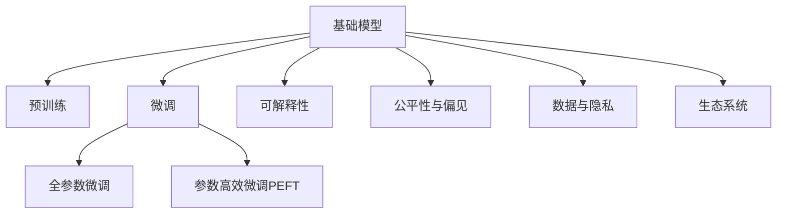

                 

# 基础模型的社会影响与生态系统

## 1. 背景介绍

### 1.1 问题由来

随着人工智能（AI）技术的发展，基础模型的社会影响和生态系统构建成为学术界和工业界关注的焦点。基础模型，如预训练语言模型（BERT, GPT等）和计算机视觉模型（ResNet, YOLO等），以其出色的泛化能力和广泛的应用场景，成为了AI研究的重要基石。然而，基础模型不仅在技术上有着深远影响，更在社会经济、伦理道德、就业结构等多个方面引起了广泛讨论。

### 1.2 问题核心关键点

基础模型对社会的影响及其生态系统的构建，主要体现在以下几个关键点上：

1. **数据依赖**：基础模型依赖大规模无标签数据进行预训练，数据获取、标注和存储成为模型研发的核心。
2. **算法透明度**：由于模型复杂度提高，理解模型的内在机制变得越来越困难，模型的“黑盒”特性引发了可解释性问题。
3. **伦理与偏见**：模型训练过程中可能引入或放大数据中的偏见，影响模型输出决策的公平性。
4. **技术壁垒**：基础模型研发需要庞大的资金和人力投入，形成了较高的技术壁垒。
5. **行业竞争**：基础模型技术推动了AI技术的普及，导致行业竞争加剧，商业应用场景不断扩展。
6. **社会影响**：基础模型对就业结构、教育体系、政策制定等多个社会层面产生了深远影响。

通过深入研究这些关键点，可以更好地理解基础模型对社会的全面影响，从而制定相应的政策和措施，推动AI技术健康发展。

## 2. 核心概念与联系

### 2.1 核心概念概述

为了深入探讨基础模型的社会影响与生态系统，本节将介绍几个密切相关的核心概念：

- **基础模型**：指在特定领域内广泛应用、具有较好泛化能力的模型，如BERT、GPT等预训练语言模型。
- **预训练与微调**：预训练模型通过在大规模无标签数据上进行训练，获得通用的特征表示；微调则在此基础上，通过有标签数据进一步优化模型性能，适用于特定任务。
- **可解释性**：模型的决策过程应具有一定的透明度，使得用户能够理解模型的推理逻辑。
- **公平性与偏见**：模型应尽量避免引入或放大数据中的偏见，确保输出决策的公平性。
- **数据与隐私**：模型的训练和应用依赖大量数据，如何合理获取和使用数据，保障数据隐私，是模型应用的重要问题。
- **生态系统**：基础模型及其相关技术、工具、应用场景构成的生态系统，涉及学术研究、产业应用、政策法规等多个方面。

这些概念之间的逻辑关系可以通过以下Mermaid流程图来展示：



这个流程图展示了基础模型的核心概念及其之间的关系：

1. 基础模型通过预训练获得基础能力。
2. 微调是对预训练模型进行任务特定的优化，可以分为全参数微调和参数高效微调（PEFT）。
3. 可解释性使得用户能够理解模型的决策过程。
4. 公平性与偏见反映了模型决策的公正性。
5. 数据与隐私关系到模型训练和应用的数据合规性。
6. 生态系统构建了基础模型的应用场景和政策环境。

这些概念共同构成了基础模型的社会影响与生态系统的框架，为我们深入分析基础模型的广泛应用和深远影响提供了重要视角。

## 3. 核心算法原理 & 具体操作步骤
### 3.1 算法原理概述

基础模型通过在大规模无标签数据上进行预训练，学习通用的语言或视觉特征表示。预训练过程中，模型通常采用自监督学习任务，如掩码语言模型、对比学习等，以提高泛化能力。预训练完成后，基础模型通过微调适配特定任务，获得针对该任务优化的模型。

微调过程一般包括以下几个步骤：

1. 选择适合任务的基础模型，将其作为初始化参数。
2. 准备下游任务的标注数据集，将模型作为初始化参数，通过有监督地训练来优化模型性能。
3. 设计合适的损失函数，用于衡量模型预测输出与真实标签之间的差异。
4. 选择合适的优化算法及其参数，如AdamW、SGD等，设置学习率、批大小、迭代轮数等。
5. 应用正则化技术，如L2正则、Dropout、Early Stopping等，防止模型过度适应小规模训练集。
6. 在训练集上执行梯度训练，反向传播计算参数梯度，根据优化算法更新模型参数。
7. 在验证集上评估模型性能，根据性能指标决定是否停止训练。
8. 在测试集上评估微调后模型的性能。

### 3.2 算法步骤详解

#### 3.2.1 预训练阶段

预训练阶段是基础模型构建的核心。预训练模型通过在大规模无标签数据上进行训练，学习通用的语言或视觉特征表示。以BERT模型为例，其预训练过程包括以下几个关键步骤：

1. 数据准备：收集大规模无标签文本数据，通常采用维基百科、新闻、社交媒体等。
2. 模型定义：定义BERT模型的结构，包括Transformer的Transformer层、多头注意力机制等。
3. 训练：在大规模数据上训练模型，通常使用自监督学习任务，如掩码语言模型（Masked Language Modeling, MLM）。
   - MLM任务：随机掩码输入序列中的一部分词，训练模型预测被掩码词的正确词。
4. 验证：在验证集上评估模型性能，调整训练参数。
5. 保存模型：保存训练好的模型，以便后续微调使用。

#### 3.2.2 微调阶段

微调阶段是在预训练模型的基础上，通过有标签数据进一步优化模型性能。以微调BERT模型进行情感分类为例，其步骤如下：

1. 数据准备：收集情感分类任务的标注数据集，通常包含电影评论、产品评价等。
2. 模型初始化：将预训练的BERT模型作为初始化参数，去掉顶层的全连接层。
3. 任务适配层：在模型顶层添加适合任务的输出层和损失函数。
   - 输出层：使用线性分类器输出情感分类的概率分布。
   - 损失函数：使用交叉熵损失函数。
4. 训练：在标注数据集上执行梯度训练，优化模型参数。
5. 验证和测试：在验证集和测试集上评估模型性能，调整模型参数和训练参数。
6. 保存模型：保存微调后的模型，以便后续使用。

### 3.3 算法优缺点

基础模型及其微调方法具有以下优点：

1. **泛化能力强**：预训练模型能够学习到通用的语言或视觉特征表示，具有较强的泛化能力，能够在多种任务上表现优异。
2. **高效适配**：微调过程简单高效，只需少量标注数据即可在特定任务上取得优异性能。
3. **参数高效**：通过参数高效微调（PEFT）方法，可以在固定大部分预训练参数的情况下，仅微调顶层或部分参数，减少计算资源消耗。
4. **可扩展性强**：基础模型和微调方法适用于多种NLP和CV任务，能够快速适应新任务。

同时，基础模型及其微调方法也存在一些局限性：

1. **依赖大规模数据**：预训练和微调过程需要大量数据支持，数据获取和标注成本较高。
2. **算法复杂**：基础模型和微调算法相对复杂，难以理解和解释。
3. **偏见与公平性问题**：预训练和微调过程可能引入或放大数据中的偏见，影响模型决策的公平性。
4. **技术壁垒高**：研发和部署基础模型需要高昂的技术和资金投入，形成了较高的技术壁垒。
5. **社会影响复杂**：基础模型在应用过程中可能对就业结构、伦理道德等方面产生复杂影响。

尽管存在这些局限性，基础模型及其微调方法在NLP和CV领域的应用已取得了显著进展，成为推动AI技术发展的重要力量。

### 3.4 算法应用领域

基础模型及其微调方法在多个领域得到了广泛应用，例如：

- **自然语言处理**：情感分析、机器翻译、文本摘要、问答系统等。
- **计算机视觉**：物体检测、图像分类、场景理解、图像生成等。
- **智能医疗**：疾病诊断、医学影像分析、医疗知识图谱构建等。
- **金融分析**：风险评估、市场预测、欺诈检测等。
- **智能制造**：产品缺陷检测、生产过程优化、智能维护等。
- **智能交通**：自动驾驶、交通流量分析、智能停车等。

此外，基础模型和微调方法还在智慧城市、智能家居、教育、娱乐等多个领域得到了创新应用，推动了各行各业的技术进步和产业升级。

## 4. 数学模型和公式 & 详细讲解  
### 4.1 数学模型构建

基础模型及其微调过程可以通过数学模型进行严谨描述。以下以BERT模型为例，介绍其数学模型构建和微调过程。

### 4.2 公式推导过程

#### 4.2.1 预训练模型

BERT模型的预训练过程可以描述为：

1. 定义预训练任务：掩码语言模型（MLM）。
2. 输入序列：$X=[x_1,...,x_N]$，其中$x_i$表示输入序列中的第$i$个词。
3. 输出序列：$Y=[y_1,...,y_N]$，其中$y_i$表示输入序列中第$i$个词的正确掩码词。
4. 损失函数：交叉熵损失函数$L=\sum_{i=1}^{N} \mathcal{L}(x_i, y_i)$。
5. 模型参数：预训练模型参数$\theta$。

预训练过程的优化目标是最小化损失函数，即：

$$
\min_{\theta} L = \sum_{i=1}^{N} \mathcal{L}(x_i, y_i)
$$

其中，$\mathcal{L}(x_i, y_i)$为交叉熵损失函数：

$$
\mathcal{L}(x_i, y_i) = -\sum_{j=1}^{K} y_{ij}\log p(x_i|y_j)
$$

其中，$p(x_i|y_j)$表示模型对输入序列中第$i$个词的预测概率，$y_{ij}$表示第$i$个词的正确掩码词。

#### 4.2.2 微调模型

微调模型通常是在预训练模型的基础上，通过下游任务的标注数据集进一步优化模型性能。以微调BERT模型进行情感分类为例，其数学模型构建如下：

1. 定义微调任务：情感分类。
2. 输入序列：$X=[x_1,...,x_N]$，其中$x_i$表示输入序列中的第$i$个词。
3. 输出序列：$Y=[y_1,...,y_N]$，其中$y_i$表示输入序列中第$i$个词的情感类别。
4. 损失函数：交叉熵损失函数$L=\sum_{i=1}^{N} \mathcal{L}(x_i, y_i)$。
5. 模型参数：微调后的模型参数$\theta'$。

微调过程的优化目标是最小化损失函数，即：

$$
\min_{\theta'} L = \sum_{i=1}^{N} \mathcal{L}(x_i, y_i)
$$

其中，$\mathcal{L}(x_i, y_i)$为交叉熵损失函数：

$$
\mathcal{L}(x_i, y_i) = -y_i \log p(x_i|y_i) - (1-y_i) \log (1-p(x_i|y_i))
$$

其中，$p(x_i|y_i)$表示模型对输入序列中第$i$个词的情感分类预测概率。

### 4.3 案例分析与讲解

以微调BERT模型进行情感分类为例，我们具体分析其数学模型和训练过程。

假设数据集$D=\{(x_i, y_i)\}_{i=1}^N$，其中$x_i$表示输入序列，$y_i$表示情感类别。假设模型$M_{\theta'}$为微调后的BERT模型，其参数$\theta'$为微调后的模型参数。则微调过程的优化目标是最小化损失函数：

$$
L = \sum_{i=1}^{N} \mathcal{L}(x_i, y_i)
$$

其中，$\mathcal{L}(x_i, y_i)$为交叉熵损失函数：

$$
\mathcal{L}(x_i, y_i) = -y_i \log p(x_i|y_i) - (1-y_i) \log (1-p(x_i|y_i))
$$

在训练过程中，使用反向传播算法计算损失函数对模型参数$\theta'$的梯度，并根据梯度更新模型参数。训练过程中，还需要注意以下问题：

1. 学习率：通常使用AdamW优化算法，设置较小的学习率，避免破坏预训练权重。
2. 正则化：使用L2正则、Dropout、Early Stopping等方法，防止模型过拟合。
3. 数据增强：通过对训练样本进行回译、近义替换等方式，增强数据多样性。
4. 对抗训练：引入对抗样本，提高模型鲁棒性。
5. 提示学习：通过精心设计输入文本的格式，引导模型按期望方式输出，减少微调参数。

## 5. 项目实践：代码实例和详细解释说明
### 5.1 开发环境搭建

在进行基础模型微调实践前，我们需要准备好开发环境。以下是使用Python进行PyTorch开发的环境配置流程：

1. 安装Anaconda：从官网下载并安装Anaconda，用于创建独立的Python环境。

2. 创建并激活虚拟环境：
```bash
conda create -n pytorch-env python=3.8 
conda activate pytorch-env
```

3. 安装PyTorch：根据CUDA版本，从官网获取对应的安装命令。例如：
```bash
conda install pytorch torchvision torchaudio cudatoolkit=11.1 -c pytorch -c conda-forge
```

4. 安装Transformers库：
```bash
pip install transformers
```

5. 安装各类工具包：
```bash
pip install numpy pandas scikit-learn matplotlib tqdm jupyter notebook ipython
```

完成上述步骤后，即可在`pytorch-env`环境中开始微调实践。

### 5.2 源代码详细实现

下面我们以微调BERT模型进行情感分类任务为例，给出使用Transformers库的PyTorch代码实现。

首先，定义情感分类任务的数据处理函数：

```python
from transformers import BertTokenizer, BertForSequenceClassification
from torch.utils.data import Dataset
import torch

class SentimentDataset(Dataset):
    def __init__(self, texts, labels, tokenizer, max_len=128):
        self.texts = texts
        self.labels = labels
        self.tokenizer = tokenizer
        self.max_len = max_len
        
    def __len__(self):
        return len(self.texts)
    
    def __getitem__(self, item):
        text = self.texts[item]
        label = self.labels[item]
        
        encoding = self.tokenizer(text, return_tensors='pt', max_length=self.max_len, padding='max_length', truncation=True)
        input_ids = encoding['input_ids'][0]
        attention_mask = encoding['attention_mask'][0]
        
        # 将标签转化为one-hot编码
        encoded_labels = [1 if l == 'positive' else 0 for l in labels] 
        encoded_labels.extend([0] * (self.max_len - len(encoded_labels)))
        labels = torch.tensor(encoded_labels, dtype=torch.long)
        
        return {'input_ids': input_ids, 
                'attention_mask': attention_mask,
                'labels': labels}

# 数据处理
tokenizer = BertTokenizer.from_pretrained('bert-base-cased')

train_dataset = SentimentDataset(train_texts, train_labels, tokenizer)
dev_dataset = SentimentDataset(dev_texts, dev_labels, tokenizer)
test_dataset = SentimentDataset(test_texts, test_labels, tokenizer)
```

然后，定义模型和优化器：

```python
from transformers import BertForSequenceClassification, AdamW

model = BertForSequenceClassification.from_pretrained('bert-base-cased', num_labels=2)

optimizer = AdamW(model.parameters(), lr=2e-5)
```

接着，定义训练和评估函数：

```python
from torch.utils.data import DataLoader
from tqdm import tqdm
from sklearn.metrics import accuracy_score

device = torch.device('cuda') if torch.cuda.is_available() else torch.device('cpu')
model.to(device)

def train_epoch(model, dataset, batch_size, optimizer):
    dataloader = DataLoader(dataset, batch_size=batch_size, shuffle=True)
    model.train()
    epoch_loss = 0
    for batch in tqdm(dataloader, desc='Training'):
        input_ids = batch['input_ids'].to(device)
        attention_mask = batch['attention_mask'].to(device)
        labels = batch['labels'].to(device)
        model.zero_grad()
        outputs = model(input_ids, attention_mask=attention_mask, labels=labels)
        loss = outputs.loss
        epoch_loss += loss.item()
        loss.backward()
        optimizer.step()
    return epoch_loss / len(dataloader)

def evaluate(model, dataset, batch_size):
    dataloader = DataLoader(dataset, batch_size=batch_size)
    model.eval()
    preds, labels = [], []
    with torch.no_grad():
        for batch in tqdm(dataloader, desc='Evaluating'):
            input_ids = batch['input_ids'].to(device)
            attention_mask = batch['attention_mask'].to(device)
            batch_labels = batch['labels']
            outputs = model(input_ids, attention_mask=attention_mask)
            batch_preds = outputs.logits.argmax(dim=2).to('cpu').tolist()
            batch_labels = batch_labels.to('cpu').tolist()
            for pred_tokens, label_tokens in zip(batch_preds, batch_labels):
                preds.append(pred_tokens[:len(label_tokens)])
                labels.append(label_tokens)
                
    return accuracy_score(labels, preds)
```

最后，启动训练流程并在测试集上评估：

```python
epochs = 5
batch_size = 16

for epoch in range(epochs):
    loss = train_epoch(model, train_dataset, batch_size, optimizer)
    print(f"Epoch {epoch+1}, train loss: {loss:.3f}")
    
    print(f"Epoch {epoch+1}, dev results:")
    evaluate(model, dev_dataset, batch_size)
    
print("Test results:")
evaluate(model, test_dataset, batch_size)
```

以上就是使用PyTorch对BERT进行情感分类任务微调的完整代码实现。可以看到，得益于Transformers库的强大封装，我们可以用相对简洁的代码完成BERT模型的加载和微调。

### 5.3 代码解读与分析

让我们再详细解读一下关键代码的实现细节：

**SentimentDataset类**：
- `__init__`方法：初始化文本、标签、分词器等关键组件。
- `__len__`方法：返回数据集的样本数量。
- `__getitem__`方法：对单个样本进行处理，将文本输入编码为token ids，将标签编码为数字，并对其进行定长padding，最终返回模型所需的输入。

**训练和评估函数**：
- 使用PyTorch的DataLoader对数据集进行批次化加载，供模型训练和推理使用。
- 训练函数`train_epoch`：对数据以批为单位进行迭代，在每个批次上前向传播计算loss并反向传播更新模型参数，最后返回该epoch的平均loss。
- 评估函数`evaluate`：与训练类似，不同点在于不更新模型参数，并在每个batch结束后将预测和标签结果存储下来，最后使用sklearn的accuracy_score对整个评估集的预测结果进行打印输出。

**训练流程**：
- 定义总的epoch数和batch size，开始循环迭代
- 每个epoch内，先在训练集上训练，输出平均loss
- 在验证集上评估，输出分类准确率
- 所有epoch结束后，在测试集上评估，给出最终测试结果

可以看到，PyTorch配合Transformers库使得BERT微调的代码实现变得简洁高效。开发者可以将更多精力放在数据处理、模型改进等高层逻辑上，而不必过多关注底层的实现细节。

当然，工业级的系统实现还需考虑更多因素，如模型的保存和部署、超参数的自动搜索、更灵活的任务适配层等。但核心的微调范式基本与此类似。

## 6. 实际应用场景
### 6.1 智能客服系统

基于基础模型的智能客服系统可以通过微调模型来提升服务质量。传统的客服系统依赖人工处理客户咨询，响应速度慢，且无法提供24/7服务。而使用微调后的模型，可以自动理解和回复客户的咨询，提高响应速度和服务质量。

在技术实现上，可以收集企业内部的历史客服对话记录，将问题和最佳答复构建成监督数据，在此基础上对预训练模型进行微调。微调后的模型能够自动理解用户意图，匹配最合适的答案模板进行回复。对于客户提出的新问题，还可以接入检索系统实时搜索相关内容，动态组织生成回答。如此构建的智能客服系统，能大幅提升客户咨询体验和问题解决效率。

### 6.2 金融舆情监测

金融机构需要实时监测市场舆论动向，以便及时应对负面信息传播，规避金融风险。传统的人工监测方式成本高、效率低，难以应对网络时代海量信息爆发的挑战。基于基础模型的文本分类和情感分析技术，为金融舆情监测提供了新的解决方案。

具体而言，可以收集金融领域相关的新闻、报道、评论等文本数据，并对其进行主题标注和情感标注。在此基础上对预训练语言模型进行微调，使其能够自动判断文本属于何种主题，情感倾向是正面、中性还是负面。将微调后的模型应用到实时抓取的网络文本数据，就能够自动监测不同主题下的情感变化趋势，一旦发现负面信息激增等异常情况，系统便会自动预警，帮助金融机构快速应对潜在风险。

### 6.3 个性化推荐系统

当前的推荐系统往往只依赖用户的历史行为数据进行物品推荐，无法深入理解用户的真实兴趣偏好。基于基础模型的个性化推荐系统可以更好地挖掘用户行为背后的语义信息，从而提供更精准、多样的推荐内容。

在实践中，可以收集用户浏览、点击、评论、分享等行为数据，提取和用户交互的物品标题、描述、标签等文本内容。将文本内容作为模型输入，用户的后续行为（如是否点击、购买等）作为监督信号，在此基础上微调预训练语言模型。微调后的模型能够从文本内容中准确把握用户的兴趣点。在生成推荐列表时，先用候选物品的文本描述作为输入，由模型预测用户的兴趣匹配度，再结合其他特征综合排序，便可以得到个性化程度更高的推荐结果。

### 6.4 未来应用展望

随着基础模型的不断发展，其在各领域的应用场景将不断扩展。

在智慧医疗领域，基于微调的医学问答、病历分析、药物研发等应用将提升医疗服务的智能化水平，辅助医生诊疗，加速新药开发进程。

在智能教育领域，微调技术可应用于作业批改、学情分析、知识推荐等方面，因材施教，促进教育公平，提高教学质量。

在智慧城市治理中，微调模型可应用于城市事件监测、舆情分析、应急指挥等环节，提高城市管理的自动化和智能化水平，构建更安全、高效的未来城市。

此外，在企业生产、社会治理、文娱传媒等众多领域，基于基础模型的AI应用也将不断涌现，为经济社会发展注入新的动力。相信随着技术的日益成熟，微调方法将成为AI技术落地应用的重要范式，推动人工智能技术在垂直行业的规模化落地。总之，基础模型的社会影响与生态系统的构建，将引领AI技术的未来发展方向，驱动各行各业的技术进步和产业升级。

## 7. 工具和资源推荐
### 7.1 学习资源推荐

为了帮助开发者系统掌握基础模型的社会影响与生态系统的构建，这里推荐一些优质的学习资源：

1. 《深度学习基础》系列博文：由大模型技术专家撰写，介绍深度学习的基本概念和核心算法，适合初学者入门。

2. CS231n《计算机视觉：基础与实践》课程：斯坦福大学开设的CV明星课程，有Lecture视频和配套作业，带你入门计算机视觉的基础知识。

3. 《自然语言处理与深度学习》书籍：深入浅出地介绍了自然语言处理的基本原理和深度学习的应用，是学习NLP领域的经典读物。

4. 《AI道德与社会影响》书籍：探讨AI技术的伦理道德问题，分析AI技术对社会的影响，适合对AI伦理感兴趣的读者。

5. AI大牛和研究机构发表的论文：谷歌、微软、OpenAI等大公司以及知名学术机构的研究论文，能够提供最新的研究进展和技术动态。

通过对这些资源的学习实践，相信你一定能够全面理解基础模型的社会影响与生态系统，掌握构建高效、可解释、可控的AI系统的关键技术。

### 7.2 开发工具推荐

高效的开发离不开优秀的工具支持。以下是几款用于基础模型微调开发的常用工具：

1. PyTorch：基于Python的开源深度学习框架，灵活动态的计算图，适合快速迭代研究。大部分预训练语言模型都有PyTorch版本的实现。

2. TensorFlow：由Google主导开发的开源深度学习框架，生产部署方便，适合大规模工程应用。同样有丰富的预训练语言模型资源。

3. Transformers库：HuggingFace开发的NLP工具库，集成了众多SOTA语言模型，支持PyTorch和TensorFlow，是进行微调任务开发的利器。

4. Weights & Biases：模型训练的实验跟踪工具，可以记录和可视化模型训练过程中的各项指标，方便对比和调优。与主流深度学习框架无缝集成。

5. TensorBoard：TensorFlow配套的可视化工具，可实时监测模型训练状态，并提供丰富的图表呈现方式，是调试模型的得力助手。

6. Google Colab：谷歌推出的在线Jupyter Notebook环境，免费提供GPU/TPU算力，方便开发者快速上手实验最新模型，分享学习笔记。

合理利用这些工具，可以显著提升基础模型微调的开发效率，加快创新迭代的步伐。

### 7.3 相关论文推荐

基础模型和微调技术的发展源于学界的持续研究。以下是几篇奠基性的相关论文，推荐阅读：

1. Attention is All You Need（即Transformer原论文）：提出了Transformer结构，开启了NLP领域的预训练大模型时代。

2. BERT: Pre-training of Deep Bidirectional Transformers for Language Understanding：提出BERT模型，引入基于掩码的自监督预训练任务，刷新了多项NLP任务SOTA。

3. Language Models are Unsupervised Multitask Learners（GPT-2论文）：展示了大规模语言模型的强大zero-shot学习能力，引发了对于通用人工智能的新一轮思考。

4. Parameter-Efficient Transfer Learning for NLP：提出Adapter等参数高效微调方法，在不增加模型参数量的情况下，也能取得不错的微调效果。

5. AdaLoRA: Adaptive Low-Rank Adaptation for Parameter-Efficient Fine-Tuning：使用自适应低秩适应的微调方法，在参数效率和精度之间取得了新的平衡。

这些论文代表了大模型和微调技术的发展脉络。通过学习这些前沿成果，可以帮助研究者把握学科前进方向，激发更多的创新灵感。

## 8. 总结：未来发展趋势与挑战
### 8.1 总结

本文对基础模型的社会影响与生态系统进行了全面系统的介绍。首先阐述了基础模型在各领域的应用价值和重要性，明确了其在社会经济、伦理道德、就业结构等多个方面的影响。其次，从原理到实践，详细讲解了基础模型的预训练与微调过程，给出了微调任务开发的完整代码实例。同时，本文还广泛探讨了基础模型在智能客服、金融舆情、个性化推荐等多个行业领域的应用前景，展示了基础模型的巨大潜力。此外，本文精选了基础模型的学习资源，力求为读者提供全方位的技术指引。

通过本文的系统梳理，可以看到，基础模型及其微调方法不仅在技术上有着深远影响，更在社会经济、伦理道德、就业结构等多个方面引发了广泛讨论。基础模型通过预训练和微调，在NLP和CV领域取得了显著进展，成为了推动AI技术发展的重要力量。未来，伴随基础模型的不断发展，其在各领域的应用场景将不断扩展，为各行各业的技术进步和产业升级注入新的动力。

### 8.2 未来发展趋势

展望未来，基础模型的社会影响与生态系统将呈现以下几个发展趋势：

1. **模型规模持续增大**：随着算力成本的下降和数据规模的扩张，基础模型的参数量还将持续增长。超大规模模型蕴含的丰富知识，有望支撑更加复杂多变的下游任务微调。

2. **预训练与微调方法多样化**：除了传统的全参数微调外，未来会涌现更多参数高效的微调方法，如Prefix-Tuning、LoRA等，在节省计算资源的同时也能保证微调精度。

3. **持续学习成为常态**：随着数据分布的不断变化，微调模型也需要持续学习新知识以保持性能。如何在不遗忘原有知识的同时，高效吸收新样本信息，将成为重要的研究课题。

4. **标注样本需求降低**：受启发于提示学习(Prompt-based Learning)的思路，未来的微调方法将更好地利用基础模型的语言理解能力，通过更加巧妙的任务描述，在更少的标注样本上也能实现理想的微调效果。

5. **多模态微调崛起**：当前的基础模型微调主要聚焦于纯文本数据，未来会进一步拓展到图像、视频、语音等多模态数据微调。多模态信息的融合，将显著提升基础模型对现实世界的理解和建模能力。

6. **模型通用性增强**：经过海量数据的预训练和多领域任务的微调，未来的基础模型将具备更强大的常识推理和跨领域迁移能力，逐步迈向通用人工智能(AGI)的目标。

以上趋势凸显了基础模型的社会影响与生态系统的广阔前景。这些方向的探索发展，必将进一步提升基础模型的性能和应用范围，为人工智能技术的发展注入新的活力。

### 8.3 面临的挑战

尽管基础模型及其微调方法已经取得了瞩目成就，但在迈向更加智能化、普适化应用的过程中，它仍面临着诸多挑战：

1. **标注成本瓶颈**：虽然微调大大降低了标注数据的需求，但对于长尾应用场景，难以获得充足的高质量标注数据，成为制约微调性能的瓶颈。如何进一步降低微调对标注样本的依赖，将是一大难题。

2. **模型鲁棒性不足**：当前微调模型面对域外数据时，泛化性能往往大打折扣。对于测试样本的微小扰动，微调模型的预测也容易发生波动。如何提高微调模型的鲁棒性，避免灾难性遗忘，还需要更多理论和实践的积累。

3. **推理效率有待提高**：大规模基础模型虽然精度高，但在实际部署时往往面临推理速度慢、内存占用大等效率问题。如何在保证性能的同时，简化模型结构，提升推理速度，优化资源占用，将是重要的优化方向。

4. **可解释性亟需加强**：当前微调模型更像是"黑盒"系统，难以解释其内部工作机制和决策逻辑。对于医疗、金融等高风险应用，算法的可解释性和可审计性尤为重要。如何赋予微调模型更强的可解释性，将是亟待攻克的难题。

5. **安全性有待保障**：预训练基础模型难免会学习到有偏见、有害的信息，通过微调传递到下游任务，产生误导性、歧视性的输出，给实际应用带来安全隐患。如何从数据和算法层面消除模型偏见，避免恶意用途，确保输出的安全性，也将是重要的研究课题。

6. **知识整合能力不足**：现有的微调模型往往局限于任务内数据，难以灵活吸收和运用更广泛的先验知识。如何让微调过程更好地与外部知识库、规则库等专家知识结合，形成更加全面、准确的信息整合能力，还有很大的想象空间。

正视基础模型微调面临的这些挑战，积极应对并寻求突破，将是基础模型微调技术走向成熟的必由之路。相信随着学界和产业界的共同努力，这些挑战终将一一被克服，基础模型微调必将在构建人机协同的智能时代中扮演越来越重要的角色。

### 8.4 研究展望

面对基础模型微调所面临的种种挑战，未来的研究需要在以下几个方面寻求新的突破：

1. **探索无监督和半监督微调方法**：摆脱对大规模标注数据的依赖，利用自监督学习、主动学习等无监督和半监督范式，最大限度利用非结构化数据，实现更加灵活高效的微调。

2. **研究参数高效和计算高效的微调范式**：开发更加参数高效的微调方法，在固定大部分预训练参数的同时，只更新极少量的任务相关参数。同时优化微调模型的计算图，减少前向传播和反向传播的资源消耗，实现更加轻量级、实时性的部署。

3. **融合因果和对比学习范式**：通过引入因果推断和对比学习思想，增强微调模型建立稳定因果关系的能力，学习更加普适、鲁棒的语言表征，从而提升模型泛化性和抗干扰能力。

4. **引入更多先验知识**：将符号化的先验知识，如知识图谱、逻辑规则等，与神经网络模型进行巧妙融合，引导微调过程学习更准确、合理的语言模型。同时加强不同模态数据的整合，实现视觉、语音等多模态信息与文本信息的协同建模。

5. **结合因果分析和博弈论工具**：将因果分析方法引入微调模型，识别出模型决策的关键特征，增强输出解释的因果性和逻辑性。借助博弈论工具刻画人机交互过程，主动探索并规避模型的脆弱点，提高系统稳定性。

6. **纳入伦理道德约束**：在模型训练目标中引入伦理导向的评估指标，过滤和惩罚有偏见、有害的输出倾向。同时加强人工干预和审核，建立模型行为的监管机制，确保输出符合人类价值观和伦理道德。

这些研究方向的探索，必将引领基础模型微调技术迈向更高的台阶，为构建安全、可靠、可解释、可控的智能系统铺平道路。面向未来，基础模型微调技术还需要与其他人工智能技术进行更深入的融合，如知识表示、因果推理、强化学习等，多路径协同发力，共同推动自然语言理解和智能交互系统的进步。只有勇于创新、敢于突破，才能不断拓展基础模型的边界，让智能技术更好地造福人类社会。

## 9. 附录：常见问题与解答
----------------------------------------------------------------
> 关键词：基础模型,微调,Fine-Tuning,参数高效微调,自然语言处理,NLP

**Q1：基础模型微调是否适用于所有NLP任务？**

A: 基础模型微调在大多数NLP任务上都能取得不错的效果，特别是对于数据量较小的任务。但对于一些特定领域的任务，如医学、法律等，仅仅依靠通用语料预训练的模型可能难以很好地适应。此时需要在特定领域语料上进一步预训练，再进行微调，才能获得理想效果。此外，对于一些需要时效性、个性化很强的任务，如对话、推荐等，微调方法也需要针对性的改进优化。

**Q2：微调过程中如何选择合适的学习率？**

A: 微调的学习率一般要比预训练时小1-2个数量级，如果使用过大的学习率，容易破坏预训练权重，导致过拟合。一般建议从1e-5开始调参，逐步减小学习率，直至收敛。也可以使用warmup策略，在开始阶段使用较小的学习率，再逐渐过渡到预设值。需要注意的是，不同的优化器(如AdamW、Adafactor等)以及不同的学习率调度策略，可能需要设置不同的学习率阈值。

**Q3：采用基础模型微调时会面临哪些资源瓶颈？**

A: 目前主流的预训练大模型动辄以亿计的参数规模，对算力、内存、存储都提出了很高的要求。GPU/TPU等高性能设备是必不可少的，但即便如此，超大批次的训练和推理也可能遇到显存不足的问题。因此需要采用一些资源优化技术，如梯度积累、混合精度训练、模型并行等，来突破硬件瓶颈。同时，模型的存储和读取也可能占用大量时间和空间，需要采用模型压缩、稀疏化存储等方法进行优化。

**Q4：如何缓解微调过程中的过拟合问题？**

A: 过拟合是微调面临的主要挑战，尤其是在标注数据不足的情况下。常见的缓解策略包括：
1. 数据增强：通过回译、近义替换等方式扩充训练集
2. 正则化：使用L2正则、Dropout、Early Stopping等方法，防止模型过度适应小规模训练集
3. 对抗训练：引入对抗样本，提高模型鲁棒性
4. 参数高效微调：只调整少量参数(如Adapter、Prefix等)，减小过拟合风险
5. 多模型集成：训练多个微调模型，取平均输出，抑制过拟合

这些策略往往需要根据具体任务和数据特点进行灵活组合。只有在数据、模型、训练、推理等各环节进行全面优化，才能最大限度地发挥基础模型微调的威力。

**Q5：基础模型微调在落地部署时需要注意哪些问题？**

A: 将微调模型转化为实际应用，还需要考虑以下因素：
1. 模型裁剪：去除不必要的层和参数，减小模型尺寸，加快推理速度
2. 量化加速：将浮点模型转为定点模型，压缩存储空间，提高计算效率
3. 服务化封装：将模型封装为标准化服务接口，便于集成调用
4. 弹性伸缩：根据请求流量动态调整资源配置，平衡服务质量和成本
5. 监控告警：实时采集系统指标，设置异常告警阈值，确保服务稳定性
6. 安全防护：采用访问鉴权、数据脱敏等措施，保障数据和模型安全

基础模型微调为NLP应用开启了广阔的想象空间，但如何将强大的性能转化为稳定、高效、安全的业务价值，还需要工程实践的不断打磨。唯有从数据、算法、工程、业务等多个维度协同发力，才能真正实现人工智能技术在垂直行业的规模化落地。总之，微调需要开发者根据具体任务，不断迭代和优化模型、数据和算法，方能得到理想的效果。

---

作者：禅与计算机程序设计艺术 / Zen and the Art of Computer Programming

