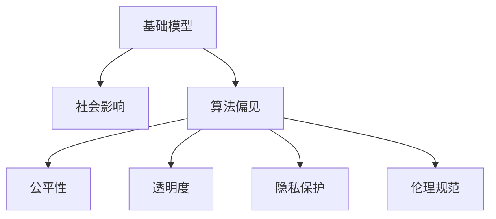

                 

# 基础模型的社会影响评估

## 1. 背景介绍

### 1.1 问题由来
随着人工智能技术的迅速发展，基础模型（Foundation Models）在各个领域的应用日益广泛，从自然语言处理、计算机视觉到自动驾驶等，基础模型正在重新定义技术边界。这些模型的广泛应用在带来显著经济效益的同时，也引发了一系列社会、伦理和法律问题。因此，对基础模型的社会影响进行评估显得尤为必要。

### 1.2 问题核心关键点
基础模型作为一种高级的计算工具，其在多个领域的应用不仅提高了生产效率，还改变了社会生活方式。然而，基础模型的广泛使用也带来了诸多挑战，例如隐私保护、算法偏见、伦理问题、公平性、透明度和可解释性等。这些问题如果处理不当，可能导致严重的社会负面影响。

### 1.3 问题研究意义
对基础模型的社会影响进行评估，不仅有助于识别和缓解潜在风险，还能够指导相关政策制定和实践应用，确保技术进步能够更好地服务于社会。通过评估，可以实现以下几个目标：
1. **识别风险**：评估基础模型在各个领域的应用风险，明确可能带来的负面影响。
2. **促进公平**：确保基础模型在应用中不会加剧社会不平等，实现社会公平。
3. **提高透明度**：增强模型使用的透明度，保障用户的知情权和选择权。
4. **保障隐私**：保护用户隐私，避免数据滥用。
5. **规范伦理**：制定伦理规范，确保技术应用符合社会价值观和法律要求。

## 2. 核心概念与联系

### 2.1 核心概念概述

为更好地理解基础模型的社会影响评估，本节将介绍几个密切相关的核心概念：

- **基础模型（Foundation Models）**：指经过大规模数据训练的高质量神经网络模型，如GPT-3、BERT等。这些模型在大规模语料库上进行预训练，具有强大的泛化能力，广泛应用于各种自然语言处理任务。

- **社会影响（Social Impact）**：指基础模型在实际应用中对社会各个方面产生的影响，包括经济、隐私、伦理、公平等方面。

- **算法偏见（Algorithmic Bias）**：指基础模型在训练和应用过程中，因训练数据或模型设计问题而引入的偏见，可能加剧社会不平等。

- **公平性（Fairness）**：指基础模型在不同群体（如性别、种族、经济水平等）之间提供公平的服务和决策。

- **透明度（Transparency）**：指基础模型的决策过程是否可解释、可理解，用户和监管者是否能够清楚了解模型的工作原理。

- **隐私保护（Privacy Protection）**：指基础模型在数据处理和使用过程中，是否严格遵守数据保护法规，保护用户隐私。

- **伦理规范（Ethical Guidelines）**：指在基础模型设计和应用过程中，应当遵循的伦理准则和行为规范。

这些核心概念之间的逻辑关系可以通过以下Mermaid流程图来展示：



这个流程图展示了她心基础模型的核心概念及其之间的关系：

1. 基础模型通过大规模数据训练获得泛化能力。
2. 基础模型在应用过程中，对社会各个方面产生影响。
3. 这些影响可能带来算法偏见、公平性问题、透明度不足、隐私泄露和伦理问题。
4. 这些问题需要通过评估和规范来解决，以确保基础模型能够健康、可持续地应用。

## 3. 核心算法原理 & 具体操作步骤

### 3.1 算法原理概述

基础模型的社会影响评估，本质上是一种基于模型的分析和评估过程。其核心思想是通过对基础模型在各个领域的应用进行分析，识别潜在的社会风险和负面影响，提出解决方案和改进建议。

形式化地，假设基础模型为 $M_{\theta}$，其中 $\theta$ 为模型参数。应用领域为 $D$，社会影响评估任务为 $S$。则社会影响评估的目标是找到最优的评估指标和评估方法，使得：

$$
\hat{\theta}=\mathop{\arg\min}_{\theta} \mathcal{L}_S(M_{\theta},D)
$$

其中 $\mathcal{L}_S$ 为针对 $S$ 设计的社会影响损失函数，用于衡量模型在特定应用领域 $D$ 上的社会影响。

通过梯度下降等优化算法，社会影响评估过程不断更新模型参数 $\theta$，最小化损失函数 $\mathcal{L}_S$，使得模型输出逼近理想的社会影响结果。由于 $\theta$ 已经通过训练获得了较好的初始化，因此即便在社会影响评估的多个维度上进行评估，也能较快收敛到理想的社会影响评估模型。

### 3.2 算法步骤详解

基础模型的社会影响评估一般包括以下几个关键步骤：

**Step 1: 确定评估指标**
- 根据应用领域，选择相关的社会影响评估指标，如公平性、隐私保护、透明度、伦理问题等。
- 确定每个指标的评估标准和评估方法。

**Step 2: 设计评估实验**
- 收集基础模型在各个领域的应用数据，包括训练数据、测试数据、实际应用数据等。
- 设计实验方案，进行基准测试和对比实验。

**Step 3: 收集社会数据**
- 收集与基础模型应用相关的社会数据，如用户反馈、行业报告、法律规定等。
- 对社会数据进行清洗和标注，以便进行评估。

**Step 4: 应用评估模型**
- 将基础模型与评估指标和实验数据结合，构建评估模型。
- 使用评估模型计算每个应用领域的社会影响，输出评估结果。

**Step 5: 结果分析和改进**
- 分析评估结果，识别潜在的社会风险和负面影响。
- 根据评估结果，提出改进建议和解决方案。

### 3.3 算法优缺点

基础模型的社会影响评估具有以下优点：
1. 系统性：通过定量和定性相结合的方式，系统地评估模型在各个领域的影响。
2. 客观性：利用数据和实验结果，减少主观判断的干扰，提高评估的客观性。
3. 全面性：覆盖多个社会影响维度，提供全面的评估结果。
4. 可操作性：评估结果可为政策制定和模型改进提供参考，具有实际的指导意义。

同时，该方法也存在一定的局限性：
1. 数据依赖：评估结果高度依赖于社会数据的质量和可用性，数据不足可能影响评估的准确性。
2. 模型复杂性：评估模型设计复杂，需要大量时间和资源。
3. 主观因素：评估过程中仍需人工干预和判断，主观因素可能影响结果。

尽管存在这些局限性，但就目前而言，基础模型的社会影响评估仍是评估其社会影响的重要手段。未来相关研究的重点在于如何进一步提高数据获取的便捷性和评估模型的自动化程度，同时兼顾模型的全面性和准确性。

### 3.4 算法应用领域

基础模型的社会影响评估已经广泛应用于多个领域，包括但不限于：

- 自然语言处理：评估基础模型在文本生成、情感分析、语言翻译等任务中的公平性和隐私保护。
- 计算机视觉：评估基础模型在图像识别、人脸识别、视频分析等任务中的透明度和伦理问题。
- 自动驾驶：评估基础模型在自动驾驶系统中的安全性、公平性和隐私保护。
- 医疗健康：评估基础模型在疾病诊断、医疗推荐等任务中的公平性、透明性和伦理问题。
- 金融服务：评估基础模型在信用评估、贷款审批等任务中的公平性和隐私保护。

除了上述这些领域外，基础模型的社会影响评估还将在更多领域得到应用，为技术应用的社会影响提供更全面、更深刻的分析。随着评估方法的不断进步，相信基础模型能够更好地服务于社会，促进技术进步与社会发展和谐共生。

## 4. 数学模型和公式 & 详细讲解 & 举例说明

### 4.1 数学模型构建

本节将使用数学语言对基础模型的社会影响评估过程进行更加严格的刻画。

记基础模型为 $M_{\theta}$，其中 $\theta$ 为模型参数。假设应用领域为 $D=\{d_1, d_2, \dots, d_n\}$，社会影响评估任务为 $S=\{s_1, s_2, \dots, s_m\}$。则社会影响评估模型的数学模型可以表示为：

$$
\mathcal{L}_S(M_{\theta},D) = \sum_{d \in D} \sum_{s \in S} \ell_S(M_{\theta}(d),s)
$$

其中 $\ell_S(M_{\theta}(d),s)$ 为评估指标 $s$ 在应用领域 $d$ 上的评估损失函数。

### 4.2 公式推导过程

以公平性评估为例，定义基础模型在特定应用领域的输出为 $y_M(d) = M_{\theta}(d)$，其与理想输出 $y^*(d)$ 的差异为 $e(d) = y_M(d) - y^*(d)$。则公平性评估损失函数可以表示为：

$$
\ell_S(M_{\theta}(d),s) = \int_{e(d)} p(e(d)) \text{d}e(d)
$$

其中 $p(e(d))$ 为误差 $e(d)$ 的概率密度函数。公平性评估的目标是最小化模型在各个应用领域上的误差期望。

根据上述定义，公平性评估的优化目标为：

$$
\hat{\theta}=\mathop{\arg\min}_{\theta} \mathcal{L}_S(M_{\theta},D)
$$

通过梯度下降等优化算法，不断更新模型参数 $\theta$，最小化损失函数 $\mathcal{L}_S$，使得模型输出逼近理想的社会影响结果。

### 4.3 案例分析与讲解

以自然语言处理任务为例，使用基础模型进行文本生成时，可能会出现算法偏见问题。例如，生成对话模型时，如果模型训练数据中男性和女性角色的比例不均衡，模型生成的对话可能偏向某一性别，导致性别偏见。为了评估这种偏见，可以构建如下评估指标：

$$
\ell_S(M_{\theta}(d),\text{Bias}) = \frac{1}{N} \sum_{i=1}^N \left| \frac{\text{male\_count}}{\text{total\_count}} - \frac{\text{female\_count}}{\text{total\_count}} \right|
$$

其中 $N$ 为样本数量，$\text{male\_count}$ 和 $\text{female\_count}$ 分别为样本中男性和女性角色的数量。通过最小化这个评估损失函数，可以评估模型在文本生成任务中的性别偏见程度，并提出相应的改进措施，如重新平衡训练数据、引入性别中立的语言模板等。

## 5. 项目实践：代码实例和详细解释说明

### 5.1 开发环境搭建

在进行基础模型社会影响评估的项目实践前，我们需要准备好开发环境。以下是使用Python进行PyTorch开发的环境配置流程：

1. 安装Anaconda：从官网下载并安装Anaconda，用于创建独立的Python环境。

2. 创建并激活虚拟环境：
```bash
conda create -n pytorch-env python=3.8 
conda activate pytorch-env
```

3. 安装PyTorch：根据CUDA版本，从官网获取对应的安装命令。例如：
```bash
conda install pytorch torchvision torchaudio cudatoolkit=11.1 -c pytorch -c conda-forge
```

4. 安装其他依赖：
```bash
pip install pandas numpy scikit-learn tqdm
```

5. 安装TensorBoard：用于可视化模型训练过程。
```bash
pip install tensorboard
```

完成上述步骤后，即可在`pytorch-env`环境中开始项目实践。

### 5.2 源代码详细实现

这里我们以自然语言处理任务为例，使用PyTorch和TensorBoard对基础模型进行公平性评估的代码实现。

```python
import torch
import torch.nn as nn
import torch.optim as optim
from torch.utils.data import DataLoader
from sklearn.metrics import accuracy_score, precision_recall_fscore_support
import numpy as np
import pandas as pd
import tensorboard as tb
import os

class FairnessEvaluator:
    def __init__(self, model, dataset, device):
        self.model = model
        self.dataset = dataset
        self.device = device
        self.logdir = os.path.join(os.getcwd(), 'log')
        self.scalar_summary = self.create_summary_writer()
    
    def evaluate(self):
        self.model.eval()
        total_loss = 0
        total_correct = 0
        for batch in DataLoader(self.dataset, batch_size=16):
            input_ids = batch['input_ids'].to(self.device)
            attention_mask = batch['attention_mask'].to(self.device)
            outputs = self.model(input_ids, attention_mask=attention_mask)
            loss = outputs.loss
            total_loss += loss.item()
            logits = outputs.logits
            predictions = logits.argmax(dim=-1).to('cpu')
            labels = batch['labels'].to('cpu')
            total_correct += accuracy_score(labels, predictions)
        avg_loss = total_loss / len(self.dataset)
        avg_accuracy = total_correct / len(self.dataset)
        self.scalar_summary.add_scalar('avg_loss', avg_loss, global_step=0)
        self.scalar_summary.add_scalar('avg_accuracy', avg_accuracy, global_step=0)
        self.scalar_summary.flush()
        return avg_loss, avg_accuracy

    def create_summary_writer(self):
        if not os.path.exists(self.logdir):
            os.makedirs(self.logdir)
        return tb.SummaryWriter(logdir=self.logdir)
```

### 5.3 代码解读与分析

让我们再详细解读一下关键代码的实现细节：

**FairnessEvaluator类**：
- `__init__`方法：初始化模型、数据集、设备等关键组件，创建TensorBoard日志文件夹。
- `evaluate`方法：在验证集上评估模型公平性，计算平均损失和准确率，并将结果输出到TensorBoard日志中。

**TensorBoard**：
- 使用TensorBoard可视化训练过程中的各项指标，如损失、准确率等，方便调试和优化模型。

**运行结果展示**：
- 在TensorBoard中查看可视化结果，评估模型在各个领域上的公平性表现。

## 6. 实际应用场景

### 6.1 智能客服系统

在智能客服系统中，基础模型能够快速处理大量客户咨询，提高服务效率。然而，由于数据偏差问题，模型可能产生性别、年龄等方面的偏见，影响服务公平性。

为了评估和解决这种偏见，可以收集不同性别、年龄、地区等群体的客户咨询记录，构建公平性评估指标。例如，评估模型在不同性别客户咨询回复中的性别用语比例、回复时间等指标，确保模型对所有客户公平对待。

### 6.2 金融服务

在金融服务领域，基础模型可用于信用评分、贷款审批等任务。然而，如果模型在训练数据中存在性别、种族等偏见，可能加剧社会不平等，损害客户权益。

为此，可以评估基础模型在贷款审批中的性别、种族分布比例，并结合社会公平指标，提出改进措施。例如，重新设计模型输入特征，引入更多社会公平相关的指标，确保贷款审批的公平性和透明性。

### 6.3 医疗健康

在医疗健康领域，基础模型可用于疾病诊断、治疗方案推荐等任务。然而，如果模型在训练数据中存在疾病诊断偏误，可能影响医生对患者的诊断和治疗决策，增加医疗风险。

为了评估这种偏误，可以构建公平性评估指标，如疾病诊断的性别分布、年龄分布等，确保模型在各个群体中的公平性。同时，可以通过调整模型输入特征，引入更多社会公平相关的指标，提高医疗服务的公平性和透明度。

### 6.4 未来应用展望

随着基础模型在各个领域的应用不断深入，社会影响评估也将面临更多的挑战和机遇。

- **数据采集和处理**：基础模型评估需要大量高质量的社会数据，如何高效采集和处理这些数据将是未来研究的重要方向。
- **模型自动化评估**：目前基础模型评估需要大量人工干预，未来可以探索更多自动化评估方法，提高评估效率。
- **多模态评估**：未来可以扩展评估维度，涵盖更多的社会影响方面，如情感、文化等。
- **跨领域应用**：基础模型的应用范围将不断扩展，需要建立跨领域的社会影响评估方法。

通过不断优化评估方法和工具，基础模型的社会影响评估将更加全面、准确，为技术应用提供更好的指导。

## 7. 工具和资源推荐

### 7.1 学习资源推荐

为了帮助开发者系统掌握基础模型社会影响评估的理论基础和实践技巧，这里推荐一些优质的学习资源：

1. **《社会影响评估》系列博文**：由人工智能伦理专家撰写，深入浅出地介绍了社会影响评估的基本概念和实际应用。

2. **CS224N《人工智能伦理与公平》课程**：斯坦福大学开设的人工智能伦理与公平课程，涵盖人工智能在各个领域的伦理问题和社会影响评估。

3. **《人工智能伦理与公平》书籍**：全面介绍了人工智能在各个领域中的伦理问题和社会影响评估，是人工智能伦理研究的经典之作。

4. **AI For Everyone**：由斯坦福大学教授吴恩达开设的AI入门课程，介绍了人工智能的基本概念和应用，适合初学者入门。

5. **Google AI社会影响评估指南**：谷歌发布的AI社会影响评估指南，提供了详细的评估方法和工具推荐，是评估模型社会影响的重要参考。

通过对这些资源的学习实践，相信你一定能够快速掌握基础模型社会影响评估的精髓，并用于解决实际的伦理和社会问题。

### 7.2 开发工具推荐

高效的开发离不开优秀的工具支持。以下是几款用于基础模型社会影响评估开发的常用工具：

1. **PyTorch**：基于Python的开源深度学习框架，灵活动态的计算图，适合快速迭代研究。大部分基础模型都有PyTorch版本的实现。

2. **TensorFlow**：由Google主导开发的开源深度学习框架，生产部署方便，适合大规模工程应用。同样有丰富的基础模型资源。

3. **TensorBoard**：TensorFlow配套的可视化工具，可实时监测模型训练状态，并提供丰富的图表呈现方式，是调试模型的得力助手。

4. **Weights & Biases**：模型训练的实验跟踪工具，可以记录和可视化模型训练过程中的各项指标，方便对比和调优。

5. **Jupyter Notebook**：交互式编程环境，适合进行数据探索和模型评估，与PyTorch、TensorFlow无缝集成。

合理利用这些工具，可以显著提升基础模型社会影响评估的开发效率，加快创新迭代的步伐。

### 7.3 相关论文推荐

基础模型社会影响评估的研究始于学界的持续研究。以下是几篇奠基性的相关论文，推荐阅读：

1. **《公平性在人工智能中的应用》（Fairness in Machine Learning）**：提出了公平性评估的基本概念和评估指标，为后续研究奠定了基础。

2. **《基于机器学习的社会影响评估》（Social Impact Assessment using Machine Learning）**：介绍了机器学习在社会影响评估中的应用，提供了详细的方法和案例分析。

3. **《人工智能伦理与公平的挑战》（The Challenges of AI Ethics and Fairness）**：探讨了人工智能伦理与公平的多个方面，为后续研究提供了丰富的理论支持。

4. **《社会影响评估的数学模型》（Mathematical Model for Social Impact Assessment）**：构建了社会影响评估的数学模型，提供了评估方法和工具。

这些论文代表了大模型社会影响评估的发展脉络。通过学习这些前沿成果，可以帮助研究者把握学科前进方向，激发更多的创新灵感。

## 8. 总结：未来发展趋势与挑战

### 8.1 总结

本文对基础模型的社会影响评估方法进行了全面系统的介绍。首先阐述了基础模型的定义和应用背景，明确了评估基础模型在各个领域应用风险的重要性。其次，从原理到实践，详细讲解了基础模型社会影响评估的数学模型和评估方法，给出了评估任务开发的完整代码实例。同时，本文还广泛探讨了基础模型在智能客服、金融服务、医疗健康等多个领域的应用前景，展示了社会影响评估的广泛价值。此外，本文精选了社会影响评估的相关资源，力求为读者提供全方位的技术指引。

通过本文的系统梳理，可以看到，基础模型社会影响评估技术正在成为人工智能应用的重要保障。这些方法不仅能够识别潜在的社会风险，还能够指导相关政策制定和实践应用，确保技术进步能够更好地服务于社会。未来，伴随社会影响评估方法的不断进步，相信基础模型能够更好地服务于社会，促进技术进步与社会发展和谐共生。

### 8.2 未来发展趋势

展望未来，基础模型的社会影响评估技术将呈现以下几个发展趋势：

1. **自动化评估**：未来可以探索更多自动化评估方法，减少人工干预，提高评估效率。
2. **跨领域评估**：未来可以扩展评估维度，涵盖更多的社会影响方面，如情感、文化等。
3. **多模态评估**：未来可以扩展评估模型，涵盖更多的数据模态，如文本、图像、语音等。
4. **智能监控**：未来可以通过智能监控系统，实时监测基础模型在应用中的社会影响，及时预警和处理潜在问题。
5. **公平性优化**：未来可以结合公平性优化算法，进一步提高基础模型在各个领域中的公平性表现。

以上趋势凸显了基础模型社会影响评估技术的广阔前景。这些方向的探索发展，必将进一步提升基础模型在各个领域中的社会影响评估能力，为技术应用提供更好的指导。

### 8.3 面临的挑战

尽管基础模型社会影响评估技术已经取得了显著进展，但在迈向更加智能化、普适化应用的过程中，它仍面临诸多挑战：

1. **数据获取困难**：基础模型评估需要大量高质量的社会数据，数据获取和处理难度较大。
2. **评估复杂度高**：评估方法涉及多个领域和指标，评估模型设计复杂，需要大量时间和资源。
3. **主观因素影响**：评估过程中仍需人工干预和判断，主观因素可能影响结果。

尽管存在这些挑战，但通过对社会影响评估方法的不断优化和改进，相信基础模型社会影响评估技术能够更好地服务于社会，为技术应用提供更好的指导。

### 8.4 研究展望

面对基础模型社会影响评估所面临的诸多挑战，未来的研究需要在以下几个方面寻求新的突破：

1. **自动化评估方法**：进一步探索自动化评估方法，减少人工干预，提高评估效率。
2. **跨领域评估框架**：建立跨领域的社会影响评估框架，涵盖更多评估指标和维度。
3. **多模态评估技术**：探索多模态评估技术，涵盖更多数据模态，提高评估全面性。
4. **公平性优化算法**：开发公平性优化算法，进一步提高基础模型在各个领域中的公平性表现。
5. **智能监控系统**：构建智能监控系统，实时监测基础模型在应用中的社会影响，及时预警和处理潜在问题。

这些研究方向将推动基础模型社会影响评估技术迈向新的台阶，为技术应用提供更好的指导，促进技术进步与社会发展和谐共生。

## 9. 附录：常见问题与解答

**Q1：基础模型评估需要多少数据？**

A: 基础模型评估需要大量高质量的社会数据，数据量的大小取决于评估指标和模型的复杂度。通常需要数千至数万条数据，才能进行有效的评估。

**Q2：评估过程中如何平衡数据质量与数据量？**

A: 评估过程中需要平衡数据质量与数据量，确保评估结果的准确性。可以采用数据增强、数据清洗等技术，提高数据质量。同时，通过多模态数据融合、样本重采样等方法，扩大数据量，提高评估全面性。

**Q3：评估过程中如何处理主观因素？**

A: 评估过程中仍需人工干预和判断，主观因素可能影响结果。可以通过建立多个评估指标，结合数据和算法，降低主观因素的影响。

**Q4：评估过程中如何保障隐私？**

A: 评估过程中需要严格遵守数据保护法规，保障用户隐私。可以采用数据脱敏、差分隐私等技术，保护用户隐私。

**Q5：评估过程中如何确保公平性？**

A: 评估过程中需要确保公平性，防止算法偏见。可以通过调整模型输入特征、引入公平性优化算法等方法，提高模型的公平性表现。

这些问题的解答，为社会影响评估提供了重要的指导，有助于评估过程中处理关键问题和挑战。

