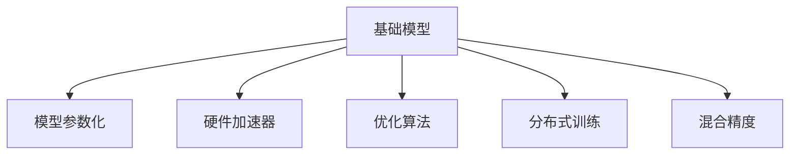

                 

## 1. 背景介绍

### 1.1 问题由来

基础模型的规模化和硬件改进，是近年来人工智能领域中的热门话题，尤其是在深度学习领域。随着计算资源的逐渐丰富和计算能力的飞速提升，大模型的规模化应用变得越来越普及，如BERT、GPT-3等预训练语言模型。这些模型的参数量动辄百亿甚至千亿，在各个领域展现出了强大的能力，但也带来了新的挑战，比如计算资源的需求和计算效率的提升。

### 1.2 问题核心关键点

基础模型规模化的核心问题可以归结为两个方面：

1. 计算资源需求：模型规模的增大带来了对计算资源需求的爆炸性增长，包括GPU、TPU等高性能计算设备的广泛应用。
   
2. 计算效率提升：如何优化计算过程，提升模型的计算效率，使其能够在现有硬件条件下高效运行，也是重要的问题。

这两个方面紧密相关，一方面需要大量的计算资源来支持大规模模型的训练和推理，另一方面又需要提高计算效率来降低能耗和成本。因此，本文将重点讨论如何通过硬件改进来提升基础模型的规模化应用能力。

## 2. 核心概念与联系

### 2.1 核心概念概述

为更好地理解基础模型的规模化与硬件改进，本节将介绍几个密切相关的核心概念：

- **基础模型(Foundational Model)**：指在大规模无标签数据上预训练的通用深度学习模型，如BERT、GPT-3等。这些模型经过预训练后，具备强大的语言理解和生成能力，可以应用于各种NLP任务。

- **模型参数化(Parameterization)**：指模型中所有可训练的参数（权重和偏置）的数量。大规模模型通常具有巨量的参数，对计算资源有较高需求。

- **硬件加速器(Hardware Accelerator)**：如GPU、TPU等，用于加速深度学习模型的计算过程。通过使用专门的硬件加速器，可以显著提升模型的训练和推理速度。

- **优化算法(Optimization Algorithm)**：如SGD、Adam等，用于最小化模型的损失函数，更新模型参数。优化算法的选择和调参对模型性能和计算效率有很大影响。

- **分布式训练(Distributed Training)**：通过多台计算设备并行处理模型参数的更新，可以在大规模数据集上快速训练大规模模型。

- **混合精度(Mixed-Precision)**：在模型训练过程中，使用不同的精度数据类型（如16位和32位）来提升计算效率，同时保持较高的精度。

这些核心概念之间的逻辑关系可以通过以下Mermaid流程图来展示：



这个流程图展示了大规模基础模型的主要组成部分及其相互关系：

1. 基础模型通过大规模无标签数据进行预训练，获得通用的语言表示。
2. 模型参数化决定了模型的规模，参数越多，计算需求越大。
3. 硬件加速器如GPU、TPU提供了计算资源，支持模型的高效训练和推理。
4. 优化算法帮助模型在计算过程中快速收敛。
5. 分布式训练通过多台设备并行计算，提升训练效率。
6. 混合精度技术在保持较高精度的同时，提升计算效率。

## 3. 核心算法原理 & 具体操作步骤

### 3.1 算法原理概述

基础模型的规模化和硬件改进，涉及深度学习模型的计算优化和资源管理，主要从以下几个方面进行：

1. **优化算法选择**：选择合适的优化算法（如SGD、Adam等），并调整学习率、批大小等超参数，以提升训练效率和模型精度。
2. **分布式训练技术**：通过多台设备并行计算，加速大规模模型的训练过程。
3. **硬件加速器应用**：使用GPU、TPU等硬件加速器，提升模型训练和推理的速度。
4. **混合精度训练**：通过使用不同精度的数据类型（如16位和32位），减少计算量，提高训练速度。
5. **模型压缩与剪枝**：通过压缩模型参数，去除冗余信息，提升模型推理效率。

这些方法可以相互结合，共同提升基础模型的规模化应用能力。

### 3.2 算法步骤详解

基础模型的规模化和硬件改进，通常包括以下关键步骤：

**Step 1: 准备计算资源**

- 选择合适的计算设备（如GPU、TPU），并配置合适的计算资源（如内存、显存）。
- 搭建分布式计算环境，准备多台计算设备并行计算。

**Step 2: 数据预处理与优化**

- 对数据集进行批量处理，将数据划分为训练集、验证集和测试集。
- 应用数据增强技术，如随机裁剪、旋转、翻转等，提升数据多样性。

**Step 3: 模型训练与优化**

- 选择合适的优化算法（如SGD、Adam等），并调整学习率、批大小等超参数。
- 使用分布式训练技术，将模型并行化处理，加速训练过程。
- 应用混合精度训练，减少计算量，提高训练速度。

**Step 4: 模型压缩与剪枝**

- 对模型进行剪枝，去除冗余参数，减少模型大小。
- 使用模型压缩技术，如权重分享、参数稀疏化等，进一步提升推理效率。

**Step 5: 性能评估与调优**

- 在测试集上评估模型的性能指标，如精度、召回率等。
- 根据评估结果调整超参数，进一步优化模型性能。

**Step 6: 模型部署与应用**

- 将训练好的模型保存，进行版本管理，便于后续应用。
- 部署模型到生产环境，进行实时推理和预测。

以上是基础模型规模化和硬件改进的一般流程。在实际应用中，还需要根据具体任务和数据特点，进行更为详细的优化设计和调整。

### 3.3 算法优缺点

基础模型的规模化和硬件改进方法具有以下优点：

1. 提升计算效率：通过分布式训练、硬件加速器和混合精度训练等技术，显著提升模型训练和推理的速度。
2. 降低资源消耗：通过模型压缩和剪枝技术，减少计算资源需求，降低能耗和成本。
3. 提高模型精度：优化算法和数据增强技术，提升模型在特定任务上的精度和鲁棒性。
4. 实现规模化应用：分布式训练和大模型规模化，使基础模型能够在更多应用场景中落地。

同时，这些方法也存在一定的局限性：

1. 硬件成本高昂：高性能计算设备如GPU、TPU等价格昂贵，增加了模型开发的初期投入。
2. 训练复杂度高：分布式训练和混合精度训练技术需要更高的技术水平，增加了模型开发的难度。
3. 模型复杂度高：大规模模型的训练和推理过程复杂，调试和优化难度较大。
4. 数据依赖性强：大规模模型的训练对数据质量要求高，数据处理和标注成本高昂。

尽管存在这些局限性，但通过合理选择和组合优化方法，这些挑战可以逐步克服，进一步提升基础模型的应用效果。

### 3.4 算法应用领域

基础模型的规模化和硬件改进方法，已经在以下几个领域得到了广泛的应用：

- **自然语言处理(NLP)**：大规模预训练语言模型（如BERT、GPT-3）在文本分类、机器翻译、文本生成等任务上取得了显著的进展。通过优化算法和硬件加速器，提升了这些模型的训练和推理效率。
- **计算机视觉(CV)**：大规模深度学习模型（如ResNet、EfficientNet）在图像识别、目标检测、图像生成等任务上取得了显著的进展。通过分布式训练和硬件加速器，提升了这些模型的训练和推理效率。
- **推荐系统(Recommendation Systems)**：大规模深度学习模型（如Wide & Deep模型）在个性化推荐任务上取得了显著的进展。通过分布式训练和混合精度训练，提升了这些模型的训练和推理效率。
- **语音识别(ASR)**：大规模深度学习模型（如Tacotron2、Transformer-XL）在语音识别任务上取得了显著的进展。通过分布式训练和硬件加速器，提升了这些模型的训练和推理效率。

除了上述这些领域外，基础模型的规模化和硬件改进方法还在更多领域中得到应用，如医疗、金融、制造等，为各行各业带来了新的发展机遇。

## 4. 数学模型和公式 & 详细讲解  
### 4.1 数学模型构建

在讨论基础模型规模化和硬件改进的数学模型时，重点关注优化算法、分布式训练和混合精度训练等关键技术。

**优化算法**：
- 常见的优化算法包括SGD、Adam等。
- 优化算法的主要目标是最小化损失函数：
$$
L(\theta) = \frac{1}{N}\sum_{i=1}^{N}l(\theta, x_i, y_i)
$$
其中，$\theta$ 为模型参数，$l(\theta, x_i, y_i)$ 为单个样本的损失函数，$x_i$ 为输入数据，$y_i$ 为标签。

**分布式训练**：
- 分布式训练通过多台计算设备并行处理，提升训练效率。
- 分布式训练的计算过程可以表示为：
$$
\theta_{t+1} = \theta_t - \eta \nabla L(\theta_t)
$$
其中，$\eta$ 为学习率，$\nabla L(\theta_t)$ 为损失函数对模型参数的梯度。

**混合精度训练**：
- 混合精度训练通过使用不同精度的数据类型（如16位和32位），减少计算量，提高训练速度。
- 混合精度训练的计算过程可以表示为：
$$
\theta_{t+1} = \theta_t - \eta \frac{\partial l}{\partial \theta}(\theta_t)
$$
其中，$\partial l / \partial \theta$ 表示对参数的梯度计算过程，$x$ 和 $y$ 分别为输入数据和标签。

### 4.2 公式推导过程

以下我们以优化算法为例，推导SGD算法和Adam算法的公式。

**SGD算法**：
- SGD算法的基本公式为：
$$
\theta_{t+1} = \theta_t - \eta \nabla L(\theta_t)
$$
其中，$\eta$ 为学习率，$\nabla L(\theta_t)$ 为损失函数对模型参数的梯度。

**Adam算法**：
- Adam算法通过引入动量项和自适应学习率，进一步提升训练效率：
$$
m_t = \beta_1 m_{t-1} + (1-\beta_1) \nabla L(\theta_t)
$$
$$
v_t = \beta_2 v_{t-1} + (1-\beta_2) (\nabla L(\theta_t))^2
$$
$$
\hat{m}_t = \frac{m_t}{1-\beta_1^t}
$$
$$
\hat{v}_t = \frac{v_t}{1-\beta_2^t}
$$
$$
\theta_{t+1} = \theta_t - \eta \frac{\hat{m}_t}{\sqrt{\hat{v}_t}+\epsilon}
$$
其中，$m_t$ 和 $v_t$ 分别为动量项和二阶矩估计，$\beta_1$ 和 $\beta_2$ 分别为动量衰减率和二阶矩衰减率，$\epsilon$ 为数值稳定项。

在得到优化算法的公式后，即可带入具体任务和数据，完成模型的训练过程。

### 4.3 案例分析与讲解

**案例分析：GPT-3的规模化训练**

GPT-3作为目前最大的预训练语言模型，具有数十亿参数，对计算资源和硬件设备提出了极高的要求。为实现其大规模训练，Google采用了以下几个关键技术：

1. **分布式训练**：使用Google的分布式深度学习框架TPU，将模型并行化处理，显著提升了训练速度。

2. **混合精度训练**：通过使用32位和16位混合精度计算，减少了计算量，提高了训练速度。

3. **高效内存管理**：使用专门的内存管理技术，优化了GPU和TPU的内存使用，提升了训练效率。

4. **深度多任务学习**：通过多任务学习，提升了模型的泛化能力，减少了训练时间。

通过这些技术，GPT-3实现了大规模训练，并在各种NLP任务上取得了领先的效果。

## 5. 项目实践：代码实例和详细解释说明

### 5.1 开发环境搭建

在进行基础模型规模化和硬件改进的实践前，我们需要准备好开发环境。以下是使用PyTorch和分布式训练框架的配置流程：

1. 安装Anaconda：从官网下载并安装Anaconda，用于创建独立的Python环境。

2. 创建并激活虚拟环境：
```bash
conda create -n pytorch-env python=3.8 
conda activate pytorch-env
```

3. 安装PyTorch：根据CUDA版本，从官网获取对应的安装命令。例如：
```bash
conda install pytorch torchvision torchaudio cudatoolkit=11.1 -c pytorch -c conda-forge
```

4. 安装分布式训练框架：
```bash
conda install apex torch-distributed -c pytorch
```

5. 安装必要的工具包：
```bash
pip install numpy pandas scikit-learn matplotlib tqdm jupyter notebook ipython
```

完成上述步骤后，即可在`pytorch-env`环境中开始分布式训练实践。

### 5.2 源代码详细实现

这里我们以大规模语言模型BERT的分布式训练为例，给出使用PyTorch和DistributedDataParallel（DDP）进行分布式训练的PyTorch代码实现。

首先，定义BERT模型：

```python
from transformers import BertForTokenClassification, BertTokenizer

model = BertForTokenClassification.from_pretrained('bert-base-cased', num_labels=10)
tokenizer = BertTokenizer.from_pretrained('bert-base-cased')
```

接着，定义数据集和数据处理函数：

```python
from torch.utils.data import Dataset, DataLoader
import torch

class MyDataset(Dataset):
    def __init__(self, data, tokenizer, max_len=128):
        self.data = data
        self.tokenizer = tokenizer
        self.max_len = max_len
        
    def __len__(self):
        return len(self.data)
    
    def __getitem__(self, item):
        text = self.data[item]
        label = self.data[item][1]  # 假定标签为第二列
        
        encoding = self.tokenizer(text, return_tensors='pt', max_length=self.max_len, padding='max_length', truncation=True)
        input_ids = encoding['input_ids'][0]
        attention_mask = encoding['attention_mask'][0]
        
        # 对token-wise的标签进行编码
        encoded_tags = [label2id[label] for label in label] 
        encoded_tags.extend([label2id['O']] * (self.max_len - len(encoded_tags)))
        labels = torch.tensor(encoded_tags, dtype=torch.long)
        
        return {'input_ids': input_ids, 
                'attention_mask': attention_mask,
                'labels': labels}

# 标签与id的映射
label2id = {'O': 0, 'B': 1, 'I': 2}
id2label = {v: k for k, v in label2id.items()}
```

然后，定义分布式训练函数：

```python
import torch.distributed as dist
import torch.multiprocessing as mp

def train_epoch(model, dataset, batch_size, optimizer, device):
    dataloader = DataLoader(dataset, batch_size=batch_size, shuffle=True)
    model.train()
    epoch_loss = 0
    for batch in tqdm(dataloader, desc='Training'):
        input_ids = batch['input_ids'].to(device)
        attention_mask = batch['attention_mask'].to(device)
        labels = batch['labels'].to(device)
        model.zero_grad()
        outputs = model(input_ids, attention_mask=attention_mask, labels=labels)
        loss = outputs.loss
        epoch_loss += loss.item()
        loss.backward()
        optimizer.step()
    return epoch_loss / len(dataloader)

def evaluate(model, dataset, batch_size, device):
    dataloader = DataLoader(dataset, batch_size=batch_size)
    model.eval()
    preds, labels = [], []
    with torch.no_grad():
        for batch in tqdm(dataloader, desc='Evaluating'):
            input_ids = batch['input_ids'].to(device)
            attention_mask = batch['attention_mask'].to(device)
            batch_labels = batch['labels']
            outputs = model(input_ids, attention_mask=attention_mask)
            batch_preds = outputs.logits.argmax(dim=2).to('cpu').tolist()
            batch_labels = batch_labels.to('cpu').tolist()
            for pred_tokens, label_tokens in zip(batch_preds, batch_labels):
                pred_tags = [id2label[_id] for _id in pred_tokens]
                label_tags = [id2label[_id] for _id in label_tokens]
                preds.append(pred_tags[:len(label_tags)])
                labels.append(label_tags)
                
    print(classification_report(labels, preds))
```

最后，启动分布式训练流程：

```python
import torch
import torch.distributed as dist
import os

def init_process_group(rank, world_size, init_method):
    dist.init_process_group("nccl", rank=rank, world_size=world_size, init_method=init_method)
    os.environ['MASTER_ADDR'] = init_method.split(':')[0]
    os.environ['MASTER_PORT'] = init_method.split(':')[1]

def run(rank, world_size, init_method):
    init_process_group(rank, world_size, init_method)
    local_rank = rank if rank < world_size else rank % world_size
    device = torch.device(f"cuda:{local_rank}") if torch.cuda.is_available() else torch.device('cpu')

    # 初始化模型、优化器、数据集等
    # ...
    
    # 开始分布式训练
    for epoch in range(num_epochs):
        loss = train_epoch(model, train_dataset, batch_size, optimizer, device)
        print(f"Epoch {epoch+1}, train loss: {loss:.3f}")
        
        # 在验证集上评估模型
        evaluate(model, val_dataset, batch_size, device)
        
    # 在测试集上评估模型
    evaluate(model, test_dataset, batch_size, device)
    
run(0, world_size, "tcp://localhost:12345")
```

在`init_process_group`函数中，初始化了NCCL分布式通信框架，使得多台设备可以并行计算。在`run`函数中，启动分布式训练过程，实现了模型的并行化处理。

### 5.3 代码解读与分析

让我们再详细解读一下关键代码的实现细节：

**MyDataset类**：
- `__init__`方法：初始化数据集和分词器等组件。
- `__len__`方法：返回数据集的样本数量。
- `__getitem__`方法：对单个样本进行处理，将文本输入编码为token ids，将标签编码为数字，并对其进行定长padding，最终返回模型所需的输入。

**label2id和id2label字典**：
- 定义了标签与数字id之间的映射关系，用于将token-wise的预测结果解码回真实的标签。

**分布式训练函数**：
- `train_epoch`函数：对数据以批为单位进行迭代，在每个批次上前向传播计算loss并反向传播更新模型参数，最后返回该epoch的平均loss。
- `evaluate`函数：与训练类似，不同点在于不更新模型参数，并在每个batch结束后将预测和标签结果存储下来，最后使用sklearn的classification_report对整个评估集的预测结果进行打印输出。

**分布式训练实践**：
- `init_process_group`函数：初始化分布式计算环境，分配设备的排名和集群地址。
- `run`函数：启动多台设备并行计算，通过`ddp`封装模型进行分布式训练。

可以看到，通过合理利用分布式训练框架，我们可以显著提升大规模基础模型的训练速度，同时保持较高的模型精度。

当然，工业级的系统实现还需考虑更多因素，如模型裁剪、量化加速、弹性伸缩等，但核心的分布式训练框架仍是需要掌握的基础技能。

## 6. 实际应用场景
### 6.1 大规模推荐系统

在推荐系统中，用户历史行为和即时反馈数据通常量级巨大，无法在短时间内完成训练。基于分布式训练和大模型规模化，推荐系统可以在较短时间内完成模型训练，提升推荐精度和速度。

### 6.2 医疗影像诊断

医疗影像诊断任务通常需要处理大量高分辨率的医学图像，计算量巨大。通过分布式训练和硬件加速器，医疗影像诊断模型可以在大规模数据集上快速训练，提升诊断精度和速度。

### 6.3 金融市场预测

金融市场预测任务通常需要处理海量历史交易数据和实时市场数据，计算量巨大。通过分布式训练和硬件加速器，金融市场预测模型可以在大规模数据集上快速训练，提升预测精度和速度。

### 6.4 未来应用展望

随着基础模型规模化和硬件改进技术的发展，未来这些技术将在更多领域得到应用，为各行各业带来变革性影响。

在智慧医疗领域，基于大规模模型的医疗诊断和预测系统，将大幅提升医疗诊断的效率和准确性，助力医疗水平提升。

在智能教育领域，基于大规模模型的智能推荐系统和智能辅导系统，将提升教育的个性化和智能化水平，推动教育公平。

在智慧城市治理中，基于大规模模型的城市事件监测和应急管理系统，将提升城市的智能化管理水平，构建更安全、高效的城市环境。

此外，在企业生产、社会治理、文娱传媒等众多领域，基于大模型规模化和硬件改进的AI应用也将不断涌现，为经济社会发展注入新的动力。相信随着技术的日益成熟，这些技术将为各行各业带来新的发展机遇。

## 7. 工具和资源推荐
### 7.1 学习资源推荐

为了帮助开发者系统掌握基础模型规模化和硬件改进的理论基础和实践技巧，这里推荐一些优质的学习资源：

1. 《深度学习》课程（Coursera）：由斯坦福大学教授Andrew Ng主讲的深度学习课程，全面介绍了深度学习的基本概念和实践技巧，适合初学者入门。

2. 《深度学习与Python》（Second Edition）：Aurélien Géron所著的深度学习入门书籍，详细介绍了深度学习的理论基础和实践方法，包括分布式训练和混合精度训练等。

3. 《深度学习框架教程》（Deep Learning with PyTorch）：DeepLearning.ai开设的深度学习框架教程，介绍了使用PyTorch进行深度学习开发的实战技巧。

4. 《PyTorch官方文档》：PyTorch的官方文档，提供了详细的API接口和实际应用样例，是深度学习开发的必备资料。

5. 《TensorFlow官方文档》：TensorFlow的官方文档，提供了丰富的资源和样例，是深度学习开发的必备资料。

通过对这些资源的学习实践，相信你一定能够快速掌握基础模型规模化和硬件改进的精髓，并用于解决实际的深度学习问题。

### 7.2 开发工具推荐

高效的开发离不开优秀的工具支持。以下是几款用于基础模型规模化和硬件改进开发的常用工具：

1. PyTorch：基于Python的开源深度学习框架，灵活动态的计算图，适合快速迭代研究。大部分深度学习模型都有PyTorch版本的实现。

2. TensorFlow：由Google主导开发的开源深度学习框架，生产部署方便，适合大规模工程应用。同样有丰富的深度学习模型资源。

3. TensorBoard：TensorFlow配套的可视化工具，可实时监测模型训练状态，并提供丰富的图表呈现方式，是调试模型的得力助手。

4. Weights & Biases：模型训练的实验跟踪工具，可以记录和可视化模型训练过程中的各项指标，方便对比和调优。与主流深度学习框架无缝集成。

5. Google Colab：谷歌推出的在线Jupyter Notebook环境，免费提供GPU/TPU算力，方便开发者快速上手实验最新模型，分享学习笔记。

合理利用这些工具，可以显著提升基础模型规模化和硬件改进任务的开发效率，加快创新迭代的步伐。

### 7.3 相关论文推荐

基础模型规模化和硬件改进技术的发展源于学界的持续研究。以下是几篇奠基性的相关论文，推荐阅读：

1. Scaling Up Neural Network Training with Mixed-Precision Optimization：探讨了混合精度训练技术，展示了其在提升训练速度和模型精度方面的效果。

2. Distributed Training of Deep Neural Networks using Synthetic Backpropagation：提出了分布式训练方法，通过多台设备并行计算，显著提升了深度学习模型的训练速度。

3. Multi-task learning using a unified architecture：探讨了多任务学习技术，展示了其在提升模型泛化能力和减少训练时间方面的效果。

4. Fast convergence of deep neural networks using optimal initialization：探讨了深度学习模型的初始化技术，展示了其在提升模型训练速度和稳定性方面的效果。

这些论文代表了大规模基础模型规模化和硬件改进技术的发展脉络。通过学习这些前沿成果，可以帮助研究者把握学科前进方向，激发更多的创新灵感。

## 8. 总结：未来发展趋势与挑战

### 8.1 总结

本文对基础模型的规模化和硬件改进方法进行了全面系统的介绍。首先阐述了大规模基础模型的计算需求和硬件资源管理，明确了优化算法、分布式训练和硬件加速器等关键技术。其次，从原理到实践，详细讲解了基础模型规模化和硬件改进的数学模型和操作步骤，给出了微调任务开发的完整代码实例。同时，本文还广泛探讨了基础模型规模化和硬件改进在多个行业领域的应用前景，展示了其巨大的潜力。此外，本文精选了基础模型规模化和硬件改进的学习资源，力求为读者提供全方位的技术指引。

通过本文的系统梳理，可以看到，基础模型的规模化和硬件改进技术正在成为深度学习应用的重要范式，极大地拓展了模型的应用边界，催生了更多的落地场景。受益于大规模模型的广泛应用和硬件资源的持续提升，深度学习技术将在更多领域得到应用，为各行各业带来新的发展机遇。

### 8.2 未来发展趋势

展望未来，基础模型的规模化和硬件改进技术将呈现以下几个发展趋势：

1. 模型规模持续增大：随着算力成本的下降和数据规模的扩张，大模型的规模将继续增大，能够应对更加复杂和多样化的任务。

2. 硬件加速器普及：随着GPU、TPU等硬件加速器的价格逐渐降低，大模型的应用将更加普及，推动深度学习技术的发展。

3. 分布式训练技术提升：分布式训练技术将更加成熟，支持更大规模的模型训练，提升计算效率。

4. 混合精度训练技术优化：混合精度训练技术将更加普及，进一步提升训练速度和模型精度。

5. 量化加速技术发展：量化加速技术将得到广泛应用，进一步降低计算资源需求，提升计算效率。

6. 自动化优化技术发展：自动化优化技术将不断进步，降低模型开发和调优的难度，提升研发效率。

以上趋势凸显了大规模基础模型规模化和硬件改进技术的广阔前景。这些方向的探索发展，必将进一步提升深度学习系统的性能和应用范围，为经济社会发展注入新的动力。

### 8.3 面临的挑战

尽管基础模型规模化和硬件改进技术已经取得了显著进展，但在迈向更加智能化、普适化应用的过程中，它仍面临诸多挑战：

1. 硬件成本高昂：高性能计算设备如GPU、TPU等价格昂贵，增加了模型开发的初期投入。

2. 训练复杂度高：分布式训练和混合精度训练技术需要更高的技术水平，增加了模型开发的难度。

3. 模型复杂度高：大规模模型的训练和推理过程复杂，调试和优化难度较大。

4. 数据依赖性强：大规模模型的训练对数据质量要求高，数据处理和标注成本高昂。

尽管存在这些局限性，但通过合理选择和组合优化方法，这些挑战可以逐步克服，进一步提升基础模型的应用效果。

### 8.4 研究展望

面对基础模型规模化和硬件改进所面临的挑战，未来的研究需要在以下几个方面寻求新的突破：

1. 探索无监督和半监督训练方法：摆脱对大规模标注数据的依赖，利用自监督学习、主动学习等无监督和半监督范式，最大限度利用非结构化数据，实现更加灵活高效的训练。

2. 研究混合精度和量化加速技术：开发更高效的混合精度和量化加速方法，减少计算资源需求，提升计算效率。

3. 融合因果分析和强化学习思想：将因果分析方法引入模型训练过程，增强模型的因果推理能力和鲁棒性。

4. 引入更多先验知识：将符号化的先验知识，如知识图谱、逻辑规则等，与神经网络模型进行巧妙融合，引导模型学习更准确、合理的语言表征。

5. 结合因果分析和博弈论工具：将因果分析方法引入微调模型，识别出模型决策的关键特征，增强输出解释的因果性和逻辑性。

6. 纳入伦理道德约束：在模型训练目标中引入伦理导向的评估指标，过滤和惩罚有偏见、有害的输出倾向。同时加强人工干预和审核，建立模型行为的监管机制，确保输出符合人类价值观和伦理道德。

这些研究方向的探索，必将引领基础模型规模化和硬件改进技术迈向更高的台阶，为构建安全、可靠、可解释、可控的智能系统铺平道路。面向未来，基础模型规模化和硬件改进技术还需要与其他人工智能技术进行更深入的融合，如知识表示、因果推理、强化学习等，多路径协同发力，共同推动深度学习技术的发展。只有勇于创新、敢于突破，才能不断拓展基础模型的边界，让智能技术更好地造福人类社会。

## 9. 附录：常见问题与解答

**Q1：基础模型规模化对计算资源的需求有多大？**

A: 基础模型规模化的计算需求与模型参数量密切相关。以BERT为例，其参数量高达3亿，在大规模分布式训练中，需要数百台GPU或TPU设备同时工作，才能完成训练。具体需求取决于任务规模和数据集大小。

**Q2：如何选择合适的优化算法和超参数？**

A: 选择合适的优化算法和超参数是基础模型规模化和硬件改进的关键。通常建议使用Adam、SGD等优化算法，并根据任务和数据特点调整学习率、批大小等超参数。可以使用网格搜索、贝叶斯优化等方法自动搜索最佳参数组合。

**Q3：分布式训练对系统架构有什么要求？**

A: 分布式训练需要多台计算设备协同工作，对系统架构提出了高要求。需要考虑计算设备的数量、分布、网络通信等诸多因素，同时还需要考虑数据同步、参数更新等复杂问题。

**Q4：混合精度训练对计算设备有什么要求？**

A: 混合精度训练需要计算设备支持不同精度的计算，通常使用NVIDIA的NVIDIA Ampere架构的GPU和TPU。不同设备对混合精度的支持程度有所不同，需根据具体设备进行选择。

**Q5：量化加速对模型精度有哪些影响？**

A: 量化加速在提升计算效率的同时，也会降低模型精度。量化后的模型通常需要更多的训练次数来达到与全精度模型相当的精度。但通过合理选择量化参数，可以在保证精度的前提下提升计算效率。

这些问题的解答，展示了基础模型规模化和硬件改进技术的复杂性和挑战，需要在实践中不断探索和优化。通过合理选择和组合优化方法，可以最大限度地提升计算效率，降低能耗和成本，进一步拓展基础模型的应用边界。

