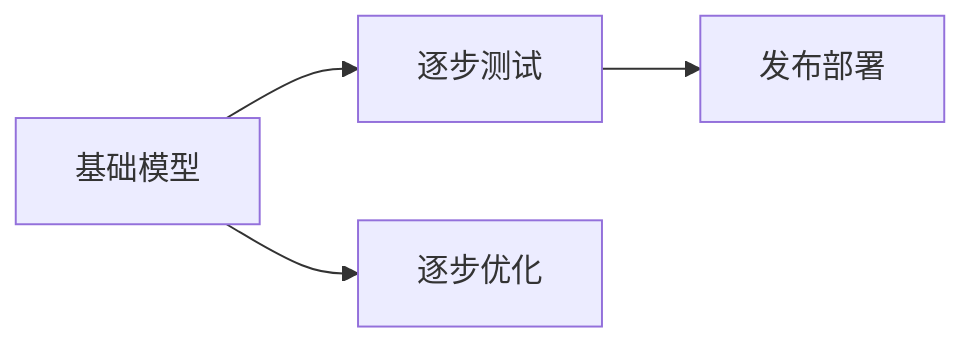
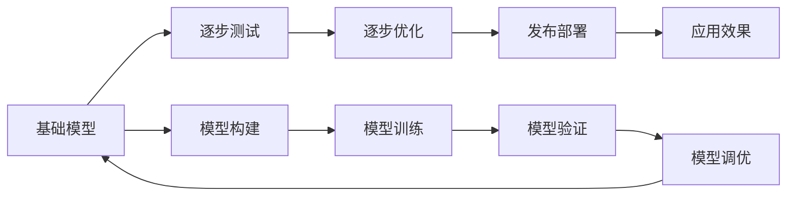

                 

# 基础模型的逐步发布策略

## 1. 背景介绍

在人工智能领域，模型发布是保证模型效果和用户体验的关键环节。良好的模型发布策略，不仅能确保模型的安全性、稳定性和可靠性，还能提高模型的应用效果和用户满意度。本节将从背景和意义出发，探讨基础模型逐步发布策略的必要性和重要性。

## 2. 核心概念与联系

### 2.1 核心概念概述

为了理解逐步发布策略，首先需要明确几个核心概念：

- **基础模型**：指经过严格训练、验证和调优的模型，是用于实际应用的核心算法。
- **逐步发布**：指将基础模型逐步部署到实际应用环境的过程，通常需要经过一系列严格的测试和验证。
- **逐步测试**：指在模型发布前，通过一系列测试手段确保模型性能和稳定性。
- **逐步优化**：指在模型部署后，根据实际应用反馈，不断优化模型参数和结构，提高模型效果。

这些核心概念之间的关系可以表示为：



其中：
- 基础模型是逐步测试和优化的起点。
- 逐步测试是发布部署的前置条件。
- 逐步优化是发布部署后的持续过程。
- 发布部署是最终的目标和应用场景。

### 2.2 核心概念原理和架构的 Mermaid 流程图

为了更直观地理解这些概念之间的联系，下面提供一个 Mermaid 流程图：



其中：
- A：模型构建
- B：逐步测试
- C：逐步优化
- D：发布部署
- E：应用效果
- F：模型训练
- G：模型验证
- H：模型调优
- I：模型部署

这个流程图展示了基础模型的逐步发布过程，从构建、训练、验证、调优、测试、优化，再到最终部署和应用效果监测，形成一个闭环。

## 3. 核心算法原理 & 具体操作步骤

### 3.1 算法原理概述

基础模型的逐步发布策略主要包括以下几个关键步骤：

- 构建基础模型：通过选择合适的网络结构、优化算法和数据集，训练出符合要求的基础模型。
- 逐步测试：在不同场景和数据集上测试模型的性能和鲁棒性。
- 逐步优化：根据测试结果，调整模型参数和结构，进一步提升模型效果。
- 发布部署：将经过优化后的模型部署到实际应用环境，进行大规模测试和应用。
- 持续优化：根据实际应用反馈，持续优化模型性能，保持其在实际应用中的高效和稳定。

这些步骤共同构成了一个完整的逐步发布流程，确保了基础模型的安全、稳定和高效。

### 3.2 算法步骤详解

以下是对逐步发布策略的详细步骤详解：

#### 3.2.1 构建基础模型

- **选择网络结构**：根据任务需求，选择合适的神经网络结构，如卷积神经网络（CNN）、循环神经网络（RNN）、变压器（Transformer）等。
- **选择优化算法**：选择合适的优化算法，如随机梯度下降（SGD）、Adam、Adagrad等，并进行调参。
- **选择数据集**：选择合适的数据集进行训练和验证，如ImageNet、COCO、BERT等。
- **训练模型**：使用训练数据集对模型进行训练，并在验证数据集上进行验证。
- **调优模型**：根据验证结果，调整模型超参数，如学习率、批大小、正则化等。

#### 3.2.2 逐步测试

- **测试数据集**：选择与实际应用场景相匹配的测试数据集。
- **测试指标**：选择合适的测试指标，如准确率、召回率、F1分数等。
- **多场景测试**：在不同场景和数据集上测试模型性能，包括不同的输入数据类型、数据分布和噪声水平。
- **异常检测**：在测试过程中，检测异常数据和异常情况，确保模型的鲁棒性和稳定性。

#### 3.2.3 逐步优化

- **参数调整**：根据测试结果，调整模型参数，如学习率、批大小、正则化等。
- **结构调整**：根据测试结果，调整模型结构，如增加或减少层数、调整神经元数量等。
- **数据增强**：使用数据增强技术，如旋转、翻转、裁剪等，提升模型的泛化能力。
- **对抗训练**：使用对抗样本训练，提升模型的鲁棒性和泛化能力。

#### 3.2.4 发布部署

- **部署平台**：选择合适的部署平台，如云平台、本地服务器、移动端等。
- **性能优化**：对模型进行性能优化，如剪枝、量化、融合等。
- **安全性保障**：确保模型的安全性，如数据加密、权限控制、访问审计等。
- **持续监控**：对模型进行持续监控，检测异常情况和性能瓶颈。

#### 3.2.5 持续优化

- **数据反馈**：收集实际应用中的数据反馈，包括用户投诉、系统错误等。
- **问题定位**：对收集到的反馈进行分析，定位问题原因和影响范围。
- **优化方案**：制定优化方案，包括参数调整、结构调整、数据增强等。
- **重新测试**：根据优化方案，重新测试模型性能和鲁棒性。
- **发布更新**：将优化后的模型重新发布，并更新应用系统。

### 3.3 算法优缺点

逐步发布策略的优点包括：

- **安全性高**：通过逐步测试和优化，确保模型的稳定性和安全性，避免在实际应用中出现严重问题。
- **性能优化**：通过逐步优化，提升模型的性能和效果，确保模型在实际应用中表现最佳。
- **用户体验好**：通过逐步发布，确保模型在实际应用中稳定可靠，提升用户体验。

逐步发布策略的缺点包括：

- **时间和成本高**：逐步发布需要大量时间和资源，特别是在大模型训练和优化过程中，可能需要数月甚至数年。
- **复杂度高**：逐步发布涉及多个步骤和环节，需要协调多个团队和技术手段。

### 3.4 算法应用领域

逐步发布策略在人工智能的各个领域都有广泛应用，特别是在以下领域：

- **计算机视觉**：如物体识别、人脸识别、图像生成等，通过逐步测试和优化，确保模型在实际应用中的高精度和鲁棒性。
- **自然语言处理**：如机器翻译、文本分类、情感分析等，通过逐步测试和优化，确保模型在实际应用中的高准确率和鲁棒性。
- **语音识别**：如语音转文本、语音合成等，通过逐步测试和优化，确保模型在实际应用中的高识别率和流畅度。
- **推荐系统**：如商品推荐、用户画像等，通过逐步测试和优化，确保模型在实际应用中的高相关性和准确性。
- **医疗诊断**：如影像诊断、病历分析等，通过逐步测试和优化，确保模型在实际应用中的高准确性和可靠性。

## 4. 数学模型和公式 & 详细讲解

### 4.1 数学模型构建

基础模型的构建通常基于以下数学模型：

- **线性回归模型**：$y = \theta_0 + \theta_1 x_1 + \theta_2 x_2 + \cdots + \theta_n x_n$，用于处理线性问题。
- **逻辑回归模型**：$y = \frac{1}{1 + e^{-\theta_0 - \theta_1 x_1 - \theta_2 x_2 - \cdots - \theta_n x_n}}$，用于处理分类问题。
- **卷积神经网络**：$y = \sum_i w_{i,j,k} * x_{i,j,k}$，用于处理图像和视频数据。
- **循环神经网络**：$y = \sum_i w_{i,j} * h_{j-1}$，用于处理序列数据。
- **变压器模型**：$y = \sum_i w_i * h_i$，用于处理自然语言数据。

其中：
- $y$ 表示输出结果。
- $x_1, x_2, \cdots, x_n$ 表示输入特征。
- $\theta_0, \theta_1, \theta_2, \cdots, \theta_n$ 表示模型参数。

### 4.2 公式推导过程

以线性回归模型为例，其优化目标为最小化均方误差（MSE）：

$$
\min_{\theta} \frac{1}{N} \sum_{i=1}^N (y_i - \theta_0 - \theta_1 x_{1,i} - \theta_2 x_{2,i} - \cdots - \theta_n x_{n,i})^2
$$

使用梯度下降算法进行优化，每次迭代更新参数为：

$$
\theta_i \leftarrow \theta_i - \eta \frac{\partial}{\partial \theta_i} \frac{1}{N} \sum_{i=1}^N (y_i - \theta_0 - \theta_1 x_{1,i} - \theta_2 x_{2,i} - \cdots - \theta_n x_{n,i})^2
$$

其中，$\eta$ 表示学习率。

### 4.3 案例分析与讲解

以自然语言处理中的文本分类为例，其数学模型通常为逻辑回归模型：

$$
P(y = 1 | x) = \frac{1}{1 + e^{-\theta_0 - \theta_1 x_1 - \theta_2 x_2 - \cdots - \theta_n x_n}}
$$

其中，$x$ 表示文本特征向量，$y$ 表示分类标签。

在逐步测试和优化过程中，需要选择合适的测试数据集，如AG News、20 Newsgroups等，使用交叉验证等方法进行测试，确保模型在不同数据集上的泛化能力。

## 5. 项目实践：代码实例和详细解释说明

### 5.1 开发环境搭建

开发环境搭建是基础模型发布的重要环节，通常需要以下几个步骤：

- **环境安装**：安装Python、PyTorch、TensorFlow等深度学习框架。
- **环境配置**：配置GPU、内存、存储等硬件资源，确保模型训练和推理的稳定性和高效性。
- **版本管理**：使用版本控制系统，如Git，管理代码和数据版本，确保版本控制和协作效率。

### 5.2 源代码详细实现

以下是一个使用PyTorch进行基础模型训练和测试的示例代码：

```python
import torch
import torch.nn as nn
import torch.optim as optim

# 定义模型
class LinearRegression(nn.Module):
    def __init__(self, input_size, output_size):
        super(LinearRegression, self).__init__()
        self.linear = nn.Linear(input_size, output_size)

    def forward(self, x):
        return self.linear(x)

# 加载数据集
train_data = torch.load('train_data.pt')
train_x = train_data['x']
train_y = train_data['y']

# 定义模型参数
input_size = train_x.size()[1]
output_size = 1
learning_rate = 0.01
epochs = 100

# 初始化模型
model = LinearRegression(input_size, output_size)

# 定义损失函数和优化器
criterion = nn.MSELoss()
optimizer = optim.SGD(model.parameters(), lr=learning_rate)

# 训练模型
for epoch in range(epochs):
    for i in range(len(train_x)):
        optimizer.zero_grad()
        outputs = model(train_x[i].view(1, -1))
        loss = criterion(outputs, train_y[i].view(1))
        loss.backward()
        optimizer.step()

# 测试模型
test_data = torch.load('test_data.pt')
test_x = test_data['x']
test_y = test_data['y']
predictions = model(test_x)
print('Test Accuracy:', torch.mean(torch.abs(predictions - test_y)).item())
```

### 5.3 代码解读与分析

以上代码示例展示了使用PyTorch进行线性回归模型的训练和测试过程。其中：

- **模型定义**：定义了一个线性回归模型，包含一个线性层。
- **数据加载**：加载训练和测试数据集，包含输入特征和输出标签。
- **模型初始化**：初始化模型参数，如输入大小、输出大小、学习率等。
- **训练模型**：使用随机梯度下降（SGD）优化器进行模型训练，迭代多次。
- **测试模型**：加载测试数据集，计算模型预测结果与真实标签的平均绝对误差（MAE）。

## 6. 实际应用场景

### 6.1 金融风控

基础模型在金融风控领域有着广泛应用，如信用评分、欺诈检测等。通过逐步测试和优化，确保模型的高准确性和鲁棒性，保护金融机构免受金融风险的影响。

### 6.2 医疗诊断

基础模型在医疗诊断领域也有着重要应用，如影像诊断、病历分析等。通过逐步测试和优化，确保模型的高准确性和可靠性，帮助医生进行疾病诊断和治疗决策。

### 6.3 智能推荐

基础模型在智能推荐领域也有着广泛应用，如商品推荐、新闻推荐等。通过逐步测试和优化，确保模型的高相关性和准确性，提升用户满意度和平台收益。

### 6.4 自动驾驶

基础模型在自动驾驶领域也有着重要应用，如目标检测、路径规划等。通过逐步测试和优化，确保模型的高准确性和鲁棒性，提升自动驾驶系统的安全性和可靠性。

## 7. 工具和资源推荐

### 7.1 学习资源推荐

为了帮助开发者掌握基础模型逐步发布策略，以下是一些推荐的学习资源：

- **《深度学习》书籍**：由多位深度学习专家共同撰写，系统讲解了深度学习的基本概念和算法。
- **Coursera深度学习课程**：斯坦福大学开设的深度学习课程，提供高质量的视频讲解和作业练习。
- **GitHub深度学习项目**：GitHub上许多深度学习项目，提供丰富的代码示例和算法实现。
- **Kaggle深度学习竞赛**：Kaggle上的深度学习竞赛，提供大量的实际数据集和竞赛任务。

### 7.2 开发工具推荐

为了提高开发效率，以下是一些推荐的基础模型开发工具：

- **PyTorch**：基于Python的深度学习框架，支持动态图和静态图，易于使用和调试。
- **TensorFlow**：由Google主导开发的深度学习框架，支持分布式计算和自动微分，适合大规模工程应用。
- **Keras**：基于Python的深度学习框架，支持多种神经网络模型，易于搭建和调试。
- **MXNet**：由亚马逊开发的深度学习框架，支持多种编程语言和多种设备，适合跨平台开发。
- **TensorBoard**：TensorFlow配套的可视化工具，支持模型调试和可视化。

### 7.3 相关论文推荐

以下是一些推荐的基础模型逐步发布策略的论文：

- **《深度学习基础》**：Ian Goodfellow等著，全面讲解了深度学习的基本概念和算法。
- **《深度学习实践》**：Ian Goodfellow等著，提供了大量的代码示例和算法实现。
- **《深度学习网络》**：Simon Haykin著，系统讲解了深度学习网络的架构和训练方法。
- **《深度学习在自然语言处理中的应用》**：Andrew Ng等著，讲解了深度学习在自然语言处理中的广泛应用。
- **《深度学习在计算机视觉中的应用》**：Andrew Ng等著，讲解了深度学习在计算机视觉中的广泛应用。

## 8. 总结：未来发展趋势与挑战

### 8.1 研究成果总结

基础模型的逐步发布策略在人工智能领域已经取得了显著进展，其主要成果包括：

- **模型精度提升**：通过逐步测试和优化，模型在实际应用中的精度和鲁棒性得到了显著提升。
- **应用场景拓展**：基础模型逐步发布策略在多个领域得到了广泛应用，如金融、医疗、推荐系统、自动驾驶等。
- **资源优化**：通过逐步优化，基础模型的计算和存储资源得到了合理利用，提升了模型的高效性和可扩展性。

### 8.2 未来发展趋势

未来基础模型的逐步发布策略将继续发展，主要趋势包括：

- **自动化**：逐步发布过程将更加自动化，减少人工干预和调试成本。
- **边缘计算**：逐步发布过程将在边缘计算设备上进行，提升模型的实时性和响应速度。
- **模型压缩**：逐步发布过程将使用模型压缩技术，减小模型规模，提升计算效率。
- **跨领域迁移**：逐步发布过程将更加注重模型在跨领域的应用，提升模型的泛化能力和鲁棒性。
- **安全性保障**：逐步发布过程将更加注重模型的安全性，如数据加密、权限控制等。

### 8.3 面临的挑战

尽管基础模型逐步发布策略已经取得了一定进展，但在实际应用中仍面临以下挑战：

- **数据质量问题**：数据质量差、标注不准确等问题可能导致模型训练效果不佳。
- **模型过拟合**：模型在训练过程中容易出现过拟合现象，需要采用各种正则化和优化技术来解决。
- **计算资源限制**：基础模型训练和推理需要大量的计算资源，可能会面临资源限制问题。
- **模型解释性**：基础模型通常是"黑盒"系统，难以解释其内部工作机制和决策逻辑。

### 8.4 研究展望

未来基础模型的逐步发布策略需要在以下方面进行进一步研究：

- **无监督学习**：探索无监督学习在基础模型构建和优化中的应用，减少对标注数据的依赖。
- **迁移学习**：探索迁移学习在基础模型构建和优化中的应用，提升模型的泛化能力和迁移能力。
- **跨领域融合**：探索跨领域融合在基础模型构建和优化中的应用，提升模型的跨领域应用能力。
- **安全性保障**：探索安全性保障在基础模型构建和优化中的应用，提升模型的安全性。

## 9. 附录：常见问题与解答

**Q1：如何选择合适的训练数据集？**

A：选择与实际应用场景相匹配的训练数据集，如在自然语言处理中选择大规模语料库，在计算机视觉中选择图像分类数据集。

**Q2：如何处理过拟合问题？**

A：使用正则化技术，如L2正则、Dropout等，减少模型参数数量，增加数据集大小，使用对抗训练等方法。

**Q3：如何在部署过程中优化模型性能？**

A：在部署过程中使用剪枝、量化、融合等技术，优化模型性能和资源利用效率。

**Q4：如何确保模型的安全性？**

A：在模型构建和优化过程中，确保数据隐私和安全，使用加密技术、访问控制等措施。

**Q5：如何在逐步测试过程中发现模型缺陷？**

A：在逐步测试过程中，使用多种测试数据集和测试方法，确保模型在不同场景下的鲁棒性和稳定性。

---

作者：禅与计算机程序设计艺术 / Zen and the Art of Computer Programming

