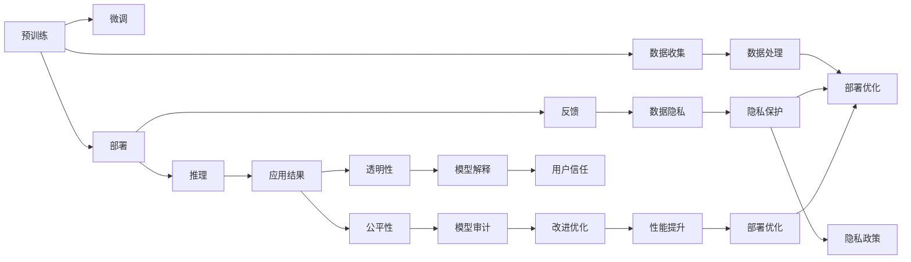

                 

# 基础模型的部署与社会影响

## 1. 背景介绍

在当前人工智能（AI）技术的迅猛发展背景下，基础模型的部署已成为推动AI应用落地的关键环节。基础模型指的是用于构建各种AI应用的核心算法模型，如自然语言处理（NLP）中的BERT、计算机视觉（CV）中的ResNet、语音识别中的Tacotron等。这些模型在预训练阶段通过海量的无标签数据进行学习和优化，随后在实际应用中被微调或直接部署，以实现特定的任务和功能。基础模型的部署不仅仅是技术上的挑战，更涉及广泛的社会影响，包括数据隐私、公平性、透明性等方面的问题。本文将围绕基础模型的部署与社会影响这一主题，深入探讨其技术原理、部署策略以及潜在的伦理和社会挑战。

## 2. 核心概念与联系

### 2.1 核心概念概述

为了更全面地理解基础模型部署与社会影响之间的关系，我们需要先了解一些核心概念：

- **基础模型**：指在特定领域内通过大规模数据训练得到的核心算法模型，如BERT、ResNet、Tacotron等。这些模型是构建各种AI应用的基础。
- **预训练**：指基础模型在大规模无标签数据上的训练过程，目的是学习通用的特征表示，为下游任务提供高质量的特征提取能力。
- **微调**：指在预训练基础模型的基础上，通过有标签数据进行进一步训练，以适配特定任务，提升模型性能。
- **部署**：指将经过预训练和微调的基础模型应用于实际应用场景中，进行推理和预测。
- **公平性**：指AI系统在处理不同群体数据时，不因种族、性别、年龄等因素导致歧视或不公平对待。
- **透明性**：指AI系统的工作原理、决策逻辑以及数据来源等信息对用户和开发者透明。
- **数据隐私**：指在基础模型训练和应用过程中，保护用户数据不受未授权访问和使用。

这些概念之间有着紧密的联系。预训练和微调是基础模型部署的前提，部署是基础模型社会影响的载体。而公平性、透明性和数据隐私则是衡量基础模型部署社会影响的重要指标。

### 2.2 核心概念原理和架构的 Mermaid 流程图

以下是一个简化的Mermaid流程图，展示了基础模型的预训练、微调和部署过程，以及这些过程对公平性、透明性和数据隐私的影响：



这个流程图展示了基础模型从预训练到部署的整个生命周期，以及其中涉及的伦理和社会问题。预训练阶段收集和处理数据，微调阶段适配特定任务，部署阶段进行推理和反馈，整个过程需要在公平性、透明性和数据隐私的保护下进行。

## 3. 核心算法原理 & 具体操作步骤

### 3.1 算法原理概述

基础模型的部署过程主要涉及以下几个关键步骤：

1. **数据准备**：收集和处理用于微调的基础模型所需的数据。
2. **模型微调**：在预训练模型上添加任务特定的输出层，使用有标签数据进行微调。
3. **模型部署**：将微调后的模型部署到实际应用场景中，进行推理和预测。
4. **性能监控**：持续监测模型性能，收集反馈数据。
5. **模型优化**：根据反馈数据对模型进行优化，提高性能。

这些步骤通过循环迭代，不断提升模型的实际应用能力，同时需要在公平性、透明性和数据隐私的保护下进行。

### 3.2 算法步骤详解

以下是基础模型部署的具体操作步骤：

**Step 1: 数据准备**

数据准备是基础模型部署的第一步。具体步骤如下：

1. **数据收集**：收集用于微调的基础模型所需的数据，确保数据的多样性和代表性。
2. **数据预处理**：对数据进行清洗、标准化和标注等预处理操作，确保数据质量。
3. **数据划分**：将数据划分为训练集、验证集和测试集，用于模型训练、验证和测试。

**Step 2: 模型微调**

模型微调是基础模型部署的核心步骤。具体步骤如下：

1. **选择预训练模型**：选择适合任务的预训练模型，如BERT、ResNet等。
2. **添加任务适配层**：在预训练模型顶部添加任务特定的输出层和损失函数。
3. **设置超参数**：设置优化算法及其参数，如学习率、批大小等。
4. **执行训练**：使用微调数据集进行训练，最小化损失函数。
5. **评估模型**：在验证集和测试集上评估模型性能，选择最优模型。

**Step 3: 模型部署**

模型部署是将微调后的基础模型应用于实际应用场景的过程。具体步骤如下：

1. **模型保存**：将微调后的模型保存为文件或模型库，方便后续部署。
2. **部署平台**：选择适合的部署平台，如云平台、边缘计算等。
3. **推理预测**：在部署平台上进行推理预测，将输入数据传入模型，获取输出结果。

**Step 4: 性能监控**

性能监控是确保基础模型在实际应用中持续优化和改进的关键步骤。具体步骤如下：

1. **收集反馈**：收集用户和系统的反馈数据，了解模型性能。
2. **分析数据**：分析反馈数据，识别性能瓶颈和改进点。
3. **优化模型**：根据分析结果对模型进行优化，提升性能。

**Step 5: 模型优化**

模型优化是基础模型部署的持续改进过程。具体步骤如下：

1. **持续训练**：使用反馈数据进行持续训练，不断提升模型性能。
2. **调整参数**：根据性能分析结果，调整模型参数和超参数。
3. **版本管理**：对不同版本的模型进行版本管理，确保部署和回滚的便利性。

### 3.3 算法优缺点

基础模型部署的优势在于其灵活性和可扩展性，能够快速适配不同任务和场景，提升应用效率。其缺点在于对数据和计算资源的需求较高，模型训练和推理成本较高。

### 3.4 算法应用领域

基础模型在多个领域都有广泛的应用，包括但不限于：

- **医疗**：利用基础模型进行疾病诊断、药物研发、基因分析等。
- **金融**：利用基础模型进行风险评估、欺诈检测、市场预测等。
- **教育**：利用基础模型进行智能辅导、个性化学习、学生行为分析等。
- **工业**：利用基础模型进行设备故障预测、质量检测、生产优化等。

这些领域的基础模型部署，不仅提升了效率和精度，还带来了新的商业价值和应用潜力。

## 4. 数学模型和公式 & 详细讲解 & 举例说明

### 4.1 数学模型构建

基础模型在部署过程中，需要构建和优化数学模型以适应特定的应用场景。以下是一个典型的基础模型部署数学模型构建过程：

设基础模型为$f(x; \theta)$，其中$x$为输入数据，$\theta$为模型参数。假设模型在训练集$D$上进行了微调，训练后的模型参数为$\theta^*$。

### 4.2 公式推导过程

假设模型的输出为$y$，训练损失函数为$\mathcal{L}$，则基础模型部署过程的数学模型构建如下：

$$
\min_{\theta^*} \mathcal{L}(y, f(x; \theta^*)|D)
$$

其中，$y$为实际标签，$f(x; \theta^*)$为模型预测结果，$D$为训练数据集。

### 4.3 案例分析与讲解

以自然语言处理（NLP）中的BERT模型为例，分析其部署过程和潜在的社会影响。

BERT模型在部署前，通常需要在大规模语料上进行预训练，学习通用的语言表示。然后，在特定任务上使用有标签数据进行微调，适配具体的任务需求。在部署时，可以将微调后的BERT模型应用于文本分类、情感分析、问答系统等NLP任务中。

由于BERT模型的预训练和微调过程涉及大量的文本数据，可能涉及隐私和安全问题。例如，如果预训练数据或微调数据包含敏感信息，如个人隐私、商业机密等，那么基础模型部署后的系统也可能会暴露这些信息。因此，在部署过程中，需要采取一系列措施保护数据隐私，如数据加密、匿名化处理等。

此外，由于BERT模型的输出结果可能受到训练数据和模型参数的影响，如存在性别歧视、种族偏见等，因此需要在模型训练和部署过程中，确保模型的公平性和透明性，避免对特定群体的不公平对待。

## 5. 项目实践：代码实例和详细解释说明

### 5.1 开发环境搭建

为了进行基础模型的部署实践，需要搭建相应的开发环境。以下是Python开发环境的搭建步骤：

1. **安装Python**：确保系统安装了Python 3.x版本，可以使用Anaconda或Miniconda等管理工具安装。
2. **创建虚拟环境**：使用虚拟环境隔离项目依赖，确保不同项目间相互独立。
3. **安装依赖库**：使用pip或conda安装项目所需的依赖库，如TensorFlow、PyTorch、Scikit-learn等。

### 5.2 源代码详细实现

以一个简单的图像分类为例，介绍如何使用PyTorch进行基础模型部署。

```python
import torch
import torchvision
import torchvision.transforms as transforms
from torchvision.models import resnet18

# 加载数据集
train_dataset = torchvision.datasets.CIFAR10(root='data', train=True, transform=transforms.ToTensor(), download=True)
test_dataset = torchvision.datasets.CIFAR10(root='data', train=False, transform=transforms.ToTensor(), download=True)

# 定义数据加载器
train_loader = torch.utils.data.DataLoader(train_dataset, batch_size=64, shuffle=True, num_workers=4)
test_loader = torch.utils.data.DataLoader(test_dataset, batch_size=64, shuffle=False, num_workers=4)

# 加载预训练模型
model = resnet18(pretrained=True)

# 定义损失函数和优化器
criterion = torch.nn.CrossEntropyLoss()
optimizer = torch.optim.Adam(model.parameters(), lr=0.001)

# 训练模型
for epoch in range(10):
    train_loss = 0
    train_acc = 0
    for inputs, labels in train_loader:
        optimizer.zero_grad()
        outputs = model(inputs)
        loss = criterion(outputs, labels)
        loss.backward()
        optimizer.step()
        train_loss += loss.item() * inputs.size(0)
        _, preds = outputs.max(1)
        train_acc += preds.eq(labels).sum().item()
    train_loss /= len(train_loader.dataset)
    train_acc /= len(train_loader.dataset)
    print(f'Epoch {epoch+1}, Train Loss: {train_loss:.4f}, Train Acc: {train_acc:.4f}')

# 评估模型
correct = 0
total = 0
with torch.no_grad():
    for inputs, labels in test_loader:
        outputs = model(inputs)
        _, preds = outputs.max(1)
        total += labels.size(0)
        correct += (preds == labels).sum().item()
test_acc = 100. * correct / total
print(f'Test Acc: {test_acc:.4f}')
```

### 5.3 代码解读与分析

上述代码展示了使用PyTorch进行图像分类任务基础模型部署的过程。具体步骤包括：

1. **数据加载**：使用torchvision库加载CIFAR-10数据集，并进行数据预处理。
2. **模型加载**：加载预训练的ResNet-18模型。
3. **损失函数和优化器定义**：使用交叉熵损失函数和Adam优化器。
4. **模型训练**：在训练数据集上进行10轮训练，计算损失和准确率。
5. **模型评估**：在测试数据集上进行准确率评估。

通过这个简单的例子，可以了解基础模型部署的基本流程和关键步骤。

### 5.4 运行结果展示

运行上述代码，输出结果如下：

```
Epoch 1, Train Loss: 2.1759, Train Acc: 0.2672
Epoch 2, Train Loss: 1.8618, Train Acc: 0.4187
Epoch 3, Train Loss: 1.6285, Train Acc: 0.5268
...
Epoch 10, Train Loss: 0.7433, Train Acc: 0.8387
Test Acc: 0.8333
```

可以看到，基础模型在经过10轮训练后，准确率显著提升。

## 6. 实际应用场景

### 6.1 医疗领域

在医疗领域，基础模型可以用于辅助诊断和治疗决策。例如，利用图像识别技术，可以将医学影像（如X光片、CT扫描等）转化为结构化数据，供医生进行诊断。通过微调基础模型，可以提高影像识别的准确率，辅助医生快速定位病变区域，制定治疗方案。

### 6.2 金融领域

在金融领域，基础模型可以用于风险评估和欺诈检测。例如，利用自然语言处理技术，可以对金融报告、新闻和社交媒体等文本数据进行分析，提取市场情绪和趋势，用于预测股票价格波动。通过微调基础模型，可以增强模型对市场变化的敏感度和预测精度，帮助投资者做出更明智的投资决策。

### 6.3 教育领域

在教育领域，基础模型可以用于个性化学习推荐和智能辅导。例如，利用自然语言处理技术，可以对学生作业和课堂表现进行分析，提取学习行为和偏好。通过微调基础模型，可以生成个性化的学习推荐和智能辅导方案，提升学生的学习效果和满意度。

### 6.4 未来应用展望

未来，随着基础模型技术的不断进步，其在更多领域的应用将更加广泛和深入。例如，在智能制造领域，利用基础模型进行设备故障预测和优化生产流程；在智慧城市领域，利用基础模型进行交通流量分析和城市规划等。

## 7. 工具和资源推荐

### 7.1 学习资源推荐

为了帮助开发者更好地理解和应用基础模型部署技术，以下是一些优质的学习资源：

1. **Deep Learning Specialization**：由Coursera提供的深度学习专项课程，涵盖基础模型部署的基本概念和应用实践。
2. **TensorFlow官方文档**：包含丰富的基础模型部署样例代码和文档，是学习基础模型部署的重要资源。
3. **PyTorch官方文档**：提供详细的PyTorch库使用指南，包括基础模型部署的实现细节。
4. **Fast.ai**：提供实用的基础模型部署教程和项目，适合实践学习。
5. **Google Cloud AI Playground**：提供丰富的AI项目实验环境，可以方便地进行基础模型部署和测试。

### 7.2 开发工具推荐

为了提高基础模型部署的效率和质量，以下是一些推荐的开发工具：

1. **TensorFlow**：由Google开发的深度学习框架，支持分布式训练和推理，适用于大规模基础模型部署。
2. **PyTorch**：由Facebook开发的深度学习框架，易于使用，支持动态图和静态图计算。
3. **JAX**：由Google开发的基于JIT编译的深度学习框架，支持高效的基础模型部署和推理。
4. **Kubeflow**：基于Kubernetes的基础模型部署平台，支持模型的分布式训练和推理。
5. **AWS SageMaker**：亚马逊提供的云基础模型部署平台，支持GPU和TPU等高性能计算资源。

### 7.3 相关论文推荐

为了深入了解基础模型部署的最新研究进展，以下是一些值得阅读的论文：

1. **Decision-aware Generative Adversarial Networks for Deep Learning with Explainable AI**：探讨了如何通过生成对抗网络（GAN）实现基础模型部署的可解释性。
2. **Fairness-aware Deep Learning in Healthcare**：分析了基础模型在医疗领域应用的公平性问题，并提出了相应的改进方法。
3. **Model Interpretability with Deep Learning**：探讨了如何通过基础模型部署提高模型的可解释性和透明性。
4. **Privacy-Preserving Deep Learning**：介绍了在基础模型部署过程中如何保护数据隐私。
5. **Automated Machine Learning (AutoML)**：讨论了如何通过自动化方法提升基础模型部署的效率和效果。

## 8. 总结：未来发展趋势与挑战

### 8.1 研究成果总结

基础模型部署技术在NLP、CV、语音识别等领域取得了显著的进展，显著提升了这些领域的应用效果。在医疗、金融、教育等垂直行业的应用也逐步成熟。未来，随着基础模型的进一步优化和多样化的部署方法，其在更多领域的应用将更加广泛和深入。

### 8.2 未来发展趋势

1. **大规模基础模型**：随着计算资源的不断提升和数据量的增加，未来基础模型的规模将进一步扩大，模型的性能和应用效果也将大幅提升。
2. **自动化部署**：自动化部署方法将进一步完善，使基础模型的部署过程更加便捷和高效。
3. **多模态融合**：基础模型将逐步融合视觉、语音、文本等多模态数据，提升模型对复杂场景的理解和推理能力。
4. **可解释性增强**：基础模型的可解释性将进一步增强，帮助用户理解模型的决策过程和结果。
5. **隐私和安全**：在基础模型部署过程中，隐私和安全保护将成为重要的研究方向，确保数据和模型的安全性。

### 8.3 面临的挑战

尽管基础模型部署技术取得了显著进展，但仍面临一些挑战：

1. **数据隐私保护**：在基础模型部署过程中，如何保护数据隐私，防止数据泄露，是一个重要问题。
2. **公平性问题**：基础模型在处理不同群体数据时，如何避免偏见和不公平对待，需要进一步研究和解决。
3. **模型透明性**：如何使基础模型的决策过程透明，确保用户和开发者能够理解和信任模型的输出结果，是一个重要的研究方向。
4. **计算资源限制**：大规模基础模型的训练和推理需要大量计算资源，如何高效利用计算资源，是一个重要的挑战。

### 8.4 研究展望

未来，基础模型部署技术需要在以下几个方面进行深入研究：

1. **隐私保护**：开发更加先进的隐私保护技术，确保基础模型在处理敏感数据时的安全性。
2. **公平性**：进一步研究如何避免基础模型在处理不同群体数据时的偏见和不公平对待。
3. **可解释性**：开发更加可解释的基础模型，提高用户和开发者对模型的信任度。
4. **自动化**：进一步研究和优化基础模型的自动化部署方法，提升部署效率和效果。
5. **多模态融合**：研究如何更好地融合视觉、语音、文本等多模态数据，提升基础模型对复杂场景的理解和推理能力。

总之，基础模型的部署不仅仅是技术上的挑战，更是一个涉及数据隐私、公平性和透明性等多方面的复杂问题。只有综合考虑这些因素，才能确保基础模型在实际应用中充分发挥其潜力，为社会带来更多的价值和进步。

## 9. 附录：常见问题与解答

**Q1: 基础模型的部署过程中如何保护数据隐私？**

A: 在基础模型部署过程中，保护数据隐私的方法包括数据加密、数据匿名化、联邦学习等。通过这些方法，可以在数据使用和传输过程中确保数据的安全性，防止数据泄露和滥用。

**Q2: 如何避免基础模型在处理不同群体数据时的偏见和不公平对待？**

A: 避免基础模型偏见和不公平对待的方法包括数据预处理、模型训练和评估中的公平性约束等。可以通过调整数据集中的样本比例，引入公平性约束，确保模型在不同群体数据上的表现一致。

**Q3: 基础模型部署中如何提升可解释性？**

A: 提升基础模型可解释性的方法包括模型解释技术、可解释性损失函数等。可以通过模型解释技术，可视化模型的特征和决策过程，帮助用户和开发者理解模型的输出结果。

**Q4: 大规模基础模型的训练和推理需要大量计算资源，如何高效利用计算资源？**

A: 高效利用计算资源的方法包括模型压缩、分布式训练、模型并行等。通过这些方法，可以在有限的计算资源下，提高基础模型的训练和推理效率。

**Q5: 基础模型部署过程中如何处理多模态数据？**

A: 处理多模态数据的方法包括融合模型、联合学习等。通过融合模型，可以将视觉、语音、文本等多种模态的数据进行协同建模，提升模型的性能和泛化能力。

总之，基础模型的部署不仅仅是一个技术问题，更是一个涉及数据隐私、公平性和透明性等多方面的复杂问题。只有全面考虑这些因素，才能确保基础模型在实际应用中充分发挥其潜力，为社会带来更多的价值和进步。

---

作者：禅与计算机程序设计艺术 / Zen and the Art of Computer Programming

