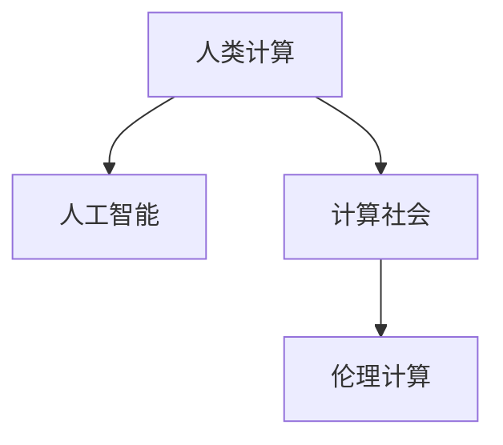
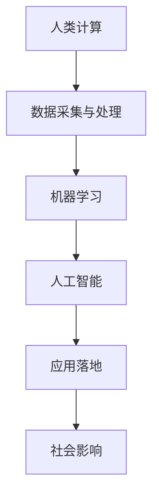

                 

# 塑造未来社会：人类计算的深远意义

> 关键词：人类计算,社会影响,智能时代,技术驱动,伦理挑战

## 1. 背景介绍

在信息技术日新月异的今天，计算技术已经成为推动社会进步的重要引擎。从最初的简单计算到如今的深度学习、大数据、量子计算，计算技术的每一次飞跃都深刻改变了我们的生活方式和社会结构。特别是随着计算能力的突破，人类社会正在进入一个全新的智能时代。然而，随着计算技术的不断演进，我们也需要深入思考其对社会的深远意义，以及如何应对其带来的伦理挑战。

### 1.1 人类计算的发展历程

回溯人类计算的历史，可以看到其经历了从机械到电子，再到数字化的飞速发展。

- **机械计算时期**：早期计算工具如算盘、机械计算器，主要依靠人工操作，计算速度和精度均较低，计算过程繁琐。
- **电子计算时期**：随着电子管、晶体管等电子元件的普及，计算设备从机械转向电子，计算速度大幅提升，计算应用从科学计算拓展到商业、军事等领域。
- **数字计算时期**：集成电路的发明标志着数字计算时代的到来，计算机开始普及于大众，计算能力全面爆发，推动了信息社会的形成。

随着计算技术的发展，人们从被动接受信息到主动创造信息，社会生产力大幅提升。计算已经成为推动人类社会进步的核心动力。

### 1.2 人类计算与人类社会的关系

计算技术不仅是工具，更是文化和社会进步的催化剂。人类计算与社会的互动关系如下：

- **推动社会进步**：计算技术推动了科学、教育、医疗、交通等多个领域的创新，大幅提高了社会生产力。
- **改变生产关系**：计算技术改变了人们的工作方式和生活习惯，推动了社会生产关系的转变。
- **重塑社会结构**：计算技术的普及导致信息不对称的减少，社会分层和治理方式发生变化。

## 2. 核心概念与联系

### 2.1 核心概念概述

本节将介绍几个核心概念，以帮助理解人类计算的深远意义及其与人类社会的关系。

- **人类计算**：指由人类直接参与的计算过程，包括计算机辅助设计、人机交互等。
- **人工智能**：指由机器模拟人类智能过程的技术，涵盖机器学习、自然语言处理、计算机视觉等多个领域。
- **计算社会**：指由计算技术驱动的社会形态，计算不仅是工具，更是构建社会结构的基础。
- **伦理计算**：指在计算过程中考虑伦理道德原则，避免对人类和环境造成伤害。

这些概念之间的关系可以通过以下Mermaid流程图来展示：



这个流程图展示了一系列相关概念之间的逻辑关系：

- 人类计算是人工智能技术的基础，也是构建计算社会的基础。
- 人工智能进一步推动了计算社会的发展，同时也带来了伦理计算的挑战。

这些概念共同构成了人类计算的宏观框架，帮助我们全面理解计算技术对社会的影响。

### 2.2 核心概念原理和架构的 Mermaid 流程图



这个流程图展示了一个从数据采集到人工智能应用落地的基本流程，体现了计算技术对社会的深远影响。

## 3. 核心算法原理 & 具体操作步骤
### 3.1 算法原理概述

人类计算的核心在于通过数据和算法实现信息的采集、处理、存储和应用。在这个过程中，算法的选择和优化起到了至关重要的作用。

### 3.2 算法步骤详解

基于数据和算法的核心流程可以总结如下：

1. **数据采集**：通过传感器、网络、数据库等方式获取原始数据。
2. **数据处理**：对原始数据进行清洗、去噪、归一化等预处理操作。
3. **算法设计**：根据任务需求选择合适的算法模型，并设计训练流程。
4. **模型训练**：使用训练数据对算法模型进行训练，优化模型参数。
5. **模型应用**：将训练好的模型应用于实际场景，进行推理预测。

### 3.3 算法优缺点

人类计算算法的优缺点如下：

#### 优点：

- **高效性**：通过算法模型可以自动化处理海量数据，大幅提升效率。
- **通用性**：一个算法模型可以应用于多个领域和任务，具有广泛的适用性。
- **可扩展性**：算法可以结合其他技术和工具，实现复杂的计算任务。

#### 缺点：

- **数据依赖**：算法的性能高度依赖于数据的质量和数量，数据获取和预处理成本较高。
- **模型黑盒**：算法模型通常难以解释其内部工作机制，可解释性不足。
- **资源消耗**：算法模型的训练和应用需要大量的计算资源，如CPU、GPU、内存等。

### 3.4 算法应用领域

人类计算算法在多个领域得到了广泛应用，例如：

- **工业制造**：通过预测性维护、质量控制等算法优化生产流程，提升生产效率。
- **金融服务**：通过信用评分、风险控制等算法提升金融决策的精准度，防范金融风险。
- **医疗健康**：通过疾病诊断、个性化治疗等算法提高医疗服务的质量，改善患者体验。
- **教育培训**：通过智能推荐、学习分析等算法优化教育资源分配，提升教育效果。
- **交通运输**：通过交通流量预测、路径优化等算法提升交通管理水平，减少交通拥堵。

## 4. 数学模型和公式 & 详细讲解 & 举例说明

### 4.1 数学模型构建

以一个简单的线性回归模型为例，展示数据和算法的数学模型构建过程。

设输入向量为 $x$，目标变量为 $y$，假设模型为线性函数 $f(x)=wx+b$，其中 $w$ 为权重向量，$b$ 为偏置项。模型的目标是最小化预测值与真实值之间的平方误差，即最小化损失函数：

$$
L(w) = \frac{1}{2N}\sum_{i=1}^N (y_i - f(x_i))^2
$$

### 4.2 公式推导过程

求解 $w$ 和 $b$ 的过程可以采用梯度下降法。首先，计算损失函数对 $w$ 和 $b$ 的梯度：

$$
\frac{\partial L(w)}{\partial w} = \frac{1}{N}\sum_{i=1}^N (y_i - f(x_i))x_i
$$

$$
\frac{\partial L(w)}{\partial b} = \frac{1}{N}\sum_{i=1}^N (y_i - f(x_i))
$$

根据梯度下降法，更新 $w$ 和 $b$：

$$
w \leftarrow w - \eta \frac{\partial L(w)}{\partial w}
$$

$$
b \leftarrow b - \eta \frac{\partial L(w)}{\partial b}
$$

其中 $\eta$ 为学习率。

### 4.3 案例分析与讲解

以股票价格预测为例，展示如何使用线性回归模型进行数据分析和应用。

假设有一组历史股票价格数据 $(x_i, y_i)$，其中 $x_i$ 为时间序列，$y_i$ 为股票价格。将数据输入线性回归模型 $f(x_i)=wx_i+b$，得到预测结果 $\hat{y}_i$。计算预测误差 $\epsilon_i=y_i-\hat{y}_i$，最小化均方误差：

$$
L(w) = \frac{1}{N}\sum_{i=1}^N \epsilon_i^2
$$

使用梯度下降法求解最优的 $w$ 和 $b$，可得到最佳的股票价格预测模型。

## 5. 项目实践：代码实例和详细解释说明

### 5.1 开发环境搭建

在进行项目实践前，我们需要准备好开发环境。以下是使用Python进行PyTorch开发的环境配置流程：

1. 安装Anaconda：从官网下载并安装Anaconda，用于创建独立的Python环境。

2. 创建并激活虚拟环境：
```bash
conda create -n pytorch-env python=3.8 
conda activate pytorch-env
```

3. 安装PyTorch：根据CUDA版本，从官网获取对应的安装命令。例如：
```bash
conda install pytorch torchvision torchaudio cudatoolkit=11.1 -c pytorch -c conda-forge
```

4. 安装Transformers库：
```bash
pip install transformers
```

5. 安装各类工具包：
```bash
pip install numpy pandas scikit-learn matplotlib tqdm jupyter notebook ipython
```

完成上述步骤后，即可在`pytorch-env`环境中开始项目实践。

### 5.2 源代码详细实现

下面以线性回归模型为例，给出使用PyTorch进行数据处理和模型训练的完整代码实现。

首先，定义数据处理函数：

```python
import numpy as np
from torch import nn, optim
import torch
from torch.utils.data import Dataset, DataLoader

class LinearRegressionDataset(Dataset):
    def __init__(self, data, target):
        self.data = data
        self.target = target
        
    def __len__(self):
        return len(self.data)
    
    def __getitem__(self, item):
        return self.data[item], self.target[item]

# 加载数据
data = np.random.randn(100, 1)
target = data + np.random.randn(100, 1)

# 转换为PyTorch张量
data_tensor = torch.from_numpy(data)
target_tensor = torch.from_numpy(target)

# 创建数据集和数据加载器
dataset = LinearRegressionDataset(data_tensor, target_tensor)
dataloader = DataLoader(dataset, batch_size=32, shuffle=True)
```

然后，定义线性回归模型和优化器：

```python
class LinearRegressionModel(nn.Module):
    def __init__(self, input_dim, output_dim):
        super(LinearRegressionModel, self).__init__()
        self.linear = nn.Linear(input_dim, output_dim)
        
    def forward(self, x):
        return self.linear(x)
        
# 创建模型和优化器
model = LinearRegressionModel(1, 1)
optimizer = optim.SGD(model.parameters(), lr=0.01)
```

接着，定义训练和评估函数：

```python
def train_epoch(model, data_loader, optimizer):
    model.train()
    total_loss = 0
    for data, target in data_loader:
        data = data.unsqueeze(1)
        target = target.unsqueeze(1)
        optimizer.zero_grad()
        output = model(data)
        loss = nn.MSELoss()(output, target)
        loss.backward()
        optimizer.step()
        total_loss += loss.item()
    return total_loss / len(data_loader)

def evaluate(model, data_loader):
    model.eval()
    total_loss = 0
    for data, target in data_loader:
        data = data.unsqueeze(1)
        target = target.unsqueeze(1)
        output = model(data)
        loss = nn.MSELoss()(output, target)
        total_loss += loss.item()
    return total_loss / len(data_loader)
```

最后，启动训练流程并在测试集上评估：

```python
epochs = 1000
for epoch in range(epochs):
    loss = train_epoch(model, dataloader)
    print(f"Epoch {epoch+1}, loss: {loss:.4f}")
    
    if epoch % 100 == 0:
        test_loss = evaluate(model, dataloader)
        print(f"Epoch {epoch+1}, test loss: {test_loss:.4f}")
        
print("Training complete.")
```

以上就是使用PyTorch进行线性回归模型训练的完整代码实现。可以看到，得益于PyTorch的强大封装，我们能够用相对简洁的代码实现复杂的计算模型，并方便地进行微调和评估。

### 5.3 代码解读与分析

让我们再详细解读一下关键代码的实现细节：

**LinearRegressionDataset类**：
- `__init__`方法：初始化数据集，并将数据转换为PyTorch张量。
- `__len__`方法：返回数据集的大小。
- `__getitem__`方法：获取单个样本，将其转换为模型输入。

**训练和评估函数**：
- 使用PyTorch的DataLoader对数据集进行批次化加载，供模型训练和推理使用。
- 训练函数`train_epoch`：对数据以批为单位进行迭代，在每个批次上前向传播计算损失并反向传播更新模型参数。
- 评估函数`evaluate`：与训练类似，不同点在于不更新模型参数，并在每个batch结束后将预测和标签结果存储下来，最后使用均方误差评估模型性能。

**训练流程**：
- 定义总的epoch数，开始循环迭代
- 每个epoch内，先在训练集上训练，输出平均损失
- 在验证集上评估，输出平均损失
- 所有epoch结束后，输出最终训练结果

可以看到，PyTorch配合TensorFlow等工具使得模型训练的代码实现变得简洁高效。开发者可以将更多精力放在数据处理、模型改进等高层逻辑上，而不必过多关注底层的实现细节。

## 6. 实际应用场景

### 6.1 智能制造

智能制造是制造业的未来发展方向。通过传感器和大数据分析，工厂能够实现设备状态预测、生产过程优化、质量控制等智能管理。例如，通过传感器实时采集设备运行数据，结合机器学习算法进行状态预测和故障诊断，实现预测性维护，减少停机时间，提升生产效率。

### 6.2 智能医疗

智能医疗通过AI技术提升医疗服务的质量和效率。AI辅助诊断系统能够快速准确地识别疾病，并提供个性化的治疗方案。例如，通过深度学习算法分析医学影像，识别癌症等重大疾病，帮助医生进行更精准的诊断。

### 6.3 智能交通

智能交通利用AI技术优化交通管理，提高交通系统的安全性和效率。例如，通过摄像头和传感器采集交通数据，结合机器学习算法进行流量预测和路径优化，缓解交通拥堵，减少交通事故。

### 6.4 未来应用展望

随着计算技术的不断进步，未来人工智能将更加深入地融入社会各个方面，推动社会向智能时代迈进。

在智慧城市建设中，智能计算将实现城市运行的自动化和智能化，提高城市管理的效率和水平。例如，通过AI技术实现智能交通管理、智能安防监控、智能垃圾处理等，打造智慧社区和智慧城市。

在环境保护领域，智能计算将助力实现可持续发展。例如，通过数据分析和机器学习算法优化能源使用，减少碳排放，实现绿色低碳经济。

在教育培训领域，智能计算将提升教育资源的配置和利用效率。例如，通过AI技术实现个性化学习、智能评估、智能推荐等，提升教育质量和学习效果。

## 7. 工具和资源推荐

### 7.1 学习资源推荐

为了帮助开发者系统掌握人类计算的理论基础和实践技巧，这里推荐一些优质的学习资源：

1. 《深度学习》系列书籍：Ian Goodfellow等人的经典之作，深入浅出地介绍了深度学习的基本概念和算法。
2. CS231n《卷积神经网络》课程：斯坦福大学开设的计算机视觉课程，涵盖图像识别、目标检测等多个前沿话题。
3. Coursera《人工智能导论》课程：由吴恩达教授讲授，全面介绍了人工智能的发展历程和应用领域。
4. DeepLearning.ai《机器学习》系列课程：由Andrew Ng等人的系列课程，涵盖机器学习、深度学习等多个领域的知识。
5. Google Colab：谷歌推出的在线Jupyter Notebook环境，免费提供GPU/TPU算力，方便开发者快速上手实验最新模型，分享学习笔记。

通过对这些资源的学习实践，相信你一定能够快速掌握人类计算的核心算法和应用方法，并用于解决实际的计算问题。

### 7.2 开发工具推荐

高效的开发离不开优秀的工具支持。以下是几款用于人类计算开发的常用工具：

1. PyTorch：基于Python的开源深度学习框架，灵活动态的计算图，适合快速迭代研究。大部分预训练语言模型都有PyTorch版本的实现。
2. TensorFlow：由Google主导开发的开源深度学习框架，生产部署方便，适合大规模工程应用。同样有丰富的预训练语言模型资源。
3. Jupyter Notebook：交互式开发环境，支持多种编程语言，方便调试和分享代码。
4. Visual Studio Code：跨平台的代码编辑器，支持丰富的插件和扩展，提高开发效率。
5. Git：版本控制系统，方便代码协作和版本管理。

合理利用这些工具，可以显著提升人类计算任务的开发效率，加快创新迭代的步伐。

### 7.3 相关论文推荐

人类计算和AI技术的发展源于学界的持续研究。以下是几篇奠基性的相关论文，推荐阅读：

1. Deep Residual Learning for Image Recognition（ResNet论文）：提出了残差网络结构，提升了深度神经网络模型的训练和泛化能力。
2. AlphaGo Zero：通过自我博弈和强化学习，突破了围棋世界冠军的智能水平，展示了AI在复杂决策中的应用潜力。
3. GANs Trained by a Two Time-Scale Update Rule Generate High-Resolution Natural Image Synthesis（GAN论文）：提出了生成对抗网络，实现了高质量的图像生成。
4. Understanding the Difficulty of Training Deep Feedforward Neural Networks（NLP中的深度学习研究）：探讨了深度神经网络训练中的梯度消失问题，提出了残差连接和批量归一化等解决方案。
5. Transformer is All You Need（Transformer论文）：提出了Transformer结构，开启了NLP领域的预训练大模型时代。

这些论文代表了大语言模型微调技术的发展脉络。通过学习这些前沿成果，可以帮助研究者把握学科前进方向，激发更多的创新灵感。

## 8. 总结：未来发展趋势与挑战

### 8.1 研究成果总结

本文对人类计算的深远意义进行了全面系统的介绍。首先阐述了人类计算与人类社会的关系，明确了计算技术对社会的深远影响。其次，从数据采集、算法设计、模型训练等多个方面，详细讲解了人类计算的算法原理和操作步骤，给出了具体案例的详细代码实现。同时，本文还探讨了人类计算在智能制造、智能医疗、智能交通等多个领域的实际应用，展示了计算技术在各个行业的广泛应用。最后，本文总结了人类计算技术的发展趋势和面临的挑战，指出了未来研究的突破方向。

通过本文的系统梳理，可以看到，人类计算技术正在成为推动社会进步的重要引擎，其对社会的深远影响不可忽视。未来，伴随计算技术的不断演进，人类社会将进入更加智能化的时代，计算技术将成为人类生活不可或缺的组成部分。

### 8.2 未来发展趋势

展望未来，人类计算技术将呈现以下几个发展趋势：

1. **计算能力提升**：计算能力的持续提升将带来更多智能应用场景，推动社会向更高层次的智能化发展。
2. **跨领域融合**：计算技术将与物联网、大数据、区块链等多个领域深度融合，形成综合性的智能解决方案。
3. **伦理道德加强**：随着计算技术的广泛应用，伦理道德问题将受到越来越多的关注，如何确保技术的安全性和公正性，将成为重要课题。
4. **人机协同增强**：计算技术将与人类智慧进一步结合，推动人机协同工作的深化，提升工作效率和生活质量。
5. **社会影响增强**：计算技术将深入影响社会各个方面，塑造新的生产关系和社会结构，带来更多机遇和挑战。

这些趋势凸显了人类计算技术的广泛应用和深远影响，预示着计算技术将在未来社会中扮演越来越重要的角色。

### 8.3 面临的挑战

尽管人类计算技术带来了巨大的机遇，但也面临诸多挑战：

1. **数据隐私和安全**：大规模数据采集和存储带来了隐私和安全问题，如何保护个人隐私和数据安全，将成为重要挑战。
2. **伦理道德困境**：AI技术在医疗、司法等领域的应用，可能导致伦理道德困境，如何确保技术的公平性和可解释性，是一个重要课题。
3. **计算资源消耗**：大规模计算任务需要大量的计算资源，如何高效利用计算资源，提高计算效率，是一个关键问题。
4. **技术发展的不平衡**：不同地区和行业对计算技术的需求和应用存在差异，如何平衡技术发展的速度和普及度，是一个重要课题。
5. **人才短缺**：计算技术的发展需要大量高水平人才，如何培养和吸引更多优秀人才，是一个关键问题。

这些挑战需要我们从政策、技术、社会多个方面协同解决，才能推动人类计算技术的健康发展。

### 8.4 研究展望

面对人类计算面临的挑战，未来的研究需要在以下几个方面寻求新的突破：

1. **隐私保护技术**：发展隐私保护算法和数据加密技术，确保计算过程和结果的隐私安全。
2. **公平性可解释性**：研究公平性和可解释性算法，确保AI技术的公正性和透明性。
3. **资源高效利用**：开发更高效的计算资源管理技术和分布式计算技术，提升计算效率和资源利用率。
4. **技术普及推广**：推动计算技术在更多行业和领域的应用，提升技术普及率和社会影响力。
5. **跨学科研究**：加强计算技术与生物、化学、物理等自然科学领域的跨学科研究，推动技术创新和应用突破。

这些研究方向将帮助我们更好地应对人类计算面临的挑战，推动计算技术在更多领域的应用，为构建智能社会提供坚实的基础。

## 9. 附录：常见问题与解答

**Q1：人类计算是否适用于所有领域？**

A: 人类计算适用于绝大多数领域，特别是在数据驱动和算法驱动的场景下，能够发挥显著优势。然而，对于一些需要物理或化学实验验证的场景，人类计算仍无法替代。

**Q2：人类计算的算法如何优化？**

A: 算法的优化需要根据具体任务和数据特点进行，常用的优化方法包括：
1. 数据增强：通过数据扩充和数据清洗，提升数据质量。
2. 模型选择：选择合适的算法模型，根据任务需求进行优化。
3. 超参数调优：通过交叉验证等方法，调整模型超参数，提高模型性能。
4. 模型集成：通过模型集成，提升模型泛化能力和鲁棒性。

**Q3：如何平衡计算效率和计算效果？**

A: 平衡计算效率和计算效果需要综合考虑：
1. 硬件设备：选择高性能的硬件设备，如GPU、TPU等，提高计算效率。
2. 模型压缩：通过模型压缩技术，减小模型尺寸，提高计算效率。
3. 并行计算：通过并行计算技术，提高计算速度和资源利用率。
4. 计算分布：通过分布式计算技术，将计算任务分散到多个节点上，提高计算效率。

**Q4：如何应对计算技术的伦理挑战？**

A: 应对计算技术的伦理挑战需要多方面协同努力：
1. 伦理规范：制定和完善计算技术的伦理规范，确保技术应用的安全和公平。
2. 技术透明：提高计算技术的透明度，确保算法过程的可解释性。
3. 用户参与：鼓励用户参与计算技术的设计和应用，确保用户利益。
4. 法律监管：加强法律监管，确保计算技术应用的合法性和合规性。

这些问题的解答帮助我们全面理解人类计算的潜在影响和挑战，为更好地应用和推广计算技术提供了重要参考。

---

作者：禅与计算机程序设计艺术 / Zen and the Art of Computer Programming

