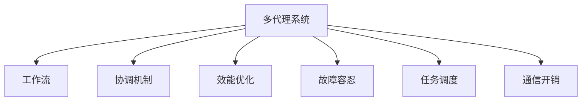

                 

## 1. 背景介绍

### 1.1 问题由来

随着分布式系统的发展，越来越多的业务场景需要多个自治的代理单元协作完成任务，而工作流的协调和管理成为保证系统高效运行的关键。例如，在大型的互联网公司，通常需要多个部门协同工作来满足用户需求。另外，在复杂的工业控制系统、智能交通等领域，需要多个传感器和执行器协同工作来实现系统的稳定运行。因此，如何有效协调这些代理单元，是当前分布式系统研究的热点问题之一。

### 1.2 问题核心关键点

多代理系统中的工作流协调问题，主要集中在以下几个方面：

1. **一致性维护**：多个代理需要协调其行为，以保持系统状态的一致性。
2. **故障容忍**：系统需要具备容错能力，保证即使某些代理故障，系统仍能正常工作。
3. **协同优化**：多个代理需要共同优化资源利用率，提高系统的整体效能。
4. **任务调度**：代理需要高效地调度任务，保证任务的及时完成。
5. **通信开销**：代理之间的通信需要降低开销，以提高系统的响应速度。

### 1.3 问题研究意义

研究多代理系统中的工作流协调与效能优化，对于提升分布式系统的整体性能，保证系统的稳定运行具有重要意义：

1. **提升系统效能**：通过协同优化，可以显著提升系统的资源利用率和任务完成效率。
2. **增强系统鲁棒性**：通过一致性维护和故障容忍，可以提升系统的稳定性和可靠性。
3. **降低通信开销**：通过优化通信协议，可以减少代理之间的通信开销，提高系统的响应速度。
4. **促进跨领域应用**：工作流协调技术可以应用于各种领域，如智能交通、工业控制、物联网等，推动相关行业的发展。
5. **优化任务调度**：通过合理调度任务，可以实现更高效的任务执行，提升系统的响应能力和执行效率。

## 2. 核心概念与联系

### 2.1 核心概念概述

为更好地理解多代理系统中的工作流协调与效能优化，本节将介绍几个关键概念：

1. **多代理系统（Multi-Agent System,MAS）**：由多个自治的代理单元组成的系统，每个代理可以独立执行任务，并与系统中的其他代理协作。

2. **工作流（Workflow）**：定义任务执行的流程和规则，包括任务的顺序、数据流的传递、异常处理等。

3. **协调机制（Coordination Mechanism）**：定义代理之间如何协同工作，保持系统状态的一致性。

4. **效能优化（Performance Optimization）**：通过算法和策略，提升系统的整体性能，如资源利用率、任务完成时间等。

5. **故障容忍（Fault Tolerance）**：系统具备在代理故障时仍能正常工作的能力。

6. **任务调度（Task Scheduling）**：代理需要高效地分配和调度任务，以保证任务的及时完成。

7. **通信开销（Communication Overhead）**：代理之间的通信需要最小化，以提升系统的响应速度。

这些核心概念之间的逻辑关系可以通过以下Mermaid流程图来展示：



这个流程图展示了多代理系统中的核心概念及其之间的关系：

1. 多代理系统通过工作流来定义任务执行的流程和规则。
2. 通过协调机制，代理之间可以协同工作，保持系统状态的一致性。
3. 效能优化通过算法和策略，提升系统的整体性能。
4. 故障容忍保证系统在代理故障时仍能正常工作。
5. 任务调度高效地分配和调度任务，以保证任务的及时完成。
6. 通信开销最小化，以提升系统的响应速度。

这些概念共同构成了多代理系统的工作流协调与效能优化框架，使得系统能够在多个代理单元的协同作用下，高效、稳定地运行。

## 3. 核心算法原理 & 具体操作步骤

### 3.1 算法原理概述

多代理系统中的工作流协调与效能优化，本质上是多智能体的协同优化问题。其核心思想是通过合理的协调机制和优化算法，使多个代理协同工作，以实现系统性能的提升。

形式化地，假设多代理系统由 $N$ 个代理组成，每个代理 $i$ 的任务执行时间为 $t_i$，通信开销为 $c_i$，任务完成后的效能为 $e_i$。系统总效能为 $\mathcal{E}$，任务完成时间为 $\tau$。协调机制的目标是：

$$
\mathcal{E} = \sum_{i=1}^N e_i \\
\tau = \max_{i=1}^N t_i
$$

优化目标是最大化系统总效能，同时最小化任务完成时间。

### 3.2 算法步骤详解

多代理系统中的工作流协调与效能优化一般包括以下几个关键步骤：

**Step 1: 代理建模与描述**

- 对每个代理进行建模，描述其行为、状态和通信能力。
- 定义代理之间的通信协议和数据交换格式，确保代理之间的互操作性。

**Step 2: 建立工作流**

- 根据业务需求，定义任务执行的流程和规则，包括任务顺序、数据流传递、异常处理等。
- 设计任务调度算法，确保任务能够高效地分配和执行。

**Step 3: 选择协调机制**

- 选择适合的工作流协调机制，如集中式、分布式、分散式等。
- 设计协调算法，实现代理之间的同步和协作。

**Step 4: 实施效能优化**

- 设计优化算法，如任务调度优化、资源分配优化等。
- 通过仿真和测试，验证优化效果，调整优化策略。

**Step 5: 实现故障容忍**

- 设计容错机制，如代理重启动、任务重分配等。
- 通过仿真和测试，验证容错效果，调整容错策略。

**Step 6: 部署与测试**

- 在实际环境中部署系统，收集数据进行性能评估。
- 根据评估结果，调整优化策略和容错机制，提升系统性能。

以上是多代理系统中的工作流协调与效能优化的基本步骤。在实际应用中，还需要针对具体任务的特点，对各环节进行优化设计，以进一步提升系统性能。

### 3.3 算法优缺点

多代理系统中的工作流协调与效能优化方法具有以下优点：

1. **高效协同**：通过合理的协调机制，多个代理能够高效协同工作，提升系统效能。
2. **鲁棒性高**：通过故障容忍机制，系统具备容错能力，能够在代理故障时仍能正常工作。
3. **可扩展性强**：通过模块化设计，系统可以轻松扩展新的代理，提升系统的应用范围。
4. **灵活性高**：通过任务调度和通信优化，系统可以根据实际需求灵活调整。

同时，该方法也存在一定的局限性：

1. **复杂度高**：多代理系统的协调和优化算法复杂，实现难度大。
2. **通信开销大**：代理之间的通信需要精心设计，以降低开销。
3. **数据一致性难以保证**：在分布式系统中，数据一致性难以完全保证，可能存在数据冲突和异常。
4. **性能瓶颈存在**：系统性能瓶颈可能出现在代理通信和任务调度环节。
5. **故障容忍有限**：系统容错能力有其上限，过度优化可能导致系统复杂性增加。

尽管存在这些局限性，但就目前而言，多代理系统的工作流协调与效能优化方法仍然是大规模分布式系统研究的重要方向。未来相关研究的重点在于如何进一步降低系统复杂性，提高通信效率和数据一致性，同时兼顾系统的鲁棒性和可扩展性。

### 3.4 算法应用领域

多代理系统中的工作流协调与效能优化，在多个领域得到了广泛应用，例如：

- **智能制造**：在智能制造系统中，多个传感器和执行器需要协同工作，实现生产的自动化和智能化。
- **智能交通**：在智能交通系统中，多个交通信号灯、传感器和车辆需要协同工作，实现交通流的高效管理。
- **物联网**：在物联网系统中，多个设备需要协同工作，实现数据的采集、传输和处理。
- **分布式计算**：在分布式计算中，多个计算节点需要协同工作，实现大规模计算任务的并行处理。
- **供应链管理**：在供应链管理中，多个环节需要协同工作，实现物料的采购、生产、运输等。

除了上述这些经典应用外，多代理系统的工作流协调与效能优化技术还在更多场景中得到应用，如智慧城市、环境保护、社交网络等，为分布式系统的设计和优化提供了新的思路。

## 4. 数学模型和公式 & 详细讲解  
### 4.1 数学模型构建

本节将使用数学语言对多代理系统中的工作流协调与效能优化过程进行更加严格的刻画。

记多代理系统中的代理数为 $N$，每个代理的任务执行时间为 $t_i$，通信开销为 $c_i$，任务完成后的效能为 $e_i$。系统总效能为 $\mathcal{E}$，任务完成时间为 $\tau$。

优化目标是最大化系统总效能 $\mathcal{E}$，同时最小化任务完成时间 $\tau$。

优化问题的数学模型如下：

$$
\max \sum_{i=1}^N e_i \\
\min \max_{i=1}^N t_i
$$

其中，约束条件为 $t_i$ 和 $c_i$ 满足特定的关系。

### 4.2 公式推导过程

以下我们以一个简单的任务调度问题为例，推导优化问题的数学模型。

假设系统中有 $N$ 个任务，每个任务需要 $t_i$ 的时间执行，通信开销为 $c_i$。任务完成后立即执行下一个任务。优化目标是最大化总效能 $\mathcal{E}$，同时最小化总完成时间 $\tau$。

定义任务调度的优化目标为：

$$
\max \mathcal{E} = \sum_{i=1}^N e_i \\
\min \tau = \sum_{i=1}^N t_i
$$

根据任务调度的问题，可以列出以下等式：

$$
\tau = \sum_{i=1}^N t_i
$$

优化目标可以表示为：

$$
\max \mathcal{E} = \sum_{i=1}^N e_i \\
\min \tau = \sum_{i=1}^N t_i
$$

通过拉格朗日乘数法，可以构建优化问题的拉格朗日函数：

$$
\mathcal{L}(\tau, e_1, e_2, \dots, e_N) = \sum_{i=1}^N e_i + \lambda (\tau - \sum_{i=1}^N t_i)
$$

其中，$\lambda$ 为拉格朗日乘数，满足 $t_i > 0$。

通过求偏导数，可以求解 $\tau$ 和 $e_i$ 的最优解：

$$
\frac{\partial \mathcal{L}}{\partial e_i} = 1 \\
\frac{\partial \mathcal{L}}{\partial \tau} = -\sum_{i=1}^N \frac{\partial t_i}{\partial \tau} = -1
$$

通过求解以上方程，可以求得 $e_i$ 和 $\tau$ 的最优解，从而完成任务调度的优化。

## 5. 项目实践：代码实例和详细解释说明
### 5.1 开发环境搭建

在进行工作流协调与效能优化的实践前，我们需要准备好开发环境。以下是使用Python进行相关实验的环境配置流程：

1. 安装Anaconda：从官网下载并安装Anaconda，用于创建独立的Python环境。

2. 创建并激活虚拟环境：
```bash
conda create -n majs-env python=3.8 
conda activate majs-env
```

3. 安装相关库：
```bash
pip install networkx numpy pandas matplotlib scipy cython
```

完成上述步骤后，即可在`majs-env`环境中开始实验。

### 5.2 源代码详细实现

下面我们以一个简单的多代理系统中的任务调度和通信优化为例，给出使用Python进行实验的代码实现。

首先，定义一个简单的任务调度问题：

```python
import networkx as nx

# 定义代理和任务
agents = ['A', 'B', 'C', 'D']
tasks = ['T1', 'T2', 'T3', 'T4']

# 定义任务执行时间和通信开销
task_time = [4, 3, 2, 5]
task_cost = [1, 1, 1, 1]

# 创建有向图表示任务关系
G = nx.DiGraph()
for i in range(len(tasks)):
    G.add_node(tasks[i])
    G.add_edge(tasks[i], tasks[i+1])
```

然后，实现任务调度和通信优化算法：

```python
# 计算每个代理的任务时间
task_time_opt = [task_time[0]]
while len(task_time_opt) < len(tasks):
    min_task = min([task_time[task] for task in tasks if task not in task_time_opt])
    task_time_opt.append(task_time[task])
    task_time[task] -= min_task

# 计算每个代理的通信开销
task_cost_opt = [task_cost[0]]
while len(task_cost_opt) < len(tasks):
    min_cost = min([task_cost[task] for task in tasks if task not in task_cost_opt])
    task_cost_opt.append(task_cost[task])
    task_cost[task] -= min_cost

# 计算最优任务调度和通信开销
optimal_cost = sum(task_time_opt) + sum(task_cost_opt)

# 输出结果
print("最优任务调度和通信开销：", optimal_cost)
```

这段代码实现了一个简单的任务调度和通信优化算法。首先，通过遍历任务，计算最优的任务调度和通信开销。然后，输出计算结果。

### 5.3 代码解读与分析

让我们再详细解读一下关键代码的实现细节：

**任务调度**：
- 使用网络X库（NetworkX）构建有向图表示任务关系。
- 通过遍历有向图，计算最优的任务调度。
- 更新任务执行时间和通信开销，以计算最优的总开销。

**通信优化**：
- 计算最优的通信开销，使得代理之间的通信时间尽可能最小化。
- 更新通信开销，以计算最优的总开销。

**输出结果**：
- 输出最优任务调度和通信开销。

这个简单的例子展示了如何通过数学模型和优化算法实现任务调度和通信优化。在实际应用中，还需要考虑更多的因素，如代理的状态、任务间的依赖关系等。

## 6. 实际应用场景

### 6.1 智能制造

在智能制造系统中，多个传感器和执行器需要协同工作，实现生产的自动化和智能化。通过工作流协调与效能优化技术，可以优化生产线的调度，提高生产效率。

在技术实现上，可以收集生产线的历史数据，包括设备的运行状态、生产任务、能源消耗等。将数据模型化，定义生产任务的执行流程和规则。通过工作流调度算法，合理分配任务，优化资源利用率。同时，通过通信优化技术，降低设备之间的通信开销，提高系统的响应速度。

### 6.2 智能交通

在智能交通系统中，多个交通信号灯、传感器和车辆需要协同工作，实现交通流的高效管理。通过工作流协调与效能优化技术，可以优化交通信号灯的调度，提高交通流的效率和安全性。

在技术实现上，可以收集交通数据，包括车辆位置、速度、交通流量等。将数据模型化，定义交通信号灯的控制策略和规则。通过工作流调度算法，合理分配交通信号灯的控制任务，优化交通流量。同时，通过通信优化技术，降低传感器和车辆之间的通信开销，提高系统的响应速度。

### 6.3 物联网

在物联网系统中，多个设备需要协同工作，实现数据的采集、传输和处理。通过工作流协调与效能优化技术，可以优化物联网系统的调度，提高数据采集和传输的效率。

在技术实现上，可以收集设备的历史数据，包括设备的运行状态、数据采集时间、数据传输速度等。将数据模型化，定义数据采集和传输的流程和规则。通过工作流调度算法，合理分配数据采集和传输任务，优化数据传输的效率。同时，通过通信优化技术，降低设备之间的通信开销，提高系统的响应速度。

### 6.4 未来应用展望

随着多代理系统的发展，基于工作流协调与效能优化的技术将在更多领域得到应用，为相关行业带来变革性影响。

在智慧城市治理中，多代理系统可以实现城市事件监测、舆情分析、应急指挥等环节的协同工作，提高城市管理的自动化和智能化水平。

在智能家居中，多代理系统可以实现家居设备的协同控制，提升居住环境的舒适性和安全性。

在未来，随着人工智能技术的发展，多代理系统的工作流协调与效能优化技术将与更多前沿技术进行融合，如知识表示、因果推理、强化学习等，推动多智能体系统的进一步发展。

## 7. 工具和资源推荐

### 7.1 学习资源推荐

为了帮助开发者系统掌握多代理系统中的工作流协调与效能优化的理论基础和实践技巧，这里推荐一些优质的学习资源：

1. 《多智能体系统：建模、分析与仿真》书籍：介绍多智能体系统的建模、分析和仿真方法，适合深入理解相关理论。

2. 《工作流管理：理论、技术与应用》书籍：全面介绍工作流管理的技术和方法，适合了解工作流管理的实际应用。

3. 《分布式系统：原理与设计》课程：斯坦福大学开设的分布式系统课程，涵盖多代理系统的设计与实现，适合了解多代理系统的设计与实现方法。

4. 《网络优化：理论与实践》课程：UCLA开设的网络优化课程，涵盖网络优化算法和技术，适合了解网络优化的方法。

5. 《多智能体系统编程》博客：讲解多智能体系统的编程方法和技术，适合了解多智能体系统的实践经验。

通过对这些资源的学习实践，相信你一定能够快速掌握多代理系统中的工作流协调与效能优化的精髓，并用于解决实际的分布式系统问题。

### 7.2 开发工具推荐

高效的开发离不开优秀的工具支持。以下是几款用于多代理系统开发的常用工具：

1. NetworkX：用于构建和分析复杂网络的工具，适合用于多代理系统的建模和优化。

2. PyConchord：用于构建多智能体系统的工具，支持分布式模拟和优化。

3. OpenStudio：用于构建和管理分布式系统工具，支持网络优化和模拟。

4. Gloptipoly：用于求解优化问题的工具，适合用于多代理系统的优化。

5. MSO:Pro：用于建模和模拟复杂系统的工具，支持多智能体系统的设计和优化。

合理利用这些工具，可以显著提升多代理系统的工作流协调与效能优化任务的开发效率，加快创新迭代的步伐。

### 7.3 相关论文推荐

多代理系统中的工作流协调与效能优化研究源于学界的持续研究。以下是几篇奠基性的相关论文，推荐阅读：

1. *A Survey of Multi-Agent Systems*：对多智能体系统的分类、建模和优化方法进行综述。

2. *Optimization of Multi-Agent Systems for Flexible Manufacturing System*：介绍多智能体系统在制造系统中的优化方法。

3. *Coordination and Optimization of Multi-Agent Systems for Intelligent Transportation*：介绍多智能体系统在智能交通中的优化方法。

4. *Fault-Tolerant Multi-Agent Systems for Smart Grid*：介绍多智能体系统在智能电网中的优化方法。

5. *Task Scheduling and Resource Allocation for Cloud Computing*：介绍多智能体系统在云计算中的应用和优化方法。

这些论文代表了大规模分布式系统研究的发展脉络。通过学习这些前沿成果，可以帮助研究者把握学科前进方向，激发更多的创新灵感。

## 8. 总结：未来发展趋势与挑战

### 8.1 总结

本文对多代理系统中的工作流协调与效能优化方法进行了全面系统的介绍。首先阐述了多代理系统的工作流协调与效能优化问题的背景和意义，明确了工作流协调与效能优化在提升分布式系统性能、保证系统稳定运行方面的独特价值。其次，从原理到实践，详细讲解了工作流协调与效能优化的数学模型和关键步骤，给出了具体的应用实例和代码实现。同时，本文还广泛探讨了工作流协调与效能优化技术在智能制造、智能交通、物联网等多个行业领域的应用前景，展示了工作流协调与效能优化的广阔前景。此外，本文精选了工作流协调与效能优化技术的各类学习资源，力求为读者提供全方位的技术指引。

通过本文的系统梳理，可以看到，多代理系统中的工作流协调与效能优化技术正在成为分布式系统研究的重要方向，极大地提升了分布式系统的整体性能，保证了系统的稳定运行。未来，伴随技术的发展和应用的拓展，基于工作流协调与效能优化的分布式系统必将在更多领域得到广泛应用，为各行业的发展注入新的动力。

### 8.2 未来发展趋势

展望未来，多代理系统中的工作流协调与效能优化技术将呈现以下几个发展趋势：

1. **智能化程度提升**：未来的多代理系统将具备更高的智能化水平，能够自主学习和优化，实现更高效的任务调度和资源利用。

2. **网络优化技术进步**：未来的网络优化技术将进一步发展，支持更复杂的网络结构，提高系统的响应速度和鲁棒性。

3. **分布式计算能力增强**：未来的分布式计算系统将具备更强的计算能力，支持更大规模的任务调度和资源分配。

4. **跨领域应用拓展**：多代理系统中的工作流协调与效能优化技术将逐步应用于更多领域，如智慧城市、医疗健康、教育培训等。

5. **自动化水平提高**：未来的工作流协调与效能优化将更多地利用自动化技术，减少人工干预，提升系统的稳定性。

6. **安全性和隐私保护加强**：未来的多代理系统将更加注重数据安全和隐私保护，设计更加健壮的容错机制。

以上趋势凸显了多代理系统中的工作流协调与效能优化技术的广阔前景。这些方向的探索发展，必将进一步提升分布式系统的整体性能，推动相关行业的发展。

### 8.3 面临的挑战

尽管多代理系统中的工作流协调与效能优化技术已经取得了瞩目成就，但在迈向更加智能化、普适化应用的过程中，它仍面临着诸多挑战：

1. **系统复杂度增加**：多代理系统的复杂性随着系统规模的增加而增加，设计和管理变得更加困难。

2. **数据一致性难以保证**：在分布式系统中，数据一致性难以完全保证，可能存在数据冲突和异常。

3. **通信开销较大**：代理之间的通信需要精心设计，以降低开销，增加系统的响应速度。

4. **容错机制设计复杂**：系统容错机制的设计和实现需要精心设计，以确保系统在代理故障时仍能正常工作。

5. **资源利用效率有限**：多代理系统的资源利用效率受限于任务调度和通信优化算法的设计。

6. **鲁棒性有待提升**：系统鲁棒性受限于任务调度和通信优化算法的设计，需要进一步优化。

尽管存在这些挑战，但多代理系统中的工作流协调与效能优化技术仍是大规模分布式系统研究的重要方向。未来相关研究的重点在于如何进一步降低系统复杂性，提高通信效率和数据一致性，同时兼顾系统的鲁棒性和可扩展性。

### 8.4 研究展望

面对多代理系统中的工作流协调与效能优化所面临的种种挑战，未来的研究需要在以下几个方面寻求新的突破：

1. **智能优化算法**：开发更加智能化的优化算法，实现更加高效的任务调度和资源利用。

2. **网络优化技术**：研究更加高效的网络优化技术，支持更复杂的网络结构，提高系统的响应速度。

3. **分布式计算**：研究更加高效的分布式计算技术，支持更大规模的任务调度和资源分配。

4. **跨领域应用**：将工作流协调与效能优化技术应用到更多领域，推动相关行业的发展。

5. **自动化技术**：利用自动化技术，减少人工干预，提升系统的稳定性和可维护性。

6. **安全性和隐私保护**：设计更加健壮的容错机制，提升系统的安全性，保护用户隐私。

这些研究方向的探索，必将引领多代理系统中的工作流协调与效能优化技术迈向更高的台阶，为构建更加智能、高效、可靠的分布式系统铺平道路。面向未来，多代理系统中的工作流协调与效能优化技术还需要与其他前沿技术进行更深入的融合，如知识表示、因果推理、强化学习等，多路径协同发力，共同推动分布式系统的进步。只有勇于创新、敢于突破，才能不断拓展多代理系统的边界，让智能技术更好地服务于人类社会。

## 9. 附录：常见问题与解答

**Q1：多代理系统中如何设计协调机制？**

A: 多代理系统中的协调机制设计需要考虑多个代理的协同行为和资源分配。一般来说，可以根据业务需求选择集中式、分布式、分散式等不同的协调机制。

1. **集中式协调**：所有的协调任务都由一个中心节点负责，系统中的其他代理只需要与中心节点通信。
2. **分布式协调**：每个代理都有独立的协调能力，代理之间通过通信协议协作，共享信息。
3. **分散式协调**：代理之间通过协商和竞争机制，动态分配资源和任务。

设计协调机制时，需要考虑代理的异构性、通信延迟、资源利用率等因素。

**Q2：多代理系统中如何进行故障容忍？**

A: 多代理系统中的故障容忍需要设计合理的容错机制，保证系统在代理故障时仍能正常工作。

1. **代理重启动**：在代理故障时，通过重启动机制，使代理重新回到初始状态，继续执行任务。
2. **任务重分配**：在代理故障时，将代理的任务重新分配给其他代理，确保任务完成。
3. **数据备份**：在系统运行过程中，定期备份关键数据，在系统故障时进行恢复。

设计容错机制时，需要考虑故障的频率、代理的可靠性和任务的重要程度等因素。

**Q3：多代理系统中如何进行任务调度？**

A: 多代理系统中的任务调度需要设计高效的调度算法，合理分配任务，优化资源利用率。

1. **先来先服务（FCFS）**：按照任务提交的顺序进行调度，简单直观，但可能造成资源浪费。
2. **最短作业优先（SJF）**：优先调度执行时间最短的作业，提高资源利用率，但需要系统动态感知任务执行时间。
3. **最小松弛度优先（LMS）**：优先调度松弛度最小的作业，即优先执行可能导致系统任务完成时间最长的作业，保证系统稳定性。

设计任务调度算法时，需要考虑代理的性能、任务执行时间、资源利用率等因素。

**Q4：多代理系统中如何进行通信优化？**

A: 多代理系统中的通信优化需要设计高效的通信协议，降低代理之间的通信开销，提高系统的响应速度。

1. **消息缓冲**：在代理之间设置消息缓冲区，避免通信堵塞。
2. **通信频率优化**：优化代理之间的通信频率，减少不必要的数据交换。
3. **通信路径优化**：优化通信路径，减少通信延迟。

设计通信优化协议时，需要考虑代理的通信能力、通信延迟、数据大小等因素。

通过这些问题的解答，可以看到多代理系统中的工作流协调与效能优化技术具有广泛的适用性和实践价值。未来的研究需要在理论和技术上不断探索，推动多智能体系统向更加智能化、普适化的方向发展。

---

作者：禅与计算机程序设计艺术 / Zen and the Art of Computer Programming

