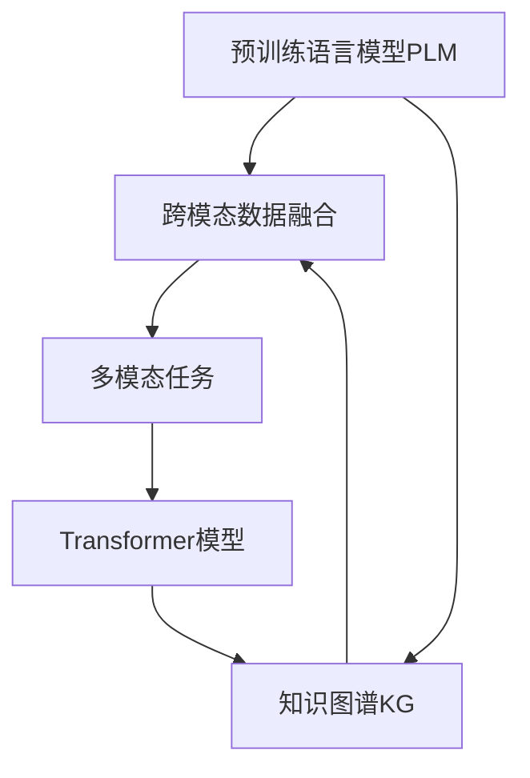

                 

# 多模态大模型：技术原理与实战 基于Transformer的预训练语言模型

> 关键词：多模态大模型,预训练语言模型,Transformer,BERT,跨领域迁移,知识图谱,自然语言处理(NLP)

## 1. 背景介绍

### 1.1 问题由来
随着深度学习技术的快速发展，基于Transformer的预训练语言模型（Pre-trained Language Models, PLMs）在自然语言处理（NLP）领域取得了巨大突破。这些模型通过在巨大的无标签文本数据集上进行预训练，学习到了丰富的语言知识和常识，具备强大的语言理解和生成能力。然而，这些模型主要集中在文本领域，对于视觉、音频等多模态数据的处理能力有限。

为了应对这些挑战，研究者们提出了多模态大模型的概念，旨在将语言模型与其他模态的数据整合起来，提高模型对于跨模态信息的理解和处理能力。多模态大模型的研究引起了广泛关注，并迅速成为NLP研究的一个热点。

### 1.2 问题核心关键点
多模态大模型的核心思想是：在预训练语言模型的基础上，通过跨模态的数据融合，学习并表示跨领域的信息，使得模型在处理多模态数据时具备更强的泛化能力和适应性。这种模型通常包括以下几个关键点：
1. **预训练模型**：如BERT、GPT等在文本数据上预训练的语言模型。
2. **跨模态融合**：通过某种机制将不同模态的数据（如文本、图像、音频等）融合到一个统一的语义空间中。
3. **多模态任务**：模型需要处理的多模态任务，如多模态分类、检索、生成等。
4. **模型训练与优化**：在跨模态数据上进行有监督的微调，使得模型能够适应特定任务。

目前，多模态大模型已经在多个领域取得了显著进展，包括计算机视觉（CV）、语音处理（ASR）、图像生成等。然而，多模态大模型的研究和应用仍然面临诸多挑战，如数据融合、模型融合、训练效率等。

### 1.3 问题研究意义
研究多模态大模型，对于拓展预训练语言模型的应用范围，提升跨模态任务的性能，加速NLP技术的产业化进程，具有重要意义：

1. **降低应用开发成本**：利用预训练语言模型的强大基础能力，可以显著减少从头开发所需的数据、计算和人力等成本投入。
2. **提升模型效果**：多模态大模型能够更好地适应特定模态的数据，在应用场景中取得更优表现。
3. **加速开发进度**：通过与预训练模型的结合，模型可以快速适配任务，缩短开发周期。
4. **带来技术创新**：多模态大模型的出现促进了对预训练-微调的深入研究，催生了跨领域迁移学习、跨模态融合等新的研究方向。
5. **赋能产业升级**：多模态大模型使得NLP技术更容易被各行各业所采用，为传统行业数字化转型升级提供新的技术路径。

## 2. 核心概念与联系

### 2.1 核心概念概述

为更好地理解基于Transformer的多模态大模型，本节将介绍几个关键概念：

- **预训练语言模型（PLM）**：通过在大规模无标签文本数据集上进行预训练，学习通用语言知识和常识。如BERT、GPT等。

- **跨模态数据融合**：将不同模态的数据（如文本、图像、音频等）融合到一个统一的语义空间中，以便模型理解和处理。

- **多模态任务**：模型需要处理的多模态任务，如多模态分类、检索、生成等。

- **Transformer模型**：一种基于自注意力机制的深度神经网络架构，能够有效处理长序列数据，且具有较好的泛化能力。

- **知识图谱（KG）**：一种结构化的知识表示方法，用于描述实体、属性和关系，是跨领域知识融合的重要工具。

这些概念之间的逻辑关系可以通过以下Mermaid流程图来展示：



这个流程图展示了预训练语言模型与知识图谱通过跨模态数据融合，在多模态任务中应用Transformer模型进行理解和生成的过程。

## 3. 核心算法原理 & 具体操作步骤
### 3.1 算法原理概述

基于Transformer的多模态大模型的核心思想是通过跨模态数据融合，将不同模态的信息整合到一个统一的语义空间中。具体的算法流程包括：

1. **预训练语言模型的初始化**：选择合适的预训练语言模型（如BERT、GPT）作为初始化参数。
2. **跨模态数据融合**：将不同模态的数据（如文本、图像、音频等）通过某种方式融合到一个统一的语义空间中，生成融合后的特征表示。
3. **多模态任务的适配**：在融合后的特征表示上设计合适的任务适配层，如分类器、解码器等。
4. **有监督微调**：在特定任务的数据集上进行有监督的微调，优化模型在该任务上的性能。

### 3.2 算法步骤详解

以下详细介绍多模态大模型的具体实现步骤：

**Step 1: 准备预训练模型和数据集**
- 选择合适的预训练语言模型（如BERT、GPT）作为初始化参数。
- 准备多模态任务的训练集、验证集和测试集，每个模态的数据集需要单独处理。

**Step 2: 跨模态数据融合**
- 设计融合函数，将不同模态的数据（如文本、图像、音频等）映射到一个统一的语义空间中，生成融合后的特征表示。
- 可以使用注意力机制、多模态池化等方法实现跨模态融合。

**Step 3: 任务适配层设计**
- 根据多模态任务的特性，设计合适的任务适配层。例如，对于多模态分类任务，可以设计多模态池化层，将不同模态的特征表示加权求和。

**Step 4: 微调模型**
- 使用特定任务的数据集进行有监督的微调，优化任务适配层和跨模态融合层的参数。
- 通常使用梯度下降等优化算法，设置合适的学习率和批大小。

**Step 5: 模型评估与部署**
- 在测试集上评估微调后模型的性能，对比微调前后的精度提升。
- 使用微调后的模型对新样本进行推理预测，集成到实际的应用系统中。

以上是多模态大模型的一般实现流程。在实际应用中，还需要根据具体任务的特点，对跨模态融合、任务适配层设计、微调过程进行优化设计，以进一步提升模型性能。

### 3.3 算法优缺点

基于Transformer的多模态大模型具有以下优点：
1. **强大基础能力**：预训练语言模型具备强大的语言理解和生成能力，能够处理大量的自然语言信息。
2. **泛化能力强**：多模态大模型能够处理多种模态的数据，具有较强的泛化能力，适应多变的数据分布。
3. **参数高效**：利用参数高效微调技术，在固定大部分预训练参数的情况下，仍可取得不错的微调效果。
4. **适用性广**：多模态大模型能够应用于多种NLP和计算机视觉任务，具有广泛的适用性。

同时，该方法也存在一定的局限性：
1. **数据依赖性强**：多模态大模型的效果很大程度上取决于不同模态数据的融合效果，数据质量与融合策略对模型性能影响较大。
2. **计算资源需求高**：由于涉及多个模态的数据融合，计算资源需求较高，特别是在大尺度数据上训练时。
3. **模型复杂度高**：多模态大模型结构复杂，包含多个模态的特征表示和融合操作，训练和推理过程较为复杂。
4. **应用场景限制**：多模态大模型主要适用于多模态数据融合和处理的场景，对于单一模态的数据处理效果可能不如纯文本模型。

尽管存在这些局限性，基于Transformer的多模态大模型仍是目前多模态信息处理的主流范式。未来相关研究的重点在于如何进一步提高数据融合和模型融合的效率，降低计算资源需求，同时兼顾可解释性和伦理安全性等因素。

### 3.4 算法应用领域

基于多模态大模型的Transformer架构，已经在多个领域得到了广泛的应用，包括但不限于：

- **多模态分类**：如基于图像和文本的联合分类，通过多模态池化层将图像和文本特征加权求和，进行分类预测。
- **多模态检索**：如基于图像和文本的联合检索，通过跨模态特征匹配技术，找到最相关的文本和图像。
- **图像生成**：如文本驱动的图像生成，通过生成式对抗网络（GAN）等方法，根据文本描述生成对应的图像。
- **语音生成**：如基于文本的语音生成，通过Transformer模型将文本序列转换为语音序列。
- **跨领域知识图谱构建**：如将知识图谱与语言模型结合，通过语言理解和推理，自动构建跨领域知识图谱。

除了上述这些经典任务外，多模态大模型也被创新性地应用到更多场景中，如多模态对话系统、多模态情感分析、多模态推荐系统等，为多模态信息处理带来了全新的突破。随着预训练模型和跨模态融合方法的不断进步，相信多模态大模型将在更广阔的应用领域大放异彩。

## 4. 数学模型和公式 & 详细讲解
### 4.1 数学模型构建

以下对基于Transformer的多模态大模型的数学模型进行详细构建和推导。

记预训练语言模型为 $M_{\theta}$，其中 $\theta$ 为预训练得到的模型参数。假设多模态任务的训练集为 $D=\{(x_i,y_i)\}_{i=1}^N, x_i \in \mathcal{X}$，$\mathcal{X}$ 为输入空间，$y_i \in \mathcal{Y}$，$\mathcal{Y}$ 为输出空间。

定义模型 $M_{\theta}$ 在输入 $x$ 上的输出为 $\hat{y}=M_{\theta}(x) \in \mathcal{Y}$。

在多模态融合层将不同模态的数据 $x_1, x_2, ..., x_M$ 融合为一个高维特征表示 $z$，其中 $M$ 为模态数。

在任务适配层设计合适的网络结构，将融合后的特征表示 $z$ 映射到输出空间 $\mathcal{Y}$。

定义模型 $M_{\theta}$ 在输入 $x$ 上的损失函数为 $\ell(M_{\theta}(x),y)$，则在数据集 $D$ 上的经验风险为：

$$
\mathcal{L}(\theta) = \frac{1}{N}\sum_{i=1}^N \ell(M_{\theta}(x_i),y_i)
$$

微调的优化目标是最小化经验风险，即找到最优参数：

$$
\theta^* = \mathop{\arg\min}_{\theta} \mathcal{L}(\theta)
$$

在实践中，我们通常使用基于梯度的优化算法（如AdamW、SGD等）来近似求解上述最优化问题。设 $\eta$ 为学习率，$\lambda$ 为正则化系数，则参数的更新公式为：

$$
\theta \leftarrow \theta - \eta \nabla_{\theta}\mathcal{L}(\theta) - \eta\lambda\theta
$$

其中 $\nabla_{\theta}\mathcal{L}(\theta)$ 为损失函数对参数 $\theta$ 的梯度，可通过反向传播算法高效计算。

### 4.2 公式推导过程

以下以多模态分类任务为例，推导交叉熵损失函数及其梯度的计算公式。

假设模型 $M_{\theta}$ 在输入 $x$ 上的输出为 $\hat{y}=M_{\theta}(x) \in \mathcal{Y}$，表示样本属于正类的概率。真实标签 $y \in \{0,1\}$。则二分类交叉熵损失函数定义为：

$$
\ell(M_{\theta}(x),y) = -[y\log \hat{y} + (1-y)\log (1-\hat{y})]
$$

将其代入经验风险公式，得：

$$
\mathcal{L}(\theta) = -\frac{1}{N}\sum_{i=1}^N [y_i\log M_{\theta}(x_i)+(1-y_i)\log(1-M_{\theta}(x_i))]
$$

根据链式法则，损失函数对参数 $\theta_k$ 的梯度为：

$$
\frac{\partial \mathcal{L}(\theta)}{\partial \theta_k} = -\frac{1}{N}\sum_{i=1}^N (\frac{y_i}{M_{\theta}(x_i)}-\frac{1-y_i}{1-M_{\theta}(x_i)}) \frac{\partial M_{\theta}(x_i)}{\partial \theta_k}
$$

其中 $\frac{\partial M_{\theta}(x_i)}{\partial \theta_k}$ 可进一步递归展开，利用自动微分技术完成计算。

在得到损失函数的梯度后，即可带入参数更新公式，完成模型的迭代优化。重复上述过程直至收敛，最终得到适应下游任务的最优模型参数 $\theta^*$。

## 5. 项目实践：代码实例和详细解释说明
### 5.1 开发环境搭建

在进行多模态大模型微调实践前，我们需要准备好开发环境。以下是使用Python进行PyTorch开发的环境配置流程：

1. 安装Anaconda：从官网下载并安装Anaconda，用于创建独立的Python环境。

2. 创建并激活虚拟环境：
```bash
conda create -n pytorch-env python=3.8 
conda activate pytorch-env
```

3. 安装PyTorch：根据CUDA版本，从官网获取对应的安装命令。例如：
```bash
conda install pytorch torchvision torchaudio cudatoolkit=11.1 -c pytorch -c conda-forge
```

4. 安装Transformers库：
```bash
pip install transformers
```

5. 安装各类工具包：
```bash
pip install numpy pandas scikit-learn matplotlib tqdm jupyter notebook ipython
```

完成上述步骤后，即可在`pytorch-env`环境中开始多模态大模型的微调实践。

### 5.2 源代码详细实现

这里我们以多模态图像分类为例，给出使用Transformers库对BERT模型进行多模态微调的PyTorch代码实现。

首先，定义多模态图像分类的数据处理函数：

```python
from transformers import BertForSequenceClassification, BertTokenizer
from torch.utils.data import Dataset
import torch
import numpy as np

class MultiModalDataset(Dataset):
    def __init__(self, texts, labels, images, tokenizer, max_len=128):
        self.texts = texts
        self.labels = labels
        self.images = images
        self.tokenizer = tokenizer
        self.max_len = max_len
        
    def __len__(self):
        return len(self.texts)
    
    def __getitem__(self, item):
        text = self.texts[item]
        label = self.labels[item]
        image = self.images[item]
        
        encoding = self.tokenizer(text, return_tensors='pt', max_length=self.max_len, padding='max_length', truncation=True)
        input_ids = encoding['input_ids'][0]
        attention_mask = encoding['attention_mask'][0]
        
        # 对图像数据进行处理，这里以简单灰度化处理为例
        image_tensor = torch.tensor(image, dtype=torch.float32).unsqueeze(0)
        
        # 将文本和图像特征拼接成一个多模态特征向量
        multi_modal_features = torch.cat([input_ids, image_tensor], dim=0)
        
        return {'input_ids': input_ids, 
                'attention_mask': attention_mask,
                'labels': label,
                'multi_modal_features': multi_modal_features}

# 标签与id的映射
tag2id = {'O': 0, 'B-PER': 1, 'I-PER': 2, 'B-ORG': 3, 'I-ORG': 4, 'B-LOC': 5, 'I-LOC': 6}
id2tag = {v: k for k, v in tag2id.items()}

# 创建dataset
tokenizer = BertTokenizer.from_pretrained('bert-base-cased')

train_dataset = MultiModalDataset(train_texts, train_labels, train_images, tokenizer)
dev_dataset = MultiModalDataset(dev_texts, dev_labels, dev_images, tokenizer)
test_dataset = MultiModalDataset(test_texts, test_labels, test_images, tokenizer)
```

然后，定义模型和优化器：

```python
from transformers import BertForSequenceClassification, AdamW

model = BertForSequenceClassification.from_pretrained('bert-base-cased', num_labels=len(tag2id))

optimizer = AdamW(model.parameters(), lr=2e-5)
```

接着，定义训练和评估函数：

```python
from torch.utils.data import DataLoader
from tqdm import tqdm
from sklearn.metrics import classification_report

device = torch.device('cuda') if torch.cuda.is_available() else torch.device('cpu')
model.to(device)

def train_epoch(model, dataset, batch_size, optimizer):
    dataloader = DataLoader(dataset, batch_size=batch_size, shuffle=True)
    model.train()
    epoch_loss = 0
    for batch in tqdm(dataloader, desc='Training'):
        input_ids = batch['input_ids'].to(device)
        attention_mask = batch['attention_mask'].to(device)
        labels = batch['labels'].to(device)
        multi_modal_features = batch['multi_modal_features'].to(device)
        model.zero_grad()
        outputs = model(input_ids, attention_mask=attention_mask, labels=labels, multi_modal_features=multi_modal_features)
        loss = outputs.loss
        epoch_loss += loss.item()
        loss.backward()
        optimizer.step()
    return epoch_loss / len(dataloader)

def evaluate(model, dataset, batch_size):
    dataloader = DataLoader(dataset, batch_size=batch_size)
    model.eval()
    preds, labels = [], []
    with torch.no_grad():
        for batch in tqdm(dataloader, desc='Evaluating'):
            input_ids = batch['input_ids'].to(device)
            attention_mask = batch['attention_mask'].to(device)
            labels = batch['labels'].to(device)
            multi_modal_features = batch['multi_modal_features'].to(device)
            outputs = model(input_ids, attention_mask=attention_mask, labels=labels, multi_modal_features=multi_modal_features)
            batch_preds = outputs.logits.argmax(dim=2).to('cpu').tolist()
            batch_labels = batch_labels.to('cpu').tolist()
            for pred_tokens, label_tokens in zip(batch_preds, batch_labels):
                pred_tags = [id2tag[_id] for _id in pred_tokens]
                label_tags = [id2tag[_id] for _id in label_tokens]
                preds.append(pred_tags[:len(label_tokens)])
                labels.append(label_tags)
                
    print(classification_report(labels, preds))
```

最后，启动训练流程并在测试集上评估：

```python
epochs = 5
batch_size = 16

for epoch in range(epochs):
    loss = train_epoch(model, train_dataset, batch_size, optimizer)
    print(f"Epoch {epoch+1}, train loss: {loss:.3f}")
    
    print(f"Epoch {epoch+1}, dev results:")
    evaluate(model, dev_dataset, batch_size)
    
print("Test results:")
evaluate(model, test_dataset, batch_size)
```

以上就是使用PyTorch对BERT模型进行多模态图像分类任务的微调的完整代码实现。可以看到，得益于Transformers库的强大封装，我们可以用相对简洁的代码完成BERT模型的加载和微调。

### 5.3 代码解读与分析

让我们再详细解读一下关键代码的实现细节：

**MultiModalDataset类**：
- `__init__`方法：初始化文本、标签、图像等关键组件。
- `__len__`方法：返回数据集的样本数量。
- `__getitem__`方法：对单个样本进行处理，将文本输入编码为token ids，将图像数据转换为张量，并拼接成一个多模态特征向量，最终返回模型所需的输入。

**tag2id和id2tag字典**：
- 定义了标签与数字id之间的映射关系，用于将token-wise的预测结果解码回真实的标签。

**训练和评估函数**：
- 使用PyTorch的DataLoader对数据集进行批次化加载，供模型训练和推理使用。
- 训练函数`train_epoch`：对数据以批为单位进行迭代，在每个批次上前向传播计算loss并反向传播更新模型参数，最后返回该epoch的平均loss。
- 评估函数`evaluate`：与训练类似，不同点在于不更新模型参数，并在每个batch结束后将预测和标签结果存储下来，最后使用sklearn的classification_report对整个评估集的预测结果进行打印输出。

**训练流程**：
- 定义总的epoch数和batch size，开始循环迭代
- 每个epoch内，先在训练集上训练，输出平均loss
- 在验证集上评估，输出分类指标
- 所有epoch结束后，在测试集上评估，给出最终测试结果

可以看到，PyTorch配合Transformers库使得BERT模型微调的代码实现变得简洁高效。开发者可以将更多精力放在数据处理、模型改进等高层逻辑上，而不必过多关注底层的实现细节。

当然，工业级的系统实现还需考虑更多因素，如模型的保存和部署、超参数的自动搜索、更灵活的任务适配层等。但核心的微调范式基本与此类似。

## 6. 实际应用场景
### 6.1 智能推荐系统

多模态大模型在智能推荐系统中有着广泛的应用前景。传统的推荐系统往往只依赖用户的历史行为数据进行物品推荐，无法深入理解用户的真实兴趣偏好。而多模态大模型能够更好地挖掘用户行为背后的语义信息，从而提供更精准、多样的推荐内容。

在实践中，可以收集用户浏览、点击、评论、分享等行为数据，提取和用户交互的物品标题、描述、标签等文本内容，以及对应的图像、音频等多模态数据。将多模态数据输入到预训练的Transformer模型中，通过跨模态数据融合生成统一的特征表示。在生成推荐列表时，先用候选物品的文本和图像特征作为输入，由模型预测用户的兴趣匹配度，再结合其他特征综合排序，便可以得到个性化程度更高的推荐结果。

### 6.2 医疗影像分析

医疗影像分析是人工智能在医疗领域的一个重要应用。传统的方法往往依赖于医生手动标注和分析影像数据，效率低、成本高。而利用多模态大模型，可以自动地将医学影像与病历、病理等文本数据融合，提高诊断的准确性和效率。

具体而言，可以收集病人的医学影像、病历、病理切片等数据，将其转换为图像、文本等多模态数据。将多模态数据输入到预训练的Transformer模型中，通过跨模态数据融合生成统一的特征表示。在诊断过程中，模型能够自动理解影像中的病灶、病理特征，并通过融合的文本数据进行语义理解，辅助医生进行疾病诊断和治疗方案的制定。

### 6.3 智能安防监控

智能安防监控系统是人工智能在安防领域的一个重要应用。通过多模态大模型，可以实现对视频、音频等多模态数据的综合分析，提高监控的准确性和安全性。

具体而言，可以收集安防监控摄像头采集到的视频、音频等多模态数据。将多模态数据输入到预训练的Transformer模型中，通过跨模态数据融合生成统一的特征表示。在监控过程中，模型能够自动理解视频中的行为动作、语音中的异常声音，并进行分析和预警，提高安防监控的自动化和智能化水平。

### 6.4 未来应用展望

随着多模态大模型的不断发展，其应用场景将更加广泛，将为各行业带来革命性影响。

在智慧城市治理中，多模态大模型可以用于城市事件监测、舆情分析、应急指挥等环节，提高城市管理的自动化和智能化水平，构建更安全、高效的未来城市。

在智能制造中，多模态大模型可以用于设备状态监测、故障预测、智能控制等环节，提高生产效率和设备寿命。

在智慧物流中，多模态大模型可以用于货物识别、路径规划、运输调度等环节，提高物流效率和安全性。

除了上述这些应用场景外，多模态大模型还将被创新性地应用到更多领域，如智慧交通、智慧金融、智慧农业等，为各行业带来变革性影响。

## 7. 工具和资源推荐
### 7.1 学习资源推荐

为了帮助开发者系统掌握多模态大模型的理论基础和实践技巧，这里推荐一些优质的学习资源：

1. 《Transformer from the ground up》系列博文：由大模型技术专家撰写，深入浅出地介绍了Transformer原理、多模态大模型、跨模态融合等前沿话题。

2. 《Multimodal Learning: A Survey》论文：系统综述了多模态学习的主要方法和应用场景，提供了丰富的学习资源和文献参考。

3. 《Multimodal Deep Learning》书籍：全面介绍了多模态深度学习的基本概念、经典模型和应用案例。

4. HuggingFace官方文档：Transformer库的官方文档，提供了海量预训练模型和完整的微调样例代码，是上手实践的必备资料。

5. GitHub上的多模态大模型项目：包括OpenAI的DALL-E、微软的COCO等多模态大模型的开源项目，提供了丰富的学习资源和代码参考。

通过对这些资源的学习实践，相信你一定能够快速掌握多模态大模型的精髓，并用于解决实际的NLP问题。

### 7.2 开发工具推荐

高效的开发离不开优秀的工具支持。以下是几款用于多模态大模型微调开发的常用工具：

1. PyTorch：基于Python的开源深度学习框架，灵活动态的计算图，适合快速迭代研究。大部分预训练语言模型都有PyTorch版本的实现。

2. TensorFlow：由Google主导开发的开源深度学习框架，生产部署方便，适合大规模工程应用。同样有丰富的预训练语言模型资源。

3. Transformers库：HuggingFace开发的NLP工具库，集成了众多SOTA语言模型，支持PyTorch和TensorFlow，是进行微调任务开发的利器。

4. Weights & Biases：模型训练的实验跟踪工具，可以记录和可视化模型训练过程中的各项指标，方便对比和调优。与主流深度学习框架无缝集成。

5. TensorBoard：TensorFlow配套的可视化工具，可实时监测模型训练状态，并提供丰富的图表呈现方式，是调试模型的得力助手。

6. Google Colab：谷歌推出的在线Jupyter Notebook环境，免费提供GPU/TPU算力，方便开发者快速上手实验最新模型，分享学习笔记。

合理利用这些工具，可以显著提升多模态大模型微调任务的开发效率，加快创新迭代的步伐。

### 7.3 相关论文推荐

多模态大模型的研究源于学界的持续研究。以下是几篇奠基性的相关论文，推荐阅读：

1. Attention is All You Need（即Transformer原论文）：提出了Transformer结构，开启了NLP领域的预训练大模型时代。

2. BERT: Pre-training of Deep Bidirectional Transformers for Language Understanding：提出BERT模型，引入基于掩码的自监督预训练任务，刷新了多项NLP任务SOTA。

3. Cross-Modal Feature Fusion for Multimodal Image Classification: A Survey and New Perspectives：综述了多模态特征融合的主要方法和应用场景，提供了丰富的学习资源和文献参考。

4. Unsupervised Multimodal Feature Learning: A Review and Retrospective：综述了无监督多模态特征学习的方法和应用场景，提供了丰富的学习资源和文献参考。

5. Multimodal Transformer Networks: A Multi-Task Learning Perspective：提出多模态Transformer网络，通过多任务学习提高跨模态特征表示的泛化能力。

6. Multimodal Fusion Networks：综述了多模态融合网络的主要方法和应用场景，提供了丰富的学习资源和文献参考。

这些论文代表了大模型微调技术的发展脉络。通过学习这些前沿成果，可以帮助研究者把握学科前进方向，激发更多的创新灵感。

## 8. 总结：未来发展趋势与挑战
### 8.1 总结

本文对基于Transformer的多模态大模型进行了全面系统的介绍。首先阐述了多模态大模型的研究背景和意义，明确了跨模态融合在拓展预训练语言模型应用范围中的重要性。其次，从原理到实践，详细讲解了多模态大模型的数学原理和关键步骤，给出了多模态大模型的完整代码实例。同时，本文还广泛探讨了多模态大模型在多个行业领域的应用前景，展示了其在智能推荐、医疗影像分析、智能安防监控等方面的巨大潜力。

通过本文的系统梳理，可以看到，基于Transformer的多模态大模型正成为NLP领域的重要范式，极大地拓展了预训练语言模型的应用边界，催生了更多的落地场景。得益于大规模语料的预训练和多模态数据的融合，多模态大模型在处理多模态信息方面具备更强的泛化能力和适应性，能够在更多实际应用中发挥出显著的性能优势。

### 8.2 未来发展趋势

展望未来，多模态大模型将呈现以下几个发展趋势：

1. **模型规模持续增大**：随着算力成本的下降和数据规模的扩张，多模态大模型的参数量还将持续增长。超大规模语言模型蕴含的丰富语言知识，有望支撑更加复杂多变的跨模态任务。

2. **融合技术日趋多样**：除了常见的注意力机制、多模态池化等方法，未来将涌现更多创新的融合技术，如基于预训练的多模态自适应网络（M-ASN）、基于图神经网络的多模态融合方法等。

3. **参数高效微调技术发展**：开发更加参数高效的微调方法，在固定大部分预训练参数的情况下，只更新极少量的任务相关参数。同时优化微调模型的计算图，减少前向传播和反向传播的资源消耗，实现更加轻量级、实时性的部署。

4. **多模态数据源拓展**：未来的多模态大模型将能够处理更多模态的数据，如视频、音频、传感器数据等，提升跨模态信息的理解和处理能力。

5. **跨模态迁移学习**：通过跨模态迁移学习，将多模态大模型应用于更广泛的跨领域任务，提升模型的跨领域适应能力。

6. **知识图谱与大模型的结合**：将符号化的先验知识，如知识图谱、逻辑规则等，与神经网络模型进行巧妙融合，引导多模态大模型学习更准确、合理的语言模型。

以上趋势凸显了多模态大模型的广阔前景。这些方向的探索发展，必将进一步提升多模态大模型的性能和应用范围，为人类认知智能的进化带来深远影响。

### 8.3 面临的挑战

尽管多模态大模型已经取得了显著进展，但在迈向更加智能化、普适化应用的过程中，它仍面临诸多挑战：

1. **数据依赖性强**：多模态大模型的效果很大程度上取决于不同模态数据的融合效果，数据质量与融合策略对模型性能影响较大。如何进一步提高数据融合和模型融合的效率，降低计算资源需求，将是重要的研究方向。

2. **模型鲁棒性不足**：多模态大模型面对域外数据时，泛化性能往往大打折扣。对于测试样本的微小扰动，模型的预测也容易发生波动。如何提高多模态大模型的鲁棒性，避免灾难性遗忘，还需要更多理论和实践的积累。

3. **计算资源需求高**：由于涉及多个模态的数据融合，计算资源需求较高，特别是在大尺度数据上训练时。GPU/TPU等高性能设备是必不可少的，但即便如此，超大批次的训练和推理也可能遇到显存不足的问题。

4. **模型复杂度高**：多模态大模型结构复杂，包含多个模态的特征表示和融合操作，训练和推理过程较为复杂。

5. **应用场景限制**：多模态大模型主要适用于多模态数据融合和处理的场景，对于单一模态的数据处理效果可能不如纯文本模型。

尽管存在这些局限性，基于Transformer的多模态大模型仍是目前多模态信息处理的主流范式。未来相关研究的重点在于如何进一步提高数据融合和模型融合的效率，降低计算资源需求，同时兼顾可解释性和伦理安全性等因素。

### 8.4 研究展望

面向未来，多模态大模型的研究需要在以下几个方面寻求新的突破：

1. **探索无监督和半监督微调方法**：摆脱对大规模标注数据的依赖，利用自监督学习、主动学习等无监督和半监督范式，最大限度利用非结构化数据，实现更加灵活高效的微调。

2. **研究参数高效和计算高效的微调范式**：开发更加参数高效的微调方法，在固定大部分预训练参数的情况下，只更新极少量的任务相关参数。同时优化微调模型的计算图，减少前向传播和反向传播的资源消耗，实现更加轻量级、实时性的部署。

3. **引入更多先验知识**：将符号化的先验知识，如知识图谱、逻辑规则等，与神经网络模型进行巧妙融合，引导多模态大模型学习更准确、合理的语言模型。同时加强不同模态数据的整合，实现视觉、语音等多模态信息与文本信息的协同建模。

4. **结合因果分析和博弈论工具**：将因果分析方法引入多模态大模型，识别出模型决策的关键特征，增强输出解释的因果性和逻辑性。借助博弈论工具刻画人机交互过程，主动探索并规避模型的脆弱点，提高系统稳定性。

5. **纳入伦理道德约束**：在模型训练目标中引入伦理导向的评估指标，过滤和惩罚有偏见、有害的输出倾向。同时加强人工干预和审核，建立模型行为的监管机制，确保输出符合人类价值观和伦理道德。

这些研究方向的探索，必将引领多模态大模型迈向更高的台阶，为构建安全、可靠、可解释、可控的智能系统铺平道路。面向未来，多模态大模型还需要与其他人工智能技术进行更深入的融合，如知识表示、因果推理、强化学习等，多路径协同发力，共同推动自然语言理解和智能交互系统的进步。只有勇于创新、敢于突破，才能不断拓展多模态大模型的边界，让智能技术更好地造福人类社会。

## 9. 附录：常见问题与解答

**Q1：多模态大模型是否适用于所有NLP任务？**

A: 多模态大模型在大多数NLP任务上都能取得不错的效果，特别是对于数据量较小的任务。但对于一些特定领域的任务，如医学、法律等，仅仅依靠通用语料预训练的模型可能难以很好地适应。此时需要在特定领域语料上进一步预训练，再进行微调，才能获得理想效果。此外，对于一些需要时效性、个性化很强的任务，如对话、推荐等，多模态大模型也需要针对性的改进优化。

**Q2：多模态大模型在训练过程中如何提高数据融合的效率？**

A: 提高数据融合效率的关键在于选择合适的融合方法和算法。常见的融合方法包括注意力机制、多模态池化等。具体的算法实现中，可以采用以下策略：
1. 引入自适应融合算法：根据不同模态数据的特性，动态调整融合方式，提高融合效果。
2. 使用图神经网络（GNN）：将不同模态的数据映射到图结构中，通过图卷积等方法进行融合，提高融合效率和准确性。
3. 引入预训练过程：在预训练阶段就将不同模态的数据进行融合，提升融合后的特征表示能力。

**Q3：多模态大模型在实际部署时需要注意哪些问题？**

A: 将多模态大模型转化为实际应用，还需要考虑以下因素：
1. 模型裁剪：去除不必要的层和参数，减小模型尺寸，加快推理速度
2. 量化加速：将浮点模型转为定点模型，压缩存储空间，提高计算效率
3. 服务化封装：将模型封装为标准化服务接口，便于集成调用
4. 弹性伸缩：根据请求流量动态调整资源配置，平衡服务质量和成本
5. 监控告警：实时采集系统指标，设置异常告警阈值，确保服务稳定性
6. 安全防护：采用访问鉴权、数据脱敏等措施，保障数据和模型安全

多模态大模型在实际部署时，需要进行一系列优化和调整，才能达到良好的性能和稳定性。

**Q4：多模态大模型在跨模态数据融合过程中，如何减少模型的计算资源需求？**

A: 减少计算资源需求可以从以下几个方面入手：
1. 使用高效的融合算法：如基于注意力机制的多模态池化，能够高效地将不同模态的数据融合为一个统一的语义表示，减少计算量。
2. 采用多任务学习：在训练过程中同时处理多个相关任务，共享模型参数，减少重复计算。
3. 利用图神经网络：将不同模态的数据映射到图结构中，通过图卷积等方法进行融合，减少计算复杂度。
4. 使用参数共享策略：在跨模态数据融合层和任务适配层之间共享部分参数，减少模型参数量。

这些优化策略能够有效减少多模态大模型的计算资源需求，提高模型的实时性和可部署性。

**Q5：多模态大模型在实际应用中，如何处理跨模态数据融合带来的隐私和安全问题？**

A: 在多模态大模型的实际应用中，跨模态数据融合带来的隐私和安全问题是一个重要的考虑因素。以下是一些常见的解决方案：
1. 数据匿名化处理：在使用数据进行模型训练前，对数据进行匿名化处理，去除敏感信息，保护用户隐私。
2. 差分隐私技术：在模型训练过程中，引入差分隐私技术，限制模型对个人数据的敏感度，保护用户隐私。
3. 访问控制机制：在模型部署时，设置访问控制机制，限制对数据的访问权限，防止数据泄露。
4. 安全计算技术：使用安全计算技术，如多方计算、同态加密等，在保证数据隐私的前提下进行模型训练和推理。

通过这些措施，可以确保多模态大模型在实际应用中，既能够充分利用跨模态数据进行模型训练，又能够保护用户隐私和数据安全。

---

作者：禅与计算机程序设计艺术 / Zen and the Art of Computer Programming

