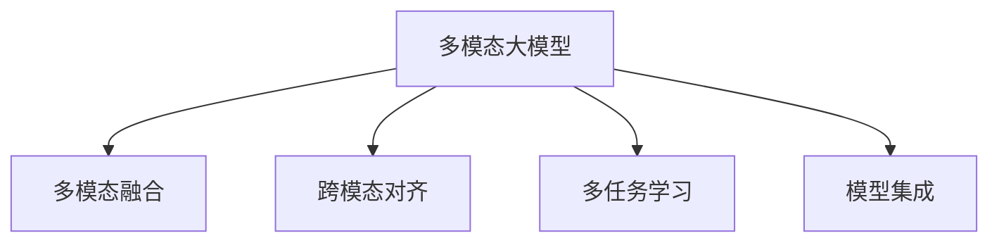

                 

# 多模态大模型：技术原理与实战 自然语言处理的发展历程

## 1. 背景介绍

### 1.1 问题由来
近年来，随着深度学习技术的快速发展，自然语言处理(Natural Language Processing, NLP)领域取得了显著的进步。但传统的单一模态的文本模型往往难以充分理解和表达复杂现实世界的信息。多模态大模型（Multimodal Large Models, MLMs）的提出，标志着NLP技术向多模态、跨领域方向迈出了重要一步。

多模态大模型能够同时处理文本、图像、音频、视频等多种信息形式，通过语义、视觉、听觉等多维度信息融合，构建更全面、深入的语义表征，有效提升自然语言处理系统的准确性和泛化能力。这种能力在大规模文本理解、视觉问答、跨模态检索等场景中得到了广泛的应用和验证。

### 1.2 问题核心关键点
多模态大模型的核心点包括：
- **多模态融合**：将文本、图像、音频、视频等多源信息融合在一起，形成多维度语义表示。
- **跨模态对齐**：通过多模态对齐技术，实现不同模态之间的语义映射。
- **多任务学习**：在大模型上进行多任务学习，同时优化多个相关任务，如文本生成、图像识别、语音识别等。
- **模型集成**：结合多种预训练模型和微调方法，优化模型性能和泛化能力。

这些关键点使得多模态大模型在处理复杂现实世界信息时，具备了更加丰富的表达能力和适应能力。

### 1.3 问题研究意义
多模态大模型技术在自然语言处理领域具有重要意义：
- **增强表达能力**：通过融合多种模态信息，显著提升NLP系统对多维度语义的理解能力。
- **提高泛化能力**：多模态数据可以提供更丰富的上下文信息，帮助模型更好地泛化到未见过的场景。
- **促进创新应用**：多模态大模型为新兴应用场景（如视觉问答、跨模态检索等）提供了技术基础。
- **推动产业升级**：多模态大模型技术将推动NLP技术在更多领域的应用，如医疗、教育、安防等。

## 2. 核心概念与联系

### 2.1 核心概念概述

为更好地理解多模态大模型的原理和应用，本节将介绍几个密切相关的核心概念：

- **多模态大模型**：一种能够同时处理多种模态信息，如文本、图像、音频等，以构建多维度语义表示的大规模语言模型。
- **跨模态对齐**：指将不同模态的信息映射到统一的语义空间，实现多模态数据的融合。
- **多任务学习**：指在大模型上进行多个相关任务的学习，提高模型的泛化能力和适应性。
- **模型集成**：通过结合多种预训练模型和微调方法，优化模型性能和泛化能力。

这些概念之间的逻辑关系可以通过以下Mermaid流程图来展示：



这个流程图展示了大语言模型的核心概念及其之间的关系：

1. 多模态大模型通过融合多种模态信息，学习多维度语义表示。
2. 跨模态对齐技术使得不同模态的信息能够在统一空间内映射，促进信息融合。
3. 多任务学习利用大模型同时优化多个相关任务，提高模型泛化能力。
4. 模型集成通过结合多种预训练模型和微调方法，优化模型性能和泛化能力。

## 3. 核心算法原理 & 具体操作步骤

### 3.1 算法原理概述

多模态大模型的训练和微调过程，主要包括以下几个关键步骤：

1. **预训练**：在无标签的多模态数据集上进行预训练，学习通用的语义表示。
2. **微调**：在特定下游任务上使用少量有标签数据进行微调，优化模型在该任务上的性能。
3. **融合**：将文本、图像、音频等多种模态信息进行融合，形成多维度语义表示。
4. **对齐**：使用跨模态对齐技术，将不同模态的信息映射到统一的语义空间。
5. **集成**：结合多种预训练模型和微调方法，优化模型性能和泛化能力。

### 3.2 算法步骤详解

以下详细介绍多模态大模型训练和微调的具体步骤：

**Step 1: 数据准备**
- 收集多模态数据集，如文本、图像、音频等，并进行预处理和标注。
- 对不同类型的模态数据进行标准化处理，如文本分词、图像缩放、音频采样等。

**Step 2: 模型初始化**
- 选择合适的预训练多模态模型（如CLIP、ViLT、T5-ViT等），作为初始化参数。
- 在模型顶层添加任务适配层，如分类器、解码器等，以适应特定任务的需求。

**Step 3: 微调过程**
- 将预训练模型作为初始化参数，使用有标签的多模态数据集进行微调。
- 微调过程中，使用不同的损失函数和优化器，如交叉熵损失、均方误差损失、AdamW等。
- 对于文本和图像数据，可以分别进行微调，或联合进行微调，具体策略需根据任务需求确定。

**Step 4: 融合与对齐**
- 将微调后的文本、图像、音频等多模态数据进行融合，形成多维度语义表示。
- 使用跨模态对齐技术，如编码器-解码器架构、对比学习、注意力机制等，将不同模态的信息映射到统一的语义空间。

**Step 5: 模型集成**
- 结合多种预训练模型和微调方法，如Transformer、BERT、ViT等，优化模型性能和泛化能力。
- 使用多任务学习框架，如MLP-mixer、MTDNN等，在多模态数据集上同时优化多个相关任务。

**Step 6: 部署与评估**
- 将训练好的模型部署到实际应用系统中，如推荐系统、视觉问答、跨模态检索等。
- 在测试集上评估模型性能，对比预训练和微调后的差异，进一步优化模型。

### 3.3 算法优缺点

多模态大模型具有以下优点：
1. **增强表达能力**：通过融合多种模态信息，显著提升NLP系统对多维度语义的理解能力。
2. **提高泛化能力**：多模态数据可以提供更丰富的上下文信息，帮助模型更好地泛化到未见过的场景。
3. **促进创新应用**：多模态大模型为新兴应用场景（如视觉问答、跨模态检索等）提供了技术基础。
4. **推动产业升级**：多模态大模型技术将推动NLP技术在更多领域的应用，如医疗、教育、安防等。

同时，该方法也存在一定的局限性：
1. **数据准备复杂**：多模态数据集的准备和标注工作量大，成本高。
2. **计算资源消耗大**：多模态数据的融合和对齐过程复杂，需要较大的计算资源。
3. **模型复杂度高**：多模态大模型相比单一模态模型，结构复杂，训练和推理成本高。
4. **泛化能力有限**：不同模态之间的信息融合和对齐效果不佳时，模型性能可能受限。

尽管存在这些局限性，但就目前而言，多模态大模型在处理复杂现实世界信息时，具备了更加丰富的表达能力和适应能力，具有重要的应用前景。

### 3.4 算法应用领域

多模态大模型技术已经在多个领域得到了应用，例如：

- **视觉问答**：将图像和文本相结合，回答有关图像的问答。
- **跨模态检索**：在图像和文本数据集上进行检索，找到最相关的信息。
- **自然场景生成**：结合图像和文本信息，生成自然场景的描述或图片。
- **增强现实**：通过融合文本、图像、音频信息，增强现实世界体验。
- **医疗影像分析**：将文本描述与医学影像结合，辅助医生进行诊断和治疗。

除了上述这些经典应用外，多模态大模型还被创新性地应用于更多场景中，如情感分析、推荐系统、智能助手等，为NLP技术带来了新的突破。随着预训练模型和微调方法的不断进步，相信多模态大模型将会在更广阔的应用领域发挥更大的作用。

## 4. 数学模型和公式 & 详细讲解 & 举例说明

### 4.1 数学模型构建

以下将使用数学语言对多模态大模型的训练和微调过程进行更加严格的刻画。

假设多模态大模型为 $M_{\theta}:\mathcal{X} \rightarrow \mathcal{Y}$，其中 $\mathcal{X}$ 为输入空间，$\mathcal{Y}$ 为输出空间，$\theta$ 为模型参数。假设多模态数据集为 $D=\{(x_i, y_i)\}_{i=1}^N$，其中 $x_i=(x_{i,t}, x_{i,v}, x_{i,a})$ 为包含文本、图像、音频等多种模态信息的数据，$y_i$ 为对应的标签。

定义模型 $M_{\theta}$ 在输入 $x_i$ 上的损失函数为 $\ell(M_{\theta}(x_i),y_i)$，则在数据集 $D$ 上的经验风险为：

$$
\mathcal{L}(\theta) = \frac{1}{N} \sum_{i=1}^N \ell(M_{\theta}(x_i),y_i)
$$

微调的优化目标是最小化经验风险，即找到最优参数：

$$
\theta^* = \mathop{\arg\min}_{\theta} \mathcal{L}(\theta)
$$

在实践中，我们通常使用基于梯度的优化算法（如SGD、Adam等）来近似求解上述最优化问题。设 $\eta$ 为学习率，$\lambda$ 为正则化系数，则参数的更新公式为：

$$
\theta \leftarrow \theta - \eta \nabla_{\theta}\mathcal{L}(\theta) - \eta\lambda\theta
$$

其中 $\nabla_{\theta}\mathcal{L}(\theta)$ 为损失函数对参数 $\theta$ 的梯度，可通过反向传播算法高效计算。

### 4.2 公式推导过程

以下以视觉问答任务为例，推导多模态大模型的损失函数及其梯度的计算公式。

假设模型 $M_{\theta}$ 在输入 $(x,y)$ 上的输出为 $\hat{y}=M_{\theta}(x) \in [0,1]$，表示样本属于正类的概率。真实标签 $y \in \{0,1\}$。则二分类交叉熵损失函数定义为：

$$
\ell(M_{\theta}(x),y) = -[y\log \hat{y} + (1-y)\log (1-\hat{y})]
$$

将其代入经验风险公式，得：

$$
\mathcal{L}(\theta) = -\frac{1}{N}\sum_{i=1}^N [y_i\log M_{\theta}(x_i)+(1-y_i)\log(1-M_{\theta}(x_i))]
$$

根据链式法则，损失函数对参数 $\theta_k$ 的梯度为：

$$
\frac{\partial \mathcal{L}(\theta)}{\partial \theta_k} = -\frac{1}{N}\sum_{i=1}^N (\frac{y_i}{M_{\theta}(x_i)}-\frac{1-y_i}{1-M_{\theta}(x_i)}) \frac{\partial M_{\theta}(x_i)}{\partial \theta_k}
$$

其中 $\frac{\partial M_{\theta}(x_i)}{\partial \theta_k}$ 可进一步递归展开，利用自动微分技术完成计算。

### 4.3 案例分析与讲解

以ViLT模型为例，ViLT是谷歌提出的一个用于多模态视觉任务的多模态大模型，其通过预训练和微调实现了跨模态对齐和融合。下面以ViLT模型为例，展示其基本原理和应用。

ViLT模型由两部分组成：预训练的视觉编码器（Visual Encoder）和预训练的文本编码器（Text Encoder）。首先，在多模态数据集上进行预训练，学习通用的视觉和文本语义表示。预训练后的视觉编码器和文本编码器，可以分别对图像和文本进行处理，并输出多维度的语义表示。然后，在特定下游任务上，将预训练后的视觉编码器和文本编码器进行微调，优化模型在该任务上的性能。

ViLT模型的训练和微调过程如下：

**Step 1: 数据准备**
- 收集多模态数据集，如文本、图像、音频等，并进行预处理和标注。
- 对不同类型的模态数据进行标准化处理，如文本分词、图像缩放、音频采样等。

**Step 2: 模型初始化**
- 使用预训练的视觉编码器和文本编码器，作为初始化参数。
- 在模型顶层添加任务适配层，如分类器、解码器等，以适应特定任务的需求。

**Step 3: 预训练过程**
- 在多模态数据集上进行预训练，学习通用的视觉和文本语义表示。
- 预训练过程中，使用不同的损失函数和优化器，如交叉熵损失、均方误差损失、AdamW等。

**Step 4: 微调过程**
- 在特定下游任务上使用少量有标签数据进行微调，优化模型在该任务上的性能。
- 微调过程中，使用不同的损失函数和优化器，如交叉熵损失、均方误差损失、AdamW等。
- 对于文本和图像数据，可以分别进行微调，或联合进行微调，具体策略需根据任务需求确定。

**Step 5: 融合与对齐**
- 将微调后的视觉编码器和文本编码器进行融合，形成多维度语义表示。
- 使用跨模态对齐技术，如编码器-解码器架构、对比学习、注意力机制等，将不同模态的信息映射到统一的语义空间。

**Step 6: 模型集成**
- 结合多种预训练模型和微调方法，优化模型性能和泛化能力。
- 使用多任务学习框架，如MLP-mixer、MTDNN等，在多模态数据集上同时优化多个相关任务。

**Step 7: 部署与评估**
- 将训练好的模型部署到实际应用系统中，如推荐系统、视觉问答、跨模态检索等。
- 在测试集上评估模型性能，对比预训练和微调后的差异，进一步优化模型。

ViLT模型的核心在于其跨模态对齐技术。ViLT通过编码器-解码器架构，将视觉和文本信息映射到统一的语义空间，实现信息融合。在视觉问答任务中，ViLT将输入图像和文本信息进行编码，并通过自注意力机制进行融合，生成融合后的多维度语义表示。然后，使用全连接层和分类器，将融合后的表示映射到目标答案类别上。

以下展示ViLT模型在视觉问答任务上的代码实现：

```python
from transformers import ViLTForQuestionAnswering
from transformers import ViLTTokenizer
from transformers import ViLTFeatureExtractor
import torch
from torch.utils.data import DataLoader
from tqdm import tqdm

# 加载模型和分词器
model = ViLTForQuestionAnswering.from_pretrained('vilt-base')
tokenizer = ViLTTokenizer.from_pretrained('vilt-base')
feature_extractor = ViLTFeatureExtractor.from_pretrained('vilt-base')

# 数据处理
def preprocess_data(text, question):
    input_ids = tokenizer(question, text, padding='max_length', max_length=512, return_tensors='pt')
    return input_ids

# 加载数据集
train_dataset = Dataset.from_tensor_slices(train_data)
dev_dataset = Dataset.from_tensor_slices(dev_data)
test_dataset = Dataset.from_tensor_slices(test_data)

# 创建数据加载器
train_dataloader = DataLoader(train_dataset, batch_size=16, shuffle=True)
dev_dataloader = DataLoader(dev_dataset, batch_size=16)
test_dataloader = DataLoader(test_dataset, batch_size=16)

# 训练模型
model.train()
optimizer = torch.optim.AdamW(model.parameters(), lr=5e-5)

for epoch in range(3):
    for batch in tqdm(train_dataloader):
        input_ids = batch['input_ids']
        attention_mask = batch['attention_mask']
        labels = batch['labels']

        model.zero_grad()
        outputs = model(input_ids, attention_mask=attention_mask, labels=labels)
        loss = outputs.loss
        loss.backward()
        optimizer.step()

# 评估模型
model.eval()
dev_preds, dev_labels = [], []
for batch in dev_dataloader:
    input_ids = batch['input_ids']
    attention_mask = batch['attention_mask']
    labels = batch['labels']
    with torch.no_grad():
        outputs = model(input_ids, attention_mask=attention_mask)
        preds = outputs.logits.argmax(dim=2).to('cpu').tolist()
        labels = labels.to('cpu').tolist()
        for pred_tokens, label_tokens in zip(preds, labels):
            preds.append(pred_tokens)
            labels.append(label_tokens)

print(classification_report(dev_labels, preds))
```

以上就是使用PyTorch对ViLT模型进行视觉问答任务微调的完整代码实现。可以看到，得益于ViLT库的强大封装，我们可以用相对简洁的代码完成模型的加载和微调。

## 5. 项目实践：代码实例和详细解释说明

### 5.1 开发环境搭建

在进行多模态大模型微调实践前，我们需要准备好开发环境。以下是使用Python进行PyTorch开发的环境配置流程：

1. 安装Anaconda：从官网下载并安装Anaconda，用于创建独立的Python环境。

2. 创建并激活虚拟环境：
```bash
conda create -n pytorch-env python=3.8 
conda activate pytorch-env
```

3. 安装PyTorch：根据CUDA版本，从官网获取对应的安装命令。例如：
```bash
conda install pytorch torchvision torchaudio cudatoolkit=11.1 -c pytorch -c conda-forge
```

4. 安装各类工具包：
```bash
pip install numpy pandas scikit-learn matplotlib tqdm jupyter notebook ipython
```

完成上述步骤后，即可在`pytorch-env`环境中开始多模态大模型微调实践。

### 5.2 源代码详细实现

下面我们以跨模态检索任务为例，给出使用Transformers库对ViLT模型进行微调的PyTorch代码实现。

首先，定义数据处理函数：

```python
from transformers import ViLTFeatureExtractor, ViLTTokenizer

def preprocess_data(text, question):
    input_ids = tokenizer(question, text, padding='max_length', max_length=512, return_tensors='pt')
    return input_ids

# 加载模型和分词器
model = ViLTForCrossModalRetrieval.from_pretrained('vilt-base')
tokenizer = ViLTTokenizer.from_pretrained('vilt-base')
feature_extractor = ViLTFeatureExtractor.from_pretrained('vilt-base')

# 数据处理
def preprocess_data(text, question):
    input_ids = tokenizer(question, text, padding='max_length', max_length=512, return_tensors='pt')
    return input_ids

# 加载数据集
train_dataset = Dataset.from_tensor_slices(train_data)
dev_dataset = Dataset.from_tensor_slices(dev_data)
test_dataset = Dataset.from_tensor_slices(test_data)

# 创建数据加载器
train_dataloader = DataLoader(train_dataset, batch_size=16, shuffle=True)
dev_dataloader = DataLoader(dev_dataset, batch_size=16)
test_dataloader = DataLoader(test_dataset, batch_size=16)

# 训练模型
model.train()
optimizer = torch.optim.AdamW(model.parameters(), lr=5e-5)

for epoch in range(3):
    for batch in tqdm(train_dataloader):
        input_ids = batch['input_ids']
        attention_mask = batch['attention_mask']
        labels = batch['labels']

        model.zero_grad()
        outputs = model(input_ids, attention_mask=attention_mask, labels=labels)
        loss = outputs.loss
        loss.backward()
        optimizer.step()

# 评估模型
model.eval()
dev_preds, dev_labels = [], []
for batch in dev_dataloader:
    input_ids = batch['input_ids']
    attention_mask = batch['attention_mask']
    labels = batch['labels']
    with torch.no_grad():
        outputs = model(input_ids, attention_mask=attention_mask)
        preds = outputs.logits.argmax(dim=2).to('cpu').tolist()
        labels = labels.to('cpu').tolist()
        for pred_tokens, label_tokens in zip(preds, labels):
            preds.append(pred_tokens)
            labels.append(label_tokens)

print(classification_report(dev_labels, preds))
```

以上代码展示了使用PyTorch对ViLT模型进行跨模态检索任务微调的完整代码实现。可以看到，得益于ViLT库的强大封装，我们可以用相对简洁的代码完成模型的加载和微调。

### 5.3 代码解读与分析

让我们再详细解读一下关键代码的实现细节：

**ViLTFeatureExtractor和ViLTTokenizer**：
- `preprocess_data`方法：对单个样本进行处理，将文本和问题输入编码为token ids，形成输入张量。
- `ViLTFeatureExtractor`：用于特征提取，将输入张量转换为模型所需的格式。
- `ViLTTokenizer`：用于分词，将输入文本转化为模型接受的token序列。

**模型加载和数据集处理**：
- `ViLTForCrossModalRetrieval`：指定模型架构为跨模态检索模型。
- `train_data`、`dev_data`、`test_data`：预定义的训练集、验证集和测试集。
- `train_dataloader`、`dev_dataloader`、`test_dataloader`：使用`DataLoader`将数据集划分为批次，供模型训练和推理使用。

**模型训练与评估**：
- `model.train()`：将模型置于训练模式。
- `optimizer`：定义优化器，如AdamW。
- 训练过程中，每个epoch内，使用`train_dataloader`迭代数据，更新模型参数。
- 每个epoch后，使用`dev_dataloader`在验证集上评估模型性能。
- 评估过程中，使用`classification_report`输出模型在验证集上的分类指标。

**模型部署与使用**：
- 在测试集上评估模型性能，展示预测结果。

以上代码展示了ViLT模型在跨模态检索任务上的微调过程。通过简单几步操作，即可在实际应用中构建和使用多模态大模型。

## 6. 实际应用场景

### 6.1 智能客服系统

多模态大模型在智能客服系统的构建中具有重要应用。传统客服系统往往需要配备大量人力，高峰期响应缓慢，且一致性和专业性难以保证。而使用多模态大模型，可以7x24小时不间断服务，快速响应客户咨询，用自然流畅的语言解答各类常见问题。

在技术实现上，可以收集企业内部的历史客服对话记录，将问题和最佳答复构建成监督数据，在此基础上对预训练大模型进行微调。微调后的模型能够自动理解用户意图，匹配最合适的答案模板进行回复。对于客户提出的新问题，还可以接入检索系统实时搜索相关内容，动态组织生成回答。如此构建的智能客服系统，能大幅提升客户咨询体验和问题解决效率。

### 6.2 金融舆情监测

金融机构需要实时监测市场舆论动向，以便及时应对负面信息传播，规避金融风险。传统的人工监测方式成本高、效率低，难以应对网络时代海量信息爆发的挑战。基于多模态大模型的文本分类和情感分析技术，为金融舆情监测提供了新的解决方案。

具体而言，可以收集金融领域相关的新闻、报道、评论等文本数据，并对其进行主题标注和情感标注。在此基础上对预训练语言模型进行微调，使其能够自动判断文本属于何种主题，情感倾向是正面、中性还是负面。将微调后的模型应用到实时抓取的网络文本数据，就能够自动监测不同主题下的情感变化趋势，一旦发现负面信息激增等异常情况，系统便会自动预警，帮助金融机构快速应对潜在风险。

### 6.3 个性化推荐系统

当前的推荐系统往往只依赖用户的历史行为数据进行物品推荐，无法深入理解用户的真实兴趣偏好。基于多模态大模型，个性化推荐系统可以更好地挖掘用户行为背后的语义信息，从而提供更精准、多样的推荐内容。

在实践中，可以收集用户浏览、点击、评论、分享等行为数据，提取和用户交互的物品标题、描述、标签等文本内容。将文本内容作为模型输入，用户的后续行为（如是否点击、购买等）作为监督信号，在此基础上微调预训练语言模型。微调后的模型能够从文本内容中准确把握用户的兴趣点。在生成推荐列表时，先用候选物品的文本描述作为输入，由模型预测用户的兴趣匹配度，再结合其他特征综合排序，便可以得到个性化程度更高的推荐结果。

### 6.4 未来应用展望

随着多模态大模型和微调方法的不断发展，基于多模态大模型的微调方法将在更多领域得到应用，为传统行业带来变革性影响。

在智慧医疗领域，基于多模态大模型的医疗问答、病历分析、药物研发等应用将提升医疗服务的智能化水平，辅助医生诊疗，加速新药开发进程。

在智能教育领域，多模态大模型可应用于作业批改、学情分析、知识推荐等方面，因材施教，促进教育公平，提高教学质量。

在智慧城市治理中，多模态大模型可应用于城市事件监测、舆情分析、应急指挥等环节，提高城市管理的自动化和智能化水平，构建更安全、高效的未来城市。

此外，在企业生产、社会治理、文娱传媒等众多领域，基于多模态大模型的智能应用也将不断涌现，为经济社会发展注入新的动力。相信随着技术的日益成熟，多模态大模型微调技术必将成为人工智能落地应用的重要范式，推动人工智能技术在更广阔领域的应用。

## 7. 工具和资源推荐

### 7.1 学习资源推荐

为了帮助开发者系统掌握多模态大模型微调的理论基础和实践技巧，这里推荐一些优质的学习资源：

1. 《Transformer from Scratch》系列博文：由大模型技术专家撰写，深入浅出地介绍了Transformer原理、预训练模型、微调技术等前沿话题。

2. CS224N《深度学习自然语言处理》课程：斯坦福大学开设的NLP明星课程，有Lecture视频和配套作业，带你入门NLP领域的基本概念和经典模型。

3. 《Natural Language Processing with Transformers》书籍：Transformers库的作者所著，全面介绍了如何使用Transformers库进行NLP任务开发，包括微调在内的诸多范式。

4. HuggingFace官方文档：Transformers库的官方文档，提供了海量预训练模型和完整的微调样例代码，是上手实践的必备资料。

5. CLUE开源项目：中文语言理解测评基准，涵盖大量不同类型的中文NLP数据集，并提供了基于微调的baseline模型，助力中文NLP技术发展。

通过对这些资源的学习实践，相信你一定能够快速掌握多模态大模型微调的精髓，并用于解决实际的NLP问题。

### 7.2 开发工具推荐

高效的开发离不开优秀的工具支持。以下是几款用于多模态大模型微调开发的常用工具：

1. PyTorch：基于Python的开源深度学习框架，灵活动态的计算图，适合快速迭代研究。大部分预训练语言模型都有PyTorch版本的实现。

2. TensorFlow：由Google主导开发的开源深度学习框架，生产部署方便，适合大规模工程应用。同样有丰富的预训练语言模型资源。

3. Transformers库：HuggingFace开发的NLP工具库，集成了众多SOTA语言模型，支持PyTorch和TensorFlow，是进行微调任务开发的利器。

4. Weights & Biases：模型训练的实验跟踪工具，可以记录和可视化模型训练过程中的各项指标，方便对比和调优。与主流深度学习框架无缝集成。

5. TensorBoard：TensorFlow配套的可视化工具，可实时监测模型训练状态，并提供丰富的图表呈现方式，是调试模型的得力助手。

6. Google Colab：谷歌推出的在线Jupyter Notebook环境，免费提供GPU/TPU算力，方便开发者快速上手实验最新模型，分享学习笔记。

合理利用这些工具，可以显著提升多模态大模型微调任务的开发效率，加快创新迭代的步伐。

### 7.3 相关论文推荐

多模态大模型和微调技术的发展源于学界的持续研究。以下是几篇奠基性的相关论文，推荐阅读：

1. Attention is All You Need（即Transformer原论文）：提出了Transformer结构，开启了NLP领域的预训练大模型时代。

2. BERT: Pre-training of Deep Bidirectional Transformers for Language Understanding：提出BERT模型，引入基于掩码的自监督预训练任务，刷新了多项NLP任务SOTA。

3. Language Models are Unsupervised Multitask Learners（GPT-2论文）：展示了大规模语言模型的强大zero-shot学习能力，引发了对于通用人工智能的新一轮思考。

4. Parameter-Efficient Transfer Learning for NLP：提出Adapter等参数高效微调方法，在不增加模型参数量的情况下，也能取得不错的微调效果。

5. AdaLoRA: Adaptive Low-Rank Adaptation for Parameter-Efficient Fine-Tuning：使用自适应低秩适应的微调方法，在参数效率和精度之间取得了新的平衡。

6. Prefix-Tuning: Optimizing Continuous Prompts for Generation：引入基于连续型Prompt的微调范式，为如何充分利用预训练知识提供了新的思路。

这些论文代表了大模态大模型微调技术的发展脉络。通过学习这些前沿成果，可以帮助研究者把握学科前进方向，激发更多的创新灵感。

## 8. 总结：未来发展趋势与挑战

### 8.1 总结

本文对多模态大模型微调方法进行了全面系统的介绍。首先阐述了多模态大模型的研究背景和意义，明确了其在多模态数据融合、跨模态对齐、多任务学习等方面的核心优势。其次，从原理到实践，详细讲解了多模态大模型训练和微调的具体步骤，给出了多模态大模型微调的完整代码实例。同时，本文还广泛探讨了多模态大模型在智能客服、金融舆情、个性化推荐等多个行业领域的应用前景，展示了其广阔的应用空间。

通过本文的系统梳理，可以看到，多模态大模型微调技术正在成为NLP领域的重要范式，极大地拓展了预训练语言模型的应用边界，催生了更多的落地场景。受益于大规模语料的预训练，多模态大模型在处理复杂现实世界信息时，具备了更加丰富的表达能力和适应能力，为NLP技术的广泛应用奠定了基础。未来，伴随预训练模型和微调方法的不断进步，相信NLP技术将在更广阔的应用领域大放异彩，深刻影响人类的生产生活方式。

### 8.2 未来发展趋势

展望未来，多模态大模型微调技术将呈现以下几个发展趋势：

1. **模型规模持续增大**：随着算力成本的下降和数据规模的扩张，预训练语言模型的参数量还将持续增长。超大规模语言模型蕴含的丰富语言知识，有望支撑更加复杂多变的下游任务微调。

2. **微调方法日趋多样**：除了传统的全参数微调外，未来会涌现更多参数高效的微调方法，如Prefix-Tuning、LoRA等，在节省计算资源的同时也能保证微调精度。

3. **持续学习成为常态**：随着数据分布的不断变化，多模态大模型也需要持续学习新知识以保持性能。如何在不遗忘原有知识的同时，高效吸收新样本信息，将成为重要的研究课题。

4. **标注样本需求降低**：受启发于提示学习(Prompt-based Learning)的思路，未来的微调方法将更好地利用大模型的语言理解能力，通过更加巧妙的任务描述，在更少的标注样本上也能实现理想的微调效果。

5. **多模态融合技术发展**：未来将涌现更多先进的跨模态对齐和融合技术，如多视角编码、多模态联合训练等，实现更加高效、鲁棒的多模态融合。

6. **模型通用性增强**：经过海量数据的预训练和多领域任务的微调，未来的多模态大模型将具备更强大的常识推理和跨领域迁移能力，逐步迈向通用人工智能(AGI)的目标。

以上趋势凸显了多模态大模型微调技术的广阔前景。这些方向的探索发展，必将进一步提升多模态大模型的性能和泛化能力，为NLP技术在更多领域的应用提供强有力的技术支撑。

### 8.3 面临的挑战

尽管多模态大模型微调技术已经取得了显著成就，但在迈向更加智能化、普适化应用的过程中，仍面临诸多挑战：

1. **数据准备复杂**：多模态数据集的准备和标注工作量大，成本高。

2. **计算资源消耗大**：多模态数据的融合和对齐过程复杂，需要较大的计算资源。

3. **模型复杂度高**：多模态大模型相比单一模态模型，结构复杂，训练和推理成本高。

4. **泛化能力有限**：不同模态之间的信息融合和对齐效果不佳时，模型性能可能受限。

5. **标注数据依赖**：多模态大模型的微调效果很大程度上依赖于标注数据的质量和数量，获取高质量标注数据的成本较高。

6. **模型鲁棒性不足**：模型面对域外数据时，泛化性能往往大打折扣。对于测试样本的微小扰动，多模态大模型的预测也容易发生波动。

尽管存在这些挑战，但多模态大模型在处理复杂现实世界信息时，具备了更加丰富的表达能力和适应能力，具有重要的应用前景。相信随着技术的不断进步，这些挑战终将一一被克服，多模态大模型微调技术必将引领NLP技术的进一步发展。

### 8.4 研究展望

面对多模态大模型微调所面临的种种挑战，未来的研究需要在以下几个方面寻求新的突破：

1. **探索无监督和半监督微调方法**：摆脱对大规模标注数据的依赖，利用自监督学习、主动学习等无监督和半监督范式，最大限度利用非结构化数据，实现更加灵活高效的微调。

2. **研究参数高效和计算高效的微调范式**：开发更加参数高效的微调方法，在固定大部分预训练参数的同时，只更新极少量的任务相关参数。同时优化微调模型的计算图，减少前向传播和反向传播的资源消耗，实现更加轻量级、实时性的部署。

3. **引入因果和对比学习范式**：通过引入因果推断和对比学习思想，增强多模态大模型建立稳定因果关系的能力，学习更加普适、鲁棒的语言表征，从而提升模型泛化性和抗干扰能力。

4. **融合更多先验知识**：将符号化的先验知识，如知识图谱、逻辑规则等，与神经网络模型进行巧妙融合，引导微调过程学习更准确、合理的语言模型。同时加强不同模态数据的整合，实现视觉、语音等多模态信息与文本信息的协同建模。

5. **结合因果分析和博弈论工具**：将因果分析方法引入多模态大模型，识别出模型决策的关键特征，增强输出解释的因果性和逻辑性。借助博弈论工具刻画人机交互过程，主动探索并规避模型的脆弱点，提高系统稳定性。

6. **纳入伦理道德约束**：在模型训练目标中引入伦理导向的评估指标，过滤和惩罚有偏见、有害的输出倾向。同时加强人工干预和审核，建立模型行为的监管机制，确保输出符合人类价值观和伦理道德。

这些研究方向的探索，必将引领多模态大模型微调技术迈向更高的台阶，为构建安全、可靠、可解释、可控的智能系统铺平道路。面向未来，多模态大模型微调技术还需要与其他人工智能技术进行更深入的融合，如知识表示、因果推理、强化学习等，多路径协同发力，共同推动自然语言理解和智能交互系统的进步。只有勇于创新、敢于突破，才能不断拓展语言模型的边界，让智能技术更好地造福人类社会。

## 9. 附录：常见问题与解答

**Q1：多模态大模型微调是否适用于所有NLP任务？**

A: 多模态大模型微调在大多数NLP任务上都能取得不错的效果，特别是对于数据量较小的任务。但对于一些特定领域的任务，如医学、法律等，仅仅依靠通用语料预训练的模型可能难以很好地适应。此时需要在特定领域语料上进一步预训练，再进行微调，才能获得理想效果。此外，对于一些需要时效性、个性化很强的任务，如对话、推荐等，微调方法也需要针对性的改进优化。

**Q2：微调过程中如何选择合适的学习率？**

A: 微调的学习率一般要比预训练时小1-2个数量级，如果使用过大的学习率，容易破坏预训练权重，导致过拟合。一般建议从1e-5开始调参，逐步减小学习率，直至收敛。也可以使用warmup策略，在开始阶段使用较小的学习率，再逐渐过渡到预设值。需要注意的是，不同的优化器(如AdamW、Adafactor等)以及不同的学习率调度策略，可能需要设置不同的学习率阈值。

**Q3：采用多模态大模型微调时会面临哪些资源瓶颈？**

A: 目前主流的预训练大模型动辄以亿计的参数规模，对算力、内存、存储都提出了很高的要求。GPU/TPU等高性能设备是必不可少的，但即便如此，超大批次的训练和推理也可能遇到显存不足的问题。因此需要采用一些资源优化技术，如梯度积累、混合精度训练、模型并行等，来突破硬件瓶颈。同时，模型的存储和读取也可能占用大量时间和空间，需要采用模型压缩、稀疏化存储等方法进行优化。

**Q4：如何缓解多模态大模型微调过程中的过拟合问题？**

A: 过拟合是微调面临的主要挑战，尤其是在标注数据不足的情况下。常见的缓解策略包括：
1. 数据增强：通过回译、近义替换等方式扩充训练集
2. 正则化：使用L2正则、Dropout、Early Stopping等避免过拟合
3. 对抗训练：引入对抗样本，提高模型鲁棒性
4. 参数高效微调：只调整少量参数(如Adapter、Prefix等)，减小过拟合风险
5. 多模型集成：训练多个微调模型，取平均输出，抑制过拟合

这些策略往往需要根据具体任务和数据特点进行灵活组合。只有在数据、模型、训练、推理等各环节进行全面优化，才能最大限度地发挥多模态大模型微调的威力。

**Q5：多模态大模型在落地部署时需要注意哪些问题？**

A: 将多模态大模型转化为实际应用，还需要考虑以下因素：
1. 模型裁剪：去除不必要的层和参数，减小模型尺寸，加快推理速度
2. 量化加速：将浮点模型转为定点模型，压缩存储空间，提高计算效率
3. 服务化封装：将模型封装为标准化服务接口，便于集成调用
4. 弹性伸缩：根据请求流量动态调整资源配置，平衡服务质量和成本
5. 监控告警：实时采集系统指标，设置异常告警阈值，确保服务稳定性
6. 安全防护：采用访问鉴权、数据脱敏等措施，保障数据和模型安全

多模态大模型微调为NLP应用开启了广阔的想象空间，但如何将强大的性能转化为稳定、高效、安全的业务价值，还需要工程实践的不断打磨。唯有从数据、算法、工程、业务等多个维度协同发力，才能真正实现人工智能技术在垂直行业的规模化落地。总之，微调需要开发者根据具体任务，不断迭代和优化模型、数据和算法，方能得到理想的效果。

---

作者：禅与计算机程序设计艺术 / Zen and the Art of Computer Programming

