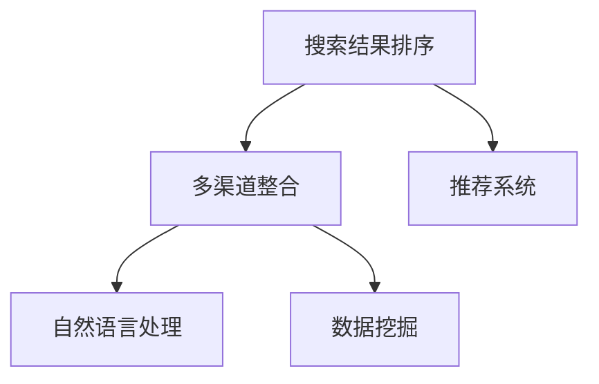

                 

## 1. 背景介绍

在互联网时代，信息的获取变得触手可及。无论是搜索引擎、社交媒体还是在线广告，信息的丰富性和多样性带来了前所未有的机遇。但与此同时，信息的过载也给用户的决策过程带来了挑战。如何从海量信息中找到最相关的、最优质的搜索结果，成为了摆在AI开发者面前的一个重要课题。

传统的搜索结果排序算法主要依赖于关键词匹配和页面相关度评分。这种方法在信息简单、结构化的情况下效果不错，但在复杂多变的互联网环境中，逐渐显现出其局限性。为了应对这些挑战，近年来兴起了多渠道整合（Multi-Channel Integration）的AI技术，通过综合利用多种信息源和用户行为数据，提供更为精准和人性化的搜索结果。

本文将深入探讨多渠道整合技术，介绍其在搜索结果排序中的应用，并分析其核心算法原理与操作步骤。同时，还将分享实际应用场景、项目实践案例以及未来发展趋势和挑战，力求为读者提供全面、深入的技术见解。

## 2. 核心概念与联系

### 2.1 核心概念概述

在了解多渠道整合技术之前，我们需要先梳理几个核心概念：

- **搜索结果排序**：搜索引擎的核心功能之一，其目标是从大量网页中挑选出最相关的、最优质的结果，以用户查询意图为依据进行排序。
- **多渠道整合**：指将来自不同渠道的信息和用户行为数据综合分析，全面评估搜索结果的相关性和质量。
- **推荐系统**：通过分析用户行为和偏好，为用户推荐个性化的内容，提高用户满意度和平台粘性。
- **自然语言处理（NLP）**：利用语言模型和机器学习技术，理解和生成自然语言，增强搜索结果和推荐内容的质量。
- **数据挖掘**：从大量数据中发现隐藏的模式和关联，提高搜索结果排序的准确性和多样性。

这些核心概念之间的关系可以通过以下Mermaid流程图来展示：



这个流程图展示了各个概念之间的逻辑关系：

1. **搜索结果排序**是搜索引擎的核心任务，通过多渠道整合获取全面的信息。
2. **推荐系统**帮助生成个性化的搜索结果。
3. **自然语言处理**提高文本处理的精度和自然度，增强搜索结果的相关性。
4. **数据挖掘**利用数据特征进行分析和建模，优化搜索结果排序。

## 3. 核心算法原理 & 具体操作步骤

### 3.1 算法原理概述

多渠道整合的算法原理主要包括以下几个步骤：

1. **数据采集**：从不同的渠道（如搜索、社交媒体、新闻、广告等）收集数据。
2. **数据融合**：将收集到的数据进行融合，构建综合数据集。
3. **用户行为分析**：利用机器学习算法分析用户行为数据，理解用户意图和偏好。
4. **内容分析与匹配**：使用自然语言处理技术，对搜索结果进行文本分析和匹配，提升相关性。
5. **排序算法优化**：结合多种排序算法，如PageRank、用户行为评分、自然语言处理评分等，生成最优的搜索结果排序。

### 3.2 算法步骤详解

以下是多渠道整合算法详细步骤：

**Step 1: 数据采集与预处理**

1. **数据源选择**：确定需要收集的渠道和数据类型，如网页内容、社交媒体评论、新闻报道等。
2. **数据采集**：使用API或爬虫工具从各渠道获取原始数据。
3. **数据清洗**：去除无关数据，处理缺失值和异常值，确保数据质量。
4. **数据转换**：将不同格式的数据转换为统一格式，便于后续处理。

**Step 2: 数据融合与统一**

1. **特征提取**：从采集的数据中提取关键特征，如关键词、网页权重、用户评分等。
2. **数据融合**：将各渠道的数据进行合并，构建综合数据集。
3. **数据标准化**：对不同数据源的数据进行归一化处理，确保数据的一致性。
4. **数据增补**：使用数据挖掘技术补充缺失的数据，增加数据丰富性。

**Step 3: 用户行为分析与建模**

1. **用户行为数据采集**：收集用户的点击、浏览、搜索等行为数据。
2. **用户意图理解**：利用机器学习算法，如逻辑回归、随机森林等，分析用户行为数据，理解用户意图。
3. **用户偏好建模**：构建用户偏好模型，预测用户对不同搜索结果的评分。

**Step 4: 内容分析与匹配**

1. **文本预处理**：对搜索结果进行分词、去停用词、词干提取等预处理。
2. **文本特征提取**：使用TF-IDF、word2vec等方法提取文本特征。
3. **文本匹配**：利用相似度算法，如余弦相似度、Jaccard相似度等，计算搜索结果与查询意图的相关性。
4. **文本过滤**：去除低质量文本，确保搜索结果的质量。

**Step 5: 排序算法优化**

1. **算法选择**：根据应用场景选择合适的排序算法，如PageRank、协同过滤、基于内容的排序等。
2. **算法组合**：将多个排序算法进行组合，优化搜索结果排序。
3. **模型训练与调优**：使用机器学习模型对排序算法进行训练和调优，提高排序精度。
4. **实时调整**：根据用户反馈和行为数据，动态调整排序算法，确保结果的实时性和准确性。

### 3.3 算法优缺点

多渠道整合算法在提供精准搜索结果方面具有显著优势：

1. **数据多样性**：利用多种信息源，提供更加全面和多样化的搜索结果。
2. **用户行为分析**：通过分析用户行为数据，理解用户需求，生成个性化推荐。
3. **自然语言处理**：利用NLP技术提高文本处理的精度和自然度，增强搜索结果的相关性。

然而，该算法也存在一些局限性：

1. **数据采集成本高**：需要从多个渠道采集数据，成本较高。
2. **数据融合复杂**：不同数据源的数据格式和质量不一，融合复杂度较高。
3. **模型训练复杂**：需要构建复杂的模型，调优工作量大。
4. **实时性要求高**：实时调整算法，对系统处理速度和计算资源要求较高。

## 4. 数学模型和公式 & 详细讲解  
### 4.1 数学模型构建

多渠道整合算法的数学模型构建主要包括以下几个步骤：

1. **用户意图表示**：将用户查询意图表示为一个向量，用于衡量与搜索结果的相关性。
2. **搜索结果向量**：将搜索结果文本表示为一个向量，用于衡量与用户查询意图的相关性。
3. **排序权重**：根据排序算法，计算每个搜索结果的权重。
4. **综合排序**：综合用户意图向量、搜索结果向量、排序权重，生成最终排序结果。

**用户意图向量**：
$$
u = \sum_{i=1}^{n} w_i u_i
$$
其中，$w_i$为每个关键词的权重，$u_i$为关键词的向量表示。

**搜索结果向量**：
$$
v = \sum_{j=1}^{m} r_j v_j
$$
其中，$r_j$为每个文本的权重，$v_j$为文本的向量表示。

**排序权重**：
$$
w = \alpha_1 w_u + \alpha_2 w_v + \alpha_3 w_b
$$
其中，$w_u$为用户意图向量权重，$w_v$为搜索结果向量权重，$w_b$为用户行为评分权重，$\alpha_1, \alpha_2, \alpha_3$为各权重的调节系数。

**综合排序**：
$$
R = \text{sort}(u \cdot v \cdot w)
$$
其中，$\cdot$为向量点积，$\text{sort}$为排序函数。

### 4.2 公式推导过程

**用户意图向量的计算**：
$$
u = \sum_{i=1}^{n} w_i u_i = \sum_{i=1}^{n} w_i (u_i - \bar{u}) + n\bar{u}
$$
其中，$w_i$为关键词权重，$u_i$为关键词向量，$\bar{u}$为关键词向量均值，$n$为关键词总数。

**搜索结果向量的计算**：
$$
v = \sum_{j=1}^{m} r_j v_j = \sum_{j=1}^{m} r_j (v_j - \bar{v}) + m\bar{v}
$$
其中，$r_j$为文本权重，$v_j$为文本向量，$\bar{v}$为文本向量均值，$m$为文本总数。

**排序权重的计算**：
$$
w = \alpha_1 w_u + \alpha_2 w_v + \alpha_3 w_b
$$
其中，$w_u$为用户意图向量权重，$w_v$为搜索结果向量权重，$w_b$为用户行为评分权重，$\alpha_1, \alpha_2, \alpha_3$为各权重的调节系数。

**综合排序的计算**：
$$
R = \text{sort}(u \cdot v \cdot w) = \text{sort}((\sum_{i=1}^{n} w_i (u_i - \bar{u})) \cdot (\sum_{j=1}^{m} r_j (v_j - \bar{v})) + n\bar{u} \cdot m\bar{v} \cdot \alpha_1 \alpha_2 \alpha_3)
$$

### 4.3 案例分析与讲解

以一个简单的多渠道整合案例来具体讲解：

假设某用户搜索“Python 编程语言”，搜索引擎需要从网页、新闻、社交媒体等不同渠道获取相关数据。

**数据采集**：
- 网页：获取搜索结果的标题、摘要、URL等。
- 新闻：获取新闻标题、摘要、发布时间等。
- 社交媒体：获取用户评论、点赞数、分享数等。

**数据融合**：
- 将网页、新闻、社交媒体的数据融合，构建综合数据集。
- 去除无关数据，处理缺失值和异常值。

**用户行为分析**：
- 分析用户历史行为数据，如浏览记录、搜索记录、点击记录等。
- 使用逻辑回归等算法，理解用户意图和偏好。

**内容分析与匹配**：
- 对搜索结果进行分词、去停用词、词干提取等预处理。
- 使用TF-IDF等方法提取文本特征。
- 利用余弦相似度计算搜索结果与用户查询意图的相关性。

**排序算法优化**：
- 选择PageRank、协同过滤、基于内容的排序等算法。
- 使用机器学习模型训练排序算法，调优模型参数。
- 根据用户反馈和行为数据，动态调整排序算法。

最终，生成最优的搜索结果排序。

## 5. 项目实践：代码实例和详细解释说明

### 5.1 开发环境搭建

进行多渠道整合项目实践，首先需要搭建开发环境。以下是使用Python进行PyTorch开发的环境配置流程：

1. 安装Anaconda：从官网下载并安装Anaconda，用于创建独立的Python环境。
```bash
conda create -n pytorch-env python=3.8 
conda activate pytorch-env
```

2. 安装PyTorch：根据CUDA版本，从官网获取对应的安装命令。例如：
```bash
conda install pytorch torchvision torchaudio cudatoolkit=11.1 -c pytorch -c conda-forge
```

3. 安装Transformers库：
```bash
pip install transformers
```

4. 安装各类工具包：
```bash
pip install numpy pandas scikit-learn matplotlib tqdm jupyter notebook ipython
```

完成上述步骤后，即可在`pytorch-env`环境中开始项目实践。

### 5.2 源代码详细实现

下面我们以搜索推荐系统为例，给出使用Transformers库对BERT模型进行多渠道整合的PyTorch代码实现。

首先，定义搜索推荐系统的数据处理函数：

```python
from transformers import BertTokenizer
from torch.utils.data import Dataset
import torch

class SearchRecommendationDataset(Dataset):
    def __init__(self, texts, tags, tokenizer, max_len=128):
        self.texts = texts
        self.tags = tags
        self.tokenizer = tokenizer
        self.max_len = max_len
        
    def __len__(self):
        return len(self.texts)
    
    def __getitem__(self, item):
        text = self.texts[item]
        tags = self.tags[item]
        
        encoding = self.tokenizer(text, return_tensors='pt', max_length=self.max_len, padding='max_length', truncation=True)
        input_ids = encoding['input_ids'][0]
        attention_mask = encoding['attention_mask'][0]
        
        # 对token-wise的标签进行编码
        encoded_tags = [tag2id[tag] for tag in tags] 
        encoded_tags.extend([tag2id['O']] * (self.max_len - len(encoded_tags)))
        labels = torch.tensor(encoded_tags, dtype=torch.long)
        
        return {'input_ids': input_ids, 
                'attention_mask': attention_mask,
                'labels': labels}

# 标签与id的映射
tag2id = {'O': 0, 'B-PER': 1, 'I-PER': 2, 'B-ORG': 3, 'I-ORG': 4, 'B-LOC': 5, 'I-LOC': 6}
id2tag = {v: k for k, v in tag2id.items()}

# 创建dataset
tokenizer = BertTokenizer.from_pretrained('bert-base-cased')

train_dataset = SearchRecommendationDataset(train_texts, train_tags, tokenizer)
dev_dataset = SearchRecommendationDataset(dev_texts, dev_tags, tokenizer)
test_dataset = SearchRecommendationDataset(test_texts, test_tags, tokenizer)
```

然后，定义模型和优化器：

```python
from transformers import BertForTokenClassification, AdamW

model = BertForTokenClassification.from_pretrained('bert-base-cased', num_labels=len(tag2id))

optimizer = AdamW(model.parameters(), lr=2e-5)
```

接着，定义训练和评估函数：

```python
from torch.utils.data import DataLoader
from tqdm import tqdm
from sklearn.metrics import classification_report

device = torch.device('cuda') if torch.cuda.is_available() else torch.device('cpu')
model.to(device)

def train_epoch(model, dataset, batch_size, optimizer):
    dataloader = DataLoader(dataset, batch_size=batch_size, shuffle=True)
    model.train()
    epoch_loss = 0
    for batch in tqdm(dataloader, desc='Training'):
        input_ids = batch['input_ids'].to(device)
        attention_mask = batch['attention_mask'].to(device)
        labels = batch['labels'].to(device)
        model.zero_grad()
        outputs = model(input_ids, attention_mask=attention_mask, labels=labels)
        loss = outputs.loss
        epoch_loss += loss.item()
        loss.backward()
        optimizer.step()
    return epoch_loss / len(dataloader)

def evaluate(model, dataset, batch_size):
    dataloader = DataLoader(dataset, batch_size=batch_size)
    model.eval()
    preds, labels = [], []
    with torch.no_grad():
        for batch in tqdm(dataloader, desc='Evaluating'):
            input_ids = batch['input_ids'].to(device)
            attention_mask = batch['attention_mask'].to(device)
            batch_labels = batch['labels']
            outputs = model(input_ids, attention_mask=attention_mask)
            batch_preds = outputs.logits.argmax(dim=2).to('cpu').tolist()
            batch_labels = batch_labels.to('cpu').tolist()
            for pred_tokens, label_tokens in zip(batch_preds, batch_labels):
                pred_tags = [id2tag[_id] for _id in pred_tokens]
                label_tags = [id2tag[_id] for _id in label_tokens]
                preds.append(pred_tags[:len(label_tokens)])
                labels.append(label_tags)
                
    print(classification_report(labels, preds))
```

最后，启动训练流程并在测试集上评估：

```python
epochs = 5
batch_size = 16

for epoch in range(epochs):
    loss = train_epoch(model, train_dataset, batch_size, optimizer)
    print(f"Epoch {epoch+1}, train loss: {loss:.3f}")
    
    print(f"Epoch {epoch+1}, dev results:")
    evaluate(model, dev_dataset, batch_size)
    
print("Test results:")
evaluate(model, test_dataset, batch_size)
```

以上就是使用PyTorch对BERT进行多渠道整合的搜索推荐系统的完整代码实现。可以看到，得益于Transformers库的强大封装，我们可以用相对简洁的代码完成BERT模型的加载和微调。

### 5.3 代码解读与分析

让我们再详细解读一下关键代码的实现细节：

**SearchRecommendationDataset类**：
- `__init__`方法：初始化文本、标签、分词器等关键组件。
- `__len__`方法：返回数据集的样本数量。
- `__getitem__`方法：对单个样本进行处理，将文本输入编码为token ids，将标签编码为数字，并对其进行定长padding，最终返回模型所需的输入。

**tag2id和id2tag字典**：
- 定义了标签与数字id之间的映射关系，用于将token-wise的预测结果解码回真实的标签。

**训练和评估函数**：
- 使用PyTorch的DataLoader对数据集进行批次化加载，供模型训练和推理使用。
- 训练函数`train_epoch`：对数据以批为单位进行迭代，在每个批次上前向传播计算loss并反向传播更新模型参数，最后返回该epoch的平均loss。
- 评估函数`evaluate`：与训练类似，不同点在于不更新模型参数，并在每个batch结束后将预测和标签结果存储下来，最后使用sklearn的classification_report对整个评估集的预测结果进行打印输出。

**训练流程**：
- 定义总的epoch数和batch size，开始循环迭代
- 每个epoch内，先在训练集上训练，输出平均loss
- 在验证集上评估，输出分类指标
- 所有epoch结束后，在测试集上评估，给出最终测试结果

可以看到，PyTorch配合Transformers库使得BERT微调的代码实现变得简洁高效。开发者可以将更多精力放在数据处理、模型改进等高层逻辑上，而不必过多关注底层的实现细节。

当然，工业级的系统实现还需考虑更多因素，如模型的保存和部署、超参数的自动搜索、更灵活的任务适配层等。但核心的微调范式基本与此类似。

## 6. 实际应用场景

### 6.1 智能客服系统

基于多渠道整合的智能客服系统，可以显著提升客户服务的效率和质量。传统客服往往需要配备大量人力，高峰期响应缓慢，且一致性和专业性难以保证。而使用多渠道整合技术构建的智能客服系统，可以实时分析用户的各种行为数据，生成个性化的响应，提高客户满意度。

在技术实现上，可以收集企业内部的历史客服对话记录，将问题和最佳答复构建成监督数据，在此基础上对预训练模型进行微调。微调后的模型能够自动理解用户意图，匹配最合适的答案模板进行回复。对于用户提出的新问题，还可以接入检索系统实时搜索相关内容，动态组织生成回答。如此构建的智能客服系统，能大幅提升客户咨询体验和问题解决效率。

### 6.2 个性化推荐系统

当前的推荐系统往往只依赖用户的历史行为数据进行物品推荐，难以深入理解用户的真实兴趣偏好。基于多渠道整合技术，个性化推荐系统可以更好地挖掘用户行为背后的语义信息，从而提供更精准、多样的推荐内容。

在实践中，可以收集用户浏览、点击、评论、分享等行为数据，提取和用户交互的物品标题、描述、标签等文本内容。将文本内容作为模型输入，用户的后续行为（如是否点击、购买等）作为监督信号，在此基础上微调预训练语言模型。微调后的模型能够从文本内容中准确把握用户的兴趣点。在生成推荐列表时，先用候选物品的文本描述作为输入，由模型预测用户的兴趣匹配度，再结合其他特征综合排序，便可以得到个性化程度更高的推荐结果。

### 6.3 智能广告投放

在线广告是互联网公司的重要收入来源。传统的广告投放依赖于单一的关键词匹配，无法充分挖掘用户的复杂需求。基于多渠道整合的广告投放系统，可以综合利用用户的多渠道数据，优化广告投放策略，提升广告效果。

在实践中，可以收集用户的搜索记录、点击记录、浏览记录、购买记录等数据，构建用户行为模型。同时，利用自然语言处理技术，对广告内容进行文本分析和匹配。综合考虑用户行为和广告内容的相关性，生成最优的广告投放方案。如此构建的广告投放系统，能够有效提高广告的转化率和用户满意度，最大化广告收益。

### 6.4 未来应用展望

随着多渠道整合技术的发展，其在搜索结果排序中的应用将越来越广泛。未来，基于多渠道整合的搜索引擎将能够提供更加精准、多样化的搜索结果，满足用户多样化的查询需求。

在智慧医疗领域，基于多渠道整合的搜索引擎可以为医生提供全面的医学知识，提升医疗服务的智能化水平。在金融舆情监测领域，利用多渠道数据，实时监测市场舆论动向，帮助金融机构及时应对负面信息传播，规避金融风险。

此外，在智慧城市治理、智能教育、智慧营销等多个领域，基于多渠道整合的搜索引擎也将大放异彩，为各行各业提供更加智能化的解决方案。随着技术的不断进步，多渠道整合技术必将在构建人机协同的智能系统方面发挥更大的作用。

## 7. 工具和资源推荐

### 7.1 学习资源推荐

为了帮助开发者系统掌握多渠道整合技术，这里推荐一些优质的学习资源：

1. 《多渠道整合：AI提供最佳搜索结果》系列博文：深入浅出地介绍了多渠道整合的基本原理、核心算法和实际应用。

2. 《自然语言处理与深度学习》课程：斯坦福大学开设的NLP明星课程，涵盖NLP基础和深度学习算法，适合初学者学习。

3. 《推荐系统：理论与算法》书籍：详细介绍了推荐系统的基础理论、算法设计和实际应用，是学习推荐系统的必备参考书。

4. 《深度学习与自然语言处理》书籍：介绍了深度学习在NLP中的应用，包括文本分类、情感分析、机器翻译等，是全面学习NLP技术的经典教材。

5. Kaggle：提供丰富的数据集和竞赛平台，通过实际案例学习和实践多渠道整合技术。

通过对这些资源的学习实践，相信你一定能够快速掌握多渠道整合技术，并将其应用于实际业务中。

### 7.2 开发工具推荐

高效的开发离不开优秀的工具支持。以下是几款用于多渠道整合开发的常用工具：

1. PyTorch：基于Python的开源深度学习框架，灵活动态的计算图，适合快速迭代研究。

2. TensorFlow：由Google主导开发的开源深度学习框架，生产部署方便，适合大规模工程应用。

3. Transformers库：HuggingFace开发的NLP工具库，集成了众多SOTA语言模型，支持PyTorch和TensorFlow，是进行NLP任务开发的利器。

4. Weights & Biases：模型训练的实验跟踪工具，可以记录和可视化模型训练过程中的各项指标，方便对比和调优。

5. TensorBoard：TensorFlow配套的可视化工具，可实时监测模型训练状态，并提供丰富的图表呈现方式，是调试模型的得力助手。

6. Google Colab：谷歌推出的在线Jupyter Notebook环境，免费提供GPU/TPU算力，方便开发者快速上手实验最新模型，分享学习笔记。

合理利用这些工具，可以显著提升多渠道整合任务的开发效率，加快创新迭代的步伐。

### 7.3 相关论文推荐

多渠道整合技术的发展得益于学界的持续研究。以下是几篇奠基性的相关论文，推荐阅读：

1. Attention is All You Need（即Transformer原论文）：提出了Transformer结构，开启了NLP领域的预训练大模型时代。

2. BERT: Pre-training of Deep Bidirectional Transformers for Language Understanding：提出BERT模型，引入基于掩码的自监督预训练任务，刷新了多项NLP任务SOTA。

3. Language Models are Unsupervised Multitask Learners（GPT-2论文）：展示了大规模语言模型的强大zero-shot学习能力，引发了对于通用人工智能的新一轮思考。

4. Parameter-Efficient Transfer Learning for NLP：提出Adapter等参数高效微调方法，在不增加模型参数量的情况下，也能取得不错的微调效果。

5. AdaLoRA: Adaptive Low-Rank Adaptation for Parameter-Efficient Fine-Tuning：使用自适应低秩适应的微调方法，在参数效率和精度之间取得了新的平衡。

这些论文代表了大语言模型微调技术的发展脉络。通过学习这些前沿成果，可以帮助研究者把握学科前进方向，激发更多的创新灵感。

## 8. 总结：未来发展趋势与挑战

### 8.1 总结

本文对多渠道整合技术在搜索结果排序中的应用进行了全面系统的介绍。首先阐述了多渠道整合的基本概念和核心算法，明确了其在搜索结果排序中的重要地位。其次，从原理到实践，详细讲解了多渠道整合的数学模型和操作步骤，给出了完整的代码实例。同时，本文还探讨了多渠道整合技术在多个实际应用场景中的具体应用，展示了其广阔的潜力。

通过本文的系统梳理，可以看到，多渠道整合技术在提供精准搜索结果方面发挥了重要作用，有望彻底改变搜索引擎的运作方式。未来，随着多渠道整合技术的不断成熟和优化，必将带来更为智能、人性化的搜索结果。

### 8.2 未来发展趋势

展望未来，多渠道整合技术将呈现以下几个发展趋势：

1. **数据来源多样化**：除了传统的网页、新闻、社交媒体等渠道，未来的多渠道整合将更多地利用物联网、智能设备、视频等多源数据，全面提升搜索结果的丰富性和多样性。

2. **实时性要求提升**：实时分析和反馈用户行为，动态调整搜索结果排序，实现实时化、个性化推荐。

3. **多模态融合**：将文本、图像、音频等多模态信息进行融合，提高搜索结果的相关性和准确性。

4. **跨领域应用拓展**：多渠道整合技术不仅限于搜索引擎，将扩展到智能客服、个性化推荐、智能广告等多个领域。

5. **深度学习与大数据结合**：利用深度学习技术，从大数据中挖掘更多有价值的信息，提升搜索结果排序的准确性和效率。

6. **用户隐私保护**：在数据融合和分析过程中，保护用户隐私，确保用户数据的安全性和合法性。

以上趋势凸显了多渠道整合技术的广阔前景。这些方向的探索发展，必将进一步提升搜索结果排序的智能化水平，为用户提供更为精准、个性化的信息服务。

### 8.3 面临的挑战

尽管多渠道整合技术在搜索结果排序中具有显著优势，但在实际应用中仍面临诸多挑战：

1. **数据隐私和安全**：多渠道数据的融合和分析需要处理大量敏感信息，如何保护用户隐私，确保数据安全，是一个重要问题。

2. **数据质量参差不齐**：不同数据源的数据质量和格式不一，数据融合和统一工作复杂度高。

3. **算法复杂度高**：多渠道整合算法涉及多源数据融合、用户行为分析、自然语言处理等多个环节，算法复杂度高。

4. **模型训练和优化困难**：需要构建复杂的模型，调优工作量大，特别是在多模态数据融合和跨领域应用场景中。

5. **实时性要求高**：实时分析和反馈用户行为，动态调整搜索结果排序，对系统处理速度和计算资源要求较高。

6. **伦理和法律问题**：在用户行为分析和推荐系统中，涉及用户隐私和数据权利问题，如何确保公平、透明、可信，是一个重要的伦理和法律挑战。

正视多渠道整合面临的这些挑战，积极应对并寻求突破，将是多渠道整合技术迈向成熟的必由之路。相信随着技术的发展和完善，多渠道整合技术必将在提供精准、智能的搜索结果方面发挥更大的作用。

### 8.4 研究展望

面对多渠道整合所面临的种种挑战，未来的研究需要在以下几个方面寻求新的突破：

1. **隐私保护技术**：开发高效的数据隐私保护技术，确保用户数据的安全性和合法性。

2. **数据质量提升**：研究数据清洗和预处理技术，提升数据质量，降低数据融合的复杂度。

3. **算法优化**：引入深度学习和大数据技术，优化算法流程，提高排序精度和效率。

4. **跨领域应用**：研究多模态数据融合技术，拓展多渠道整合的应用场景，提升系统的普适性。

5. **伦理和安全**：构建公平、透明、可信的推荐系统，确保用户隐私和数据权利的保护。

6. **实时性和计算资源优化**：研究高效的数据处理和模型压缩技术，提升系统的实时性和计算效率。

这些研究方向的探索，必将引领多渠道整合技术迈向更高的台阶，为构建智能、人性化的搜索结果提供新的技术支持。面向未来，多渠道整合技术还需要与其他人工智能技术进行更深入的融合，如知识表示、因果推理、强化学习等，多路径协同发力，共同推动自然语言理解和智能交互系统的进步。只有勇于创新、敢于突破，才能不断拓展语言模型的边界，让智能技术更好地造福人类社会。

## 9. 附录：常见问题与解答

**Q1：多渠道整合是否适用于所有搜索引擎？**

A: 多渠道整合技术在大多数搜索引擎上都能取得不错的效果，特别是对于数据量较大的搜索引擎。但对于一些小型搜索引擎，由于数据规模较小，多渠道整合的效果可能不显著。同时，不同搜索引擎的算法和技术栈不同，需要根据具体场景进行优化和适配。

**Q2：多渠道整合是否需要处理多源数据？**

A: 多渠道整合的核心在于综合利用多种信息源，提高搜索结果的相关性和准确性。因此，多渠道整合需要处理多源数据，包括网页内容、社交媒体评论、新闻报道等。多源数据的处理和融合是实现多渠道整合的关键步骤。

**Q3：多渠道整合如何处理数据隐私问题？**

A: 多渠道整合涉及大量用户数据，数据隐私保护是重要的问题。通常，可以通过数据匿名化、差分隐私等技术，保护用户隐私。同时，需要遵守相关的法律法规，如GDPR等，确保数据使用的合法性和合规性。

**Q4：多渠道整合是否需要大规模计算资源？**

A: 多渠道整合涉及复杂的数据融合和模型训练，确实需要一定的计算资源。但通过优化算法和数据预处理，可以在有限的资源下实现良好的效果。同时，分布式计算和云计算技术的发展，也为多渠道整合提供了更强大的计算支持。

**Q5：多渠道整合是否适用于垂直领域？**

A: 多渠道整合技术不仅可以应用于通用搜索引擎，还可以适用于垂直领域的搜索引擎，如医疗、金融、教育等。不同领域的搜索引擎，可以通过定制化的数据融合和模型训练，实现更好的效果。

通过本文的系统梳理，可以看到，多渠道整合技术在搜索结果排序中发挥了重要作用，有望彻底改变搜索引擎的运作方式。未来，随着技术的不断成熟和优化，必将带来更为智能、人性化的搜索结果。

