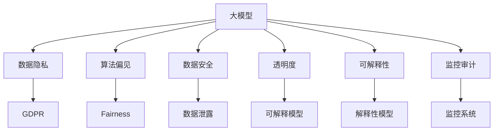

                 

# 大模型企业的风险管理与合规策略

> 关键词：大模型,风险管理,合规策略,数据隐私,算法偏见,数据安全,透明度,公平性,监控审计

## 1. 背景介绍

### 1.1 问题由来

随着人工智能技术的发展，尤其是深度学习和自然语言处理领域的突破，大模型企业如OpenAI、Google等迅速崛起，广泛应用于搜索、推荐、客服、翻译等业务场景，显著提升了用户体验和企业效率。然而，伴随而来的是诸多的风险和挑战。

- **数据隐私**：大模型企业广泛使用用户数据进行训练，如何保障数据隐私和用户权益成为一大难题。
- **算法偏见**：模型基于历史数据训练，可能会继承数据中的偏见，导致输出结果的不公平和歧视性。
- **数据安全**：模型依赖于高质量数据，如何保证数据来源的安全和数据的完整性至关重要。
- **透明度和可解释性**：大模型的决策过程复杂，用户难以理解和信任，需要提升模型的透明度和可解释性。
- **公平性**：不同群体对模型的响应可能存在差异，如何保证模型对所有群体的公平性是关键问题。
- **监控审计**：模型训练和运行过程中，如何实施有效的监控审计，及时发现并纠正问题，确保系统的可靠性和合规性。

### 1.2 问题核心关键点

本文档将围绕大模型企业的风险管理和合规策略进行全面探讨，重点在于以下几个方面：

1. **数据隐私和合规要求**：如何保障数据隐私，确保符合GDPR、CCPA等数据隐私法规要求。
2. **算法偏见和公平性**：如何检测和缓解算法偏见，确保模型对所有群体的公平性。
3. **数据安全和完整性**：如何保护数据来源的安全和数据的完整性，防止数据泄漏和篡改。
4. **透明度和可解释性**：如何提升模型的透明度和可解释性，增加用户信任。
5. **监控审计**：如何实施有效的监控审计，及时发现并纠正问题，确保系统的可靠性和合规性。

## 2. 核心概念与联系

### 2.1 核心概念概述

为更好地理解大模型企业的风险管理与合规策略，本节将介绍几个密切相关的核心概念：

- **大模型**：指基于深度学习算法，通过大规模数据训练得到的复杂神经网络模型，如GPT、BERT等。
- **数据隐私**：指在数据处理和存储过程中，保护个人身份和敏感信息不被泄露或滥用的措施。
- **算法偏见**：指在模型训练过程中，由于历史数据中存在的偏见，导致模型输出偏向某一特定群体或属性的现象。
- **公平性**：指模型输出应公平对待所有群体，不因种族、性别、年龄等特征而有所偏袒。
- **数据安全**：指保护数据在存储、传输和使用过程中不被未授权访问、篡改或破坏的措施。
- **透明度**：指模型的决策过程应是透明的，用户应能理解和信任模型的输出。
- **可解释性**：指模型应能提供清晰、易懂的解释，帮助用户理解模型的决策逻辑。
- **监控审计**：指定期对模型进行监控和审计，发现和纠正潜在的风险和问题。

这些核心概念之间的逻辑关系可以通过以下Mermaid流程图来展示：



这个流程图展示了大模型企业的核心概念及其之间的关系：

1. 大模型通过数据隐私、算法偏见、数据安全、透明度、可解释性和监控审计等保障措施，确保其合规性和可靠性。
2. 数据隐私和算法偏见是模型可靠性的重要保障，需要严格遵守相关法规和标准。
3. 数据安全和透明度直接影响模型应用的广泛性和可信度。
4. 监控审计是模型维护和改进的关键手段，定期实施监控审计可以及时发现并纠正问题。

这些概念共同构成了大模型企业的风险管理和合规策略的基础框架，使其能够在全球范围内合法、合规地运营和发展。

## 3. 核心算法原理 & 具体操作步骤
### 3.1 算法原理概述

大模型企业的风险管理和合规策略，本质上是一个多目标优化问题。其核心思想是通过优化模型的训练和运行流程，平衡性能和合规性，保障数据隐私和算法公平性，提升模型的透明度和可解释性，同时实施有效的监控审计，确保系统的可靠性和合规性。

形式化地，假设目标为最大化模型性能 $P$ 的同时，最小化风险和合规成本 $C$，则优化目标为：

$$
\max_{\theta} P(\theta) - \min_{\theta} C(\theta)
$$

其中 $P$ 为模型性能，$C$ 为风险和合规成本，$\theta$ 为模型参数。优化过程需要考虑多方面因素，包括数据隐私、算法偏见、数据安全、透明度、可解释性、监控审计等。

### 3.2 算法步骤详解

大模型企业的风险管理和合规策略的实现过程，一般包括以下几个关键步骤：

**Step 1: 数据隐私保护**

- 数据匿名化：对敏感数据进行去标识化处理，如差分隐私技术、数据加密等。
- 数据脱敏：对敏感数据进行掩码处理，如随机化、置换等。
- 访问控制：限制对敏感数据的访问权限，仅授权特定人员或系统进行访问。
- 数据使用记录：对数据的使用情况进行详细记录，确保数据使用符合法规要求。

**Step 2: 算法偏见检测和缓解**

- 偏见检测：通过统计分析和模型评估，检测模型输出中的偏见。
- 偏见缓解：采用去偏策略，如重采样、对抗训练、公平性约束等，减少模型的偏见。
- 公平性评估：使用公平性指标，如差异平均绝对误差、互信息等，评估模型对不同群体的公平性。

**Step 3: 数据安全保障**

- 数据加密：对数据进行加密存储和传输，防止数据泄露。
- 数据备份：定期对数据进行备份，防止数据丢失或损坏。
- 访问审计：对数据访问行为进行审计，防止未授权访问。
- 数据完整性验证：对数据进行完整性检查，防止数据篡改。

**Step 4: 提升透明度和可解释性**

- 可解释模型构建：采用可解释性模型，如决策树、规则模型等，提升模型的透明度。
- 模型解释工具：开发模型解释工具，如LIME、SHAP等，帮助用户理解模型的决策过程。
- 用户教育和培训：通过教育和培训，提高用户对模型决策的理解和信任。

**Step 5: 实施监控审计**

- 模型监控：实时监控模型的运行状态和性能指标，及时发现异常。
- 审计日志记录：对模型运行日志进行记录，便于事后审计和追踪。
- 异常检测：使用异常检测算法，及时发现和处理潜在风险。
- 问题纠正：根据监控和审计结果，及时纠正模型问题和漏洞。

### 3.3 算法优缺点

大模型企业的风险管理和合规策略的实现过程，具有以下优点：

1. **全面性**：通过多目标优化，平衡模型性能和合规性，确保模型在合规的前提下取得最佳性能。
2. **系统性**：通过系统化的流程，从数据隐私、算法偏见、数据安全、透明度、可解释性、监控审计等多个方面进行全面保障。
3. **主动性**：通过定期的监控审计，主动发现和纠正问题，确保系统的可靠性和合规性。

同时，该过程也存在一些局限性：

1. **成本高**：实施多方面的保障措施，需要投入大量人力、物力和财力，成本较高。
2. **复杂性高**：涉及数据隐私、算法偏见、数据安全、透明度、可解释性、监控审计等多个方面，实现过程复杂。
3. **技术门槛高**：需要具备数据隐私、算法偏见检测、模型解释、监控审计等多方面的专业知识和技术能力。

尽管存在这些局限性，但就目前而言，多目标优化的策略是实现大模型企业风险管理和合规策略的最佳方式。

### 3.4 算法应用领域

基于多目标优化的大模型企业风险管理和合规策略，已经在多个行业领域得到应用，例如：

- 金融行业：使用大模型进行信贷评估、欺诈检测、风险管理等，需保障数据隐私和算法公平性，确保合规性。
- 医疗行业：使用大模型进行疾病预测、治疗方案推荐等，需保护患者隐私，确保模型透明度和可解释性。
- 零售行业：使用大模型进行个性化推荐、库存管理等，需保障用户数据安全，实施有效的监控审计。
- 教育行业：使用大模型进行学习推荐、课程评估等，需提升模型的透明度和可解释性，确保公平性。

除了上述这些行业外，大模型企业风险管理和合规策略的应用还涵盖了更多场景，如智能客服、智能安防、智能制造等，为各行各业带来了新的发展机遇。

## 4. 数学模型和公式 & 详细讲解 & 举例说明

### 4.1 数学模型构建

本节将使用数学语言对大模型企业的风险管理和合规策略进行更加严格的刻画。

记大模型为 $M_{\theta}$，其中 $\theta$ 为模型参数。假设目标为最大化模型性能 $P$ 的同时，最小化风险和合规成本 $C$，则优化目标为：

$$
\max_{\theta} P(\theta) - \min_{\theta} C(\theta)
$$

在实践中，通常采用多目标优化算法（如NSGA-II、SPEA2等）来近似求解上述最优化问题。设 $P(\theta)$ 为模型性能指标，$C(\theta)$ 为风险和合规成本指标，则优化问题可以转化为单目标优化问题：

$$
\max_{\theta} \frac{P(\theta)}{C(\theta)}
$$

其中 $P(\theta)$ 和 $C(\theta)$ 分别表示模型性能和风险和合规成本的加权和。

### 4.2 公式推导过程

以下我们以金融行业的信贷评估为例，推导风险管理和合规策略的数学模型。

假设金融机构的信贷评估模型为 $M_{\theta}$，其中 $\theta$ 为模型参数。设模型在历史数据集 $\mathcal{D}=\{(x_i,y_i)\}_{i=1}^N$ 上的性能指标为 $P(M_{\theta})$，风险和合规成本为 $C(M_{\theta})$。优化目标为：

$$
\max_{\theta} P(M_{\theta}) - \min_{\theta} C(M_{\theta})
$$

其中 $P(M_{\theta})$ 为模型的准确率，$C(M_{\theta})$ 为数据隐私损失、算法偏见、数据安全等成本的加权和。

根据多目标优化问题的求解方法，可以通过求解单目标优化问题：

$$
\max_{\theta} \frac{P(M_{\theta})}{C(M_{\theta})}
$$

来逼近上述多目标优化问题的解。

### 4.3 案例分析与讲解

假设某金融机构使用大模型进行信贷评估，模型的性能指标为准确率 $P$，风险和合规成本为 $C$。在模型训练和运行过程中，需要实施以下保障措施：

- 数据隐私：使用差分隐私技术对客户数据进行去标识化处理，确保数据隐私。
- 算法偏见：通过重新采样和对抗训练等方法，检测和缓解模型偏见。
- 数据安全：使用加密技术对客户数据进行存储和传输，防止数据泄露。
- 透明度：使用决策树模型解释模型的决策过程，提高模型的透明度。
- 可解释性：开发模型解释工具，帮助用户理解模型的决策过程。
- 监控审计：实时监控模型的运行状态和性能指标，及时发现和处理异常。

在多目标优化问题的求解过程中，可以使用以下步骤：

1. 定义性能指标 $P$ 和风险和合规成本 $C$，如准确率、数据隐私损失、算法偏见等。
2. 设定权重，平衡模型性能和合规性。
3. 使用多目标优化算法，求解最优模型参数 $\theta^*$。
4. 在训练集上评估模型性能，确保合规性。
5. 在验证集上评估模型性能，确保合规性。
6. 在测试集上评估模型性能，确保合规性。

## 5. 项目实践：代码实例和详细解释说明

### 5.1 开发环境搭建

在进行大模型企业的风险管理和合规策略开发前，我们需要准备好开发环境。以下是使用Python进行PyTorch开发的环境配置流程：

1. 安装Anaconda：从官网下载并安装Anaconda，用于创建独立的Python环境。

2. 创建并激活虚拟环境：
```bash
conda create -n pytorch-env python=3.8 
conda activate pytorch-env
```

3. 安装PyTorch：根据CUDA版本，从官网获取对应的安装命令。例如：
```bash
conda install pytorch torchvision torchaudio cudatoolkit=11.1 -c pytorch -c conda-forge
```

4. 安装TensorFlow：
```bash
conda install tensorflow -c conda-forge
```

5. 安装各类工具包：
```bash
pip install numpy pandas scikit-learn matplotlib tqdm jupyter notebook ipython
```

完成上述步骤后，即可在`pytorch-env`环境中开始开发。

### 5.2 源代码详细实现

这里我们以金融行业的信贷评估任务为例，给出使用TensorFlow进行模型训练和风险管理的PyTorch代码实现。

首先，定义信贷评估模型的损失函数和优化器：

```python
import tensorflow as tf

# 定义模型损失函数
def loss_fn(model, x, y):
    logits = model(x)
    return tf.losses.sparse_softmax_cross_entropy(y, logits)

# 定义优化器
optimizer = tf.keras.optimizers.Adam(lr=0.001)
```

然后，定义风险和合规成本函数：

```python
# 定义数据隐私损失函数
def privacy_loss_fn(model, x, y):
    losses = tf.distribute.Strategy().all_reduce(tf.losses.sparse_softmax_cross_entropy(y, model(x)))
    return tf.reduce_mean(losses)

# 定义算法偏见函数
def bias_fn(model, x, y):
    bias = tf.keras.metrics.Bias()
    for _ in range(100):
        y_pred = model(x)
        bias.update_state(y_pred, y)
    return bias.result().numpy()
```

接着，定义训练和评估函数：

```python
# 定义训练函数
def train(model, train_dataset, epochs):
    model.compile(optimizer=optimizer, loss=loss_fn)
    model.fit(train_dataset, epochs=epochs)

# 定义评估函数
def evaluate(model, test_dataset):
    metrics = tf.keras.metrics.Mean()
    for x, y in test_dataset:
        y_pred = model(x)
        metrics.update_state(y_pred, y)
    return metrics.result().numpy()

# 定义监控和审计函数
def audit(model, audit_dataset):
    metrics = tf.keras.metrics.Bias()
    for x, y in audit_dataset:
        y_pred = model(x)
        metrics.update_state(y_pred, y)
    return metrics.result().numpy()
```

最后，启动训练流程并在测试集上评估：

```python
# 加载数据集
train_dataset = tf.data.Dataset.from_tensor_slices((train_x, train_y))
test_dataset = tf.data.Dataset.from_tensor_slices((test_x, test_y))
audit_dataset = tf.data.Dataset.from_tensor_slices((audit_x, audit_y))

# 训练模型
train(train_dataset, epochs=10)

# 评估模型
performance = evaluate(test_dataset)
print(f"Model performance: {performance}")

# 审计模型
bias = audit(audit_dataset)
print(f"Model bias: {bias}")
```

以上就是使用TensorFlow对金融行业的信贷评估模型进行训练和风险管理的完整代码实现。可以看到，通过合理的损失函数和优化器设计，结合风险和合规成本函数，我们可以在模型训练过程中同时考虑模型性能和风险合规性。

### 5.3 代码解读与分析

让我们再详细解读一下关键代码的实现细节：

**性能指标函数**：
- `loss_fn`：定义模型损失函数，使用交叉熵损失函数。
- `privacy_loss_fn`：定义数据隐私损失函数，通过分布式训练计算所有样本的损失。
- `bias_fn`：定义算法偏见函数，使用多次迭代更新偏置度量指标。

**训练和评估函数**：
- `train`：定义模型训练函数，使用Adam优化器进行梯度下降。
- `evaluate`：定义模型评估函数，计算模型在测试集上的性能指标。
- `audit`：定义模型审计函数，计算模型在不同审计集上的偏见度量指标。

**训练流程**：
- 加载数据集，包括训练集、测试集和审计集。
- 在训练集上训练模型。
- 在测试集上评估模型性能。
- 在审计集上评估模型偏见。

可以看到，TensorFlow提供了丰富的工具和框架，可以方便地实现多目标优化的风险管理和合规策略。开发者可以将更多精力放在模型设计和优化上，而不必过多关注底层的实现细节。

## 6. 实际应用场景

### 6.1 智能客服系统

基于大模型企业的风险管理和合规策略，智能客服系统可以更好地保障用户数据隐私和算法公平性，提升系统的透明度和可解释性，确保系统的可靠性和合规性。

在技术实现上，可以收集客户的历史通话记录，将客户信息进行去标识化处理，保护客户隐私。同时，在智能客服模型中引入对抗训练和公平性约束，缓解算法偏见，确保模型对所有客户的公平性。此外，使用决策树等可解释模型，解释智能客服的决策过程，提升模型的透明度和用户信任。

### 6.2 医疗行业

在医疗行业中，使用大模型进行疾病预测和治疗方案推荐时，需严格保障数据隐私和算法公平性，确保模型的透明度和可解释性，实施有效的监控审计。

具体而言，可以收集患者的医疗记录和诊断数据，对其进行去标识化处理，保障患者隐私。同时，在模型训练过程中引入公平性约束，确保模型对所有群体的公平性。使用可解释模型解释模型的决策过程，提升模型的透明度和可解释性。实施定期的监控审计，及时发现和处理潜在问题。

### 6.3 零售行业

零售行业使用大模型进行个性化推荐时，需严格保障用户数据隐私和算法公平性，确保模型的透明度和可解释性，实施有效的监控审计。

具体而言，可以收集用户的浏览和购买数据，对其进行去标识化处理，保障用户隐私。同时，在模型训练过程中引入公平性约束，确保模型对所有用户的公平性。使用可解释模型解释模型的决策过程，提升模型的透明度和用户信任。实施定期的监控审计，及时发现和处理潜在问题。

### 6.4 未来应用展望

随着大模型技术的不断进步，基于多目标优化的风险管理和合规策略将在更多领域得到应用，为各行各业带来新的发展机遇。

在智慧城市治理中，使用大模型进行城市事件监测和舆情分析时，需严格保障数据隐私和算法公平性，确保模型的透明度和可解释性，实施有效的监控审计。

在智能制造领域，使用大模型进行供应链管理、质量检测时，需严格保障数据隐私和算法公平性，确保模型的透明度和可解释性，实施有效的监控审计。

此外，在大模型技术不断发展的同时，如何进一步提升模型的安全性、公平性和可靠性，也是未来研究的重要方向。相信随着学界和产业界的共同努力，基于多目标优化的风险管理和合规策略必将在全球范围内得到广泛应用，为各行各业带来新的突破。

## 7. 工具和资源推荐

### 7.1 学习资源推荐

为了帮助开发者系统掌握大模型企业的风险管理和合规策略的理论基础和实践技巧，这里推荐一些优质的学习资源：

1. 《数据隐私保护与合规》系列博文：由数据隐私专家撰写，深入浅出地介绍了数据隐私保护和合规要求的最新进展和最佳实践。

2. 《算法偏见检测与缓解》课程：斯坦福大学开设的AI伦理课程，讲解了算法偏见检测和缓解的方法和工具，帮助开发者理解算法公平性问题。

3. 《机器学习模型的透明性与可解释性》书籍：介绍机器学习模型的透明性和可解释性，包括可解释模型的构建和解释工具的使用。

4. 《数据安全与加密》课程：MIT公开课，讲解了数据安全与加密的原理和实践，帮助开发者保护数据安全。

5. 《模型监控与审计》在线课程：Coursera上的课程，讲解了模型监控和审计的原理和实践，帮助开发者实施有效的监控审计。

通过对这些资源的学习实践，相信你一定能够快速掌握大模型企业的风险管理和合规策略的精髓，并用于解决实际的业务问题。

### 7.2 开发工具推荐

高效的开发离不开优秀的工具支持。以下是几款用于大模型企业风险管理和合规策略开发的常用工具：

1. PyTorch：基于Python的开源深度学习框架，灵活动态的计算图，适合快速迭代研究。大部分预训练语言模型都有PyTorch版本的实现。

2. TensorFlow：由Google主导开发的开源深度学习框架，生产部署方便，适合大规模工程应用。同样有丰富的预训练语言模型资源。

3. TensorFlow Data Validation（TF DV）：用于数据质量检查的工具，可以检查数据的完整性、一致性和隐私性，确保数据安全。

4. Fairness Indicators：用于检测和缓解算法偏见的工具，提供多种公平性指标和去偏策略。

5. Weights & Biases：模型训练的实验跟踪工具，可以记录和可视化模型训练过程中的各项指标，方便对比和调优。

6. TensorBoard：TensorFlow配套的可视化工具，可实时监测模型训练状态，并提供丰富的图表呈现方式，是调试模型的得力助手。

合理利用这些工具，可以显著提升大模型企业风险管理和合规策略的开发效率，加快创新迭代的步伐。

### 7.3 相关论文推荐

大模型企业风险管理和合规策略的发展源于学界的持续研究。以下是几篇奠基性的相关论文，推荐阅读：

1. Fairness Indicators：A Simple Tool for Fairness-Aware Machine Learning：介绍了一种简单的公平性检测工具，帮助开发者检测和缓解算法偏见。

2. Explainable Artificial Intelligence (XAI)：指导原则与标准：由AI伦理组织定义的XAI指导原则和标准，帮助开发者提升模型的透明度和可解释性。

3. Adversarial Machine Learning：概念与现状：介绍了对抗性机器学习的研究现状和应用，帮助开发者提升模型的鲁棒性。

4. Secure and Privacy-Preserving Machine Learning：概述：概述了数据隐私保护和机器学习结合的研究现状和挑战，帮助开发者保护数据隐私。

这些论文代表了大模型企业风险管理和合规策略的发展脉络。通过学习这些前沿成果，可以帮助研究者把握学科前进方向，激发更多的创新灵感。

## 8. 总结：未来发展趋势与挑战

### 8.1 总结

本文对大模型企业的风险管理和合规策略进行了全面系统的介绍。首先阐述了大模型企业在数据隐私、算法偏见、数据安全、透明度、可解释性、监控审计等领域的风险管理需求，明确了合规性对企业发展和用户信任的重要性。其次，从原理到实践，详细讲解了多目标优化的数学模型和算法步骤，给出了风险管理和合规策略的代码实例和详细解释说明。同时，本文还广泛探讨了该策略在智能客服、医疗、零售等多个行业领域的应用前景，展示了多目标优化的巨大潜力。

通过本文的系统梳理，可以看到，多目标优化的风险管理和合规策略是大模型企业运营和发展的重要保障。这些策略帮助企业平衡性能和合规性，确保模型在合规的前提下取得最佳性能，同时提升系统的透明度和可解释性，保障数据隐私和算法公平性，实施有效的监控审计，确保系统的可靠性和合规性。

### 8.2 未来发展趋势

展望未来，大模型企业风险管理和合规策略将呈现以下几个发展趋势：

1. **自动化和智能化**：随着自动化机器学习、智能监控等技术的发展，未来的风险管理和合规策略将更加智能化、自动化，减少人工干预，提升效率。

2. **多目标优化**：未来的风险管理和合规策略将更加注重多目标优化，平衡模型性能和合规性，确保模型在合规的前提下取得最佳性能。

3. **分布式和边缘计算**：随着分布式计算和边缘计算技术的发展，未来的风险管理和合规策略将更加注重分布式和边缘计算，提升系统的可扩展性和响应速度。

4. **透明性和可解释性**：未来的风险管理和合规策略将更加注重透明性和可解释性，通过可解释模型和解释工具，提升用户对系统的信任。

5. **隐私保护和数据安全**：未来的风险管理和合规策略将更加注重隐私保护和数据安全，通过隐私保护技术、数据加密技术等，保障数据隐私和数据安全。

6. **公平性和反偏见**：未来的风险管理和合规策略将更加注重公平性和反偏见，通过去偏策略、公平性约束等方法，减少算法偏见，确保模型对所有群体的公平性。

以上趋势凸显了大模型企业风险管理和合规策略的广阔前景。这些方向的探索发展，必将进一步提升系统的可靠性、透明性和公平性，为人工智能技术在垂直行业的规模化落地提供坚实保障。

### 8.3 面临的挑战

尽管大模型企业风险管理和合规策略已经取得了显著进展，但在迈向更加智能化、普适化应用的过程中，仍面临诸多挑战：

1. **技术复杂性**：多目标优化的策略涉及多方面的保障措施，需要综合考虑数据隐私、算法偏见、数据安全、透明度、可解释性、监控审计等多个方面，技术实现复杂。

2. **数据成本高**：保障数据隐私和公平性需要大量的标注数据，数据收集和处理成本较高。

3. **模型鲁棒性不足**：模型面对未见过的数据时，泛化性能往往不佳，需要进一步提升模型的鲁棒性和泛化能力。

4. **用户隐私保护**：如何在保护用户隐私的同时，提供优质的服务，是一个重要的平衡问题。

5. **合规法规变化**：不同国家和地区的法律法规变化较快，企业需要不断更新合规策略，确保符合最新法规要求。

6. **数据安全威胁**：大模型企业面临更复杂的数据安全威胁，需要采取更有效的防护措施。

7. **算力成本高**：多目标优化的策略需要大量的计算资源，算力成本较高。

尽管存在这些挑战，但随着技术的进步和法规的完善，大模型企业风险管理和合规策略必将不断优化，为系统可靠性和用户信任提供坚实保障。

### 8.4 研究展望

面对大模型企业风险管理和合规策略所面临的诸多挑战，未来的研究需要在以下几个方面寻求新的突破：

1. **自动化和智能化**：开发自动化机器学习工具，减少人工干预，提升效率。

2. **多目标优化**：研发更加高效的多目标优化算法，平衡模型性能和合规性。

3. **分布式和边缘计算**：研究分布式和边缘计算技术，提升系统的可扩展性和响应速度。

4. **透明性和可解释性**：开发更加可解释的模型和解释工具，提升模型的透明度和可解释性。

5. **隐私保护和数据安全**：研究更有效的隐私保护技术、数据加密技术，保障数据隐私和数据安全。

6. **公平性和反偏见**：研发更加有效的去偏策略和公平性约束，减少算法偏见，确保模型对所有群体的公平性。

7. **法规和标准**：研究和制定更加完善的法规和标准，指导大模型企业合规运营。

这些研究方向的探索，必将引领大模型企业风险管理和合规策略的进一步优化，为人工智能技术在垂直行业的规模化落地提供坚实保障。面向未来，大模型企业需要从数据、算法、法规、技术等多个维度协同发力，共同推动自然语言理解和智能交互系统的进步。只有勇于创新、敢于突破，才能不断拓展语言模型的边界，让智能技术更好地造福人类社会。

## 9. 附录：常见问题与解答

**Q1：大模型企业的风险管理和合规策略是否适用于所有企业？**

A: 大模型企业的风险管理和合规策略主要适用于涉及大量用户数据和复杂算法模型的企业，如金融、医疗、零售等。但对于一些不需要大规模数据和复杂算法的企业，可能不适用。

**Q2：如何平衡模型性能和合规性？**

A: 在多目标优化过程中，可以设定不同的权重，平衡模型性能和合规性。通常情况下，模型性能的权重稍大，但合规性的权重也不应忽略。通过不断调整权重，可以找到最优的平衡点。

**Q3：如何在保护数据隐私的同时，提供优质的服务？**

A: 可以使用差分隐私、数据加密等技术保护数据隐私，同时结合多目标优化的策略，提升模型的性能和公平性，确保提供优质的服务。

**Q4：如何检测和缓解算法偏见？**

A: 可以使用公平性指标检测算法偏见，通过重采样、对抗训练、公平性约束等方法缓解偏见。

**Q5：如何实施有效的监控审计？**

A: 可以实时监测模型的运行状态和性能指标，定期审计模型输出和行为，发现和纠正潜在问题。

通过本文的系统梳理，可以看到，多目标优化的风险管理和合规策略是大模型企业运营和发展的重要保障。这些策略帮助企业平衡性能和合规性，确保模型在合规的前提下取得最佳性能，同时提升系统的透明度和可解释性，保障数据隐私和算法公平性，实施有效的监控审计，确保系统的可靠性和合规性。未来，随着技术的不断进步和法规的不断完善，基于多目标优化的风险管理和合规策略必将在全球范围内得到广泛应用，为各行各业带来新的突破。

