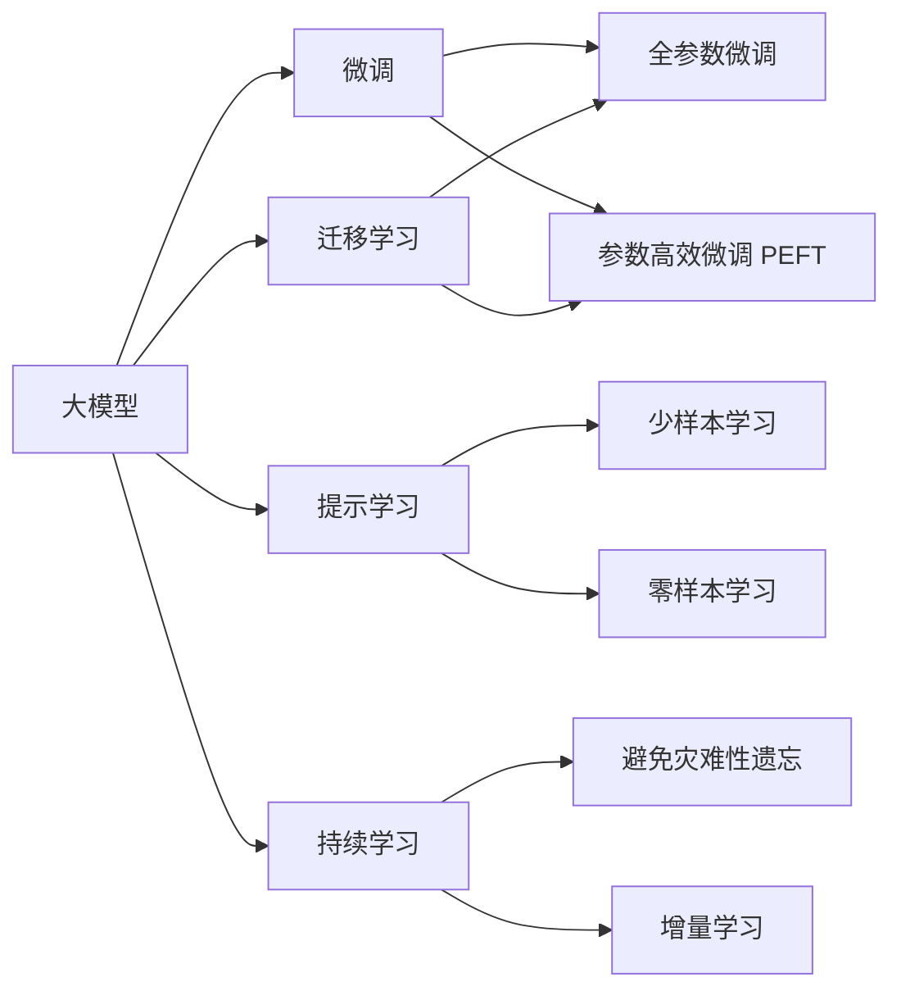

                 

## 1. 背景介绍

### 1.1 问题由来
近年来，随着人工智能（AI）技术的快速进步，大模型成为众多创业公司的热点，并迅速从实验室走向实际应用。从NLP领域如BERT、GPT-3到计算机视觉领域如DALL·E、CLIP，大模型通过大规模预训练获取通用能力，并在特定任务上通过微调获得更优表现。它们不仅改变了产品开发模式，也在塑造新的商业生态。

然而，这些大模型往往需要极高的数据和计算资源，创业公司如何构建高效、低成本的AI模型，是亟待解决的问题。本文将围绕大模型创业公司的技术挑战和创新机遇展开讨论。

### 1.2 问题核心关键点
大模型创业公司面临的主要挑战和机遇包括：

- **数据获取与标注成本**：大模型训练需要大规模数据，高质量标注数据的获取成本高，且难以保证标注质量。
- **计算资源限制**：大模型参数量巨大，训练和推理需要高性能计算设备，创业公司资源有限。
- **算法与模型优化**：现有大模型的性能瓶颈，如推理速度慢、资源占用大等问题，需通过算法和模型优化解决。
- **应用场景拓展**：如何从大模型中提取通用能力，应用到更多垂直领域，实现商业化应用。
- **市场与用户接受度**：如何让用户理解和接受新模型带来的产品和服务，提高用户粘性。

## 2. 核心概念与联系

### 2.1 核心概念概述

大模型创业公司成功与否，核心在于如何在大规模预训练和微调的基础上，构建高效、可靠、易用的AI模型。以下是相关核心概念及其关联：

- **大模型（Large Model）**：指通过大规模数据预训练获得的通用能力模型，如BERT、GPT-3等。它们具有强大的泛化能力，可应用于多领域任务。
- **微调（Fine-tuning）**：在特定任务上对大模型进行小规模数据训练，以提升模型在该任务上的性能。常见微调方法包括全参数微调和参数高效微调（PEFT）。
- **迁移学习（Transfer Learning）**：利用预训练模型的通用能力，迁移到特定领域进行微调，提升模型性能。
- **参数高效微调（Parameter-Efficient Fine-Tuning, PEFT）**：仅更新少量模型参数，以提高微调效率和效果。
- **提示学习（Prompt Learning）**：通过精心设计的输入文本格式，引导模型进行特定任务推理，避免参数更新。

### 2.2 核心概念原理和架构的 Mermaid 流程图



## 3. 核心算法原理 & 具体操作步骤

### 3.1 算法原理概述

大模型创业公司的核心算法原理是利用大规模数据预训练获得通用能力，然后在特定任务上通过微调提升性能。微调通过小规模数据训练调整模型，使其适应新任务，提升模型在特定领域的性能。

核心算法流程包括：

1. 预训练：在大规模无标签数据上训练大模型，学习语言或视觉的通用表示。
2. 微调：在特定任务的数据上训练微调后的模型，以适应该任务的需求。
3. 迁移学习：将预训练模型应用于新任务，通过微调获得更好性能。
4. 参数高效微调：仅更新少量模型参数，提高微调效率和效果。
5. 提示学习：通过设计特定输入格式，引导模型推理，避免参数更新。

### 3.2 算法步骤详解

#### 3.2.1 数据准备

- **数据收集**：收集适合特定任务的数据，保证数据量和质量。
- **数据预处理**：对数据进行清洗、标注等处理，保证数据一致性和可用性。

#### 3.2.2 模型选择与适配

- **模型选择**：选择合适的预训练大模型，如BERT、GPT-3等。
- **任务适配**：根据任务类型，设计合适的任务适配层和损失函数。

#### 3.2.3 超参数设置

- **学习率**：设置适当的学习率，通常比从头训练小。
- **正则化**：引入L2正则、Dropout、Early Stopping等技术防止过拟合。
- **模型结构**：选择部分层进行微调，或仅微调顶层。

#### 3.2.4 模型训练与评估

- **模型训练**：使用小批量数据进行前向传播和反向传播，更新模型参数。
- **模型评估**：在验证集上评估模型性能，决定是否提前停止。
- **模型测试**：在测试集上评估模型性能，对比微调前后效果。

### 3.3 算法优缺点

#### 3.3.1 优点

- **效率高**：微调可以在短时间内提升模型性能，适合创业公司快速迭代。
- **泛化能力强**：预训练大模型具有强大的泛化能力，可在多个任务上应用。
- **适应性强**：微调方法适用于多种任务，如分类、匹配、生成等。

#### 3.3.2 缺点

- **数据依赖**：微调依赖于标注数据，数据质量不高或标注成本高。
- **过拟合风险**：小样本数据微调易过拟合，需正则化技术防止。
- **资源消耗大**：大规模模型训练和推理资源消耗大。

### 3.4 算法应用领域

大模型创业公司的算法应用领域广泛，包括：

- **自然语言处理（NLP）**：如文本分类、命名实体识别、机器翻译等。
- **计算机视觉**：如图像分类、目标检测、图像生成等。
- **语音识别**：如语音命令识别、情感分析、说话人识别等。
- **推荐系统**：如商品推荐、内容推荐等。
- **医疗健康**：如疾病诊断、患者情绪分析等。

## 4. 数学模型和公式 & 详细讲解 & 举例说明

### 4.1 数学模型构建

以自然语言处理（NLP）任务中的文本分类为例，构建数学模型。设预训练模型为$M_{\theta}$，其中$\theta$为预训练得到的模型参数。给定分类任务的训练集$D=\{(x_i, y_i)\}_{i=1}^N$，其中$x_i$为输入文本，$y_i$为标签，$M_{\theta}(x_i)$为模型输出，损失函数为交叉熵损失：

$$
\mathcal{L}(\theta) = -\frac{1}{N} \sum_{i=1}^N y_i \log M_{\theta}(x_i) + (1 - y_i) \log (1 - M_{\theta}(x_i))
$$

微调目标为最小化损失函数：

$$
\theta^* = \mathop{\arg\min}_{\theta} \mathcal{L}(\theta)
$$

### 4.2 公式推导过程

微调的优化目标是最小化经验风险，通常使用梯度下降等优化算法更新参数$\theta$。设优化算法为$Opt$，则微调过程为：

$$
\theta_{t+1} = Opt(\theta_t, \nabla_{\theta}\mathcal{L}(\theta_t), \alpha)
$$

其中$\alpha$为学习率，$\nabla_{\theta}\mathcal{L}(\theta_t)$为损失函数对参数的梯度，$Opt$为优化算法。

### 4.3 案例分析与讲解

以BERT模型为例，假设任务为情感分析。

1. **数据准备**：收集情感标注数据，如IMDB电影评论数据集。
2. **模型选择**：使用BERT预训练模型。
3. **任务适配**：在顶部添加线性分类器和交叉熵损失函数。
4. **微调**：使用AdamW优化器，设置学习率为1e-5，正则化系数为0.001，迭代100轮。
5. **评估**：在验证集上评估模型性能，调整学习率，再测试集上测试模型性能。

## 5. 项目实践：代码实例和详细解释说明

### 5.1 开发环境搭建

- **Python**：安装Python 3.7及以上版本。
- **PyTorch**：安装最新版本的PyTorch。
- **BERT**：使用预训练的BERT模型。

### 5.2 源代码详细实现

```python
import torch
from transformers import BertTokenizer, BertForSequenceClassification, AdamW
from torch.utils.data import Dataset, DataLoader

class MyDataset(Dataset):
    def __init__(self, texts, labels):
        self.texts = texts
        self.labels = labels
        self.tokenizer = BertTokenizer.from_pretrained('bert-base-uncased')
    
    def __len__(self):
        return len(self.texts)
    
    def __getitem__(self, idx):
        text = self.texts[idx]
        label = self.labels[idx]
        encoding = self.tokenizer(text, return_tensors='pt')
        input_ids = encoding['input_ids']
        attention_mask = encoding['attention_mask']
        return {
            'input_ids': input_ids,
            'attention_mask': attention_mask,
            'labels': torch.tensor(label, dtype=torch.long)
        }

train_dataset = MyDataset(train_texts, train_labels)
test_dataset = MyDataset(test_texts, test_labels)

device = torch.device('cuda') if torch.cuda.is_available() else torch.device('cpu')
model = BertForSequenceClassification.from_pretrained('bert-base-uncased', num_labels=2)
model.to(device)
optimizer = AdamW(model.parameters(), lr=1e-5)

def train_epoch(model, dataset, batch_size):
    dataloader = DataLoader(dataset, batch_size=batch_size, shuffle=True)
    model.train()
    epoch_loss = 0
    for batch in dataloader:
        input_ids = batch['input_ids'].to(device)
        attention_mask = batch['attention_mask'].to(device)
        labels = batch['labels'].to(device)
        model.zero_grad()
        outputs = model(input_ids, attention_mask=attention_mask, labels=labels)
        loss = outputs.loss
        epoch_loss += loss.item()
        loss.backward()
        optimizer.step()
    return epoch_loss / len(dataloader)

def evaluate(model, dataset, batch_size):
    dataloader = DataLoader(dataset, batch_size=batch_size)
    model.eval()
    preds, labels = [], []
    with torch.no_grad():
        for batch in dataloader:
            input_ids = batch['input_ids'].to(device)
            attention_mask = batch['attention_mask'].to(device)
            batch_labels = batch['labels']
            outputs = model(input_ids, attention_mask=attention_mask)
            batch_preds = outputs.logits.argmax(dim=1).to('cpu').tolist()
            batch_labels = batch_labels.to('cpu').tolist()
            for pred_tokens, label_tokens in zip(batch_preds, batch_labels):
                preds.append(pred_tokens)
                labels.append(label_tokens)
    
    return preds, labels

train_loss = train_epoch(model, train_dataset, batch_size=16)
test_preds, test_labels = evaluate(model, test_dataset, batch_size=16)
print(f'Test Loss: {train_loss:.3f}, Accuracy: {sum(test_preds == test_labels) / len(test_preds):.2f}')
```

### 5.3 代码解读与分析

上述代码实现了一个简单的文本分类任务，使用BERT模型进行情感分析。

- **数据处理**：使用`MyDataset`类加载和处理数据。
- **模型选择与适配**：选择BERT模型，在顶部添加线性分类器。
- **微调**：使用AdamW优化器，设置学习率，进行梯度更新。
- **评估**：在测试集上评估模型性能，输出准确率。

### 5.4 运行结果展示

运行上述代码，可以得到模型在测试集上的准确率。

## 6. 实际应用场景

### 6.1 智能客服系统

智能客服系统是大模型创业公司的典型应用场景。传统客服依赖人工，高峰期响应慢、效率低，难以满足企业需求。基于大模型的微调，可以实现7x24小时不间断服务，快速响应客户咨询，提高服务效率和客户满意度。

### 6.2 金融舆情监测

金融机构需要实时监测市场舆情，规避金融风险。传统的监测方式成本高、效率低，难以应对海量信息爆发。基于大模型的微调，可以实现快速、自动的市场舆情监测，及时发现异常情况，帮助金融机构快速应对潜在风险。

### 6.3 个性化推荐系统

推荐系统需依赖用户历史行为数据，难以理解用户真实兴趣。大模型的微调可以挖掘用户语义信息，提高推荐精度和个性化程度，提升用户体验。

### 6.4 未来应用展望

未来，大模型创业公司将在更多领域发挥重要作用，如智慧医疗、智能教育、智慧城市等。随着预训练模型和微调方法的不断演进，AI技术将更深入地融入各行各业，推动社会数字化转型。

## 7. 工具和资源推荐

### 7.1 学习资源推荐

1. **CS224N《深度学习自然语言处理》课程**：斯坦福大学开设的NLP明星课程，涵盖NLP领域的核心概念和经典模型。
2. **Transformers官方文档**：提供了大量预训练模型的代码示例，适合快速上手。
3. **《自然语言处理入门》书籍**：由NLP专家撰写，适合初学者入门。

### 7.2 开发工具推荐

1. **PyTorch**：基于Python的开源深度学习框架，适合快速迭代开发。
2. **TensorFlow**：由Google主导的深度学习框架，适合大规模工程应用。
3. **Jupyter Notebook**：交互式笔记本环境，方便快速迭代和实验。

### 7.3 相关论文推荐

1. **《Attention is All You Need》**：提出Transformer结构，开启大模型预训练时代。
2. **《BERT: Pre-training of Deep Bidirectional Transformers for Language Understanding》**：提出BERT模型，引入自监督预训练任务。
3. **《Parameter-Efficient Transfer Learning for NLP》**：提出Adapter等参数高效微调方法，提升微调效果。

## 8. 总结：未来发展趋势与挑战

### 8.1 研究成果总结

大模型创业公司通过微调，实现了AI技术的快速落地应用，提升了各行各业的效率和智能化水平。预训练大模型在多领域任务上表现出强大泛化能力，推动了NLP、计算机视觉等领域的技术进步。

### 8.2 未来发展趋势

未来，大模型创业公司将继续拓展应用场景，如智能医疗、教育、城市治理等，推动AI技术在更多领域的落地应用。预训练模型和微调方法将不断进步，提升模型的通用性和鲁棒性。

### 8.3 面临的挑战

大模型创业公司仍面临数据获取、计算资源、算法优化等多重挑战。如何在有限资源下高效构建模型，提升模型性能，是未来的重要研究方向。

### 8.4 研究展望

未来的研究将集中在以下几个方向：

1. **参数高效微调**：开发更多高效的微调方法，减少资源消耗，提高微调效果。
2. **跨领域迁移学习**：探索如何在大模型中构建通用能力，支持更多领域的应用。
3. **自监督学习**：利用无监督数据预训练，减少对标注数据的依赖，降低成本。
4. **对抗训练**：提升模型的鲁棒性，避免过拟合和对抗攻击。
5. **模型压缩**：优化模型结构，提高推理效率，降低计算资源消耗。

## 9. 附录：常见问题与解答

### Q1: 大模型创业公司如何选择预训练模型？

A: 应根据应用场景选择合适的预训练模型。如自然语言处理任务可使用BERT、GPT-3等，计算机视觉任务可使用DALL·E、CLIP等。

### Q2: 大模型创业公司如何进行参数高效微调？

A: 参数高效微调（PEFT）方法通过仅更新少量模型参数，提高微调效率。如使用Adapter层、Transformer-XL等技术。

### Q3: 大模型创业公司如何提高模型的泛化能力？

A: 可以通过数据增强、对抗训练、迁移学习等方法提高模型的泛化能力。同时优化模型架构，提升模型的表达能力。

### Q4: 大模型创业公司如何降低模型的计算资源消耗？

A: 采用模型压缩、剪枝、量化等技术，减少模型参数量。同时优化模型计算图，提升推理效率。

### Q5: 大模型创业公司如何保证模型的伦理安全性？

A: 引入伦理导向的评估指标，过滤有害输出。同时加强人工干预和审核，确保模型行为符合伦理规范。

作者：禅与计算机程序设计艺术 / Zen and the Art of Computer Programming

