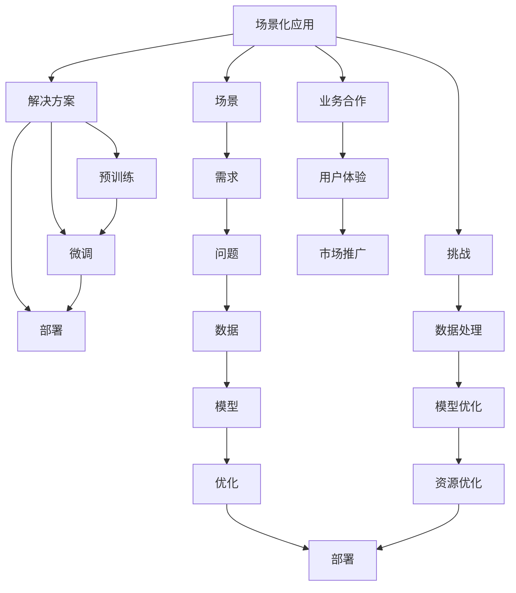

                 

# 大模型商业化落地的关键：场景化应用与解决方案

在人工智能技术迅猛发展的今天，大模型的商业化落地已成为各大企业和研究机构竞相追逐的目标。然而，如何将大模型的潜能转化为商业价值，实现其在实际场景中的高效应用，仍是摆在面前的一大挑战。本文将详细探讨大模型在商业化落地的关键问题，从场景化应用、解决方案到技术挑战，全方位解读大模型落地之路的精华所在。

## 1. 背景介绍

### 1.1 大模型概述

大模型（Large Models）通常指那些拥有数十亿至上百亿参数的深度学习模型，如GPT-3、BERT、T5等。这些模型通过在大规模无标签数据上预训练，学习到了丰富的语言知识和语义表示，具备强大的自然语言处理能力。其显著特点在于：

- 强大的通用能力：预训练大模型能够理解和生成自然语言，适用于多种自然语言处理任务。
- 参数量庞大：拥有大量可调节的参数，使其能够通过微调应对特定场景需求。
- 可扩展性强：大模型可以进一步细化和扩展，形成特定的领域模型，适应特定的应用场景。

### 1.2 大模型商业化的必要性

随着人工智能技术的不断成熟，大模型在商业应用中的价值愈发显著。具体来说：

- 降低开发成本：大模型的预训练可以大幅减少在实际应用中从头开始训练模型的成本和时间。
- 提升模型性能：大模型的知识积累使其在特定任务上能够取得比从头训练更好的效果。
- 提高应用效率：大模型通常具备更高的计算效率，在处理大规模数据和实时任务时表现优异。
- 推动行业升级：大模型的商业化应用，有助于加速各行各业的数字化转型和智能化升级。

## 2. 核心概念与联系

### 2.1 核心概念概述

为更好地理解大模型的商业化落地过程，本文将介绍几个关键概念：

- **场景化应用（Scenario-based Application）**：根据实际业务需求，定制化设计大模型应用方案，实现高效、精准、安全的商业化落地。
- **解决方案（Solution）**：提供一整套从预训练到微调，再到部署的完整技术解决方案，确保大模型在实际场景中的应用效果。
- **技术挑战（Technical Challenges）**：在商业化落地的过程中，面临的各类技术难题，包括数据处理、模型优化、部署等。
- **场景（Scenario）**：指特定业务环境中的实际需求和问题，如金融、医疗、教育等。

### 2.2 Mermaid流程图（核心概念联系）

以下是这些概念之间的逻辑关系，通过Mermaid流程图展示：



该流程图展示了从场景分析到具体技术实现的全过程：

1. 确定应用场景（A），并明确需求和问题（F, H）。
2. 设计解决方案（B），包括预训练（C）、微调（D）和部署（E）等环节。
3. 数据处理（I）、模型优化（J）、资源优化（P）等技术挑战（M）也是解决方案的重要组成部分。
4. 最终的解决方案要服务于具体场景（A），并确保良好的用户体验（R）和市场推广效果（S）。

## 3. 核心算法原理 & 具体操作步骤

### 3.1 算法原理概述

大模型的商业化落地过程可以分为以下几个主要步骤：

- **数据准备**：收集和预处理适用于特定场景的标注数据。
- **模型预训练**：使用大规模语料库对模型进行预训练，学习通用语言表示。
- **模型微调**：基于特定任务的标注数据，对模型进行有监督的微调，以适应特定场景的需求。
- **模型部署**：将微调后的模型部署到实际应用系统中，进行实时推理。

### 3.2 算法步骤详解

#### 3.2.1 数据准备

数据准备是商业化落地过程的第一步，具体包括以下步骤：

1. **数据收集**：根据应用场景，收集对应的数据集。如金融场景收集交易记录、客户评价等数据，医疗场景收集病历、诊断报告等数据。
2. **数据预处理**：清洗和整理数据，包括去噪、补全缺失值、标准化等操作。
3. **数据标注**：为数据集添加标签，确保数据的正确性。

#### 3.2.2 模型预训练

模型预训练是利用大规模无标签数据训练模型的过程。主要包括以下步骤：

1. **选择预训练模型**：选择合适的预训练模型，如BERT、GPT-3等，作为商业化落地的基础模型。
2. **预训练任务设计**：设计自监督或半监督的预训练任务，如掩码语言模型、填空任务等。
3. **预训练算法实现**：使用预训练算法，如Adam、SGD等，在预训练任务上训练模型。

#### 3.2.3 模型微调

模型微调是利用特定场景的标注数据，对预训练模型进行有监督的优化过程。主要包括以下步骤：

1. **选择微调任务**：根据应用场景，选择合适的微调任务，如命名实体识别、情感分析等。
2. **微调数据准备**：准备标注数据集，确保数据的多样性和准确性。
3. **微调算法实现**：使用微调算法，如AdamW、SGD等，在微调数据上训练模型。

#### 3.2.4 模型部署

模型部署是将微调后的模型部署到实际应用系统中的过程。主要包括以下步骤：

1. **模型集成**：将微调后的模型集成到应用系统中，如API接口、微服务、Web服务等。
2. **性能优化**：根据实际应用需求，对模型进行优化，如剪枝、量化等。
3. **实时推理**：使用优化后的模型进行实时推理，满足业务需求。

### 3.3 算法优缺点

#### 3.3.1 优点

- **灵活性高**：大模型预训练和微调可以针对特定场景进行定制，灵活性高。
- **效果显著**：大模型的知识积累使其在特定任务上通常能取得比从头训练更好的效果。
- **成本低**：预训练和微调成本相对较低，且可复用，避免从头训练的时间和资源投入。

#### 3.3.2 缺点

- **依赖标注数据**：微调过程依赖标注数据，标注成本较高。
- **模型复杂性**：大模型参数量庞大，训练和推理过程中资源消耗较大。
- **数据多样性要求高**：预训练和微调数据需与实际应用场景高度相关，数据多样性要求高。

### 3.4 算法应用领域

大模型的商业化落地已在多个领域得到应用，包括但不限于：

- **金融领域**：利用大模型进行金融舆情分析、风险预测、智能投顾等。
- **医疗领域**：利用大模型进行病历分析、诊断支持、药物研发等。
- **教育领域**：利用大模型进行智能答疑、学习内容推荐、在线教育等。
- **智能客服**：利用大模型进行客户对话、知识推理、情感分析等。
- **电商平台**：利用大模型进行商品推荐、智能搜索、客户行为分析等。

## 4. 数学模型和公式 & 详细讲解 & 举例说明

### 4.1 数学模型构建

大模型的商业化落地涉及多个数学模型，以下以命名实体识别（NER）为例，构建数学模型：

设大模型的预训练权重为 $\theta$，输入为 $x$，输出为 $y$，损失函数为 $L(y, \hat{y})$。命名实体识别的任务是将输入文本中的实体识别出来，并进行分类。数学模型可以表示为：

$$
\hat{y} = M_{\theta}(x)
$$

其中，$M_{\theta}$ 为预训练后的模型，$x$ 为输入文本，$\hat{y}$ 为模型输出。

### 4.2 公式推导过程

以BERT为例，其命名实体识别的微调过程可以表示为：

$$
L(y, \hat{y}) = -\frac{1}{N}\sum_{i=1}^{N}(y_i \log \hat{y_i} + (1-y_i) \log(1-\hat{y_i}))
$$

其中，$y_i$ 为真实标签，$\hat{y_i}$ 为模型预测的概率。

### 4.3 案例分析与讲解

以金融领域的风险预测为例，其数学模型可以表示为：

$$
y = f(x; \theta)
$$

其中，$y$ 为预测结果（如违约概率），$x$ 为输入特征（如贷款金额、信用评分等），$\theta$ 为模型参数。

通过微调过程，模型学习输入特征与预测结果之间的关系，从而实现风险预测。在微调过程中，需要选择合适的特征、标注数据，以及适当的损失函数，如均方误差（MSE）等。

## 5. 项目实践：代码实例和详细解释说明

### 5.1 开发环境搭建

大模型商业化落地的开发环境搭建需要考虑以下因素：

- **硬件要求**：大模型的计算密集型特性要求高性能硬件设备，如GPU、TPU等。
- **软件环境**：需要安装Python、TensorFlow、PyTorch等深度学习框架，以及相关的数据处理工具。
- **工具链**：使用Docker、Kubernates等容器化技术，方便模型部署和维护。

### 5.2 源代码详细实现

以BERT微调为例，实现代码如下：

```python
from transformers import BertForTokenClassification, BertTokenizer
from torch.utils.data import Dataset, DataLoader
import torch
import numpy as np

# 定义数据处理函数
class BERTDataset(Dataset):
    def __init__(self, texts, tags, tokenizer, max_len=128):
        self.texts = texts
        self.tags = tags
        self.tokenizer = tokenizer
        self.max_len = max_len
        
    def __len__(self):
        return len(self.texts)
    
    def __getitem__(self, item):
        text = self.texts[item]
        tags = self.tags[item]
        
        encoding = self.tokenizer(text, return_tensors='pt', max_length=self.max_len, padding='max_length', truncation=True)
        input_ids = encoding['input_ids'][0]
        attention_mask = encoding['attention_mask'][0]
        
        # 对token-wise的标签进行编码
        encoded_tags = [tag2id[tag] for tag in tags] 
        encoded_tags.extend([tag2id['O']] * (self.max_len - len(encoded_tags)))
        labels = torch.tensor(encoded_tags, dtype=torch.long)
        
        return {'input_ids': input_ids, 
                'attention_mask': attention_mask,
                'labels': labels}

# 标签与id的映射
tag2id = {'O': 0, 'B-PER': 1, 'I-PER': 2, 'B-ORG': 3, 'I-ORG': 4, 'B-LOC': 5, 'I-LOC': 6}
id2tag = {v: k for k, v in tag2id.items()}

# 创建dataset
tokenizer = BertTokenizer.from_pretrained('bert-base-cased')

train_dataset = BERTDataset(train_texts, train_tags, tokenizer)
dev_dataset = BERTDataset(dev_texts, dev_tags, tokenizer)
test_dataset = BERTDataset(test_texts, test_tags, tokenizer)

# 定义模型和优化器
model = BertForTokenClassification.from_pretrained('bert-base-cased', num_labels=len(tag2id))

optimizer = AdamW(model.parameters(), lr=2e-5)

# 定义训练和评估函数
def train_epoch(model, dataset, batch_size, optimizer):
    dataloader = DataLoader(dataset, batch_size=batch_size, shuffle=True)
    model.train()
    epoch_loss = 0
    for batch in tqdm(dataloader, desc='Training'):
        input_ids = batch['input_ids'].to(device)
        attention_mask = batch['attention_mask'].to(device)
        labels = batch['labels'].to(device)
        model.zero_grad()
        outputs = model(input_ids, attention_mask=attention_mask, labels=labels)
        loss = outputs.loss
        epoch_loss += loss.item()
        loss.backward()
        optimizer.step()
    return epoch_loss / len(dataloader)

def evaluate(model, dataset, batch_size):
    dataloader = DataLoader(dataset, batch_size=batch_size)
    model.eval()
    preds, labels = [], []
    with torch.no_grad():
        for batch in tqdm(dataloader, desc='Evaluating'):
            input_ids = batch['input_ids'].to(device)
            attention_mask = batch['attention_mask'].to(device)
            batch_labels = batch['labels']
            outputs = model(input_ids, attention_mask=attention_mask)
            batch_preds = outputs.logits.argmax(dim=2).to('cpu').tolist()
            batch_labels = batch_labels.to('cpu').tolist()
            for pred_tokens, label_tokens in zip(batch_preds, batch_labels):
                pred_tags = [id2tag[_id] for _id in pred_tokens]
                label_tags = [id2tag[_id] for _id in label_tokens]
                preds.append(pred_tags[:len(label_tags)])
                labels.append(label_tags)
                
    print(classification_report(labels, preds))
```

### 5.3 代码解读与分析

上述代码实现了一个基于BERT的命名实体识别微调模型。关键点包括：

- **数据处理函数**：将文本和标签转化为模型所需的输入和标签，并进行padding和truncation操作。
- **模型定义和优化器设置**：使用BertForTokenClassification模型和AdamW优化器。
- **训练和评估函数**：在训练集上计算损失并更新模型参数，在验证集和测试集上进行模型评估。

## 6. 实际应用场景

### 6.1 金融风险预测

金融领域的风险预测是大型企业关注的重点，传统方法依赖手工特征工程和复杂模型，难以适应快速变化的市场环境。通过大模型微调，可以构建高效的金融风险预测系统：

1. **数据收集**：收集金融领域的交易数据、财务报表、市场新闻等数据。
2. **模型微调**：在大模型基础上进行微调，学习金融领域的风险预测规则。
3. **实时推理**：将微调后的模型集成到实时交易系统中，进行风险预测和预警。

### 6.2 医疗疾病诊断

医疗领域的大模型微调可以显著提升疾病诊断的准确性和效率。具体实现步骤如下：

1. **数据准备**：收集医疗领域的海量病历数据，并进行标注。
2. **模型预训练**：使用大规模无标签的病历数据进行预训练。
3. **模型微调**：在标注数据上微调模型，学习疾病诊断规则。
4. **实时推理**：将微调后的模型部署到在线诊疗系统中，进行疾病诊断和建议。

### 6.3 智能客服系统

智能客服系统是大模型商业化落地的典型应用场景之一。具体实现步骤如下：

1. **数据收集**：收集企业的客户服务对话记录，并进行标注。
2. **模型预训练**：使用大规模无标签对话数据进行预训练。
3. **模型微调**：在标注数据上微调模型，学习客户服务对话规则。
4. **实时推理**：将微调后的模型集成到智能客服系统中，进行对话和问题解答。

## 7. 工具和资源推荐

### 7.1 学习资源推荐

- **《Transformers: From Papiers to Practice》**：介绍Transformer原理、BERT模型、微调技术等前沿话题，适合初学者入门。
- **CS224N《深度学习自然语言处理》课程**：斯坦福大学开设的NLP明星课程，包括Lecture视频和配套作业。
- **《Natural Language Processing with Transformers》书籍**：Transformers库的作者所著，全面介绍使用Transformers库进行NLP任务开发。
- **HuggingFace官方文档**：提供丰富的预训练语言模型和微调样例，是上手实践的必备资料。
- **CLUE开源项目**：中文语言理解测评基准，涵盖多种NLP任务，并提供了基于微调的baseline模型。

### 7.2 开发工具推荐

- **PyTorch**：基于Python的开源深度学习框架，灵活动态的计算图，适合快速迭代研究。
- **TensorFlow**：由Google主导开发的开源深度学习框架，生产部署方便。
- **Transformers库**：HuggingFace开发的NLP工具库，支持PyTorch和TensorFlow，提供预训练模型和微调方法。
- **Weights & Biases**：模型训练的实验跟踪工具，记录和可视化模型训练过程中的各项指标。
- **TensorBoard**：TensorFlow配套的可视化工具，实时监测模型训练状态。

### 7.3 相关论文推荐

- **Attention is All You Need**：Transformer原论文，提出Transformer结构，开启预训练大模型时代。
- **BERT: Pre-training of Deep Bidirectional Transformers for Language Understanding**：提出BERT模型，引入掩码语言模型预训练任务。
- **Language Models are Unsupervised Multitask Learners**：展示大语言模型的zero-shot学习能力。
- **Parameter-Efficient Transfer Learning for NLP**：提出Adapter等参数高效微调方法。
- **Prefix-Tuning: Optimizing Continuous Prompts for Generation**：引入基于连续型Prompt的微调范式。

## 8. 总结：未来发展趋势与挑战

### 8.1 总结

大模型商业化落地的关键在于场景化应用与解决方案，涉及从预训练、微调到部署的全过程。通过合理设计，大模型可以在金融、医疗、教育等多个领域实现高效应用，推动行业数字化转型。本文系统介绍了大模型商业化落地的核心概念和操作流程，并结合具体应用场景进行详细讲解。

### 8.2 未来发展趋势

未来大模型的商业化落地将呈现以下几个趋势：

- **场景化应用**：针对具体场景进行定制化设计，提升大模型应用效果。
- **参数高效微调**：开发参数高效的微调方法，减少模型资源消耗。
- **多模态融合**：结合视觉、语音等多模态数据，提升模型理解能力。
- **模型通用化**：提升模型的跨领域迁移能力和普适性。
- **持续学习**：使模型能够持续学习新知识，保持时效性。

### 8.3 面临的挑战

大模型商业化落地过程中仍面临诸多挑战：

- **标注成本高**：微调和部署环节依赖标注数据，标注成本较高。
- **模型复杂性**：大模型参数量庞大，训练和推理资源消耗大。
- **数据多样性要求高**：预训练和微调数据需与实际应用场景高度相关。
- **模型鲁棒性**：模型需具备较强的鲁棒性，避免过拟合和灾难性遗忘。
- **模型可解释性**：大模型缺乏可解释性，对高风险应用带来挑战。

### 8.4 研究展望

未来大模型的商业化落地研究应从以下几个方面进行：

- **无监督和半监督微调**：探索无标注和半标注数据的微调方法，降低标注成本。
- **参数高效和计算高效**：开发参数高效和计算高效的微调方法，优化资源利用。
- **多模态融合**：结合视觉、语音等多模态数据，提升模型的多领域应用能力。
- **模型可解释性**：提升大模型的可解释性和可控性，确保应用安全。
- **跨领域迁移**：提升模型的跨领域迁移能力和鲁棒性，确保模型在实际场景中的稳定性和可靠性。

## 9. 附录：常见问题与解答

**Q1: 大模型微调是否适用于所有NLP任务？**

A: 大模型微调在大多数NLP任务上都能取得不错的效果，特别是对于数据量较小的任务。但对于一些特定领域的任务，如医学、法律等，仅仅依靠通用语料预训练的模型可能难以很好地适应。此时需要在特定领域语料上进一步预训练，再进行微调，才能获得理想效果。

**Q2: 微调过程中如何选择合适的学习率？**

A: 微调的学习率一般要比预训练时小1-2个数量级，如果使用过大的学习率，容易破坏预训练权重，导致过拟合。一般建议从1e-5开始调参，逐步减小学习率，直至收敛。也可以使用warmup策略，在开始阶段使用较小的学习率，再逐渐过渡到预设值。需要注意的是，不同的优化器(如AdamW、Adafactor等)以及不同的学习率调度策略，可能需要设置不同的学习率阈值。

**Q3: 采用大模型微调时会面临哪些资源瓶颈？**

A: 目前主流的预训练大模型动辄以亿计的参数规模，对算力、内存、存储都提出了很高的要求。GPU/TPU等高性能设备是必不可少的，但即便如此，超大批次的训练和推理也可能遇到显存不足的问题。因此需要采用一些资源优化技术，如梯度积累、混合精度训练、模型并行等，来突破硬件瓶颈。同时，模型的存储和读取也可能占用大量时间和空间，需要采用模型压缩、稀疏化存储等方法进行优化。

**Q4: 如何缓解微调过程中的过拟合问题？**

A: 过拟合是微调面临的主要挑战，尤其是在标注数据不足的情况下。常见的缓解策略包括：
1. 数据增强：通过回译、近义替换等方式扩充训练集
2. 正则化：使用L2正则、Dropout、Early Stopping等避免过拟合
3. 对抗训练：引入对抗样本，提高模型鲁棒性
4. 参数高效微调：只调整少量参数(如Adapter、Prefix等)，减小过拟合风险
5. 多模型集成：训练多个微调模型，取平均输出，抑制过拟合

这些策略往往需要根据具体任务和数据特点进行灵活组合。只有在数据、模型、训练、推理等各环节进行全面优化，才能最大限度地发挥大模型微调的威力。

**Q5: 微调模型在落地部署时需要注意哪些问题？**

A: 将微调模型转化为实际应用，还需要考虑以下因素：
1. 模型裁剪：去除不必要的层和参数，减小模型尺寸，加快推理速度
2. 量化加速：将浮点模型转为定点模型，压缩存储空间，提高计算效率
3. 服务化封装：将模型封装为标准化服务接口，便于集成调用
4. 弹性伸缩：根据请求流量动态调整资源配置，平衡服务质量和成本
5. 监控告警：实时采集系统指标，设置异常告警阈值，确保服务稳定性
6. 安全防护：采用访问鉴权、数据脱敏等措施，保障数据和模型安全

大模型微调为NLP应用开启了广阔的想象空间，但如何将强大的性能转化为稳定、高效、安全的业务价值，还需要工程实践的不断打磨。唯有从数据、算法、工程、业务等多个维度协同发力，才能真正实现人工智能技术在垂直行业的规模化落地。总之，微调需要开发者根据具体任务，不断迭代和优化模型、数据和算法，方能得到理想的效果。

---

作者：禅与计算机程序设计艺术 / Zen and the Art of Computer Programming

