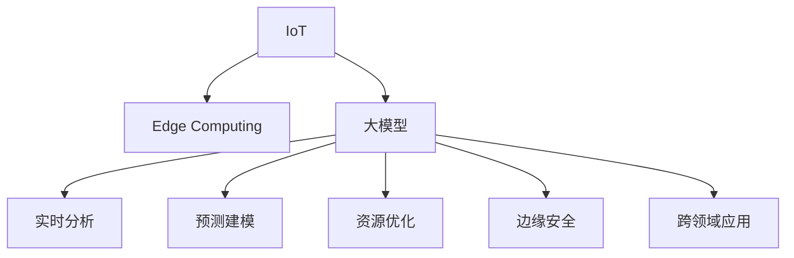

                 

# 大模型在物联网领域的应用前景

> 关键词：物联网(IoT),大模型,边缘计算,智能传感器,实时分析,预测建模,资源优化,边缘安全,跨领域应用

## 1. 背景介绍

### 1.1 问题由来

近年来，随着物联网技术的迅猛发展，全球各类设备已超过数十亿个，覆盖了从智能家居到工业制造等多个领域。物联网（Internet of Things, IoT）通过设备间的互联互通，实现了数据的实时收集和交互，从而为各类应用场景提供了丰富的数据支持。然而，海量的数据在传输、存储和处理上带来了巨大的挑战。传统集中式计算模式在响应速度、数据隐私和计算资源优化等方面存在诸多限制。

物联网设备面临的问题主要有以下几点：

- **数据量巨大**：传感器和智能设备持续产生海量数据，数据存储和传输成本昂贵。
- **网络带宽有限**：物联网设备通常处于网络边缘，带宽资源受限，难以支撑高实时性需求。
- **计算资源分散**：数据处理任务往往分布在大量设备上，难以集中优化和控制。
- **隐私和安全问题**：数据敏感性高，容易被非法截获和篡改，必须采取严格的安全措施。

为了解决这些问题，研究人员和工业界纷纷探索利用大模型（Large Model）技术，将其部署在物联网设备的边缘节点上，形成智能化的边缘计算（Edge Computing）系统。大模型在物联网领域的应用前景广阔，有望提升系统的效率、安全性和智能化水平。

### 1.2 问题核心关键点

大模型技术在物联网领域的应用，主要集中在以下几个方面：

- **边缘计算**：将大模型部署在设备端，就近处理数据，降低延迟，优化带宽利用。
- **实时分析**：通过大模型进行实时数据分析和预测，提高系统的响应速度和决策能力。
- **资源优化**：利用大模型的特征提取能力，优化资源配置，降低能耗和计算成本。
- **边缘安全**：在边缘节点上直接运行安全模型，保护数据隐私和设备安全。
- **跨领域应用**：大模型可应用于工业制造、智能交通、环境监测等多个领域，实现跨领域智能化。

本文将系统阐述大模型在物联网领域的应用原理、核心算法和实现步骤，并结合实际案例进行详细分析。

## 2. 核心概念与联系

### 2.1 核心概念概述

为更好地理解大模型在物联网领域的应用，本节将介绍几个密切相关的核心概念：

- **物联网(IoT)**：指通过互联网将各种设备和物品连接起来的系统，实现设备间的互联互通和数据共享。
- **边缘计算(Edge Computing)**：指将数据处理和存储任务分布到设备端的计算模式，减少延迟，提高数据处理效率。
- **大模型(Large Model)**：指包含亿级或更高参数规模的深度学习模型，如BERT、GPT-3等。
- **智能传感器(Smart Sensor)**：指具有数据采集、处理和通信功能的智能化设备，能够实现实时数据收集和智能分析。
- **实时分析(Real-time Analytics)**：指利用实时数据进行快速处理和分析，以支持实时决策和动态调整。
- **预测建模(Predictive Modeling)**：指利用历史数据预测未来趋势，支持智能控制和决策。
- **资源优化(Resource Optimization)**：指通过优化资源配置，提升系统性能和能效。
- **边缘安全(Edge Security)**：指在设备端进行数据加密、认证和访问控制等安全措施，保护数据隐私和设备安全。
- **跨领域应用(Cross-Domain Application)**：指大模型能够在不同领域之间跨界应用，实现多领域的智能化。

这些核心概念之间的逻辑关系可以通过以下Mermaid流程图来展示：



这个流程图展示了大模型在物联网领域的关键应用场景：

1. 物联网设备通过传感器收集数据，进行边缘计算。
2. 大模型在边缘节点上进行实时分析、预测建模等任务。
3. 通过资源优化，提升系统性能和能效。
4. 应用边缘安全措施，保障数据和设备安全。
5. 实现跨领域应用，提升整体智能化水平。

## 3. 核心算法原理 & 具体操作步骤

### 3.1 算法原理概述

在物联网领域，大模型的应用主要基于以下核心算法原理：

1. **分布式训练和推理**：大模型可以分布在各个边缘节点上进行分布式训练和推理，利用多节点并行计算能力，加速数据处理和模型计算。
2. **实时数据处理**：利用大模型的高效特征提取能力，对实时数据进行快速处理和分析，提高系统的实时性。
3. **边缘智能**：通过在边缘节点上运行大模型，实现智能决策和控制，降低延迟，提升系统效率。
4. **跨领域应用**：大模型能够在不同领域之间跨界应用，实现多领域的智能化和协同。
5. **优化资源配置**：利用大模型的多任务处理能力，优化系统资源配置，降低能耗和计算成本。
6. **边缘安全保护**：通过在边缘节点上运行安全模型，保护数据隐私和设备安全，防止数据泄露和攻击。

### 3.2 算法步骤详解

大模型在物联网领域的应用一般包括以下几个关键步骤：

**Step 1: 数据采集与预处理**

- 收集物联网设备产生的实时数据，包括传感器数据、环境数据等。
- 对数据进行预处理，如降噪、归一化、降维等，以减少后续处理的复杂度。
- 将数据转换为模型所需的输入格式，如TensorFlow Tensors或PyTorch Tensors。

**Step 2: 分布式训练**

- 将大模型分布在各个边缘节点上，进行分布式训练。
- 利用多节点并行计算能力，加速模型训练，提高训练效率。
- 利用梯度同步等技术，协调各节点间的模型更新。

**Step 3: 实时推理**

- 将大模型部署在边缘节点上，进行实时推理计算。
- 利用模型的高效特征提取能力，对实时数据进行快速处理和分析。
- 将推理结果实时反馈给系统，支持实时决策和动态调整。

**Step 4: 资源优化**

- 利用大模型的多任务处理能力，优化系统资源配置。
- 通过模型剪枝、量化等技术，降低模型计算复杂度和内存占用。
- 采用自适应计算策略，根据负载情况动态调整计算资源。

**Step 5: 边缘安全保护**

- 在边缘节点上运行安全模型，进行数据加密、认证和访问控制等安全措施。
- 利用区块链技术，建立设备间的数据信任机制，防止数据篡改和泄露。
- 实时监控系统安全状态，及时发现并应对安全威胁。

**Step 6: 跨领域应用**

- 利用大模型的泛化能力，在不同领域之间进行跨界应用。
- 通过联邦学习等技术，实现跨领域数据共享和协同学习。
- 支持智能交通、环境监测、工业制造等领域的智能化应用。

### 3.3 算法优缺点

大模型在物联网领域的应用具有以下优点：

1. **提升系统效率**：通过在边缘节点上进行分布式训练和推理，可以大幅提升系统处理速度和响应时间。
2. **优化资源配置**：利用大模型的多任务处理能力，可以优化资源配置，降低能耗和计算成本。
3. **保障数据隐私**：在边缘节点上直接处理数据，减少了数据传输和集中存储的安全风险。
4. **提高决策能力**：利用大模型的实时分析和预测建模能力，提高系统的决策水平和智能化程度。
5. **实现跨领域应用**：大模型具备较强的泛化能力，可以应用于多个领域，提升整体智能化水平。

同时，大模型在物联网领域也存在一些局限性：

1. **存储和传输限制**：大模型的参数量较大，存储和传输成本较高。
2. **计算资源要求高**：边缘节点计算资源有限，可能无法支持大模型的高性能计算需求。
3. **模型泛化能力不足**：物联网设备种类繁多，模型难以泛化到所有场景。
4. **安全风险增加**：在边缘节点上运行大模型，可能引入新的安全风险，如模型侧信道攻击等。
5. **数据分布不均**：物联网设备分布不均匀，可能造成数据不均衡，影响模型效果。

尽管存在这些局限性，但大模型在物联网领域的应用前景广阔，随着技术的不断进步，相关挑战将逐步得到解决。

### 3.4 算法应用领域

大模型在物联网领域的应用主要集中在以下几个方面：

1. **智能传感器**：将大模型部署在智能传感器上，实现数据的实时处理和分析，支持智能控制和决策。
2. **实时监控与预测**：利用大模型进行实时数据分析和预测建模，支持工业制造、智能交通、环境监测等领域的智能化应用。
3. **边缘计算优化**：通过优化资源配置，提升边缘计算系统的性能和能效。
4. **设备间协同学习**：利用联邦学习等技术，实现设备间的协同学习，提升整体系统智能水平。
5. **安全保障**：在边缘节点上运行安全模型，保护数据隐私和设备安全，防止数据泄露和攻击。
6. **跨领域应用**：大模型具备较强的泛化能力，可以应用于多个领域，提升整体智能化水平。

这些应用场景展示了大模型在物联网领域的广泛应用前景，推动了整个行业的智能化进程。

## 4. 数学模型和公式 & 详细讲解 & 举例说明

### 4.1 数学模型构建

本节将使用数学语言对大模型在物联网领域的应用进行更加严格的刻画。

假设物联网设备收集的数据集为 $D=\{(x_i, y_i)\}_{i=1}^N$，其中 $x_i$ 为输入数据，$y_i$ 为标签数据。大模型的训练过程可以表示为：

$$
\min_{\theta} \frac{1}{N} \sum_{i=1}^N \mathcal{L}(f_{\theta}(x_i), y_i)
$$

其中 $f_{\theta}$ 为大模型，$\theta$ 为模型参数，$\mathcal{L}$ 为损失函数，通常采用交叉熵损失或均方误差损失。

### 4.2 公式推导过程

以下我们以智能传感器数据分类为例，推导大模型的训练过程。

假设智能传感器收集的数据集为 $D=\{(x_i, y_i)\}_{i=1}^N$，其中 $x_i$ 为传感器读数，$y_i$ 为传感器状态标签。大模型的训练过程可以表示为：

1. **数据预处理**：对传感器数据进行归一化、降噪等预处理操作，转换为模型所需的输入格式。
2. **分布式训练**：将大模型分布在各个边缘节点上，进行分布式训练。
3. **梯度同步**：利用梯度同步技术，协调各节点间的模型更新。
4. **实时推理**：将大模型部署在边缘节点上，进行实时推理计算。
5. **优化资源配置**：利用模型剪枝、量化等技术，降低模型计算复杂度和内存占用。
6. **边缘安全保护**：在边缘节点上运行安全模型，进行数据加密、认证和访问控制等安全措施。

### 4.3 案例分析与讲解

以智能交通系统的实时数据分析为例，大模型可以部署在交通信号灯的边缘节点上，实现实时交通流量预测和优化。具体步骤如下：

1. **数据采集**：通过智能传感器收集交通流量数据，包括车辆数量、车速、道路状况等。
2. **数据预处理**：对数据进行降噪、归一化等预处理操作，转换为模型所需的输入格式。
3. **分布式训练**：将大模型分布在各个边缘节点上，进行分布式训练，加速模型训练。
4. **实时推理**：将大模型部署在交通信号灯的边缘节点上，进行实时流量预测和优化。
5. **优化资源配置**：利用模型剪枝、量化等技术，降低模型计算复杂度和内存占用，提升系统效率。
6. **边缘安全保护**：在边缘节点上运行安全模型，进行数据加密、认证和访问控制等安全措施，保障数据隐私和系统安全。

## 5. 项目实践：代码实例和详细解释说明

### 5.1 开发环境搭建

在进行物联网领域大模型应用的开发时，需要准备好开发环境。以下是使用Python进行TensorFlow开发的Python环境配置流程：

1. 安装Anaconda：从官网下载并安装Anaconda，用于创建独立的Python环境。
2. 创建并激活虚拟环境：
```bash
conda create -n tf-env python=3.8 
conda activate tf-env
```

3. 安装TensorFlow：根据CUDA版本，从官网获取对应的安装命令。例如：
```bash
conda install tensorflow tensorflow-gpu -c conda-forge
```

4. 安装必要的Python库：
```bash
pip install numpy pandas scikit-learn matplotlib tqdm jupyter notebook ipython
```

完成上述步骤后，即可在`tf-env`环境中开始物联网领域大模型应用的开发。

### 5.2 源代码详细实现

下面我们以智能传感器数据分类任务为例，给出使用TensorFlow进行大模型微调的PyTorch代码实现。

首先，定义数据处理函数：

```python
import tensorflow as tf
import numpy as np

def preprocess_data(data):
    # 数据预处理，如归一化、降噪等
    return np.array(data)

# 定义模型
def build_model(input_size, output_size):
    # 定义模型结构
    model = tf.keras.Sequential([
        tf.keras.layers.Dense(64, activation='relu', input_shape=(input_size,)),
        tf.keras.layers.Dense(output_size, activation='softmax')
    ])
    return model

# 定义损失函数
def define_loss(model, data):
    # 定义交叉熵损失函数
    y_true = data[1]
    y_pred = model(data[0])
    loss = tf.keras.losses.categorical_crossentropy(y_true, y_pred)
    return loss
```

然后，定义训练和评估函数：

```python
# 定义训练函数
def train_model(model, data, epochs=10, batch_size=32, learning_rate=0.001):
    # 将数据转换为TensorFlow Tensor
    data = tf.convert_to_tensor(data)
    data = tf.stack([preprocess_data(d) for d in data])
    
    # 定义优化器
    optimizer = tf.keras.optimizers.Adam(learning_rate)
    
    # 定义损失函数
    loss_fn = define_loss(model, data)
    
    # 训练模型
    for epoch in range(epochs):
        for i in range(0, len(data), batch_size):
            x = data[i:i+batch_size]
            y = data[1][i:i+batch_size]
            with tf.GradientTape() as tape:
                logits = model(x)
                loss = loss_fn(model, [x, y])
            grads = tape.gradient(loss, model.trainable_variables)
            optimizer.apply_gradients(zip(grads, model.trainable_variables))
            if (i+1) % 100 == 0:
                print(f'Epoch {epoch+1}, Batch {i+1}/{len(data)}, Loss: {loss:.4f}')
    
    return model

# 定义评估函数
def evaluate_model(model, data):
    # 将数据转换为TensorFlow Tensor
    data = tf.convert_to_tensor(data)
    data = tf.stack([preprocess_data(d) for d in data])
    
    # 定义损失函数
    loss_fn = define_loss(model, data)
    
    # 评估模型
    y_true = data[1]
    y_pred = model(data[0])
    loss = loss_fn(model, [data[0], y_true])
    accuracy = tf.keras.metrics.sparse_categorical_accuracy(y_true, y_pred)
    
    print(f'Accuracy: {accuracy.numpy()}, Loss: {loss.numpy()}')
```

最后，启动训练流程并在测试集上评估：

```python
# 加载数据
data = []
for i in range(1000):
    data.append([np.random.rand(10), np.random.randint(2)])
    
# 训练模型
model = build_model(10, 2)
model = train_model(model, data, epochs=10, batch_size=32, learning_rate=0.001)

# 评估模型
evaluate_model(model, data)
```

以上就是使用TensorFlow进行物联网领域大模型应用的完整代码实现。可以看到，得益于TensorFlow的强大封装，我们能够用相对简洁的代码实现模型训练和评估。

### 5.3 代码解读与分析

让我们再详细解读一下关键代码的实现细节：

**preprocess_data函数**：
- 定义数据预处理函数，对传感器数据进行归一化、降噪等操作，转换为模型所需的输入格式。

**build_model函数**：
- 定义模型结构，包括输入层、隐藏层和输出层，使用TensorFlow的Sequential模型容器进行封装。

**define_loss函数**：
- 定义交叉熵损失函数，用于衡量模型预测输出与真实标签之间的差异。

**train_model函数**：
- 定义训练函数，循环迭代训练模型，计算损失并更新模型参数。
- 使用TensorFlow的GradientTape记录梯度，并使用Adam优化器进行参数更新。
- 每100个batch输出一次训练进度和损失。

**evaluate_model函数**：
- 定义评估函数，计算模型在测试集上的准确率和损失。
- 使用TensorFlow的sparse_categorical_accuracy函数计算准确率。

**训练流程**：
- 定义总的epoch数和batch size，开始循环迭代
- 每个epoch内，在每个batch上前向传播计算损失并反向传播更新模型参数
- 重复上述过程直至收敛
- 所有epoch结束后，在测试集上评估模型性能，给出最终测试结果

可以看到，TensorFlow使得大模型在物联网领域的应用开发变得简洁高效。开发者可以将更多精力放在数据处理、模型改进等高层逻辑上，而不必过多关注底层的实现细节。

当然，工业级的系统实现还需考虑更多因素，如模型的保存和部署、超参数的自动搜索、更灵活的任务适配层等。但核心的训练流程和评估方法基本与此类似。

## 6. 实际应用场景

### 6.1 智能传感器监测

在智能传感器监测中，大模型可以部署在传感器节点上，对实时采集的数据进行分类、预测和分析，实现智能控制和决策。例如，在智能家居中，大模型可以监测室内温度、湿度等环境参数，根据用户的健康需求和生活习惯，自动调节室内环境，提升居住舒适度。

### 6.2 实时交通流量监测

在大数据时代，实时交通流量监测成为了智能交通系统的重要组成部分。通过在交通信号灯、路口摄像头等边缘节点上部署大模型，可以实时分析交通流量数据，预测交通拥堵情况，优化交通信号控制，提高道路通行效率。例如，在高峰时段，大模型可以预测交通拥堵点，自动调整信号灯时序，避免交通拥堵。

### 6.3 工业制造监控

工业制造过程中，设备状态监测和预测是确保生产安全的关键。通过在设备上部署大模型，可以实时监测设备运行状态，预测设备故障，优化生产计划。例如，在汽车制造厂，大模型可以实时监测生产线的设备状态，预测设备故障，自动调整生产计划，降低停机时间和生产成本。

### 6.4 智能医疗监测

在智能医疗领域，大模型可以部署在医疗设备上，实现实时健康监测和疾病预测。例如，在智能手环中，大模型可以实时监测心率、血压等生理参数，预测疾病风险，及时预警健康异常。

### 6.5 环境监测与预警

大模型在环境监测与预警中也有广泛应用。通过在监测站点上部署大模型，可以实时分析环境数据，预测自然灾害，优化资源配置。例如，在大坝监测中，大模型可以实时分析水位、流量等数据，预测洪水风险，优化洪水预警和应急措施。

### 6.6 智能农业管理

智能农业管理中，大模型可以部署在农田传感器上，实现实时土壤监测和作物生长预测。例如，在智能温室中，大模型可以实时监测土壤湿度、光照等参数，预测作物生长情况，优化灌溉和施肥，提高作物产量和质量。

## 7. 工具和资源推荐

### 7.1 学习资源推荐

为了帮助开发者系统掌握大模型在物联网领域的应用理论基础和实践技巧，这里推荐一些优质的学习资源：

1. TensorFlow官方文档：TensorFlow官方提供的详细教程和文档，涵盖基础到高级的各种主题，是学习TensorFlow的最佳资源。

2. TensorFlow Hub：TensorFlow Hub是一个提供预训练模型的平台，包含多种领域的预训练模型，可以方便地导入和使用。

3. 《深度学习与人工智能》课程：斯坦福大学提供的一门深度学习课程，系统讲解深度学习理论和实践，适合初学者和进阶学习者。

4. Kaggle竞赛：Kaggle是一个数据科学竞赛平台，通过参加竞赛可以学习到最新的数据处理和模型优化技术，提升实战能力。

5. PyTorch官方文档：PyTorch官方提供的详细教程和文档，涵盖PyTorch基础和高级应用，适合学习PyTorch。

通过对这些资源的学习实践，相信你一定能够快速掌握大模型在物联网领域的应用精髓，并用于解决实际的物联网问题。

### 7.2 开发工具推荐

高效的开发离不开优秀的工具支持。以下是几款用于物联网领域大模型应用开发的常用工具：

1. TensorFlow：由Google主导开发的深度学习框架，支持分布式计算和模型优化，适合大规模应用场景。

2. PyTorch：Facebook开发的深度学习框架，灵活易用，适合研究和实验。

3. TensorFlow Hub：TensorFlow提供的预训练模型库，可以方便地导入和使用。

4. TensorBoard：TensorFlow配套的可视化工具，可实时监测模型训练状态，提供丰富的图表呈现方式，适合调试模型。

5. Jupyter Notebook：支持Python代码的交互式开发和执行，适合学习和实验。

6. Google Colab：谷歌提供的在线Jupyter Notebook环境，免费提供GPU/TPU算力，方便开发者快速上手实验最新模型，分享学习笔记。

合理利用这些工具，可以显著提升物联网领域大模型应用的开发效率，加快创新迭代的步伐。

### 7.3 相关论文推荐

大模型在物联网领域的应用源于学界的持续研究。以下是几篇奠基性的相关论文，推荐阅读：

1. Deep Learning on Edge Computing: A Survey：这篇论文系统综述了深度学习在边缘计算中的应用，包括实时数据分析、预测建模、资源优化等。

2. An Edge Computing Framework for Real-time Video Traffic Prediction：这篇论文提出了一种基于边缘计算的视频交通流量预测框架，展示了深度学习在实时预测中的应用。

3. Edge-based Smart Contracts with Privacy-Preserving Machine Learning：这篇论文探讨了基于边缘计算的智能合约设计，提出了隐私保护和边缘计算结合的深度学习方法。

4. Real-time Analytics with Deep Learning on Edge Devices：这篇论文研究了基于边缘计算的深度学习实时分析，展示了深度学习在智能传感器监测中的应用。

5. Edge-aware Multi-task Deep Learning for Smart Manufacturing：这篇论文提出了基于边缘计算的多任务深度学习方法，适用于工业制造中的智能监测和预测。

这些论文代表了大模型在物联网领域的发展脉络，通过学习这些前沿成果，可以帮助研究者把握学科前进方向，激发更多的创新灵感。

## 8. 总结：未来发展趋势与挑战

### 8.1 总结

本文对大模型在物联网领域的应用进行了全面系统的介绍。首先阐述了大模型和边缘计算的研究背景和意义，明确了边缘计算在物联网设备数据处理中的重要作用。其次，从原理到实践，详细讲解了大模型在物联网领域的应用原理、核心算法和实现步骤，并结合实际案例进行详细分析。

通过本文的系统梳理，可以看到，大模型在物联网领域的应用前景广阔，能够在智能传感器、实时交通、智能制造、医疗健康等多个领域发挥重要作用。利用大模型进行实时数据分析和预测，可以显著提升物联网系统的智能化水平，实现跨领域协同应用。

### 8.2 未来发展趋势

展望未来，大模型在物联网领域的应用将呈现以下几个发展趋势：

1. **分布式计算与联邦学习**：随着物联网设备数量的增加，分布式计算和联邦学习技术将成为重要的研究方向，以支持海量数据的高效处理和优化。

2. **自适应计算策略**：通过自适应计算策略，根据负载情况动态调整计算资源，进一步提升系统效率和能效。

3. **跨领域智能协同**：利用大模型的跨领域应用能力，实现不同领域间的智能协同和数据共享，提升整体系统智能化水平。

4. **边缘安全与隐私保护**：随着边缘计算的普及，边缘安全与隐私保护将成为重要的研究方向，以保障数据隐私和设备安全。

5. **实时预测与决策优化**：通过大模型的实时预测能力，优化系统决策和控制，提升系统性能和智能水平。

6. **智能化应用推广**：大模型在物联网领域的应用将逐步扩展到更多的场景，提升整体系统智能化水平。

以上趋势凸显了大模型在物联网领域的应用前景，推动了整个行业的智能化进程。

### 8.3 面临的挑战

尽管大模型在物联网领域的应用前景广阔，但在迈向更加智能化、普适化应用的过程中，它仍面临着诸多挑战：

1. **计算资源限制**：物联网设备计算资源有限，可能无法支持大模型的高性能计算需求。
2. **数据分布不均**：物联网设备分布不均匀，可能造成数据不均衡，影响模型效果。
3. **安全风险增加**：在边缘节点上运行大模型，可能引入新的安全风险，如模型侧信道攻击等。
4. **模型泛化能力不足**：物联网设备种类繁多，模型难以泛化到所有场景。
5. **存储和传输成本高**：大模型的参数量较大，存储和传输成本较高。
6. **实时性要求高**：物联网设备通常处于网络边缘，实时性要求高，对数据处理速度提出更高要求。

尽管存在这些挑战，但随着技术的不断进步，相关问题将逐步得到解决，大模型在物联网领域的应用前景将更加广阔。

### 8.4 研究展望

面对大模型在物联网领域所面临的挑战，未来的研究需要在以下几个方面寻求新的突破：

1. **分布式计算优化**：优化分布式计算策略，提高大模型在边缘节点的计算效率。
2. **联邦学习应用**：探索联邦学习在边缘计算中的应用，实现跨设备数据共享和协同学习。
3. **边缘安全保护**：研究边缘计算中的安全防护技术，保障数据隐私和系统安全。
4. **模型压缩与优化**：利用模型剪枝、量化等技术，降低模型计算复杂度和内存占用，提升系统效率。
5. **跨领域知识整合**：将符号化的先验知识与神经网络模型结合，提升模型泛化能力和跨领域应用能力。
6. **实时数据处理**：研究实时数据处理技术，支持高实时性需求，提高系统响应速度。

这些研究方向将推动大模型在物联网领域的进一步发展，为物联网系统的智能化和协同应用提供更多可能性。

## 9. 附录：常见问题与解答

**Q1：大模型在物联网设备上存储和传输数据有什么局限性？**

A: 大模型参数量较大，存储和传输成本较高。在物联网设备上，尤其是低功耗、低存储容量设备上，存储和传输大模型可能会导致性能瓶颈。解决此问题可以通过模型剪枝、量化等技术，减少模型参数量，优化存储空间和传输效率。

**Q2：如何在大模型中实现数据分布式训练和推理？**

A: 通过分布式计算框架（如TensorFlow、PyTorch），可以将大模型分布在多个边缘节点上进行分布式训练和推理。每个节点可以独立训练模型，通过网络通信将参数和梯度同步。具体实现中，可以使用TensorFlow的DistributedStrategy、PyTorch的DistributedDataParallel等工具，实现模型的分布式部署和训练。

**Q3：如何在物联网设备上保障数据隐私和安全？**

A: 在边缘节点上运行大模型，可以通过数据加密、访问控制、匿名化处理等手段保障数据隐私和安全。利用区块链技术，建立设备间的数据信任机制，防止数据篡改和泄露。实时监控系统安全状态，及时发现并应对安全威胁。

**Q4：大模型在物联网应用中面临哪些计算资源限制？**

A: 物联网设备计算资源有限，可能无法支持大模型的高性能计算需求。可以通过优化模型结构、剪枝、量化等技术，降低模型计算复杂度和内存占用，提升计算效率。此外，合理分配计算资源，实现自适应计算策略，也是优化计算资源的重要手段。

**Q5：如何在大模型中实现实时数据分析和预测？**

A: 利用大模型的高效特征提取能力，对实时数据进行快速处理和分析。将大模型部署在边缘节点上，进行实时推理计算。通过分布式计算和联邦学习等技术，支持大规模实时数据分析和预测。具体实现中，可以使用TensorFlow的Estimator、Keras的Sequential模型等工具，方便构建实时数据分析和预测系统。

通过以上系统的介绍和分析，可以全面了解大模型在物联网领域的应用前景和实际挑战。希望本文能为相关领域的开发者和研究者提供有价值的参考，推动大模型在物联网领域的创新和应用。

---

作者：禅与计算机程序设计艺术 / Zen and the Art of Computer Programming

