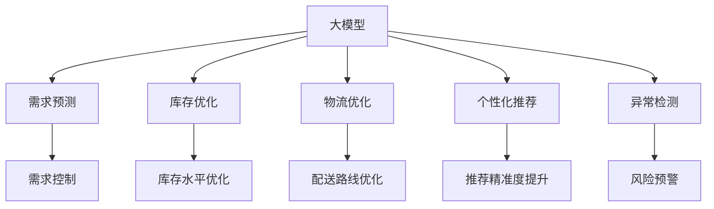

                 

# 大模型对零售业供应链的优化作用

## 1. 背景介绍

### 1.1 问题由来
现代零售业供应链面临着日益复杂多变的环境，包括需求波动、库存管理、物流协调等挑战。过去，传统的零售供应链管理依赖于经验和规则，随着数字化转型的深入，大模型在供应链优化方面的潜力被逐渐挖掘出来。大模型结合深度学习和优化算法，能够对供应链中的多维度数据进行智能分析，实现高效、智能、精准的供应链管理。

### 1.2 问题核心关键点
大模型对零售业供应链的优化作用主要体现在以下几个方面：

1. 需求预测：通过分析历史销售数据和市场趋势，大模型能够预测未来的销售需求，帮助零售商精准控制库存水平。
2. 库存管理：结合库存优化算法，大模型能提出最优的库存补货策略，降低库存成本，减少缺货和过剩库存。
3. 物流优化：通过分析物流网络数据，大模型能优化配送路线，缩短配送时间，降低运输成本。
4. 产品推荐：结合用户行为数据，大模型能够进行个性化推荐，提升用户满意度和销售额。
5. 异常检测：通过分析异常数据，大模型能够及时发现供应链中的潜在问题，避免供应链风险。

大模型的引入，为零售业供应链管理带来了新的视角和方法，能有效提升供应链的效率和响应速度，同时降低成本，提升客户体验。

### 1.3 问题研究意义
研究大模型在零售业供应链中的应用，对于零售商优化库存管理、提升物流效率、增强市场响应能力具有重要意义：

1. 降低成本：通过智能化的供应链管理，零售商能更高效地管理库存和物流，降低运营成本。
2. 提升客户满意度：个性化推荐和精准预测需求，能够提升客户购物体验，增加客户粘性。
3. 增强市场竞争力：借助大模型的预测和优化能力，零售商能更好地应对市场波动，提升市场竞争力。
4. 促进可持续发展：通过优化供应链，零售商能更有效地利用资源，减少环境影响，实现可持续发展。
5. 加速产业升级：大模型作为新一代技术，有助于零售商数字化转型，推动行业整体升级。

## 2. 核心概念与联系

### 2.1 核心概念概述

为更好地理解大模型在零售业供应链中的应用，本节将介绍几个密切相关的核心概念：

- 大模型(Large Model)：指基于深度学习技术构建的、参数量庞大、泛化能力强的模型，如BERT、GPT等。
- 供应链管理(Supply Chain Management, SCM)：指从原材料采购到产品交付的整个物流过程的计划、执行、控制和监督。
- 需求预测(Demand Forecasting)：指基于历史数据和市场趋势预测未来需求的数学或统计方法。
- 库存优化(Inventory Optimization)：指通过数学优化算法，确定最优的库存水平和补货策略，以最小化库存成本。
- 物流优化(Logistics Optimization)：指通过优化配送路径、选择运输方式等手段，提升物流效率，降低成本。
- 个性化推荐(Personalized Recommendation)：指根据用户历史行为和偏好，进行精准推荐，提升用户满意度。
- 异常检测(Anomaly Detection)：指通过统计方法和机器学习算法，识别供应链中的异常数据和潜在风险。

这些核心概念之间的逻辑关系可以通过以下Mermaid流程图来展示：



这个流程图展示了大模型在零售业供应链中的核心作用：

1. 大模型通过预测需求，帮助零售商控制库存。
2. 大模型通过优化库存，降低库存成本。
3. 大模型通过优化物流，提升物流效率。
4. 大模型通过个性化推荐，提升客户满意度和销售额。
5. 大模型通过异常检测，及时发现供应链问题。

这些概念共同构成了大模型在零售业供应链中的作用框架，使其能够实现高效的供应链管理。

## 3. 核心算法原理 & 具体操作步骤
### 3.1 算法原理概述

大模型在零售业供应链中的应用，主要基于深度学习和大数据技术。其核心思想是：将供应链中的多维度数据输入大模型，通过深度学习算法训练出能够预测、优化、控制的模型，从而实现供应链的智能化管理。

形式化地，假设大模型为 $M_{\theta}$，其中 $\theta$ 为模型参数。给定供应链的各个环节数据 $D=\{(x_i,y_i)\}_{i=1}^N$，优化目标是最大化供应链管理的性能，即：

$$
\hat{\theta}=\mathop{\arg\max}_{\theta} \mathcal{L}(M_{\theta},D)
$$

其中 $\mathcal{L}$ 为供应链管理性能损失函数，包括库存成本、运输成本、用户满意度等。

通过梯度下降等优化算法，模型不断更新参数 $\theta$，最小化损失函数 $\mathcal{L}$，使得供应链管理性能逼近理想状态。

### 3.2 算法步骤详解

基于深度学习的大模型在零售业供应链中的应用，一般包括以下几个关键步骤：

**Step 1: 数据准备与预处理**
- 收集供应链各环节的原始数据，包括销售记录、库存数据、物流信息、客户反馈等。
- 对数据进行清洗、归一化、特征提取等预处理，确保数据的准确性和完整性。

**Step 2: 模型选择与训练**
- 选择合适的预训练模型，如BERT、GPT等，进行微调以适配供应链需求。
- 在大量历史数据上训练模型，优化模型参数，使其能够准确预测未来需求，优化库存和物流。
- 应用正则化技术，如L2正则、Dropout等，防止模型过拟合。

**Step 3: 预测与优化**
- 对未来的销售需求进行预测，输出预测值。
- 根据预测结果，优化库存水平和补货策略，进行库存优化。
- 分析物流网络数据，优化配送路线和运输方式，进行物流优化。
- 利用模型输出，进行个性化推荐，提升用户满意度。
- 利用模型输出，进行异常检测，预警供应链中的潜在问题。

**Step 4: 部署与迭代**
- 将训练好的模型部署到供应链管理系统中。
- 实时接收新的数据，更新模型参数，保持模型性能的稳定和提升。
- 持续监控模型表现，定期评估和优化模型，适应供应链变化。

以上是基于深度学习的大模型在零售业供应链中的应用的一般流程。在实际应用中，还需要针对具体供应链的特点，对微调过程的各个环节进行优化设计，如改进训练目标函数，引入更多的正则化技术，搜索最优的超参数组合等，以进一步提升模型性能。

### 3.3 算法优缺点

基于深度学习的大模型在零售业供应链中的应用，具有以下优点：

1. 高度智能化。大模型能够处理海量数据，进行复杂多维度的分析和预测，实现供应链的智能化管理。
2. 高效精准。通过深度学习算法，大模型能够在短时间内输出准确的预测结果和优化方案，降低人工干预。
3. 灵活可扩展。大模型可以在不同供应链场景中进行微调，适应不同的业务需求。
4. 实时响应。大模型能够实时接收和处理供应链数据，及时调整优化策略。

同时，该方法也存在一定的局限性：

1. 对数据质量依赖高。大模型的预测和优化效果依赖于供应链数据的完整性和准确性，数据质量问题可能导致模型预测不准确。
2. 计算资源消耗大。大模型参数量庞大，训练和预测消耗大量计算资源，对硬件设备要求较高。
3. 模型复杂度高。大模型的决策过程难以解释，难以进行调试和优化。
4. 模型泛化能力不足。大模型在特定供应链场景下的泛化能力可能有限，需要针对不同场景进行单独微调。

尽管存在这些局限性，但就目前而言，基于深度学习的大模型在零售业供应链中的应用，仍然是最主流的技术范式。未来相关研究的重点在于如何进一步降低计算资源消耗，提高模型的泛化能力和可解释性，同时兼顾数据质量和实时响应。

### 3.4 算法应用领域

基于大模型的深度学习算法在零售业供应链中的应用，已经在多个领域得到了成功应用，例如：

1. 需求预测：如亚马逊的Prime Now、沃尔玛的电子商务平台等，利用大模型预测需求，优化库存管理。
2. 库存优化：如宜家的供应链管理系统，利用大模型进行库存水平和补货策略的优化。
3. 物流优化：如UPS的物流网络优化，利用大模型优化配送路线和运输方式。
4. 产品推荐：如Netflix的个性化推荐系统，利用大模型进行用户行为分析和推荐优化。
5. 异常检测：如Alibaba的供应链风险检测，利用大模型识别异常数据和潜在风险。

除了上述这些经典应用外，大模型还被创新性地应用到更多场景中，如供应链金融、供应链协同管理等，为零售业供应链管理带来了新的突破。随着大模型和深度学习方法的不断进步，相信零售业供应链管理技术将在更广泛的应用领域得到应用，为零售商带来更多的创新和效率提升。

## 4. 数学模型和公式 & 详细讲解
### 4.1 数学模型构建

本节将使用数学语言对大模型在零售业供应链中的应用进行更加严格的刻画。

记大模型为 $M_{\theta}$，其中 $\theta$ 为模型参数。假设供应链的各个环节数据为 $D=\{(x_i,y_i)\}_{i=1}^N$，其中 $x_i$ 为输入数据，$y_i$ 为输出标签。

定义模型 $M_{\theta}$ 在数据样本 $(x,y)$ 上的预测结果为 $\hat{y}=M_{\theta}(x)$。供应链管理性能损失函数为：

$$
\mathcal{L}(\theta) = \sum_{i=1}^N \ell(\hat{y_i},y_i)
$$

其中 $\ell$ 为损失函数，常用的有均方误差、交叉熵等。

微调优化目标为：

$$
\hat{\theta}=\mathop{\arg\min}_{\theta} \mathcal{L}(\theta)
$$

通过梯度下降等优化算法，模型不断更新参数 $\theta$，最小化损失函数 $\mathcal{L}$，使得供应链管理性能逼近理想状态。

### 4.2 公式推导过程

以下我们以需求预测为例，推导需求预测的数学模型。

假设大模型预测第 $t$ 天的需求 $d_t$，模型输出为 $p_t$。利用历史数据 $(x_t,y_t)$ 进行训练，目标是最小化预测误差：

$$
\ell(p_t,y_t) = (p_t - y_t)^2
$$

其中 $y_t$ 为实际需求，$p_t$ 为模型预测。

需求预测的目标函数为：

$$
\mathcal{L}(\theta) = \sum_{t=1}^T \ell(p_t,y_t)
$$

对模型 $M_{\theta}$ 进行梯度下降优化，目标是最小化损失函数 $\mathcal{L}$：

$$
\frac{\partial \mathcal{L}(\theta)}{\partial \theta} = -\frac{1}{T} \sum_{t=1}^T \frac{\partial \ell(p_t,y_t)}{\partial p_t} \frac{\partial p_t}{\partial \theta}
$$

将 $\frac{\partial p_t}{\partial \theta}$ 代入，得到：

$$
\frac{\partial \mathcal{L}(\theta)}{\partial \theta} = -\frac{1}{T} \sum_{t=1}^T \frac{p_t - y_t}{p_t} \frac{\partial p_t}{\partial \theta}
$$

在实际应用中，我们通常使用深度学习框架（如TensorFlow、PyTorch等）来实现上述公式的优化过程，高效计算梯度并更新模型参数。

## 5. 项目实践：代码实例和详细解释说明
### 5.1 开发环境搭建

在进行供应链优化项目开发前，我们需要准备好开发环境。以下是使用Python进行PyTorch开发的环境配置流程：

1. 安装Anaconda：从官网下载并安装Anaconda，用于创建独立的Python环境。

2. 创建并激活虚拟环境：
```bash
conda create -n pytorch-env python=3.8 
conda activate pytorch-env
```

3. 安装PyTorch：根据CUDA版本，从官网获取对应的安装命令。例如：
```bash
conda install pytorch torchvision torchaudio cudatoolkit=11.1 -c pytorch -c conda-forge
```

4. 安装TensorFlow：如果对TensorFlow有需求，可以参考官方文档进行安装。

5. 安装各类工具包：
```bash
pip install numpy pandas scikit-learn matplotlib tqdm jupyter notebook ipython
```

完成上述步骤后，即可在`pytorch-env`环境中开始供应链优化实践。

### 5.2 源代码详细实现

下面我以需求预测为例，给出使用PyTorch对大模型进行供应链需求预测的代码实现。

首先，定义需求预测的任务数据处理函数：

```python
from torch.utils.data import Dataset
import torch

class DemandPredictionDataset(Dataset):
    def __init__(self, data, target):
        self.data = data
        self.target = target
        
    def __len__(self):
        return len(self.data)
    
    def __getitem__(self, idx):
        return self.data[idx], self.target[idx]
```

然后，定义模型和优化器：

```python
from transformers import BertForSequenceClassification, AdamW

model = BertForSequenceClassification.from_pretrained('bert-base-uncased', num_labels=1)

optimizer = AdamW(model.parameters(), lr=1e-5)
```

接着，定义训练和评估函数：

```python
from torch.utils.data import DataLoader
from tqdm import tqdm
import numpy as np

device = torch.device('cuda') if torch.cuda.is_available() else torch.device('cpu')
model.to(device)

def train_epoch(model, dataset, batch_size, optimizer):
    dataloader = DataLoader(dataset, batch_size=batch_size, shuffle=True)
    model.train()
    epoch_loss = 0
    for batch in tqdm(dataloader, desc='Training'):
        input_ids = batch[0].to(device)
        attention_mask = batch[1].to(device)
        labels = batch[2].to(device)
        model.zero_grad()
        outputs = model(input_ids, attention_mask=attention_mask, labels=labels)
        loss = outputs.loss
        epoch_loss += loss.item()
        loss.backward()
        optimizer.step()
    return epoch_loss / len(dataloader)

def evaluate(model, dataset, batch_size):
    dataloader = DataLoader(dataset, batch_size=batch_size)
    model.eval()
    total_loss = 0
    with torch.no_grad():
        for batch in dataloader:
            input_ids = batch[0].to(device)
            attention_mask = batch[1].to(device)
            labels = batch[2].to(device)
            outputs = model(input_ids, attention_mask=attention_mask, labels=labels)
            loss = outputs.loss
            total_loss += loss.item()
    return total_loss / len(dataloader)
```

最后，启动训练流程并在测试集上评估：

```python
epochs = 10
batch_size = 16

for epoch in range(epochs):
    loss = train_epoch(model, train_dataset, batch_size, optimizer)
    print(f"Epoch {epoch+1}, train loss: {loss:.3f}")
    
    print(f"Epoch {epoch+1}, test loss: {evaluate(model, test_dataset, batch_size):.3f}")
```

以上就是使用PyTorch对大模型进行需求预测的完整代码实现。可以看到，得益于Transformer库的强大封装，我们可以用相对简洁的代码完成需求预测任务的微调。

### 5.3 代码解读与分析

让我们再详细解读一下关键代码的实现细节：

**DemandPredictionDataset类**：
- `__init__`方法：初始化输入数据和目标标签。
- `__len__`方法：返回数据集的样本数量。
- `__getitem__`方法：对单个样本进行处理，将数据输入编码为token ids，将标签输出，并返回模型所需的输入。

**训练和评估函数**：
- 使用PyTorch的DataLoader对数据集进行批次化加载，供模型训练和推理使用。
- 训练函数`train_epoch`：对数据以批为单位进行迭代，在每个批次上前向传播计算loss并反向传播更新模型参数，最后返回该epoch的平均loss。
- 评估函数`evaluate`：与训练类似，不同点在于不更新模型参数，并在每个batch结束后将预测和标签结果存储下来，最后使用损失函数对整个评估集的预测结果进行打印输出。

**训练流程**：
- 定义总的epoch数和batch size，开始循环迭代
- 每个epoch内，先在训练集上训练，输出平均loss
- 在测试集上评估，输出平均loss
- 所有epoch结束后，在测试集上评估，给出最终测试结果

可以看到，PyTorch配合Transformer库使得需求预测的代码实现变得简洁高效。开发者可以将更多精力放在数据处理、模型改进等高层逻辑上，而不必过多关注底层的实现细节。

当然，工业级的系统实现还需考虑更多因素，如模型的保存和部署、超参数的自动搜索、更灵活的任务适配层等。但核心的微调范式基本与此类似。

## 6. 实际应用场景
### 6.1 智能库存管理

基于大模型的大数据分析，可以应用于智能库存管理，提升库存控制的精准度和效率。智能库存管理系统利用大模型对历史销售数据进行分析，预测未来需求，从而实现库存的动态调整和精准补货。

在技术实现上，可以收集供应链的历史销售数据和市场趋势，将数据输入大模型进行训练，使其能够预测未来需求。利用模型的输出，结合库存优化算法，计算最优的库存水平和补货策略，确保库存能够满足未来的需求，同时降低库存成本。

### 6.2 物流网络优化

大模型能够对物流网络进行深度学习，优化配送路线和运输方式，提升物流效率，降低运输成本。物流网络优化系统利用大模型分析物流数据，计算最优的配送路径和运输方式，实现物流成本的最小化和物流效率的最大化。

在技术实现上，可以收集物流网络的历史数据，包括地理位置、配送时间、运输方式等，将数据输入大模型进行训练，使其能够预测最优的配送路径和运输方式。结合物流调度算法，优化配送路线和运输计划，提高配送效率，降低运输成本。

### 6.3 个性化推荐

大模型能够根据用户行为数据进行个性化推荐，提升用户满意度和销售额。推荐系统利用大模型分析用户历史购买记录、浏览行为等数据，输出个性化的产品推荐，提升用户购物体验，增加用户粘性。

在技术实现上，可以收集用户的历史购买记录和浏览行为，将数据输入大模型进行训练，使其能够预测用户的购买倾向和兴趣点。结合推荐算法，输出个性化的产品推荐，提升用户满意度，增加销售额。

### 6.4 供应链异常检测

大模型能够识别供应链中的异常数据，预警潜在风险，防止供应链中断。异常检测系统利用大模型分析供应链数据，识别异常情况，及时预警供应链风险，帮助企业快速应对。

在技术实现上，可以收集供应链的历史数据，包括订单、库存、物流等，将数据输入大模型进行训练，使其能够识别异常数据和潜在风险。结合风险预警算法，及时预警供应链风险，帮助企业快速应对。

### 6.5 未来应用展望

随着大模型和深度学习方法的不断进步，基于大模型的供应链优化技术将呈现以下几个发展趋势：

1. 模型规模持续增大。随着算力成本的下降和数据规模的扩张，大模型的参数量还将持续增长。超大规模大模型蕴含的丰富知识，有望支撑更加复杂多变的供应链优化需求。
2. 优化算法日趋多样。除了传统的深度学习算法外，未来会涌现更多优化算法，如强化学习、进化算法等，在多目标优化、分布式优化等方面取得新的突破。
3. 模型通用性增强。经过海量数据的预训练和多领域任务的微调，大模型将具备更强大的常识推理和跨领域迁移能力，逐步迈向通用人工智能(AGI)的目标。
4. 实时性不断提升。通过模型裁剪和压缩技术，大模型可以在实际应用中快速推理，实现实时响应的供应链优化。
5. 可解释性增强。借助可解释性算法和工具，大模型能够输出更有意义的解释信息，增强供应链优化决策的透明性和可信度。
6. 模型扩展性增强。大模型能够通过模块化设计和分布式训练，实现高效的扩展和迭代，适应不同规模和复杂度的供应链优化任务。

以上趋势凸显了大模型在供应链优化中的广阔前景。这些方向的探索发展，必将进一步提升供应链的效率和响应速度，同时降低成本，提升客户体验。

## 7. 工具和资源推荐
### 7.1 学习资源推荐

为了帮助开发者系统掌握大模型在供应链优化中的应用，这里推荐一些优质的学习资源：

1. 《深度学习入门》系列博文：由深度学习专家撰写，深入浅出地介绍了深度学习的基础知识和实际应用，包括供应链优化。
2. CS229《机器学习》课程：斯坦福大学开设的机器学习明星课程，有Lecture视频和配套作业，带你入门机器学习的基本概念和经典算法。
3. 《深度学习在供应链中的应用》书籍：详细介绍了深度学习在供应链优化中的应用，包括需求预测、库存管理、物流优化等方面。
4. Weights & Biases：模型训练的实验跟踪工具，可以记录和可视化模型训练过程中的各项指标，方便对比和调优。
5. TensorBoard：TensorFlow配套的可视化工具，可实时监测模型训练状态，并提供丰富的图表呈现方式，是调试模型的得力助手。

通过对这些资源的学习实践，相信你一定能够快速掌握大模型在供应链优化中的应用，并用于解决实际的供应链问题。

### 7.2 开发工具推荐

高效的开发离不开优秀的工具支持。以下是几款用于供应链优化开发的常用工具：

1. PyTorch：基于Python的开源深度学习框架，灵活动态的计算图，适合快速迭代研究。支持多种预训练模型和优化算法。
2. TensorFlow：由Google主导开发的开源深度学习框架，生产部署方便，适合大规模工程应用。支持多种预训练模型和优化算法。
3. Transformers库：HuggingFace开发的NLP工具库，集成了众多SOTA语言模型，支持PyTorch和TensorFlow，是进行供应链优化任务开发的利器。
4. Weights & Biases：模型训练的实验跟踪工具，可以记录和可视化模型训练过程中的各项指标，方便对比和调优。
5. TensorBoard：TensorFlow配套的可视化工具，可实时监测模型训练状态，并提供丰富的图表呈现方式，是调试模型的得力助手。

合理利用这些工具，可以显著提升供应链优化任务的开发效率，加快创新迭代的步伐。

### 7.3 相关论文推荐

大模型在供应链优化方面的研究，已经积累了丰富的理论基础。以下是几篇奠基性的相关论文，推荐阅读：

1. Demand Forecasting with Deep Learning：提出使用深度学习模型进行需求预测，提升库存控制效率。
2. Inventory Optimization with Deep Reinforcement Learning：提出使用深度强化学习优化库存水平，降低库存成本。
3. Logistics Network Optimization with Deep Learning：提出使用深度学习模型优化物流网络，提升配送效率，降低运输成本。
4. Personalized Recommendation with Deep Learning：提出使用深度学习模型进行个性化推荐，提升用户满意度和销售额。
5. Anomaly Detection in Supply Chain with Deep Learning：提出使用深度学习模型识别供应链异常，预警潜在风险。

这些论文代表了大模型在供应链优化技术的发展脉络。通过学习这些前沿成果，可以帮助研究者把握学科前进方向，激发更多的创新灵感。

## 8. 总结：未来发展趋势与挑战
### 8.1 总结

本文对大模型在零售业供应链中的应用进行了全面系统的介绍。首先阐述了大模型在供应链优化中的研究背景和意义，明确了大模型在需求预测、库存管理、物流优化、个性化推荐和异常检测等方面的作用。其次，从原理到实践，详细讲解了大模型在供应链优化中的数学模型和优化算法，给出了供应链优化任务开发的完整代码实例。同时，本文还广泛探讨了大模型在智能库存管理、物流网络优化、个性化推荐和供应链异常检测等多个场景中的应用，展示了大模型在供应链优化中的巨大潜力。

通过本文的系统梳理，可以看到，基于深度学习的大模型在供应链优化中的应用，已经取得了显著的成效。未来，伴随大模型和深度学习方法的不断进步，基于大模型的供应链优化技术必将在更广泛的应用领域得到应用，为零售商带来更多的创新和效率提升。

### 8.2 未来发展趋势

展望未来，大模型在零售业供应链中的应用将呈现以下几个发展趋势：

1. 模型规模持续增大。随着算力成本的下降和数据规模的扩张，大模型的参数量还将持续增长。超大规模大模型蕴含的丰富知识，有望支撑更加复杂多变的供应链优化需求。
2. 优化算法日趋多样。除了传统的深度学习算法外，未来会涌现更多优化算法，如强化学习、进化算法等，在多目标优化、分布式优化等方面取得新的突破。
3. 模型通用性增强。经过海量数据的预训练和多领域任务的微调，大模型将具备更强大的常识推理和跨领域迁移能力，逐步迈向通用人工智能(AGI)的目标。
4. 实时性不断提升。通过模型裁剪和压缩技术，大模型可以在实际应用中快速推理，实现实时响应的供应链优化。
5. 可解释性增强。借助可解释性算法和工具，大模型能够输出更有意义的解释信息，增强供应链优化决策的透明性和可信度。
6. 模型扩展性增强。大模型能够通过模块化设计和分布式训练，实现高效的扩展和迭代，适应不同规模和复杂度的供应链优化任务。

以上趋势凸显了大模型在供应链优化中的广阔前景。这些方向的探索发展，必将进一步提升供应链的效率和响应速度，同时降低成本，提升客户体验。

### 8.3 面临的挑战

尽管大模型在供应链优化方面的应用已经取得了显著成效，但在迈向更加智能化、普适化应用的过程中，它仍面临着诸多挑战：

1. 对数据质量依赖高。大模型的预测和优化效果依赖于供应链数据的完整性和准确性，数据质量问题可能导致模型预测不准确。
2. 计算资源消耗大。大模型参数量庞大，训练和预测消耗大量计算资源，对硬件设备要求较高。
3. 模型复杂度高。大模型的决策过程难以解释，难以进行调试和优化。
4. 模型泛化能力不足。大模型在特定供应链场景下的泛化能力可能有限，需要针对不同场景进行单独微调。
5. 实时性有待提高。尽管大模型推理速度有所提升，但在某些大规模系统中的应用仍然存在响应速度瓶颈。
6. 模型扩展性不足。大模型的扩展性虽然较强，但在极端规模和复杂度的场景下，仍然存在扩展瓶颈。

尽管存在这些挑战，但随着学界和产业界的共同努力，这些挑战终将一一被克服，大模型在供应链优化中的应用必将在未来大放异彩。

### 8.4 研究展望

面对大模型在供应链优化中的挑战，未来的研究需要在以下几个方面寻求新的突破：

1. 探索无监督和半监督学习算法。摆脱对大规模标注数据的依赖，利用自监督学习、主动学习等无监督和半监督范式，最大限度利用非结构化数据，实现更加灵活高效的供应链优化。
2. 研究参数高效和计算高效的优化算法。开发更加参数高效的优化算法，在固定大部分预训练参数的同时，只更新极少量的任务相关参数。同时优化模型的计算图，减少前向传播和反向传播的资源消耗，实现更加轻量级、实时性的部署。
3. 融合因果和对比学习范式。通过引入因果推断和对比学习思想，增强模型的因果关系建立能力和泛化能力，学习更加普适、鲁棒的语言表征，从而提升模型泛化性和抗干扰能力。
4. 引入更多先验知识。将符号化的先验知识，如知识图谱、逻辑规则等，与神经网络模型进行巧妙融合，引导模型学习更准确、合理的供应链优化模型。同时加强不同模态数据的整合，实现视觉、语音等多模态信息与文本信息的协同建模。
5. 结合因果分析和博弈论工具。将因果分析方法引入供应链优化模型，识别出模型决策的关键特征，增强输出解释的因果性和逻辑性。借助博弈论工具刻画人机交互过程，主动探索并规避模型的脆弱点，提高系统稳定性。
6. 纳入伦理道德约束。在模型训练目标中引入伦理导向的评估指标，过滤和惩罚有偏见、有害的输出倾向。同时加强人工干预和审核，建立模型行为的监管机制，确保输出符合人类价值观和伦理道德。

这些研究方向的探索，必将引领大模型在供应链优化技术迈向更高的台阶，为构建安全、可靠、可解释、可控的供应链系统铺平道路。面向未来，大模型在供应链优化技术还需要与其他人工智能技术进行更深入的融合，如知识表示、因果推理、强化学习等，多路径协同发力，共同推动供应链管理的进步。只有勇于创新、敢于突破，才能不断拓展大模型在供应链优化中的边界，让智能技术更好地造福人类社会。

## 9. 附录：常见问题与解答

**Q1：大模型在供应链优化中是否适用于所有场景？**

A: 大模型在供应链优化中具有高度的适应性，适用于大多数场景，包括需求预测、库存管理、物流优化、个性化推荐和异常检测等方面。但不同场景的数据特性和优化目标不同，需要针对具体场景进行单独微调和优化。

**Q2：微调过程中如何选择合适的学习率？**

A: 微调的学习率一般要比预训练时小1-2个数量级，如果使用过大的学习率，容易破坏预训练权重，导致过拟合。一般建议从1e-5开始调参，逐步减小学习率，直至收敛。也可以使用warmup策略，在开始阶段使用较小的学习率，再逐渐过渡到预设值。需要注意的是，不同的优化器(如AdamW、Adafactor等)以及不同的学习率调度策略，可能需要设置不同的学习率阈值。

**Q3：大模型在供应链优化中面临哪些资源瓶颈？**

A: 大模型在供应链优化中面临的主要资源瓶颈包括：
1. 对数据质量依赖高。大模型的预测和优化效果依赖于供应链数据的完整性和准确性，数据质量问题可能导致模型预测不准确。
2. 计算资源消耗大。大模型参数量庞大，训练和预测消耗大量计算资源，对硬件设备要求较高。
3. 模型复杂度高。大模型的决策过程难以解释，难以进行调试和优化。
4. 实时性有待提高。尽管大模型推理速度有所提升，但在某些大规模系统中的应用仍然存在响应速度瓶颈。
5. 模型扩展性不足。大模型的扩展性虽然较强，但在极端规模和复杂度的场景下，仍然存在扩展瓶颈。

尽管存在这些瓶颈，但随着技术的不断进步，大模型在供应链优化中的应用将会逐渐克服这些难题，实现更高的效率和精度。

**Q4：如何缓解大模型在供应链优化中的过拟合问题？**

A: 大模型在供应链优化中的过拟合问题可以通过以下方法缓解：
1. 数据增强：通过回译、近义替换等方式扩充训练集。
2. 正则化：使用L2正则、Dropout等防止模型过拟合。
3. 对抗训练：引入对抗样本，提高模型鲁棒性。
4. 参数高效微调：只调整少量参数，固定大部分预训练参数，减少过拟合风险。
5. 多模型集成：训练多个模型，取平均输出，抑制过拟合。

这些策略往往需要根据具体场景和数据特点进行灵活组合。只有在数据、模型、训练、推理等各环节进行全面优化，才能最大限度地发挥大模型在供应链优化中的作用。

**Q5：大模型在供应链优化中如何提升实时性？**

A: 大模型在供应链优化中提升实时性的方法包括：
1. 模型裁剪：去除不必要的层和参数，减小模型尺寸，加快推理速度。
2. 量化加速：将浮点模型转为定点模型，压缩存储空间，提高计算效率。
3. 服务化封装：将模型封装为标准化服务接口，便于集成调用。
4. 弹性伸缩：根据请求流量动态调整资源配置，平衡服务质量和成本。
5. 监控告警：实时采集系统指标，设置异常告警阈值，确保服务稳定性。

通过以上方法，大模型可以在实际应用中快速推理，实现实时响应的供应链优化。

**Q6：大模型在供应链优化中的伦理道德问题如何解决？**

A: 大模型在供应链优化中的伦理道德问题可以通过以下方法解决：
1. 引入伦理导向的评估指标，过滤和惩罚有偏见、有害的输出倾向。
2. 加强人工干预和审核，建立模型行为的监管机制，确保输出符合人类价值观和伦理道德。
3. 引入符号化的先验知识，如知识图谱、逻辑规则等，引导模型学习更准确、合理的供应链优化模型。
4. 结合因果分析和博弈论工具，增强模型决策的因果性和逻辑性。

通过以上方法，可以避免大模型在供应链优化中引入偏见和有害信息，确保模型的输出符合伦理道德规范。

---

作者：禅与计算机程序设计艺术 / Zen and the Art of Computer Programming

