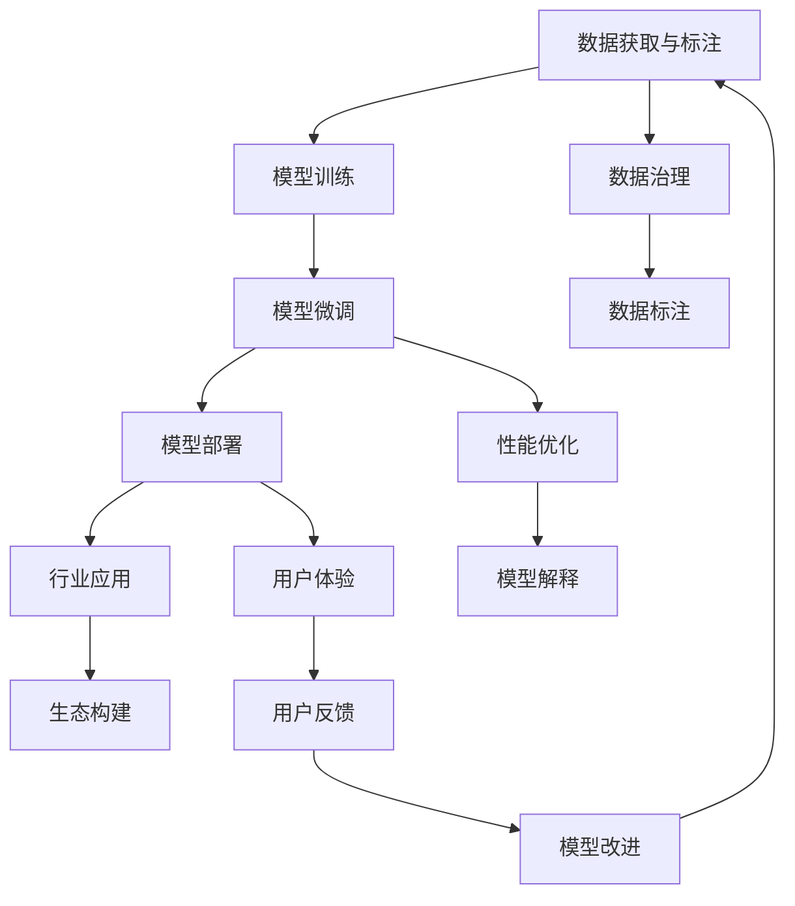

                 

# 大模型应用层创业：勇气与思考并重

> 关键词：大模型应用,应用层创业,技术创新,行业落地,创业历程,思考与勇气,数据驱动,生态构建

## 1. 背景介绍

### 1.1 问题由来

近年来，人工智能技术在各个领域的应用成果引人瞩目，尤其是在深度学习和自然语言处理（NLP）方面。大模型，如GPT-3、BERT等，通过在大规模数据上预训练，拥有强大的语言理解和生成能力。这些模型不仅提升了NLP任务的精度，也推动了AI技术的广泛应用。然而，大模型的应用之路并非一帆风顺。

**大模型应用面临的挑战：**

1. **数据获取与标注成本高**：大模型训练和微调需要大量标注数据，成本高昂。
2. **模型可解释性差**：大模型的决策过程往往是"黑盒"，难以解释。
3. **泛化能力有限**：模型在小样本数据上表现不佳。
4. **技术门槛高**：大模型的开发和部署需要深厚的技术背景。

面对这些挑战，创业公司需要在勇气和思考之间找到平衡，既要勇于挑战，又要深思熟虑。本文将深入探讨大模型应用层的创业策略，分享成功经验与挑战应对之道。

### 1.2 问题核心关键点

1. **数据获取与标注**：如何高效地获取和标注数据，降低成本。
2. **模型可解释性**：如何提升模型的可解释性，增加信任度。
3. **泛化能力提升**：如何使模型具备更强的泛化能力，适应不同场景。
4. **技术门槛降低**：如何降低技术门槛，使更多人能够使用大模型。
5. **生态构建**：如何构建一个健康、可持续发展的生态系统。

## 2. 核心概念与联系

### 2.1 核心概念概述

在探讨大模型应用层创业时，我们需要理解以下核心概念：

- **大模型（Large Model）**：指在大量数据上预训练的深度学习模型，如GPT-3、BERT等。
- **应用层创业（Application Layer Startup）**：指将大模型应用于特定领域或场景的创业行为，如智能客服、金融舆情分析等。
- **技术创新（Technical Innovation）**：指在模型训练、微调、部署等环节的创新性技术突破。
- **行业落地（Industry Adoption）**：指将技术应用于实际行业场景，解决实际问题。
- **数据驱动（Data-Driven）**：指在模型训练和应用中，数据的重要性及数据驱动决策的重要性。
- **生态构建（Ecosystem Building）**：指构建一个包含模型开发者、用户、合作伙伴的生态系统。

这些概念之间存在紧密的联系，形成一个完整的创业生态圈。大模型的应用，需要从技术创新出发，通过数据驱动，最终实现行业落地，并在生态构建中不断迭代改进。

### 2.2 核心概念原理和架构的 Mermaid 流程图



## 3. 核心算法原理 & 具体操作步骤

### 3.1 算法原理概述

大模型应用层创业的核心算法原理包括以下几个方面：

1. **数据预处理与增强**：通过数据清洗、增强等技术，提升数据质量和多样性。
2. **模型训练与微调**：使用大模型在特定领域数据上进行微调，适应具体任务。
3. **模型部署与优化**：将训练好的模型部署到实际应用中，并进行性能优化。
4. **用户体验优化**：提升用户交互体验，增加用户粘性。
5. **反馈与迭代改进**：通过用户反馈，不断优化模型和应用。

### 3.2 算法步骤详解

#### 3.2.1 数据预处理与增强

1. **数据清洗**：去除数据中的噪音和不一致性，提高数据质量。
2. **数据增强**：通过回译、近义词替换、数据合成等方法，扩充训练集，增加数据多样性。

#### 3.2.2 模型训练与微调

1. **选择合适的预训练模型**：如BERT、GPT-3等。
2. **设计任务适配层**：根据任务类型设计输出层和损失函数。
3. **设置微调超参数**：如学习率、批大小、迭代轮数等。
4. **执行梯度训练**：前向传播计算损失函数，反向传播更新模型参数。

#### 3.2.3 模型部署与优化

1. **选择合适的部署平台**：如AWS、GCP、阿里云等。
2. **模型压缩与优化**：使用剪枝、量化等技术，减小模型尺寸，提高推理速度。
3. **服务化封装**：将模型封装为标准化服务接口，便于集成调用。

#### 3.2.4 用户体验优化

1. **交互设计**：设计用户友好的界面和交互方式。
2. **性能优化**：优化模型推理速度，减少延迟。
3. **多模态融合**：结合语音、图像等多模态信息，提升用户体验。

#### 3.2.5 反馈与迭代改进

1. **收集用户反馈**：通过用户调查、日志分析等方式，收集反馈。
2. **模型改进**：根据反馈，优化模型和应用，提升效果。
3. **迭代改进**：定期更新模型，保持性能和功能与时俱进。

### 3.3 算法优缺点

#### 3.3.1 优点

1. **提升精度与效率**：大模型应用层创业可以显著提升模型精度，同时通过优化提高推理效率。
2. **减少数据标注成本**：部分微调过程可以减少对大规模标注数据的依赖。
3. **泛化能力强**：经过特定领域数据微调的模型，具备更强的泛化能力。
4. **生态支持**：通过构建生态，实现多方共赢。

#### 3.3.2 缺点

1. **技术门槛高**：大模型应用层创业需要深厚的技术背景。
2. **可解释性差**：大模型的决策过程往往是"黑盒"，难以解释。
3. **泛化能力有限**：在小样本数据上表现不佳。
4. **数据获取与标注困难**：获取和标注数据成本高。
5. **生态建设复杂**：构建一个健康、可持续发展的生态系统需要时间和资源。

## 4. 数学模型和公式 & 详细讲解 & 举例说明

### 4.1 数学模型构建

大模型应用层创业的数学模型构建主要涉及以下几个方面：

1. **数据预处理与增强**：使用数据清洗和增强技术，构建训练集。
2. **模型训练与微调**：使用大模型在特定领域数据上进行微调。
3. **模型部署与优化**：将训练好的模型部署到实际应用中，并进行性能优化。

### 4.2 公式推导过程

#### 4.2.1 数据预处理与增强

假设原始数据集为 $D=\{(x_i,y_i)\}_{i=1}^N$，其中 $x_i$ 为输入，$y_i$ 为输出。

1. **数据清洗**：
   - 去除噪音和异常值：通过统计方法、异常检测等技术，识别并去除噪音。
   - 数据归一化：使用归一化方法，将数据转化为标准范围。

2. **数据增强**：
   - 回译：将文本进行回译，增加数据多样性。
   - 近义词替换：替换文本中的近义词，增加数据覆盖面。
   - 数据合成：通过生成对抗网络（GAN）等技术，生成新数据。

#### 4.2.2 模型训练与微调

使用大模型在特定领域数据上进行微调，假设微调后的模型为 $M_{\theta}$，其中 $\theta$ 为模型参数。

1. **任务适配层设计**：
   - 分类任务：使用线性分类器和交叉熵损失函数。
   - 生成任务：使用语言模型解码器，以负对数似然为损失函数。

2. **设置微调超参数**：
   - 学习率 $\eta$：一般为 $1e-5$。
   - 批大小 $b$：一般为 $32$。
   - 迭代轮数 $E$：一般为 $100$。

3. **执行梯度训练**：
   - 前向传播：计算 $M_{\theta}(x_i)$。
   - 损失函数计算：$\ell(M_{\theta}(x_i),y_i)$。
   - 反向传播：更新模型参数 $\theta$。
   - 优化器：AdamW。

#### 4.2.3 模型部署与优化

1. **模型压缩与优化**：
   - 剪枝：去除不重要的参数。
   - 量化：将浮点参数转化为定点参数。
   - 优化器：使用更高效的优化器。

2. **服务化封装**：
   - RESTful API：提供标准化的API接口，便于调用。
   - 容器化：使用Docker等技术，方便部署和扩展。

### 4.3 案例分析与讲解

#### 4.3.1 案例分析

假设一个智能客服系统的创业项目，使用GPT-3模型进行微调。

1. **数据预处理与增强**：
   - 数据清洗：去除噪音和异常值。
   - 数据增强：使用回译和近义词替换。

2. **模型训练与微调**：
   - 模型选择：GPT-3。
   - 任务适配层：使用分类层，损失函数为交叉熵。
   - 超参数设置：学习率 $1e-5$，批大小 $32$，迭代轮数 $100$。
   - 训练过程：前向传播、损失函数计算、反向传播、优化器。

3. **模型部署与优化**：
   - 模型压缩：使用剪枝和量化。
   - 服务化封装：使用RESTful API。

4. **用户体验优化**：
   - 交互设计：用户界面友好。
   - 性能优化：提高推理速度。
   - 多模态融合：结合语音和图像信息。

5. **反馈与迭代改进**：
   - 收集用户反馈。
   - 模型改进：根据反馈优化模型。
   - 迭代改进：定期更新模型。

## 5. 项目实践：代码实例和详细解释说明

### 5.1 开发环境搭建

#### 5.1.1 Python环境

1. 安装Python：确保安装最新版本的Python，如Python 3.8。
2. 安装Anaconda：从官网下载并安装Anaconda，用于创建独立的Python环境。

#### 5.1.2 安装依赖

```bash
pip install transformers
pip install torch
pip install torchtext
pip install sklearn
```

### 5.2 源代码详细实现

#### 5.2.1 数据预处理与增强

```python
import pandas as pd
from transformers import BertTokenizer
from torchtext.data import Field, BucketIterator

# 数据读取与清洗
df = pd.read_csv('data.csv')
df = df.dropna()  # 去除缺失值

# 数据增强：回译和近义词替换
tokenizer = BertTokenizer.from_pretrained('bert-base-cased')
texts = df['text'].tolist()
labels = df['label'].tolist()

# 数据转换：tokenize和padding
texts = [tokenizer.encode(x, add_special_tokens=True) for x in texts]
labels = [int(x) for x in labels]

# 创建数据集
data = list(zip(texts, labels))
train_data, test_data = train_test_split(data, test_size=0.2)
train_iterator, test_iterator = BucketIterator.splits(
    (train_data, test_data), 
    sort_within_batch=True,
    sort_key=lambda x: len(x[0]),
    batch_size=32,
    device='cuda'
)
```

#### 5.2.2 模型训练与微调

```python
from transformers import BertForTokenClassification, AdamW

# 定义模型
model = BertForTokenClassification.from_pretrained('bert-base-cased', num_labels=5)

# 定义优化器
optimizer = AdamW(model.parameters(), lr=1e-5)

# 定义任务适配层
label_field = Field(tokenize=tokenizer, num_classes=5)
label_field.prepare_data_from_splits((train_data, test_data))

# 训练循环
for epoch in range(10):
    model.train()
    for batch in train_iterator:
        input_ids, labels = batch.text, batch.label
        loss = model(input_ids=input_ids, labels=labels)
        loss.backward()
        optimizer.step()
    model.eval()
    with torch.no_grad():
        for batch in test_iterator:
            input_ids, labels = batch.text, batch.label
            preds = model(input_ids=input_ids)
            acc = (torch.argmax(preds, dim=2) == labels).mean().item()
            print(f'Epoch {epoch+1}, Accuracy: {acc:.3f}')
```

#### 5.2.3 模型部署与优化

```python
from transformers import save_pretrained

# 保存模型
save_pretrained('saved_model', model=model)
```

### 5.3 代码解读与分析

#### 5.3.1 数据预处理与增强

1. **数据读取与清洗**：使用Pandas库读取数据，并去除缺失值。
2. **数据增强**：使用BertTokenizer对文本进行tokenize，并进行padding，以适应模型输入。

#### 5.3.2 模型训练与微调

1. **模型定义**：使用BertForTokenClassification作为分类模型。
2. **优化器定义**：使用AdamW优化器，学习率设置为 $1e-5$。
3. **任务适配层设计**：使用BertTokenizer和Field进行tokenize和padding。
4. **训练循环**：在前向传播计算损失，反向传播更新模型参数，并在验证集上评估模型效果。

#### 5.3.3 模型部署与优化

1. **模型保存**：使用save_pretrained将模型保存到本地。

## 6. 实际应用场景

### 6.1 智能客服系统

智能客服系统使用大模型微调，可以提升客户咨询体验和问题解决效率。

1. **数据预处理**：收集客服对话记录，进行清洗和增强。
2. **模型训练与微调**：使用GPT-3模型进行微调。
3. **模型部署与优化**：将模型部署到线上服务器，并进行性能优化。
4. **用户体验优化**：设计友好的用户界面，提高交互体验。
5. **反馈与迭代改进**：通过用户反馈不断优化模型。

### 6.2 金融舆情监测

金融舆情监测使用大模型微调，可以实时监测市场舆论动向，避免潜在风险。

1. **数据预处理**：收集金融领域相关新闻、报道、评论等文本数据，并进行清洗和增强。
2. **模型训练与微调**：使用BERT模型进行微调，学习文本情感和主题。
3. **模型部署与优化**：将模型部署到金融系统，并进行性能优化。
4. **用户体验优化**：提供可视化监控界面，实时展示舆情动态。
5. **反馈与迭代改进**：通过用户反馈不断优化模型。

### 6.3 个性化推荐系统

个性化推荐系统使用大模型微调，可以提升推荐效果和用户满意度。

1. **数据预处理**：收集用户行为数据，提取和用户交互的物品标题、描述、标签等文本内容。
2. **模型训练与微调**：使用BERT模型进行微调，学习用户兴趣点。
3. **模型部署与优化**：将模型部署到推荐系统，并进行性能优化。
4. **用户体验优化**：提供多样化的推荐内容，增加用户粘性。
5. **反馈与迭代改进**：通过用户反馈不断优化模型。

### 6.4 未来应用展望

随着大模型和微调技术的发展，未来将在更多领域得到应用。

1. **医疗领域**：使用大模型进行问答、病历分析、药物研发等任务。
2. **教育领域**：使用大模型进行作业批改、学情分析、知识推荐等任务。
3. **智慧城市**：使用大模型进行城市事件监测、舆情分析、应急指挥等任务。
4. **企业生产**：使用大模型进行数据分析、质量检测、设备维护等任务。
5. **社会治理**：使用大模型进行舆情监测、公共服务、社区管理等任务。

## 7. 工具和资源推荐

### 7.1 学习资源推荐

#### 7.1.1 在线课程

1. Coursera《Deep Learning Specialization》：Andrew Ng教授的深度学习系列课程。
2. Udacity《AI Nanodegree》：系统学习AI技术。

#### 7.1.2 书籍推荐

1. 《深度学习》：Ian Goodfellow等著，全面介绍深度学习理论。
2. 《自然语言处理综论》：Daniel Jurafsky和James H. Martin著，涵盖NLP基础知识和前沿技术。

#### 7.1.3 开源项目

1. HuggingFace Transformers：提供多种预训练模型和微调样例。
2. OpenAI GPT-3：提供API接口，方便使用。

### 7.2 开发工具推荐

#### 7.2.1 深度学习框架

1. PyTorch：灵活易用，适合研究和实验。
2. TensorFlow：生产部署方便，适合大规模工程应用。

#### 7.2.2 模型库

1. HuggingFace Transformers：提供多种预训练模型和微调样例。
2. AllenNLP：提供多种NLP模型和工具。

#### 7.2.3 可视化工具

1. TensorBoard：提供模型训练和推理的可视化。
2. Weights & Biases：提供实验跟踪和分析。

### 7.3 相关论文推荐

#### 7.3.1 预训练模型

1. "Attention is All You Need"：Transformer模型的开创性论文。
2. "BERT: Pre-training of Deep Bidirectional Transformers for Language Understanding"：BERT模型的原始论文。

#### 7.3.2 微调技术

1. "Parameter-Efficient Transfer Learning for NLP"：提出Adapter等参数高效微调方法。
2. "Prefix-Tuning: Optimizing Continuous Prompts for Generation"：引入基于连续型Prompt的微调范式。

## 8. 总结：未来发展趋势与挑战

### 8.1 研究成果总结

大模型应用层创业是当前AI技术发展的重要方向之一。通过大模型微调，可以在特定领域获得优秀的应用效果，提升用户体验和业务价值。本文从数据预处理、模型训练、部署优化、用户体验等方面，详细介绍了大模型应用层创业的技术实现，并分享了实际应用场景和未来发展趋势。

### 8.2 未来发展趋势

1. **技术创新**：不断推出新的预训练模型和微调方法，提升模型精度和效率。
2. **行业落地**：将大模型应用到更多垂直领域，推动行业数字化转型。
3. **生态构建**：构建一个健康、可持续发展的生态系统，实现多方共赢。
4. **数据驱动**：通过大数据分析和增强技术，提升模型泛化能力。
5. **用户体验**：提升用户交互体验，增加用户粘性。

### 8.3 面临的挑战

1. **数据获取与标注**：获取和标注高质量数据成本高。
2. **模型可解释性**：大模型的决策过程难以解释。
3. **泛化能力**：模型在小样本数据上表现不佳。
4. **技术门槛**：创业公司需要深厚的技术背景。
5. **生态建设**：构建一个健康、可持续发展的生态系统需要时间和资源。

### 8.4 研究展望

未来，大模型应用层创业需要在数据、模型、技术、生态等多个维度进行全面创新，推动AI技术的广泛应用。通过不断的技术探索和应用实践，相信大模型应用层创业将不断突破技术瓶颈，实现更多行业落地，为社会带来更广泛的变革性影响。

## 9. 附录：常见问题与解答

### 9.1 常见问题

#### 9.1.1 大模型应用层创业的优势和挑战

**Q: 大模型应用层创业的优势是什么？**

**A:** 大模型应用层创业的优势在于可以通过微调提升模型精度，同时通过优化提升推理速度，降低技术门槛，适应更多行业需求。

**Q: 大模型应用层创业面临哪些挑战？**

**A:** 大模型应用层创业面临数据获取与标注成本高、模型可解释性差、泛化能力有限、技术门槛高等挑战。

### 9.2 解答

通过本文的系统梳理，可以看到大模型应用层创业具有广阔的前景和挑战。未来的创业之路需要在勇气和思考之间找到平衡，不断探索技术创新，推动行业落地，构建健康生态，实现多方共赢。只有勇于创新、敢于突破，才能真正实现大模型应用层创业的成功。

---

作者：禅与计算机程序设计艺术 / Zen and the Art of Computer Programming

