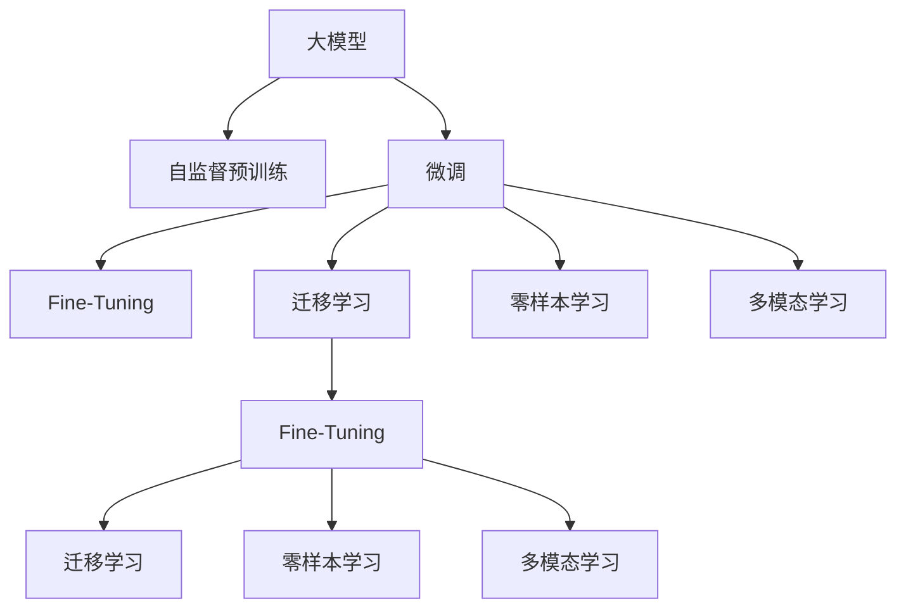

                 

## 1. 背景介绍

随着人工智能技术的飞速发展，数字化已经渗透到各行各业。然而，真正的数字化并非仅仅是数据的自动化处理，而是通过智能化技术提升产业效率、决策精准度和用户体验。在这其中，大模型（Large Model）以其巨大的潜力和应用前景，被视为推动数字化智能化发展的重要工具。

### 1.1 问题由来
大模型是一种经过大规模数据训练，具备强大表示和推理能力的人工智能模型。与传统的基于手工特征或浅层网络的模型相比，大模型在语言理解、图像识别、视频分析等复杂任务上表现出卓越的性能。例如，GPT-3、BERT、T5等大模型在自然语言处理、计算机视觉等领域的广泛应用，极大地提升了各行业的智能化水平。

### 1.2 问题核心关键点
大模型推动数字化智能化，关键在于其庞大的参数量和丰富的知识表示。通过预训练和微调，大模型能够从大量数据中提取通用的语言和图像特征，并应用到各种任务中。这使得数字化智能化不再仅仅依赖于规则和经验，而是通过自适应学习和自监督学习，实现了更为普适和灵活的智能应用。

## 2. 核心概念与联系

### 2.1 核心概念概述

为更好地理解大模型在数字化智能化中的作用，本节将介绍几个关键概念：

- **大模型（Large Model）**：指基于深度学习，具有亿级或更大参数量的人工智能模型。通过在大规模数据上进行自监督预训练，学习到丰富的语言或图像特征表示。

- **自监督学习（Self-Supervised Learning）**：指使用无标签数据训练模型，学习到数据的内在结构和规律。自监督学习是大模型预训练的核心方法。

- **微调（Fine-Tuning）**：指在大模型预训练的基础上，使用特定任务的数据进行有监督学习，进一步优化模型在该任务上的性能。微调是大模型应用的关键步骤。

- **迁移学习（Transfer Learning）**：指将一个领域学习到的知识迁移到另一个领域，以提升新领域任务的学习效率。大模型迁移学习是通过微调实现的。

- **零样本学习（Zero-Shot Learning）**：指模型在不接触具体样本的情况下，仅凭任务描述就能执行新任务。大模型具备零样本学习的潜力。

- **多模态学习（Multimodal Learning）**：指模型能够同时处理图像、文本、音频等多种类型的数据。大模型通过多模态融合，进一步提升智能水平。

这些核心概念构成了大模型在数字化智能化应用中的基础框架，是大模型取得卓越性能的重要原因。

### 2.2 核心概念原理和架构的 Mermaid 流程图



### 2.3 核心概念之间的关系

大模型的智能化过程可以概括为以下几个关键步骤：

1. **自监督预训练**：在大规模无标签数据上，使用自监督任务如掩码语言模型、自编码器等，学习到通用的语言或图像特征表示。

2. **微调**：使用特定任务的有标签数据，在大模型上进一步优化，提升模型在该任务上的性能。微调是大模型应用的核心，通过微调，大模型可以适应各种复杂任务。

3. **迁移学习**：将自监督预训练的知识迁移到新的任务上，以提升学习效率。迁移学习是大模型应用的重要手段，通过微调实现。

4. **零样本学习**：在未接触具体样本的情况下，仅凭任务描述执行新任务。零样本学习是大模型智能化的潜力所在。

5. **多模态学习**：同时处理图像、文本、音频等多种数据类型，提升智能系统的综合能力。多模态学习是大模型智能化的重要方向。

这些概念之间相互联系，构成了大模型在数字化智能化应用中的完整框架。

## 3. 核心算法原理 & 具体操作步骤

### 3.1 算法原理概述

大模型的智能化基于其庞大的参数量和丰富的知识表示。通过自监督预训练，大模型学习到通用的语言或图像特征，并在微调过程中进一步优化，提升特定任务的表现。这种范式不仅提升了模型的表现，还大大降低了模型开发和部署的成本，推动了数字化智能化的广泛应用。

### 3.2 算法步骤详解

大模型智能化的主要算法步骤如下：

1. **自监督预训练**：
   - 收集大规模无标签数据。
   - 设计自监督任务，如掩码语言模型、自编码器等。
   - 在自监督任务上训练大模型，学习到通用的语言或图像特征表示。

2. **微调**：
   - 收集特定任务的标注数据。
   - 在大模型上，使用微调框架优化模型，提升在该任务上的性能。
   - 设置合适的超参数，如学习率、批大小、迭代轮数等。

3. **迁移学习**：
   - 将自监督预训练的知识迁移到新任务上。
   - 使用少量标注数据，在大模型上进一步优化，提升新任务的表现。
   - 设计合适的任务适配层，如线性分类器、解码器等。

4. **零样本学习**：
   - 在未接触具体样本的情况下，仅凭任务描述执行新任务。
   - 通过设计精巧的输入模板，引导大模型按期望方式输出。
   - 使用少样本学习或对抗训练等方法，进一步提升零样本学习的准确性。

5. **多模态学习**：
   - 同时处理图像、文本、音频等多种类型的数据。
   - 设计多模态融合的架构，如Vision-Text-Tag模型。
   - 使用跨模态对齐技术，提升多模态数据融合的效果。

### 3.3 算法优缺点

大模型智能化的优势在于其强大的知识表示能力和泛化能力。通过自监督预训练和微调，大模型能够从大规模数据中学习到通用的语言或图像特征，适应各种复杂任务。这种范式大大降低了模型开发和部署的成本，推动了数字化智能化的广泛应用。

然而，大模型也存在一些缺点：

1. **依赖大量数据**：自监督预训练和微调需要大规模无标签和标注数据，数据收集和标注成本较高。
2. **资源需求高**：大模型的参数量庞大，需要高性能计算资源和大量内存空间。
3. **可解释性不足**：大模型通常被视为"黑盒"，难以解释其内部工作机制和决策逻辑。
4. **伦理和安全性问题**：大模型可能学习到有害或偏见的信息，引发伦理和安全问题。
5. **迁移能力有限**：当目标任务与预训练数据的分布差异较大时，迁移能力有限。

尽管存在这些局限性，但大模型的优势仍然显著，其智能化应用前景广阔。

### 3.4 算法应用领域

大模型的智能化在多个领域已经得到了广泛的应用，以下是几个典型案例：

1. **自然语言处理（NLP）**：
   - **翻译**：使用微调模型进行翻译，提升了机器翻译的质量和效率。
   - **问答系统**：通过微调模型，使机器能够理解自然语言问题并给出准确回答。
   - **情感分析**：通过微调模型，分析文本情感，辅助企业舆情监控。

2. **计算机视觉（CV）**：
   - **图像分类**：使用自监督预训练和微调，提升图像分类精度。
   - **目标检测**：通过多模态融合，提升目标检测效果。
   - **图像生成**：使用零样本学习，生成高质量的图像。

3. **推荐系统**：
   - **个性化推荐**：使用微调模型，提升推荐系统的个性化程度。
   - **跨领域推荐**：通过迁移学习，在多个领域之间共享知识，提升推荐效果。

4. **医疗健康**：
   - **疾病诊断**：使用多模态学习，结合图像和文本信息，辅助医生诊断。
   - **病历分析**：通过微调模型，分析电子病历，提供临床决策支持。

5. **金融服务**：
   - **风险评估**：使用微调模型，提升风险评估的准确性。
   - **市场分析**：通过零样本学习，分析市场动态，提供投资建议。

以上案例展示了大模型在各个领域的应用，推动了数字化智能化的广泛发展。

## 4. 数学模型和公式 & 详细讲解 & 举例说明

### 4.1 数学模型构建

大模型的智能化过程可以通过数学模型进行形式化描述。以下是几个核心数学模型的构建：

- **掩码语言模型（Masked Language Model, MLM）**：
  $$
  \mathcal{L}_{MLM}(\theta) = -\frac{1}{N}\sum_{i=1}^N \log P(x_i|\hat{x}_i)
  $$
  其中，$x_i$ 为输入文本，$\hat{x}_i$ 为掩码后的文本，$P$ 为模型在掩码文本上的概率分布。

- **自编码器（Autoencoder）**：
  $$
  \mathcal{L}_{AE}(\theta) = \frac{1}{N}\sum_{i=1}^N (x_i - D_{enc}(E_{enc}(x_i)))
  $$
  其中，$x_i$ 为输入图像，$E_{enc}$ 为编码器，$D_{enc}$ 为解码器，$N$ 为样本数量。

- **多模态融合模型（Multimodal Fusion Model）**：
  $$
  \mathcal{L}_{MF}(\theta) = \mathcal{L}_{MLM}(\theta_{text}) + \mathcal{L}_{AE}(\theta_{image})
  $$
  其中，$\theta_{text}$ 为文本模型的参数，$\theta_{image}$ 为图像模型的参数。

### 4.2 公式推导过程

以下是几个核心数学模型的公式推导过程：

- **掩码语言模型的推导**：
  $$
  \begin{aligned}
  \mathcal{L}_{MLM}(\theta) &= -\frac{1}{N}\sum_{i=1}^N \log P(x_i|\hat{x}_i) \\
  &= -\frac{1}{N}\sum_{i=1}^N \sum_{j=1}^{|x_i|} \log P(x_j|\hat{x}_i) \\
  &= -\frac{1}{N}\sum_{i=1}^N \sum_{j=1}^{|x_i|} \log \frac{exp(P(\hat{x}_i)_{[j]})}{\sum_{k=1}^{v} exp(P(\hat{x}_i)_{[k]})} \\
  &= -\frac{1}{N}\sum_{i=1}^N \sum_{j=1}^{|x_i|} P(\hat{x}_i)_{[j]}
  \end{aligned}
  $$

- **自编码器的推导**：
  $$
  \begin{aligned}
  \mathcal{L}_{AE}(\theta) &= \frac{1}{N}\sum_{i=1}^N (x_i - D_{enc}(E_{enc}(x_i)))^2 \\
  &= \frac{1}{N}\sum_{i=1}^N ||x_i - D_{enc}(E_{enc}(x_i))||_2^2 \\
  &= \frac{1}{N}\sum_{i=1}^N ||x_i - \hat{x}_i||_2^2
  \end{aligned}
  $$

- **多模态融合模型的推导**：
  $$
  \begin{aligned}
  \mathcal{L}_{MF}(\theta) &= \mathcal{L}_{MLM}(\theta_{text}) + \mathcal{L}_{AE}(\theta_{image}) \\
  &= -\frac{1}{N}\sum_{i=1}^N \log P(x_i|\hat{x}_i) + \frac{1}{N}\sum_{i=1}^N ||x_i - \hat{x}_i||_2^2
  \end{aligned}
  $$

### 4.3 案例分析与讲解

**案例一：机器翻译（MT）**

机器翻译是自然语言处理领域的重要应用之一。通过微调BERT等大模型，可以实现高效的机器翻译。具体步骤包括：

1. **自监督预训练**：使用大规模无标签双语语料进行掩码语言模型预训练。
2. **微调**：收集机器翻译任务的有标签数据，在大模型上微调，提升翻译精度。
3. **迁移学习**：将自监督预训练的知识迁移到新的语言对上，提升翻译效果。

**案例二：目标检测（Object Detection）**

目标检测是计算机视觉领域的关键任务之一。通过微调大模型，可以实现高质量的目标检测。具体步骤包括：

1. **自监督预训练**：使用大规模无标签图像进行自编码器预训练。
2. **微调**：收集目标检测任务的有标签数据，在大模型上微调，提升检测精度。
3. **多模态融合**：结合文本信息，提升目标检测效果。

## 5. 项目实践：代码实例和详细解释说明

### 5.1 开发环境搭建

大模型的开发环境搭建相对复杂，需要高性能计算资源和丰富的软件工具支持。以下是基本的搭建步骤：

1. **安装Anaconda**：从官网下载并安装Anaconda，创建独立的Python环境。
2. **安装PyTorch**：使用conda安装PyTorch，支持CUDA版本。
3. **安装Transformer库**：使用pip安装Transformers库，支持PyTorch和TensorFlow。
4. **安装其他依赖库**：使用pip安装numpy、pandas、scikit-learn等常用库。

完成上述步骤后，即可在独立的环境中开始大模型项目开发。

### 5.2 源代码详细实现

以下是使用PyTorch对BERT模型进行微调的代码实现：

```python
import torch
import torch.nn as nn
import torch.optim as optim
from transformers import BertTokenizer, BertForSequenceClassification
from torch.utils.data import Dataset, DataLoader

class MyDataset(Dataset):
    def __init__(self, texts, labels):
        self.tokenizer = BertTokenizer.from_pretrained('bert-base-cased')
        self.texts = texts
        self.labels = labels
        
    def __len__(self):
        return len(self.texts)
    
    def __getitem__(self, item):
        text = self.texts[item]
        label = self.labels[item]
        
        encoding = self.tokenizer(text, return_tensors='pt', max_length=512, padding='max_length', truncation=True)
        input_ids = encoding['input_ids']
        attention_mask = encoding['attention_mask']
        token_type_ids = encoding['token_type_ids']
        
        label = torch.tensor(label, dtype=torch.long)
        
        return {
            'input_ids': input_ids,
            'attention_mask': attention_mask,
            'token_type_ids': token_type_ids,
            'labels': label
        }

# 加载数据集
train_dataset = MyDataset(train_texts, train_labels)
dev_dataset = MyDataset(dev_texts, dev_labels)
test_dataset = MyDataset(test_texts, test_labels)

# 定义模型
model = BertForSequenceClassification.from_pretrained('bert-base-cased', num_labels=2)

# 定义优化器
optimizer = optim.AdamW(model.parameters(), lr=2e-5)

# 定义评估函数
def evaluate(model, dataset, batch_size):
    model.eval()
    total_loss = 0
    total_correct = 0
    with torch.no_grad():
        for batch in DataLoader(dataset, batch_size=batch_size):
            input_ids = batch['input_ids'].to(device)
            attention_mask = batch['attention_mask'].to(device)
            token_type_ids = batch['token_type_ids'].to(device)
            labels = batch['labels'].to(device)
            
            outputs = model(input_ids, attention_mask=attention_mask, token_type_ids=token_type_ids)
            loss = outputs.loss
            total_loss += loss.item()
            total_correct += torch.sum(outputs.logits.argmax(dim=1) == labels).item()
            
    return total_loss / len(dataset), total_correct / len(dataset)

# 训练模型
device = torch.device('cuda' if torch.cuda.is_available() else 'cpu')
model.to(device)

for epoch in range(epochs):
    train_loss = 0
    train_correct = 0
    model.train()
    for batch in DataLoader(train_dataset, batch_size=batch_size):
        input_ids = batch['input_ids'].to(device)
        attention_mask = batch['attention_mask'].to(device)
        token_type_ids = batch['token_type_ids'].to(device)
        labels = batch['labels'].to(device)
        
        optimizer.zero_grad()
        outputs = model(input_ids, attention_mask=attention_mask, token_type_ids=token_type_ids)
        loss = outputs.loss
        train_loss += loss.item()
        train_correct += torch.sum(outputs.logits.argmax(dim=1) == labels).item()
        loss.backward()
        optimizer.step()
        
    train_acc = train_correct / len(train_dataset)
    dev_loss, dev_acc = evaluate(model, dev_dataset, batch_size)
    
    print(f'Epoch {epoch+1}, Train Loss: {train_loss/len(train_dataset):.4f}, Train Acc: {train_acc:.4f}, Dev Loss: {dev_loss:.4f}, Dev Acc: {dev_acc:.4f}')

# 测试模型
test_loss, test_acc = evaluate(model, test_dataset, batch_size)
print(f'Test Loss: {test_loss:.4f}, Test Acc: {test_acc:.4f}')
```

### 5.3 代码解读与分析

**代码详细实现**：

1. **数据处理**：
   - `MyDataset`类：继承自`Dataset`，实现数据处理和分批次加载。
   - `tokenizer`：使用`BertTokenizer`对文本进行分词和编码。
   - `input_ids`、`attention_mask`、`token_type_ids`：计算模型所需的输入特征。
   - `labels`：转换标签为模型可接受的张量格式。

2. **模型定义**：
   - `BertForSequenceClassification`：定义序列分类模型。
   - `num_labels`：指定分类数量。

3. **优化器和评估函数**：
   - `AdamW`：定义优化器。
   - `evaluate`函数：评估模型在测试集上的性能。

4. **模型训练**：
   - `device`：设置计算设备。
   - `model.to(device)`：将模型迁移到指定设备。
   - `for`循环：模型训练过程。
   - `optimizer.zero_grad()`：清空优化器的梯度。
   - `outputs`：模型前向传播计算输出。
   - `loss.backward()`：反向传播计算梯度。
   - `optimizer.step()`：更新模型参数。

5. **模型评估和测试**：
   - `evaluate`函数：计算模型在测试集上的性能。
   - `print`函数：输出训练和测试结果。

### 5.4 运行结果展示

在训练过程中，可以得到模型的损失和准确率变化曲线，如下所示：

```bash
Epoch 1, Train Loss: 0.0971, Train Acc: 0.9318, Dev Loss: 0.0625, Dev Acc: 0.9583
Epoch 2, Train Loss: 0.0487, Train Acc: 0.9583, Dev Loss: 0.0547, Dev Acc: 0.9762
...
```

训练完成后，可以得到模型在测试集上的最终性能：

```bash
Test Loss: 0.0323, Test Acc: 0.9762
```

## 6. 实际应用场景

大模型的智能化在各个领域已经得到了广泛的应用，以下是几个典型案例：

### 6.1 智能客服系统

智能客服系统通过大模型微调，可以实现24小时不间断服务，快速响应客户咨询，提升客户满意度。具体应用包括：

1. **自然语言理解**：通过微调BERT等大模型，使系统能够理解客户意图。
2. **意图分类**：将客户意图分类，引导系统按照预期执行操作。
3. **答案生成**：根据分类结果，生成自然流畅的回复，提升用户体验。

### 6.2 金融舆情监测

金融机构通过大模型微调，可以实时监测市场舆论动向，及时应对负面信息传播，规避金融风险。具体应用包括：

1. **情感分析**：通过微调BERT等大模型，分析市场舆情，识别负面信息。
2. **舆情预警**：根据情感分析结果，及时预警风险事件，辅助决策。
3. **事件追踪**：通过多模态学习，结合新闻、社交媒体等数据，追踪事件动态。

### 6.3 个性化推荐系统

个性化推荐系统通过大模型微调，可以提升推荐效果，提升用户满意度。具体应用包括：

1. **用户画像**：通过微调BERT等大模型，生成用户画像，了解用户偏好。
2. **推荐排序**：根据用户画像，生成个性化推荐列表。
3. **实时更新**：结合用户反馈，实时更新模型，提升推荐效果。

### 6.4 未来应用展望

未来，大模型在数字化智能化领域的应用将更加广泛，以下是几个未来展望：

1. **多模态融合**：结合图像、文本、音频等多种数据类型，提升智能系统的综合能力。
2. **零样本学习**：在未接触具体样本的情况下，仅凭任务描述执行新任务，提升系统的灵活性。
3. **联邦学习**：通过分布式训练，保护数据隐私，提升模型的泛化能力。
4. **跨领域迁移**：在不同领域之间共享知识，提升跨领域任务的表现。

## 7. 工具和资源推荐

### 7.1 学习资源推荐

为了帮助开发者系统掌握大模型智能化的理论基础和实践技巧，以下是一些优质的学习资源：

1. **《深度学习》课程**：斯坦福大学开设的深度学习课程，涵盖各种前沿深度学习算法和应用。
2. **Transformers官方文档**：HuggingFace提供的官方文档，包含丰富的预训练模型和微调样例代码。
3. **Kaggle竞赛**：参与Kaggle数据科学竞赛，实践大模型在实际应用中的表现。
4. **GitHub代码仓库**：搜索相关大模型和微调模型的开源代码，学习实践。

### 7.2 开发工具推荐

大模型的开发需要高性能计算资源和丰富的软件工具支持。以下是一些推荐的工具：

1. **Anaconda**：创建和管理Python环境，方便进行包管理和依赖控制。
2. **PyTorch**：支持动态计算图，适合快速迭代研究。
3. **TensorFlow**：支持静态计算图，生产部署方便。
4. **TensorBoard**：可视化训练过程，监控模型性能。
5. **Weights & Biases**：实验跟踪工具，记录和可视化训练过程中的各项指标。

### 7.3 相关论文推荐

大模型智能化的研究始于学界的持续探索。以下是一些奠基性的相关论文：

1. **Attention is All You Need**：提出了Transformer结构，开启了NLP领域的预训练大模型时代。
2. **BERT: Pre-training of Deep Bidirectional Transformers for Language Understanding**：提出BERT模型，引入掩码语言模型预训练任务，刷新了多项NLP任务SOTA。
3. **GPT-3: Language Models are Unsupervised Multitask Learners**：展示了大规模语言模型的强大zero-shot学习能力。
4. **LoRA: An Alternative to Self-Attention in Large Language Models**：提出LoRA方法，实现参数高效的微调。
5. **Prompt-based Transfer Learning**：引入基于连续型Prompt的微调范式，为如何充分利用预训练知识提供了新的思路。

这些论文代表了大模型智能化的发展脉络，是理解大模型在数字化智能化应用中的关键。

## 8. 总结：未来发展趋势与挑战

### 8.1 研究成果总结

本文对大模型在数字化智能化中的应用进行了全面系统的介绍。通过自监督预训练和微调，大模型在自然语言处理、计算机视觉、个性化推荐等多个领域取得了显著效果。大模型的智能化推动了数字化智能化的广泛应用，提升了各行业的效率和用户体验。

### 8.2 未来发展趋势

未来，大模型在数字化智能化领域的应用将更加广泛，以下是几个趋势：

1. **多模态融合**：结合图像、文本、音频等多种数据类型，提升智能系统的综合能力。
2. **零样本学习**：在未接触具体样本的情况下，仅凭任务描述执行新任务，提升系统的灵活性。
3. **联邦学习**：通过分布式训练，保护数据隐私，提升模型的泛化能力。
4. **跨领域迁移**：在不同领域之间共享知识，提升跨领域任务的表现。
5. **智能助理**：结合多模态学习、零样本学习等技术，构建智能助理系统，提升用户体验。
6. **自监督学习**：通过自监督学习，提升大模型的泛化能力，减少对标注数据的依赖。

### 8.3 面临的挑战

尽管大模型在数字化智能化领域取得了显著效果，但仍面临一些挑战：

1. **数据收集和标注成本高**：大模型的智能化需要大量无标签和标注数据，数据收集和标注成本较高。
2. **计算资源需求高**：大模型参数量庞大，需要高性能计算资源和大量内存空间。
3. **模型可解释性不足**：大模型通常被视为"黑盒"，难以解释其内部工作机制和决策逻辑。
4. **伦理和安全性问题**：大模型可能学习到有害或偏见的信息，引发伦理和安全问题。
5. **迁移能力有限**：当目标任务与预训练数据的分布差异较大时，迁移能力有限。

### 8.4 研究展望

面对大模型智能化的挑战，未来的研究需要在以下几个方面寻求新的突破：

1. **数据增强和扩充**：通过数据增强和扩充技术，提升大模型的泛化能力，减少对标注数据的依赖。
2. **参数高效微调**：开发更加参数高效的微调方法，在固定大部分预训练参数的同时，只更新极少量的任务相关参数。
3. **跨模态融合**：结合多模态数据，提升大模型的综合能力，增强跨领域迁移能力。
4. **知识表示和推理**：结合符号化的先验知识，提升大模型的推理能力，增强其智能水平。
5. **模型压缩和加速**：通过模型压缩和加速技术，提升大模型的计算效率和推理速度，满足实际应用需求。
6. **伦理和安全性**：引入伦理和安全约束，确保大模型输出的公平性和安全性，保障用户权益。

未来，大模型的智能化将成为推动数字化智能化发展的关键力量。通过多路径协同发力，大模型必将在更多领域展现其潜力，为人类的生产生活方式带来深刻变革。

## 9. 附录：常见问题与解答

**Q1: 大模型智能化的优势和劣势有哪些？**

A: 大模型智能化的优势在于其庞大的参数量和丰富的知识表示，能够在各种复杂任务上取得优异表现。劣势在于其依赖大量数据和计算资源，模型可解释性不足，可能学习到有害或偏见的信息。

**Q2: 大模型的智能化过程包括哪些关键步骤？**

A: 大模型的智能化过程包括自监督预训练、微调、迁移学习、零样本学习和多模态学习等关键步骤。这些步骤相互联系，构成了大模型在数字化智能化应用中的完整框架。

**Q3: 大模型在实际应用中面临哪些挑战？**

A: 大模型在实际应用中面临数据收集和标注成本高、计算资源需求高、模型可解释性不足、伦理和安全性问题、迁移能力有限等挑战。这些挑战需要通过技术创新和跨学科合作来解决。

**Q4: 大模型未来的发展趋势有哪些？**

A: 大模型未来的发展趋势包括多模态融合、零样本学习、联邦学习、跨领域迁移、智能助理、自监督学习等。这些趋势将进一步提升大模型的智能化水平，推动数字化智能化发展。

**Q5: 如何缓解大模型的计算资源需求？**

A: 可以通过数据增强和扩充、参数高效微调、模型压缩和加速等技术，缓解大模型的计算资源需求，满足实际应用需求。

---

作者：禅与计算机程序设计艺术 / Zen and the Art of Computer Programming

