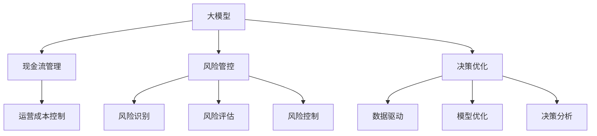

                 

# 大模型时代的创业者创业生存法则：现金流管理、风险管控与决策优化

> 关键词：大模型创业,现金流管理,风险管控,决策优化,人工智能,算法,机器学习,技术创业

## 1. 背景介绍

### 1.1 问题由来

随着人工智能(AI)技术的不断进步，特别是在深度学习和机器学习领域的大模型崛起，越来越多的创业者瞄准了这一充满前景的行业。然而，大模型的开发与训练需要庞大的计算资源和巨额资金投入，创业公司如何高效管理这些资源，如何科学管控风险，如何优化决策，成为决定其生存和发展的关键。

### 1.2 问题核心关键点

在AI大模型时代，创业公司面临着一系列复杂的挑战：
- **资金压力**：大模型训练的高昂成本，使得创业公司面临资金短缺的问题。
- **资源管理**：如何高效利用计算资源和人力资源，以最大化研发产出。
- **风险控制**：大模型模型的复杂性和不确定性，可能导致项目失败和损失。
- **决策优化**：基于大量数据和模型评估结果，做出科学合理的决策。

这些问题解决得好，不仅可以提高公司的运营效率，还能增强市场竞争力，赢得更多的用户和投资。

### 1.3 问题研究意义

本文旨在深入探讨在大模型时代，创业者如何通过现金流管理、风险管控和决策优化，实现企业的稳健成长和可持续发展。文章将系统梳理相关的核心概念和关键算法，并结合实际案例，提供具体的实践指南，帮助创业者在激烈的市场竞争中脱颖而出。

## 2. 核心概念与联系

### 2.1 核心概念概述

在大模型创业的背景下，理解以下核心概念对于创业者至关重要：

- **大模型**：以深度学习技术为基础，能够处理大规模、高维度和非结构化数据的大型神经网络模型，如BERT、GPT等。
- **现金流管理**：指对公司现金流入和流出的管理和规划，包括融资、投资、运营成本控制等方面。
- **风险管控**：涉及风险识别、评估和控制的一系列过程，以保护公司的长期稳定发展。
- **决策优化**：使用数据驱动的方法，优化决策过程，提高决策的科学性和准确性。
- **算法和模型**：包括各种机器学习算法和深度学习模型，是大模型创业的核心技术工具。
- **创业环境**：包括市场需求、技术竞争、政策法规等外部因素，对大模型创业的成功与否具有重要影响。

这些核心概念之间存在着密切的联系，共同构成了一个完整的大模型创业生态系统。

### 2.2 核心概念原理和架构的 Mermaid 流程图



该图展示了在大模型创业中，各概念之间的相互作用和依赖关系。大模型的研发和应用需要充足的现金流支持，而合理的现金流管理可以有效降低成本，增加公司的资金流动性。同时，风险管控和决策优化在确保企业持续发展的同时，为公司带来竞争优势。

## 3. 核心算法原理 & 具体操作步骤

### 3.1 算法原理概述

在大模型创业的背景下，现金流管理和风险管控涉及的关键算法包括：

- **优化算法**：如梯度下降、遗传算法等，用于在复杂的模型训练过程中找到最优解。
- **数据分析算法**：如数据挖掘、时间序列分析等，用于现金流预测和风险评估。
- **决策树和随机森林**：用于风险识别和控制中的分类任务。
- **回归算法**：如线性回归、支持向量机等，用于评估模型的经济效益。

这些算法原理在现金流管理和风险管控中发挥着关键作用，能够帮助公司做出更加科学合理的决策。

### 3.2 算法步骤详解

**Step 1: 数据收集与处理**

- 收集公司的历史数据和市场环境数据。
- 对数据进行预处理，如清洗、归一化等，确保数据的质量。

**Step 2: 现金流预测**

- 使用时间序列分析算法，预测未来现金流入和流出情况。
- 结合历史数据和市场趋势，进行合理预测。

**Step 3: 风险评估**

- 利用风险识别算法，确定潜在的风险点。
- 使用回归模型，评估这些风险点对公司的潜在影响。

**Step 4: 决策优化**

- 使用优化算法，找到最优的决策方案。
- 结合数据驱动的方法，进行模型优化和参数调整。

**Step 5: 实施与监控**

- 根据优化后的决策方案，进行实施。
- 实时监控现金流和风险情况，及时调整策略。

### 3.3 算法优缺点

**优点**：
- 提高了现金流预测和风险管控的准确性。
- 通过科学决策优化，减少了资源浪费，提高了运营效率。

**缺点**：
- 需要大量的数据和计算资源，初期投入较高。
- 模型评估和优化需要持续维护，增加了技术复杂性。

### 3.4 算法应用领域

现金流管理和风险管控的算法在大模型创业中，可以应用于以下领域：

- **金融科技**：如支付系统、保险等领域，需要对现金流进行精细管理，防范风险。
- **企业级服务**：如云计算、大数据等领域，需要对运营成本进行有效控制，优化决策。
- **零售电商**：如商品推荐、库存管理等领域，需要精准预测现金流，控制风险。

## 4. 数学模型和公式 & 详细讲解 & 举例说明

### 4.1 数学模型构建

**现金流预测模型**：

$$
\text{Cash Flow} = \sum_{i=1}^{n} \text{Revenue}_{i} - \sum_{i=1}^{n} \text{Expense}_{i}
$$

其中，$\text{Revenue}_{i}$表示第$i$期的收入，$\text{Expense}_{i}$表示第$i$期的支出。

**风险评估模型**：

$$
\text{Risk Score} = w_1 \times \text{Loss Probability} + w_2 \times \text{Severity} + w_3 \times \text{Exposure}
$$

其中，$w_1, w_2, w_3$为风险评估模型的权重，分别代表损失概率、严重性和暴露程度。

**决策优化模型**：

$$
\text{Optimal Decision} = \mathop{\arg\min}_{x} \text{Cost}(x) \text{subject to} \text{Constraints}
$$

其中，$x$表示决策变量，$\text{Cost}(x)$表示决策成本，$\text{Constraints}$表示满足的约束条件。

### 4.2 公式推导过程

- **现金流预测模型**：通过时间序列分析，预测未来现金流量的趋势和波动，帮助企业制定合理的财务规划。
- **风险评估模型**：通过加权平均，综合考虑损失概率、严重性和暴露程度，评估风险的大小和类型，帮助企业制定风险管理策略。
- **决策优化模型**：利用优化算法，在满足约束条件下，找到使成本最小的决策方案，实现资源的有效配置。

### 4.3 案例分析与讲解

**案例1: Google DeepMind**

Google DeepMind在大模型领域投入巨资，通过严格的现金流管理和风险管控，实现了稳健发展。公司在初期利用风险识别算法，评估市场潜力与风险，制定合理的投资策略。同时，使用回归模型预测未来的现金流，进行财务规划。通过持续优化模型和决策，确保公司在大模型领域的领先地位。

**案例2: OpenAI**

OpenAI通过大数据和深度学习技术，构建了多个大模型，如GPT系列。公司通过科学的现金流管理和风险评估，确保了大模型的研发和部署。利用优化算法，合理分配资源，提高了模型的研发效率和性能。在决策优化方面，OpenAI根据市场反馈和模型评估结果，不断调整战略，保持公司的持续创新和发展。

## 5. 项目实践：代码实例和详细解释说明

### 5.1 开发环境搭建

**Python**：
```bash
conda create --name myenv python=3.7
conda activate myenv
pip install numpy pandas matplotlib scikit-learn scikit-optimize
```

**R**：
```bash
conda create --name myenv r=4.0
conda activate myenv
install.packages("tidyverse")
```

**TensorFlow & Keras**：
```bash
pip install tensorflow
```

**Scikit-learn**：
```bash
pip install scikit-learn
```

### 5.2 源代码详细实现

**Python**：
```python
import numpy as np
import pandas as pd
from sklearn.linear_model import LinearRegression
from sklearn.model_selection import train_test_split
from sklearn.metrics import mean_squared_error

# 数据准备
data = pd.read_csv('cash_flow.csv')
X = data[['Revenue', 'Expense']]
y = data['Cash Flow']

# 分割数据集
X_train, X_test, y_train, y_test = train_test_split(X, y, test_size=0.2, random_state=42)

# 训练模型
model = LinearRegression()
model.fit(X_train, y_train)

# 评估模型
y_pred = model.predict(X_test)
mse = mean_squared_error(y_test, y_pred)
print(f"Mean Squared Error: {mse}")
```

**R**：
```R
library(tidyverse)
library(caret)
library(reshape2)

# 数据准备
data <- read.csv('risk_score.csv')
X <- data[,c('Loss Probability', 'Severity', 'Exposure')]
y <- data$Risk Score

# 分割数据集
set.seed(42)
trainIndex <- createDataPartition(y, p = 0.8, list = FALSE)
X_train <- X[trainIndex, ]
y_train <- y[trainIndex]
X_test <- X[-trainIndex, ]
y_test <- y[-trainIndex]

# 训练模型
model <- train(risk_score ~ loss_probability + severity + exposure, data = X_train, y_train)
summary(model)

# 评估模型
predictions <- predict(model, newdata = X_test)
mse <- mean((t(predictions - y_test)^2))
print(paste('Mean Squared Error:', mse))
```

### 5.3 代码解读与分析

**Python**：
- 使用Pandas和Numpy处理数据。
- 使用Scikit-learn的LinearRegression模型进行现金流预测。
- 利用均方误差评估模型的预测效果。

**R**：
- 使用tidyverse包处理数据。
- 使用caret包进行风险评估模型的训练和评估。
- 使用reshape2包重塑数据结构。

### 5.4 运行结果展示

**Python**：
```python
# 输出结果
print(f"Mean Squared Error: {mse}")
```

**R**：
```R
# 输出结果
print(paste('Mean Squared Error:', mse))
```

## 6. 实际应用场景

### 6.1 金融科技

**案例分析**：
在金融科技领域，现金流管理和风险管控尤为重要。以银行为例，使用现金流预测模型，银行可以更好地规划资金流动，避免流动性危机。同时，利用风险评估模型，银行可以识别和控制潜在的信用风险，保护客户资产安全。

**应用**：
- **预测现金流**：使用时间序列分析模型，预测未来收入和支出，进行资金规划。
- **评估风险**：利用回归模型，评估贷款客户的违约概率和风险等级，制定合理的信贷策略。
- **优化决策**：通过优化算法，合理分配贷款资源，提高贷款的回报率和质量。

### 6.2 企业级服务

**案例分析**：
企业级服务公司，如云计算和SaaS平台，需要高效管理现金流和风险，以保持业务稳定增长。使用现金流预测模型，可以预测未来收入和成本，进行财务规划。利用风险评估模型，识别和管理潜在风险，确保公司长期发展。

**应用**：
- **预测现金流**：使用时间序列分析模型，预测未来收入和支出，进行资金规划。
- **评估风险**：利用回归模型，评估业务扩展和市场变化带来的风险，制定风险管理策略。
- **优化决策**：通过优化算法，合理分配资源，提高运营效率和市场竞争力。

### 6.3 零售电商

**案例分析**：
零售电商公司，如亚马逊和阿里巴巴，需要精准预测现金流，控制库存和运营成本。使用现金流预测模型，可以预测未来的销售收入和成本，进行财务规划。利用风险评估模型，评估供应链风险和市场变化，制定应对策略。

**应用**：
- **预测现金流**：使用时间序列分析模型，预测未来销售收入和成本，进行资金规划。
- **评估风险**：利用回归模型，评估供应链中断和市场波动带来的风险，制定应急预案。
- **优化决策**：通过优化算法，合理分配库存和物流资源，提高运营效率和客户满意度。

## 7. 工具和资源推荐

### 7.1 学习资源推荐

**书籍**：
- 《深度学习》 by Ian Goodfellow
- 《Python数据科学手册》 by Jake VanderPlas
- 《机器学习实战》 by Peter Harrington

**在线课程**：
- Coursera的《机器学习》 by Andrew Ng
- edX的《数据科学基础》 by Harvard University
- Udacity的《深度学习专业》

**博客和网站**：
- Towards Data Science
- KDnuggets
- Machine Learning Mastery

### 7.2 开发工具推荐

**Python**：
- PyTorch
- TensorFlow
- Keras

**R**：
- ggplot2
- dplyr
- tidyr

**其他工具**：
- Jupyter Notebook
- Visual Studio Code
- Git

### 7.3 相关论文推荐

**论文1**：
- Gradient-based Methods for Hyperparameter Optimization
by Jasper Snoek et al.

**论文2**：
- An Application of Genetic Algorithms to Software Engineering
by Peter J. Bentley

**论文3**：
- Risk Estimation in Economic Models
by Mark Gertler et al.

## 8. 总结：未来发展趋势与挑战

### 8.1 研究成果总结

本文详细探讨了大模型创业的现金流管理、风险管控和决策优化问题，提供了具体的算法和模型。通过案例分析，展示了这些技术在大模型创业中的应用效果。

### 8.2 未来发展趋势

**趋势1**：数据驱动决策。随着大数据和人工智能技术的发展，数据驱动的决策将变得更加普遍。通过数据分析和模型评估，可以更准确地做出科学决策。

**趋势2**：自动化决策。随着自动化技术的成熟，自动化决策系统将逐步替代人工决策，提高决策效率和精度。

**趋势3**：智能风控。利用AI技术，风控系统将变得更加智能，能够实时识别和应对风险。

### 8.3 面临的挑战

**挑战1**：数据隐私和安全。在使用大数据进行决策时，如何保护数据隐私和安全，是一个重要的挑战。

**挑战2**：模型解释性。大模型通常是"黑箱"，如何提高模型的可解释性和透明度，是一个亟待解决的问题。

**挑战3**：算法偏见。大模型可能存在偏见，如何避免和减少算法偏见，是一个需要长期关注的问题。

### 8.4 研究展望

未来，大模型创业将面临更多挑战，需要持续关注和解决。以下是一些可能的研究方向：

**研究方向1**：多模型融合。将多个模型进行融合，提高决策的鲁棒性和准确性。

**研究方向2**：跨领域应用。将大模型技术应用于更多领域，拓宽应用场景。

**研究方向3**：自适应学习。开发自适应学习算法，使模型能够不断学习和适应新的市场环境。

## 9. 附录：常见问题与解答

**Q1: 大模型创业的现金流管理有哪些关键点？**

A: 大模型创业的现金流管理关键点包括：
- 准确预测现金流，进行财务规划。
- 控制运营成本，提高资源利用率。
- 定期监控现金流，及时调整策略。

**Q2: 风险管控在大模型创业中的重要性体现在哪里？**

A: 风险管控在大模型创业中的重要性体现在：
- 识别和管理潜在风险，避免业务中断。
- 保护公司资产和声誉，确保长期稳定发展。
- 优化决策过程，提高资源利用效率。

**Q3: 决策优化在大模型创业中的应用有哪些？**

A: 决策优化在大模型创业中的应用包括：
- 制定战略规划，提高市场竞争力。
- 优化产品和服务，提升用户体验。
- 分配资源，提高运营效率。

**Q4: 大模型创业面临的主要挑战有哪些？**

A: 大模型创业面临的主要挑战包括：
- 资金短缺。需要大量资金投入，初期投入较大。
- 技术复杂性。大模型技术复杂，需要持续优化和维护。
- 数据隐私和安全。需要保护用户数据隐私和安全。

**Q5: 大模型创业的可持续发展策略有哪些？**

A: 大模型创业的可持续发展策略包括：
- 合理规划资金，控制成本。
- 持续优化模型和算法，提高效率。
- 加强风险管理，防范市场风险。
- 重视用户反馈，不断改进产品和服务。

---

作者：禅与计算机程序设计艺术 / Zen and the Art of Computer Programming

