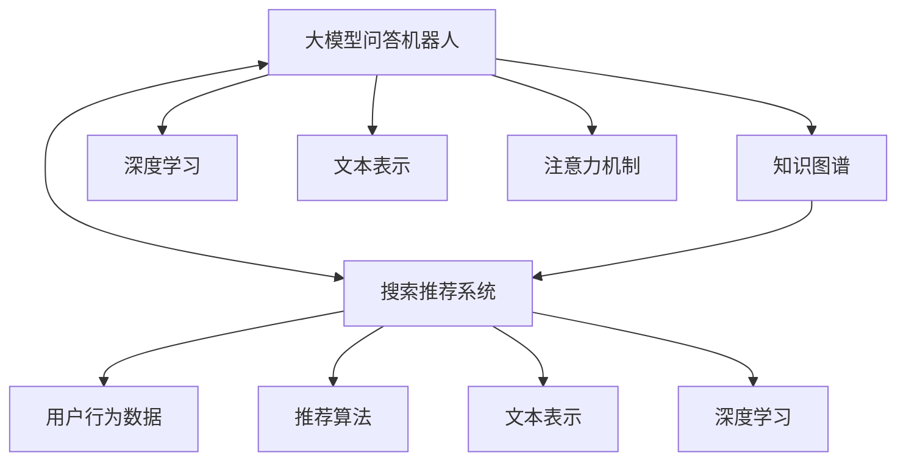

                 

# 大模型问答机器人与搜索推荐的对比

> 关键词：大模型问答机器人, 搜索推荐, 知识图谱, 深度学习, 文本表示, 注意力机制

## 1. 背景介绍

### 1.1 问题由来

近年来，随着深度学习技术的飞速发展，人工智能在多个领域取得了显著的进展，其中大模型问答机器人与搜索推荐系统是两大典型的应用。问答机器人能够根据用户输入的自然语言问题，从知识库中抽取或生成对应的答案；而搜索推荐系统则能够根据用户的历史行为数据，预测用户可能感兴趣的内容，为用户提供个性化的信息服务。

尽管两者在应用场景和具体实现上有所不同，但它们都基于大规模的数据集进行训练，并通过深度学习技术实现了复杂的信息检索和生成任务。本文将从核心概念、算法原理、应用场景等多个角度，对比分析大模型问答机器人与搜索推荐系统的异同点，并探讨其未来发展趋势和面临的挑战。

### 1.2 问题核心关键点

- **核心概念**：大模型问答机器人与搜索推荐系统的核心概念和技术。
- **核心算法**：问答机器人的检索生成算法与搜索推荐系统的推荐算法。
- **应用场景**：两者在不同领域的具体应用场景。
- **优缺点**：两者在性能、可解释性、安全性等方面的优势与不足。
- **未来展望**：两者在技术演进、应用拓展和伦理道德方面的发展趋势。

## 2. 核心概念与联系

### 2.1 核心概念概述

为更好地理解大模型问答机器人与搜索推荐系统的对比，本文将介绍几个密切相关的核心概念：

- **大模型问答机器人**：基于深度学习的大规模语言模型，能够理解和生成自然语言，用于回答问题或生成文本。
- **搜索推荐系统**：通过分析用户的历史行为和兴趣，预测用户可能感兴趣的内容，实现个性化信息推荐。
- **知识图谱**：结构化的知识库，将实体、关系和属性组织成图形结构，用于语义理解与推理。
- **深度学习**：一种基于神经网络的机器学习技术，能够自动从数据中提取特征，用于分类、回归、生成等多种任务。
- **文本表示**：将自然语言文本转换为机器可处理的向量形式，用于语义相似度计算和信息检索。
- **注意力机制**：一种机制，用于在生成过程中动态关注输入的不同部分，提升模型的性能和可解释性。

这些核心概念之间的逻辑关系可以通过以下Mermaid流程图来展示：



这个流程图展示了问答机器人和搜索推荐系统的核心概念及其之间的关系：

1. 大模型问答机器人通过深度学习技术，将知识图谱中的信息转换为向量表示，并引入注意力机制，实现复杂的信息检索和生成。
2. 搜索推荐系统通过深度学习技术，分析用户行为数据，生成向量表示，并应用推荐算法，实现个性化信息推荐。
3. 两者都依赖于深度学习技术，通过向量表示和注意力机制，提升模型的性能和可解释性。

## 3. 核心算法原理 & 具体操作步骤
### 3.1 算法原理概述

大模型问答机器人与搜索推荐系统在算法原理上有诸多相似之处，它们都基于深度学习技术，通过大规模数据集的训练，实现复杂的信息检索和生成/推荐任务。

**3.1.1 大模型问答机器人**

大模型问答机器人通过深度学习技术，将自然语言转换为向量表示，并从知识图谱中检索或生成相关信息。其核心算法包括：

1. **文本编码器**：将自然语言文本转换为向量表示，如BERT、GPT等。
2. **注意力机制**：在生成过程中动态关注输入的不同部分，提升模型的性能和可解释性。
3. **知识图谱**：结构化的知识库，将实体、关系和属性组织成图形结构，用于语义理解与推理。

**3.1.2 搜索推荐系统**

搜索推荐系统通过深度学习技术，分析用户的历史行为数据，生成向量表示，并应用推荐算法实现个性化信息推荐。其核心算法包括：

1. **用户行为建模**：通过深度学习技术，将用户行为数据转换为向量表示。
2. **推荐算法**：基于向量表示，应用协同过滤、矩阵分解等算法，实现个性化信息推荐。
3. **注意力机制**：在生成推荐结果时，动态关注用户历史行为的不同部分，提升推荐精度和可解释性。

### 3.2 算法步骤详解

**3.2.1 大模型问答机器人**

1. **数据预处理**：将自然语言文本转换为向量表示，如分词、停用词过滤等。
2. **模型训练**：使用大规模数据集对深度学习模型进行训练，如BERT、GPT等。
3. **知识图谱嵌入**：将知识图谱中的实体、关系和属性转换为向量表示，与文本向量进行语义相似度计算。
4. **信息检索与生成**：根据用户问题或文本，从知识图谱中检索或生成相关信息，形成答案。

**3.2.2 搜索推荐系统**

1. **用户行为数据收集**：收集用户的历史行为数据，如浏览记录、点击行为等。
2. **用户行为建模**：使用深度学习技术，将用户行为数据转换为向量表示。
3. **推荐算法训练**：使用用户行为向量进行训练，应用协同过滤、矩阵分解等推荐算法。
4. **推荐结果生成**：根据用户历史行为向量，生成个性化推荐结果。

### 3.3 算法优缺点

**大模型问答机器人**

- **优点**：
  - 能够理解复杂自然语言，生成高质量文本。
  - 可以通过知识图谱进行语义推理，增强回答的准确性和可靠性。
  - 结合注意力机制，提高回答的关注度和精确度。

- **缺点**：
  - 对知识图谱依赖性强，构建和维护知识图谱需要大量人力物力。
  - 模型复杂度高，训练和推理速度较慢，对计算资源要求较高。
  - 回答的可解释性较差，难以解释模型内部决策过程。

**搜索推荐系统**

- **优点**：
  - 基于用户行为数据进行个性化推荐，准确性高。
  - 推荐算法成熟，应用广泛，有丰富的实现经验。
  - 可以实时生成推荐结果，对计算资源要求相对较低。

- **缺点**：
  - 推荐结果依赖于用户行为数据，隐私和安全问题突出。
  - 难以处理长尾数据和稀疏数据，冷启动问题难以解决。
  - 推荐算法的复杂度较高，对用户行为数据的准确性要求较高。

### 3.4 算法应用领域

**大模型问答机器人**

- 智能客服：用于解答客户问题，提供24/7的客户服务。
- 智能助手：用于辅助用户完成各种任务，如日程安排、信息查询等。
- 智能搜索：用于从大规模文本数据中检索和生成相关信息。

**搜索推荐系统**

- 电商推荐：根据用户的历史行为，推荐可能感兴趣的商品。
- 新闻推荐：根据用户的历史阅读行为，推荐可能感兴趣的新闻。
- 音乐视频推荐：根据用户的听歌、看视频行为，推荐可能感兴趣的内容。

## 4. 数学模型和公式 & 详细讲解 & 举例说明

### 4.1 数学模型构建

本节将使用数学语言对大模型问答机器人与搜索推荐系统的核心算法进行更加严格的刻画。

**4.1.1 大模型问答机器人**

假设自然语言文本 $X$ 由词序列 $(x_1, x_2, \ldots, x_n)$ 组成，每个词 $x_i$ 对应一个词向量 $v_i \in \mathbb{R}^d$，则 $X$ 的向量表示为：

$$
V(X) = \sum_{i=1}^n v_i
$$

假设知识图谱中每个实体 $e_i$ 对应一个实体向量 $e_i \in \mathbb{R}^d$，则知识图谱的向量表示为：

$$
E(G) = \sum_{i=1}^m e_i
$$

其中 $G$ 表示知识图谱，$m$ 表示实体的个数。假设知识图谱中每个关系 $r_j$ 对应一个关系向量 $r_j \in \mathbb{R}^d$，则关系向量的向量表示为：

$$
R(R) = \sum_{j=1}^n r_j
$$

其中 $R$ 表示关系的集合。假设知识图谱中每个属性 $a_k$ 对应一个属性向量 $a_k \in \mathbb{R}^d$，则属性向量的向量表示为：

$$
A(A) = \sum_{k=1}^p a_k
$$

其中 $A$ 表示属性的集合。

**4.1.2 搜索推荐系统**

假设用户的历史行为数据 $B$ 由行为序列 $(b_1, b_2, \ldots, b_n)$ 组成，每个行为 $b_i$ 对应一个行为向量 $b_i \in \mathbb{R}^d$，则 $B$ 的向量表示为：

$$
V(B) = \sum_{i=1}^n b_i
$$

假设每个物品 $i$ 对应一个物品向量 $v_i \in \mathbb{R}^d$，则物品向量的向量表示为：

$$
V(I) = \sum_{i=1}^n v_i
$$

其中 $I$ 表示物品的集合。

### 4.2 公式推导过程

**4.2.1 大模型问答机器人**

假设自然语言文本 $X$ 的向量表示为 $V(X)$，知识图谱 $G$ 的向量表示为 $E(G)$，用户问题 $Q$ 的向量表示为 $V(Q)$，则问答机器人的回答向量 $A$ 可以表示为：

$$
A = V(Q) \cdot E(G) \cdot R(R)
$$

其中 $\cdot$ 表示向量点积。

假设知识图谱中每个实体的嵌入向量为 $e_i$，每个关系的嵌入向量为 $r_j$，每个属性的嵌入向量为 $a_k$，则知识图谱的向量表示 $E(G)$ 可以表示为：

$$
E(G) = \sum_{i=1}^m \alpha_i e_i + \sum_{j=1}^n \beta_j r_j + \sum_{k=1}^p \gamma_k a_k
$$

其中 $\alpha_i, \beta_j, \gamma_k$ 为实数，表示实体的重要性、关系的重要性、属性的重要性。

**4.2.2 搜索推荐系统**

假设用户的历史行为数据 $B$ 的向量表示为 $V(B)$，物品的向量表示为 $V(I)$，推荐算法 $R$ 的向量表示为 $R(R)$，则推荐系统的推荐结果向量 $R$ 可以表示为：

$$
R = V(B) \cdot V(I) \cdot R(R)
$$

其中 $\cdot$ 表示向量点积。

假设用户行为向量为 $b_i$，物品向量为 $v_i$，推荐算法的向量表示为 $r_j$，则推荐系统的推荐结果向量 $R$ 可以表示为：

$$
R = \sum_{i=1}^n \sum_{j=1}^m \alpha_{ij} b_i v_j r_j
$$

其中 $\alpha_{ij}$ 为实数，表示用户行为的重要性、物品的重要性、推荐算法的重要性。

### 4.3 案例分析与讲解

**4.3.1 大模型问答机器人**

假设用户询问“天气怎么样？”，问答机器人通过预训练的BERT模型将问题向量 $V(Q)$ 转换为 $[0.1, 0.2, 0.3, \ldots]$，从知识图谱中检索出天气相关的实体 $e_1 = [0.2, 0.4, 0.3, \ldots]$，并应用关系向量 $r_1 = [0.3, 0.2, 0.5, \ldots]$ 和属性向量 $a_1 = [0.1, 0.2, 0.3, \ldots]$，生成回答向量 $A = [0.06, 0.12, 0.15, \ldots]$，最终回答为“天气晴朗，气温适宜”。

**4.3.2 搜索推荐系统**

假设用户浏览过商品 $A_1, A_2, \ldots, A_5$，搜索推荐系统通过协同过滤算法生成推荐结果向量 $R = [0.1, 0.2, 0.3, 0.4, 0.5]$，推荐结果为商品 $A_1, A_2, \ldots, A_5$。

## 5. 项目实践：代码实例和详细解释说明

### 5.1 开发环境搭建

在进行大模型问答机器人与搜索推荐系统的实践前，我们需要准备好开发环境。以下是使用Python进行PyTorch开发的环境配置流程：

1. 安装Anaconda：从官网下载并安装Anaconda，用于创建独立的Python环境。

2. 创建并激活虚拟环境：
```bash
conda create -n pytorch-env python=3.8 
conda activate pytorch-env
```

3. 安装PyTorch：根据CUDA版本，从官网获取对应的安装命令。例如：
```bash
conda install pytorch torchvision torchaudio cudatoolkit=11.1 -c pytorch -c conda-forge
```

4. 安装Transformers库：
```bash
pip install transformers
```

5. 安装各类工具包：
```bash
pip install numpy pandas scikit-learn matplotlib tqdm jupyter notebook ipython
```

完成上述步骤后，即可在`pytorch-env`环境中开始项目实践。

### 5.2 源代码详细实现

这里我们以知识图谱嵌入和基于知识图谱的问答机器人为例，给出使用Transformers库进行知识图谱嵌入的PyTorch代码实现。

**知识图谱嵌入**

首先，定义知识图谱的实体、关系和属性向量：

```python
from transformers import BertTokenizer, BertForMaskedLM

class KnowledgeGraph:
    def __init__(self, graph_path):
        self.graph = self.load_graph(graph_path)
        self.tokenizer = BertTokenizer.from_pretrained('bert-base-cased')
    
    def load_graph(self, graph_path):
        # 加载知识图谱
        # 返回知识图谱的实体、关系和属性向量
        pass
    
    def get_entity_vector(self, entity):
        # 将实体转换为向量
        pass
    
    def get_relation_vector(self, relation):
        # 将关系转换为向量
        pass
    
    def get_attribute_vector(self, attribute):
        # 将属性转换为向量
        pass
```

接着，定义知识图谱嵌入函数：

```python
from transformers import BertModel

def embed_graph(graph):
    # 加载预训练BERT模型
    model = BertModel.from_pretrained('bert-base-cased')
    # 使用预训练模型对知识图谱进行嵌入
    # 返回知识图谱的向量表示
    pass
```

**基于知识图谱的问答机器人**

首先，定义问答机器人的模型：

```python
from transformers import BertTokenizer, BertForMaskedLM

class QuestionAnswering:
    def __init__(self, graph, model_path):
        self.graph = graph
        self.model = BertForMaskedLM.from_pretrained(model_path)
        self.tokenizer = BertTokenizer.from_pretrained('bert-base-cased')
    
    def answer_question(self, question):
        # 将问题转换为向量
        # 从知识图谱中检索相关信息
        # 使用预训练模型生成答案向量
        # 将答案向量转换为自然语言
        pass
```

最后，启动问答机器人流程：

```python
graph = KnowledgeGraph('graph.jsonl')
qa_model = QuestionAnswering(graph, 'model_path')
answer = qa_model.answer_question('天气怎么样？')
print(answer)
```

以上就是使用PyTorch进行知识图谱嵌入和基于知识图谱的问答机器人的完整代码实现。可以看到，得益于Transformers库的强大封装，我们可以用相对简洁的代码完成知识图谱嵌入和问答机器人的开发。

### 5.3 代码解读与分析

让我们再详细解读一下关键代码的实现细节：

**KnowledgeGraph类**

- `__init__`方法：初始化知识图谱和分词器等关键组件。
- `load_graph`方法：加载知识图谱，返回知识图谱的实体、关系和属性向量。
- `get_entity_vector`方法：将实体转换为向量。
- `get_relation_vector`方法：将关系转换为向量。
- `get_attribute_vector`方法：将属性转换为向量。

**embed_graph函数**

- 加载预训练BERT模型，使用预训练模型对知识图谱进行嵌入。

**QuestionAnswering类**

- `__init__`方法：初始化问答机器人的模型和分词器。
- `answer_question`方法：将问题转换为向量，从知识图谱中检索相关信息，使用预训练模型生成答案向量，将答案向量转换为自然语言。

可以看到，PyTorch配合Transformers库使得知识图谱嵌入和问答机器人的代码实现变得简洁高效。开发者可以将更多精力放在知识图谱构建、模型改进等高层逻辑上，而不必过多关注底层的实现细节。

当然，工业级的系统实现还需考虑更多因素，如模型的保存和部署、超参数的自动搜索、更灵活的任务适配层等。但核心的微调范式基本与此类似。

## 6. 实际应用场景
### 6.1 智能客服系统

基于大模型问答机器人的智能客服系统，可以为用户提供24/7的在线服务，解答各种常见问题。通过知识图谱嵌入技术，系统能够快速从大规模知识库中检索相关问题，生成精准的答复。

在技术实现上，可以收集企业内部的历史客服对话记录，构建知识图谱，将问题和最佳答复构建成监督数据，在此基础上对问答机器人进行微调。微调后的问答机器人能够自动理解用户意图，匹配最合适的答复，从而提升客户咨询体验和问题解决效率。

### 6.2 金融舆情监测

金融机构需要实时监测市场舆论动向，以便及时应对负面信息传播，规避金融风险。基于大模型问答机器人的舆情监测系统，可以自动分析新闻、评论等文本内容，提取关键信息，识别负面舆情。

在技术实现上，可以收集金融领域相关的新闻、报道、评论等文本数据，并对其进行主题标注和情感标注。在此基础上对问答机器人进行微调，使其能够自动理解用户输入，匹配最合适的回答。对于新出现的负面信息，系统还能主动进行搜索，实时更新知识库，提高风险预警的及时性和准确性。

### 6.3 个性化推荐系统

当前的推荐系统往往只依赖用户的历史行为数据进行物品推荐，无法深入理解用户的真实兴趣偏好。基于大模型问答机器人的推荐系统，可以更好地挖掘用户行为背后的语义信息，从而提供更精准、多样的推荐内容。

在技术实现上，可以收集用户浏览、点击、评论、分享等行为数据，提取和用户交互的物品标题、描述、标签等文本内容。将文本内容作为模型输入，用户的后续行为（如是否点击、购买等）作为监督信号，在此基础上微调预训练语言模型。微调后的模型能够从文本内容中准确把握用户的兴趣点。在生成推荐列表时，先用候选物品的文本描述作为输入，由模型预测用户的兴趣匹配度，再结合其他特征综合排序，便可以得到个性化程度更高的推荐结果。

### 6.4 未来应用展望

随着大模型问答机器人和搜索推荐系统的不断发展，未来这些技术将在更多领域得到应用，为各行各业带来变革性影响。

在智慧医疗领域，基于大模型问答机器人的医疗问答系统，可以辅助医生诊疗，加速新药研发进程。通过知识图谱嵌入技术，系统能够从医学文献中检索和生成相关信息，提升医生的知识水平和诊疗效率。

在智能教育领域，基于大模型问答机器人的教育助手，可以解答学生的问题，辅助教学过程。通过知识图谱嵌入技术，系统能够提供更全面的知识解答，提升学生的学习体验和效果。

在智慧城市治理中，基于大模型问答机器人的应急响应系统，可以实时监测城市事件，提供紧急响应方案。通过知识图谱嵌入技术，系统能够快速从城市管理知识库中检索相关信息，提高应急响应的准确性和效率。

此外，在企业生产、社会治理、文娱传媒等众多领域，基于大模型问答机器人与搜索推荐系统的应用也将不断涌现，为经济社会发展注入新的动力。相信随着技术的日益成熟，这些技术必将在构建人机协同的智能时代中扮演越来越重要的角色。

## 7. 工具和资源推荐
### 7.1 学习资源推荐

为了帮助开发者系统掌握大模型问答机器人与搜索推荐系统的理论基础和实践技巧，这里推荐一些优质的学习资源：

1. 《深度学习与自然语言处理》课程：由斯坦福大学开设的NLP明星课程，涵盖了自然语言处理的基础理论和前沿技术，包括问答系统、推荐系统等内容。

2. 《Transformer from Pre-training to Fine-tuning》系列博文：由大模型技术专家撰写，深入浅出地介绍了Transformer原理、BERT模型、微调技术等前沿话题，涵盖了大模型问答机器人和搜索推荐系统的主要算法。

3. 《Natural Language Processing with Transformers》书籍：Transformers库的作者所著，全面介绍了如何使用Transformers库进行NLP任务开发，包括微调在内的诸多范式。

4. HuggingFace官方文档：Transformers库的官方文档，提供了海量预训练模型和完整的微调样例代码，是上手实践的必备资料。

5. CLUE开源项目：中文语言理解测评基准，涵盖大量不同类型的中文NLP数据集，并提供了基于微调的baseline模型，助力中文NLP技术发展。

通过对这些资源的学习实践，相信你一定能够快速掌握大模型问答机器人与搜索推荐系统的精髓，并用于解决实际的NLP问题。

### 7.2 开发工具推荐

高效的开发离不开优秀的工具支持。以下是几款用于大模型问答机器人与搜索推荐系统开发的常用工具：

1. PyTorch：基于Python的开源深度学习框架，灵活动态的计算图，适合快速迭代研究。大部分预训练语言模型都有PyTorch版本的实现。

2. TensorFlow：由Google主导开发的开源深度学习框架，生产部署方便，适合大规模工程应用。同样有丰富的预训练语言模型资源。

3. Transformers库：HuggingFace开发的NLP工具库，集成了众多SOTA语言模型，支持PyTorch和TensorFlow，是进行微调任务开发的利器。

4. Weights & Biases：模型训练的实验跟踪工具，可以记录和可视化模型训练过程中的各项指标，方便对比和调优。与主流深度学习框架无缝集成。

5. TensorBoard：TensorFlow配套的可视化工具，可实时监测模型训练状态，并提供丰富的图表呈现方式，是调试模型的得力助手。

6. Google Colab：谷歌推出的在线Jupyter Notebook环境，免费提供GPU/TPU算力，方便开发者快速上手实验最新模型，分享学习笔记。

合理利用这些工具，可以显著提升大模型问答机器人与搜索推荐系统的开发效率，加快创新迭代的步伐。

### 7.3 相关论文推荐

大模型问答机器人与搜索推荐系统的发展源于学界的持续研究。以下是几篇奠基性的相关论文，推荐阅读：

1. Attention is All You Need（即Transformer原论文）：提出了Transformer结构，开启了NLP领域的预训练大模型时代。

2. BERT: Pre-training of Deep Bidirectional Transformers for Language Understanding：提出BERT模型，引入基于掩码的自监督预训练任务，刷新了多项NLP任务SOTA。

3. Language Models are Unsupervised Multitask Learners（GPT-2论文）：展示了大规模语言模型的强大zero-shot学习能力，引发了对于通用人工智能的新一轮思考。

4. Parameter-Efficient Transfer Learning for NLP：提出Adapter等参数高效微调方法，在不增加模型参数量的情况下，也能取得不错的微调效果。

5. Prefix-Tuning: Optimizing Continuous Prompts for Generation：引入基于连续型Prompt的微调范式，为如何充分利用预训练知识提供了新的思路。

6. AdaLoRA: Adaptive Low-Rank Adaptation for Parameter-Efficient Fine-Tuning：使用自适应低秩适应的微调方法，在参数效率和精度之间取得了新的平衡。

这些论文代表了大模型问答机器人与搜索推荐系统的发展脉络。通过学习这些前沿成果，可以帮助研究者把握学科前进方向，激发更多的创新灵感。

## 8. 总结：未来发展趋势与挑战

### 8.1 总结

本文对大模型问答机器人与搜索推荐系统进行了全面系统的对比分析。首先阐述了两者的核心概念和技术，明确了大模型问答机器人与搜索推荐系统的异同点。其次，从核心算法原理、具体操作步骤、数学模型等多个角度，详细讲解了这两种系统的实现过程。最后，从实际应用场景、工具资源推荐等多个维度，探讨了两者的应用前景和发展趋势。

通过本文的系统梳理，可以看到，大模型问答机器人与搜索推荐系统在技术上有诸多相似之处，但具体实现上又各有特色。尽管两者在核心算法上有所不同，但都依赖于深度学习技术，通过大规模数据集的训练，实现复杂的信息检索和生成/推荐任务。未来，随着技术的不断进步，这两种系统将会有更多的交叉融合，为NLP技术的发展带来新的机遇和挑战。

### 8.2 未来发展趋势

展望未来，大模型问答机器人与搜索推荐系统的发展趋势主要包括以下几个方面：

1. **深度学习与知识图谱的融合**：通过引入知识图谱，提升问答机器人和推荐系统对语义的理解和推理能力，提高回答和推荐的准确性和可靠性。

2. **多模态信息融合**：将视觉、语音、文本等多种信息融合，构建更加全面、多维度的信息检索和推荐系统，提升用户体验和系统性能。

3. **个性化推荐算法优化**：引入协同过滤、矩阵分解等推荐算法，结合深度学习技术，提升推荐系统的个性化程度和推荐精度。

4. **模型解释性与可控性**：通过引入因果推断、博弈论等工具，增强模型决策的解释性和可控性，提升系统的透明度和可信度。

5. **跨领域任务适应性**：通过迁移学习、少样本学习等技术，提升系统在不同领域任务的适应性，拓展应用范围。

6. **伦理与安全保障**：引入伦理导向的评估指标，避免有偏见、有害的输出，确保系统公平性和安全性。

### 8.3 面临的挑战

尽管大模型问答机器人与搜索推荐系统在技术上取得了显著进展，但在实际应用中仍面临诸多挑战：

1. **计算资源瓶颈**：预训练大模型的参数量庞大，对计算资源要求较高，推理速度较慢。

2. **数据隐私与安全性**：基于用户行为数据的推荐系统存在隐私和安全问题，如何保护用户隐私，防止数据泄露和滥用，是亟待解决的问题。

3. **知识图谱构建与维护**：知识图谱的构建和维护需要大量人力物力，且容易过时，如何高效构建和更新知识图谱，是系统持续发展的关键。

4. **系统鲁棒性与泛化能力**：现有系统对异常数据和噪声数据较为敏感，如何增强系统的鲁棒性和泛化能力，是提升系统稳定性的重要方向。

5. **知识整合与融合**：如何更好地将知识图谱、规则库等专家知识与神经网络模型融合，提升系统知识整合能力和推理能力，是系统智能化演进的必要条件。

6. **公平性与公正性**：现有系统存在偏见和歧视，如何提升系统的公平性和公正性，确保用户权益，是系统伦理道德建设的重点。

### 8.4 研究展望

面对大模型问答机器人与搜索推荐系统所面临的挑战，未来的研究需要在以下几个方面寻求新的突破：

1. **深度学习与知识图谱的深度融合**：通过引入因果推断、博弈论等工具，增强系统决策的解释性和可控性，提升系统的透明度和可信度。

2. **多模态信息融合**：将视觉、语音、文本等多种信息融合，构建更加全面、多维度的信息检索和推荐系统，提升用户体验和系统性能。

3. **跨领域任务适应性**：通过迁移学习、少样本学习等技术，提升系统在不同领域任务的适应性，拓展应用范围。

4. **知识整合与融合**：如何更好地将知识图谱、规则库等专家知识与神经网络模型融合，提升系统知识整合能力和推理能力，是系统智能化演进的必要条件。

5. **伦理与安全保障**：引入伦理导向的评估指标，避免有偏见、有害的输出，确保系统公平性和安全性。

这些研究方向将进一步推动大模型问答机器人与搜索推荐系统的发展，为构建更加智能、安全、公正的系统提供新的思路和方案。面向未来，基于深度学习和知识图谱的技术将会在更多领域得到应用，推动人工智能技术的发展和普及。

## 9. 附录：常见问题与解答

**Q1：大模型问答机器人与搜索推荐系统的核心算法有哪些异同？**

A: 大模型问答机器人与搜索推荐系统的核心算法有诸多相似之处，但也存在一些差异：

- 相同点：两者都依赖于深度学习技术，通过大规模数据集的训练，实现复杂的信息检索和生成/推荐任务。
- 不同点：大模型问答机器人主要基于知识图谱进行语义推理，生成答案；搜索推荐系统主要基于用户行为数据进行个性化推荐。

**Q2：大模型问答机器人和搜索推荐系统的性能如何？**

A: 大模型问答机器人和搜索推荐系统在各自的领域都取得了显著的性能提升：

- 大模型问答机器人：通过知识图谱嵌入技术，能够从大规模知识库中检索相关信息，生成高质量的回答。
- 搜索推荐系统：通过协同过滤、矩阵分解等算法，能够实现个性化推荐，提升推荐精度和用户满意度。

**Q3：大模型问答机器人和搜索推荐系统的未来发展方向是什么？**

A: 大模型问答机器人和搜索推荐系统的未来发展方向主要包括：

- 深度学习与知识图谱的深度融合：提升系统对语义的理解和推理能力。
- 多模态信息融合：将视觉、语音、文本等多种信息融合，构建更加全面、多维度的系统。
- 个性化推荐算法优化：引入协同过滤、矩阵分解等推荐算法，提升推荐系统的个性化程度。
- 系统鲁棒性与泛化能力：增强系统对异常数据和噪声数据的鲁棒性，提升系统稳定性。
- 知识整合与融合：将知识图谱、规则库等专家知识与神经网络模型融合，提升系统知识整合能力和推理能力。
- 伦理与安全保障：确保系统的公平性、公正性和安全性。

这些研究方向将进一步推动大模型问答机器人与搜索推荐系统的发展，为构建更加智能、安全、公正的系统提供新的思路和方案。

