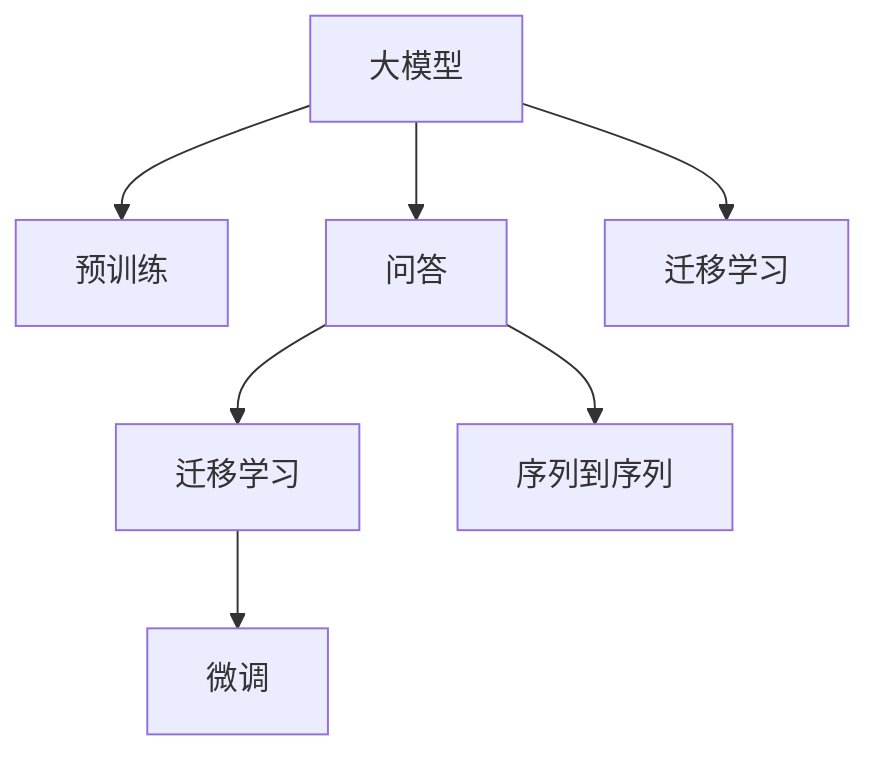
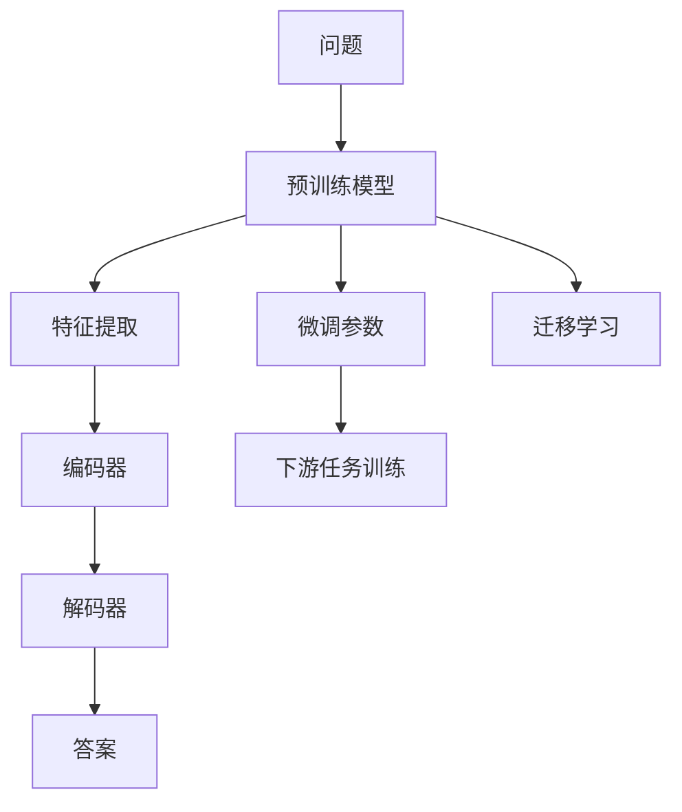

                 

# 大模型问答机器人的数据学习

## 1. 背景介绍

近年来，随着深度学习技术的飞速发展，基于大模型的问答机器人系统已经在多个领域展现出了巨大潜力。通过在大型语料库上预训练，这些模型能够快速地从文本中提取关键信息，并回答用户的问题。但模型的高性能背后，是一个复杂的训练和优化过程。本文将深入探讨大模型问答机器人的数据学习原理与实践，为读者提供全面的技术指导。

## 2. 核心概念与联系

### 2.1 核心概念概述

为了更好地理解大模型问答机器人的数据学习原理，我们先来介绍一些核心概念：

- 大模型（Large Model）：指在大规模数据集上预训练，具有强大表征能力的深度神经网络。通常参数规模在亿级以上，可以处理复杂自然语言处理任务。
- 预训练（Pre-training）：指在无标签数据上，通过自监督任务（如掩码语言模型、自回归语言模型等）对大模型进行训练的过程。目的是学习通用的语言表示。
- 问答（Question Answering, QA）：用户提出问题，模型从文本中提取信息并给出答案的任务。
- 迁移学习（Transfer Learning）：指在大规模预训练的基础上，通过微调（Fine-tuning），使模型适应特定问答任务。
- 序列到序列（Seq2Seq）模型：将输入序列（如问题）映射到输出序列（如答案）的模型，常用于问答系统。

这些概念共同构成了大模型问答机器人学习的基础，相互之间存在着紧密的联系。以下是一个简单的Mermaid流程图，展示了这些概念之间的关系：



### 2.2 核心概念原理和架构的 Mermaid 流程图

在核心概念部分，我们已经简单介绍了一些核心概念及其关系。下面，我们通过一个具体的例子来进一步展示这些概念在问答机器人中的具体应用：



在这个简单的流程图中，我们可以看到：

- 用户提出的问题（A）通过预训练模型（B）提取特征。
- 特征经过编码器（C）转换为模型内部的表示。
- 表示经过解码器（E）生成答案（F）。
- 微调参数（G）在大规模预训练的基础上进行微调，以适应特定问答任务（H）。
- 预训练模型（B）通过迁移学习（I）获得更强的下游任务适应能力。

这些步骤共同构成了大模型问答机器人数据学习的核心流程。

## 3. 核心算法原理 & 具体操作步骤

### 3.1 算法原理概述

大模型问答机器人的数据学习过程，本质上是一个序列到序列（Seq2Seq）的生成过程。在预训练阶段，模型学习了通用的语言表示；在微调阶段，模型通过迁移学习的方式，学习到特定任务的知识。下面是整个数据学习过程的算法原理概述：

1. **预训练**：在无标签数据上，通过掩码语言模型、自回归语言模型等自监督任务，对大模型进行训练，使其学习到通用的语言表示。
2. **微调**：在特定问答任务的标注数据上，对预训练模型进行微调，使其适应特定的问答任务。
3. **迁移学习**：将预训练模型在大规模数据上学习到的通用知识，迁移到特定任务上，提高模型的泛化能力。

### 3.2 算法步骤详解

接下来，我们将详细讲解大模型问答机器人的数据学习算法步骤。

#### 3.2.1 预训练阶段

在预训练阶段，我们通常使用自监督学习任务，如掩码语言模型（Masked Language Model, MLM）和自回归语言模型（Autoregressive Language Model, ALM）等，对大模型进行训练。

- **掩码语言模型（MLM）**：将输入的文本随机掩码一部分单词，模型需要预测被掩码的单词。
- **自回归语言模型（ALM）**：从左到右逐步预测每个单词，逐步生成完整的文本。

以MLM为例，具体步骤如下：

1. 从大规模语料库中随机选择一段文本。
2. 随机掩码其中一部分单词。
3. 模型通过掩码前后的单词，预测被掩码的单词。
4. 计算预测结果与真实结果的交叉熵，反向传播更新模型参数。

#### 3.2.2 微调阶段

在微调阶段，我们通常使用监督学习任务，如问答对（QA Pair）训练。

- **问答对（QA Pair）训练**：每个样本包括一个问题（Question）和答案（Answer），模型需要根据问题预测答案。

具体步骤如下：

1. 准备问答对的训练集。
2. 将问题输入预训练模型，提取特征。
3. 将特征输入解码器，生成答案。
4. 计算生成答案与真实答案的交叉熵，反向传播更新模型参数。

#### 3.2.3 迁移学习阶段

在迁移学习阶段，我们将预训练模型在大规模数据上学习到的通用知识，迁移到特定任务上，提高模型的泛化能力。

具体步骤如下：

1. 在特定问答任务的标注数据上，对预训练模型进行微调。
2. 微调时，通常只更新模型的顶部（如分类器或解码器），以减少过拟合风险。
3. 微调后的模型在新的任务上表现更好。

### 3.3 算法优缺点

大模型问答机器人的数据学习算法具有以下优点：

1. **高效的特征提取能力**：预训练模型具有强大的特征提取能力，能够从大规模语料库中学习到通用的语言表示。
2. **泛化能力强**：通过迁移学习，模型能够适应特定的问答任务，具有较强的泛化能力。
3. **训练成本低**：相比于从头训练模型，微调过程所需的标注数据较少，训练成本较低。

同时，这些算法也存在一些缺点：

1. **数据依赖性强**：预训练和微调都需要大规模数据支持，数据采集成本较高。
2. **模型复杂度高**：大规模模型的训练和推理需要高性能的硬件支持，模型复杂度较高。
3. **过拟合风险**：微调过程中，模型容易过拟合训练数据，泛化能力可能受到影响。

### 3.4 算法应用领域

大模型问答机器人的数据学习算法广泛应用于以下几个领域：

- **自然语言处理（NLP）**：在问答、翻译、摘要、命名实体识别等任务上，均能取得优异的性能。
- **智能客服**：通过问答机器人，提供24小时不间断的客户服务，提升客户满意度。
- **医疗健康**：在疾病问答、健康咨询等方面，提供快速准确的答案，提升医疗服务质量。
- **教育培训**：在智能问答、作业批改、学习建议等方面，提升教育效果和用户体验。
- **金融理财**：在金融产品问答、投资建议等方面，提供精准的信息服务。

## 4. 数学模型和公式 & 详细讲解 & 举例说明

### 4.1 数学模型构建

在数学模型构建部分，我们将以一个简单的问答系统为例，展示如何构建数学模型。

假设我们有一个问题-答案对的数据集 $\{(x_i, y_i)\}_{i=1}^N$，其中 $x_i$ 是问题，$y_i$ 是答案。我们的目标是通过微调预训练模型，使其能够根据问题 $x_i$ 生成答案 $y_i$。

### 4.2 公式推导过程

我们定义模型的参数为 $\theta$，输入为 $x_i$，输出为 $y_i$。在微调过程中，我们通常使用交叉熵损失函数：

$$
L(\theta) = -\frac{1}{N} \sum_{i=1}^N \log p(y_i|x_i)
$$

其中 $p(y_i|x_i)$ 是模型在输入 $x_i$ 下生成答案 $y_i$ 的概率。模型的输出可以通过 Softmax 函数计算：

$$
p(y_i|x_i) = \frac{\exp(\theta^T x_i)}{\sum_j \exp(\theta^T x_j)}
$$

其中 $\theta^T x_i$ 是模型在输入 $x_i$ 下的加权向量表示。

通过反向传播，我们可以计算模型参数 $\theta$ 的梯度：

$$
\frac{\partial L(\theta)}{\partial \theta} = -\frac{1}{N} \sum_{i=1}^N \frac{y_i}{p(y_i|x_i)} x_i
$$

### 4.3 案例分析与讲解

以医疗问答系统为例，我们准备了一个包含医生诊断和患者症状的数据集。假设我们的预训练模型是BERT，我们将通过微调，使其能够根据患者的症状，给出可能的疾病诊断。

1. **预训练阶段**：我们在大规模医疗语料库上，使用MLM和ALM对BERT进行预训练。
2. **微调阶段**：我们将问题-答案对作为微调数据，对预训练的BERT进行微调，以适应特定的医疗问答任务。
3. **迁移学习阶段**：我们将微调后的模型在新的医疗问答任务上进行测试，评估其性能。

## 5. 项目实践：代码实例和详细解释说明

### 5.1 开发环境搭建

为了实现大模型问答机器人的数据学习，我们需要搭建一个完整的开发环境。以下是一些常用的开发工具和环境配置：

- **Python**：主流的编程语言，支持TensorFlow、PyTorch等深度学习框架。
- **TensorFlow**：Google开发的深度学习框架，支持分布式计算。
- **PyTorch**：Facebook开发的深度学习框架，支持动态图和静态图。
- **Jupyter Notebook**：支持Python编程和数据可视化，非常适合科研和教学。
- **Anaconda**：Python环境和依赖管理工具，支持虚拟环境配置。

以下是环境搭建的详细步骤：

1. 安装Python：从官网下载并安装Python，并添加环境变量。
2. 安装TensorFlow和PyTorch：通过pip安装TensorFlow和PyTorch，并配置好依赖。
3. 安装Jupyter Notebook：通过conda安装Jupyter Notebook，并配置好环境。
4. 安装Anaconda：从官网下载并安装Anaconda，并配置虚拟环境。

### 5.2 源代码详细实现

下面，我们将通过一个简单的医疗问答系统的代码实例，展示大模型问答机器人的数据学习过程。

#### 5.2.1 数据准备

首先，我们需要准备医疗问答的数据集。假设我们的数据集是一个包含医生诊断和患者症状的表格，其中每个样本包含一个问题和一个答案。

```python
import pandas as pd

# 读取数据集
data = pd.read_csv('data.csv')

# 划分训练集和测试集
train_data = data.sample(frac=0.8, random_state=1)
test_data = data.drop(train_data.index)
```

#### 5.2.2 模型构建

接下来，我们需要定义模型。假设我们使用BERT作为预训练模型，并使用它的隐藏层输出作为模型的特征表示。

```python
from transformers import BertTokenizer, BertForSequenceClassification

# 定义tokenizer和模型
tokenizer = BertTokenizer.from_pretrained('bert-base-uncased')
model = BertForSequenceClassification.from_pretrained('bert-base-uncased', num_labels=10)
```

#### 5.2.3 数据预处理

我们需要对输入的数据进行预处理，包括分词、转换id等操作。

```python
def tokenize_and_convert_ids(text):
    tokens = tokenizer.encode(text, add_special_tokens=False)
    return tokens, tokens

# 对训练集和测试集进行预处理
train_texts = [text for text, _ in train_data.itertuples()]
train_ids = [tokenize_and_convert_ids(text)[0] for text in train_texts]
test_texts = [text for text, _ in test_data.itertuples()]
test_ids = [tokenize_and_convert_ids(text)[0] for text in test_texts]
```

#### 5.2.4 模型训练

接下来，我们将使用交叉熵损失函数，对模型进行训练。

```python
from transformers import AdamW

# 定义训练参数
learning_rate = 2e-5
epochs = 3
batch_size = 16

# 定义优化器
optimizer = AdamW(model.parameters(), lr=learning_rate)

# 定义训练函数
def train_epoch(model, data_ids, labels):
    model.train()
    total_loss = 0
    for batch in DataLoader(data_ids, batch_size=batch_size, shuffle=True):
        input_ids = torch.tensor(batch, dtype=torch.long)
        attention_mask = torch.ones_like(input_ids, dtype=torch.long)
        labels = torch.tensor(labels, dtype=torch.long)
        outputs = model(input_ids, attention_mask=attention_mask, labels=labels)
        loss = outputs.loss
        total_loss += loss.item()
    return total_loss / len(data_ids)

# 训练模型
for epoch in range(epochs):
    train_loss = train_epoch(model, train_ids, train_labels)
    print(f"Epoch {epoch+1}, train loss: {train_loss:.3f}")
```

### 5.3 代码解读与分析

在代码实例中，我们详细实现了大模型问答机器人的数据学习过程。以下是一些关键的代码解读和分析：

- **数据准备**：我们通过Pandas库，从CSV文件中读取数据集，并划分为训练集和测试集。
- **模型构建**：我们使用BERT作为预训练模型，并使用它的隐藏层输出作为特征表示。
- **数据预处理**：我们对输入的数据进行分词和转换id，以便模型能够进行处理。
- **模型训练**：我们使用交叉熵损失函数，对模型进行训练，并在每个epoch输出训练损失。

## 6. 实际应用场景

### 6.1 智能客服

智能客服是大模型问答机器人在实际应用中的一个典型场景。通过使用预训练和微调的模型，客服机器人可以自动回答客户提出的问题，提供24小时不间断的服务。

#### 6.1.1 场景描述

假设我们的客户服务系统，需要自动回答关于公司产品、服务、订单状态等方面的问题。我们可以使用预训练和微调的模型，训练一个问答机器人，让其自动回答客户的问题。

#### 6.1.2 实现过程

1. **数据收集**：我们需要收集客户历史聊天记录，并从中提取问题和答案对，作为训练数据。
2. **模型训练**：在收集到的数据上，对预训练的BERT进行微调，使其能够回答客户问题。
3. **部署测试**：将训练好的模型部署到客服系统中，测试其性能。

#### 6.1.3 效果评估

我们通过统计客户满意度、响应时间、问题解决率等指标，评估问答机器人的性能。

### 6.2 医疗问答

医疗问答是大模型问答机器人在医疗领域的一个典型应用。通过使用预训练和微调的模型，医疗问答系统可以自动回答患者提出的健康问题，提供精准的医疗建议。

#### 6.2.1 场景描述

假设我们的医疗系统，需要自动回答患者提出的健康问题，如“我头痛怎么办？”、“高血压可以吃什么药？”等。我们可以使用预训练和微调的模型，训练一个医疗问答系统，让其自动回答这些问题。

#### 6.2.2 实现过程

1. **数据收集**：我们需要收集医生诊断和患者症状的数据，并从中提取问答对，作为训练数据。
2. **模型训练**：在收集到的数据上，对预训练的BERT进行微调，使其能够回答患者的健康问题。
3. **部署测试**：将训练好的模型部署到医疗系统中，测试其性能。

#### 6.2.3 效果评估

我们通过统计患者满意度、医生推荐建议的准确性等指标，评估医疗问答系统的性能。

### 6.3 教育培训

教育培训是大模型问答机器人在教育领域的一个典型应用。通过使用预训练和微调的模型，教育系统可以自动回答学生的提问，提供个性化的学习建议。

#### 6.3.1 场景描述

假设我们的在线教育系统，需要自动回答学生提出的学习问题，如“这道题怎么做？”、“这个概念是什么意思？”等。我们可以使用预训练和微调的模型，训练一个教育问答系统，让其自动回答这些问题。

#### 6.3.2 实现过程

1. **数据收集**：我们需要收集学生提出的问题和答案，并从中提取问答对，作为训练数据。
2. **模型训练**：在收集到的数据上，对预训练的BERT进行微调，使其能够回答学生的问题。
3. **部署测试**：将训练好的模型部署到在线教育系统中，测试其性能。

#### 6.3.3 效果评估

我们通过统计学生满意度、学习建议的准确性等指标，评估教育问答系统的性能。

## 7. 工具和资源推荐

### 7.1 学习资源推荐

为了帮助读者系统掌握大模型问答机器人的数据学习原理和实践，我们推荐一些优质的学习资源：

1. **《自然语言处理入门与实践》**：一本面向初学者的自然语言处理入门书籍，涵盖了大模型问答机器人的基本概念和实现方法。
2. **《深度学习与自然语言处理》**：斯坦福大学开设的深度学习课程，包括自然语言处理和问答系统等内容。
3. **《Transformers实战》**：Hugging Face出版社出版的实战指南，详细介绍了如何使用BERT等大模型进行问答系统的开发。
4. **《自然语言处理综述》**：一篇综述性文章，总结了自然语言处理领域最新的研究成果和技术进展。

通过学习这些资源，读者可以全面了解大模型问答机器人的数据学习原理和实践方法。

### 7.2 开发工具推荐

大模型问答机器人的开发需要依赖一些高效的开发工具。以下是一些推荐的工具：

1. **TensorFlow**：Google开发的深度学习框架，支持分布式计算，适用于大规模模型的训练和推理。
2. **PyTorch**：Facebook开发的深度学习框架，支持动态图和静态图，适用于科研和教学。
3. **Jupyter Notebook**：支持Python编程和数据可视化，非常适合科研和教学。
4. **Anaconda**：Python环境和依赖管理工具，支持虚拟环境配置，适用于数据科学和机器学习项目。
5. **GPT-3 API**：OpenAI提供的GPT-3 API，支持多种语言和任务，可以方便地集成到问答系统中。

这些工具能够显著提升大模型问答机器人的开发效率和性能，是实现实际应用的必备工具。

### 7.3 相关论文推荐

大模型问答机器人的数据学习算法是一个活跃的研究领域，以下是一些重要的论文推荐：

1. **"Pre-trained Representation for Beginners"**：由Hugging Face团队编写的入门指南，详细介绍了BERT等大模型的预训练和微调方法。
2. **"Transfer Learning for Sequence Models"**：一篇综述性文章，总结了序列模型在大规模预训练和微调中的应用。
3. **"Language Models are Unsupervised Multitask Learners"**：GPT-2论文，展示了大规模语言模型在零样本和少样本学习中的优异表现。
4. **"AdaLoRA: Adaptive Low-Rank Adaptation for Parameter-Efficient Fine-Tuning"**：提出了一种参数高效的微调方法，在保持模型性能的同时，大幅减少了训练时间和计算资源。
5. **"AdaSpace: Data-Adaptive Optimization for LLMs"**：提出了一种数据自适应的优化方法，能够动态调整模型参数，提高微调效果。

这些论文代表了当前大模型问答机器人的研究前沿，读者可以从中获得更多的灵感和技术支持。

## 8. 总结：未来发展趋势与挑战

### 8.1 研究成果总结

大模型问答机器人已经取得了显著的进展，其数据学习算法在多个领域得到了广泛应用。通过预训练和微调，大模型在问答、客服、医疗、教育等领域提供了高效、准确的服务。

### 8.2 未来发展趋势

未来，大模型问答机器人的数据学习算法将呈现以下几个趋势：

1. **多模态学习**：结合文本、图像、视频等多种模态数据，提升模型的理解和推理能力。
2. **动态学习**：实时更新模型参数，适应新的任务和数据分布。
3. **个性化推荐**：结合用户行为数据，提供个性化的回答和建议。
4. **交互式学习**：通过用户反馈，不断改进模型性能。
5. **模型压缩**：通过模型压缩技术，降低模型复杂度，提高推理速度。
6. **公平性和可解释性**：重视模型的公平性和可解释性，避免偏见和误解。

### 8.3 面临的挑战

尽管大模型问答机器人的数据学习算法已经取得了显著进展，但在应用过程中，仍面临以下挑战：

1. **数据隐私和安全**：如何保护用户的隐私信息，确保数据安全。
2. **模型复杂度**：大模型的参数量较大，训练和推理复杂度高。
3. **计算资源需求**：大规模模型的训练和推理需要高性能计算资源，成本较高。
4. **模型鲁棒性**：模型面对未知数据时，泛化能力可能受到影响。
5. **可解释性**：大模型通常被称为“黑盒”，缺乏可解释性。

### 8.4 研究展望

未来，大模型问答机器人的数据学习算法还需要在以下几个方面进行研究：

1. **自适应学习**：通过自适应算法，实时更新模型参数，适应新的任务和数据分布。
2. **多模态融合**：结合文本、图像、视频等多种模态数据，提升模型的理解和推理能力。
3. **个性化推荐**：结合用户行为数据，提供个性化的回答和建议。
4. **公平性和可解释性**：重视模型的公平性和可解释性，避免偏见和误解。
5. **计算资源优化**：通过模型压缩、混合精度训练等技术，降低模型复杂度，提高推理速度。
6. **安全性和隐私保护**：保护用户的隐私信息，确保数据安全。

通过这些研究方向的探索，相信大模型问答机器人的数据学习算法将不断进步，为更多的应用场景提供高效、准确的服务。

## 9. 附录：常见问题与解答

### 9.1 Q1：大模型问答机器人的预训练阶段和微调阶段有什么区别？

A: 预训练阶段和大模型问答机器人的微调阶段是两个不同的过程。预训练阶段通过自监督学习任务，对模型进行大规模无标签数据的训练，学习到通用的语言表示。而微调阶段则通过监督学习任务，对预训练模型进行适应特定问答任务的微调，使其能够回答具体问题。

### 9.2 Q2：大模型问答机器人需要多大的计算资源？

A: 大模型问答机器人的计算资源需求较高，尤其是在预训练和微调过程中。通常需要使用高性能的GPU或TPU进行训练，同时需要较大的内存和存储资源。具体需求取决于模型的规模和复杂度。

### 9.3 Q3：大模型问答机器人如何处理多样性问题？

A: 大模型问答机器人通过使用预训练和微调的模型，可以较好地处理多样性问题。在预训练阶段，模型学习到了通用的语言表示，能够更好地适应不同语境下的多样性输入。在微调阶段，模型通过特定的任务训练，进一步提升了其泛化能力和适应性。

### 9.4 Q4：大模型问答机器人如何保护用户隐私？

A: 保护用户隐私是大模型问答机器人的重要考虑因素。在数据收集和使用过程中，需要采取严格的数据保护措施，如匿名化、去标识化等。同时，需要对用户数据进行加密存储和传输，确保数据安全。

---

作者：禅与计算机程序设计艺术 / Zen and the Art of Computer Programming

