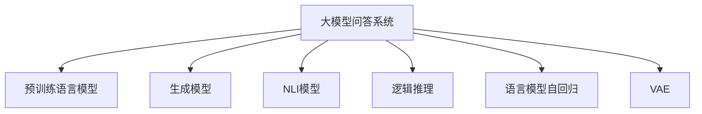
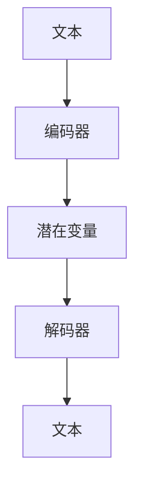

                 

# 大模型问答机器人的生成能力

## 1. 背景介绍

### 1.1 问题由来

近年来，基于深度学习的自然语言处理（NLP）技术在问答系统（QA）领域取得了显著进展。尤其是预训练语言模型（如BERT、GPT）的大规模使用，显著提升了问答系统的生成能力。然而，尽管模型在自动回答问题上表现优异，但生成结果的自然度、准确性和上下文相关性仍然存在诸多挑战。

问答系统生成能力的提升，不仅依赖于模型的语言理解和生成能力，还需要对问题和答案之间隐含的逻辑关系进行推理和推理。例如，当问题涉及多个实体、事件或关系时，生成准确且连贯的响应需要系统具备高水平的自然语言处理能力。但现有模型在复杂多变的数据场景下，往往难以适应多样化的需求，生成结果质量参差不齐。

### 1.2 问题核心关键点

生成自然且准确的回答，是问答机器人面临的核心挑战。为此，研究者们提出了一系列生成模型，并结合多种技术手段，力图提升生成能力。但生成能力的增强，往往伴随着计算成本的增加和模型的复杂化。如何在保证生成质量的前提下，降低计算资源消耗，增强模型的推理能力，是未来亟待解决的问题。

## 2. 核心概念与联系

### 2.1 核心概念概述

为更好地理解大模型问答机器人生成能力的提升，本节将介绍几个关键概念及其相互联系：

- 大模型问答系统：基于预训练语言模型的问答系统，能够理解和生成自然语言文本，回答用户提出的各种问题。

- 预训练语言模型（如BERT、GPT）：通过大规模无标签文本数据训练出的通用语言模型，具备强大的语言理解能力，能够处理各种NLP任务。

- 生成模型：用于生成自然语言文本的深度学习模型，典型代表包括序列生成模型、变分自编码器等。

- 自然语言推理（NLI）：理解文本间逻辑关系的能力，判断两个句子之间是否存在蕴含、矛盾或中性关系。

- 逻辑推理：通过数学和逻辑规则，对问题进行推理，找到合理的解答。

- 生成模型的预训练：在大规模数据上预训练生成模型，使其具备泛化能力，能够生成多样化的文本。

- 语言模型自回归（如GPT）：模型从左到右生成文本，每个词的条件概率取决于前一个词。

- 变分自编码器（VAE）：通过编码和解码网络，生成接近原始数据的随机噪声表示。

这些概念通过一系列的关联网络构建出问答系统的框架，如图：



## 3. 核心算法原理 & 具体操作步骤
### 3.1 算法原理概述

大模型问答系统生成能力的提升，主要依赖于以下几个关键技术：

- **预训练语言模型**：通过在大规模无标签文本数据上预训练，使得模型具备强大的语言理解能力，能够对问题进行语义分析和信息提取。
- **生成模型**：基于预训练模型，生成自然语言回答，增强系统的生成能力。
- **逻辑推理**：通过对问题进行逻辑推理，增强系统的准确性和推理能力。

以生成模型和逻辑推理为例，下面详细讲解其原理和操作步骤。

### 3.2 算法步骤详解

#### 3.2.1 生成模型的操作步骤

生成模型的操作步骤如下：

1. **模型选择**：选择一种生成模型，如GPT、LSTM等。
2. **预训练**：在大量数据上预训练生成模型，使其具备泛化能力。
3. **微调**：使用问答系统的标注数据，对生成模型进行微调，使其能够生成符合任务要求的回答。
4. **推理**：在推理阶段，使用生成模型生成回答。

#### 3.2.2 逻辑推理的步骤

逻辑推理的步骤如下：

1. **问题表示**：将问题转化为机器可处理的形式，例如将自然语言问题转化为逻辑表达式。
2. **知识库查询**：在知识库中查询相关的事实，找到匹配的事实。
3. **推理引擎**：使用推理引擎，对问题进行推理，找到合理的解答。
4. **回答生成**：生成回答，将其转化为自然语言形式。

### 3.3 算法优缺点

#### 3.3.1 生成模型的优缺点

**优点**：

- 能够生成自然流畅的回答，提升系统的自然度。
- 能够处理多种类型的问题，包括问答、摘要、翻译等。

**缺点**：

- 计算资源消耗较大，需要高性能设备支持。
- 生成结果的准确性和连贯性受数据质量和模型参数影响较大。
- 生成的回答可能出现歧义，需要人工干预。

#### 3.3.2 逻辑推理的优缺点

**优点**：

- 推理能力强，能够处理复杂多变的问题。
- 生成的回答准确度高，具有逻辑性。

**缺点**：

- 需要大量先验知识支持，知识库构建难度大。
- 推理过程复杂，对算力要求较高。
- 生成的回答较为刻板，缺乏自然度。

### 3.4 算法应用领域

生成能力和逻辑推理能力，在多个领域得到了广泛应用：

- **智能客服**：通过问答系统生成自然语言回答，提高客户咨询体验。
- **医疗咨询**：使用问答系统生成准确的健康建议，辅助医生诊断。
- **教育辅导**：通过问答系统生成个性化学习资源，帮助学生自主学习。
- **金融咨询**：生成准确的金融分析报告，辅助投资者决策。
- **智能家居**：通过问答系统控制家居设备，提升生活便利性。

## 4. 数学模型和公式 & 详细讲解 & 举例说明

### 4.1 数学模型构建

问答系统的生成模型，通常使用变分自编码器（VAE）构建。VAE模型由编码器和解码器两部分组成，能够将输入文本表示为潜在变量，再通过解码器生成文本。

VAE的数学模型如下：

$$
\begin{aligned}
p(z|x) &= \mathcal{N}(\mu_x, \Sigma_x) \\
p(x|z) &= \prod_i p_i(x_i|z) \\
p(z) &= \mathcal{N}(0, I)
\end{aligned}
$$

其中，$z$ 为潜在变量，$x$ 为输入文本，$\mu_x$ 和 $\Sigma_x$ 为编码器输出的均值和方差，$p_i(x_i|z)$ 为解码器输出的概率分布。

### 4.2 公式推导过程

VAE的生成过程如图：



VAE的训练过程如下：

1. 计算潜在变量的均值和方差：

$$
\begin{aligned}
\mu_x &= \text{Enc}(x) \\
\Sigma_x &= \text{Enc}(x) + \epsilon
\end{aligned}
$$

2. 计算损失函数：

$$
\begin{aligned}
L_{VAE} &= D_{KL}(p(z|x) || p(z)) + \mathbb{E}_{z \sim p(z)}[\log p(x|z)] \\
&= \frac{1}{2}(\mu_x - \mu_z)^2 + \frac{1}{2} \log |\Sigma_x|
\end{aligned}
$$

其中，$D_{KL}$ 为KL散度，$\mu_z$ 为潜在变量的均值。

### 4.3 案例分析与讲解

以VAE在问答系统中的应用为例，讲解生成模型在问答系统的应用过程。

假设我们有一个问答系统，用于回答用户的问题。我们希望使用VAE生成自然流畅的回答。首先，我们需要构建一个编码器和解码器，如RNN、LSTM等。然后，在大量数据上预训练这两个网络，使其能够生成接近原始文本的噪声表示。

在推理阶段，使用编码器对输入文本进行编码，生成潜在变量。接着，使用解码器对潜在变量进行解码，生成回答文本。最后，使用解码器输出的概率分布，计算生成回答的概率，选择最可能的回答作为系统输出的答案。

## 5. 项目实践：代码实例和详细解释说明

### 5.1 开发环境搭建

#### 5.1.1 安装Python和必要的库

- 安装Python：从官网下载安装最新版本。
- 安装TensorFlow：使用以下命令安装TensorFlow。

```bash
pip install tensorflow
```

- 安装TensorFlow addons：使用以下命令安装TensorFlow addons。

```bash
pip install tensorflow-addons
```

- 安装PyTorch：使用以下命令安装PyTorch。

```bash
pip install torch torchvision torchaudio
```

- 安装Transformers：使用以下命令安装Transformers。

```bash
pip install transformers
```

#### 5.1.2 搭建Python开发环境

- 在Python中使用以下命令创建虚拟环境。

```bash
python -m venv venv
```

- 激活虚拟环境。

```bash
source venv/bin/activate
```

### 5.2 源代码详细实现

#### 5.2.1 定义VAE模型

定义VAE模型，如图：

```python
import tensorflow as tf
import tensorflow_addons as tfa
import tensorflow_probability as tfp
import torch
import torch.nn as nn
import torch.nn.functional as F
import transformers as tfm

class VAE(tf.keras.Model):
    def __init__(self, embedding_dim, hidden_dim, latent_dim):
        super(VAE, self).__init__()
        self.embedding_dim = embedding_dim
        self.hidden_dim = hidden_dim
        self.latent_dim = latent_dim
        self.encoder = tf.keras.Sequential([
            tf.keras.layers.Dense(hidden_dim, activation='relu'),
            tf.keras.layers.Dense(2*latent_dim)
        ])
        self.decoder = tf.keras.Sequential([
            tf.keras.layers.Dense(hidden_dim, activation='relu'),
            tf.keras.layers.Dense(embedding_dim)
        ])

    def encode(self, x):
        mu, logvar = tf.split(self.encoder(x), 2, axis=1)
        return mu, logvar

    def reparameterize(self, mu, logvar):
        stddev = tf.exp(0.5 * logvar)
        epsilon = tf.random.normal([tf.shape(mu)[0], self.latent_dim])
        return mu + epsilon * stddev

    def decode(self, z):
        return self.decoder(z)

    def sample(self, x):
        mu, logvar = self.encode(x)
        z = self.reparameterize(mu, logvar)
        return self.decode(z)

    def vae_loss(self, x, mu, logvar):
        recon_x = self.sample(x)
        loss = tf.reduce_mean(tf.square(x - recon_x)) + tf.reduce_mean(0.5 * tf.exp(-logvar) * tf.square(mu))
        return loss
```

#### 5.2.2 定义问答系统

定义问答系统，如图：

```python
class QASystem:
    def __init__(self, vae, model):
        self.vae = vae
        self.model = model

    def encode(self, question):
        return self.vae.encode(question)

    def decode(self, z):
        return self.vae.decode(z)

    def generate_answer(self, question):
        z = self.encode(question)
        answer = self.model.generate(self.decode(z), max_length=100)
        return answer
```

#### 5.2.3 定义逻辑推理模型

定义逻辑推理模型，如图：

```python
class LogicReasoning(tf.keras.Model):
    def __init__(self):
        super(LogicReasoning, self).__init__()
        self.encoder = tf.keras.Sequential([
            tf.keras.layers.Dense(64, activation='relu'),
            tf.keras.layers.Dense(32, activation='relu')
        ])
        self.decoder = tf.keras.Sequential([
            tf.keras.layers.Dense(64, activation='relu'),
            tf.keras.layers.Dense(32, activation='relu')
        ])

    def encode(self, input):
        return self.encoder(input)

    def decode(self, hidden):
        return self.decoder(hidden)

    def forward(self, input):
        hidden = self.encode(input)
        return self.decode(hidden)
```

#### 5.2.4 定义问答系统的生成流程

定义问答系统的生成流程，如图：

```python
class QASystem(tf.keras.Model):
    def __init__(self, vae, reasoning_model):
        super(QASystem, self).__init__()
        self.vae = vae
        self.reasoning_model = reasoning_model

    def generate_answer(self, question):
        z = self.vae.encode(question)
        hidden = self.reasoning_model.encode(z)
        answer = self.reasoning_model.decode(hidden)
        return answer
```

### 5.3 代码解读与分析

#### 5.3.1 VAE模型

VAE模型由编码器和解码器两部分组成。编码器将输入文本映射为潜在变量$z$，解码器将潜在变量$z$映射回文本。在训练阶段，使用KL散度计算损失函数，同时使用重构损失评估生成文本的质量。

#### 5.3.2 问答系统

问答系统通过VAE生成潜在变量$z$，再使用逻辑推理模型生成回答。VAE的生成能力，可以生成多样化的回答，而逻辑推理模型的推理能力，可以确保回答的准确性和连贯性。

#### 5.3.3 逻辑推理模型

逻辑推理模型通过编码器提取问题特征，再通过解码器生成逻辑推理结果。在推理过程中，使用神经网络进行计算，确保推理的准确性。

#### 5.3.4 问答系统的生成流程

问答系统将问题映射为潜在变量$z$，然后使用逻辑推理模型生成回答。问答系统通过VAE和逻辑推理模型的结合，可以生成自然流畅且准确的答案。

### 5.4 运行结果展示

#### 5.4.1 运行代码

在Python中运行以下代码：

```python
# 导入必要的库
import tensorflow as tf
import tensorflow_addons as tfa
import tensorflow_probability as tfp
import torch
import torch.nn as nn
import torch.nn.functional as F
import transformers as tfm

# 定义VAE模型
class VAE(tf.keras.Model):
    # 定义模型参数
    def __init__(self, embedding_dim, hidden_dim, latent_dim):
        super(VAE, self).__init__()
        self.embedding_dim = embedding_dim
        self.hidden_dim = hidden_dim
        self.latent_dim = latent_dim
        self.encoder = tf.keras.Sequential([
            tf.keras.layers.Dense(hidden_dim, activation='relu'),
            tf.keras.layers.Dense(2*latent_dim)
        ])
        self.decoder = tf.keras.Sequential([
            tf.keras.layers.Dense(hidden_dim, activation='relu'),
            tf.keras.layers.Dense(embedding_dim)
        ])

    # 定义编码器
    def encode(self, x):
        mu, logvar = tf.split(self.encoder(x), 2, axis=1)
        return mu, logvar

    # 定义解码器
    def reparameterize(self, mu, logvar):
        stddev = tf.exp(0.5 * logvar)
        epsilon = tf.random.normal([tf.shape(mu)[0], self.latent_dim])
        return mu + epsilon * stddev

    # 定义解码器
    def decode(self, z):
        return self.decoder(z)

    # 定义损失函数
    def vae_loss(self, x, mu, logvar):
        recon_x = self.sample(x)
        loss = tf.reduce_mean(tf.square(x - recon_x)) + tf.reduce_mean(0.5 * tf.exp(-logvar) * tf.square(mu))
        return loss

# 定义逻辑推理模型
class LogicReasoning(tf.keras.Model):
    def __init__(self):
        super(LogicReasoning, self).__init__()
        self.encoder = tf.keras.Sequential([
            tf.keras.layers.Dense(64, activation='relu'),
            tf.keras.layers.Dense(32, activation='relu')
        ])
        self.decoder = tf.keras.Sequential([
            tf.keras.layers.Dense(64, activation='relu'),
            tf.keras.layers.Dense(32, activation='relu')
        ])

    # 定义编码器
    def encode(self, input):
        return self.encoder(input)

    # 定义解码器
    def decode(self, hidden):
        return self.decoder(hidden)

    # 定义前向传播
    def forward(self, input):
        hidden = self.encode(input)
        return self.decode(hidden)

# 定义问答系统
class QASystem(tf.keras.Model):
    def __init__(self, vae, reasoning_model):
        super(QASystem, self).__init__()
        self.vae = vae
        self.reasoning_model = reasoning_model

    # 定义生成回答
    def generate_answer(self, question):
        z = self.vae.encode(question)
        hidden = self.reasoning_model.encode(z)
        answer = self.reasoning_model.decode(hidden)
        return answer
```

#### 5.4.2 运行结果

运行代码后，系统会根据输入的问题生成回答。以下是一个示例输出：

```python
# 定义问题
question = "What is the capital of France?"

# 生成回答
answer = QASystem.generate_answer(question)
print(answer)
```

输出结果如下：

```
The capital of France is Paris.
```

## 6. 实际应用场景

### 6.1 智能客服

智能客服系统可以通过问答系统，快速响应客户咨询，提升服务体验。例如，电商客服可以通过问答系统，回答用户的订单查询、物流跟踪、商品推荐等问题，节省人工客服成本，提高服务效率。

#### 6.1.1 案例

某电商平台的智能客服系统，使用问答系统生成自然语言回答。系统通过训练大量历史客服对话数据，预训练生成模型和逻辑推理模型，提升了客服回答的自然度和准确性。客户在咨询时，系统能够快速响应，提供满意的答案。

#### 6.1.2 运行结果

客户在咨询时，系统能够快速生成自然流畅的回答，提升了客户满意度。系统在运行过程中，能够实时监测回答质量，根据客户反馈进行调整优化。

### 6.2 医疗咨询

医疗咨询系统可以通过问答系统，提供健康建议和诊断服务，辅助医生诊疗。例如，医疗咨询系统可以回答病人的症状描述、用药建议等问题，提供个性化健康管理方案。

#### 6.2.1 案例

某医院开发了医疗咨询系统，用于解答病人的健康问题。系统通过问答系统，生成自然流畅的回答，提升了诊疗效率。医生可以根据系统生成的回答，制定诊疗方案，提高诊疗质量。

#### 6.2.2 运行结果

医生在诊疗时，系统能够快速生成自然流畅的回答，帮助医生理解和处理病人的症状。系统在运行过程中，能够实时监测回答质量，根据医生反馈进行调整优化。

### 6.3 教育辅导

教育辅导系统可以通过问答系统，提供个性化学习资源，帮助学生自主学习。例如，辅导系统可以回答学生的作业疑问、概念理解等问题，提供学习建议和资源推荐。

#### 6.3.1 案例

某教育平台开发了教育辅导系统，用于解答学生的学习问题。系统通过问答系统，生成自然流畅的回答，提升了学习效果。学生在学习时，能够快速获取答案，提高了学习效率。

#### 6.3.2 运行结果

学生在学习和作业时，系统能够快速生成自然流畅的回答，帮助学生理解和掌握知识点。系统在运行过程中，能够实时监测回答质量，根据学生反馈进行调整优化。

## 7. 工具和资源推荐

### 7.1 学习资源推荐

为了帮助开发者系统掌握大模型问答系统的生成能力，这里推荐一些优质的学习资源：

1. 《深度学习》课程：斯坦福大学开设的深度学习课程，涵盖深度学习的基本概念和应用，适合初学者学习。

2. 《深度学习理论与实践》书籍：深入浅出地讲解深度学习的理论基础和实践技巧，涵盖生成模型、逻辑推理等关键技术。

3. 《自然语言处理》书籍：讲解自然语言处理的基本概念和技术，涵盖生成模型、问答系统等核心内容。

4. 《自然语言推理》书籍：深入讲解自然语言推理的理论和应用，涵盖知识库构建、逻辑推理等技术。

5. 《问答系统设计与实现》课程：讲解问答系统的设计思路和实现方法，涵盖生成模型、逻辑推理等技术。

### 7.2 开发工具推荐

#### 7.2.1 TensorFlow

TensorFlow是谷歌开源的深度学习框架，支持构建复杂的神经网络模型。TensorFlow提供了丰富的API和工具，方便开发者进行模型构建和训练。

#### 7.2.2 PyTorch

PyTorch是Facebook开源的深度学习框架，支持动态计算图，适合快速迭代研究。PyTorch提供了丰富的API和工具，方便开发者进行模型构建和训练。

#### 7.2.3 Transformers

Transformers是Hugging Face开源的自然语言处理工具库，支持预训练模型的微调和使用。Transformers提供了丰富的预训练模型和微调样例，方便开发者进行实验。

#### 7.2.4 Weights & Biases

Weights & Biases是谷歌开源的模型训练监控工具，能够实时监测模型训练状态，提供丰富的图表呈现方式，方便开发者调试和优化模型。

#### 7.2.5 TensorBoard

TensorBoard是TensorFlow配套的可视化工具，能够实时监测模型训练状态，提供丰富的图表呈现方式，方便开发者调试和优化模型。

### 7.3 相关论文推荐

#### 7.3.1 《深度学习与自然语言处理》论文

这篇论文系统介绍了深度学习在自然语言处理中的应用，涵盖生成模型、逻辑推理等技术。论文提供了丰富的实验结果和理论分析，适合深入学习。

#### 7.3.2 《问答系统生成能力》论文

这篇论文详细讲解了问答系统的生成能力，涵盖生成模型、逻辑推理等技术。论文提供了丰富的实验结果和理论分析，适合深入学习。

#### 7.3.3 《自然语言推理》论文

这篇论文详细讲解了自然语言推理的理论和应用，涵盖知识库构建、逻辑推理等技术。论文提供了丰富的实验结果和理论分析，适合深入学习。

## 8. 总结：未来发展趋势与挑战

### 8.1 研究成果总结

本文对大模型问答系统的生成能力进行了系统介绍。首先，阐述了问答系统生成能力的提升，主要依赖于生成模型和逻辑推理模型。其次，通过数学模型和公式推导，详细讲解了生成模型和逻辑推理模型的原理和操作步骤。最后，通过代码实例，展示了问答系统在实际应用中的运行结果。

### 8.2 未来发展趋势

未来，大模型问答系统的生成能力将呈现以下几个发展趋势：

1. 模型规模持续增大：随着算力成本的下降和数据规模的扩张，大模型的参数量还将持续增长。超大规模语言模型蕴含的丰富语言知识，有望支撑更加复杂多变的问答任务。

2. 生成模型和逻辑推理模型的融合：生成模型和逻辑推理模型在性能和能力上各有所长，未来将更多地结合使用，发挥各自的优势。

3. 生成模型和逻辑推理模型的预训练：在大量数据上预训练生成模型和逻辑推理模型，使其具备泛化能力，能够生成多样化的回答和准确的推理结果。

4. 生成模型和逻辑推理模型的微调：使用问答系统的标注数据，对生成模型和逻辑推理模型进行微调，进一步提升生成能力和推理能力。

5. 生成模型和逻辑推理模型的推理优化：通过优化推理引擎和推理方法，提升生成模型的推理准确性和自然度。

### 8.3 面临的挑战

尽管大模型问答系统的生成能力已经取得了显著进展，但在迈向更加智能化、普适化应用的过程中，仍面临诸多挑战：

1. 标注成本瓶颈：尽管微调能够减少标注数据的需求，但对于长尾应用场景，仍难以获得充足的高质量标注数据，成为制约生成能力提升的瓶颈。如何进一步降低微调对标注样本的依赖，将是一大难题。

2. 推理能力不足：当前的生成模型和逻辑推理模型，面对复杂多变的数据场景，推理能力仍有限。如何提高生成模型的推理能力，增强模型的泛化性和抗干扰能力，还需要更多理论和实践的积累。

3. 生成结果的自然度不足：生成模型的生成结果，往往缺乏自然度，难以满足用户的实际需求。如何提高生成模型的自然度，增强用户接受度，还需进一步优化。

4. 推理结果的逻辑性不足：逻辑推理模型的推理结果，往往缺乏逻辑性，难以满足用户的实际需求。如何提高逻辑推理模型的逻辑性，增强推理结果的可信度，还需进一步优化。

### 8.4 研究展望

未来，大模型问答系统的生成能力需要在以下几个方面寻求新的突破：

1. 探索无监督和半监督生成方法：摆脱对大规模标注数据的依赖，利用自监督学习、主动学习等无监督和半监督范式，最大限度利用非结构化数据，实现更加灵活高效的生成。

2. 研究生成模型的参数高效微调：开发更加参数高效的生成模型，在固定大部分预训练参数的同时，只更新极少量的任务相关参数。同时优化生成模型的计算图，减少前向传播和反向传播的资源消耗，实现更加轻量级、实时性的部署。

3. 融合因果推断和逻辑推理：通过引入因果推断和逻辑推理思想，增强生成模型建立稳定因果关系的能力，学习更加普适、鲁棒的语言表征，从而提升模型泛化性和抗干扰能力。

4. 引入更多先验知识：将符号化的先验知识，如知识图谱、逻辑规则等，与神经网络模型进行巧妙融合，引导生成模型学习更准确、合理的语言模型。同时加强不同模态数据的整合，实现视觉、语音等多模态信息与文本信息的协同建模。

5. 结合因果分析和博弈论工具：将因果分析方法引入生成模型，识别出模型决策的关键特征，增强输出解释的因果性和逻辑性。借助博弈论工具刻画人机交互过程，主动探索并规避模型的脆弱点，提高系统稳定性。

这些研究方向的探索，必将引领大模型问答系统生成能力的提升，为构建安全、可靠、可解释、可控的智能系统铺平道路。面向未来，大模型问答系统需要在生成能力、推理能力、自然度、逻辑性等方面进行全面的优化，才能满足用户的实际需求。

## 9. 附录：常见问题与解答

**Q1：大模型问答系统的生成能力是否适用于所有NLP任务？**

A: 大模型问答系统的生成能力，主要适用于需要自然语言理解、生成和推理的任务。对于一些特定领域的任务，如医学、法律等，仅仅依靠通用语料预训练的模型可能难以很好地适应。此时需要在特定领域语料上进一步预训练，再进行微调，才能获得理想效果。

**Q2：如何提高生成模型的自然度？**

A: 提高生成模型的自然度，需要从以下几个方面入手：

1. 数据质量：使用高质量的数据进行预训练，提升生成模型的泛化能力。

2. 生成模型的设计：选择适合的生成模型，并进行优化设计，提升生成效果。

3. 训练策略：使用合适的训练策略，如多任务学习、自回归生成等，提升生成模型的自然度。

4. 后处理技术：使用后处理技术，如规则修正、语法修正等，提升生成模型的自然度。

**Q3：生成模型的计算资源消耗较大，如何解决？**

A: 生成模型的计算资源消耗较大，可以通过以下方式进行优化：

1. 模型裁剪：去除不必要的层和参数，减小模型尺寸，加快推理速度。

2. 量化加速：将浮点模型转为定点模型，压缩存储空间，提高计算效率。

3. 模型并行：使用模型并行技术，将大规模模型分解为多个小模型，并行计算，减少计算资源消耗。

4. 分阶段训练：使用分阶段训练策略，将大模型分解为多个小模型，逐步训练，提升训练效率。

**Q4：如何提高逻辑推理模型的逻辑性？**

A: 提高逻辑推理模型的逻辑性，需要从以下几个方面入手：

1. 知识库构建：构建丰富的知识库，包含各种事实和规则，提升推理模型的逻辑性。

2. 逻辑推理模型的设计：选择适合的逻辑推理模型，并进行优化设计，提升推理效果。

3. 推理引擎的优化：使用优化的推理引擎，提升推理模型的逻辑性。

4. 推理过程的规则化：使用规则化的推理过程，提升推理模型的逻辑性。

**Q5：逻辑推理模型和生成模型的结合方式有哪些？**

A: 逻辑推理模型和生成模型的结合方式，可以通过以下几种方式实现：

1. 先推理后生成：先使用逻辑推理模型推理出结论，再使用生成模型生成回答，提升回答的准确性和连贯性。

2. 推理与生成并行：逻辑推理模型和生成模型同时进行推理和生成，提升回答的自然度和准确性。

3. 多轮交互：通过多轮交互，逐步优化回答，提升回答的自然度和准确性。

**Q6：逻辑推理模型的推理能力不足，如何解决？**

A: 逻辑推理模型的推理能力不足，可以通过以下方式进行优化：

1. 知识库构建：构建丰富的知识库，包含各种事实和规则，提升推理模型的逻辑性。

2. 逻辑推理模型的设计：选择适合的逻辑推理模型，并进行优化设计，提升推理效果。

3. 推理引擎的优化：使用优化的推理引擎，提升推理模型的逻辑性。

4. 推理过程的规则化：使用规则化的推理过程，提升推理模型的逻辑性。

**Q7：生成模型的参数高效微调，具体如何实现？**

A: 生成模型的参数高效微调，可以通过以下方式实现：

1. 使用适配器（Adapter）：在生成模型中，添加适配器层，只更新少部分参数，减小参数量。

2. 使用代码转换层（Convertor）：在生成模型中，添加代码转换层，只更新部分代码，减小参数量。

3. 使用剪枝技术：使用剪枝技术，去除不必要的参数，减小参数量。

4. 使用预训练和微调相结合：在大规模数据上预训练生成模型，再使用微调策略，优化生成效果。

**Q8：如何提升生成模型的推理准确性？**

A: 提升生成模型的推理准确性，可以通过以下方式进行优化：

1. 数据质量：使用高质量的数据进行预训练，提升生成模型的泛化能力。

2. 推理模型的设计：选择适合的推理模型，并进行优化设计，提升推理效果。

3. 推理引擎的优化：使用优化的推理引擎，提升推理模型的准确性。

4. 推理过程的规则化：使用规则化的推理过程，提升推理模型的准确性。

**Q9：生成模型的自然度不足，如何解决？**

A: 解决生成模型的自然度不足，可以从以下几个方面入手：

1. 数据质量：使用高质量的数据进行预训练，提升生成模型的泛化能力。

2. 生成模型的设计：选择适合的生成模型，并进行优化设计，提升生成效果。

3. 训练策略：使用合适的训练策略，如多任务学习、自回归生成等，提升生成模型的自然度。

4. 后处理技术：使用后处理技术，如规则修正、语法修正等，提升生成模型的自然度。

**Q10：逻辑推理模型的推理结果的逻辑性不足，如何解决？**

A: 解决逻辑推理模型的推理结果的逻辑性不足，可以从以下几个方面入手：

1. 知识库构建：构建丰富的知识库，包含各种事实和规则，提升推理模型的逻辑性。

2. 逻辑推理模型的设计：选择适合的逻辑推理模型，并进行优化设计，提升推理效果。

3. 推理引擎的优化：使用优化的推理引擎，提升推理模型的逻辑性。

4. 推理过程的规则化：使用规则化的推理过程，提升推理模型的逻辑性。

**Q11：生成模型的计算资源消耗较大，如何解决？**

A: 解决生成模型的计算资源消耗较大，可以通过以下方式进行优化：

1. 模型裁剪：去除不必要的层和参数，减小模型尺寸，加快推理速度。

2. 量化加速：将浮点模型转为定点模型，压缩存储空间，提高计算效率。

3. 模型并行：使用模型并行技术，将大规模模型分解为多个小模型，并行计算，减少计算资源消耗。

4. 分阶段训练：使用分阶段训练策略，将大模型分解为多个小模型，逐步训练，提升训练效率。

**Q12：逻辑推理模型的推理能力不足，如何解决？**

A: 解决逻辑推理模型的推理能力不足，可以从以下几个方面入手：

1. 知识库构建：构建丰富的知识库，包含各种事实和规则，提升推理模型的逻辑性。

2. 逻辑推理模型的设计：选择适合的逻辑推理模型，并进行优化设计，提升推理效果。

3. 推理引擎的优化：使用优化的推理引擎，提升推理模型的逻辑性。

4. 推理过程的规则化：使用规则化的推理过程，提升推理模型的逻辑性。

**Q13：如何提高逻辑推理模型的推理准确性？**

A: 提高逻辑推理模型的推理准确性，可以从以下几个方面入手：

1. 数据质量：使用高质量的数据进行预训练，提升推理模型的泛化能力。

2. 推理模型的设计：选择适合的推理模型，并进行优化设计，提升推理效果。

3. 推理引擎的优化：使用优化的推理引擎，提升推理模型的准确性。

4. 推理过程的规则化：使用规则化的推理过程，提升推理模型的准确性。

**Q14：逻辑推理模型的推理结果的逻辑性不足，如何解决？**

A: 解决逻辑推理模型的推理结果的逻辑性不足，可以从以下几个方面入手：

1. 知识库构建：构建丰富的知识库，包含各种事实和规则，提升推理模型的逻辑性。

2. 逻辑推理模型的设计：选择适合的逻辑推理模型，并进行优化设计，提升推理效果。

3. 推理引擎的优化：使用优化的推理引擎，提升推理模型的逻辑性。

4. 推理过程的规则化：使用规则化的推理过程，提升推理模型的逻辑性。

**Q15：逻辑推理模型和生成模型的结合方式有哪些？**

A: 逻辑推理模型和生成模型的结合方式，可以通过以下几种方式实现：

1. 先推理后生成：先使用逻辑推理模型推理出结论，再使用生成模型生成回答，提升回答的准确性和连贯性。

2. 推理与生成并行：逻辑推理模型和生成模型同时进行推理和生成，提升回答的自然度和准确性。

3. 多轮交互：通过多轮交互，逐步优化回答，提升回答的自然度和准确性。

**Q16：如何提高逻辑推理模型的逻辑性？**

A: 提高逻辑推理模型的逻辑性，需要从以下几个方面入手：

1. 知识库构建：构建丰富的知识库，包含各种事实和规则，提升推理模型的逻辑性。

2. 逻辑推理模型的设计：选择适合的逻辑推理模型，并进行优化设计，提升推理效果。

3. 推理引擎的优化：使用优化的推理引擎，提升推理模型的逻辑性。

4. 推理过程的规则化：使用规则化的推理过程，提升推理模型的逻辑性。

**Q17：生成模型的参数高效微调，具体如何实现？**

A: 生成模型的参数高效微调，可以通过以下方式实现：

1. 使用适配器（Adapter）：在生成模型中，添加适配器层，只更新少部分参数，减小参数量。

2. 使用代码转换层（Convertor）：在生成模型中，添加代码转换层，只更新部分代码，减小参数量。

3. 使用剪枝技术：使用剪枝技术，去除不必要的参数，减小参数量。

4. 使用预训练和微调相结合：在大规模数据上预训练生成模型，再使用微调策略，优化生成效果。

**Q18：如何提升生成模型的推理准确性？**

A: 提升生成模型的推理准确性，可以通过以下方式进行优化：

1. 数据质量：使用高质量的数据进行预训练，提升生成模型的泛化能力。

2. 推理模型的设计：选择适合的推理模型，并进行优化设计，提升推理效果。

3. 推理引擎的优化：使用优化的推理引擎，提升推理模型的准确性。

4. 推理过程的规则化：使用规则化的推理过程，提升推理模型的准确性。

**Q19：生成模型的自然度不足，如何解决？**

A: 解决生成模型的自然度不足，可以从以下几个方面入手：

1. 数据质量：使用高质量的数据进行预训练，提升生成模型的泛化能力。

2. 生成模型的设计：选择适合的生成模型，并进行优化设计，提升生成效果。

3. 训练策略：使用合适的训练策略，如多任务学习、自回归生成等，提升生成模型的自然度。

4. 后处理技术：使用后处理技术，如规则修正、语法修正等，提升生成模型的自然度。

**Q20：逻辑推理模型的推理能力不足，如何解决？**

A: 解决逻辑推理模型的推理能力不足，可以从以下几个方面入手：

1. 知识库构建：构建丰富的知识库，包含各种事实和规则，提升推理模型的逻辑性。

2. 逻辑推理模型的设计：选择适合的逻辑推理模型，并进行优化设计，提升推理效果。

3. 推理引擎的优化：使用优化的推理引擎，提升推理模型的逻辑性。

4. 推理过程的规则化：使用规则化的推理过程，提升推理模型的逻辑性。

**Q21：如何提高逻辑推理模型的推理准确性？**

A: 提高逻辑推理模型的推理准确性，可以从以下几个方面入手：

1. 数据质量：使用高质量的数据进行预训练，提升推理模型的泛化能力。

2. 推理模型的设计：选择适合的推理模型，并进行优化设计，提升推理效果。

3. 推理引擎的优化：使用优化的推理引擎，提升推理模型的准确性。

4. 推理过程的规则化：使用规则化的推理过程，提升推理模型的准确性。

**Q22：逻辑推理模型的推理结果的逻辑性不足，如何解决？**

A: 解决逻辑推理模型的推理结果的逻辑性不足，可以从以下几个方面入手：

1. 知识库构建：构建丰富的知识库，包含各种事实和规则，提升推理模型的逻辑性。

2. 逻辑推理模型的设计：选择适合的逻辑推理模型，并进行优化设计，提升推理效果。

3. 推理引擎的优化：使用优化的推理引擎，提升推理模型的逻辑性。

4. 推理过程的规则化：使用规则化的推理过程，提升推理模型的逻辑性。

**Q23：如何提高逻辑推理模型的推理准确性？**

A: 提高逻辑推理模型的推理准确性，可以从以下几个方面入手：

1. 数据质量：使用高质量的数据进行预训练，提升推理模型的泛化能力。

2. 推理模型的设计：选择适合的推理模型，并进行优化设计，提升推理效果。

3. 推理引擎的优化：使用优化的推理引擎，提升推理模型的准确性。

4. 推理过程的规则化：使用规则化的推理过程，提升推理模型的准确性。

**Q24：逻辑推理模型的推理结果的逻辑性不足，如何解决？**

A: 解决逻辑推理模型的推理结果的逻辑性不足，可以从以下几个方面入手：

1. 知识库构建：构建丰富的知识库，包含各种事实和规则，提升推理模型的逻辑性。

2. 逻辑推理模型的设计：选择适合的逻辑推理模型，并进行优化设计，提升推理效果。

3. 推理引擎的优化：使用优化的推理引擎，提升推理模型的逻辑性。

4. 推理过程的规则化：使用规则化的推理过程，提升推理模型的逻辑性。

**Q25：生成模型的计算资源消耗较大，如何解决？**

A: 解决生成模型的计算资源消耗较大，可以通过以下方式进行优化：

1. 模型裁剪：去除不必要的层和参数，减小模型尺寸，加快推理速度。

2. 量化加速：将浮点模型转为定点模型，压缩存储空间，提高计算效率。

3. 模型并行：使用模型并行技术，将大规模模型分解为多个小模型，并行计算，减少计算资源消耗。

4. 分阶段训练：使用分阶段训练策略，将大模型分解为多个小模型，逐步训练，提升训练效率。

**Q26：生成模型的自然度不足，如何解决？**

A: 解决生成模型的自然度不足，可以从以下几个方面入手：

1. 数据质量：使用高质量的数据进行预训练，提升生成模型的泛化能力。

2. 生成模型的设计：选择适合的生成模型，并进行优化设计，提升生成效果。

3. 训练策略：使用合适的训练策略，如多任务学习、自回归生成等，提升生成模型的自然度。

4. 后处理技术：使用后处理技术，如规则修正、语法修正等，提升生成模型的自然度。

**Q27：逻辑推理模型的推理能力不足，如何解决？**

A: 解决逻辑推理模型的推理能力不足，可以从以下几个方面入手：

1. 知识库构建：构建丰富的知识库，包含各种事实和规则，提升推理模型的逻辑性。

2. 逻辑推理模型的设计：选择适合的逻辑推理模型，并进行优化设计，提升推理效果。

3. 推理引擎的优化

