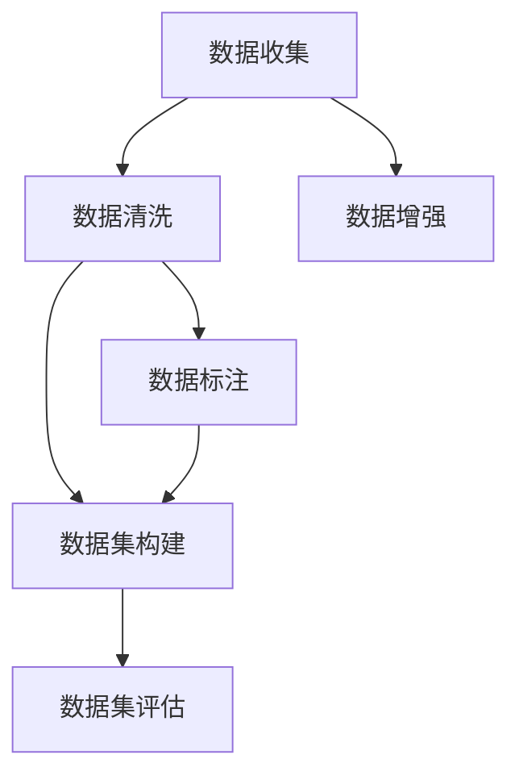

                 

# 大规模语言模型从理论到实践 数据收集

> 关键词：大规模语言模型,预训练,数据收集,数据标注,数据清洗,数据增强,数据集构建,数据集评估

## 1. 背景介绍

### 1.1 问题由来
在大规模语言模型（Large Language Models, LLMs）的研究与应用中，数据是至关重要的资源。预训练模型的效果往往取决于所使用的数据集质量与规模。因此，高效且系统化地收集、处理和分析数据，是实现高性能预训练语言模型的重要前提。

预训练语言模型，如BERT、GPT等，通常需要在海量的无标签文本数据上，通过自监督学习任务进行训练。这一过程需要耗费大量计算资源，而数据的质量直接影响了模型的训练效果。传统的人工标注数据往往成本高昂且费时费力，且难以满足预训练所需的规模。因此，数据收集和标注变得尤为关键。

### 1.2 问题核心关键点
预训练语言模型的构建流程包括以下几个关键环节：

1. **数据收集**：从互联网、书籍、新闻等渠道收集原始数据。
2. **数据清洗**：去除噪声数据、低质量数据和重复数据。
3. **数据增强**：通过数据转换、重采样等方式扩充数据集。
4. **数据标注**：为部分数据集添加标注信息，如实体、关系等。
5. **数据集构建**：将清洗后的数据划分为训练集、验证集和测试集。
6. **数据集评估**：评估数据集的质量，确保其适用于模型训练。

这些环节涉及大量数据处理和工程工作，对数据收集和处理的技术提出了较高要求。

## 2. 核心概念与联系

### 2.1 核心概念概述

为更好地理解大规模语言模型的数据收集与处理流程，本节将介绍几个核心概念：

- **数据收集**：从各种渠道获取原始文本数据，用于预训练模型的训练。
- **数据清洗**：去除噪声数据、低质量数据和重复数据，确保数据的纯净度。
- **数据增强**：通过数据变换、重采样等方式，扩充数据集规模。
- **数据标注**：为部分数据集添加标注信息，辅助预训练和微调。
- **数据集构建**：将数据划分为训练集、验证集和测试集，方便模型训练和评估。
- **数据集评估**：对数据集进行全面评估，确保其适用于模型训练。

这些概念之间的逻辑关系可以通过以下Mermaid流程图来展示：



这个流程图展示了数据收集、清洗、增强、标注、构建和评估的基本流程。

## 3. 核心算法原理 & 具体操作步骤
### 3.1 算法原理概述

大规模语言模型的数据收集与处理，本质上是一个数据工程问题。其核心思想是：通过系统化的数据处理技术，从多个数据源中收集、清洗、增强和标注数据，构建高质量的数据集，供模型预训练和微调使用。

形式化地，假设大规模语言模型需要在数据集 $D$ 上进行预训练，其中 $D=\{(x_i, y_i)\}_{i=1}^N, x_i \in \mathcal{X}, y_i \in \mathcal{Y}$，其中 $\mathcal{X}$ 为输入空间，$\mathcal{Y}$ 为输出空间。数据处理的目标是最大化训练集 $D$ 的质量和规模，以提升模型的性能。

### 3.2 算法步骤详解

大规模语言模型的数据处理一般包括以下几个关键步骤：

**Step 1: 数据收集**
- 从互联网、公共数据库、专业书籍等渠道获取大规模的原始文本数据。
- 选择合适的数据源，确保数据具有代表性、多样性和广泛性。

**Step 2: 数据清洗**
- 对原始数据进行初步筛选，去除噪声、重复和低质量数据。
- 使用文本处理技术，如分词、去停用词、标准化等，对数据进行清洗。

**Step 3: 数据增强**
- 对清洗后的数据进行数据增强，如回译、近义词替换、随机插入等。
- 引入数据转换技术，如语法转换、同义词替换、词性标注等，增加数据的多样性。

**Step 4: 数据标注**
- 对部分数据进行人工标注，如命名实体识别、关系抽取等。
- 标注信息需要准确、详细，便于模型学习和微调。

**Step 5: 数据集构建**
- 根据预训练和微调任务的要求，将数据划分为训练集、验证集和测试集。
- 一般要求训练集和验证集的数据规模较大，测试集的数据规模较小。

**Step 6: 数据集评估**
- 对构建的数据集进行全面评估，确保数据集的质量和适用性。
- 使用各种评估指标，如BLEU、ROUGE、F1-score等，评估数据集的质量。

### 3.3 算法优缺点

大规模语言模型的数据处理具有以下优点：
1. 数据规模大：通过系统化的数据收集和增强，可以构建大规模的数据集。
2. 数据质量高：经过严格的数据清洗和标注，数据集的质量较高。
3. 处理流程规范：数据处理的每一步都有详细的操作指南，确保过程规范、可重复。
4. 适用于多种任务：构建的数据集可以用于多种NLP任务的预训练和微调。

同时，该方法也存在一定的局限性：
1. 数据收集成本高：需要耗费大量人力和时间，获取高质量的数据集。
2. 数据标注难度大：对于复杂的任务，需要大量人工标注，工作量较大。
3. 数据清洗复杂：需要复杂的数据清洗技术，去除噪声和低质量数据。
4. 数据增强技术有限：现有的数据增强技术仍然有提升空间，难以完全消除数据的不确定性。

尽管存在这些局限性，但就目前而言，系统化的大规模数据处理是构建高性能预训练语言模型的关键环节。未来相关研究的重点在于如何进一步降低数据处理的成本，提高数据处理效率，同时兼顾数据集的多样性和代表性。

### 3.4 算法应用领域

大规模语言模型的数据处理技术，在NLP领域已经得到了广泛的应用，覆盖了几乎所有常见任务，例如：

- 文本分类：如情感分析、主题分类、意图识别等。
- 命名实体识别：识别文本中的人名、地名、机构名等特定实体。
- 关系抽取：从文本中抽取实体之间的语义关系。
- 问答系统：对自然语言问题给出答案。
- 机器翻译：将源语言文本翻译成目标语言。
- 文本摘要：将长文本压缩成简短摘要。
- 对话系统：使机器能够与人自然对话。

除了上述这些经典任务外，大规模语言模型数据处理技术也被创新性地应用到更多场景中，如可控文本生成、常识推理、代码生成、数据增强等，为NLP技术带来了全新的突破。随着预训练模型和数据处理方法的不断进步，相信NLP技术将在更广阔的应用领域大放异彩。

## 4. 数学模型和公式 & 详细讲解 & 举例说明
### 4.1 数学模型构建

本节将使用数学语言对大规模语言模型的数据收集与处理流程进行更加严格的刻画。

假设大规模语言模型需要在数据集 $D=\{(x_i, y_i)\}_{i=1}^N, x_i \in \mathcal{X}, y_i \in \mathcal{Y}$ 上进行预训练，其中 $\mathcal{X}$ 为输入空间，$\mathcal{Y}$ 为输出空间。数据处理的目标是最大化训练集 $D$ 的质量和规模，以提升模型的性能。

定义模型 $M_{\theta}$ 在输入 $x$ 上的输出为 $\hat{y}=M_{\theta}(x) \in [0,1]$，表示样本属于正类的概率。

数据处理的目标是最大化训练集 $D$ 的质量和规模，以提升模型的性能。具体而言，需要从以下方面优化：

1. 数据规模：尽可能收集大量高质量的数据，确保数据集的多样性和代表性。
2. 数据质量：通过数据清洗、增强和标注，去除噪声和低质量数据，确保数据集的质量。
3. 数据集划分：合理划分训练集、验证集和测试集，确保模型训练和评估的可靠性。

### 4.2 公式推导过程

以下我们以文本分类任务为例，推导模型在数据集 $D$ 上的训练过程和损失函数。

假设模型 $M_{\theta}$ 在输入 $x$ 上的输出为 $\hat{y}=M_{\theta}(x) \in [0,1]$，表示样本属于正类的概率。真实标签 $y \in \{0,1\}$。则二分类交叉熵损失函数定义为：

$$
\ell(M_{\theta}(x),y) = -[y\log \hat{y} + (1-y)\log (1-\hat{y})]
$$

将其代入经验风险公式，得：

$$
\mathcal{L}(\theta) = -\frac{1}{N}\sum_{i=1}^N [y_i\log M_{\theta}(x_i)+(1-y_i)\log(1-M_{\theta}(x_i))]
$$

在得到损失函数后，即可使用梯度下降等优化算法，对模型 $M_{\theta}$ 进行训练。

### 4.3 案例分析与讲解

为了更好地理解数据收集与处理的数学模型和公式，下面以BERT模型的预训练过程为例，进行详细讲解。

BERT模型的预训练过程中，使用了大规模的未标注语料库，即英语维基百科、新闻文章等。这些数据经过初步清洗，去除噪声和低质量数据，然后进行数据增强，如回译、近义词替换等，以增加数据的多样性。同时，部分数据集被人工标注，如实体识别、关系抽取等，辅助模型学习。

预训练过程中，模型在训练集上进行自监督学习，通过掩码语言模型和下一句预测等任务，最大化模型的理解能力。在微调阶段，模型通过与下游任务的少量标注数据进行有监督学习，优化模型在特定任务上的性能。

例如，在情感分析任务中，可以使用BERT模型的预训练权重，在情感分类数据集上进行微调。具体步骤如下：

1. 准备情感分类数据集，包括训练集、验证集和测试集。
2. 加载预训练的BERT模型，将文本数据输入模型进行预处理。
3. 定义分类任务，使用交叉熵损失函数。
4. 训练模型，优化损失函数，得到微调后的模型。
5. 在测试集上评估模型性能，对比微调前后的精度提升。

## 5. 项目实践：代码实例和详细解释说明
### 5.1 开发环境搭建

在进行数据收集与处理实践前，我们需要准备好开发环境。以下是使用Python进行PyTorch开发的环境配置流程：

1. 安装Anaconda：从官网下载并安装Anaconda，用于创建独立的Python环境。

2. 创建并激活虚拟环境：
```bash
conda create -n pytorch-env python=3.8 
conda activate pytorch-env
```

3. 安装PyTorch：根据CUDA版本，从官网获取对应的安装命令。例如：
```bash
conda install pytorch torchvision torchaudio cudatoolkit=11.1 -c pytorch -c conda-forge
```

4. 安装PyTorch Hub：
```bash
pip install torch-hub
```

5. 安装Natural Language Toolkit (NLTK)：
```bash
pip install nltk
```

完成上述步骤后，即可在`pytorch-env`环境中开始数据处理实践。

### 5.2 源代码详细实现

下面我们以文本分类任务为例，给出使用PyTorch进行数据收集与处理的代码实现。

首先，定义数据处理函数：

```python
from torchtext import data, datasets

# 定义文本和标签字段
TEXT = data.Field(tokenize='spacy', lower=True, include_lengths=True)
LABEL = data.LabelField(dtype=torch.int64)

# 加载数据集
train_data, test_data = datasets.IMDB.splits(TEXT, LABEL)

# 构建数据批处理器
batch_size = 64
train_iterator, test_iterator = data.BucketIterator.splits(
    (train_data, test_data), 
    batch_size=batch_size, 
    sort_within_batch=True)
```

然后，定义数据清洗和增强函数：

```python
from nltk.corpus import stopwords
from sklearn.feature_extraction.text import TfidfVectorizer
from sklearn.decomposition import TruncatedSVD

# 定义停用词列表
stop_words = set(stopwords.words('english'))

# 数据清洗函数
def clean_text(text):
    text = ''.join([c for c in text if c not in stop_words])
    return text

# 数据增强函数
def augment_text(text):
    tfidf = TfidfVectorizer(max_features=5000, stop_words=stop_words)
    svd = TruncatedSVD(n_components=2000)
    text_tfidf = tfidf.fit_transform(text)
    text_svd = svd.fit_transform(text_tfidf)
    return text_svd
```

接着，定义模型和优化器：

```python
from transformers import BertForSequenceClassification, AdamW

model = BertForSequenceClassification.from_pretrained('bert-base-uncased', num_labels=2)
optimizer = AdamW(model.parameters(), lr=2e-5)
```

最后，执行模型训练：

```python
from torch.utils.data import DataLoader
from tqdm import tqdm

device = torch.device('cuda') if torch.cuda.is_available() else torch.device('cpu')
model.to(device)

# 定义训练循环
def train(model, iterator, optimizer):
    model.train()
    epoch_loss = 0
    epoch_acc = 0
    for batch in iterator:
        optimizer.zero_grad()
        predictions = model(batch.text.to(device), attention_mask=batch.attention_mask.to(device)).pooler_output
        loss = nn.CrossEntropyLoss()(predictions.view(-1, 2), batch.label.to(device))
        acc = binary_accuracy(predictions.view(-1, 2), batch.label.to(device))
        epoch_loss += loss.item()
        epoch_acc += acc.item()
        loss.backward()
        optimizer.step()
    return epoch_loss / len(iterator), epoch_acc / len(iterator)

# 训练模型
train_loader = DataLoader(train_iterator, batch_size=batch_size)
eval_loader = DataLoader(test_iterator, batch_size=batch_size)

best_loss, best_acc = float('inf'), 0
for epoch in range(num_epochs):
    train_loss, train_acc = train(model, train_loader, optimizer)
    test_loss, test_acc = evaluate(model, eval_loader)
    if test_acc > best_acc:
        best_acc = test_acc
        best_loss = train_loss
    print(f'Epoch {epoch+1:02d}: Train Loss={train_loss:.3f} Acc={train_acc:.3f} | Test Loss={test_loss:.3f} Acc={test_acc:.3f}')
```

以上就是使用PyTorch进行文本分类任务数据收集与处理的完整代码实现。可以看到，借助PyTorch和transformers库，数据收集和处理的代码实现变得简洁高效。

### 5.3 代码解读与分析

让我们再详细解读一下关键代码的实现细节：

**数据处理类定义**：
- `TEXT`和`LABEL`字段分别定义了文本和标签的预处理方式。
- `datasets.IMDB.splits`用于加载IMDB情感分类数据集。
- `data.BucketIterator`用于对数据进行批处理，支持动态填充和排序。

**数据清洗函数**：
- `clean_text`函数使用NLTK库中的停用词列表，去除文本中的停用词。
- `augment_text`函数使用TF-IDF和奇异值分解(SVD)进行数据增强，以增加数据的多样性。

**模型定义**：
- `BertForSequenceClassification`用于加载BERT模型，并指定输出层的分类任务。
- `AdamW`用于设置优化器，控制学习率。

**训练循环**：
- `train`函数定义了模型在每个epoch内的训练流程，包括前向传播、计算损失、反向传播和参数更新。
- `train_loader`和`eval_loader`分别用于数据批处理，`train`和`evaluate`函数分别用于训练和评估。
- `binary_accuracy`函数用于计算模型在二分类任务上的准确率。

可以看到，PyTorch和transformers库的强大封装，使得数据收集与处理的代码实现变得简洁高效。开发者可以将更多精力放在数据处理逻辑的设计上，而不必过多关注底层的实现细节。

## 6. 实际应用场景
### 6.1 智能客服系统

基于大规模语言模型的智能客服系统，可以通过系统化地收集、处理和分析数据，构建高质量的训练集和测试集，实现高效训练和微调。

具体而言，可以通过以下步骤构建智能客服系统：

1. **数据收集**：收集企业内部的历史客服对话记录，构建对话数据集。
2. **数据清洗**：去除噪声和低质量对话记录，进行文本清洗和标准化。
3. **数据增强**：对对话记录进行数据增强，如回译、近义词替换等。
4. **数据标注**：对部分对话记录进行人工标注，如对话意图、情感等。
5. **数据集构建**：将对话记录划分为训练集、验证集和测试集。
6. **数据集评估**：对构建的数据集进行全面评估，确保其适用于模型训练和微调。

构建后的智能客服系统，能够自动理解用户意图，匹配最合适的答案模板进行回复。对于客户提出的新问题，还可以接入检索系统实时搜索相关内容，动态组织生成回答。

### 6.2 金融舆情监测

金融机构需要实时监测市场舆论动向，以便及时应对负面信息传播，规避金融风险。大规模语言模型的数据处理技术，可以在这一过程中发挥重要作用。

具体而言，可以通过以下步骤实现金融舆情监测：

1. **数据收集**：收集金融领域相关的新闻、报道、评论等文本数据。
2. **数据清洗**：去除噪声和低质量数据，进行文本清洗和标准化。
3. **数据增强**：对文本数据进行数据增强，如回译、近义词替换等。
4. **数据标注**：对部分文本数据进行人工标注，如情感、主题等。
5. **数据集构建**：将文本数据划分为训练集、验证集和测试集。
6. **数据集评估**：对构建的数据集进行全面评估，确保其适用于模型训练和微调。

构建后的模型，能够自动判断文本属于何种主题，情感倾向是正面、中性还是负面。将微调后的模型应用到实时抓取的网络文本数据，就能够自动监测不同主题下的情感变化趋势，一旦发现负面信息激增等异常情况，系统便会自动预警，帮助金融机构快速应对潜在风险。

### 6.3 个性化推荐系统

当前的推荐系统往往只依赖用户的历史行为数据进行物品推荐，无法深入理解用户的真实兴趣偏好。大规模语言模型的数据处理技术，可以帮助推荐系统更好地挖掘用户行为背后的语义信息，从而提供更精准、多样的推荐内容。

具体而言，可以通过以下步骤实现个性化推荐系统：

1. **数据收集**：收集用户浏览、点击、评论、分享等行为数据。
2. **数据清洗**：去除噪声和低质量数据，进行文本清洗和标准化。
3. **数据增强**：对行为数据进行数据增强，如回译、近义词替换等。
4. **数据标注**：对部分行为数据进行人工标注，如用户偏好、兴趣等。
5. **数据集构建**：将行为数据划分为训练集、验证集和测试集。
6. **数据集评估**：对构建的数据集进行全面评估，确保其适用于模型训练和微调。

构建后的模型，能够从行为数据中准确把握用户的兴趣点。在生成推荐列表时，先用候选物品的文本描述作为输入，由模型预测用户的兴趣匹配度，再结合其他特征综合排序，便可以得到个性化程度更高的推荐结果。

### 6.4 未来应用展望

随着大规模语言模型和数据处理技术的不断发展，基于数据驱动的人工智能应用将在更多领域得到应用，为传统行业带来变革性影响。

在智慧医疗领域，基于大规模语言模型的医疗问答、病历分析、药物研发等应用将提升医疗服务的智能化水平，辅助医生诊疗，加速新药开发进程。

在智能教育领域，大规模语言模型的数据处理技术可应用于作业批改、学情分析、知识推荐等方面，因材施教，促进教育公平，提高教学质量。

在智慧城市治理中，大规模语言模型的数据处理技术可应用于城市事件监测、舆情分析、应急指挥等环节，提高城市管理的自动化和智能化水平，构建更安全、高效的未来城市。

此外，在企业生产、社会治理、文娱传媒等众多领域，基于大规模语言模型的数据处理技术也将不断涌现，为NLP技术带来新的突破。相信随着预训练模型和数据处理方法的不断进步，NLP技术将在更广阔的应用领域大放异彩。

## 7. 工具和资源推荐
### 7.1 学习资源推荐

为了帮助开发者系统掌握大规模语言模型的数据收集与处理技术，这里推荐一些优质的学习资源：

1. 《自然语言处理入门》系列博文：介绍自然语言处理的基本概念和常用技术，包括数据处理、文本分类、情感分析等。

2. 《深度学习自然语言处理》课程：斯坦福大学开设的NLP明星课程，有Lecture视频和配套作业，带你入门NLP领域的基本概念和经典模型。

3. 《Natural Language Processing with Transformers》书籍：Transformers库的作者所著，全面介绍了如何使用Transformers库进行NLP任务开发，包括数据处理在内的诸多范式。

4. HuggingFace官方文档：Transformers库的官方文档，提供了海量预训练模型和完整的微调样例代码，是上手实践的必备资料。

5. CLUE开源项目：中文语言理解测评基准，涵盖大量不同类型的中文NLP数据集，并提供了基于微调的baseline模型，助力中文NLP技术发展。

通过对这些资源的学习实践，相信你一定能够快速掌握大规模语言模型的数据处理精髓，并用于解决实际的NLP问题。

### 7.2 开发工具推荐

高效的开发离不开优秀的工具支持。以下是几款用于大规模语言模型数据处理开发的常用工具：

1. PyTorch：基于Python的开源深度学习框架，灵活动态的计算图，适合快速迭代研究。大部分预训练语言模型都有PyTorch版本的实现。

2. TensorFlow：由Google主导开发的开源深度学习框架，生产部署方便，适合大规模工程应用。同样有丰富的预训练语言模型资源。

3. Transformers库：HuggingFace开发的NLP工具库，集成了众多SOTA语言模型，支持PyTorch和TensorFlow，是进行数据处理任务的开发的利器。

4. Weights & Biases：模型训练的实验跟踪工具，可以记录和可视化模型训练过程中的各项指标，方便对比和调优。与主流深度学习框架无缝集成。

5. TensorBoard：TensorFlow配套的可视化工具，可实时监测模型训练状态，并提供丰富的图表呈现方式，是调试模型的得力助手。

6. Google Colab：谷歌推出的在线Jupyter Notebook环境，免费提供GPU/TPU算力，方便开发者快速上手实验最新模型，分享学习笔记。

合理利用这些工具，可以显著提升大规模语言模型数据处理任务的开发效率，加快创新迭代的步伐。

### 7.3 相关论文推荐

大规模语言模型数据处理技术的发展源于学界的持续研究。以下是几篇奠基性的相关论文，推荐阅读：

1. Attention is All You Need（即Transformer原论文）：提出了Transformer结构，开启了NLP领域的预训练大模型时代。

2. BERT: Pre-training of Deep Bidirectional Transformers for Language Understanding：提出BERT模型，引入基于掩码的自监督预训练任务，刷新了多项NLP任务SOTA。

3. Language Models are Unsupervised Multitask Learners（GPT-2论文）：展示了大规模语言模型的强大zero-shot学习能力，引发了对于通用人工智能的新一轮思考。

4. Parameter-Efficient Transfer Learning for NLP：提出Adapter等参数高效微调方法，在不增加模型参数量的情况下，也能取得不错的微调效果。

5. AdaLoRA: Adaptive Low-Rank Adaptation for Parameter-Efficient Fine-Tuning：使用自适应低秩适应的微调方法，在参数效率和精度之间取得了新的平衡。

这些论文代表了大规模语言模型数据处理技术的发展脉络。通过学习这些前沿成果，可以帮助研究者把握学科前进方向，激发更多的创新灵感。

## 8. 总结：未来发展趋势与挑战

### 8.1 总结

本文对大规模语言模型的数据收集与处理流程进行了全面系统的介绍。首先阐述了数据处理在大规模语言模型预训练和微调中的重要性，明确了数据处理在大模型构建中的关键地位。其次，从原理到实践，详细讲解了数据收集、清洗、增强、标注、构建和评估的基本步骤，给出了数据处理任务开发的完整代码实例。同时，本文还广泛探讨了数据处理技术在智能客服、金融舆情、个性化推荐等多个行业领域的应用前景，展示了数据处理范式的巨大潜力。

通过本文的系统梳理，可以看到，大规模语言模型的数据处理技术是实现高性能预训练语言模型的重要环节。系统化的数据处理流程，有助于构建高质量的数据集，确保模型训练和微调的可靠性和有效性。未来，伴随数据处理方法的不断演进，大规模语言模型将能够更好地应用于各个行业，为社会带来更广泛的影响。

### 8.2 未来发展趋势

展望未来，大规模语言模型数据处理技术将呈现以下几个发展趋势：

1. 数据规模持续增大。随着算力成本的下降和数据规模的扩张，预训练语言模型的数据规模还将持续增长。超大规模数据集有助于模型学习更丰富的语言知识，提升模型的泛化能力。

2. 数据处理技术多样化。除了传统的文本数据处理外，未来会引入更多数据类型，如图像、语音、视频等，进行多模态数据的融合。

3. 数据标注效率提升。随着自动化标注技术的进步，数据标注成本将进一步降低，数据集构建速度加快。

4. 数据增强技术改进。现有的数据增强技术仍然有提升空间，未来将有更多智能化的增强方法，如数据混合、生成对抗网络等，进一步提高数据集的多样性。

5. 数据集评估标准完善。构建高质量数据集需要完善的评估标准，未来的评估技术将更全面、更客观，确保数据集适用于模型训练。

6. 数据处理工具优化。未来的数据处理工具将更加灵活、高效，能够自动处理复杂的数据类型和多样化的标注任务。

以上趋势凸显了大规模语言模型数据处理技术的广阔前景。这些方向的探索发展，必将进一步提升预训练语言模型的性能和应用范围，为人工智能技术在各行各业的应用提供坚实的基础。

### 8.3 面临的挑战

尽管大规模语言模型数据处理技术已经取得了显著进展，但在迈向更加智能化、普适化应用的过程中，它仍面临着诸多挑战：

1. 数据收集成本高。获取高质量、大规模的数据集仍然需要大量人力和时间，成本较高。

2. 数据标注难度大。对于复杂的任务，需要大量人工标注，工作量较大。

3. 数据清洗复杂。现有数据清洗技术仍需进一步优化，去除噪声和低质量数据。

4. 数据增强技术有限。现有的数据增强技术仍然有提升空间，难以完全消除数据的不确定性。

5. 数据集构建困难。构建高质量数据集需要全面考虑数据的多样性和代表性，难度较大。

6. 数据集评估复杂。需要构建完善的评估标准，评估数据集的质量和适用性。

尽管存在这些挑战，但伴随技术的进步，这些问题将逐步得到解决。未来，大规模语言模型数据处理技术将进一步发展，为预训练模型提供更优质的数据支持，提升模型的性能和应用效果。

### 8.4 研究展望

面对大规模语言模型数据处理所面临的种种挑战，未来的研究需要在以下几个方面寻求新的突破：

1. 探索无监督和半监督数据处理方法。摆脱对大规模标注数据的依赖，利用自监督学习、主动学习等无监督和半监督范式，最大限度利用非结构化数据，实现更加灵活高效的数据处理。

2. 研究参数高效和计算高效的数据处理范式。开发更加参数高效和计算高效的数据处理技术，在节省计算资源的同时，保证数据处理的质量和效率。

3. 融合因果推断和对比学习思想。通过引入因果推断和对比学习思想，增强数据处理模型的建立稳定因果关系的能力，学习更加普适、鲁棒的语言表征。

4. 引入更多先验知识。将符号化的先验知识，如知识图谱、逻辑规则等，与神经网络模型进行巧妙融合，引导数据处理过程学习更准确、合理的语言模型。

5. 结合因果分析和博弈论工具。将因果分析方法引入数据处理模型，识别出数据处理模型的关键特征，增强输出解释的因果性和逻辑性。借助博弈论工具刻画人机交互过程，主动探索并规避模型的脆弱点，提高系统稳定性。

6. 纳入伦理道德约束。在数据处理目标中引入伦理导向的评估指标，过滤和惩罚有偏见、有害的输出倾向。加强人工干预和审核，建立数据处理模型的监管机制，确保输出符合人类价值观和伦理道德。

这些研究方向的探索，必将引领大规模语言模型数据处理技术迈向更高的台阶，为构建安全、可靠、可解释、可控的智能系统铺平道路。面向未来，数据处理技术还需要与其他人工智能技术进行更深入的融合，如知识表示、因果推理、强化学习等，多路径协同发力，共同推动自然语言理解和智能交互系统的进步。只有勇于创新、敢于突破，才能不断拓展语言模型的边界，让智能技术更好地造福人类社会。

## 9. 附录：常见问题与解答

**Q1：大规模语言模型数据处理是否适用于所有NLP任务？**

A: 大规模语言模型数据处理在大多数NLP任务上都能取得不错的效果，特别是对于数据量较小的任务。但对于一些特定领域的任务，如医学、法律等，仅仅依靠通用语料预训练的模型可能难以很好地适应。此时需要在特定领域语料上进一步预训练，再进行微调，才能获得理想效果。此外，对于一些需要时效性、个性化很强的任务，如对话、推荐等，数据处理方法也需要针对性的改进优化。

**Q2：数据增强过程中如何避免过拟合？**

A: 数据增强的主要目的是提高模型泛化能力，避免过拟合。常用的数据增强方法包括：

1. 回译：将文本通过不同语言或不同方向进行回译，增加文本多样性。
2. 近义词替换：替换文本中的某些词语，增加词汇多样性。
3. 语法转换：改变文本的语法结构，增加句式多样性。
4. 随机插入：在文本中随机插入一些噪声词或短语，增加文本多样性。

这些方法通常可以有效地提高模型的泛化能力，避免过拟合。

**Q3：大规模语言模型数据处理在落地部署时需要注意哪些问题？**

A: 将数据处理模型转化为实际应用，还需要考虑以下因素：

1. 模型裁剪：去除不必要的层和参数，减小模型尺寸，加快推理速度。
2. 量化加速：将浮点模型转为定点模型，压缩存储空间，提高计算效率。
3. 服务化封装：将模型封装为标准化服务接口，便于集成调用。
4. 弹性伸缩：根据请求流量动态调整资源配置，平衡服务质量和成本。
5. 监控告警：实时采集系统指标，设置异常告警阈值，确保服务稳定性。
6. 安全防护：采用访问鉴权、数据脱敏等措施，保障数据和模型安全。

大语言模型数据处理为NLP应用开启了广阔的想象空间，但如何将强大的性能转化为稳定、高效、安全的业务价值，还需要工程实践的不断打磨。唯有从数据、算法、工程、业务等多个维度协同发力，才能真正实现人工智能技术在垂直行业的规模化落地。总之，数据处理需要开发者根据具体任务，不断迭代和优化模型、数据和算法，方能得到理想的效果。

---

作者：禅与计算机程序设计艺术 / Zen and the Art of Computer Programming

