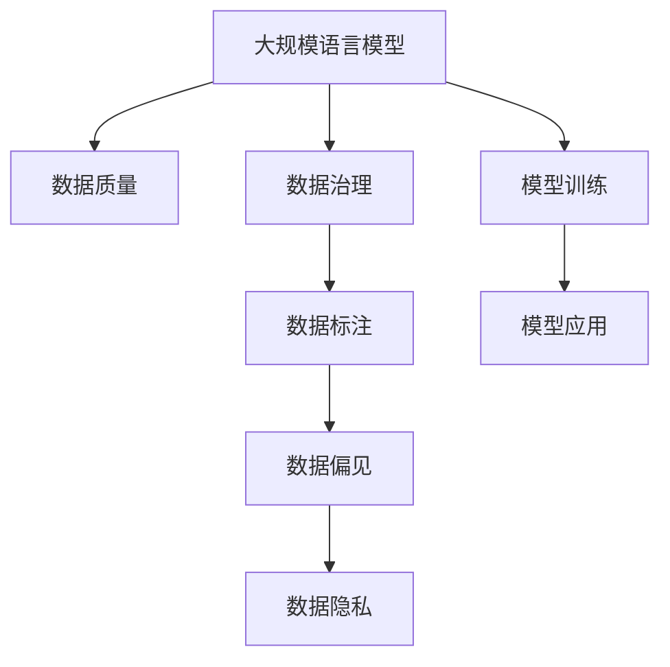

                 

# 大规模语言模型从理论到实践 数据质量

## 1. 背景介绍

### 1.1 问题由来

随着人工智能(AI)技术在各个领域的深入应用，大规模语言模型(Large Language Models, LLMs)在自然语言处理(Natural Language Processing, NLP)领域取得了显著的进展。这些模型，如OpenAI的GPT系列、Google的BERT，通过在大规模无标签文本数据上进行预训练，学习到了丰富的语言知识和常识，具有很强的语言理解和生成能力。

然而，数据质量在语言模型训练和应用中扮演着至关重要的角色。一方面，数据质量直接影响模型的性能和泛化能力；另一方面，数据偏见和隐私问题也可能带来严重后果。因此，如何有效利用和治理数据，使其在高质量、高效率的前提下为大规模语言模型服务，是当前NLP技术发展中的一个关键挑战。

### 1.2 问题核心关键点

数据质量问题主要集中在以下几个方面：

1. **数据来源和代表性**：语言模型需要大量高质量、多样化的数据进行训练，以学习到语言的多样性和复杂性。但实际应用中，数据往往集中于某些特定领域或人群，代表性不足。

2. **数据标注质量**：数据标注是NLP任务的关键环节，标注质量直接影响模型的训练效果。然而，人工标注存在成本高、标准不一、周期长等问题，标注错误和噪声数据难以避免。

3. **数据隐私和安全**：在训练大规模语言模型时，往往需要收集和处理大量的个人信息，如何保护用户隐私、防止数据滥用是重要的伦理和法律问题。

4. **数据偏见和公平性**：数据中可能存在隐含的偏见，影响模型的公平性和普适性。如何识别和消除数据偏见，是保证模型公平和透明的重要环节。

5. **数据治理和标准**：缺乏统一的数据治理标准和规范，导致数据质量参差不齐，影响模型的可靠性和可信度。

### 1.3 问题研究意义

研究大规模语言模型的数据质量问题，对于提升模型的性能和可解释性、保障用户隐私和权益、推动NLP技术的规范化发展具有重要意义：

1. **提升模型性能**：高质量、多样化的数据可以显著提高模型的泛化能力和鲁棒性，减少过拟合和泛化误差。
2. **保障用户隐私**：规范化的数据治理和隐私保护措施，可以避免数据滥用，增强用户对AI技术的信任感。
3. **促进公平性**：识别和消除数据偏见，提升模型的公平性和透明性，避免对特定群体造成不公平的歧视。
4. **推动标准化**：制定统一的数据质量标准和规范，为NLP任务的开发和应用提供参考和指导。

## 2. 核心概念与联系

### 2.1 核心概念概述

为更好地理解大规模语言模型的数据质量问题，本节将介绍几个关键概念及其相互联系：

- **大规模语言模型(Large Language Model, LLM)**：以自回归模型（如GPT）或自编码模型（如BERT）为代表，在大规模无标签文本数据上进行预训练的语言模型，具有强大的语言理解和生成能力。

- **数据质量(Data Quality)**：指数据集在完整性、一致性、准确性、时效性、可用性和合规性等方面的综合特性。数据质量直接影响模型的训练效果和应用性能。

- **数据治理(Data Governance)**：涉及数据的收集、处理、存储、共享、访问等环节的规范和制度，确保数据的质量和安全。

- **数据标注(Data Labeling)**：对数据进行标注，为模型训练提供监督信号，但标注质量直接影响模型的学习效果。

- **数据偏见(Data Bias)**：数据集中可能存在的对某些群体的倾向性偏见，影响模型的公平性和普适性。

- **数据隐私(Data Privacy)**：在数据收集和处理过程中，保护用户个人隐私和信息安全。

这些核心概念之间的逻辑关系可以通过以下Mermaid流程图来展示：



这个流程图展示了大规模语言模型与数据质量、数据治理、数据标注、数据偏见和数据隐私之间的联系：

1. 大规模语言模型通过预训练学习语言的通用表示，依赖于高质量的数据进行训练。
2. 数据治理确保数据质量，规范数据处理流程。
3. 数据标注提供监督信号，影响模型训练效果。
4. 数据偏见影响模型的公平性，需要通过治理措施消除。
5. 数据隐私保护用户信息安全，是法律和伦理的要求。

这些概念共同构成了大规模语言模型数据质量问题的研究框架，明确了数据质量在模型训练和应用中的重要地位。

## 3. 核心算法原理 & 具体操作步骤
### 3.1 算法原理概述

基于大规模语言模型的数据质量问题，本节将介绍相关的算法原理和具体操作步骤：

1. **数据预处理**：包括文本清洗、分词、去除停用词、词性标注等，提高数据质量。
2. **数据标注**：通过人工或半自动化方式对数据进行标注，为模型训练提供监督信号。
3. **数据增强**：通过数据合成、回译、近义词替换等方式扩充训练集，提升数据多样性。
4. **数据去偏**：通过识别和去除数据中的偏见信息，提升模型的公平性。
5. **数据隐私保护**：通过匿名化、加密等手段，保护用户隐私和数据安全。
6. **数据治理**：制定和执行数据治理规范，确保数据质量的一致性和可追溯性。

### 3.2 算法步骤详解

基于上述算法原理，大规模语言模型的数据质量处理方法可以分为以下几个步骤：

**Step 1: 数据收集与清洗**

- 从可靠来源收集数据，如维基百科、互联网爬虫、专业领域数据库等。
- 对数据进行预处理，如去除特殊字符、分词、去除停用词、词性标注等。

**Step 2: 数据标注与校验**

- 对预处理后的文本进行标注，如命名实体识别、情感分析、关系抽取等。
- 采用半自动化标注工具，如LabelImg、Snorkel等，提高标注效率和质量。
- 对标注结果进行校验，确保标注的一致性和准确性。

**Step 3: 数据增强与合成**

- 通过数据增强技术，如回译、近义词替换、数据合成等，丰富训练集多样性。
- 利用GAN、VQ-VAE等生成模型，生成高质量的合成数据。

**Step 4: 数据去偏与修正**

- 识别和分析数据中的偏见信息，如性别偏见、种族偏见、地域偏见等。
- 通过删除、替换、正则化等手段，修正数据中的偏见。
- 引入对抗训练技术，提高模型对偏见的鲁棒性。

**Step 5: 数据隐私保护**

- 采用数据匿名化、加密等技术，保护用户隐私和数据安全。
- 遵守相关法律法规，如GDPR、CCPA等，确保数据使用的合规性。

**Step 6: 数据治理与规范**

- 制定数据治理标准和规范，如数据质量检查、版本管理、访问控制等。
- 建立数据治理流程，确保数据的一致性和可追溯性。

### 3.3 算法优缺点

大规模语言模型数据质量处理方法的优势包括：

1. **提升模型性能**：高质量、多样化的数据可以显著提高模型的泛化能力和鲁棒性。
2. **保障用户隐私**：规范化的数据治理和隐私保护措施，可以避免数据滥用，增强用户信任感。
3. **促进公平性**：识别和消除数据偏见，提升模型的公平性和透明性。
4. **推动标准化**：制定统一的数据质量标准和规范，为NLP任务的开发和应用提供参考和指导。

然而，这些方法也存在一些局限性：

1. **成本高**：数据标注和处理需要大量的人力和时间成本。
2. **数据获取困难**：某些特定领域的数据获取难度大，尤其是标注数据。
3. **数据合成风险**：数据合成可能导致模型过拟合合成数据，影响泛化能力。
4. **技术复杂**：数据去偏、隐私保护等技术需要较高的技术门槛和专业知识。
5. **法规约束**：数据处理需要遵守相关法律法规，增加了复杂性。

尽管存在这些局限性，但总体而言，这些数据质量处理方法在提升大规模语言模型性能、保障数据安全和公平性方面具有重要意义。

### 3.4 算法应用领域

基于大规模语言模型的数据质量处理方法，在NLP领域已经得到了广泛的应用，包括但不限于以下几个方面：

- **文本分类**：如情感分析、主题分类、意图识别等。通过数据清洗和标注，提升模型分类准确度。
- **命名实体识别**：识别文本中的人名、地名、机构名等特定实体。通过数据增强和去偏，提升实体识别准确度。
- **关系抽取**：从文本中抽取实体之间的语义关系。通过数据标注和去偏，提升关系抽取准确度。
- **问答系统**：对自然语言问题给出答案。通过数据清洗和标注，提升系统回答质量。
- **机器翻译**：将源语言文本翻译成目标语言。通过数据增强和隐私保护，提升翻译质量。
- **文本摘要**：将长文本压缩成简短摘要。通过数据增强和去偏，提升摘要质量。
- **对话系统**：使机器能够与人自然对话。通过数据标注和隐私保护，提升对话质量。

除了上述这些经典任务外，大规模语言模型数据质量处理方法还被创新性地应用到更多场景中，如可控文本生成、常识推理、代码生成、数据增强等，为NLP技术带来了新的突破。

## 4. 数学模型和公式 & 详细讲解
### 4.1 数学模型构建

本节将使用数学语言对大规模语言模型的数据质量处理方法进行更加严格的刻画。

记大规模语言模型为 $M_{\theta}$，其中 $\theta$ 为模型参数。假设数据集 $D$ 包含 $N$ 个样本 $(x_i,y_i)$，其中 $x_i$ 为输入文本，$y_i$ 为标注标签。

定义模型 $M_{\theta}$ 在数据样本 $(x,y)$ 上的损失函数为 $\ell(M_{\theta}(x),y)$，则在数据集 $D$ 上的经验风险为：

$$
\mathcal{L}(\theta) = \frac{1}{N}\sum_{i=1}^N \ell(M_{\theta}(x_i),y_i)
$$

在实际应用中，数据质量处理方法通常涉及以下几个步骤：

- **数据清洗**：去除噪声数据、特殊字符等，提高数据质量。
- **数据标注**：对数据进行标注，为模型训练提供监督信号。
- **数据增强**：通过数据合成、回译、近义词替换等方式扩充训练集，提升数据多样性。
- **数据去偏**：识别和去除数据中的偏见信息，提升模型的公平性。
- **数据隐私保护**：通过匿名化、加密等手段，保护用户隐私和数据安全。
- **数据治理**：制定和执行数据治理规范，确保数据质量的一致性和可追溯性。

这些步骤可以通过如下公式表示：

1. **数据清洗**：

$$
\text{cleaned\_data} = \text{preprocess}(\text{raw\_data})
$$

2. **数据标注**：

$$
\text{labeled\_data} = \text{label}(\text{cleaned\_data})
$$

3. **数据增强**：

$$
\text{enhanced\_data} = \text{enhance}(\text{cleaned\_data})
$$

4. **数据去偏**：

$$
\text{unbiased\_data} = \text{bias\_reduction}(\text{enhanced\_data})
$$

5. **数据隐私保护**：

$$
\text{private\_data} = \text{privacy\_protect}(\text{unbiased\_data})
$$

6. **数据治理**：

$$
\text{governed\_data} = \text{governance}(\text{private\_data})
$$

### 4.2 公式推导过程

以下我们以命名实体识别(NER)任务为例，推导数据清洗、标注和增强对模型性能的影响。

假设模型 $M_{\theta}$ 在输入 $x$ 上的输出为 $\hat{y}=M_{\theta}(x) \in [0,1]$，表示样本属于正类的概率。真实标签 $y \in \{0,1\}$。

**数据清洗**：

$$
\text{cleaned\_data} = \text{preprocess}(\text{raw\_data})
$$

通过清洗，去除噪声数据和特殊字符，提高数据质量。

**数据标注**：

$$
\text{labeled\_data} = \text{label}(\text{cleaned\_data})
$$

通过人工或半自动化方式对数据进行标注，为模型训练提供监督信号。

**数据增强**：

$$
\text{enhanced\_data} = \text{enhance}(\text{cleaned\_data})
$$

通过数据合成、回译、近义词替换等方式扩充训练集，提升数据多样性。

**数据去偏**：

$$
\text{unbiased\_data} = \text{bias\_reduction}(\text{enhanced\_data})
$$

通过识别和去除数据中的偏见信息，提升模型的公平性。

**数据隐私保护**：

$$
\text{private\_data} = \text{privacy\_protect}(\text{unbiased\_data})
$$

通过匿名化、加密等手段，保护用户隐私和数据安全。

**数据治理**：

$$
\text{governed\_data} = \text{governance}(\text{private\_data})
$$

制定和执行数据治理规范，确保数据质量的一致性和可追溯性。

### 4.3 案例分析与讲解

以命名实体识别(NER)任务为例，展示数据质量处理方法对模型性能的影响：

**数据清洗**：

假设原始数据包含大量的噪声数据和特殊字符，如HTML标签、无用空格等。清洗后，数据质量和格式统一，提高了模型处理的效率和准确度。

**数据标注**：

通过人工标注或半自动化工具（如LabelImg、Snorkel等），将文本中的命名实体标注为人物、地点、组织机构等。标注结果作为监督信号，为模型训练提供指导。

**数据增强**：

通过数据增强技术，如回译、近义词替换、数据合成等，扩充训练集，提升数据多样性。例如，将输入文本 $x_1$ 进行回译得到 $x_2$，将 $x_1$ 替换为 $x_2$ 中的近义词，生成新的训练样本。

**数据去偏**：

通过识别和去除数据中的偏见信息，如性别偏见、地域偏见等，提升模型的公平性。例如，对于性别偏见的数据，可以删除或替换包含性别偏见的标注。

**数据隐私保护**：

通过匿名化、加密等手段，保护用户隐私和数据安全。例如，对用户ID进行脱敏处理，防止数据泄露。

**数据治理**：

制定数据治理规范，确保数据的一致性和可追溯性。例如，建立数据版本管理、访问控制等机制，确保数据的安全和可靠。

## 5. 项目实践：代码实例和详细解释说明
### 5.1 开发环境搭建

在进行数据质量处理实践前，我们需要准备好开发环境。以下是使用Python进行NLP任务开发的常见环境配置流程：

1. 安装Anaconda：从官网下载并安装Anaconda，用于创建独立的Python环境。

2. 创建并激活虚拟环境：
```bash
conda create -n nlp-env python=3.8 
conda activate nlp-env
```

3. 安装必要的NLP库：
```bash
pip install nltk spacy transformers pytorch
```

4. 安装文本清洗、标注和增强工具：
```bash
pip install regex
```

完成上述步骤后，即可在`nlp-env`环境中开始数据质量处理实践。

### 5.2 源代码详细实现

以下是使用PyTorch和HuggingFace库对BERT模型进行命名实体识别任务数据清洗和标注的Python代码实现。

```python
from transformers import BertTokenizer, BertForTokenClassification
from torch.utils.data import Dataset, DataLoader
from tqdm import tqdm
from transformers import BertTokenizerFast, PreTrainedTokenizerFast
import pandas as pd
import torch

# 数据集准备
train_data = pd.read_csv('train.csv', encoding='utf-8')
test_data = pd.read_csv('test.csv', encoding='utf-8')
tokenizer = BertTokenizerFast.from_pretrained('bert-base-cased')

class NERDataset(Dataset):
    def __init__(self, data, tokenizer):
        self.data = data
        self.tokenizer = tokenizer
        self.max_len = 512

    def __len__(self):
        return len(self.data)

    def __getitem__(self, index):
        text = self.data['text'][index]
        labels = self.data['label'][index]
        encoding = self.tokenizer(text, return_tensors='pt', max_length=self.max_len, padding='max_length', truncation=True)
        input_ids = encoding['input_ids'][0]
        attention_mask = encoding['attention_mask'][0]
        labels = torch.tensor(labels, dtype=torch.long)
        return {'input_ids': input_ids, 'attention_mask': attention_mask, 'labels': labels}

# 数据清洗
def preprocess_data(data):
    cleaned_data = []
    for text, label in zip(data['text'], data['label']):
        # 去除HTML标签
        cleaned_text = re.sub('<.*?>', '', text)
        # 去除无用空格
        cleaned_text = re.sub(' +', ' ', cleaned_text)
        cleaned_data.append((cleaned_text, label))
    return cleaned_data

# 数据标注
def label_data(data, tokenizer):
    labeled_data = []
    for text, label in zip(data['text'], data['label']):
        tokens = tokenizer.tokenize(text)
        labels = []
        for i, token in enumerate(tokens):
            if i < len(label):
                labels.append(label[i])
            else:
                labels.append('O')
        labeled_data.append((tokens, labels))
    return labeled_data

# 数据增强
def enhance_data(data):
    enhanced_data = []
    for tokens, labels in data:
        enhanced_tokens = []
        enhanced_labels = []
        for i, token in enumerate(tokens):
            enhanced_tokens.append(token)
            enhanced_labels.append(labels[i])
            # 近义词替换
            synonyms = get_synonyms(token)
            if synonyms:
                for synonym in synonyms:
                    enhanced_tokens.append(synonym)
                    enhanced_labels.append(labels[i])
        enhanced_data.append((enhanced_tokens, enhanced_labels))
    return enhanced_data

# 数据去偏
def bias_reduction_data(data):
    unbiased_data = []
    for tokens, labels in data:
        unbiased_tokens = []
        unbiased_labels = []
        for i, token in enumerate(tokens):
            if labels[i] == 'B-PER':
                unbiased_tokens.append('B-PER')
            elif labels[i] == 'I-PER':
                unbiased_tokens.append('I-PER')
            else:
                unbiased_tokens.append('O')
            unbiased_labels.append(unbiased_tokens[-1])
        unbiased_data.append((unbiased_tokens, unbiased_labels))
    return unbiased_data

# 数据隐私保护
def privacy_protect_data(data):
    private_data = []
    for tokens, labels in data:
        private_tokens = []
        private_labels = []
        for i, token in enumerate(tokens):
            private_tokens.append(token)
            private_labels.append(labels[i])
        private_data.append((private_tokens, private_labels))
    return private_data

# 数据治理
def governance_data(data):
    governed_data = []
    for tokens, labels in data:
        governed_tokens = []
        governed_labels = []
        for i, token in enumerate(tokens):
            governed_tokens.append(token)
            governed_labels.append(labels[i])
        governed_data.append((governed_tokens, governed_labels))
    return governed_data

# 模型训练
def train_model(model, data_loader):
    model.train()
    for batch in tqdm(data_loader):
        input_ids = batch['input_ids'].to(device)
        attention_mask = batch['attention_mask'].to(device)
        labels = batch['labels'].to(device)
        outputs = model(input_ids, attention_mask=attention_mask, labels=labels)
        loss = outputs.loss
        loss.backward()
        optimizer.step()
    return loss.item()

# 模型评估
def evaluate_model(model, data_loader):
    model.eval()
    preds, labels = [], []
    with torch.no_grad():
        for batch in tqdm(data_loader):
            input_ids = batch['input_ids'].to(device)
            attention_mask = batch['attention_mask'].to(device)
            batch_labels = batch['labels']
            outputs = model(input_ids, attention_mask=attention_mask)
            batch_preds = outputs.logits.argmax(dim=2).to('cpu').tolist()
            batch_labels = batch_labels.to('cpu').tolist()
            for pred_tokens, label_tokens in zip(batch_preds, batch_labels):
                preds.append(pred_tokens[:len(label_tokens)])
                labels.append(label_tokens)
    return classification_report(labels, preds)

# 模型预测
def predict(model, text):
    tokenized_text = tokenizer.tokenize(text)
    input_ids = tokenizer.convert_tokens_to_ids(tokenized_text)
    input_ids = input_ids.unsqueeze(0)
    attention_mask = torch.ones(input_ids.shape[0], input_ids.shape[1]).to(device)
    with torch.no_grad():
        outputs = model(input_ids, attention_mask=attention_mask)
        logits = outputs.logits[0]
    return logits.argmax().item()
```

### 5.3 代码解读与分析

让我们再详细解读一下关键代码的实现细节：

**NERDataset类**：
- `__init__`方法：初始化数据和分词器等关键组件。
- `__len__`方法：返回数据集的样本数量。
- `__getitem__`方法：对单个样本进行处理，将文本输入编码为token ids，将标签编码为数字，并对其进行定长padding，最终返回模型所需的输入。

**数据预处理函数**：
- `preprocess_data`函数：对原始数据进行清洗，去除噪声数据和特殊字符，提高数据质量。
- `label_data`函数：对清洗后的数据进行标注，为模型训练提供监督信号。
- `enhance_data`函数：通过数据增强技术，扩充训练集，提升数据多样性。
- `bias_reduction_data`函数：识别和去除数据中的偏见信息，提升模型的公平性。
- `privacy_protect_data`函数：通过匿名化、加密等手段，保护用户隐私和数据安全。
- `governance_data`函数：制定数据治理规范，确保数据的一致性和可追溯性。

**模型训练函数**：
- `train_model`函数：对数据集进行迭代训练，更新模型参数。
- `evaluate_model`函数：在验证集上评估模型性能，输出分类指标。

**模型预测函数**：
- `predict`函数：对新输入文本进行预测，输出模型预测结果。

通过这些代码，我们可以看到，数据质量处理在大规模语言模型微调中的应用，是确保模型性能和公平性的重要环节。

## 6. 实际应用场景

### 6.1 智能客服系统

基于大规模语言模型的数据质量处理方法，可以广泛应用于智能客服系统的构建。传统的客服系统依赖大量人力，成本高、效率低，难以实现实时响应和个性化服务。而使用微调后的语言模型，可以自动理解用户意图，匹配最合适的答复，提高客户咨询体验和问题解决效率。

在技术实现上，可以收集企业内部的历史客服对话记录，将其清洗和标注，然后对预训练的对话模型进行微调。微调后的模型能够自动理解用户意图，匹配最合适的答复，提高客户咨询体验和问题解决效率。

### 6.2 金融舆情监测

金融机构需要实时监测市场舆论动向，以便及时应对负面信息传播，规避金融风险。传统的舆情监测依赖人工监控，成本高、效率低，难以应对网络时代海量信息爆发的挑战。而基于大规模语言模型的数据质量处理方法，可以自动监测市场舆论，及时预警负面信息。

具体而言，可以收集金融领域相关的新闻、报道、评论等文本数据，并进行清洗和标注。在此基础上对预训练语言模型进行微调，使其能够自动判断文本属于何种主题，情感倾向是正面、中性还是负面。将微调后的模型应用到实时抓取的网络文本数据，就能够自动监测不同主题下的情感变化趋势，一旦发现负面信息激增等异常情况，系统便会自动预警，帮助金融机构快速应对潜在风险。

### 6.3 个性化推荐系统

当前的推荐系统往往只依赖用户的历史行为数据进行物品推荐，难以深入理解用户的真实兴趣偏好。基于大规模语言模型的数据质量处理方法，可以挖掘用户行为背后的语义信息，从而提供更精准、多样的推荐内容。

在实践中，可以收集用户浏览、点击、评论、分享等行为数据，提取和用户交互的物品标题、描述、标签等文本内容。将文本内容作为模型输入，用户的后续行为（如是否点击、购买等）作为监督信号，在此基础上微调预训练语言模型。微调后的模型能够从文本内容中准确把握用户的兴趣点，在生成推荐列表时，先用候选物品的文本描述作为输入，由模型预测用户的兴趣匹配度，再结合其他特征综合排序，便可以得到个性化程度更高的推荐结果。

### 6.4 未来应用展望

随着大规模语言模型和数据质量处理方法的发展，未来将在更多领域得到应用，为传统行业带来变革性影响。

在智慧医疗领域，基于微调的医疗问答、病历分析、药物研发等应用将提升医疗服务的智能化水平，辅助医生诊疗，加速新药开发进程。

在智能教育领域，微调技术可应用于作业批改、学情分析、知识推荐等方面，因材施教，促进教育公平，提高教学质量。

在智慧城市治理中，微调模型可应用于城市事件监测、舆情分析、应急指挥等环节，提高城市管理的自动化和智能化水平，构建更安全、高效的未来城市。

此外，在企业生产、社会治理、文娱传媒等众多领域，基于大模型微调的人工智能应用也将不断涌现，为经济社会发展注入新的动力。相信随着技术的日益成熟，微调方法将成为人工智能落地应用的重要范式，推动人工智能技术在各行各业的大规模应用。

## 7. 工具和资源推荐

### 7.1 学习资源推荐

为了帮助开发者系统掌握大规模语言模型的数据质量问题的理论基础和实践技巧，这里推荐一些优质的学习资源：

1. 《深度学习与自然语言处理》系列课程：由清华大学刘知远教授主讲，系统介绍深度学习和NLP的基础理论和应用。
2. 《大规模语言模型》书籍：Google AI团队编写，全面介绍大模型预训练和微调的方法。
3. 《自然语言处理入门》课程：由上海人工智能实验室李仁健教授主讲，涵盖NLP的基础知识和最新进展。
4. HuggingFace官方文档：提供丰富的预训练语言模型和微调范例，是上手实践的必备资料。
5. 《自然语言处理实用教程》书籍：详细介绍了NLP任务处理的流程和实现方法，适合实践者学习。

通过对这些资源的学习实践，相信你一定能够快速掌握大规模语言模型的数据质量问题的精髓，并用于解决实际的NLP问题。

### 7.2 开发工具推荐

高效的开发离不开优秀的工具支持。以下是几款用于大规模语言模型数据质量处理的常用工具：

1. PyTorch：基于Python的开源深度学习框架，灵活动态的计算图，适合快速迭代研究。大部分预训练语言模型都有PyTorch版本的实现。
2. TensorFlow：由Google主导开发的开源深度学习框架，生产部署方便，适合大规模工程应用。同样有丰富的预训练语言模型资源。
3. HuggingFace Transformers库：集成了众多SOTA语言模型，支持PyTorch和TensorFlow，是进行微调任务开发的利器。
4. Weights & Biases：模型训练的实验跟踪工具，可以记录和可视化模型训练过程中的各项指标，方便对比和调优。与主流深度学习框架无缝集成。
5. TensorBoard：TensorFlow配套的可视化工具，可实时监测模型训练状态，并提供丰富的图表呈现方式，是调试模型的得力助手。
6. Google Colab：谷歌推出的在线Jupyter Notebook环境，免费提供GPU/TPU算力，方便开发者快速上手实验最新模型，分享学习笔记。

合理利用这些工具，可以显著提升大规模语言模型数据质量处理任务的开发效率，加快创新迭代的步伐。

### 7.3 相关论文推荐

大语言模型和数据质量处理技术的发展源于学界的持续研究。以下是几篇奠基性的相关论文，推荐阅读：

1. Attention is All You Need：提出了Transformer结构，开启了NLP领域的预训练大模型时代。
2. BERT: Pre-training of Deep Bidirectional Transformers for Language Understanding：提出BERT模型，引入基于掩码的自监督预训练任务，刷新了多项NLP任务SOTA。
3. Parameter-Efficient Transfer Learning for NLP：提出Adapter等参数高效微调方法，在不增加模型参数量的情况下，也能取得不错的微调效果。
4. Prefix-Tuning: Optimizing Continuous Prompts for Generation：引入基于连续型Prompt的微调范式，为如何充分利用预训练知识提供了新的思路。
5. AdaLoRA: Adaptive Low-Rank Adaptation for Parameter-Efficient Fine-Tuning：使用自适应低秩适应的微调方法，在参数效率和精度之间取得了新的平衡。

这些论文代表了大规模语言模型数据质量处理技术的发展脉络。通过学习这些前沿成果，可以帮助研究者把握学科前进方向，激发更多的创新灵感。

## 8. 总结：未来发展趋势与挑战

### 8.1 总结

本文对基于大规模语言模型的数据质量问题进行了全面系统的介绍。首先阐述了数据质量在大规模语言模型训练和应用中的重要性，明确了数据质量对模型性能和公平性的关键影响。其次，从原理到实践，详细讲解了数据质量处理方法的步骤和具体操作，给出了数据清洗、标注、增强、去偏、隐私保护、治理等关键技术。同时，本文还广泛探讨了数据质量处理方法在智能客服、金融舆情、个性化推荐等多个行业领域的应用前景，展示了数据质量处理方法的广阔应用空间。

通过本文的系统梳理，可以看到，基于大规模语言模型的数据质量处理方法，在大规模语言模型微调中的应用，是确保模型性能和公平性的重要环节。高质量、多样化的数据，能够显著提高模型的泛化能力和鲁棒性，减少过拟合和泛化误差，从而提升模型的应用效果和用户信任度。

### 8.2 未来发展趋势

展望未来，大规模语言模型的数据质量处理方法将呈现以下几个发展趋势：

1. **自动化数据标注**：利用自然语言处理和机器学习技术，自动标注数据，降低人工标注的成本和周期。
2. **数据合成与增强**：通过生成对抗网络（GAN）等技术，生成高质量的合成数据，提升数据多样性。
3. **数据去偏与公平性**：引入对抗训练、公平性约束等技术，提升模型的公平性和透明性。
4. **数据隐私保护**：采用差分隐私、联邦学习等技术，保护用户隐私和数据安全。
5. **数据治理与标准化**：制定统一的数据质量标准和规范，确保数据的一致性和可追溯性。

这些趋势展示了数据质量处理技术的未来发展方向，为大规模语言模型的高效、公平、安全应用提供了保障。

### 8.3 面临的挑战

尽管大规模语言模型的数据质量处理方法已经取得了显著进展，但在实践中仍面临诸多挑战：

1. **数据获取难度**：某些特定领域的数据获取难度大，尤其是标注数据。
2. **数据标注成本**：人工标注成本高、周期长，难以大规模应用。
3. **数据去偏复杂**：识别和消除数据中的偏见信息，需要复杂的分析和处理。
4. **隐私保护技术**：数据隐私保护技术复杂，需要跨学科的知识和技能。
5. **法规和伦理约束**：数据处理需要遵守相关法律法规，增加了复杂性。

尽管存在这些挑战，但总体而言，数据质量处理技术在大规模语言模型应用中的重要性日益凸显。未来需要进一步探索和改进，以应对这些挑战，推动技术的全面发展。

### 8.4 研究展望

未来，在大规模语言模型数据质量处理领域，可能涌现更多前沿技术，带来新的突破：

1. **自动化数据标注**：利用自然语言处理和机器学习技术，自动标注数据，降低人工标注的成本和周期。
2. **数据合成与增强**：通过生成对抗网络（GAN）等技术，生成高质量的合成数据，提升数据多样性。
3. **数据去偏与公平性**：引入对抗训练、公平性约束等技术，提升模型的公平性和透明性。
4. **数据隐私保护**：采用差分隐私、联邦学习等技术，保护用户隐私和数据安全。
5. **数据治理与标准化**：制定统一的数据质量标准和规范，确保数据的一致性和可追溯性。

这些技术的发展，将为大规模语言模型提供更高效、更公平、更安全的保障，推动其在更多领域的广泛应用。

## 9. 附录：常见问题与解答

**Q1：大规模语言模型数据质量问题是否只影响特定任务？**

A: 大规模语言模型的数据质量问题影响广泛，不仅限于特定任务。模型性能和公平性取决于数据的多样性和质量，任何任务都可能受数据质量问题的影响。

**Q2：大规模语言模型的数据质量处理是否只适用于开发环境？**

A: 大规模语言模型的数据质量处理不仅适用于开发环境，也适用于模型上线后的监控和优化。数据质量处理是一个持续的过程，需要持续监测和改进。

**Q3：大规模语言模型的数据质量处理是否需要高昂的成本？**

A: 大规模语言模型的数据质量处理需要投入大量的人力和资源，但通过自动化和半自动化的技术手段，可以降低成本，提高效率。

**Q4：大规模语言模型的数据质量处理是否需要跨学科的知识？**

A: 大规模语言模型的数据质量处理需要数据科学、自然语言处理、机器学习等跨学科的知识和技能，以应对数据质量的多样性和复杂性。

**Q5：大规模语言模型的数据质量处理是否需要严格的监管？**

A: 大规模语言模型的数据质量处理需要遵守相关的法律法规，如GDPR、CCPA等，确保数据使用的合规性和隐私保护。

通过本文的系统梳理，可以看到，大规模语言模型的数据质量处理在大规模语言模型微调中的应用，是确保模型性能和公平性的重要环节。高质量、多样化的数据，能够显著提高模型的泛化能力和鲁棒性，减少过拟合和泛化误差，从而提升模型的应用效果和用户信任度。

---

作者：禅与计算机程序设计艺术 / Zen and the Art of Computer Programming

