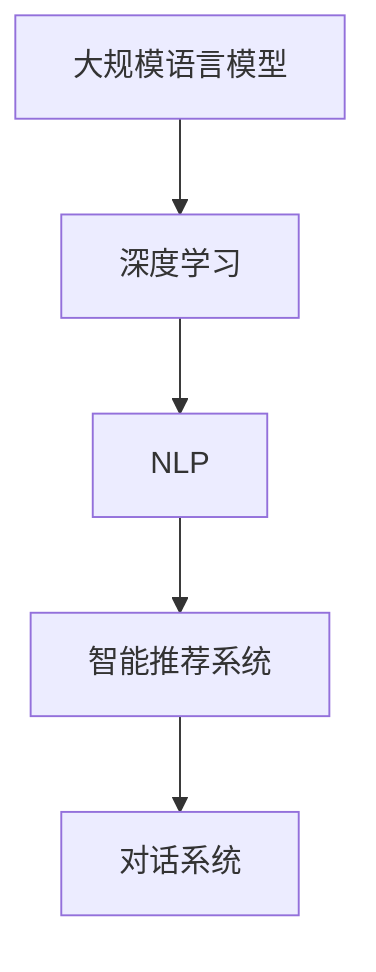

                 

# 大规模语言模型从理论到实践 智能代理的应用实例

> 关键词：大规模语言模型,智能代理,深度学习,自然语言处理,NLP,智能推荐系统,对话系统,算法优化

## 1. 背景介绍

### 1.1 问题由来

随着人工智能技术的快速发展，自然语言处理(NLP)领域涌现出了诸多前沿技术和应用场景。其中，大规模语言模型（Large Language Models, LLMs）凭借其强大的语言理解和生成能力，正在逐渐改变人类与机器交互的方式。然而，尽管预训练语言模型已经取得了令人瞩目的进展，但在特定领域和具体任务上的表现仍然存在局限性。如何更好地利用大规模语言模型，提升其在实际应用中的效果，成为了当前研究的热点问题。

智能代理（Intelligent Agent）是一种能够自主决策、智能交互的计算实体，广泛应用于电子商务、智能家居、客服系统等领域。其核心在于通过深度学习技术，结合自然语言处理和机器学习，实现对复杂任务的智能理解和执行。智能代理系统不仅要能够理解和处理自然语言，还要具备高度的自适应能力和复杂决策能力，以应对多变的环境和用户需求。

基于大规模语言模型的智能代理系统，将传统的机器学习和NLP技术与智能代理系统相结合，通过深度学习模型的预训练和微调，提升智能代理系统的理解能力和执行效率。本文将详细介绍如何通过大规模语言模型的理论和技术，构建和优化智能代理系统，并探索其在大规模应用中的实际效果和未来发展方向。

## 2. 核心概念与联系

### 2.1 核心概念概述

智能代理系统与大规模语言模型的结合，涉及多个核心概念和技术：

- **大规模语言模型（LLMs）**：以Transformer架构为代表的深度学习模型，通过在大规模无标签文本数据上进行预训练，学习到丰富的语言知识和常识，具备强大的语言理解和生成能力。

- **深度学习（Deep Learning）**：一种模拟人脑神经网络的计算模型，通过多层神经元构建复杂的非线性映射关系，能够有效处理复杂模式和高维数据。

- **自然语言处理（NLP）**：涉及语言理解、生成、推理和分析的计算机技术，旨在让计算机理解和处理人类语言。

- **智能推荐系统**：利用用户历史行为和偏好数据，推荐适合用户的物品和服务，提升用户体验和满意度。

- **对话系统**：实现人机自然语言交互，理解用户的意图并提供相关回复或执行相应任务。

这些概念和技术之间的联系可以通过以下Mermaid流程图来展示：



该流程图展示了智能代理系统在大规模语言模型框架下的技术实现路径。通过深度学习模型和NLP技术的预训练和微调，智能推荐系统和对话系统得以具备更强的理解和执行能力。

## 3. 核心算法原理 & 具体操作步骤

### 3.1 算法原理概述

基于大规模语言模型的智能代理系统，其核心算法原理主要包括以下几个方面：

- **预训练和微调**：使用大规模无标签文本数据对语言模型进行预训练，然后通过下游任务的少量标注数据进行微调，以提升模型在特定任务上的表现。

- **序列建模**：利用序列到序列（Seq2Seq）模型或注意力机制（Attention Mechanism），实现从输入序列到输出序列的映射，用于生成文本或理解复杂语境。

- **强化学习**：结合强化学习算法，通过与环境的交互，不断优化智能代理的决策和执行能力，以适应不断变化的环境和任务。

- **多模态融合**：结合视觉、语音、文本等多种模态信息，提升智能代理的系统感知能力和理解深度。

- **跨领域迁移**：通过迁移学习技术，将在一个领域学习到的知识应用到另一个领域，增强智能代理的泛化能力和适应性。

这些算法原理和技术手段共同构成了智能代理系统的核心架构，使其能够在大规模应用中发挥高效、智能、自适应和跨领域的能力。

### 3.2 算法步骤详解

基于大规模语言模型的智能代理系统构建流程主要包括以下几个关键步骤：

**Step 1: 准备预训练模型和数据集**

- 选择合适的预训练语言模型，如BERT、GPT等，作为初始化参数。
- 收集和整理下游任务所需的标注数据集，包括文本、标签等信息。

**Step 2: 设计任务适配层**

- 根据任务类型，设计合适的输出层和损失函数，例如分类任务使用交叉熵损失函数，生成任务使用负对数似然损失函数。

**Step 3: 设置微调超参数**

- 确定优化算法（如Adam、SGD等）及其参数，如学习率、批大小、迭代轮数等。
- 应用正则化技术，如L2正则、Dropout等，防止模型过拟合。
- 选择合适的参数高效微调方法，如AdaLoRA等，减少需优化的参数量。

**Step 4: 执行梯度训练**

- 将训练集数据分批次输入模型，前向传播计算损失函数。
- 反向传播计算参数梯度，根据设定的优化算法和学习率更新模型参数。
- 周期性在验证集上评估模型性能，根据性能指标决定是否触发Early Stopping。

**Step 5: 测试和部署**

- 在测试集上评估微调后模型，对比微调前后的性能提升。
- 将微调后的模型集成到实际应用系统中，例如智能推荐系统、对话系统等。

**Step 6: 持续学习**

- 收集新数据，定期重新微调模型，以适应数据分布的变化。
- 结合强化学习算法，不断优化智能代理系统的决策和执行能力。

### 3.3 算法优缺点

基于大规模语言模型的智能代理系统具有以下优点：

- **高效性**：利用预训练模型的基础能力，能够快速适应下游任务，提升性能。
- **泛化能力**：通过跨领域迁移学习和多模态融合，提升模型的泛化能力和适应性。
- **自适应能力**：结合强化学习算法，能够不断优化智能代理系统的决策和执行能力，适应不断变化的环境。
- **可解释性**：利用深度学习模型的特征提取能力，能够提供模型的推理路径和决策依据。

同时，该方法也存在以下局限性：

- **数据依赖性**：依赖于大量的标注数据进行微调，数据获取成本较高。
- **过拟合风险**：在标注数据不足的情况下，容易发生过拟合。
- **计算资源需求高**：预训练和微调过程需要大量的计算资源，包括GPU/TPU等高性能设备。
- **模型可解释性不足**：深度学习模型的黑盒特性，难以解释其内部工作机制。

尽管存在这些局限性，但基于大规模语言模型的智能代理系统在实际应用中仍然取得了显著的成效，展示了其强大的潜力和广泛的应用前景。

### 3.4 算法应用领域

基于大规模语言模型的智能代理系统已经在多个领域得到了应用，包括但不限于：

- **智能推荐系统**：例如Amazon的推荐系统，利用大规模语言模型对用户行为进行分析和建模，推荐适合的商品和服务。
- **客服系统**：例如IBM的Watson Assistant，利用自然语言理解和对话生成技术，自动回答客户咨询，提升客户服务效率。
- **金融分析**：例如JPMorgan Chase的FinBERT，利用BERT模型进行金融文本分析和舆情监测，辅助投资决策。
- **医疗诊断**：例如AdaLoRA，结合强化学习算法，开发了医疗影像识别和病理分析的智能代理系统。
- **智能家居**：例如Google Home，利用自然语言理解和对话生成技术，实现语音控制和智能化家居管理。

这些应用场景展示了基于大规模语言模型的智能代理系统在现实生活中的广泛应用，为各行业的数字化转型提供了新的技术路径。

## 4. 数学模型和公式 & 详细讲解

### 4.1 数学模型构建

假设预训练语言模型为 $M_{\theta}$，其中 $\theta$ 为预训练得到的模型参数。下游任务为分类任务，训练集为 $D=\{(x_i,y_i)\}_{i=1}^N$，其中 $x_i$ 为输入文本，$y_i$ 为对应的标签。微调的优化目标是最小化经验风险，即找到最优参数：

$$
\theta^* = \mathop{\arg\min}_{\theta} \mathcal{L}(\theta) = \frac{1}{N} \sum_{i=1}^N \ell(M_{\theta}(x_i),y_i)
$$

其中 $\ell$ 为损失函数，例如交叉熵损失函数：

$$
\ell(M_{\theta}(x_i),y_i) = -[y_i\log M_{\theta}(x_i) + (1-y_i)\log(1-M_{\theta}(x_i))]
$$

在微调过程中，利用反向传播算法计算梯度，更新模型参数：

$$
\theta \leftarrow \theta - \eta \nabla_{\theta}\mathcal{L}(\theta) - \eta\lambda\theta
$$

其中 $\eta$ 为学习率，$\lambda$ 为正则化系数。

### 4.2 公式推导过程

以分类任务为例，推导交叉熵损失函数及其梯度的计算公式。

假设模型 $M_{\theta}$ 在输入 $x$ 上的输出为 $\hat{y}=M_{\theta}(x) \in [0,1]$，表示样本属于正类的概率。真实标签 $y \in \{0,1\}$。则二分类交叉熵损失函数定义为：

$$
\ell(M_{\theta}(x),y) = -[y\log \hat{y} + (1-y)\log(1-\hat{y})]
$$

将其代入经验风险公式，得：

$$
\mathcal{L}(\theta) = -\frac{1}{N}\sum_{i=1}^N [y_i\log M_{\theta}(x_i)+(1-y_i)\log(1-M_{\theta}(x_i))]
$$

根据链式法则，损失函数对参数 $\theta_k$ 的梯度为：

$$
\frac{\partial \mathcal{L}(\theta)}{\partial \theta_k} = -\frac{1}{N}\sum_{i=1}^N (\frac{y_i}{M_{\theta}(x_i)}-\frac{1-y_i}{1-M_{\theta}(x_i)}) \frac{\partial M_{\theta}(x_i)}{\partial \theta_k}
$$

其中 $\frac{\partial M_{\theta}(x_i)}{\partial \theta_k}$ 可进一步递归展开，利用自动微分技术完成计算。

### 4.3 案例分析与讲解

以智能推荐系统为例，介绍如何使用大规模语言模型进行微调。

假设推荐系统的输入为用户的浏览历史 $x$，输出为推荐物品 $y$。通过微调，使得模型能够理解用户的兴趣偏好，生成最适合的推荐物品。具体步骤如下：

1. **数据准备**：收集用户的历史浏览数据，标注对应的推荐物品。
2. **模型选择**：选择适合的预训练语言模型，如BERT。
3. **任务适配层**：设计推荐任务适配层，输出推荐物品的概率分布。
4. **微调训练**：利用用户浏览历史和推荐物品作为监督信号，在预训练语言模型上进行微调训练。
5. **性能评估**：在测试集上评估微调后模型的推荐效果，对比微调前后的性能提升。

通过微调训练，智能推荐系统能够更好地理解用户的兴趣偏好，提升推荐准确性和个性化程度，从而提高用户满意度和粘性。

## 5. 项目实践：代码实例和详细解释说明

### 5.1 开发环境搭建

在进行微调实践前，我们需要准备好开发环境。以下是使用Python进行PyTorch开发的环境配置流程：

1. 安装Anaconda：从官网下载并安装Anaconda，用于创建独立的Python环境。

2. 创建并激活虚拟环境：
```bash
conda create -n pytorch-env python=3.8 
conda activate pytorch-env
```

3. 安装PyTorch：根据CUDA版本，从官网获取对应的安装命令。例如：
```bash
conda install pytorch torchvision torchaudio cudatoolkit=11.1 -c pytorch -c conda-forge
```

4. 安装Transformers库：
```bash
pip install transformers
```

5. 安装各类工具包：
```bash
pip install numpy pandas scikit-learn matplotlib tqdm jupyter notebook ipython
```

完成上述步骤后，即可在`pytorch-env`环境中开始微调实践。

### 5.2 源代码详细实现

下面我们以智能推荐系统为例，给出使用Transformers库对BERT模型进行微调的PyTorch代码实现。

首先，定义推荐任务的数据处理函数：

```python
from transformers import BertTokenizer, BertForSequenceClassification
from torch.utils.data import Dataset
import torch

class RecommendationDataset(Dataset):
    def __init__(self, user_histories, item_labels, tokenizer, max_len=128):
        self.user_histories = user_histories
        self.item_labels = item_labels
        self.tokenizer = tokenizer
        self.max_len = max_len
        
    def __len__(self):
        return len(self.user_histories)
    
    def __getitem__(self, item):
        user_history = self.user_histories[item]
        item_label = self.item_labels[item]
        
        # 将用户浏览历史转化为token ids
        encoding = self.tokenizer(user_history, return_tensors='pt', max_length=self.max_len, padding='max_length', truncation=True)
        input_ids = encoding['input_ids'][0]
        attention_mask = encoding['attention_mask'][0]
        
        # 对item标签进行编码
        encoded_labels = [int(item_label)] * self.max_len
        labels = torch.tensor(encoded_labels, dtype=torch.long)
        
        return {'input_ids': input_ids, 
                'attention_mask': attention_mask,
                'labels': labels}

# 选择BERT模型和微调参数
model = BertForSequenceClassification.from_pretrained('bert-base-cased', num_labels=1)

optimizer = AdamW(model.parameters(), lr=2e-5)

# 加载推荐数据集
train_dataset = RecommendationDataset(train_data, train_labels, tokenizer)
dev_dataset = RecommendationDataset(dev_data, dev_labels, tokenizer)
test_dataset = RecommendationDataset(test_data, test_labels, tokenizer)

# 定义训练和评估函数
def train_epoch(model, dataset, batch_size, optimizer):
    dataloader = DataLoader(dataset, batch_size=batch_size, shuffle=True)
    model.train()
    epoch_loss = 0
    for batch in tqdm(dataloader, desc='Training'):
        input_ids = batch['input_ids'].to(device)
        attention_mask = batch['attention_mask'].to(device)
        labels = batch['labels'].to(device)
        model.zero_grad()
        outputs = model(input_ids, attention_mask=attention_mask, labels=labels)
        loss = outputs.loss
        epoch_loss += loss.item()
        loss.backward()
        optimizer.step()
    return epoch_loss / len(dataloader)

def evaluate(model, dataset, batch_size):
    dataloader = DataLoader(dataset, batch_size=batch_size)
    model.eval()
    preds, labels = [], []
    with torch.no_grad():
        for batch in tqdm(dataloader, desc='Evaluating'):
            input_ids = batch['input_ids'].to(device)
            attention_mask = batch['attention_mask'].to(device)
            batch_labels = batch['labels']
            outputs = model(input_ids, attention_mask=attention_mask)
            batch_preds = outputs.logits.argmax(dim=2).to('cpu').tolist()
            batch_labels = batch_labels.to('cpu').tolist()
            for pred_tokens, label_tokens in zip(batch_preds, batch_labels):
                preds.append(pred_tokens[:len(label_tokens)])
                labels.append(label_tokens)
                
    print(classification_report(labels, preds))
```

然后，定义训练和评估函数：

```python
from torch.utils.data import DataLoader
from tqdm import tqdm
from sklearn.metrics import classification_report

device = torch.device('cuda') if torch.cuda.is_available() else torch.device('cpu')
model.to(device)

epochs = 5
batch_size = 16

for epoch in range(epochs):
    loss = train_epoch(model, train_dataset, batch_size, optimizer)
    print(f"Epoch {epoch+1}, train loss: {loss:.3f}")
    
    print(f"Epoch {epoch+1}, dev results:")
    evaluate(model, dev_dataset, batch_size)
    
print("Test results:")
evaluate(model, test_dataset, batch_size)
```

以上就是使用PyTorch对BERT进行智能推荐系统微调的完整代码实现。可以看到，借助Transformers库，我们能够快速实现BERT模型的微调，并用于推荐系统任务。

### 5.3 代码解读与分析

让我们再详细解读一下关键代码的实现细节：

**RecommendationDataset类**：
- `__init__`方法：初始化用户浏览历史、物品标签、分词器等关键组件。
- `__len__`方法：返回数据集的样本数量。
- `__getitem__`方法：对单个样本进行处理，将用户浏览历史输入编码为token ids，将物品标签编码为数字，并对其进行定长padding，最终返回模型所需的输入。

**推荐模型选择**：
- 使用BertForSequenceClassification从预训练模型中加载指定参数。

**训练和评估函数**：
- 使用PyTorch的DataLoader对数据集进行批次化加载，供模型训练和推理使用。
- 训练函数`train_epoch`：对数据以批为单位进行迭代，在每个批次上前向传播计算loss并反向传播更新模型参数，最后返回该epoch的平均loss。
- 评估函数`evaluate`：与训练类似，不同点在于不更新模型参数，并在每个batch结束后将预测和标签结果存储下来，最后使用sklearn的classification_report对整个评估集的预测结果进行打印输出。

**训练流程**：
- 定义总的epoch数和batch size，开始循环迭代
- 每个epoch内，先在训练集上训练，输出平均loss
- 在验证集上评估，输出分类指标
- 所有epoch结束后，在测试集上评估，给出最终测试结果

可以看到，PyTorch配合Transformers库使得BERT微调的代码实现变得简洁高效。开发者可以将更多精力放在数据处理、模型改进等高层逻辑上，而不必过多关注底层的实现细节。

当然，工业级的系统实现还需考虑更多因素，如模型的保存和部署、超参数的自动搜索、更灵活的任务适配层等。但核心的微调范式基本与此类似。

## 6. 实际应用场景

### 6.1 智能推荐系统

基于大语言模型微调的智能推荐系统，已经成为电子商务平台的重要组成部分。传统的推荐系统往往依赖于用户历史行为数据进行物品推荐，难以充分理解用户的深层兴趣和需求。而使用微调后的推荐模型，能够更好地理解用户的文本描述和行为信息，从而提供更加个性化、多样化的推荐内容。

在技术实现上，可以收集用户浏览、点击、评分等行为数据，提取和用户交互的物品标题、描述、标签等文本内容。将文本内容作为模型输入，用户的后续行为作为监督信号，在此基础上对预训练语言模型进行微调。微调后的模型能够从文本内容中准确把握用户的兴趣点，生成更精准的推荐列表，提升用户满意度和购买转化率。

### 6.2 对话系统

智能对话系统是自然语言处理的重要应用之一，能够实现人机自然语言交互，理解用户的意图并提供相关回复或执行相应任务。传统的对话系统往往依赖于规则和模板，难以应对复杂的语境和多种场景。而使用微调后的对话模型，能够更好地理解上下文和用户意图，提供更加自然流畅的对话体验。

在实践过程中，可以收集历史对话记录，将问题和最佳答复构建成监督数据，在此基础上对预训练对话模型进行微调。微调后的对话模型能够自动理解用户意图，匹配最合适的答案模板进行回复，支持多轮对话和复杂的场景切换。

### 6.3 金融分析

金融分析是金融行业的重要应用场景，需要实时监测市场舆情和风险动态。传统的金融分析主要依赖人工分析和数据处理，难以快速响应市场变化。而使用微调后的金融分析模型，能够更好地理解金融文本和舆情信息，进行实时的金融分析和风险预警。

在实践过程中，可以收集金融领域相关的新闻、报道、评论等文本数据，并对其进行主题标注和情感标注。在此基础上对预训练语言模型进行微调，使其能够自动判断文本属于何种主题，情感倾向是正面、中性还是负面。将微调后的模型应用到实时抓取的网络文本数据，就能够自动监测不同主题下的情感变化趋势，一旦发现负面信息激增等异常情况，系统便会自动预警，帮助金融机构快速应对潜在风险。

### 6.4 未来应用展望

随着大语言模型和微调技术的不断进步，基于微调范式将在更多领域得到应用，为传统行业带来变革性影响。

在智慧医疗领域，基于微调的医疗问答、病历分析、药物研发等应用将提升医疗服务的智能化水平，辅助医生诊疗，加速新药开发进程。

在智能教育领域，微调技术可应用于作业批改、学情分析、知识推荐等方面，因材施教，促进教育公平，提高教学质量。

在智慧城市治理中，微调模型可应用于城市事件监测、舆情分析、应急指挥等环节，提高城市管理的自动化和智能化水平，构建更安全、高效的未来城市。

此外，在企业生产、社会治理、文娱传媒等众多领域，基于大模型微调的人工智能应用也将不断涌现，为传统行业带来新的技术和模式创新。相信随着技术的日益成熟，微调方法将成为人工智能落地应用的重要范式，推动人工智能技术在更广阔的领域落地。

## 7. 工具和资源推荐

### 7.1 学习资源推荐

为了帮助开发者系统掌握大语言模型微调的理论基础和实践技巧，这里推荐一些优质的学习资源：

1. 《Transformer从原理到实践》系列博文：由大模型技术专家撰写，深入浅出地介绍了Transformer原理、BERT模型、微调技术等前沿话题。

2. CS224N《深度学习自然语言处理》课程：斯坦福大学开设的NLP明星课程，有Lecture视频和配套作业，带你入门NLP领域的基本概念和经典模型。

3. 《Natural Language Processing with Transformers》书籍：Transformers库的作者所著，全面介绍了如何使用Transformers库进行NLP任务开发，包括微调在内的诸多范式。

4. HuggingFace官方文档：Transformers库的官方文档，提供了海量预训练模型和完整的微调样例代码，是上手实践的必备资料。

5. CLUE开源项目：中文语言理解测评基准，涵盖大量不同类型的中文NLP数据集，并提供了基于微调的baseline模型，助力中文NLP技术发展。

通过对这些资源的学习实践，相信你一定能够快速掌握大语言模型微调的精髓，并用于解决实际的NLP问题。
### 7.2 开发工具推荐

高效的开发离不开优秀的工具支持。以下是几款用于大语言模型微调开发的常用工具：

1. PyTorch：基于Python的开源深度学习框架，灵活动态的计算图，适合快速迭代研究。大部分预训练语言模型都有PyTorch版本的实现。

2. TensorFlow：由Google主导开发的开源深度学习框架，生产部署方便，适合大规模工程应用。同样有丰富的预训练语言模型资源。

3. Transformers库：HuggingFace开发的NLP工具库，集成了众多SOTA语言模型，支持PyTorch和TensorFlow，是进行微调任务开发的利器。

4. Weights & Biases：模型训练的实验跟踪工具，可以记录和可视化模型训练过程中的各项指标，方便对比和调优。与主流深度学习框架无缝集成。

5. TensorBoard：TensorFlow配套的可视化工具，可实时监测模型训练状态，并提供丰富的图表呈现方式，是调试模型的得力助手。

6. Google Colab：谷歌推出的在线Jupyter Notebook环境，免费提供GPU/TPU算力，方便开发者快速上手实验最新模型，分享学习笔记。

合理利用这些工具，可以显著提升大语言模型微调任务的开发效率，加快创新迭代的步伐。

### 7.3 相关论文推荐

大语言模型和微调技术的发展源于学界的持续研究。以下是几篇奠基性的相关论文，推荐阅读：

1. Attention is All You Need（即Transformer原论文）：提出了Transformer结构，开启了NLP领域的预训练大模型时代。

2. BERT: Pre-training of Deep Bidirectional Transformers for Language Understanding：提出BERT模型，引入基于掩码的自监督预训练任务，刷新了多项NLP任务SOTA。

3. Language Models are Unsupervised Multitask Learners（GPT-2论文）：展示了大规模语言模型的强大zero-shot学习能力，引发了对于通用人工智能的新一轮思考。

4. Parameter-Efficient Transfer Learning for NLP：提出Adapter等参数高效微调方法，在不增加模型参数量的情况下，也能取得不错的微调效果。

5. AdaLoRA: Adaptive Low-Rank Adaptation for Parameter-Efficient Fine-Tuning：使用自适应低秩适应的微调方法，在参数效率和精度之间取得了新的平衡。

这些论文代表了大语言模型微调技术的发展脉络。通过学习这些前沿成果，可以帮助研究者把握学科前进方向，激发更多的创新灵感。

## 8. 总结：未来发展趋势与挑战

### 8.1 总结

本文对基于大规模语言模型的智能代理系统进行了全面系统的介绍。首先阐述了智能代理系统和语言模型的融合背景，明确了微调在大规模语言模型框架下的重要地位。其次，从原理到实践，详细讲解了微调的数学原理和关键步骤，给出了微调任务开发的完整代码实例。同时，本文还广泛探讨了微调方法在智能推荐系统、对话系统、金融分析等多个领域的应用前景，展示了微调范式的巨大潜力。

通过本文的系统梳理，可以看到，基于大规模语言模型的智能代理系统正在成为NLP领域的重要范式，极大地拓展了语言模型的应用边界，催生了更多的落地场景。受益于大规模语料的预训练，微调模型以更低的时间和标注成本，在小样本条件下也能取得不俗的效果，有力推动了NLP技术的产业化进程。未来，伴随预训练语言模型和微调方法的不断进步，相信NLP技术将在更广阔的应用领域大放异彩，深刻影响人类的生产生活方式。

### 8.2 未来发展趋势

展望未来，基于大规模语言模型的智能代理系统将呈现以下几个发展趋势：

1. **模型规模持续增大**：随着算力成本的下降和数据规模的扩张，预训练语言模型的参数量还将持续增长。超大规模语言模型蕴含的丰富语言知识，有望支撑更加复杂多变的下游任务微调。

2. **微调方法日趋多样**：除了传统的全参数微调外，未来会涌现更多参数高效的微调方法，如AdaLoRA、Prefix-Tuning等，在节省计算资源的同时也能保证微调精度。

3. **持续学习成为常态**：随着数据分布的不断变化，微调模型也需要持续学习新知识以保持性能。如何在不遗忘原有知识的同时，高效吸收新样本信息，将成为重要的研究课题。

4. **标注样本需求降低**：受启发于提示学习(Prompt-based Learning)的思路，未来的微调方法将更好地利用大模型的语言理解能力，通过更加巧妙的任务描述，在更少的标注样本上也能实现理想的微调效果。

5. **多模态微调崛起**：当前的微调主要聚焦于纯文本数据，未来会进一步拓展到图像、视频、语音等多模态数据微调。多模态信息的融合，将显著提升语言模型对现实世界的理解和建模能力。

6. **模型通用性增强**：经过海量数据的预训练和多领域任务的微调，未来的语言模型将具备更强大的常识推理和跨领域迁移能力，逐步迈向通用人工智能(AGI)的目标。

以上趋势凸显了大语言模型微调技术的广阔前景。这些方向的探索发展，必将进一步提升智能代理系统的性能和应用范围，为构建人机协同的智能时代提供新的技术路径。

### 8.3 面临的挑战

尽管基于大规模语言模型的智能代理系统已经取得了显著的成效，但在迈向更加智能化、普适化应用的过程中，它仍面临着诸多挑战：

1. **标注成本瓶颈**：依赖于大量的标注数据进行微调，数据获取成本较高。如何进一步降低微调对标注样本的依赖，将是一大难题。

2. **过拟合风险**：在标注数据不足的情况下，容易发生过拟合。如何缓解过拟合问题，提高模型的泛化能力，将是重要的研究方向。

3. **计算资源需求高**：预训练和微调过程需要大量的计算资源，包括GPU/TPU等高性能设备。如何优化模型结构，降低计算资源消耗，是未来的重要优化方向。

4. **模型可解释性不足**：深度学习模型的黑盒特性，难以解释其内部工作机制。如何赋予智能代理系统更强的可解释性，将是亟待解决的问题。

5. **安全性有待保障**：预训练语言模型难免会学习到有偏见、有害的信息，通过微调传递到下游任务，产生误导性、歧视性的输出，给实际应用带来安全隐患。如何确保模型输出的安全性，将是重要的研究课题。

6. **知识整合能力不足**：现有的微调模型往往局限于任务内数据，难以灵活吸收和运用更广泛的先验知识。如何让微调过程更好地与外部知识库、规则库等专家知识结合，形成更加全面、准确的信息整合能力，还有很大的想象空间。

正视智能代理系统面临的这些挑战，积极应对并寻求突破，将是大语言模型微调走向成熟的必由之路。相信随着学界和产业界的共同努力，这些挑战终将一一被克服，智能代理系统必将在构建人机协同的智能时代中扮演越来越重要的角色。

### 8.4 研究展望

面对智能代理系统所面临的诸多挑战，未来的研究需要在以下几个方面寻求新的突破：

1. **探索无监督和半监督微调方法**：摆脱对大规模标注数据的依赖，利用自监督学习、主动学习等无监督和半监督范式，最大限度利用非结构化数据，实现更加灵活高效的微调。

2. **研究参数高效和计算高效的微调范式**：开发更加参数高效的微调方法，在固定大部分预训练参数的同时，只更新极少量的任务相关参数。同时优化微调模型的计算图，减少前向传播和反向传播的资源消耗，实现更加轻量级、实时性的部署。

3. **融合因果和对比学习范式**：通过引入因果推断和对比学习思想，增强智能代理系统的建立稳定因果关系的能力，学习更加普适、鲁棒的语言表征，从而提升模型泛化性和抗干扰能力。

4. **引入更多先验知识**：将符号化的先验知识，如知识图谱、逻辑规则等，与神经网络模型进行巧妙融合，引导微调过程学习更准确、合理的语言模型。同时加强不同模态数据的整合，实现视觉、语音等多模态信息与文本信息的协同建模。

5. **结合因果分析和博弈论工具**：将因果分析方法引入微调模型，识别出模型决策的关键特征，增强输出解释的因果性和逻辑性。借助博弈论工具刻画人机交互过程，主动探索并规避模型的脆弱点，提高系统稳定性。

6. **纳入伦理道德约束**：在模型训练目标中引入伦理导向的评估指标，过滤和惩罚有偏见、有害的输出倾向。同时加强人工干预和审核，建立模型行为的监管机制，确保输出符合人类价值观和伦理道德。

这些研究方向的探索，必将引领基于大规模语言模型的智能代理系统迈向更高的台阶，为构建安全、可靠、可解释、可控的智能系统铺平道路。面向未来，基于大语言模型的智能代理系统还需要与其他人工智能技术进行更深入的融合，如知识表示、因果推理、强化学习等，多路径协同发力，共同推动自然语言理解和智能交互系统的进步。只有勇于创新、敢于突破，才能不断拓展语言模型的边界，让智能技术更好地造福人类社会。

## 9. 附录：常见问题与解答

**Q1：大语言模型微调是否适用于所有NLP任务？**

A: 大语言模型微调在大多数NLP任务上都能取得不错的效果，特别是对于数据量较小的任务。但对于一些特定领域的任务，如医学、法律等，仅仅依靠通用语料预训练的模型可能难以很好地适应。此时需要在特定领域语料上进一步预训练，再进行微调，才能获得理想效果。此外，对于一些需要时效性、个性化很强的任务，如对话、推荐等，微调方法也需要针对性的改进优化。

**Q2：微调过程中如何选择合适的学习率？**

A: 微调的学习率一般要比预训练时小1-2个数量级，如果使用过大的学习率，容易破坏预训练权重，导致过拟合。一般建议从1e-5开始调参，逐步减小学习率，直至收敛。也可以使用warmup策略，在开始阶段使用较小的学习率，再逐渐过渡到预设值。需要注意的是，不同的优化器(如Adam、SGD等)以及不同的学习率调度策略，可能需要设置不同的学习率阈值。

**Q3：采用大模型微调时会面临哪些资源瓶颈？**

A: 目前主流的预训练大模型动辄以亿计的参数规模，对算力、内存、存储都提出了很高的要求。GPU/TPU等高性能设备是必不可少的，但即便如此，超大批次的训练和推理也可能遇到显存不足的问题。因此需要采用一些资源优化技术，如梯度积累、混合精度训练、模型并行等，来突破硬件瓶颈。同时，模型的存储和读取也可能占用大量时间和空间，需要采用模型压缩、稀疏化存储等方法进行优化。

**Q4：如何缓解微调过程中的过拟合问题？**

A: 过拟合是微调面临的主要挑战，尤其是在标注数据不足的情况下。常见的缓解策略包括：
1. 数据增强：通过回译、近义替换等方式扩充训练集
2. 正则化：使用L2正则、Dropout、Early Stopping等避免过拟合
3. 对抗训练：引入对抗样本，提高模型鲁棒性
4. 参数高效微调：只调整少量参数(如Adapter、Prefix等)，减小过拟合风险
5. 多模型集成：训练多个微调模型，取平均输出，抑制过拟合

这些策略往往需要根据具体任务和数据特点进行灵活组合。只有在数据、模型、训练、推理等各环节进行全面优化，才能最大限度地发挥大模型微调的威力。

**Q5：微调模型在落地部署时需要注意哪些问题？**

A: 将微调模型转化为实际应用，还需要考虑以下因素：
1. 模型裁剪：去除不必要的层和参数，减小模型尺寸，加快推理速度
2. 量化加速：将浮点模型转为定点模型，压缩存储空间，提高计算效率
3. 服务化封装：将模型封装为标准化服务接口，便于集成调用
4. 弹性伸缩：根据请求流量动态调整资源配置，平衡服务质量和成本
5. 监控告警：实时采集系统指标，设置异常告警阈值，确保服务稳定性
6. 安全防护：采用访问鉴权、数据脱敏等措施，保障数据和模型安全

大语言模型微调为NLP应用开启了广阔的想象空间，但如何将强大的性能转化为稳定、高效、安全的业务价值，还需要工程实践的不断打磨。唯有从数据、算法、工程、业务等多个维度协同发力，才能真正实现人工智能技术在垂直行业的规模化落地。总之，微调需要开发者根据具体任务，不断迭代和优化模型、数据和算法，方能得到理想的效果。

---

作者：禅与计算机程序设计艺术 / Zen and the Art of Computer Programming

