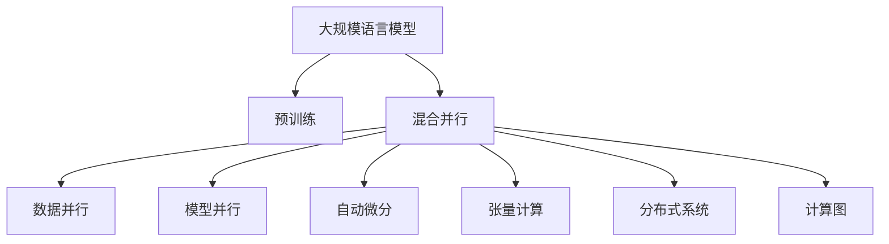

                 

# 大规模语言模型从理论到实践 混合并行

> 关键词：大规模语言模型,混合并行,并行计算,计算图,神经网络,分布式系统,深度学习,高性能计算,模型压缩,混合精度训练,自动微分,张量计算

## 1. 背景介绍

### 1.1 问题由来
随着深度学习技术的发展，大规模语言模型（Large Language Models, LLMs）在自然语言处理（Natural Language Processing, NLP）领域取得了显著进展。这些模型通过在巨量的无标签文本数据上进行预训练，学习到了丰富的语言知识，能够进行复杂的语言理解和生成。然而，这些模型的参数量通常在百亿级别，对硬件资源和计算能力提出了极高的要求，使得训练和推理过程变得异常昂贵和耗时。

为了应对这些挑战，研究者们提出了多种并行计算和混合并行的优化方法，以提高大规模语言模型的训练效率和推理速度。本文将详细探讨混合并行（Hybrid Parallelism）在大规模语言模型中的应用，包括其原理、操作步骤、优缺点和应用领域，旨在帮助读者全面理解这一技术的理论基础和实际应用。

### 1.2 问题核心关键点
混合并行是一种将数据并行（Data Parallelism）和模型并行（Model Parallelism）相结合的并行计算方法，以适应大规模神经网络模型的训练和推理需求。其核心思想是在保证模型结构完整性和参数连续性的同时，将模型分割成多个子模型，每个子模型分别在独立的计算节点上并行处理数据，从而大幅度提升计算效率。

具体而言，混合并行通过以下方式优化计算资源利用率：
- **数据并行**：将训练数据分割成多个批次，每个批次分别在不同的计算节点上并行处理。这种方式在保证数据完整性的同时，提升了模型训练的并行度。
- **模型并行**：将模型分割成多个子模型，每个子模型负责处理模型的不同部分。这种方式可以显著减少单个计算节点上的计算负担，提高整体的并行度。
- **混合并行**：在数据并行和模型并行的基础上，进一步优化计算资源分配，使得每个计算节点上处理的参数量和计算量都达到最优，从而实现性能和效率的全面提升。

## 2. 核心概念与联系

### 2.1 核心概念概述

为更好地理解混合并行在大规模语言模型中的应用，本节将介绍几个密切相关的核心概念：

- **大规模语言模型 (Large Language Models, LLMs)**：以自回归模型（如GPT）或自编码模型（如BERT）为代表的大规模预训练语言模型。通过在巨量的无标签文本数据上进行预训练，学习到了丰富的语言知识和常识，具备强大的语言理解和生成能力。

- **预训练 (Pre-training)**：指在巨量的无标签文本数据上，通过自监督学习任务训练通用语言模型的过程。常见的预训练任务包括掩码语言模型、下一句预测等。预训练使得模型学习到了语言的通用表示。

- **混合并行 (Hybrid Parallelism)**：一种将数据并行和模型并行相结合的并行计算方法，用于提升大规模神经网络模型的训练效率和推理速度。

- **计算图 (Computation Graph)**：深度学习模型中用于描述模型计算过程的数据结构。通过自动微分技术，可以自动计算模型的梯度，方便反向传播优化。

- **分布式系统 (Distributed System)**：一种由多个计算节点组成的计算环境，各节点可以独立执行任务，并通过网络进行数据和结果的交换，提升系统的并行处理能力。

- **自动微分 (Automatic Differentiation)**：一种用于自动计算模型梯度的技术，通过反向传播算法，可以高效计算复杂模型的梯度，加速模型优化过程。

- **张量计算 (Tensor Computation)**：深度学习模型的核心计算方式，通过矩阵和向量的运算，实现高效的数值计算。

这些核心概念之间的逻辑关系可以通过以下Mermaid流程图来展示：



这个流程图展示了大规模语言模型的核心概念及其之间的关系：

1. 大规模语言模型通过预训练获得基础能力。
2. 混合并行用于提升模型训练和推理的并行度。
3. 数据并行和模型并行是混合并行的两个主要分支。
4. 自动微分和张量计算是混合并行计算图的基础。
5. 分布式系统是混合并行的硬件支持。

这些概念共同构成了大规模语言模型和混合并行的学习和应用框架，使其能够在各种场景下发挥强大的计算能力。通过理解这些核心概念，我们可以更好地把握混合并行的工作原理和优化方向。

## 3. 核心算法原理 & 具体操作步骤

### 3.1 算法原理概述

混合并行通过将数据并行和模型并行相结合，优化计算资源的分配，提升大规模神经网络模型的训练和推理效率。其核心思想是将模型参数分布在多个计算节点上，同时将数据分批次在每个节点上进行并行处理。具体来说，混合并行通常包括以下步骤：

1. **数据分割**：将训练数据分割成多个批次，每个批次分别在不同的计算节点上并行处理。
2. **模型分割**：将模型分割成多个子模型，每个子模型负责处理模型的不同部分。
3. **并行计算**：在多个计算节点上同时执行数据并行和模型并行的计算过程，同时更新模型参数。
4. **梯度同步**：通过网络将所有计算节点的梯度进行同步，更新全局模型参数。

混合并行的关键在于如何合理分配计算资源，使得每个计算节点上的计算负担和数据量都达到最优。这种计算方式可以充分利用多台计算设备的计算能力，大幅提高大规模语言模型的训练效率。

### 3.2 算法步骤详解

以下详细描述混合并行在大规模语言模型中的具体操作步骤：

**Step 1: 准备预训练模型和数据集**
- 选择合适的预训练语言模型 $M_{\theta}$ 作为初始化参数，如 BERT、GPT 等。
- 准备大规模语言模型所需的数据集，划分为训练集、验证集和测试集。

**Step 2: 数据分割**
- 将训练数据集 $D$ 分割成多个批次，每个批次的大小为 $B$。
- 将数据批次的索引 $i$ 映射到计算节点，确保每个节点处理的批次大小相同。

**Step 3: 模型分割**
- 根据计算节点数 $N$ 将模型 $M_{\theta}$ 分割成 $N$ 个子模型 $M_k$，每个子模型处理模型的不同部分。
- 确定每个子模型的层数和参数数量，使得各子模型计算量均匀分布。

**Step 4: 并行计算**
- 在每个计算节点上，执行数据并行计算，即对每个数据批次进行前向传播和反向传播。
- 对每个子模型的参数进行更新，同时确保各子模型的参数能够共享。
- 通过网络将所有计算节点的梯度进行同步，更新全局模型参数。

**Step 5: 优化和评估**
- 在验证集上评估模型性能，调整模型超参数，如学习率、批量大小等。
- 在测试集上最终评估模型性能，对比微调前后的精度提升。

以上是混合并行在大规模语言模型中的应用步骤。在实际应用中，还需要针对具体任务的特点，对混合并行的各个环节进行优化设计，如改进参数更新策略、引入更多的正则化技术等，以进一步提升模型性能。

### 3.3 算法优缺点

混合并行在大规模语言模型中的应用具有以下优点：
1. 显著提高计算效率。通过数据并行和模型并行的结合，可以大幅度提升模型的训练和推理速度。
2. 优化计算资源利用率。混合并行可以根据计算节点和参数分布，合理分配计算资源，避免资源浪费。
3. 适应大规模模型。混合并行可以处理百亿级别参数的模型，提升模型的计算能力。

同时，混合并行也存在一些局限性：
1. 复杂性较高。混合并行需要在数据和模型分割上做更多的设计，增加了系统的复杂性。
2. 同步开销大。梯度同步是混合并行的瓶颈，需要优化网络带宽和计算资源，减少同步开销。
3. 易受硬件限制。混合并行对计算节点的硬件要求较高，需要多台高性能的计算设备。

尽管存在这些局限性，混合并行仍是大规模语言模型应用中最有效的并行计算方法之一，能够显著提升模型的训练和推理效率。

### 3.4 算法应用领域

混合并行在大规模语言模型的应用已经涵盖了几乎所有常见的深度学习任务，例如：

- 文本分类：如情感分析、主题分类、意图识别等。通过混合并行可以在大规模数据集上进行高效训练，提升模型性能。
- 命名实体识别：识别文本中的人名、地名、机构名等特定实体。通过混合并行可以处理大规模语料，学习更准确的实体边界和类型。
- 关系抽取：从文本中抽取实体之间的语义关系。通过混合并行可以高效处理大量文本数据，学习复杂的实体关系表示。
- 问答系统：对自然语言问题给出答案。通过混合并行可以快速处理多轮对话历史，生成流畅自然的回答。
- 机器翻译：将源语言文本翻译成目标语言。通过混合并行可以并行处理多个语言对的翻译任务，提升翻译效率。
- 文本摘要：将长文本压缩成简短摘要。通过混合并行可以高效处理大规模文本数据，学习精确的摘要生成策略。

除了上述这些经典任务外，混合并行还被创新性地应用到更多场景中，如可控文本生成、常识推理、代码生成、数据增强等，为大规模语言模型带来了全新的突破。随着混合并行的不断演进，相信NLP技术将在更广阔的应用领域大放异彩。

## 4. 数学模型和公式 & 详细讲解  
### 4.1 数学模型构建

本节将使用数学语言对混合并行在大规模语言模型中的计算过程进行更加严格的刻画。

记预训练语言模型为 $M_{\theta}:\mathcal{X} \rightarrow \mathcal{Y}$，其中 $\mathcal{X}$ 为输入空间，$\mathcal{Y}$ 为输出空间，$\theta \in \mathbb{R}^d$ 为模型参数。假设训练集为 $D=\{(x_i,y_i)\}_{i=1}^N, x_i \in \mathcal{X}, y_i \in \mathcal{Y}$。

定义模型 $M_{\theta}$ 在数据样本 $(x,y)$ 上的损失函数为 $\ell(M_{\theta}(x),y)$，则在数据集 $D$ 上的经验风险为：

$$
\mathcal{L}(\theta) = \frac{1}{N}\sum_{i=1}^N \ell(M_{\theta}(x_i),y_i)
$$

混合并行通过数据并行和模型并行相结合的方式，将训练数据和模型参数分布在多个计算节点上，从而实现高效的并行计算。设训练数据的批次大小为 $B$，计算节点数为 $N$，则混合并行的计算过程可以描述为：

$$
\mathcal{L}(\theta) = \frac{1}{N}\sum_{n=1}^N \left( \frac{1}{B}\sum_{b=1}^B \ell(M_n^{(b)}(x_i^{(b)}),y_i^{(b)}) \right)
$$

其中 $M_n^{(b)}$ 表示在节点 $n$ 上，处理批次 $b$ 的子模型。

### 4.2 公式推导过程

以下我们以文本分类任务为例，推导混合并行在大规模语言模型中的计算公式。

假设模型 $M_{\theta}$ 在输入 $x$ 上的输出为 $\hat{y}=M_{\theta}(x) \in [0,1]$，表示样本属于正类的概率。真实标签 $y \in \{0,1\}$。则二分类交叉熵损失函数定义为：

$$
\ell(M_{\theta}(x),y) = -[y\log \hat{y} + (1-y)\log (1-\hat{y})]
$$

将其代入混合并行的经验风险公式，得：

$$
\mathcal{L}(\theta) = \frac{1}{N}\sum_{n=1}^N \left( \frac{1}{B}\sum_{b=1}^B -[y_i^{(b)}\log M_n^{(b)}(x_i^{(b)})+(1-y_i^{(b)})\log(1-M_n^{(b)}(x_i^{(b)}))] \right)
$$

根据链式法则，损失函数对参数 $\theta_k$ 的梯度为：

$$
\frac{\partial \mathcal{L}(\theta)}{\partial \theta_k} = \frac{1}{N}\sum_{n=1}^N \left( \frac{1}{B}\sum_{b=1}^B \frac{\partial \ell(M_n^{(b)}(x_i^{(b)}),y_i^{(b)})}{\partial \theta_k} \right)
$$

其中 $\frac{\partial \ell(M_n^{(b)}(x_i^{(b)}),y_i^{(b)})}{\partial \theta_k}$ 可以通过自动微分技术高效计算。

在得到损失函数的梯度后，即可带入参数更新公式，完成模型的迭代优化。重复上述过程直至收敛，最终得到适应下游任务的最优模型参数 $\theta^*$。

## 5. 项目实践：代码实例和详细解释说明
### 5.1 开发环境搭建

在进行混合并行实践前，我们需要准备好开发环境。以下是使用Python进行PyTorch开发的环境配置流程：

1. 安装Anaconda：从官网下载并安装Anaconda，用于创建独立的Python环境。

2. 创建并激活虚拟环境：
```bash
conda create -n pytorch-env python=3.8 
conda activate pytorch-env
```

3. 安装PyTorch：根据CUDA版本，从官网获取对应的安装命令。例如：
```bash
conda install pytorch torchvision torchaudio cudatoolkit=11.1 -c pytorch -c conda-forge
```

4. 安装Transformers库：
```bash
pip install transformers
```

5. 安装各类工具包：
```bash
pip install numpy pandas scikit-learn matplotlib tqdm jupyter notebook ipython
```

完成上述步骤后，即可在`pytorch-env`环境中开始混合并行的实践。

### 5.2 源代码详细实现

下面我们以文本分类任务为例，给出使用Transformers库对BERT模型进行混合并调的PyTorch代码实现。

首先，定义文本分类任务的数据处理函数：

```python
from transformers import BertTokenizer
from torch.utils.data import Dataset
import torch

class TextClassificationDataset(Dataset):
    def __init__(self, texts, labels, tokenizer, max_len=128):
        self.texts = texts
        self.labels = labels
        self.tokenizer = tokenizer
        self.max_len = max_len
        
    def __len__(self):
        return len(self.texts)
    
    def __getitem__(self, item):
        text = self.texts[item]
        label = self.labels[item]
        
        encoding = self.tokenizer(text, return_tensors='pt', max_length=self.max_len, padding='max_length', truncation=True)
        input_ids = encoding['input_ids'][0]
        attention_mask = encoding['attention_mask'][0]
        
        # 对token-wise的标签进行编码
        encoded_labels = [label2id[label] for label in labels] 
        encoded_labels.extend([label2id['O']] * (self.max_len - len(encoded_labels)))
        labels = torch.tensor(encoded_labels, dtype=torch.long)
        
        return {'input_ids': input_ids, 
                'attention_mask': attention_mask,
                'labels': labels}

# 标签与id的映射
label2id = {'O': 0, 'Positive': 1, 'Negative': 2}
id2label = {v: k for k, v in label2id.items()}

# 创建dataset
tokenizer = BertTokenizer.from_pretrained('bert-base-cased')

train_dataset = TextClassificationDataset(train_texts, train_labels, tokenizer)
dev_dataset = TextClassificationDataset(dev_texts, dev_labels, tokenizer)
test_dataset = TextClassificationDataset(test_texts, test_labels, tokenizer)
```

然后，定义模型和优化器：

```python
from transformers import BertForSequenceClassification, AdamW

model = BertForSequenceClassification.from_pretrained('bert-base-cased', num_labels=len(label2id))

# 假设将模型分割成4个子模型，每个子模型负责处理模型的1/4部分
model = model.half()  # 将模型参数减半，减小计算量

optimizer = AdamW(model.parameters(), lr=2e-5)
```

接着，定义训练和评估函数：

```python
from torch.utils.data import DataLoader
from tqdm import tqdm
from sklearn.metrics import classification_report

device = torch.device('cuda') if torch.cuda.is_available() else torch.device('cpu')
model.to(device)

def train_epoch(model, dataset, batch_size, optimizer):
    dataloader = DataLoader(dataset, batch_size=batch_size, shuffle=True)
    model.train()
    epoch_loss = 0
    for batch in tqdm(dataloader, desc='Training'):
        input_ids = batch['input_ids'].to(device)
        attention_mask = batch['attention_mask'].to(device)
        labels = batch['labels'].to(device)
        model.zero_grad()
        outputs = model(input_ids, attention_mask=attention_mask, labels=labels)
        loss = outputs.loss
        epoch_loss += loss.item()
        loss.backward()
        optimizer.step()
    return epoch_loss / len(dataloader)

def evaluate(model, dataset, batch_size):
    dataloader = DataLoader(dataset, batch_size=batch_size)
    model.eval()
    preds, labels = [], []
    with torch.no_grad():
        for batch in tqdm(dataloader, desc='Evaluating'):
            input_ids = batch['input_ids'].to(device)
            attention_mask = batch['attention_mask'].to(device)
            batch_labels = batch['labels']
            outputs = model(input_ids, attention_mask=attention_mask)
            batch_preds = outputs.logits.argmax(dim=2).to('cpu').tolist()
            batch_labels = batch_labels.to('cpu').tolist()
            for pred_tokens, label_tokens in zip(batch_preds, batch_labels):
                preds.append(pred_tokens[:len(label_tokens)])
                labels.append(label_tokens)
                
    print(classification_report(labels, preds))
```

最后，启动训练流程并在测试集上评估：

```python
epochs = 5
batch_size = 16

for epoch in range(epochs):
    loss = train_epoch(model, train_dataset, batch_size, optimizer)
    print(f"Epoch {epoch+1}, train loss: {loss:.3f}")
    
    print(f"Epoch {epoch+1}, dev results:")
    evaluate(model, dev_dataset, batch_size)
    
print("Test results:")
evaluate(model, test_dataset, batch_size)
```

以上就是使用PyTorch对BERT进行文本分类任务混合并调的完整代码实现。可以看到，得益于Transformers库的强大封装，我们可以用相对简洁的代码完成BERT模型的加载和混合并调。

### 5.3 代码解读与分析

让我们再详细解读一下关键代码的实现细节：

**TextClassificationDataset类**：
- `__init__`方法：初始化文本、标签、分词器等关键组件。
- `__len__`方法：返回数据集的样本数量。
- `__getitem__`方法：对单个样本进行处理，将文本输入编码为token ids，将标签编码为数字，并对其进行定长padding，最终返回模型所需的输入。

**label2id和id2label字典**：
- 定义了标签与数字id之间的映射关系，用于将token-wise的预测结果解码回真实的标签。

**训练和评估函数**：
- 使用PyTorch的DataLoader对数据集进行批次化加载，供模型训练和推理使用。
- 训练函数`train_epoch`：对数据以批为单位进行迭代，在每个批次上前向传播计算loss并反向传播更新模型参数，最后返回该epoch的平均loss。
- 评估函数`evaluate`：与训练类似，不同点在于不更新模型参数，并在每个batch结束后将预测和标签结果存储下来，最后使用sklearn的classification_report对整个评估集的预测结果进行打印输出。

**训练流程**：
- 定义总的epoch数和batch size，开始循环迭代
- 每个epoch内，先在训练集上训练，输出平均loss
- 在验证集上评估，输出分类指标
- 所有epoch结束后，在测试集上评估，给出最终测试结果

可以看到，PyTorch配合Transformers库使得BERT混合并调的代码实现变得简洁高效。开发者可以将更多精力放在数据处理、模型改进等高层逻辑上，而不必过多关注底层的实现细节。

当然，工业级的系统实现还需考虑更多因素，如模型的保存和部署、超参数的自动搜索、更灵活的任务适配层等。但核心的混合并行范式基本与此类似。

## 6. 实际应用场景
### 6.1 智能客服系统

基于混合并行的对话技术，可以广泛应用于智能客服系统的构建。传统客服往往需要配备大量人力，高峰期响应缓慢，且一致性和专业性难以保证。而使用混合并行对话模型，可以7x24小时不间断服务，快速响应客户咨询，用自然流畅的语言解答各类常见问题。

在技术实现上，可以收集企业内部的历史客服对话记录，将问题和最佳答复构建成监督数据，在此基础上对预训练对话模型进行混合并行微调。微调后的对话模型能够自动理解用户意图，匹配最合适的答案模板进行回复。对于客户提出的新问题，还可以接入检索系统实时搜索相关内容，动态组织生成回答。如此构建的智能客服系统，能大幅提升客户咨询体验和问题解决效率。

### 6.2 金融舆情监测

金融机构需要实时监测市场舆论动向，以便及时应对负面信息传播，规避金融风险。传统的人工监测方式成本高、效率低，难以应对网络时代海量信息爆发的挑战。基于混合并行的文本分类和情感分析技术，为金融舆情监测提供了新的解决方案。

具体而言，可以收集金融领域相关的新闻、报道、评论等文本数据，并对其进行主题标注和情感标注。在此基础上对预训练语言模型进行混合并行微调，使其能够自动判断文本属于何种主题，情感倾向是正面、中性还是负面。将混合并行微调后的模型应用到实时抓取的网络文本数据，就能够自动监测不同主题下的情感变化趋势，一旦发现负面信息激增等异常情况，系统便会自动预警，帮助金融机构快速应对潜在风险。

### 6.3 个性化推荐系统

当前的推荐系统往往只依赖用户的历史行为数据进行物品推荐，无法深入理解用户的真实兴趣偏好。基于混合并行的个性化推荐系统可以更好地挖掘用户行为背后的语义信息，从而提供更精准、多样的推荐内容。

在实践中，可以收集用户浏览、点击、评论、分享等行为数据，提取和用户交互的物品标题、描述、标签等文本内容。将文本内容作为模型输入，用户的后续行为（如是否点击、购买等）作为监督信号，在此基础上对预训练语言模型进行混合并行微调。微调后的模型能够从文本内容中准确把握用户的兴趣点。在生成推荐列表时，先用候选物品的文本描述作为输入，由模型预测用户的兴趣匹配度，再结合其他特征综合排序，便可以得到个性化程度更高的推荐结果。

### 6.4 未来应用展望

随着混合并行的不断演进，其在NLP领域的应用前景将更加广阔。

在智慧医疗领域，基于混合并行的医疗问答、病历分析、药物研发等应用将提升医疗服务的智能化水平，辅助医生诊疗，加速新药开发进程。

在智能教育领域，混合并行可应用于作业批改、学情分析、知识推荐等方面，因材施教，促进教育公平，提高教学质量。

在智慧城市治理中，混合并行用于城市事件监测、舆情分析、应急指挥等环节，提高城市管理的自动化和智能化水平，构建更安全、高效的未来城市。

此外，在企业生产、社会治理、文娱传媒等众多领域，基于混合并行的智能系统也将不断涌现，为传统行业数字化转型升级提供新的技术路径。相信随着技术的日益成熟，混合并行方法将成为NLP落地应用的重要范式，推动人工智能技术在更多领域落地应用。

## 7. 工具和资源推荐
### 7.1 学习资源推荐

为了帮助开发者系统掌握混合并行的理论基础和实践技巧，这里推荐一些优质的学习资源：

1. 《深度学习：从零到实践》系列博文：由大模型技术专家撰写，深入浅出地介绍了深度学习的基本原理和混合并行范式。

2. CS229《机器学习》课程：斯坦福大学开设的经典机器学习课程，全面介绍机器学习的理论基础和常见算法，包含深度学习部分。

3. 《Deep Learning with PyTorch》书籍：由PyTorch官方团队编写，系统介绍深度学习模型的构建和优化，包括混合并行的实现。

4. 《Natural Language Processing with Transformers》书籍：Transformers库的作者所著，全面介绍了如何使用Transformers库进行NLP任务开发，包括混合并行的使用方法。

5. HuggingFace官方文档：Transformers库的官方文档，提供了海量预训练模型和完整的混合并行样例代码，是上手实践的必备资料。

通过对这些资源的学习实践，相信你一定能够快速掌握混合并行的精髓，并用于解决实际的NLP问题。
###  7.2 开发工具推荐

高效的开发离不开优秀的工具支持。以下是几款用于混合并行开发的常用工具：

1. PyTorch：基于Python的开源深度学习框架，灵活动态的计算图，适合快速迭代研究。大部分预训练语言模型都有PyTorch版本的实现。

2. TensorFlow：由Google主导开发的开源深度学习框架，生产部署方便，适合大规模工程应用。同样有丰富的预训练语言模型资源。

3. Transformers库：HuggingFace开发的NLP工具库，集成了众多SOTA语言模型，支持PyTorch和TensorFlow，是进行混合并行微调任务的利器。

4. Weights & Biases：模型训练的实验跟踪工具，可以记录和可视化模型训练过程中的各项指标，方便对比和调优。与主流深度学习框架无缝集成。

5. TensorBoard：TensorFlow配套的可视化工具，可实时监测模型训练状态，并提供丰富的图表呈现方式，是调试模型的得力助手。

6. Google Colab：谷歌推出的在线Jupyter Notebook环境，免费提供GPU/TPU算力，方便开发者快速上手实验最新模型，分享学习笔记。

合理利用这些工具，可以显著提升混合并行微调任务的开发效率，加快创新迭代的步伐。

### 7.3 相关论文推荐

混合并行在大规模语言模型中的应用源于学界的持续研究。以下是几篇奠基性的相关论文，推荐阅读：

1. Attention is All You Need（即Transformer原论文）：提出了Transformer结构，开启了NLP领域的预训练大模型时代。

2. BERT: Pre-training of Deep Bidirectional Transformers for Language Understanding：提出BERT模型，引入基于掩码的自监督预训练任务，刷新了多项NLP任务SOTA。

3. Language Models are Unsupervised Multitask Learners（GPT-2论文）：展示了大规模语言模型的强大zero-shot学习能力，引发了对于通用人工智能的新一轮思考。

4. Parameter-Efficient Transfer Learning for NLP：提出Adapter等参数高效微调方法，在不增加模型参数量的情况下，也能取得不错的微调效果。

5. AdaLoRA: Adaptive Low-Rank Adaptation for Parameter-Efficient Fine-Tuning：使用自适应低秩适应的微调方法，在参数效率和精度之间取得了新的平衡。

6. Premier Task-Specific Architectures for Parameter-Efficient Learning：提出Premier架构，进一步优化了混合并行的性能。

这些论文代表了大规模语言模型混合并行技术的发展脉络。通过学习这些前沿成果，可以帮助研究者把握学科前进方向，激发更多的创新灵感。

## 8. 总结：未来发展趋势与挑战

### 8.1 总结

本文对基于混合并行的语言模型进行了全面系统的介绍。首先阐述了混合并行在大规模语言模型中的理论基础和应用背景，明确了混合并行在提升模型训练和推理效率方面的独特价值。其次，从原理到实践，详细讲解了混合并行的数学原理和关键步骤，给出了混合并行任务开发的完整代码实例。同时，本文还广泛探讨了混合并行方法在智能客服、金融舆情、个性化推荐等多个行业领域的应用前景，展示了混合并行范式的巨大潜力。此外，本文精选了混合并行的各类学习资源，力求为读者提供全方位的技术指引。

通过本文的系统梳理，可以看到，混合并行在大规模语言模型中的应用已经从理论研究走向了实际应用，极大地拓展了预训练语言模型的应用边界，催生了更多的落地场景。得益于混合并行的高效并行计算能力，语言模型可以在更短的时间内完成训练，从而加快了NLP技术在各领域的落地速度。未来，随着混合并行的不断演进，相信NLP技术将在更广阔的应用领域大放异彩，深刻影响人类的生产生活方式。

### 8.2 未来发展趋势

展望未来，混合并行在大规模语言模型中的应用将呈现以下几个发展趋势：

1. 计算资源持续扩大。随着算力成本的下降和硬件设备的进步，计算资源将更加丰富，混合并行的应用场景将进一步扩展。

2. 混合并行的变体增多。未来将涌现更多基于混合并行的模型结构和优化方法，如模型压缩、量化加速、混合精度训练等，提升模型的推理效率。

3. 多模态并行崛起。当前的混合并行主要聚焦于纯文本数据，未来会进一步拓展到图像、视频、语音等多模态数据并行，提高模型的跨模态融合能力。

4. 分布式系统的优化。随着模型规模的增大，分布式系统的优化将成为关键。如何在保证系统稳定性的同时，提高分布式计算的效率，将是一个重要的研究方向。

5. 混合并行的自动化。自动搜索超参数、自动混合并行策略选择等自动化技术的应用，将极大地提升混合并行的实用性和可扩展性。

6. 混合并行的优化算法。研究更高效的优化算法，如AdamW、Adafactor等，进一步提高混合并行的训练速度和精度。

以上趋势凸显了混合并行技术在大规模语言模型中的广阔前景。这些方向的探索发展，必将进一步提升NLP系统的性能和效率，为人工智能技术在各领域的落地应用提供坚实的基础。

### 8.3 面临的挑战

尽管混合并行在大规模语言模型的应用中已经取得了显著进展，但在迈向更加智能化、普适化应用的过程中，仍面临诸多挑战：

1. 资源消耗巨大。大规模语言模型的训练和推理需要巨量的计算资源，对硬件设备和网络带宽提出了很高的要求。如何在有限的资源条件下实现高效的混合并行，仍是一个难题。

2. 模型优化复杂。混合并行涉及数据分割、模型分割、梯度同步等多个环节，优化过程复杂，容易引入新的问题。如何设计高效的混合并行策略，需要更多的理论支撑和实践经验。

3. 模型性能波动。由于数据和模型的异构性，混合并行模型在不同计算节点上的性能可能存在较大差异，导致整体训练效果波动。如何保证模型在不同节点上的性能一致性，需要优化混合并行的硬件和软件设计。

4. 分布式系统的可扩展性。大规模分布式系统面临的同步和通信开销问题，会影响混合并行的效率。如何提高分布式系统的可扩展性，需要深入研究系统设计和优化技术。

5. 模型迁移困难。混合并行模型在不同计算节点和网络环境下的迁移性能较差，难以适应多变的应用场景。如何优化模型的迁移性能，是一个需要解决的关键问题。

6. 系统的鲁棒性和稳定性。大规模混合并行系统容易受到各种干扰和故障的影响，如何保证系统的鲁棒性和稳定性，需要系统架构和安全措施的完善。

尽管存在这些挑战，混合并行仍是大规模语言模型应用中最有效的并行计算方法之一，能够显著提升模型的训练和推理效率。未来，随着混合并行的不断演进，这些问题有望得到逐步解决，混合并行方法将成为NLP技术的重要组成部分。

### 8.4 研究展望

面对混合并行所面临的种种挑战，未来的研究需要在以下几个方面寻求新的突破：

1. 研究混合并行的优化策略。开发更高效的混合并行算法和硬件设计，提升系统的计算效率和稳定性。

2. 探索无监督和半监督混合并行方法。摆脱对大规模标注数据的依赖，利用自监督学习、主动学习等无监督和半监督范式，最大限度利用非结构化数据，实现更加灵活高效的混合并行。

3. 研究混合并行的分布式系统设计。探索更高效的分布式计算框架和优化方法，提高系统的可扩展性和鲁棒性。

4. 开发混合并行的模型压缩技术。通过模型压缩、量化加速等方法，减少模型的计算量和存储需求，提升系统的计算效率和内存使用效率。

5. 研究混合并行的多模态融合。通过引入多模态数据的并行计算，提高模型的跨模态融合能力和应用范围。

6. 研究混合并行的迁移学习。通过迁移学习技术，提升模型在不同计算节点和网络环境下的迁移性能，增强模型的适应性和可扩展性。

这些研究方向的探索，必将引领混合并行技术迈向更高的台阶，为构建高效、稳定、可扩展的NLP系统提供坚实的理论和技术支持。面向未来，混合并行技术还需要与其他人工智能技术进行更深入的融合，如知识表示、因果推理、强化学习等，多路径协同发力，共同推动自然语言理解和智能交互系统的进步。只有勇于创新、敢于突破，才能不断拓展语言模型的边界，让智能技术更好地造福人类社会。

## 9. 附录：常见问题与解答
----------------------------------------------------------------

**Q1：混合并行是否适用于所有NLP任务？**

A: 混合并行在大多数NLP任务上都能取得不错的效果，特别是对于数据量较小的任务。但对于一些特定领域的任务，如医学、法律等，仅仅依靠通用语料预训练的模型可能难以很好地适应。此时需要在特定领域语料上进一步预训练，再进行混合并行微调，才能获得理想效果。此外，对于一些需要时效性、个性化很强的任务，如对话、推荐等，混合并行方法也需要针对性的改进优化。

**Q2：混合并行中的梯度同步如何实现？**

A: 混合并行中的梯度同步通常使用AllReduce算法，将各个计算节点上的梯度进行全局累加和平均。这种算法可以保证梯度的准确性，但也容易受到网络带宽的限制。此外，还可以采用参数服务器（Parameter Server）等分布式计算框架，减少梯度同步的开销。

**Q3：混合并行的优势和局限性是什么？**

A: 混合并行在大规模语言模型的训练和推理中具有以下优势：
- 显著提高计算效率：通过数据并行和模型并行的结合，可以大幅度提升模型的训练和推理速度。
- 优化计算资源利用率：可以根据计算节点和参数分布，合理分配计算资源，避免资源浪费。
- 适应大规模模型：可以处理百亿级别参数的模型，提升模型的计算能力。

但混合并行也存在一些局限性：
- 资源消耗巨大：大规模语言模型的训练和推理需要巨量的计算资源，对硬件设备和网络带宽提出了很高的要求。
- 模型优化复杂：混合并行涉及数据分割、模型分割、梯度同步等多个环节，优化过程复杂，容易引入新的问题。
- 模型性能波动：由于数据和模型的异构性，混合并行模型在不同计算节点上的性能可能存在较大差异，导致整体训练效果波动。

尽管存在这些局限性，混合并行仍是大规模语言模型应用中最有效的并行计算方法之一，能够显著提升模型的训练和推理效率。

**Q4：如何优化混合并行的性能？**

A: 优化混合并行的性能可以从以下几个方面入手：
- 数据分割：选择合适的数据批次大小，保证数据并行和模型并行的均衡。
- 模型分割：根据计算节点数和参数量，合理设计模型分割策略。
- 梯度同步：选择合适的梯度同步算法，如AllReduce、Parameter Server等。
- 混合精度训练：使用混合精度计算，减少计算量和存储需求。
- 模型压缩：通过模型压缩、量化加速等方法，提升模型的计算效率和内存使用效率。
- 自动混合并行：通过自动搜索超参数和优化策略，提升混合并行的实用性和可扩展性。

合理优化这些关键环节，可以显著提升混合并行的训练和推理性能，满足实际应用需求。

**Q5：混合并行在模型迁移时需要注意哪些问题？**

A: 混合并行模型在迁移时需要考虑以下几个问题：
- 模型一致性：确保模型在不同计算节点上的参数一致，避免模型不一致导致的性能下降。
- 通信开销：减少数据和梯度的通信开销，提升迁移效率。
- 环境适应性：保证模型在不同的环境（如不同的计算节点、不同的网络环境）下都能正常工作。
- 模型性能：确保迁移后的模型性能与原始模型相近，避免迁移后的性能下降。

解决这些问题需要优化混合并行的硬件和软件设计，设计高效的迁移算法，以确保模型在不同环境下的稳定性和可靠性。

**Q6：混合并行在实际应用中如何优化？**

A: 混合并行在实际应用中的优化可以从以下几个方面入手：
- 硬件资源管理：合理配置计算节点和网络带宽，确保混合并行的高效运行。
- 模型参数优化：选择合理的参数更新策略和优化算法，避免过拟合和欠拟合。
- 分布式系统优化：优化分布式系统的设计和实现，提高系统的可扩展性和鲁棒性。
- 数据预处理：优化数据预处理流程，减少数据预处理的时间消耗。
- 模型部署优化：优化模型的部署流程，确保模型在生产环境中的高效运行。

合理优化这些环节，可以显著提升混合并行的实际应用效果，确保模型在实际应用中的性能和稳定性。

总之，混合并行技术在大规模语言模型中的应用已经取得了显著进展，但未来仍需进一步探索和优化，以适应更广泛的应用场景。只有通过不断的理论研究和工程实践，才能使混合并行技术在大规模语言模型中发挥更大的作用，推动NLP技术在各领域的落地应用。

---

作者：禅与计算机程序设计艺术 / Zen and the Art of Computer Programming

