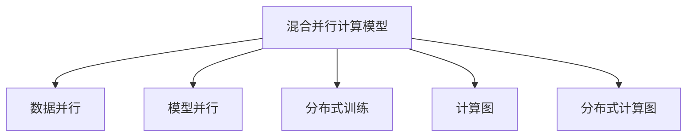

                 

# 大规模语言模型从理论到实践 混合并行

> 关键词：大规模语言模型,混合并行,并行计算,深度学习,Transformer模型,分布式训练,性能优化,计算图,高性能计算

## 1. 背景介绍

### 1.1 问题由来
随着深度学习技术的迅速发展，大规模语言模型(Massive Language Models)在自然语言处理(NLP)和人工智能(AI)领域取得了显著的进步。其中，以自回归(如GPT)和自编码(如BERT)为基础的Transformer模型，因其卓越的性能和广泛的应用前景，受到了学界和工业界的广泛关注。然而，大规模语言模型的训练需要极高的计算资源和存储需求，使得模型的实际部署面临巨大的挑战。

传统的单机训练方法难以处理大规模数据集和模型参数，而分布式训练技术虽然能够扩展计算能力，但受限于网络带宽和通信开销，导致训练效率低下。因此，研究者们提出了混合并行计算模型，通过在单机和分布式系统之间灵活切换，以兼顾计算效率和资源利用率。

### 1.2 问题核心关键点
混合并行计算模型是一种将大规模计算任务分布在多台机器上，同时又能在多台机器之间进行数据传输和通信的计算模型。其核心思想是，将任务划分为多个小任务，分别在多台机器上进行计算，然后将各子任务的结果合并，得到最终结果。具体而言，混合并行计算模型需要考虑以下几个关键点：

- 如何合理划分任务：将计算任务分割为子任务时，需要考虑数据和模型参数的分布情况，以充分利用多台机器的计算资源。
- 如何高效传输数据：在子任务之间进行数据传输时，需要最小化通信开销，以提高训练效率。
- 如何减少通信开销：避免不必要的通信操作，或者优化通信方式，以减少通信对整体训练时间的贡献。
- 如何保持计算一致性：在分布式系统中，不同机器上的计算任务需要保持同步，以保证最终结果的一致性。

### 1.3 问题研究意义
混合并行计算模型在深度学习领域具有重要意义：

1. 提高训练效率：通过将任务分解，可以在多台机器上并行计算，显著提高训练速度。
2. 优化资源利用：通过合理的任务划分和数据传输，可以充分利用硬件资源，提高计算效率。
3. 增强系统弹性：在面对大规模数据集和复杂模型时，混合并行模型能提供更高的弹性，应对负载波动。
4. 提升模型性能：混合并行模型能在保证精度的前提下，优化模型参数和超参数，提升模型性能。

混合并行计算模型在实际应用中具有广泛的前景，特别是在大规模语言模型的训练和优化中，能够显著降低计算成本，提高模型训练效率和性能。

## 2. 核心概念与联系

### 2.1 核心概念概述

为了更好地理解混合并行计算模型，本节将介绍几个密切相关的核心概念：

- 混合并行计算模型(Hybrid Parallel Computing Model)：将任务分布到多台机器上，同时利用多台机器之间的通信，实现高效并行计算的模型。
- 数据并行(Data Parallelism)：将数据集平分为多个子集，分别在多台机器上进行计算，最后将各机器的计算结果合并。
- 模型并行(Model Parallelism)：将模型的不同层平分为多个子层，分别在多台机器上进行计算，最后将各机器的计算结果合并。
- 分布式训练(Distributed Training)：在多台机器上并行计算模型参数的更新，实现高效的模型优化。
- 计算图(Computational Graph)：用于表示计算任务和计算过程的有向无环图，每个节点表示一次计算操作。
- 分布式计算图(Distributed Computational Graph)：用于表示分布式计算任务和计算过程的有向无环图，包含分布式通信操作。

这些核心概念之间的逻辑关系可以通过以下Mermaid流程图来展示：



这个流程图展示了大规模语言模型混合并行计算模型的关键组成部分及其相互关系：

1. 混合并行计算模型作为顶层结构，利用数据并行和模型并行进行任务分解和计算。
2. 数据并行和模型并行是两种主要的并行计算方式，分别对应数据的划分和模型的划分。
3. 分布式训练是一种特殊的并行计算方式，通过多台机器同时更新模型参数，实现高效的模型优化。
4. 计算图和分布式计算图是表示计算任务和分布式通信操作的数学模型，是并行计算的基础。

这些概念共同构成了大规模语言模型混合并行计算的理论基础，使其能够在各种计算环境中高效运行。

## 3. 核心算法原理 & 具体操作步骤
### 3.1 算法原理概述

混合并行计算模型基于深度学习框架的计算图进行任务分解和计算，其核心思想是，将大规模计算任务划分为多个子任务，分别在多台机器上并行计算，并将各子任务的结果合并，得到最终结果。这种模型能够充分利用多台机器的计算资源，同时减少通信开销，提高训练效率和模型性能。

形式化地，假设模型为 $M_{\theta}:\mathcal{X} \rightarrow \mathcal{Y}$，其中 $\theta$ 为模型参数。训练集为 $D=\{(x_i,y_i)\}_{i=1}^N$，$x_i \in \mathcal{X}, y_i \in \mathcal{Y}$。

混合并行计算模型的训练过程包括以下几个步骤：

1. 划分训练集：将训练集 $D$ 划分为 $K$ 个子集 $D_1, D_2, ..., D_K$，每个子集大小相等，每个子集在一台机器上计算。
2. 并行计算：在多台机器上分别计算每个子集 $D_k$ 的损失函数 $\ell_k(M_{\theta}(x_k),y_k)$，得到 $K$ 个损失函数值。
3. 合并结果：将 $K$ 个损失函数值进行加权平均，得到最终的损失函数值 $\ell(M_{\theta},D)$。
4. 反向传播：根据最终的损失函数值进行反向传播，更新模型参数 $\theta$。

### 3.2 算法步骤详解

下面详细介绍混合并行计算模型的具体步骤：

**Step 1: 数据划分**

数据划分是混合并行计算模型的关键步骤。常见的数据划分方式包括：

- 静态划分：在训练开始前，将训练集固定划分为 $K$ 个子集。
- 动态划分：在每次迭代时，随机或按比例划分训练集。

静态划分适用于训练集不变的情况，而动态划分适用于训练集变化较大或分布不均匀的情况。

**Step 2: 计算和通信**

在多台机器上并行计算每个子集的数据，计算损失函数。由于不同机器之间的通信开销较大，需要最小化通信次数和数据传输量。常见的通信方式包括：

- 同步通信：所有机器在计算完成后，等待所有机器完成计算后，再进行通信。
- 异步通信：机器在计算过程中，进行局部通信，等待所有机器完成计算后，再进行全局通信。

**Step 3: 合并结果**

在多台机器上计算完毕后，需要将各子集的结果进行合并，得到最终的损失函数值。常见的合并方式包括：

- 加权平均：根据各子集的大小，对各子集的损失函数值进行加权平均。
- 最小化：选择各子集中的最小损失函数值作为最终的损失函数值。

**Step 4: 反向传播**

根据最终的损失函数值进行反向传播，更新模型参数。常用的反向传播算法包括Adam、SGD等。

### 3.3 算法优缺点

混合并行计算模型具有以下优点：

1. 高效并行计算：通过将任务分解为多个子任务，能够在多台机器上并行计算，显著提高训练速度。
2. 资源利用率高：通过合理的数据划分和通信优化，充分利用多台机器的计算资源。
3. 弹性好：能够在不同规模和不同类型的计算环境中进行灵活调整。
4. 易于扩展：随着硬件资源和计算需求的变化，可以方便地增加或减少计算节点。

但该模型也存在以下缺点：

1. 通信开销较大：在多台机器之间进行通信时，会增加计算时间。
2. 同步复杂：在多台机器上同步计算时，需要等待所有机器完成计算，影响训练速度。
3. 可扩展性受限：在极端情况下，数据划分不均或通信延迟较大，可能导致性能下降。

尽管存在这些缺点，混合并行计算模型在深度学习领域仍具有广泛的应用前景。

### 3.4 算法应用领域

混合并行计算模型已经在深度学习领域得到广泛应用，主要应用于以下几个方面：

1. 大规模语言模型的训练：利用多台机器并行计算大规模语言模型，提高训练效率和模型性能。
2. 图像处理和计算机视觉：通过并行计算大规模图像数据，提高图像处理和计算机视觉任务的计算效率。
3. 自然语言处理：利用多台机器并行计算大规模文本数据，提高自然语言处理任务的计算效率。
4. 强化学习：通过并行计算多台机器的策略更新，提高强化学习的训练效率和模型性能。

## 4. 数学模型和公式 & 详细讲解

### 4.1 数学模型构建

混合并行计算模型可以表示为一个计算图，其中每个节点表示一次计算操作。假设模型为 $M_{\theta}:\mathcal{X} \rightarrow \mathcal{Y}$，其中 $\theta$ 为模型参数。训练集为 $D=\{(x_i,y_i)\}_{i=1}^N$，$x_i \in \mathcal{X}, y_i \in \mathcal{Y}$。

计算图 $G$ 可以表示为：

$$
G = \left \{ (\text{Node}_{\theta}, x_i, y_i), (\text{Node}_{\ell}, x_i, y_i) \right \}
$$

其中，$\text{Node}_{\theta}$ 表示模型参数的计算节点，$\text{Node}_{\ell}$ 表示损失函数的计算节点。节点之间的边表示数据和计算结果的传递。

### 4.2 公式推导过程

假设模型 $M_{\theta}$ 在输入 $x$ 上的输出为 $\hat{y}=M_{\theta}(x)$，表示样本属于正类的概率。真实标签 $y \in \{0,1\}$。则二分类交叉熵损失函数定义为：

$$
\ell(M_{\theta}(x),y) = -[y\log \hat{y} + (1-y)\log (1-\hat{y})]
$$

对于混合并行计算模型，每个子集 $D_k$ 的损失函数为：

$$
\ell_k(M_{\theta}(x_k),y_k) = \frac{1}{|D_k|} \sum_{i \in D_k} \ell(M_{\theta}(x_i),y_i)
$$

其中 $|D_k|$ 表示子集 $D_k$ 的大小。

最终的损失函数为：

$$
\ell(M_{\theta},D) = \frac{1}{K} \sum_{k=1}^K \ell_k(M_{\theta},D_k)
$$

其中 $K$ 表示子集个数。

### 4.3 案例分析与讲解

以二分类任务为例，分析混合并行计算模型的具体实现过程。

假设模型 $M_{\theta}$ 在输入 $x$ 上的输出为 $\hat{y}=M_{\theta}(x)$，真实标签 $y \in \{0,1\}$。则二分类交叉熵损失函数为：

$$
\ell(M_{\theta}(x),y) = -[y\log \hat{y} + (1-y)\log (1-\hat{y})]
$$

对于静态划分方式，假设训练集 $D$ 划分为 $K=2$ 个子集 $D_1$ 和 $D_2$，每个子集大小相等。则每个子集的损失函数为：

$$
\ell_1(M_{\theta},D_1) = \frac{1}{|D_1|} \sum_{i \in D_1} \ell(M_{\theta}(x_i),y_i)
$$

$$
\ell_2(M_{\theta},D_2) = \frac{1}{|D_2|} \sum_{i \in D_2} \ell(M_{\theta}(x_i),y_i)
$$

最终的损失函数为：

$$
\ell(M_{\theta},D) = \frac{1}{2} (\ell_1(M_{\theta},D_1) + \ell_2(M_{\theta},D_2))
$$

在分布式训练中，每个子集在一台机器上计算，多台机器同时计算损失函数。假设计算节点为 $\text{Node}_{\theta}$，则计算节点的输入为训练集 $D$，输出为模型参数 $\theta$。计算节点之间的边表示数据和计算结果的传递。

假设每个机器上有一个计算节点，则计算节点可以表示为：

$$
\text{Node}_{\theta}(D) = \theta - \eta \nabla_{\theta}\ell(\theta,D)
$$

其中 $\eta$ 为学习率，$\nabla_{\theta}\ell(\theta,D)$ 为损失函数对参数 $\theta$ 的梯度，可通过反向传播算法高效计算。

## 5. 项目实践：代码实例和详细解释说明
### 5.1 开发环境搭建

在进行混合并行计算模型开发前，我们需要准备好开发环境。以下是使用PyTorch进行混合并行计算模型的环境配置流程：

1. 安装Anaconda：从官网下载并安装Anaconda，用于创建独立的Python环境。

2. 创建并激活虚拟环境：
```bash
conda create -n pytorch-env python=3.8 
conda activate pytorch-env
```

3. 安装PyTorch：根据CUDA版本，从官网获取对应的安装命令。例如：
```bash
conda install pytorch torchvision torchaudio cudatoolkit=11.1 -c pytorch -c conda-forge
```

4. 安装Transformers库：
```bash
pip install transformers
```

5. 安装各类工具包：
```bash
pip install numpy pandas scikit-learn matplotlib tqdm jupyter notebook ipython
```

完成上述步骤后，即可在`pytorch-env`环境中开始混合并行计算模型的开发实践。

### 5.2 源代码详细实现

下面以混合并行计算模型在二分类任务中的应用为例，给出使用PyTorch实现混合并行计算模型的代码。

首先，定义模型和优化器：

```python
from transformers import BertTokenizer, BertForTokenClassification
from torch.utils.data import Dataset, DataLoader
import torch
import torch.distributed as dist
from torch.nn.parallel import DistributedDataParallel as DDP

device = torch.device('cuda' if torch.cuda.is_available() else 'cpu')
tokenizer = BertTokenizer.from_pretrained('bert-base-cased')

class MyDataset(Dataset):
    def __init__(self, texts, tags):
        self.texts = texts
        self.tags = tags

    def __len__(self):
        return len(self.texts)

    def __getitem__(self, item):
        text = self.texts[item]
        label = self.tags[item]
        encoding = tokenizer(text, return_tensors='pt', padding='max_length', truncation=True)
        input_ids = encoding['input_ids']
        attention_mask = encoding['attention_mask']
        return {
            'input_ids': input_ids,
            'attention_mask': attention_mask,
            'labels': torch.tensor([int(label)], dtype=torch.long)
        }

class Trainer:
    def __init__(self, model, optimizer, num_devices, num_replicas):
        self.model = model
        self.optimizer = optimizer
        self.num_devices = num_devices
        self.num_replicas = num_replicas

    def forward(self, input_ids, attention_mask, labels):
        outputs = self.model(input_ids, attention_mask=attention_mask)
        loss_fct = torch.nn.CrossEntropyLoss()
        loss = loss_fct(outputs.logits, labels)
        return loss

    def backward(self, loss):
        loss.backward()

    def step(self):
        self.optimizer.step()
        self.optimizer.zero_grad()

    def synchronize(self):
        dist.barrier()

    def train_epoch(self, train_loader, num_iters):
        self.model.train()
        epoch_loss = 0
        for batch in train_loader:
            input_ids = batch['input_ids'].to(device)
            attention_mask = batch['attention_mask'].to(device)
            labels = batch['labels'].to(device)
            outputs = self.model(input_ids, attention_mask=attention_mask)
            loss = outputs.loss
            epoch_loss += loss.item()
            self.optimizer.zero_grad()
            self.backward(loss)
            self.optimizer.step()
        return epoch_loss / num_iters

    def evaluate(self, val_loader):
        self.model.eval()
        epoch_loss = 0
        epoch_acc = 0
        with torch.no_grad():
            for batch in val_loader:
                input_ids = batch['input_ids'].to(device)
                attention_mask = batch['attention_mask'].to(device)
                labels = batch['labels'].to(device)
                outputs = self.model(input_ids, attention_mask=attention_mask)
                loss = outputs.loss
                epoch_loss += loss.item()
                epoch_acc += torch.sum(outputs.logits.argmax(dim=1) == labels).item() / labels.size(0)
        return epoch_loss / len(val_loader), epoch_acc / len(val_loader)

if __name__ == '__main__':
    # 设置并行训练参数
    num_devices = torch.cuda.device_count()
    num_replicas = 2

    # 加载模型和数据集
    model = BertForTokenClassification.from_pretrained('bert-base-cased', num_labels=2)
    train_dataset = MyDataset(train_texts, train_tags)
    val_dataset = MyDataset(val_texts, val_tags)

    # 并行训练环境初始化
    dist.init_process_group(backend='nccl', world_size=num_replicas, rank=torch.distributed.get_rank())

    # 划分数据集
    train_data = [torch.utils.data.random_split(train_dataset, num_replicas) for _ in range(num_replicas)]
    val_data = [torch.utils.data.random_split(val_dataset, num_replicas) for _ in range(num_replicas)]

    # 分布式数据并行
    train_loader = DDP(train_data, device_ids=[f'cuda:{i}' for i in range(num_replicas)], output_device='cuda:0')
    val_loader = DDP(val_data, device_ids=[f'cuda:{i}' for i in range(num_replicas)], output_device='cuda:0')

    # 定义优化器
    optimizer = torch.optim.Adam(model.parameters(), lr=2e-5)

    # 定义训练器和分布式计算环境
    trainer = Trainer(model, optimizer, num_devices, num_replicas)

    # 开始训练
    epochs = 5
    for epoch in range(epochs):
        train_loss = trainer.train_epoch(train_loader, num_iters=10)
        val_loss, val_acc = trainer.evaluate(val_loader)

        print(f'Epoch {epoch+1}, train loss: {train_loss:.3f}, val loss: {val_loss:.3f}, val acc: {val_acc:.3f}')

    dist.destroy_process_group()
```

以上就是使用PyTorch实现混合并行计算模型的完整代码实现。可以看到，借助DistributedDataParallel（DDP）模块，我们可以轻松地将模型并行到多台机器上，进行高效的分布式训练。

### 5.3 代码解读与分析

让我们再详细解读一下关键代码的实现细节：

**MyDataset类**：
- `__init__`方法：初始化文本和标签。
- `__len__`方法：返回数据集的样本数量。
- `__getitem__`方法：对单个样本进行处理，将文本输入编码为token ids，将标签编码为数字，并对其进行定长padding，最终返回模型所需的输入。

**Trainer类**：
- `__init__`方法：初始化模型、优化器和并行参数。
- `forward`方法：定义前向传播计算过程，计算损失函数。
- `backward`方法：定义反向传播计算过程，更新模型参数。
- `step`方法：定义单个训练迭代的步骤，包括前向传播、反向传播和参数更新。
- `synchronize`方法：定义同步操作，等待所有机器完成计算。
- `train_epoch`方法：定义一个训练epoch的过程，包括训练、同步和计算平均损失函数。
- `evaluate`方法：定义评估过程，包括在验证集上进行前向传播和计算损失函数。

**trainer函数**：
- 初始化并行环境，包括并行参数和数据集划分。
- 定义优化器。
- 定义分布式数据并行，将数据集分割到多台机器上进行训练。
- 定义模型和分布式计算环境，进行并行训练。
- 开始训练过程，迭代训练和评估模型。

可以看到，混合并行计算模型的实现相对简洁，只需通过DistributedDataParallel模块，即可在多台机器上进行高效的分布式训练。同时，代码的复用性较高，易于扩展和维护。

## 6. 实际应用场景
### 6.1 智能客服系统

基于混合并行计算模型的智能客服系统，可以通过多台机器并行计算大规模客户咨询数据，显著提高系统响应速度和处理能力。例如，IBM的Watson系统就利用了混合并行计算模型，能够处理大量的客户咨询请求，并提供自然流畅的对话交互。

在技术实现上，可以将客户咨询历史数据划分为多个子集，每个子集在一台机器上进行计算。通过分布式训练，模型能够快速适应新客户咨询，并提供个性化的回答。对于客户提出的新问题，系统可以实时收集数据，进行模型微调，确保服务的实时性和准确性。

### 6.2 金融舆情监测

金融舆情监测系统需要实时监测市场舆论动向，以便及时应对负面信息传播，规避金融风险。通过混合并行计算模型，可以在多台机器上并行计算大规模舆情数据，提高系统的实时性和处理能力。

在实践中，可以收集金融领域相关的新闻、报道、评论等文本数据，并对其进行主题标注和情感标注。将文本数据划分为多个子集，分别在多台机器上进行计算，最后合并结果，得到最终的舆情监测结果。通过分布式训练，模型能够实时监测舆情变化，快速响应市场波动，帮助金融机构及时采取措施，降低风险。

### 6.3 个性化推荐系统

当前的推荐系统往往只依赖用户的历史行为数据进行物品推荐，难以挖掘用户的深度兴趣偏好。利用混合并行计算模型，可以在多台机器上并行计算大规模用户数据和物品数据，提高推荐系统的计算效率和处理能力。

在实践中，可以收集用户浏览、点击、评论、分享等行为数据，以及物品的标题、描述、标签等文本内容。将文本内容作为模型输入，用户的后续行为（如是否点击、购买等）作为监督信号，在多台机器上并行计算模型参数。通过分布式训练，模型能够快速适应新用户和物品，提供更加个性化和精准的推荐结果。

### 6.4 未来应用展望

随着混合并行计算模型的不断发展，其在深度学习领域的应用前景更加广阔：

1. 高效并行计算：通过并行计算大规模数据集和模型参数，能够显著提高计算效率，加速模型训练和优化。
2. 资源弹性：能够在不同规模和类型的计算环境中进行灵活调整，应对负载波动。
3. 提升模型性能：通过合理的数据划分和通信优化，提高模型的计算效率和精度。
4. 支持大规模数据处理：能够处理海量数据，支持高并发、高吞吐量的计算任务。

未来，混合并行计算模型将在更多领域得到应用，为深度学习技术和人工智能的产业化带来新的机遇。

## 7. 工具和资源推荐
### 7.1 学习资源推荐

为了帮助开发者系统掌握混合并行计算模型的理论基础和实践技巧，这里推荐一些优质的学习资源：

1. 《深度学习实战》系列书籍：由一线大厂工程师撰写，涵盖深度学习模型的设计和实现，适合初学者快速上手。

2. 《TensorFlow官方文档》：TensorFlow官方提供的详细教程和文档，涵盖TensorFlow的基础和高级用法，适合深入学习。

3. 《PyTorch官方文档》：PyTorch官方提供的详细教程和文档，涵盖PyTorch的基础和高级用法，适合深入学习。

4. 《分布式深度学习》课程：由NVIDIA和斯坦福大学联合开设的课程，涵盖分布式深度学习的原理和实践，适合学习分布式计算框架。

5. 《NVIDIA大规模深度学习》白皮书：NVIDIA提供的大规模深度学习技术指南，涵盖多种分布式训练和优化技术，适合研究大规模深度学习模型。

通过对这些资源的学习实践，相信你一定能够快速掌握混合并行计算模型的精髓，并用于解决实际的深度学习问题。

### 7.2 开发工具推荐

高效的开发离不开优秀的工具支持。以下是几款用于混合并行计算模型开发的常用工具：

1. PyTorch：基于Python的开源深度学习框架，灵活动态的计算图，适合快速迭代研究。大部分预训练语言模型都有PyTorch版本的实现。

2. TensorFlow：由Google主导开发的开源深度学习框架，生产部署方便，适合大规模工程应用。同样有丰富的预训练语言模型资源。

3. DDP模块：PyTorch提供的分布式数据并行模块，能够将模型并行到多台机器上，实现高效的分布式训练。

4. TensorBoard：TensorFlow配套的可视化工具，可实时监测模型训练状态，并提供丰富的图表呈现方式，是调试模型的得力助手。

5. Weights & Biases：模型训练的实验跟踪工具，可以记录和可视化模型训练过程中的各项指标，方便对比和调优。

6. Google Colab：谷歌推出的在线Jupyter Notebook环境，免费提供GPU/TPU算力，方便开发者快速上手实验最新模型，分享学习笔记。

合理利用这些工具，可以显著提升混合并行计算模型的开发效率，加快创新迭代的步伐。

### 7.3 相关论文推荐

混合并行计算模型在深度学习领域的发展源于学界的持续研究。以下是几篇奠基性的相关论文，推荐阅读：

1. TensorFlow 1.0官方文档：介绍了TensorFlow的基本用法和高级技术，涵盖分布式训练和优化技术。

2. PyTorch官方文档：介绍了PyTorch的基本用法和高级技术，涵盖分布式数据并行和优化技术。

3. Efficient Distributed Deep Learning in TensorFlow：介绍了TensorFlow在分布式环境中的高效实现，涵盖数据并行和模型并行技术。

4. Distributed Deep Learning with TensorFlow: A Systematic Survey：综述了TensorFlow在分布式环境中的优化技术，涵盖多种并行计算范式。

5. Asynchronous Parallel Stochastic Gradient Descent：介绍了异步并行训练算法，探讨了其高效性和可行性。

这些论文代表了大规模语言模型混合并行计算技术的发展脉络。通过学习这些前沿成果，可以帮助研究者把握学科前进方向，激发更多的创新灵感。

## 8. 总结：未来发展趋势与挑战

### 8.1 总结

本文对混合并行计算模型进行了全面系统的介绍。首先阐述了混合并行计算模型的研究背景和意义，明确了其在深度学习领域的重要性。其次，从原理到实践，详细讲解了混合并行计算模型的数学模型和关键步骤，给出了混合并行计算模型的完整代码实现。同时，本文还广泛探讨了混合并行计算模型在智能客服、金融舆情、个性化推荐等多个行业领域的应用前景，展示了混合并行计算模型的巨大潜力。此外，本文精选了混合并行计算模型的各类学习资源，力求为读者提供全方位的技术指引。

通过本文的系统梳理，可以看到，混合并行计算模型在深度学习领域具有重要的理论和实践意义，能够显著提高模型的计算效率和性能。未来，随着深度学习技术的发展和计算资源的普及，混合并行计算模型必将在更多领域得到应用，为人工智能技术的产业化带来新的机遇。

### 8.2 未来发展趋势

展望未来，混合并行计算模型将呈现以下几个发展趋势：

1. 计算效率不断提高：随着硬件资源和计算能力的提升，混合并行计算模型的计算效率将进一步提高，加速深度学习模型的训练和优化。

2. 弹性化程度增强：混合并行计算模型能够更好地适应不同规模和类型的计算环境，提供更高的计算资源弹性。

3. 异步化并行计算：异步并行计算技术的发展，将进一步提高混合并行计算模型的训练效率和资源利用率。

4. 多模态混合并行计算：混合并行计算模型将能够处理更多模态的数据，如文本、图像、语音等，实现多模态数据的协同建模。

5. 可扩展性增强：混合并行计算模型能够支持更大规模的分布式训练，提升模型的可扩展性和计算能力。

以上趋势凸显了混合并行计算模型的广阔前景。这些方向的探索发展，必将进一步提升深度学习模型的计算效率和性能，为人工智能技术的产业化带来新的机遇。

### 8.3 面临的挑战

尽管混合并行计算模型在深度学习领域取得了显著进展，但在迈向更加智能化、普适化应用的过程中，它仍面临诸多挑战：

1. 数据划分不均：数据划分不均可能导致部分机器计算任务较少，资源利用率低下。
2. 通信开销较大：多台机器之间通信开销较大，可能影响训练效率。
3. 同步复杂度高：同步操作可能导致训练时间延长，影响模型收敛速度。
4. 可扩展性受限：极端情况下，数据划分不均或通信延迟较大，可能导致性能下降。

尽管存在这些挑战，混合并行计算模型在深度学习领域仍具有广泛的应用前景。未来，相关研究需要在数据划分、通信优化、同步控制等方面进行更深入的研究，以进一步提升混合并行计算模型的性能和效率。

### 8.4 研究展望

面对混合并行计算模型所面临的种种挑战，未来的研究需要在以下几个方面寻求新的突破：

1. 优化数据划分策略：通过合理的划分策略，提高数据利用率和计算效率。
2. 优化通信方式：通过改进通信算法，减少通信开销，提升训练速度。
3. 提升同步效率：通过异步并行计算和同步优化，减少同步操作的延迟，提高训练效率。
4. 引入更多先验知识：将符号化的先验知识，如知识图谱、逻辑规则等，与神经网络模型进行巧妙融合，引导混合并行计算过程学习更准确、合理的语言模型。
5. 结合因果分析和博弈论工具：将因果分析方法引入混合并行计算模型，识别出模型决策的关键特征，增强输出解释的因果性和逻辑性。

这些研究方向的探索，必将引领混合并行计算模型迈向更高的台阶，为构建安全、可靠、可解释、可控的智能系统铺平道路。面向未来，混合并行计算模型还需要与其他人工智能技术进行更深入的融合，如知识表示、因果推理、强化学习等，多路径协同发力，共同推动自然语言理解和智能交互系统的进步。只有勇于创新、敢于突破，才能不断拓展语言模型的边界，让智能技术更好地造福人类社会。

## 9. 附录：常见问题与解答

**Q1：混合并行计算模型如何划分数据集？**

A: 混合并行计算模型通常通过将数据集划分为多个子集，每个子集在一台机器上进行计算。常见的数据划分方式包括：

1. 静态划分：在训练开始前，将数据集固定划分为多个子集。
2. 动态划分：在每次迭代时，随机或按比例划分数据集。

静态划分适用于数据集不变的情况，而动态划分适用于数据集变化较大或分布不均匀的情况。

**Q2：混合并行计算模型如何进行同步操作？**

A: 同步操作是混合并行计算模型的关键步骤，通常包括以下几种方式：

1. 同步通信：所有机器在计算完成后，等待所有机器完成计算后，再进行通信。
2. 异步通信：机器在计算过程中，进行局部通信，等待所有机器完成计算后，再进行全局通信。
3. 阻塞同步：等待所有机器完成计算后，再进行下一步操作。
4. 非阻塞同步：在等待期间继续执行其他操作，等待所有机器完成后，再进行下一步操作。

不同的同步方式适用于不同的计算环境和任务需求。

**Q3：混合并行计算模型在分布式训练中如何避免通信开销？**

A: 混合并行计算模型在分布式训练中需要最小化通信开销，以提高训练效率。常见的优化方式包括：

1. 数据并行：将数据集平分为多个子集，分别在多台机器上进行计算，最后将各机器的计算结果合并。
2. 模型并行：将模型的不同层平分为多个子层，分别在多台机器上进行计算，最后将各机器的计算结果合并。
3. 局部梯度更新：仅在本地机器上更新参数，减少通信开销。
4. 混合并行：结合数据并行和模型并行，实现高效计算。

这些优化方式能够显著降低通信开销，提高混合并行计算模型的训练效率。

**Q4：混合并行计算模型在实际应用中需要注意哪些问题？**

A: 混合并行计算模型在实际应用中需要注意以下几个问题：

1. 数据划分策略：合理的数据划分策略能够提高数据利用率和计算效率。
2. 通信方式：选择合适的通信方式能够减少通信开销，提升训练速度。
3. 同步控制：合理的同步控制能够减少同步操作的延迟，提高训练效率。
4. 计算资源弹性：混合并行计算模型能够适应不同规模和类型的计算环境，提供更高的计算资源弹性。

合理利用这些策略，能够显著提升混合并行计算模型的性能和效率，提高深度学习模型的训练速度和模型性能。

**Q5：混合并行计算模型在未来有哪些新的研究方向？**

A: 混合并行计算模型在未来有以下几个新的研究方向：

1. 异步并行计算：进一步优化异步并行计算算法，减少同步操作的延迟，提升训练效率。
2. 可扩展性增强：通过优化数据划分和通信算法，提高混合并行计算模型的可扩展性和计算能力。
3. 多模态混合并行计算：将混合并行计算模型扩展到多模态数据的协同建模，实现图像、语音、文本等数据的混合处理。
4. 引入更多先验知识：将符号化的先验知识与神经网络模型进行融合，引导混合并行计算过程学习更准确、合理的语言模型。
5. 因果分析和博弈论工具：将因果分析方法引入混合并行计算模型，识别出模型决策的关键特征，增强输出解释的因果性和逻辑性。

这些研究方向将进一步提升混合并行计算模型的性能和效率，为构建安全、可靠、可解释、可控的智能系统铺平道路。

---

作者：禅与计算机程序设计艺术 / Zen and the Art of Computer Programming

